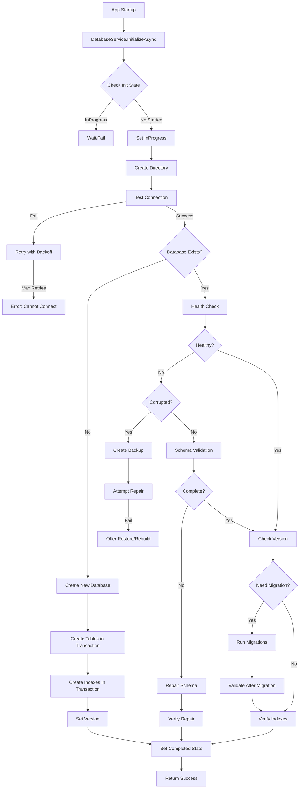

# Design Document: Database Initialization Improvements

## Overview

This design enhances the DatabaseService to provide robust database lifecycle management including initialization, validation, repair, backup, and recovery capabilities. The solution introduces new components for health checking, schema validation, backup management, and improved error handling while maintaining backward compatibility with existing code.

### Key Design Goals

1. **Robustness**: Handle all database states (new, existing, corrupted, incomplete)
2. **Recoverability**: Provide backup and restore capabilities
3. **Observability**: Detailed logging and diagnostics
4. **Performance**: Minimize startup time impact
5. **Maintainability**: Clear separation of concerns with focused components

## Architecture

### Component Overview

```
DatabaseService (Enhanced)
├── DatabaseHealthChecker (New)
│   ├── File Integrity Check
│   ├── Schema Validation
│   └── Health Report Generation
├── DatabaseSchemaValidator (New)
│   ├── Table Structure Validation
│   ├── Column Validation
│   └── Index Validation
├── DatabaseRepairService (New)
│   ├── Missing Table Creation
│   ├── Missing Column Addition
│   └── Missing Index Creation
├── DatabaseBackupManager (New)
│   ├── Backup Creation
│   ├── Backup Restoration
│   └── Backup Lifecycle Management
├── DatabaseMigrationEngine (Enhanced)
│   ├── Transaction-based Migrations
│   ├── Rollback Support
│   └── Validation After Migration
└── InitializationStateManager (New)
    ├── State Tracking
    ├── Concurrency Control
    └── Progress Reporting
```

### Data Flow



## Components and Interfaces

### 1. Enhanced DatabaseService

The main service orchestrates all database operations.

**New Properties:**
```csharp
private readonly DatabaseHealthChecker _healthChecker;
private readonly DatabaseSchemaValidator _schemaValidator;
private readonly DatabaseRepairService _repairService;
private readonly DatabaseBackupManager _backupManager;
private readonly InitializationStateManager _stateManager;
private readonly ILogger _logger; // Simple debug logger
```

**New Methods:**
```csharp
// Enhanced initialization with full lifecycle management
public async Task<InitializationResult> InitializeAsync(
    InitializationOptions options = null);

// Health check
public async Task<DatabaseHealthReport> PerformHealthCheckAsync();

// Repair operations
public async Task<RepairResult> RepairDatabaseAsync(
    RepairOptions options = null);

// Backup operations
public async Task<string> CreateBackupAsync(string backupPath = null);
public async Task RestoreFromBackupAsync(string backupPath);
public async Task<IEnumerable<BackupInfo>> ListBackupsAsync();

// Diagnostics
public async Task<DatabaseDiagnostics> GetDiagnosticsAsync();
public async Task<string> ExportSchemaAsync();
```

### 2. DatabaseHealthChecker (New Component)

Performs comprehensive health checks on the database.

**Interface:**
```csharp
public class DatabaseHealthChecker
{
    private readonly string _connectionString;
    
    public DatabaseHealthChecker(string connectionString);
    
    // Main health check method
    public async Task<DatabaseHealthReport> CheckHealthAsync();
    
    // Individual check methods
    private async Task<bool> CheckFileIntegrityAsync(SqliteConnection conn);
    private async Task<bool> CheckVersionConsistencyAsync(SqliteConnection conn);
    private async Task<bool> CheckForLocksAsync();
    private async Task<List<string>> CheckForeignKeyIntegrityAsync(
        SqliteConnection conn);
}
```

**DatabaseHealthReport Model:**
```csharp
public class DatabaseHealthReport
{
    public HealthStatus OverallStatus { get; set; } // Healthy, Warning, Critical
    public List<HealthIssue> Issues { get; set; }
    public DatabaseMetrics Metrics { get; set; }
    public DateTime CheckedAt { get; set; }
}

public class HealthIssue
{
    public IssueSeverity Severity { get; set; } // Critical, Warning, Info
    public string Category { get; set; } // Integrity, Schema, Performance
    public string Description { get; set; }
    public string Recommendation { get; set; }
}

public enum HealthStatus { Healthy, Warning, Critical, Unknown }
public enum IssueSeverity { Critical, Warning, Info }
```

### 3. DatabaseSchemaValidator (New Component)

Validates database schema against expected structure.

**Interface:**
```csharp
public class DatabaseSchemaValidator
{
    private readonly string _connectionString;
    private readonly Dictionary<string, TableSchema> _expectedSchema;
    
    public DatabaseSchemaValidator(string connectionString);
    
    // Main validation method
    public async Task<SchemaValidationResult> ValidateSchemaAsync();
    
    // Individual validation methods
    private async Task<List<string>> GetMissingTablesAsync(
        SqliteConnection conn);
    private async Task<List<ColumnMismatch>> ValidateTableColumnsAsync(
        SqliteConnection conn, string tableName);
    private async Task<List<string>> GetMissingIndexesAsync(
        SqliteConnection conn);
}
```

**Schema Models:**
```csharp
public class SchemaValidationResult
{
    public bool IsValid { get; set; }
    public List<string> MissingTables { get; set; }
    public List<ColumnMismatch> ColumnMismatches { get; set; }
    public List<string> MissingIndexes { get; set; }
    public List<string> ExtraObjects { get; set; } // Unexpected tables/columns
}

public class TableSchema
{
    public string Name { get; set; }
    public List<ColumnDefinition> Columns { get; set; }
    public List<string> Indexes { get; set; }
    public bool IsCritical { get; set; } // Must exist for app to function
}

public class ColumnDefinition
{
    public string Name { get; set; }
    public string DataType { get; set; }
    public bool IsNullable { get; set; }
    public string DefaultValue { get; set; }
}

public class ColumnMismatch
{
    public string TableName { get; set; }
    public string ColumnName { get; set; }
    public MismatchType Type { get; set; } // Missing, TypeMismatch, NullabilityMismatch
    public string Expected { get; set; }
    public string Actual { get; set; }
}

public enum MismatchType { Missing, TypeMismatch, NullabilityMismatch, ExtraColumn }
```

### 4. DatabaseRepairService (New Component)

Repairs database schema issues automatically.

**Interface:**
```csharp
public class DatabaseRepairService
{
    private readonly string _connectionString;
    private readonly DatabaseSchemaValidator _validator;
    private readonly ILogger _logger;
    
    public DatabaseRepairService(
        string connectionString, 
        DatabaseSchemaValidator validator);
    
    // Main repair method
    public async Task<RepairResult> RepairSchemaAsync(
        SchemaValidationResult validationResult,
        RepairOptions options = null);
    
    // Individual repair operations
    private async Task CreateMissingTablesAsync(
        SqliteConnection conn, 
        List<string> missingTables,
        SqliteTransaction transaction);
        
    private async Task AddMissingColumnsAsync(
        SqliteConnection conn,
        List<ColumnMismatch> mismatches,
        SqliteTransaction transaction);
        
    private async Task CreateMissingIndexesAsync(
        SqliteConnection conn,
        List<string> missingIndexes,
        SqliteTransaction transaction);
}
```

**Repair Models:**
```csharp
public class RepairResult
{
    public bool Success { get; set; }
    public List<RepairAction> ActionsPerformed { get; set; }
    public List<RepairAction> FailedActions { get; set; }
    public string ErrorMessage { get; set; }
}

public class RepairAction
{
    public RepairActionType Type { get; set; }
    public string Target { get; set; } // Table/column/index name
    public string Description { get; set; }
    public bool Success { get; set; }
    public string ErrorMessage { get; set; }
}

public enum RepairActionType
{
    CreateTable,
    AddColumn,
    CreateIndex,
    UpdateConstraint
}

public class RepairOptions
{
    public bool CreateMissingTables { get; set; } = true;
    public bool AddMissingColumns { get; set; } = true;
    public bool CreateMissingIndexes { get; set; } = true;
    public bool BackupBeforeRepair { get; set; } = true;
}
```

### 5. DatabaseBackupManager (New Component)

Manages database backups and restoration.

**Interface:**
```csharp
public class DatabaseBackupManager
{
    private readonly string _databasePath;
    private readonly string _backupDirectory;
    private readonly int _maxBackups;
    
    public DatabaseBackupManager(
        string databasePath, 
        string backupDirectory = null,
        int maxBackups = 5);
    
    // Backup operations
    public async Task<string> CreateBackupAsync(string customPath = null);
    public async Task<bool> VerifyBackupAsync(string backupPath);
    public async Task RestoreFromBackupAsync(string backupPath);
    
    // Backup management
    public async Task<IEnumerable<BackupInfo>> ListBackupsAsync();
    public async Task CleanupOldBackupsAsync();
    public async Task DeleteBackupAsync(string backupPath);
}
```

**Backup Models:**
```csharp
public class BackupInfo
{
    public string FilePath { get; set; }
    public string FileName { get; set; }
    public long FileSize { get; set; }
    public DateTime CreatedAt { get; set; }
    public int DatabaseVersion { get; set; }
    public bool IsVerified { get; set; }
}
```

### 6. Enhanced DatabaseMigrationEngine

Improves the existing migration system with transactions and rollback.

**Enhanced Methods:**
```csharp
private async Task MigrateDatabaseAsync(
    SqliteConnection conn, 
    int fromVersion, 
    int toVersion)
{
    for (int version = fromVersion + 1; version <= toVersion; version++)
    {
        using var transaction = conn.BeginTransaction();
        try
        {
            _logger.Log($"Starting migration to version {version}");
            
            // Perform migration
            await MigrateToVersionAsync(conn, version, transaction);
            
            // Validate after migration
            var validationResult = await _schemaValidator.ValidateSchemaAsync();
            if (!validationResult.IsValid)
            {
                throw new DatabaseMigrationException(
                    $"Schema validation failed after migration to version {version}");
            }
            
            // Update version
            await SetDatabaseVersionAsync(conn, version, transaction);
            
            await transaction.CommitAsync();
            _logger.Log($"Successfully migrated to version {version}");
        }
        catch (Exception ex)
        {
            await transaction.RollbackAsync();
            _logger.LogError($"Migration to version {version} failed: {ex.Message}");
            throw new DatabaseMigrationException(
                $"Failed to migrate to version {version}", ex);
        }
    }
}
```

### 7. InitializationStateManager (New Component)

Manages initialization state and prevents concurrent initialization.

**Interface:**
```csharp
public class InitializationStateManager
{
    private InitializationState _currentState;
    private readonly SemaphoreSlim _stateLock;
    private InitializationProgress _progress;
    
    public InitializationStateManager();
    
    // State management
    public async Task<bool> TryBeginInitializationAsync();
    public void CompleteInitialization(bool success);
    public InitializationState GetCurrentState();
    
    // Progress tracking
    public void UpdateProgress(InitializationStage stage, string message);
    public InitializationProgress GetProgress();
}
```

**State Models:**
```csharp
public enum InitializationState
{
    NotStarted,
    InProgress,
    Completed,
    Failed
}

public enum InitializationStage
{
    DirectoryCreation,
    ConnectionTest,
    HealthCheck,
    SchemaValidation,
    SchemaRepair,
    TableCreation,
    IndexCreation,
    Migration,
    Finalization
}

public class InitializationProgress
{
    public InitializationStage CurrentStage { get; set; }
    public string CurrentMessage { get; set; }
    public DateTime StartedAt { get; set; }
    public DateTime? CompletedAt { get; set; }
    public List<string> CompletedStages { get; set; }
}

public class InitializationResult
{
    public bool Success { get; set; }
    public InitializationState FinalState { get; set; }
    public InitializationStage? FailedStage { get; set; }
    public string ErrorMessage { get; set; }
    public TimeSpan Duration { get; set; }
    public List<string> Warnings { get; set; }
}

public class InitializationOptions
{
    public bool PerformHealthCheck { get; set; } = true;
    public bool AutoRepair { get; set; } = true;
    public bool CreateBackupBeforeRepair { get; set; } = true;
    public int ConnectionRetryCount { get; set; } = 3;
    public TimeSpan ConnectionRetryDelay { get; set; } = TimeSpan.FromSeconds(1);
}
```

## Data Models

### Schema Definition Storage

Store expected schema definitions in a centralized location:

```csharp
public static class DatabaseSchema
{
    public static Dictionary<string, TableSchema> GetExpectedSchema()
    {
        return new Dictionary<string, TableSchema>
        {
            ["Personals"] = new TableSchema
            {
                Name = "Personals",
                IsCritical = true,
                Columns = new List<ColumnDefinition>
                {
                    new() { Name = "Id", DataType = "INTEGER", IsNullable = false },
                    new() { Name = "Name", DataType = "TEXT", IsNullable = false },
                    new() { Name = "Position", DataType = "TEXT", IsNullable = false, DefaultValue = "''" },
                    // ... more columns
                },
                Indexes = new List<string>
                {
                    "idx_personals_name",
                    "idx_personals_available",
                    "idx_personals_retired"
                }
            },
            // ... more tables
        };
    }
}
```

### Diagnostic Models

```csharp
public class DatabaseDiagnostics
{
    public DatabaseInfo BasicInfo { get; set; }
    public DatabaseHealthReport HealthReport { get; set; }
    public SchemaValidationResult SchemaValidation { get; set; }
    public Dictionary<string, int> TableRowCounts { get; set; }
    public List<IndexUsageStats> IndexStats { get; set; }
    public DatabasePerformanceMetrics Performance { get; set; }
}

public class DatabaseMetrics
{
    public long FileSizeBytes { get; set; }
    public int TableCount { get; set; }
    public int IndexCount { get; set; }
    public int TotalRowCount { get; set; }
    public double FragmentationPercentage { get; set; }
}

public class IndexUsageStats
{
    public string IndexName { get; set; }
    public string TableName { get; set; }
    public bool Exists { get; set; }
}

public class DatabasePerformanceMetrics
{
    public TimeSpan LastInitializationTime { get; set; }
    public TimeSpan AverageQueryTime { get; set; }
    public int ConnectionPoolSize { get; set; }
}
```

## Error Handling

### Custom Exceptions

```csharp
public class DatabaseInitializationException : Exception
{
    public InitializationStage FailedStage { get; }
    public DatabaseInitializationException(
        string message, 
        InitializationStage stage, 
        Exception innerException = null)
        : base(message, innerException)
    {
        FailedStage = stage;
    }
}

public class DatabaseMigrationException : Exception
{
    public int TargetVersion { get; }
    public DatabaseMigrationException(
        string message, 
        Exception innerException = null)
        : base(message, innerException) { }
}

public class DatabaseCorruptionException : Exception
{
    public List<string> CorruptionDetails { get; }
    public DatabaseCorruptionException(
        string message, 
        List<string> details)
        : base(message)
    {
        CorruptionDetails = details;
    }
}

public class DatabaseRepairException : Exception
{
    public RepairResult PartialResult { get; }
    public DatabaseRepairException(
        string message, 
        RepairResult partialResult)
        : base(message)
    {
        PartialResult = partialResult;
    }
}
```

### Retry Logic with Exponential Backoff

```csharp
private async Task<T> ExecuteWithRetryAsync<T>(
    Func<Task<T>> operation,
    int maxRetries = 3,
    TimeSpan? initialDelay = null)
{
    var delay = initialDelay ?? TimeSpan.FromSeconds(1);
    Exception lastException = null;
    
    for (int attempt = 0; attempt < maxRetries; attempt++)
    {
        try
        {
            return await operation();
        }
        catch (SqliteException ex) when (ex.SqliteErrorCode == 5) // SQLITE_BUSY
        {
            lastException = ex;
            if (attempt < maxRetries - 1)
            {
                _logger.LogWarning(
                    $"Database locked, retrying in {delay.TotalSeconds}s (attempt {attempt + 1}/{maxRetries})");
                await Task.Delay(delay);
                delay = TimeSpan.FromMilliseconds(delay.TotalMilliseconds * 2); // Exponential backoff
            }
        }
    }
    
    throw new DatabaseInitializationException(
        $"Failed after {maxRetries} attempts", 
        InitializationStage.ConnectionTest, 
        lastException);
}
```

## Testing Strategy

### Unit Tests

1. **DatabaseHealthChecker Tests**
   - Test file integrity check with valid/corrupted databases
   - Test version consistency validation
   - Test foreign key integrity checks
   - Test health report generation

2. **DatabaseSchemaValidator Tests**
   - Test detection of missing tables
   - Test detection of missing columns
   - Test detection of type mismatches
   - Test detection of missing indexes

3. **DatabaseRepairService Tests**
   - Test creation of missing tables
   - Test addition of missing columns
   - Test creation of missing indexes
   - Test transaction rollback on failure

4. **DatabaseBackupManager Tests**
   - Test backup creation and verification
   - Test backup restoration
   - Test backup cleanup (max backups limit)
   - Test backup listing

5. **InitializationStateManager Tests**
   - Test concurrent initialization prevention
   - Test state transitions
   - Test progress tracking

### Integration Tests

1. **Full Initialization Flow**
   - Test new database initialization
   - Test existing database initialization
   - Test corrupted database recovery
   - Test incomplete schema repair

2. **Migration Tests**
   - Test migration from version 1 to 2
   - Test migration rollback on failure
   - Test validation after migration

3. **Error Recovery Tests**
   - Test recovery from locked database
   - Test recovery from permission errors
   - Test recovery from corrupted database

### Performance Tests

1. **Initialization Performance**
   - Measure time for new database creation
   - Measure time for existing database validation
   - Measure time for schema repair operations

2. **Health Check Performance**
   - Measure time for full health check
   - Measure impact on application startup

## Implementation Notes

### Transaction Management

All schema-modifying operations must use transactions:

```csharp
using var transaction = conn.BeginTransaction();
try
{
    // Perform operations
    await transaction.CommitAsync();
}
catch
{
    await transaction.RollbackAsync();
    throw;
}
```

### Logging Strategy

Use a simple logging interface that can be replaced:

```csharp
public interface ILogger
{
    void Log(string message);
    void LogWarning(string message);
    void LogError(string message);
}

// Simple implementation using Debug
public class DebugLogger : ILogger
{
    public void Log(string message) => 
        System.Diagnostics.Debug.WriteLine($"[INFO] {message}");
    public void LogWarning(string message) => 
        System.Diagnostics.Debug.WriteLine($"[WARN] {message}");
    public void LogError(string message) => 
        System.Diagnostics.Debug.WriteLine($"[ERROR] {message}");
}
```

### Backward Compatibility

Maintain existing public API:

```csharp
// Existing method - keep for backward compatibility
public async Task InitializeAsync()
{
    var result = await InitializeAsync(new InitializationOptions());
    if (!result.Success)
    {
        throw new DatabaseInitializationException(
            result.ErrorMessage, 
            result.FailedStage ?? InitializationStage.DirectoryCreation);
    }
}
```

### Configuration

Add configuration options to DatabaseConfiguration:

```csharp
public static class DatabaseConfiguration
{
    // Existing members...
    
    public static int MaxBackupCount { get; set; } = 5;
    public static bool AutoRepairEnabled { get; set; } = true;
    public static bool HealthCheckOnStartup { get; set; } = true;
    public static int ConnectionRetryCount { get; set; } = 3;
    public static TimeSpan ConnectionRetryDelay { get; set; } = TimeSpan.FromSeconds(1);
}
```

## Security Considerations

1. **File Permissions**: Validate that the application has read/write permissions before attempting operations
2. **Backup Security**: Store backups in secure locations with appropriate permissions
3. **SQL Injection**: Use parameterized queries for all dynamic SQL (already implemented)
4. **Connection String Security**: Don't log connection strings that might contain sensitive information

## Performance Optimizations

1. **Lazy Health Checks**: Only perform full health checks when explicitly requested or on first startup
2. **Index Creation**: Create indexes in parallel where possible (SQLite limitation: must be sequential)
3. **Schema Caching**: Cache expected schema definitions to avoid repeated parsing
4. **Backup Compression**: Consider compressing backups to save disk space (future enhancement)

## Migration Path

### Phase 1: Core Infrastructure
- Implement new exception types
- Implement ILogger interface and DebugLogger
- Implement InitializationStateManager
- Update DatabaseService constructor to initialize new components

### Phase 2: Validation and Health Checks
- Implement DatabaseSchema static class
- Implement DatabaseSchemaValidator
- Implement DatabaseHealthChecker
- Add health check to initialization flow

### Phase 3: Repair Capabilities
- Implement DatabaseRepairService
- Integrate repair into initialization flow
- Add repair tests

### Phase 4: Backup and Recovery
- Implement DatabaseBackupManager
- Add backup creation before repairs
- Add restore functionality
- Add backup management UI (future)

### Phase 5: Enhanced Migration
- Update migration engine with transactions
- Add validation after migrations
- Add rollback support

### Phase 6: Testing and Refinement
- Comprehensive unit tests
- Integration tests
- Performance testing
- Documentation updates
