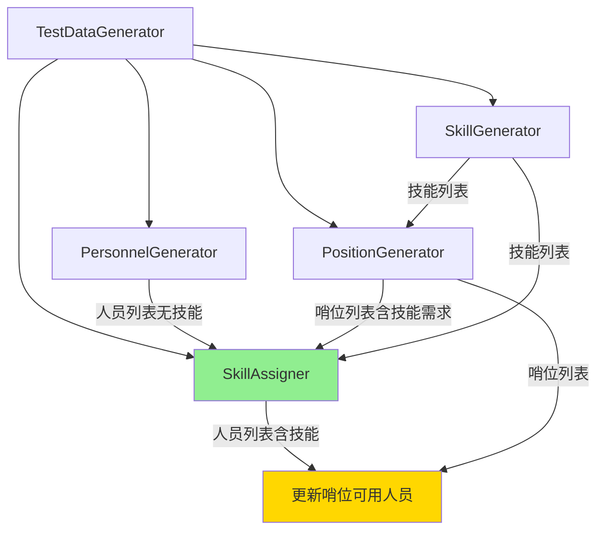

# 设计文档

## 概述

本设计文档描述了如何改进测试数据生成器，使其能够根据哨位的技能需求智能地为人员分配技能。核心改进包括：

1. 调整数据生成顺序：技能 → 人员（无技能）→ 哨位（含技能需求）→ 技能分配 → 其他数据
2. 创建新的 `SkillAssigner` 类，实现智能技能分配算法
3. 修改 `PersonnelGenerator` 和 `PositionGenerator`，移除它们之间的循环依赖
4. 添加配置参数 `MinPersonnelPerPosition`，控制每个哨位的最小可用人员数量

## 架构

### 当前架构问题

当前的生成器存在以下问题：

```
技能 → 人员（随机分配技能）→ 哨位（根据人员技能计算可用人员）
```

问题：
- 人员的技能是随机分配的，不考虑哨位需求
- 可能导致某些哨位找不到符合技能要求的人员
- 生成的数据不够真实，无法有效测试排班算法

### 新架构设计

```
技能 → 人员（无技能）→ 哨位（定义技能需求）→ 技能分配（智能分配）→ 更新哨位可用人员
```

优势：
- 先定义哨位的技能需求，再根据需求分配人员技能
- 确保每个哨位都有足够的符合技能要求的可用人员
- 生成的数据更加真实和可用

### 组件关系图



## 组件和接口

### 1. SkillAssigner（新增）

智能技能分配器，负责根据哨位的技能需求为人员分配技能。

#### 职责

- 分析所有哨位的技能需求
- 为每个哨位确保有足够数量的可用人员
- 为人员分配 1-3 个技能
- 优先为需求人员较少的哨位分配人员
- 创建多技能人员，提高人员复用率

#### 接口设计

```csharp
namespace AutoScheduling3.TestData.Generators;

/// <summary>
/// 技能分配器，根据哨位需求为人员分配技能
/// </summary>
public class SkillAssigner
{
    private readonly TestDataConfiguration _config;
    private readonly Random _random;
    private readonly SkillCooccurrenceAnalyzer _cooccurrenceAnalyzer;

    public SkillAssigner(TestDataConfiguration config, Random random);

    /// <summary>
    /// 根据哨位需求为人员分配技能
    /// </summary>
    /// <param name="personnel">人员列表（无技能）</param>
    /// <param name="positions">哨位列表（含技能需求）</param>
    /// <param name="skills">技能列表</param>
    /// <returns>更新后的人员列表（含技能）</returns>
    public List<PersonnelDto> AssignSkills(
        List<PersonnelDto> personnel,
        List<PositionDto> positions,
        List<SkillDto> skills);
}

/// <summary>
/// 技能共现分析器，分析哨位技能需求的共现模式
/// </summary>
internal class SkillCooccurrenceAnalyzer
{
    /// <summary>
    /// 构建技能共现矩阵
    /// </summary>
    /// <param name="positions">哨位列表</param>
    /// <returns>技能共现矩阵（技能ID对 -> 共现次数）</returns>
    public Dictionary<(int, int), int> BuildCooccurrenceMatrix(List<PositionDto> positions);

    /// <summary>
    /// 获取与指定技能集合高频共现的技能
    /// </summary>
    /// <param name="existingSkillIds">现有技能ID集合</param>
    /// <param name="allSkills">所有技能列表</param>
    /// <param name="topN">返回前N个高频技能</param>
    /// <returns>高频共现的技能列表</returns>
    public List<SkillDto> GetCooccurringSkills(
        HashSet<int> existingSkillIds,
        List<SkillDto> allSkills,
        int topN = 3);
}
```

#### 算法设计

**核心思路：** 优先满足需求人员较少的哨位，确保每个哨位都有足够的可用人员。同时创建一定比例的多技能人员，提高人员复用率，避免技能需求互斥导致的人员分裂问题。

**技能共现策略：** 通过分析哨位的技能需求，找出经常一起出现的技能组合，为部分人员分配这些组合技能，使其能够同时满足多个哨位的需求。例如，如果哨位 A 需要技能 {1, 2}，哨位 B 需要技能 {2, 3}，那么拥有技能 {1, 2, 3} 的人员可以同时满足两个哨位的需求。

**步骤：**

1. **统计哨位需求**
   - 遍历所有哨位，统计每个技能组合的需求数量
   - 计算每个哨位需要的最小人员数量（MinPersonnelPerPosition）

2. **按需求排序**
   - 按照可用人员数量从少到多排序哨位
   - 优先为可用人员较少的哨位分配人员

3. **分配技能（两阶段策略）**
   
   **阶段 1：满足基本需求**
   - 对于每个哨位：
     - 筛选可用且未退役的人员
     - 优先选择技能数量较少的人员（避免过度分配）
     - 为选中的人员添加该哨位所需的所有技能
     - 确保该哨位至少有 MinPersonnelPerPosition 个可用人员
   
   **阶段 2：创建多技能人员（提高复用率）**
   - 计算技能共现频率（哪些技能经常一起出现在哨位需求中）
   - 为 30-40% 的人员添加额外的技能，使其能够满足多个哨位的需求
   - 优先组合高频共现的技能
   - 确保人员技能数量不超过 3 个

4. **补充技能**
   - 对于技能数量为 0 的人员，随机分配 1-2 个技能
   - 对于技能数量为 1 的人员，有 50% 概率再分配 1 个技能
   - 确保每个人员至少有 1 个技能，最多 3 个技能

5. **验证结果**
   - 检查每个哨位的可用人员数量是否满足要求
   - 输出统计信息（每个哨位的可用人员数量、多技能人员比例）

**伪代码：**

```
function AssignSkills(personnel, positions, skills):
    // 1. 初始化人员技能集合
    for each person in personnel:
        person.skillSet = empty set
    
    // 2. 按需求排序哨位（优先满足需求人员较少的哨位）
    sortedPositions = sort positions by (number of available personnel)
    
    // 3. 阶段1：为每个哨位分配基本人员
    for each position in sortedPositions:
        availablePersonnel = filter personnel where (isAvailable and not isRetired)
        
        // 按技能数量排序（优先选择技能少的人员）
        sortedPersonnel = sort availablePersonnel by (skill count)
        
        assignedCount = 0
        for each person in sortedPersonnel:
            if assignedCount >= MinPersonnelPerPosition:
                break
            
            // 检查是否已经符合该哨位的技能要求
            if person.skillSet contains all position.requiredSkills:
                assignedCount++
                continue
            
            // 为该人员添加哨位所需的所有技能
            person.skillSet.addAll(position.requiredSkills)
            assignedCount++
    
    // 4. 阶段2：创建多技能人员（提高复用率）
    // 4.1 计算技能共现矩阵
    skillCooccurrence = build cooccurrence matrix from positions
    
    // 4.2 找出高频技能组合
    topSkillPairs = get top skill pairs from skillCooccurrence
    
    // 4.3 为30-40%的人员添加额外技能
    availablePersonnel = filter personnel where (isAvailable and not isRetired and skillSet.size < 3)
    targetCount = availablePersonnel.size * random(0.3, 0.4)
    
    shuffledPersonnel = shuffle(availablePersonnel)
    for i = 0 to targetCount:
        person = shuffledPersonnel[i]
        
        // 找出与该人员现有技能高频共现的技能
        candidateSkills = find skills that cooccur with person.skillSet
        
        if candidateSkills is not empty and person.skillSet.size < 3:
            // 添加1个高频共现的技能
            newSkill = select random from candidateSkills
            person.skillSet.add(newSkill)
    
    // 5. 补充技能（确保每个人员至少有1个技能）
    for each person in personnel:
        if person.skillSet.size == 0:
            // 随机分配1-2个技能
            count = random(1, 2)
            person.skillSet.addAll(random skills, count)
        else if person.skillSet.size == 1:
            // 50%概率再分配1个技能
            if random() < 0.5:
                person.skillSet.add(random skill)
    
    // 6. 转换为DTO格式
    for each person in personnel:
        person.SkillIds = person.skillSet.map(s => s.Id)
        person.SkillNames = person.skillSet.map(s => s.Name)
    
    return personnel
```

### 2. PersonnelGenerator（修改）

#### 变更内容

- **移除依赖：** 不再接收技能列表作为依赖项
- **移除技能分配：** 不再为人员分配技能
- **初始化技能字段：** 将 `SkillIds` 和 `SkillNames` 设置为空列表
- **使用配置化的可用率和退役率：** 使用 `PersonnelAvailabilityRate` 和 `PersonnelRetirementRate` 配置

#### 修改后的接口

```csharp
/// <summary>
/// 生成人员数据（不分配技能）
/// </summary>
/// <param name="dependencies">无依赖项</param>
/// <returns>生成的人员列表（技能为空）</returns>
public List<PersonnelDto> Generate(params object[] dependencies);
```

#### 修改后的生成逻辑

```csharp
personnel.Add(new PersonnelDto
{
    Id = i,
    Name = name,
    SkillIds = new List<int>(),  // 空列表
    SkillNames = new List<string>(),  // 空列表
    IsAvailable = _random.NextDouble() < _config.PersonnelAvailabilityRate,  // 使用配置的可用率
    IsRetired = _random.NextDouble() < _config.PersonnelRetirementRate,      // 使用配置的退役率
    RecentShiftIntervalCount = _random.Next(0, 20),
    RecentHolidayShiftIntervalCount = _random.Next(0, 10),
    RecentPeriodShiftIntervals = Enumerable.Range(0, 12)
        .Select(_ => _random.Next(0, 15))
        .ToArray()
});
```

### 3. PositionGenerator（修改）

#### 变更内容

- **移除依赖：** 不再接收人员列表作为依赖项
- **移除可用人员计算：** 不再计算 `AvailablePersonnelIds` 和 `AvailablePersonnelNames`
- **初始化可用人员字段：** 将 `AvailablePersonnelIds` 和 `AvailablePersonnelNames` 设置为空列表

#### 修改后的接口

```csharp
/// <summary>
/// 生成哨位数据（不计算可用人员）
/// </summary>
/// <param name="dependencies">生成数据所需的依赖项：[0]=技能列表(List&lt;SkillDto&gt;)</param>
/// <returns>生成的哨位列表（可用人员为空）</returns>
public List<PositionDto> Generate(params object[] dependencies);
```

### 4. TestDataGenerator（修改）

#### 变更内容

- **添加 SkillAssigner 实例**
- **调整生成顺序**
- **添加更新哨位可用人员的逻辑**

#### 新的生成流程

```csharp
public ExportData GenerateTestData()
{
    // 1. 生成技能（无依赖）
    var skills = _skillGenerator.Generate();
    
    // 2. 生成人员（无技能）
    var personnel = _personnelGenerator.Generate();
    
    // 3. 生成哨位（含技能需求，但无可用人员）
    var positions = _positionGenerator.Generate(skills);
    
    // 4. 根据哨位需求为人员分配技能
    personnel = _skillAssigner.AssignSkills(personnel, positions, skills);
    
    // 5. 更新哨位的可用人员列表
    UpdatePositionAvailablePersonnel(positions, personnel);
    
    // 6. 生成其他数据（节假日配置、模板、定岗规则、手动指定）
    var holidayConfigs = _holidayConfigGenerator.Generate();
    var templates = _templateGenerator.Generate(personnel, positions, holidayConfigs);
    var fixedAssignments = _fixedAssignmentGenerator.Generate(personnel, positions);
    var manualAssignments = _manualAssignmentGenerator.Generate(personnel, positions);
    
    // 7. 创建导出数据对象
    var exportData = new ExportData { ... };
    
    // 8. 创建元数据和验证
    exportData.Metadata = _metadataBuilder.Build(exportData);
    _validator.Validate(exportData);
    
    return exportData;
}

/// <summary>
/// 更新哨位的可用人员列表
/// </summary>
private void UpdatePositionAvailablePersonnel(
    List<PositionDto> positions,
    List<PersonnelDto> personnel)
{
    foreach (var position in positions)
    {
        var availablePersonnel = personnel
            .Where(p => p.IsAvailable && !p.IsRetired)
            .Where(p => position.RequiredSkillIds.All(skillId => p.SkillIds.Contains(skillId)))
            .ToList();
        
        position.AvailablePersonnelIds = availablePersonnel.Select(p => p.Id).ToList();
        position.AvailablePersonnelNames = availablePersonnel.Select(p => p.Name).ToList();
    }
}
```

### 5. TestDataConfiguration（修改）

#### 新增配置属性

```csharp
/// <summary>
/// 每个哨位的最小可用人员数量
/// </summary>
public int MinPersonnelPerPosition { get; set; } = 3;

/// <summary>
/// 人员可用率（0.0-1.0），默认 85%
/// </summary>
public double PersonnelAvailabilityRate { get; set; } = 0.85;

/// <summary>
/// 人员退役率（0.0-1.0），默认 10%
/// </summary>
public double PersonnelRetirementRate { get; set; } = 0.10;
```

#### 新增验证规则

```csharp
// 在 Validate() 方法中添加
if (MinPersonnelPerPosition < 1)
    errors.Add("每个哨位的最小可用人员数量至少需要1个，当前值: " + MinPersonnelPerPosition);

if (MinPersonnelPerPosition > PersonnelCount)
    errors.Add($"每个哨位的最小可用人员数量({MinPersonnelPerPosition})不能超过人员总数({PersonnelCount})");

if (PersonnelAvailabilityRate < 0.0 || PersonnelAvailabilityRate > 1.0)
    errors.Add($"人员可用率必须在 0.0-1.0 之间，当前值: {PersonnelAvailabilityRate}");

if (PersonnelRetirementRate < 0.0 || PersonnelRetirementRate > 1.0)
    errors.Add($"人员退役率必须在 0.0-1.0 之间，当前值: {PersonnelRetirementRate}");

if (PersonnelAvailabilityRate + PersonnelRetirementRate > 1.0)
    errors.Add($"人员可用率({PersonnelAvailabilityRate})和退役率({PersonnelRetirementRate})之和不能超过 1.0");

// 警告：如果人员数量不足以满足所有哨位的需求
int totalRequiredPersonnel = PositionCount * MinPersonnelPerPosition;
if (PersonnelCount < totalRequiredPersonnel)
{
    warnings.Add($"人员数量({PersonnelCount})可能不足以满足所有哨位的需求。" +
        $"建议至少 {totalRequiredPersonnel} 个人员（{PositionCount}个哨位 × {MinPersonnelPerPosition}人/哨位）");
}

// 考虑可用率和退役率
double effectiveRate = PersonnelAvailabilityRate * (1.0 - PersonnelRetirementRate);
int effectivePersonnel = (int)(PersonnelCount * effectiveRate);
if (effectivePersonnel < totalRequiredPersonnel)
{
    warnings.Add($"考虑到可用率({PersonnelAvailabilityRate:P0})和退役率({PersonnelRetirementRate:P0})，" +
        $"有效人员数量约为 {effectivePersonnel}，可能不足以满足所有哨位的需求。" +
        $"建议增加人员数量或降低 MinPersonnelPerPosition");
}
```

#### 配置场景示例

```csharp
/// <summary>
/// 创建小型演练配置（高可用率，低退役率）
/// </summary>
public static TestDataConfiguration CreateDrillScenario()
{
    return new TestDataConfiguration
    {
        SkillCount = 5,
        PersonnelCount = 12,
        PositionCount = 6,
        MinPersonnelPerPosition = 3,
        PersonnelAvailabilityRate = 0.95,  // 95% 可用
        PersonnelRetirementRate = 0.05,    // 5% 退役
        TemplateCount = 2,
        FixedAssignmentCount = 3,
        ManualAssignmentCount = 5,
        HolidayConfigCount = 1,
        RandomSeed = 42
    };
}

/// <summary>
/// 创建大型实战配置（较低可用率，较高退役率）
/// </summary>
public static TestDataConfiguration CreateCombatScenario()
{
    return new TestDataConfiguration
    {
        SkillCount = 12,
        PersonnelCount = 40,
        PositionCount = 15,
        MinPersonnelPerPosition = 4,
        PersonnelAvailabilityRate = 0.75,  // 75% 可用
        PersonnelRetirementRate = 0.15,    // 15% 退役
        TemplateCount = 4,
        FixedAssignmentCount = 8,
        ManualAssignmentCount = 12,
        HolidayConfigCount = 2,
        RandomSeed = 42
    };
}
```

## 数据模型

### PersonnelDto（无变更）

```csharp
public class PersonnelDto
{
    public int Id { get; set; }
    public string Name { get; set; }
    public List<int> SkillIds { get; set; }  // 初始为空，由 SkillAssigner 填充
    public List<string> SkillNames { get; set; }  // 初始为空，由 SkillAssigner 填充
    public bool IsAvailable { get; set; }
    public bool IsRetired { get; set; }
    // ... 其他字段
}
```

### PositionDto（无变更）

```csharp
public class PositionDto
{
    public int Id { get; set; }
    public string Name { get; set; }
    public List<int> RequiredSkillIds { get; set; }  // 由 PositionGenerator 填充
    public List<string> RequiredSkillNames { get; set; }  // 由 PositionGenerator 填充
    public List<int> AvailablePersonnelIds { get; set; }  // 初始为空，由 TestDataGenerator 更新
    public List<string> AvailablePersonnelNames { get; set; }  // 初始为空，由 TestDataGenerator 更新
    // ... 其他字段
}
```

## 错误处理

### SkillAssigner 错误处理

1. **人员数量不足**
   - 场景：人员总数少于 `PositionCount * MinPersonnelPerPosition`
   - 处理：输出警告日志，尽力分配，但不保证每个哨位都有足够的人员

2. **技能数量不足**
   - 场景：技能总数少于哨位的最大技能需求数
   - 处理：正常分配，因为哨位的技能需求是从现有技能中选择的

3. **所有人员都不可用或已退役**
   - 场景：所有人员的 `IsAvailable` 为 false 或 `IsRetired` 为 true
   - 处理：输出警告日志，哨位的可用人员列表为空

### TestDataConfiguration 验证增强

添加更多的验证规则，确保配置的合理性（已在上面的"新增验证规则"部分详细说明）。

配置化的可用率和退役率的优势：

1. **灵活性：** 可以根据不同的测试场景调整人员状态分布
2. **真实性：** 可以模拟不同的实战环境（演练 vs 实战）
3. **可预测性：** 可以精确控制有效人员数量，避免数据生成失败

## 测试策略

### 单元测试

1. **SkillAssigner 测试**
   - 测试基本的技能分配功能
   - 测试每个哨位是否有足够的可用人员
   - 测试人员技能数量是否在 1-3 之间
   - 测试边界情况（人员不足、技能不足等）

2. **PersonnelGenerator 测试**
   - 测试生成的人员是否没有技能
   - 测试生成的人员数量是否正确

3. **PositionGenerator 测试**
   - 测试生成的哨位是否没有可用人员
   - 测试生成的哨位技能需求是否正确

4. **TestDataGenerator 集成测试**
   - 测试完整的生成流程
   - 测试生成的数据是否满足所有约束
   - 测试不同配置下的生成结果

### 测试数据验证

使用现有的 `TestDataValidator` 验证生成的数据：

- 每个哨位至少有 `MinPersonnelPerPosition` 个可用人员
- 每个人员至少有 1 个技能，最多 3 个技能
- 哨位的可用人员都符合其技能要求

## 性能考虑

### 时间复杂度

- **SkillAssigner.AssignSkills**: O(P × N)，其中 P 是哨位数量，N 是人员数量
- **UpdatePositionAvailablePersonnel**: O(P × N × S)，其中 S 是平均技能数量

### 优化策略

1. **使用 HashSet 存储技能**
   - 在分配过程中使用 `HashSet<int>` 存储人员的技能 ID
   - 提高技能查找和去重的效率

2. **缓存可用人员**
   - 在分配过程中缓存可用且未退役的人员列表
   - 避免重复过滤

3. **提前终止**
   - 当某个哨位的可用人员数量达到要求时，提前终止该哨位的分配

## 向后兼容性

### 配置兼容性

- 新增的 `MinPersonnelPerPosition` 配置有默认值（3），不影响现有代码
- 现有的配置方法（`CreateDefault`、`CreateSmall`、`CreateLarge`）需要更新以包含新配置

### API 兼容性

- `PersonnelGenerator.Generate()` 的签名改变（不再需要技能列表）
- `PositionGenerator.Generate()` 的签名改变（不再需要人员列表）
- 这些是内部 API，不影响外部使用者

### 数据格式兼容性

- 生成的数据格式（`ExportData`）没有变化
- 导出的 JSON 格式没有变化
- 完全向后兼容
