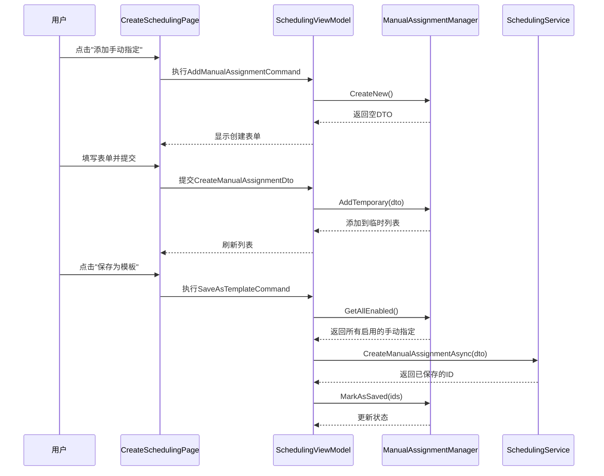

# Design Document

## Overview

本设计文档描述了在排班配置向导的约束配置步骤（第4步）中添加手动指定创建和管理功能的技术实现方案。该功能允许用户在配置排班时创建临时手动指定（仅在当前排班中生效）或将其保存到模板中（在使用该模板时生效）。

设计遵循现有的MVVM架构模式，复用现有的SchedulingService和相关基础设施，确保与现有代码库的一致性和可维护性。

**关键设计原则：**
- 保持单个文件代码行数在合理范围内（<500行）
- 将复杂逻辑拆分为独立的辅助类
- 使用清晰的命名和职责分离

## Architecture

### 整体架构

```
CreateSchedulingPage (View)
    └── SchedulingViewModel (ViewModel)
            ├── ManualAssignmentManager (新增辅助类)
            ├── SchedulingService (排班服务)
            ├── PersonnelService (人员服务)
            └── PositionService (哨位服务)
```

### 组件交互流程



## Components and Interfaces

### 1. ManualAssignmentManager (新增辅助类)

为了避免SchedulingViewModel过于庞大，创建一个专门管理手动指定的辅助类。

**文件位置:** `ViewModels/Scheduling/ManualAssignmentManager.cs`

**职责:**
- 管理临时手动指定列表
- 管理已保存的手动指定列表
- 提供创建、编辑、删除操作
- 区分临时和已保存状态

**关键方法:**

```csharp
public class ManualAssignmentManager
{
    // 临时手动指定（未保存到数据库）
    public ObservableCollection<ManualAssignmentViewModel> TemporaryAssignments { get; }
    
    // 已保存的手动指定（从数据库加载或已持久化）
    public ObservableCollection<ManualAssignmentViewModel> SavedAssignments { get; }
    
    // 所有手动指定（合并视图）
    public ObservableCollection<ManualAssignmentViewModel> AllAssignments { get; }
    
    // 添加临时手动指定
    public void AddTemporary(CreateManualAssignmentDto dto, 
        string personnelName, string positionName);
    
    // 编辑临时手动指定
    public void UpdateTemporary(Guid tempId, UpdateManualAssignmentDto dto,
        string personnelName, string positionName);
    
    // 删除临时手动指定
    public void RemoveTemporary(Guid tempId);
    
    // 加载已保存的手动指定
    public void LoadSaved(IEnumerable<ManualAssignmentDto> assignments);
    
    // 将临时手动指定标记为已保存
    public void MarkAsSaved(Dictionary<Guid, int> tempIdToSavedIdMap);
    
    // 获取所有启用的手动指定（用于排班请求）
    public List<ManualAssignmentRequestItem> GetAllEnabled();
    
    // 清空所有数据
    public void Clear();
}
```

### 2. ManualAssignmentViewModel (新增视图模型)

表示单个手动指定的视图模型，包含UI所需的所有信息。

**文件位置:** `ViewModels/Scheduling/ManualAssignmentViewModel.cs`

**属性:**

```csharp
public class ManualAssignmentViewModel : ObservableObject
{
    // 基本信息
    public int? Id { get; set; } // 数据库ID，临时手动指定为null
    public Guid TempId { get; set; } // 临时唯一标识符，用于临时手动指定
    public DateTime Date { get; set; }
    public int PersonnelId { get; set; }
    public string PersonnelName { get; set; }
    public int PositionId { get; set; }
    public string PositionName { get; set; }
    public int TimeSlot { get; set; }
    public string TimeSlotDisplay { get; set; } // "时段 3 (06:00-08:00)"
    public string Remarks { get; set; }
    
    // 状态
    [ObservableProperty]
    private bool _isEnabled = true;
    
    [ObservableProperty]
    private bool _isTemporary; // true=临时（Id为null），false=已保存（Id有值）
    
    // UI辅助属性
    public bool CanEdit => IsTemporary;
    public bool CanDelete => IsTemporary;
    public string StatusBadge => IsTemporary ? "临时" : "已保存";
}
```

### 3. SchedulingViewModel 扩展

在现有的SchedulingViewModel中添加手动指定管理相关的属性和命令。

**新增属性:**

```csharp
// 手动指定管理器
private readonly ManualAssignmentManager _manualAssignmentManager;

// 所有手动指定（绑定到UI）
public ObservableCollection<ManualAssignmentViewModel> AllManualAssignments 
    => _manualAssignmentManager.AllAssignments;

// 表单相关
[ObservableProperty]
private bool _isCreatingManualAssignment;

[ObservableProperty]
private bool _isEditingManualAssignment;

[ObservableProperty]
private CreateManualAssignmentDto? _newManualAssignment;

[ObservableProperty]
private ManualAssignmentViewModel? _editingManualAssignment;

[ObservableProperty]
private UpdateManualAssignmentDto? _editingManualAssignmentDto;
```

**新增命令:**

```csharp
// 开始创建手动指定
public IRelayCommand StartCreateManualAssignmentCommand { get; }

// 提交创建手动指定
public IRelayCommand SubmitCreateManualAssignmentCommand { get; }

// 取消创建手动指定
public IRelayCommand CancelCreateManualAssignmentCommand { get; }

// 开始编辑手动指定
public IRelayCommand<ManualAssignmentViewModel> StartEditManualAssignmentCommand { get; }

// 提交编辑手动指定
public IRelayCommand SubmitEditManualAssignmentCommand { get; }

// 取消编辑手动指定
public IRelayCommand CancelEditManualAssignmentCommand { get; }

// 删除手动指定
public IAsyncRelayCommand<ManualAssignmentViewModel> DeleteManualAssignmentCommand { get; }
```

### 4. UI组件结构

在CreateSchedulingPage.xaml的步骤4中扩展手动指定区域。

**手动指定区域布局:**

```xml
<StackPanel Spacing="8" BorderBrush="{ThemeResource CardStrokeColorDefaultBrush}" 
            BorderThickness="1" Padding="12" CornerRadius="{StaticResource ControlCornerRadius}">
    <Grid>
        <TextBlock Text="手动指定" Style="{ThemeResource BaseTextBlockStyle}" FontWeight="SemiBold"/>
        <Button Content="添加手动指定" 
                Command="{x:Bind ViewModel.StartCreateManualAssignmentCommand}"
                HorizontalAlignment="Right"/>
    </Grid>
    
    <!-- 手动指定列表 -->
    <ItemsRepeater ItemsSource="{x:Bind ViewModel.AllManualAssignments, Mode=OneWay}">
        <!-- 手动指定卡片 -->
    </ItemsRepeater>
    
    <!-- 空状态 -->
    <TextBlock Text="暂无手动指定" 
               Visibility="{x:Bind ViewModel.AllManualAssignments.Count, ...}"/>
</StackPanel>
```

### 5. 手动指定卡片组件

每条手动指定以卡片形式展示。

**卡片布局:**

```xml
<Border BorderBrush="{ThemeResource CardStrokeColorDefaultBrush}"
        BorderThickness="1" Padding="12" CornerRadius="4" Margin="0,4">
    <Grid ColumnSpacing="12">
        <Grid.ColumnDefinitions>
            <ColumnDefinition Width="Auto"/> <!-- 状态标签 -->
            <ColumnDefinition Width="*"/>    <!-- 内容 -->
            <ColumnDefinition Width="Auto"/> <!-- 操作按钮 -->
        </Grid.ColumnDefinitions>
        
        <!-- 状态标签 -->
        <Border Grid.Column="0" Background="{ThemeResource AccentFillColorDefaultBrush}"
                Padding="8,4" CornerRadius="4"
                Visibility="{x:Bind IsTemporary, Mode=OneWay}">
            <TextBlock Text="临时" FontSize="12"/>
        </Border>
        
        <!-- 内容 -->
        <StackPanel Grid.Column="1" Spacing="4">
            <TextBlock>
                <Run Text="{x:Bind Date, Converter={StaticResource DateTimeFormatConverter}}"/>
                <Run Text=" | "/>
                <Run Text="{x:Bind TimeSlotDisplay}"/>
            </TextBlock>
            <TextBlock>
                <Run Text="{x:Bind PersonnelName}" FontWeight="SemiBold"/>
                <Run Text=" → "/>
                <Run Text="{x:Bind PositionName}" FontWeight="SemiBold"/>
            </TextBlock>
            <TextBlock Text="{x:Bind Remarks}" 
                       Foreground="{ThemeResource TextFillColorSecondaryBrush}"
                       Visibility="{x:Bind Remarks, ...}"/>
        </StackPanel>
        
        <!-- 操作按钮 -->
        <StackPanel Grid.Column="2" Orientation="Horizontal" Spacing="4">
            <ToggleSwitch IsOn="{x:Bind IsEnabled, Mode=TwoWay}" 
                          OnContent="" OffContent=""/>
            <Button Content="编辑" 
                    Command="{x:Bind StartEditCommand}"
                    Visibility="{x:Bind CanEdit}"/>
            <Button Content="删除" 
                    Command="{x:Bind DeleteCommand}"
                    Visibility="{x:Bind CanDelete}"/>
        </StackPanel>
    </Grid>
</Border>
```

### 6. 手动指定表单组件

创建/编辑表单使用Flyout或ContentDialog实现。

**表单字段:**

```xml
<StackPanel Spacing="12">
    <!-- 日期选择 -->
    <CalendarDatePicker Header="日期*" 
                        Date="{x:Bind ViewModel.NewManualAssignment.Date, Mode=TwoWay}"
                        MinDate="{x:Bind ViewModel.StartDate}"
                        MaxDate="{x:Bind ViewModel.EndDate}"/>
    
    <!-- 人员选择 -->
    <ComboBox Header="人员*"
              ItemsSource="{x:Bind ViewModel.SelectedPersonnels, Mode=OneWay}"
              SelectedValue="{x:Bind ViewModel.NewManualAssignment.PersonnelId, Mode=TwoWay}"
              SelectedValuePath="Id"
              DisplayMemberPath="Name"/>
    
    <!-- 哨位选择 -->
    <ComboBox Header="哨位*"
              ItemsSource="{x:Bind ViewModel.SelectedPositions, Mode=OneWay}"
              SelectedValue="{x:Bind ViewModel.NewManualAssignment.PositionId, Mode=TwoWay}"
              SelectedValuePath="Id"
              DisplayMemberPath="Name"/>
    
    <!-- 时段选择 -->
    <ComboBox Header="时段*"
              ItemsSource="{x:Bind ViewModel.TimeSlotOptions, Mode=OneWay}"
              SelectedValue="{x:Bind ViewModel.NewManualAssignment.TimeSlot, Mode=TwoWay}"
              SelectedValuePath="Index"
              DisplayMemberPath="DisplayText"/>
    
    <!-- 描述 -->
    <TextBox Header="描述（可选）"
             Text="{x:Bind ViewModel.NewManualAssignment.Remarks, Mode=TwoWay}"
             MaxLength="200"/>
    
    <!-- 启用状态 -->
    <ToggleSwitch Header="启用"
                  IsOn="{x:Bind ViewModel.NewManualAssignment.IsEnabled, Mode=TwoWay}"/>
</StackPanel>
```

## Data Models

### TimeSlotOption (新增)

用于时段选择下拉列表的显示模型。

```csharp
public class TimeSlotOption
{
    public int Index { get; set; } // 0-11
    public string DisplayText { get; set; } // "时段 0 (00:00-02:00)"
    
    public static List<TimeSlotOption> GetAll()
    {
        var options = new List<TimeSlotOption>();
        for (int i = 0; i < 12; i++)
        {
            var startHour = i * 2;
            var endHour = (i + 1) * 2;
            options.Add(new TimeSlotOption
            {
                Index = i,
                DisplayText = $"时段 {i} ({startHour:D2}:00-{endHour:D2}:00)"
            });
        }
        return options;
    }
}
```

### ManualAssignmentRequestItem (新增)

用于排班请求中的手动指定数据。

```csharp
public class ManualAssignmentRequestItem
{
    public int? Id { get; set; } // null表示临时手动指定
    public DateTime Date { get; set; }
    public int PersonnelId { get; set; }
    public int PositionId { get; set; }
    public int TimeSlot { get; set; }
    public string Remarks { get; set; }
}
```

### SchedulingRequestDto 扩展

在现有的SchedulingRequestDto中添加临时手动指定字段。

```csharp
public class SchedulingRequestDto
{
    // ... 现有字段 ...
    
    // 已保存的手动指定ID列表
    public List<int> EnabledManualAssignmentIds { get; set; }
    
    // 临时手动指定列表（未保存到数据库）
    public List<ManualAssignmentRequestItem> TemporaryManualAssignments { get; set; }
}
```

## Error Handling

### 验证规则

**创建/编辑手动指定时:**
1. 日期必须在排班开始日期和结束日期之间
2. 人员ID必须在已选人员列表中
3. 哨位ID必须在已选哨位列表中
4. 时段必须在0-11范围内
5. 描述长度不超过200字符

**验证实现:**

```csharp
private bool ValidateManualAssignment(
    CreateManualAssignmentDto dto, 
    out string error)
{
    if (dto.Date < StartDate.Date || dto.Date > EndDate.Date)
    {
        error = "日期必须在排班开始日期和结束日期之间";
        return false;
    }
    
    if (!SelectedPersonnels.Any(p => p.Id == dto.PersonnelId))
    {
        error = "选择的人员不在已选人员列表中";
        return false;
    }
    
    if (!SelectedPositions.Any(p => p.Id == dto.PositionId))
    {
        error = "选择的哨位不在已选哨位列表中";
        return false;
    }
    
    if (dto.TimeSlot < 0 || dto.TimeSlot > 11)
    {
        error = "时段必须在0-11之间";
        return false;
    }
    
    error = string.Empty;
    return true;
}
```

### 错误处理策略

- 使用DialogService显示错误消息
- 在ViewModel中捕获异常并转换为用户友好的消息
- 表单验证失败时在字段下方显示错误提示
- 保存模板时手动指定持久化失败需要回滚

## Testing Strategy

### 单元测试

1. **ManualAssignmentManager测试:**
   - 测试添加临时手动指定
   - 测试编辑临时手动指定
   - 测试删除临时手动指定
   - 测试标记为已保存
   - 测试获取所有启用的手动指定

2. **SchedulingViewModel测试:**
   - 测试创建手动指定命令
   - 测试编辑手动指定命令
   - 测试删除手动指定命令
   - 测试保存模板时持久化手动指定
   - 测试执行排班时包含临时手动指定

### 集成测试

1. 测试从创建到显示的完整流程
2. 测试保存模板后临时手动指定转换为已保存状态
3. 测试执行排班时临时手动指定被正确传递
4. 测试从模板加载时手动指定被正确加载

## Implementation Notes

### 关键技术决策

1. **辅助类分离:** 创建ManualAssignmentManager避免SchedulingViewModel过于庞大
2. **临时ID策略:** 使用Guid作为临时手动指定的唯一标识符，避免与数据库ID冲突。临时手动指定的Id属性为null，使用TempId（Guid类型）进行标识
3. **状态管理:** 使用IsTemporary属性区分临时和已保存状态
4. **表单实现:** 使用ContentDialog实现表单，提供更好的用户体验

### 性能考虑

1. 使用ObservableCollection实现增量更新
2. 手动指定列表使用ItemsRepeater提升渲染性能
3. 避免在UI线程执行耗时操作

### 可访问性

1. 所有交互元素提供AutomationProperties
2. 表单字段提供清晰的标签和必填标识
3. 错误消息使用屏幕阅读器可识别的方式显示
4. 支持键盘导航

### 文件大小控制

- ManualAssignmentManager.cs: ~200行
- ManualAssignmentViewModel.cs: ~100行
- SchedulingViewModel.cs 新增代码: ~150行
- CreateSchedulingPage.xaml 新增代码: ~100行
- CreateSchedulingPage.xaml.cs 新增代码: ~50行

总计新增代码约600行，分散在5个文件中，每个文件保持在合理大小。
