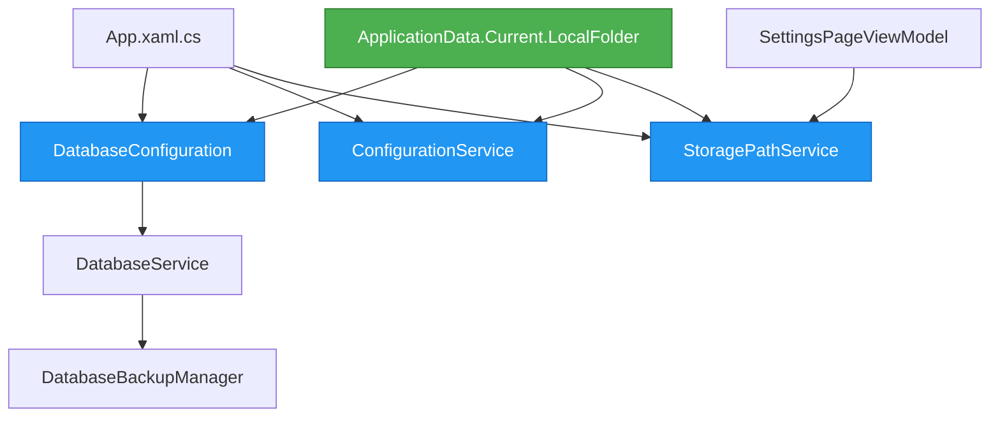

# Design Document

## Overview

本设计文档描述了如何将 AutoScheduling3 应用程序的数据存储从使用 `Environment.SpecialFolder.LocalApplicationData` 迁移到 WinUI3 标准的 `ApplicationData.Current.LocalFolder`。这个变更将确保应用程序符合 WinUI3 的最佳实践，并能够在 Windows 应用商店环境中正确运行。

### 设计目标

1. 使用 WinUI3 标准的 ApplicationData API 管理所有应用程序数据
2. 简化路径管理逻辑，移除不必要的子文件夹层级
3. 确保所有组件使用一致的存储路径
4. 保持代码的可维护性和可测试性
5. 提供清晰的日志记录和错误处理

### 关键变更

- **数据库旧路径**: `%LocalAppData%\AutoScheduling3\GuardDutyScheduling.db`
- **数据库新路径**: `ApplicationData.Current.LocalFolder\GuardDutyScheduling.db`
- **配置文件旧路径**: `%LocalAppData%\AutoScheduling3\config.json`
- **配置文件新路径**: `ApplicationData.Current.LocalFolder\Settings\config.json`
- **备份路径**: `ApplicationData.Current.LocalFolder\backups\`

### 配置文件位置选择

配置文件将存储在 `ApplicationData.Current.LocalFolder\Settings\config.json`，原因：

1. **符合 Windows 应用规范**: Settings 子文件夹是存储应用配置的标准位置
2. **更好的组织结构**: 将配置文件与数据库文件分离，便于管理
3. **未来扩展性**: 可以在 Settings 文件夹中添加更多配置文件
4. **用户友好**: 用户可以更容易地识别和管理配置文件

## Architecture

### 组件关系图



### 数据流

1. **应用启动时**:
   - App.xaml.cs 初始化服务
   - DatabaseConfiguration 使用 ApplicationData.Current.LocalFolder 获取数据库路径
   - ConfigurationService 使用 ApplicationData.Current.LocalFolder 获取配置文件路径
   - DatabaseService 初始化数据库，DatabaseBackupManager 使用新的备份路径

2. **运行时**:
   - 所有数据访问通过相应的服务进行
   - StoragePathService 报告正确的文件路径
   - SettingsPage 显示当前的存储位置

## Components and Interfaces

### 1. DatabaseConfiguration (静态类)

**职责**: 提供数据库路径和连接字符串配置

**关键方法**:

```csharp
public static class DatabaseConfiguration
{
    public const string DefaultDatabaseFileName = "GuardDutyScheduling.db";
    
    /// <summary>
    /// 获取默认数据库路径
    /// 使用 ApplicationData.Current.LocalFolder
    /// </summary>
    public static string GetDefaultDatabasePath();
    
    /// <summary>
    /// 获取备份数据库路径
    /// 备份存储在 LocalFolder/backups 子文件夹中
    /// </summary>
    public static string GetBackupDatabasePath(string originalPath);
    
    /// <summary>
    /// 验证数据库路径
    /// </summary>
    public static bool ValidateDatabasePath(string path);
    
    // 其他现有方法保持不变
}
```

**实现细节**:
- 使用 `Windows.Storage.ApplicationData.Current.LocalFolder.Path` 获取基础路径
- 数据库文件直接存储在 LocalFolder 根目录
- 备份文件存储在 `LocalFolder\backups` 子文件夹
- 移除 "AutoScheduling3" 子文件夹层级

### 2. ConfigurationService

**职责**: 管理应用程序配置文件的读写

**关键变更**:

```csharp
public class ConfigurationService : IConfigurationService
{
    private readonly string _configFilePath;
    
    public ConfigurationService()
    {
        // 使用 ApplicationData.Current.LocalFolder
        var localFolder = Windows.Storage.ApplicationData.Current.LocalFolder.Path;
        var settingsFolder = Path.Combine(localFolder, "Settings");
        
        // 确保 Settings 文件夹存在
        if (!Directory.Exists(settingsFolder))
        {
            Directory.CreateDirectory(settingsFolder);
        }
        
        _configFilePath = Path.Combine(settingsFolder, "config.json");
    }
    
    // 其他方法保持不变
}
```

**实现细节**:
- 配置文件存储在 `LocalFolder\Settings` 子文件夹
- 在初始化时创建 Settings 文件夹（如果不存在）
- 保持现有的 JSON 序列化逻辑
- 配置文件路径: `ApplicationData.Current.LocalFolder\Settings\config.json`

### 3. StoragePathService

**职责**: 提供存储文件信息和路径管理

**关键变更**:

```csharp
public class StoragePathService : IStoragePathService
{
    private string GetConfigurationFilePath()
    {
        var localFolder = Windows.Storage.ApplicationData.Current.LocalFolder.Path;
        var settingsFolder = Path.Combine(localFolder, "Settings");
        return Path.Combine(settingsFolder, "config.json");
    }
    
    // 其他方法保持不变，但使用新的路径获取方式
}
```

**实现细节**:
- 使用 DatabaseConfiguration.GetDefaultDatabasePath() 获取数据库路径
- 使用 ApplicationData.Current.LocalFolder 获取配置文件路径
- 正确报告所有文件的位置和状态

### 4. DatabaseBackupManager

**职责**: 管理数据库备份和恢复

**关键变更**:
- 备份目录从 DatabaseService 初始化时传入
- DatabaseService 使用 `Path.Combine(ApplicationData.Current.LocalFolder.Path, "backups")` 作为备份目录
- 不需要修改 DatabaseBackupManager 的内部逻辑

### 5. SettingsPageViewModel 和 SettingsPage

**职责**: 在设置界面显示存储位置信息

**现有功能**:
- 已经通过 StoragePathService 显示存储文件信息
- 提供复制路径和打开目录的功能
- 显示文件大小、最后修改时间等信息

**无需修改**: 由于 ViewModel 使用 StoragePathService，路径变更会自动反映在界面上

## Data Models

### StorageFileInfo (现有模型)

```csharp
public class StorageFileInfo
{
    public string Name { get; set; }
    public string Description { get; set; }
    public string FullPath { get; set; }
    public StorageFileType Type { get; set; }
    public bool Exists { get; set; }
    public long FileSize { get; set; }
    public DateTime LastModified { get; set; }
    public string ErrorMessage { get; set; }
    
    // 计算属性
    public string StatusText { get; }
    public string FormattedFileSize { get; }
    public string FormattedLastModified { get; }
}
```

无需修改，路径信息会自动更新。

## Error Handling

### 路径访问错误

**场景**: ApplicationData.Current.LocalFolder 不可访问

**处理策略**:
1. 捕获 `UnauthorizedAccessException` 和 `IOException`
2. 记录详细的错误日志
3. 向用户显示友好的错误消息
4. 在 DatabaseService 初始化时抛出 `DatabaseInitializationException`

**示例代码**:

```csharp
try
{
    var localFolder = Windows.Storage.ApplicationData.Current.LocalFolder.Path;
    // 使用路径...
}
catch (UnauthorizedAccessException ex)
{
    _logger.LogError($"无法访问应用程序数据文件夹: {ex.Message}");
    throw new DatabaseInitializationException(
        "权限不足，无法访问应用程序数据文件夹",
        InitializationStage.DirectoryCreation,
        ex);
}
catch (IOException ex)
{
    _logger.LogError($"访问应用程序数据文件夹时发生IO错误: {ex.Message}");
    throw new DatabaseInitializationException(
        "访问应用程序数据文件夹时发生错误",
        InitializationStage.DirectoryCreation,
        ex);
}
```

### 文件夹创建错误

**场景**: 无法创建备份子文件夹

**处理策略**:
1. 在 DatabaseBackupManager 初始化时尝试创建备份文件夹
2. 如果失败，记录警告但不阻止应用启动
3. 在创建备份时再次尝试，如果仍然失败则抛出异常

### 路径验证错误

**场景**: 路径格式无效或不可用

**处理策略**:
1. 在 DatabaseConfiguration.ValidateDatabasePath 中进行验证
2. 返回 false 表示路径无效
3. 调用方根据验证结果决定如何处理

## Testing Strategy

### 单元测试

**DatabaseConfiguration 测试**:
```csharp
[TestClass]
public class DatabaseConfigurationTests
{
    [TestMethod]
    public void GetDefaultDatabasePath_ShouldReturnValidPath()
    {
        // Arrange & Act
        var path = DatabaseConfiguration.GetDefaultDatabasePath();
        
        // Assert
        Assert.IsNotNull(path);
        Assert.IsTrue(path.Contains("GuardDutyScheduling.db"));
        Assert.IsTrue(path.Contains(ApplicationData.Current.LocalFolder.Path));
    }
    
    [TestMethod]
    public void GetBackupDatabasePath_ShouldReturnPathInBackupsFolder()
    {
        // Arrange
        var originalPath = DatabaseConfiguration.GetDefaultDatabasePath();
        
        // Act
        var backupPath = DatabaseConfiguration.GetBackupDatabasePath(originalPath);
        
        // Assert
        Assert.IsTrue(backupPath.Contains("backups"));
        Assert.IsTrue(backupPath.Contains("_backup_"));
    }
}
```

**ConfigurationService 测试**:
```csharp
[TestClass]
public class ConfigurationServiceTests
{
    [TestMethod]
    public async Task ConfigurationService_ShouldUseCorrectPath()
    {
        // Arrange
        var service = new ConfigurationService();
        
        // Act
        await service.InitializeAsync();
        await service.SetValueAsync("test_key", "test_value");
        
        // Assert
        var configPath = Path.Combine(
            ApplicationData.Current.LocalFolder.Path,
            "Settings",
            "config.json");
        Assert.IsTrue(File.Exists(configPath));
    }
}
```

### 集成测试

**完整初始化流程测试**:
```csharp
[TestClass]
public class StorageIntegrationTests
{
    [TestMethod]
    public async Task Application_ShouldInitializeWithNewPaths()
    {
        // Arrange
        var dbPath = DatabaseConfiguration.GetDefaultDatabasePath();
        var dbService = new DatabaseService(dbPath);
        
        // Act
        var result = await dbService.InitializeAsync();
        
        // Assert
        Assert.IsTrue(result.Success);
        Assert.IsTrue(File.Exists(dbPath));
        Assert.IsTrue(dbPath.Contains(ApplicationData.Current.LocalFolder.Path));
    }
    
    [TestMethod]
    public async Task StoragePathService_ShouldReportCorrectPaths()
    {
        // Arrange
        var service = new StoragePathService();
        await service.InitializeAsync();
        
        // Act
        var files = await service.GetStorageFilesAsync();
        
        // Assert
        Assert.IsTrue(files.Any());
        foreach (var file in files)
        {
            Assert.IsTrue(file.FullPath.Contains(ApplicationData.Current.LocalFolder.Path));
        }
    }
}
```

### 手动测试

1. **路径验证**:
   - 启动应用程序
   - 打开设置页面
   - 验证显示的路径是否正确（应该包含 ApplicationData.Current.LocalFolder）
   - 点击"打开目录"按钮，验证是否打开正确的文件夹

2. **数据持久化**:
   - 创建一些数据（人员、哨位等）
   - 关闭应用程序
   - 重新启动应用程序
   - 验证数据是否正确加载

3. **备份功能**:
   - 在设置或数据管理页面创建备份
   - 验证备份文件是否存储在 `ApplicationData.Current.LocalFolder\backups`
   - 尝试恢复备份，验证功能正常

## Implementation Notes

### 使用 Windows.Storage API

WinUI3 应用程序应该使用 `Windows.Storage.ApplicationData` API 而不是 `Environment.SpecialFolder`:

```csharp
// 旧方式（不推荐）
var appDataPath = Environment.GetFolderPath(Environment.SpecialFolder.LocalApplicationData);
var appFolder = Path.Combine(appDataPath, "AutoScheduling3");

// 新方式（推荐）
var localFolder = Windows.Storage.ApplicationData.Current.LocalFolder.Path;
```

### 命名空间引用

需要添加以下命名空间引用：

```csharp
using Windows.Storage;
```

### 路径组织

移除不必要的 "AutoScheduling3" 子文件夹层级，使用更清晰的结构：

**数据库文件**:
- **旧**: `%LocalAppData%\AutoScheduling3\GuardDutyScheduling.db`
- **新**: `ApplicationData.Current.LocalFolder\GuardDutyScheduling.db`

**配置文件**:
- **旧**: `%LocalAppData%\AutoScheduling3\config.json`
- **新**: `ApplicationData.Current.LocalFolder\Settings\config.json`

**备份文件**:
- **新**: `ApplicationData.Current.LocalFolder\backups\`

ApplicationData.Current.LocalFolder 已经是应用程序专用的文件夹，不需要额外的应用名称子文件夹。使用 Settings 子文件夹来组织配置文件，使结构更清晰。

### 日志记录

在所有路径相关操作中添加详细的日志记录：

```csharp
_logger.Log($"Using LocalFolder path: {ApplicationData.Current.LocalFolder.Path}");
_logger.Log($"Database path: {dbPath}");
_logger.Log($"Backup directory: {backupDirectory}");
```

### 向后兼容性考虑

虽然需求中明确不迁移旧数据，但代码中应该：
1. 完全移除旧路径的引用
2. 不包含检测旧路径的逻辑
3. 始终使用新路径创建文件

## Performance Considerations

### 路径获取性能

`ApplicationData.Current.LocalFolder.Path` 的访问是快速的，但建议：
1. 在服务初始化时获取并缓存路径
2. 避免在循环中重复获取

**示例**:

```csharp
public class ConfigurationService : IConfigurationService
{
    private readonly string _configFilePath;
    private static readonly string LocalFolderPath = 
        Windows.Storage.ApplicationData.Current.LocalFolder.Path;
    
    public ConfigurationService()
    {
        var settingsFolder = Path.Combine(LocalFolderPath, "Settings");
        if (!Directory.Exists(settingsFolder))
        {
            Directory.CreateDirectory(settingsFolder);
        }
        _configFilePath = Path.Combine(settingsFolder, "config.json");
    }
}
```

### 文件系统操作

所有文件系统操作保持异步：
- 使用 `async/await` 模式
- 避免阻塞 UI 线程
- 在后台线程执行 I/O 操作

## Security Considerations

### 权限管理

ApplicationData.Current.LocalFolder 是应用程序沙箱的一部分：
- 应用程序自动拥有读写权限
- 其他应用程序无法访问
- 用户可以通过系统设置清除应用数据

### 数据保护

- 敏感数据应该加密存储
- 配置文件中不应包含明文密码
- 数据库连接字符串应该安全管理

### 备份安全

- 备份文件与主数据库享有相同的安全级别
- 备份文件夹在应用程序沙箱内
- 用户可以通过设置界面访问备份位置

## Deployment Considerations

### 应用商店部署

使用 ApplicationData.Current.LocalFolder 确保应用程序：
1. 符合 Windows 应用商店的要求
2. 可以正确处理应用程序沙箱
3. 支持应用程序数据的备份和恢复

### 开发和测试

在开发环境中：
- LocalFolder 路径通常在 `%LocalAppData%\Packages\<PackageFamilyName>\LocalState`
- 每次重新部署应用程序时，PackageFamilyName 可能会变化
- 测试时注意清理旧的应用数据

### 日志和诊断

在应用启动时记录实际使用的路径：

```csharp
System.Diagnostics.Debug.WriteLine($"Application LocalFolder: {ApplicationData.Current.LocalFolder.Path}");
System.Diagnostics.Debug.WriteLine($"Database path: {DatabaseConfiguration.GetDefaultDatabasePath()}");
```

这有助于在不同环境中诊断路径相关问题。
