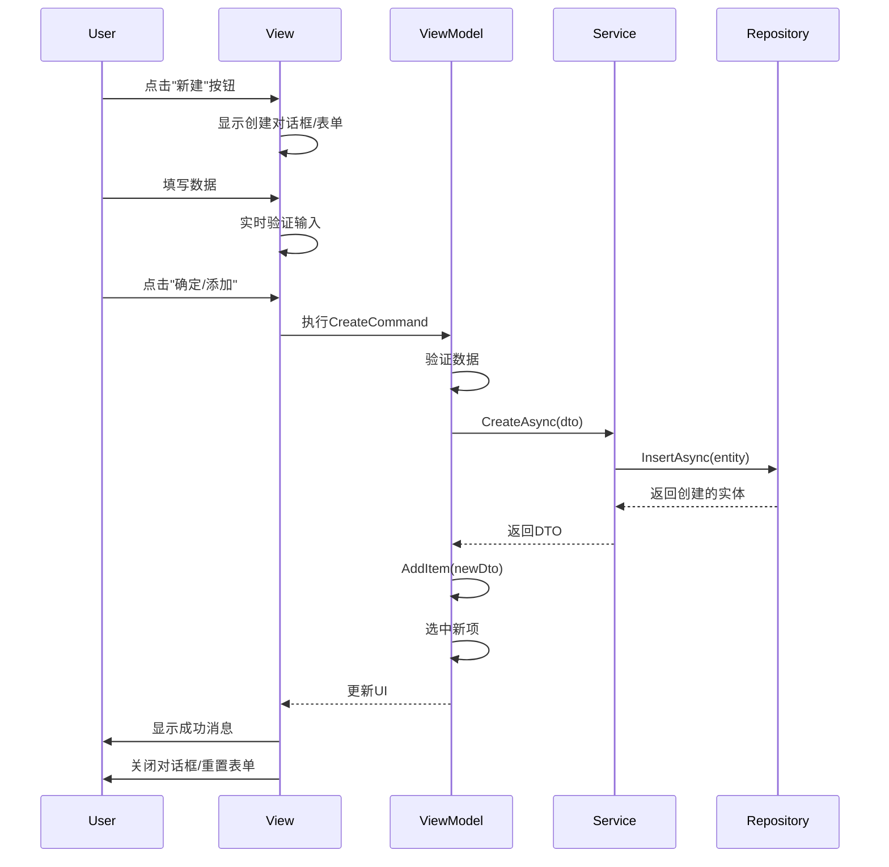

# 设计文档

## 概述

本设计文档描述了如何优化自动排班系统中的数据创建流程。主要目标是修复技能和哨位管理页面中"新建"按钮无响应的问题，并改进整体的用户体验。

核心设计决策：
- 为技能和哨位管理页面实现ContentDialog创建对话框
- 优化人员管理页面的内联表单验证
- 统一所有创建流程的用户反馈机制
- 确保对话框正确配置XamlRoot以避免显示问题

## 架构

### 组件层次结构

```
Views (XAML Pages)
├── PersonnelPage
│   ├── Inline Create Form (Expander)
│   └── Personnel List (GridView)
├── PositionPage
│   ├── Create Dialog (ContentDialog)
│   └── Position List (ListView)
└── SkillPage
    ├── Create Dialog (ContentDialog)
    └── Skill Grid (GridView)

ViewModels
├── PersonnelViewModel
│   ├── CreateCommand
│   ├── NewPersonnel (CreatePersonnelDto)
│   └── Validation Logic
├── PositionViewModel
│   ├── CreateCommand
│   ├── NewPosition (CreatePositionDto)
│   └── Validation Logic
└── SkillViewModel
    ├── CreateCommand
    ├── NewSkill (CreateSkillDto)
    └── Validation Logic

Helpers
└── DialogService
    ├── ShowMessageAsync
    ├── ShowErrorAsync
    ├── ShowSuccessAsync
    └── ShowConfirmAsync
```

### 数据流



## 组件和接口

### 1. 技能创建对话框

#### XAML结构
```xml
<ContentDialog x:Name="CreateSkillDialog"
               Title="创建新技能"
               PrimaryButtonText="创建"
               SecondaryButtonText="取消"
               DefaultButton="Primary">
    <StackPanel Spacing="12">
        <TextBox x:Name="SkillNameTextBox"
                 Header="技能名称*"
                 PlaceholderText="请输入技能名称"
                 MaxLength="50"/>
        <TextBox x:Name="SkillDescriptionTextBox"
                 Header="技能描述"
                 PlaceholderText="请输入技能描述（可选）"
                 MaxLength="200"
                 AcceptsReturn="True"
                 TextWrapping="Wrap"
                 Height="80"/>
    </StackPanel>
</ContentDialog>
```

#### 代码后置逻辑
```csharp
// SkillPage.xaml.cs
private async void CreateSkill_Click(object sender, RoutedEventArgs e)
{
    var dialog = new ContentDialog
    {
        Title = "创建新技能",
        PrimaryButtonText = "创建",
        SecondaryButtonText = "取消",
        DefaultButton = ContentDialogButton.Primary,
        XamlRoot = this.XamlRoot
    };
    
    var nameTextBox = new TextBox
    {
        Header = "技能名称*",
        PlaceholderText = "请输入技能名称",
        MaxLength = 50
    };
    
    var descriptionTextBox = new TextBox
    {
        Header = "技能描述",
        PlaceholderText = "请输入技能描述（可选）",
        MaxLength = 200,
        AcceptsReturn = true,
        TextWrapping = TextWrapping.Wrap,
        Height = 80
    };
    
    var stackPanel = new StackPanel { Spacing = 12 };
    stackPanel.Children.Add(nameTextBox);
    stackPanel.Children.Add(descriptionTextBox);
    
    dialog.Content = stackPanel;
    
    // 验证逻辑
    dialog.PrimaryButtonClick += (s, args) =>
    {
        if (string.IsNullOrWhiteSpace(nameTextBox.Text))
        {
            args.Cancel = true;
            // 显示错误提示
        }
    };
    
    var result = await dialog.ShowAsync();
    
    if (result == ContentDialogResult.Primary)
    {
        ViewModel.NewSkill.Name = nameTextBox.Text.Trim();
        ViewModel.NewSkill.Description = descriptionTextBox.Text.Trim();
        await ViewModel.CreateCommand.ExecuteAsync(null);
    }
}
```

### 2. 哨位创建对话框

#### XAML结构
```xml
<ContentDialog x:Name="CreatePositionDialog"
               Title="创建新哨位"
               PrimaryButtonText="创建"
               SecondaryButtonText="取消"
               DefaultButton="Primary">
    <ScrollViewer MaxHeight="500">
        <StackPanel Spacing="12">
            <TextBox x:Name="PositionNameTextBox"
                     Header="哨位名称*"
                     PlaceholderText="请输入哨位名称"
                     MaxLength="100"/>
            <TextBox x:Name="PositionLocationTextBox"
                     Header="地点*"
                     PlaceholderText="请输入地点"
                     MaxLength="200"/>
            <TextBox x:Name="PositionDescriptionTextBox"
                     Header="介绍"
                     PlaceholderText="请输入介绍（可选）"
                     MaxLength="500"
                     AcceptsReturn="True"
                     TextWrapping="Wrap"
                     Height="80"/>
            <StackPanel>
                <TextBlock Text="所需技能*" Style="{StaticResource BodyStrongTextBlockStyle}"/>
                <ListView x:Name="RequiredSkillsListView"
                          ItemsSource="{x:Bind ViewModel.AvailableSkills}"
                          SelectionMode="Multiple"
                          MaxHeight="150">
                    <ListView.ItemTemplate>
                        <DataTemplate x:DataType="local:SkillDto">
                            <TextBlock Text="{x:Bind Name}"/>
                        </DataTemplate>
                    </ListView.ItemTemplate>
                </ListView>
            </StackPanel>
        </StackPanel>
    </ScrollViewer>
</ContentDialog>
```

### 3. 人员创建表单验证

#### ViewModel属性
```csharp
// PersonnelViewModel.cs
private bool _isNameValid = false;
private bool _areSkillsValid = false;
private string _nameValidationMessage = string.Empty;
private string _skillsValidationMessage = string.Empty;

public bool IsNameValid
{
    get => _isNameValid;
    set => SetProperty(ref _isNameValid, value);
}

public bool AreSkillsValid
{
    get => _areSkillsValid;
    set => SetProperty(ref _areSkillsValid, value);
}

public string NameValidationMessage
{
    get => _nameValidationMessage;
    set => SetProperty(ref _nameValidationMessage, value);
}

public string SkillsValidationMessage
{
    get => _skillsValidationMessage;
    set => SetProperty(ref _skillsValidationMessage, value);
}

public bool CanCreate => IsNameValid && AreSkillsValid;

// 验证方法
public void ValidateName()
{
    if (string.IsNullOrWhiteSpace(NewPersonnel.Name))
    {
        IsNameValid = false;
        NameValidationMessage = "姓名不能为空";
    }
    else if (NewPersonnel.Name.Length > 50)
    {
        IsNameValid = false;
        NameValidationMessage = "姓名长度不能超过50字符";
    }
    else
    {
        IsNameValid = true;
        NameValidationMessage = string.Empty;
    }
    
    CreateCommand.NotifyCanExecuteChanged();
}

public void ValidateSkills()
{
    if (NewPersonnel.SkillIds == null || NewPersonnel.SkillIds.Count == 0)
    {
        AreSkillsValid = false;
        SkillsValidationMessage = "至少需要选择一项技能";
    }
    else
    {
        AreSkillsValid = true;
        SkillsValidationMessage = string.Empty;
    }
    
    CreateCommand.NotifyCanExecuteChanged();
}
```

#### XAML绑定
```xml
<TextBox Header="姓名*" 
         Text="{x:Bind ViewModel.NewPersonnel.Name, Mode=TwoWay, UpdateSourceTrigger=PropertyChanged}"
         PlaceholderText="请输入姓名"
         TextChanged="NameTextBox_TextChanged"/>
<TextBlock Text="{x:Bind ViewModel.NameValidationMessage, Mode=OneWay}"
           Foreground="Red"
           Visibility="{x:Bind ViewModel.IsNameValid, Mode=OneWay, Converter={StaticResource BoolToVisibilityConverter}, ConverterParameter=Inverse}"/>
```

### 4. 创建成功后的处理

#### ViewModel逻辑
```csharp
private async Task CreatePersonnelAsync()
{
    await ExecuteAsync(async () =>
    {
        var created = await _personnelService.CreateAsync(NewPersonnel);
        
        // 添加到列表
        AddItem(created);
        
        // 自动选中新创建的项
        SelectedItem = created;
        
        // 重置表单
        ResetCreateForm();
        
        // 显示成功消息
        await _dialogService.ShowSuccessAsync("人员创建成功！");
    }, "正在创建人员...");
}

private void ResetCreateForm()
{
    NewPersonnel = new CreatePersonnelDto
    {
        IsAvailable = true,
        RecentPeriodShiftIntervals = new int[12]
    };
    
    // 重置验证状态
    IsNameValid = false;
    AreSkillsValid = false;
    NameValidationMessage = string.Empty;
    SkillsValidationMessage = string.Empty;
}
```

#### View代码后置
```csharp
// PersonnelPage.xaml.cs
private void ResetForm_Click(object sender, RoutedEventArgs e)
{
    ViewModel.ResetCreateForm();
    
    // 清除ListView选择
    SkillsListView.SelectedItems.Clear();
    
    // 聚焦到姓名输入框
    NameTextBox.Focus(FocusState.Programmatic);
}

private void NameTextBox_TextChanged(object sender, TextChangedEventArgs e)
{
    ViewModel.ValidateName();
}

private void SkillsListView_SelectionChanged(object sender, SelectionChangedEventArgs e)
{
    // 更新ViewModel中的技能ID列表
    ViewModel.NewPersonnel.SkillIds.Clear();
    foreach (var item in SkillsListView.SelectedItems)
    {
        if (item is SkillDto skill)
        {
            ViewModel.NewPersonnel.SkillIds.Add(skill.Id);
        }
    }
    
    ViewModel.ValidateSkills();
}
```

## 数据模型

### CreateSkillDto
```csharp
public class CreateSkillDto
{
    [Required(ErrorMessage = "技能名称不能为空")]
    [StringLength(50, MinimumLength = 1)]
    public string Name { get; set; } = string.Empty;
    
    [StringLength(200)]
    public string? Description { get; set; }
}
```

### CreatePositionDto
```csharp
public class CreatePositionDto
{
    [Required(ErrorMessage = "哨位名称不能为空")]
    [StringLength(100, MinimumLength = 1)]
    public string Name { get; set; } = string.Empty;
    
    [Required(ErrorMessage = "地点不能为空")]
    [StringLength(200, MinimumLength = 1)]
    public string Location { get; set; } = string.Empty;
    
    [StringLength(500)]
    public string? Description { get; set; }
    
    [StringLength(1000)]
    public string? Requirements { get; set; }
    
    [Required(ErrorMessage = "技能列表不能为空")]
    [MinLength(1, ErrorMessage = "至少需要选择一项技能")]
    public List<int> RequiredSkillIds { get; set; } = new();
    
    public List<int> AvailablePersonnelIds { get; set; } = new();
}
```

### CreatePersonnelDto
```csharp
public class CreatePersonnelDto
{
    [Required(ErrorMessage = "姓名不能为空")]
    [StringLength(50, MinimumLength = 1)]
    public string Name { get; set; } = string.Empty;
    
    [Required(ErrorMessage = "技能列表不能为空")]
    [MinLength(1, ErrorMessage = "至少需要选择一项技能")]
    public List<int> SkillIds { get; set; } = new();
    
    public bool IsAvailable { get; set; } = true;
    
    [Range(0, 999)]
    public int RecentShiftIntervalCount { get; set; }
    
    [Range(0, 999)]
    public int RecentHolidayShiftIntervalCount { get; set; }
    
    [Required]
    [MinLength(12)]
    [MaxLength(12)]
    public int[] RecentPeriodShiftIntervals { get; set; } = new int[12];
}
```

## 错误处理

### 对话框显示错误处理

```csharp
private async Task ShowCreateDialogAsync()
{
    try
    {
        var dialog = new ContentDialog
        {
            Title = "创建新技能",
            XamlRoot = this.XamlRoot
        };
        
        if (dialog.XamlRoot == null)
        {
            System.Diagnostics.Debug.WriteLine("XamlRoot is null, cannot show dialog");
            await ViewModel.DialogService.ShowErrorAsync("无法显示对话框，请刷新页面后重试");
            return;
        }
        
        await dialog.ShowAsync();
    }
    catch (Exception ex)
    {
        System.Diagnostics.Debug.WriteLine($"Failed to show dialog: {ex.Message}");
        await ViewModel.DialogService.ShowErrorAsync("显示对话框时发生错误", ex);
    }
}
```

### 验证错误处理

```csharp
private async Task CreateWithValidationAsync()
{
    try
    {
        // 验证输入
        if (!ValidateInput())
        {
            return;
        }
        
        // 执行创建
        await ViewModel.CreateCommand.ExecuteAsync(null);
    }
    catch (ValidationException vex)
    {
        await ViewModel.DialogService.ShowErrorAsync("验证失败", vex);
    }
    catch (Exception ex)
    {
        await ViewModel.DialogService.ShowErrorAsync("创建失败", ex);
    }
}

private bool ValidateInput()
{
    var errors = new List<string>();
    
    if (string.IsNullOrWhiteSpace(nameTextBox.Text))
    {
        errors.Add("姓名不能为空");
    }
    
    if (skillsListView.SelectedItems.Count == 0)
    {
        errors.Add("至少需要选择一项技能");
    }
    
    if (errors.Any())
    {
        var errorMessage = string.Join("\n", errors);
        _ = ViewModel.DialogService.ShowErrorAsync("请修正以下错误", new ValidationException(errorMessage));
        return false;
    }
    
    return true;
}
```

### 服务层错误处理

```csharp
// PersonnelService.cs
public async Task<PersonnelDto> CreateAsync(CreatePersonnelDto dto)
{
    try
    {
        // 验证DTO
        ValidateDto(dto);
        
        // 转换为实体
        var entity = _mapper.Map(dto);
        
        // 保存到数据库
        var id = await _repository.InsertAsync(entity);
        
        // 返回创建的DTO
        return await GetByIdAsync(id);
    }
    catch (ValidationException)
    {
        throw; // 重新抛出验证异常
    }
    catch (Exception ex)
    {
        _logger.LogError(ex, "Failed to create personnel");
        throw new ApplicationException("创建人员失败，请稍后重试", ex);
    }
}
```

## 测试策略

### 单元测试

#### ViewModel测试
```csharp
[TestClass]
public class PersonnelViewModelTests
{
    [TestMethod]
    public void ValidateName_EmptyName_ShouldSetInvalid()
    {
        // Arrange
        var viewModel = CreateViewModel();
        viewModel.NewPersonnel.Name = "";
        
        // Act
        viewModel.ValidateName();
        
        // Assert
        Assert.IsFalse(viewModel.IsNameValid);
        Assert.AreEqual("姓名不能为空", viewModel.NameValidationMessage);
    }
    
    [TestMethod]
    public void ValidateSkills_NoSkillsSelected_ShouldSetInvalid()
    {
        // Arrange
        var viewModel = CreateViewModel();
        viewModel.NewPersonnel.SkillIds.Clear();
        
        // Act
        viewModel.ValidateSkills();
        
        // Assert
        Assert.IsFalse(viewModel.AreSkillsValid);
        Assert.AreEqual("至少需要选择一项技能", viewModel.SkillsValidationMessage);
    }
    
    [TestMethod]
    public async Task CreatePersonnelAsync_ValidData_ShouldAddToList()
    {
        // Arrange
        var viewModel = CreateViewModel();
        viewModel.NewPersonnel.Name = "测试人员";
        viewModel.NewPersonnel.SkillIds.Add(1);
        
        // Act
        await viewModel.CreateCommand.ExecuteAsync(null);
        
        // Assert
        Assert.AreEqual(1, viewModel.Items.Count);
        Assert.IsNotNull(viewModel.SelectedItem);
    }
}
```

#### 对话框测试
```csharp
[TestClass]
public class SkillDialogTests
{
    [TestMethod]
    public async Task CreateSkillDialog_ValidInput_ShouldCreateSkill()
    {
        // Arrange
        var page = new SkillPage();
        await page.ViewModel.LoadDataAsync();
        
        // Act
        // 模拟对话框输入
        page.ViewModel.NewSkill.Name = "新技能";
        page.ViewModel.NewSkill.Description = "测试描述";
        await page.ViewModel.CreateCommand.ExecuteAsync(null);
        
        // Assert
        Assert.IsTrue(page.ViewModel.Items.Any(s => s.Name == "新技能"));
    }
}
```

### 集成测试

```csharp
[TestClass]
public class DataCreationFlowTests
{
    [TestMethod]
    public async Task CreateSkill_ThenCreatePosition_ShouldWork()
    {
        // Arrange
        var skillService = GetService<ISkillService>();
        var positionService = GetService<IPositionService>();
        
        // Act - 创建技能
        var skillDto = new CreateSkillDto { Name = "测试技能" };
        var createdSkill = await skillService.CreateAsync(skillDto);
        
        // Act - 创建哨位
        var positionDto = new CreatePositionDto
        {
            Name = "测试哨位",
            Location = "测试地点",
            RequiredSkillIds = new List<int> { createdSkill.Id }
        };
        var createdPosition = await positionService.CreateAsync(positionDto);
        
        // Assert
        Assert.IsNotNull(createdPosition);
        Assert.AreEqual(1, createdPosition.RequiredSkillIds.Count);
    }
}
```

### UI自动化测试

```csharp
[TestClass]
public class PersonnelPageUITests
{
    [TestMethod]
    public async Task FillPersonnelForm_WithValidData_ShouldEnableCreateButton()
    {
        // Arrange
        var page = await LaunchPage<PersonnelPage>();
        
        // Act
        await page.EnterText("NameTextBox", "测试人员");
        await page.SelectListViewItem("SkillsListView", 0);
        
        // Assert
        var createButton = page.FindElement("CreateButton");
        Assert.IsTrue(createButton.IsEnabled);
    }
}
```

## 性能考虑

### 对话框创建优化
- 对话框内容使用延迟加载，只在显示时创建UI元素
- 技能列表使用虚拟化ListView以支持大量数据
- 避免在对话框中进行复杂的数据绑定

### 表单验证优化
- 使用防抖（debounce）机制，避免频繁验证
- 验证逻辑在后台线程执行，不阻塞UI
- 缓存验证结果，避免重复验证

### 列表更新优化
- 使用ObservableCollection的增量更新而非完全刷新
- 新创建的项直接添加到列表，无需重新加载
- 使用虚拟化控件处理大量数据

```csharp
// 防抖验证示例
private DispatcherTimer _validationTimer;

private void InitializeValidationTimer()
{
    _validationTimer = new DispatcherTimer
    {
        Interval = TimeSpan.FromMilliseconds(300)
    };
    _validationTimer.Tick += (s, e) =>
    {
        _validationTimer.Stop();
        ViewModel.ValidateName();
    };
}

private void NameTextBox_TextChanged(object sender, TextChangedEventArgs e)
{
    _validationTimer.Stop();
    _validationTimer.Start();
}
```

## 可访问性

### 键盘导航
- 所有对话框支持Tab键在输入框间导航
- Enter键提交表单（如果验证通过）
- Escape键关闭对话框
- 对话框打开时自动聚焦第一个输入框
- Shift+Tab支持反向导航

### 屏幕阅读器支持
- 所有输入框都有明确的Header标签
- 验证错误消息使用AutomationProperties.LiveSetting
- 必填字段在Header中标注星号(*)
- 错误消息与对应的输入框关联

```xml
<TextBox Header="姓名*"
         AutomationProperties.Name="姓名，必填"
         AutomationProperties.HelpText="请输入人员姓名，最多50个字符"/>

<TextBlock Text="{x:Bind ViewModel.NameValidationMessage}"
           Foreground="Red"
           AutomationProperties.LiveSetting="Assertive"/>
```

### 焦点管理
- 对话框打开时，焦点自动移到第一个输入框
- 表单重置后，焦点返回到第一个输入框
- 验证失败时，焦点移到第一个错误字段

## 安全考虑

### 输入验证
- 所有用户输入在客户端和服务端都进行验证
- 使用DataAnnotations进行模型验证
- 防止SQL注入（使用参数化查询）
- 限制输入长度防止缓冲区溢出

### XSS防护
- 所有用户输入在显示前进行HTML编码
- 使用WinUI的内置文本控件，自动处理特殊字符

## 部署考虑

### 向后兼容性
- 新的对话框功能不影响现有的内联表单
- 数据库schema保持不变
- API接口保持向后兼容

### 配置
- 对话框尺寸可通过资源字典配置
- 验证规则可通过配置文件调整
- 错误消息支持本地化

## 设计决策记录

### 决策1：使用ContentDialog而非自定义窗口
**原因：**
- ContentDialog是WinUI 3的标准组件，与系统主题自动集成
- 自动处理模态行为和焦点管理
- 减少代码复杂度

**权衡：**
- ContentDialog的自定义能力有限
- 但对于简单的创建表单已经足够

### 决策2：人员管理保持内联表单
**原因：**
- 人员创建是最频繁的操作，内联表单减少点击次数
- 用户可以同时查看列表和表单，便于参考
- 已有的实现工作良好，只需增强验证

**权衡：**
- 三个页面的创建方式不完全一致
- 但各自适合其使用场景

### 决策3：实时验证而非提交时验证
**原因：**
- 即时反馈改善用户体验
- 减少提交失败的情况
- 用户可以边填写边纠正错误

**权衡：**
- 增加了一些UI复杂度
- 但显著提升了可用性

### 决策4：创建成功后自动选中新项
**原因：**
- 用户通常需要查看或编辑刚创建的项
- 提供即时的视觉反馈
- 符合用户的心理预期

**权衡：**
- 可能打断用户的批量创建流程
- 但可以通过保持表单展开来缓解
