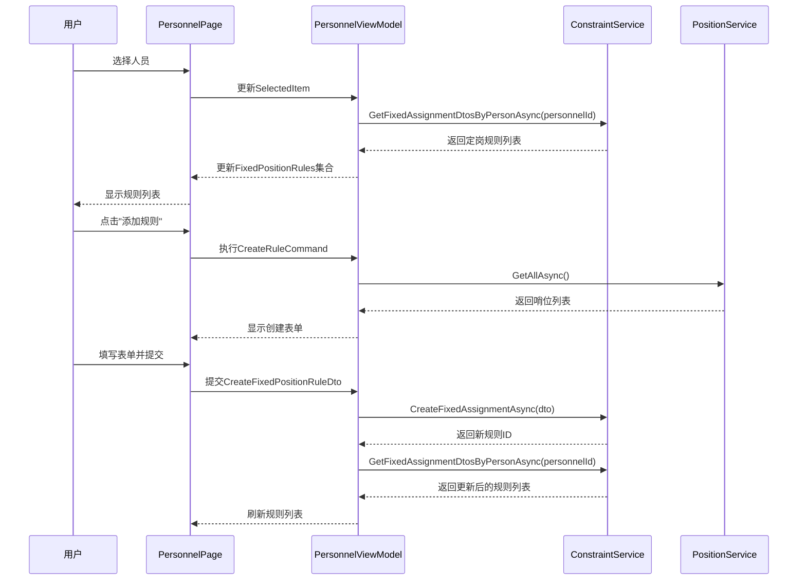

# Design Document

## Overview

本设计文档描述了在人员管理页面的人员详情面板中集成定岗规则管理功能的技术实现方案。该功能将允许用户在查看人员详情时,直接管理该人员的定岗规则,包括创建、查看、编辑和删除操作。

设计遵循现有的MVVM架构模式,复用现有的ConstraintService和相关基础设施,确保与现有代码库的一致性和可维护性。

## Architecture

### 整体架构

```
PersonnelPage (View)
    └── PersonnelViewModel (ViewModel)
            ├── PersonnelService (数据服务)
            ├── ConstraintService (约束服务)
            └── PositionService (哨位服务)
```

### 组件交互流程



## Components and Interfaces

### 1. PersonnelViewModel 扩展

在现有的PersonnelViewModel中添加定岗规则管理相关的属性和命令。

**新增属性:**


```csharp
// 定岗规则集合
public ObservableCollection<FixedAssignmentDto> FixedPositionRules { get; }

// 可选哨位列表
public ObservableCollection<PositionDto> AvailablePositions { get; }

// 新建规则DTO
public CreateFixedAssignmentDto NewFixedPositionRule { get; set; }

// 编辑中的规则DTO
public UpdateFixedAssignmentDto? EditingFixedPositionRule { get; set; }

// 是否正在编辑规则
public bool IsEditingRule { get; set; }

// 选中的规则
public FixedAssignmentDto? SelectedRule { get; set; }
```

**新增命令:**

```csharp
// 加载规则列表
public IAsyncRelayCommand LoadFixedPositionRulesCommand { get; }

// 创建规则
public IAsyncRelayCommand CreateFixedPositionRuleCommand { get; }

// 开始编辑规则
public IAsyncRelayCommand<FixedAssignmentDto> StartEditRuleCommand { get; }

// 保存规则编辑
public IAsyncRelayCommand SaveFixedPositionRuleCommand { get; }

// 取消规则编辑
public IRelayCommand CancelRuleEditCommand { get; }

// 删除规则
public IAsyncRelayCommand<FixedAssignmentDto> DeleteFixedPositionRuleCommand { get; }
```

### 2. UI组件结构

在PersonnelPage.xaml的人员详情区域添加定岗规则管理部分:

```xml
<Expander Header="定岗规则" IsExpanded="False">
    <StackPanel Spacing="12">
        <!-- 规则列表 -->
        <ItemsRepeater ItemsSource="{x:Bind ViewModel.FixedPositionRules, Mode=OneWay}">
            <!-- 规则卡片 -->
        </ItemsRepeater>
        
        <!-- 空状态 -->
        <TextBlock Text="暂无定岗规则" Visibility="{...}"/>
        
        <!-- 添加规则按钮 -->
        <Button Content="添加定岗规则" Command="{x:Bind ViewModel.CreateFixedPositionRuleCommand}"/>
    </StackPanel>
</Expander>
```

### 3. 规则卡片组件

每条规则以卡片形式展示,包含以下信息:

- 允许的哨位列表(以标签形式显示)
- 允许的时段列表(以标签形式显示)
- 规则描述
- 启用状态开关
- 编辑和删除按钮

### 4. 规则表单组件

创建/编辑表单包含以下字段:

- 允许的哨位(多选列表,使用ListView + SelectionMode="Multiple")
- 允许的时段(多选列表,显示时段序号和时间范围)
- 规则描述(TextBox)
- 启用状态(ToggleSwitch)

## Data Models

### 简化的FixedAssignmentDto

由于现有的FixedAssignmentDto包含了不必要的StartDate/EndDate字段,我们需要创建一个简化版本或调整现有DTO:

```csharp
public class SimpleFixedAssignmentDto
{
    public int Id { get; set; }
    public int PersonnelId { get; set; }
    public string PersonnelName { get; set; }
    public List<int> AllowedPositionIds { get; set; }
    public List<string> AllowedPositionNames { get; set; }
    public List<int> AllowedPeriods { get; set; }
    public bool IsEnabled { get; set; }
    public string Description { get; set; }
}
```

### 时段显示模型

```csharp
public class TimeSlotDisplayModel
{
    public int Index { get; set; }
    public string DisplayText { get; set; } // "0 (00:00-02:00)"
    public bool IsSelected { get; set; }
}
```

## Error Handling

### 验证规则

1. **创建规则时:**
   - 至少选择一个哨位或一个时段(不能两者都为空)
   - 规则描述长度不超过500字符
   - 时段索引必须在0-11范围内

2. **编辑规则时:**
   - 与创建规则相同的验证规则

3. **删除规则时:**
   - 显示确认对话框
   - 删除失败时显示错误消息

### 错误处理策略

- 使用DialogService显示错误消息
- 在ViewModel中捕获异常并转换为用户友好的消息
- 网络或数据库错误时提供重试选项

## Testing Strategy

### 单元测试

1. **PersonnelViewModel测试:**
   - 测试LoadFixedPositionRulesCommand加载规则列表
   - 测试CreateFixedPositionRuleCommand创建规则
   - 测试UpdateFixedPositionRuleCommand更新规则
   - 测试DeleteFixedPositionRuleCommand删除规则
   - 测试验证逻辑

2. **ConstraintService测试:**
   - 已有现成的测试,无需额外添加

### 集成测试

1. 测试从选择人员到显示规则列表的完整流程
2. 测试创建规则后规则列表自动刷新
3. 测试编辑规则后UI正确更新
4. 测试删除规则后规则从列表中移除

### UI测试

1. 测试响应式布局在不同屏幕尺寸下的表现
2. 测试规则卡片的显示效果
3. 测试表单验证的视觉反馈
4. 测试空状态的显示

## Implementation Notes

### 关键技术决策

1. **复用现有服务:** 直接使用ConstraintService,无需创建新的服务层
2. **DTO简化:** 由于FixedPositionRule模型不包含StartDate/EndDate,在UI层忽略这些字段
3. **响应式设计:** 遵循现有的ResponsiveHelper模式
4. **MVVM模式:** 严格遵循现有的MVVM架构

### 性能考虑

1. 规则列表使用ItemsRepeater而非ListView,提升渲染性能
2. 仅在选中人员变化时加载规则列表,避免不必要的查询
3. 使用ObservableCollection实现增量更新,避免全量刷新

### 可访问性

1. 所有交互元素提供AutomationProperties
2. 表单字段提供清晰的标签
3. 错误消息使用屏幕阅读器可识别的方式显示
4. 支持键盘导航

### 国际化

1. 所有UI文本使用资源字符串
2. 时段显示支持24小时制
3. 日期格式遵循系统区域设置
