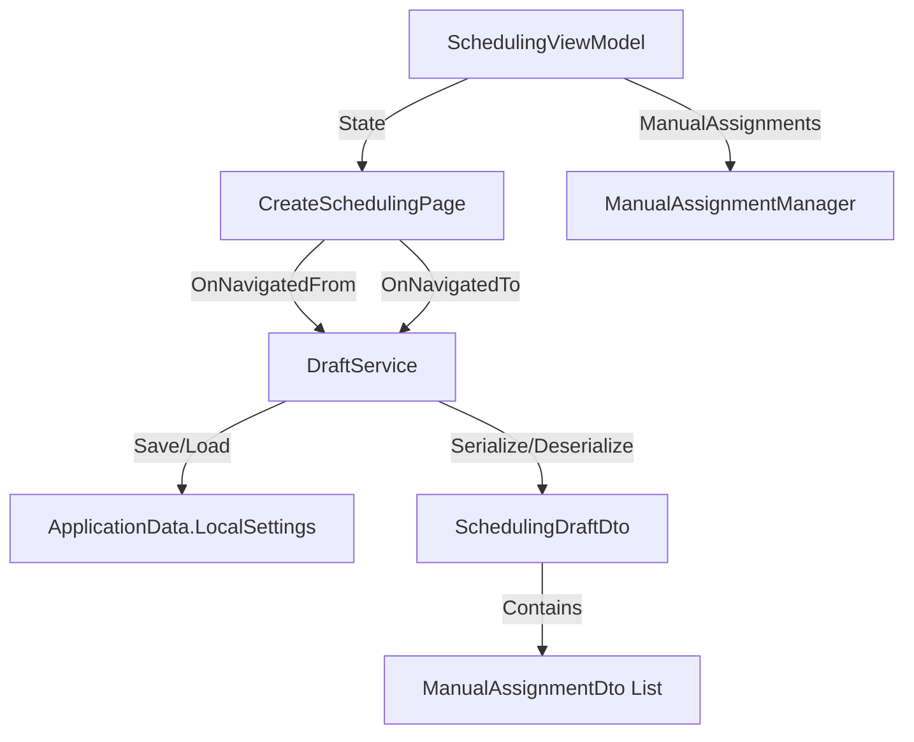
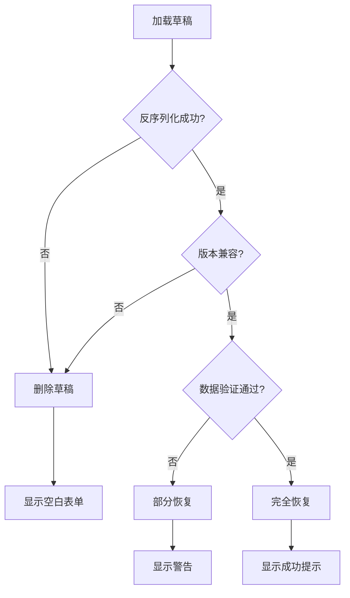

# Design Document

## Overview

本设计文档描述了排班创建进度持久化功能的技术实现方案。该功能通过在CreateSchedulingPage的导航生命周期中保存和恢复SchedulingViewModel的状态，实现用户在页面切换时不丢失创建进度。

核心设计原则：
- 利用WinUI 3的ApplicationData.LocalSettings进行本地持久化
- 使用JSON序列化存储复杂对象状态
- 最小化对现有代码的侵入性
- 确保数据一致性和错误恢复能力

## Architecture

### 组件架构图



### 数据流

1. **保存流程**：
   - 用户导航离开 → OnNavigatedFrom触发
   - 收集ViewModel状态 → 创建SchedulingDraftDto
   - JSON序列化 → 保存到ApplicationData.LocalSettings

2. **恢复流程**：
   - 用户导航进入 → OnNavigatedTo触发
   - 从ApplicationData.LocalSettings读取 → JSON反序列化
   - 验证数据有效性 → 恢复ViewModel状态


## Components and Interfaces

### 1. SchedulingDraftDto

用于序列化和反序列化排班创建进度的数据传输对象。

```csharp
public class SchedulingDraftDto
{
    // 基本信息
    public string ScheduleTitle { get; set; }
    public DateTime StartDate { get; set; }
    public DateTime EndDate { get; set; }
    public int CurrentStep { get; set; }
    
    // 模板相关
    public bool TemplateApplied { get; set; }
    public int? LoadedTemplateId { get; set; }
    
    // 选择的人员和岗位
    public List<int> SelectedPersonnelIds { get; set; }
    public List<int> SelectedPositionIds { get; set; }
    
    // 约束配置
    public bool UseActiveHolidayConfig { get; set; }
    public int? SelectedHolidayConfigId { get; set; }
    public List<int> EnabledFixedRuleIds { get; set; }
    public List<int> EnabledManualAssignmentIds { get; set; }
    
    // 手动指定（临时和已保存）
    public List<ManualAssignmentDraftDto> TemporaryManualAssignments { get; set; }
    
    // 元数据
    public DateTime SavedAt { get; set; }
    public string Version { get; set; } // 用于版本兼容性检查
}

public class ManualAssignmentDraftDto
{
    public DateTime Date { get; set; }
    public int PersonnelId { get; set; }
    public int PositionId { get; set; }
    public int TimeSlot { get; set; }
    public string Remarks { get; set; }
    public bool IsEnabled { get; set; }
    public Guid TempId { get; set; } // 用于临时手动指定的唯一标识
}
```


### 2. ISchedulingDraftService

草稿管理服务接口，负责草稿的保存、加载和清理。

```csharp
public interface ISchedulingDraftService
{
    /// <summary>
    /// 保存排班创建草稿
    /// </summary>
    Task SaveDraftAsync(SchedulingDraftDto draft);
    
    /// <summary>
    /// 加载最近的排班创建草稿
    /// </summary>
    Task<SchedulingDraftDto?> LoadDraftAsync();
    
    /// <summary>
    /// 删除排班创建草稿
    /// </summary>
    Task DeleteDraftAsync();
    
    /// <summary>
    /// 检查是否存在草稿
    /// </summary>
    Task<bool> HasDraftAsync();
    
    /// <summary>
    /// 清理过期草稿（超过7天）
    /// </summary>
    Task CleanupExpiredDraftsAsync();
}
```

### 3. SchedulingDraftService 实现

```csharp
public class SchedulingDraftService : ISchedulingDraftService
{
    private const string DraftKey = "SchedulingCreationDraft";
    private const string DraftTimestampKey = "SchedulingCreationDraftTimestamp";
    private const int ExpirationDays = 7;
    
    private readonly ApplicationDataContainer _localSettings;
    
    public SchedulingDraftService()
    {
        _localSettings = ApplicationData.Current.LocalSettings;
    }
    
    public async Task SaveDraftAsync(SchedulingDraftDto draft)
    {
        draft.SavedAt = DateTime.UtcNow;
        draft.Version = "1.0"; // 当前版本
        
        var json = JsonSerializer.Serialize(draft, new JsonSerializerOptions
        {
            WriteIndented = false,
            PropertyNamingPolicy = JsonNamingPolicy.CamelCase
        });
        
        _localSettings.Values[DraftKey] = json;
        _localSettings.Values[DraftTimestampKey] = DateTime.UtcNow.Ticks;
        
        await Task.CompletedTask;
    }
    
    // 其他方法实现...
}
```


### 4. CreateSchedulingPage 修改

在CreateSchedulingPage中添加草稿保存和恢复逻辑。

```csharp
public sealed partial class CreateSchedulingPage : Page
{
    private ISchedulingDraftService _draftService;
    private bool _isDraftRestored = false;
    
    public CreateSchedulingPage()
    {
        this.InitializeComponent();
        ViewModel = (App.Current as App).ServiceProvider.GetRequiredService<SchedulingViewModel>();
        _draftService = (App.Current as App).ServiceProvider.GetRequiredService<ISchedulingDraftService>();
        ViewModel.PropertyChanged += ViewModel_PropertyChanged;
    }
    
    protected override async void OnNavigatedTo(NavigationEventArgs e)
    {
        base.OnNavigatedTo(e);
        
        // 检查是否有草稿
        if (await _draftService.HasDraftAsync() && !_isDraftRestored)
        {
            // 询问用户是否恢复草稿
            var dialog = new ContentDialog
            {
                Title = "恢复进度",
                Content = "检测到未完成的排班创建，是否恢复？",
                PrimaryButtonText = "恢复",
                SecondaryButtonText = "重新开始",
                DefaultButton = ContentDialogButton.Primary,
                XamlRoot = this.XamlRoot
            };
            
            var result = await dialog.ShowAsync();
            
            if (result == ContentDialogResult.Primary)
            {
                await RestoreDraftAsync();
                _isDraftRestored = true;
                return;
            }
            else
            {
                // 用户选择重新开始，删除草稿
                await _draftService.DeleteDraftAsync();
            }
        }
        
        // 原有的初始化逻辑
        if (!_isDraftRestored)
        {
            ViewModel.CancelCommand.Execute(null);
            
            if (e.Parameter is int templateId && templateId > 0)
            {
                _ = ViewModel.LoadTemplateCommand.ExecuteAsync(templateId);
            }
            else
            {
                _ = ViewModel.LoadDataCommand.ExecuteAsync(null);
            }
        }
    }
    
    protected override async void OnNavigatedFrom(NavigationEventArgs e)
    {
        base.OnNavigatedFrom(e);
        
        // 保存草稿（如果有进度）
        if (ShouldSaveDraft())
        {
            await SaveDraftAsync();
        }
        
        ViewModel.PropertyChanged -= ViewModel_PropertyChanged;
    }
    
    private bool ShouldSaveDraft()
    {
        // 判断是否有值得保存的进度
        return !string.IsNullOrWhiteSpace(ViewModel.ScheduleTitle) ||
               ViewModel.SelectedPersonnels.Count > 0 ||
               ViewModel.SelectedPositions.Count > 0 ||
               ViewModel.AllManualAssignments.Count > 0;
    }
}
```


## Data Models

### 草稿数据结构

草稿数据包含以下几个主要部分：

1. **基本信息**：
   - ScheduleTitle: 排班标题
   - StartDate/EndDate: 日期范围
   - CurrentStep: 当前步骤（1-5）

2. **模板信息**：
   - TemplateApplied: 是否应用了模板
   - LoadedTemplateId: 加载的模板ID

3. **选择数据**：
   - SelectedPersonnelIds: 选中的人员ID列表
   - SelectedPositionIds: 选中的岗位ID列表

4. **约束配置**：
   - UseActiveHolidayConfig: 是否使用活动休息日配置
   - SelectedHolidayConfigId: 选中的休息日配置ID
   - EnabledFixedRuleIds: 启用的固定规则ID列表
   - EnabledManualAssignmentIds: 启用的已保存手动指定ID列表

5. **临时手动指定**：
   - TemporaryManualAssignments: 临时手动指定列表（未保存到数据库的）

### 数据验证规则

加载草稿时需要验证：

1. **版本兼容性**：检查Version字段，确保数据格式兼容
2. **日期有效性**：StartDate不能早于当前日期
3. **引用完整性**：
   - SelectedPersonnelIds中的ID必须在AvailablePersonnels中存在
   - SelectedPositionIds中的ID必须在AvailablePositions中存在
   - LoadedTemplateId引用的模板必须存在
4. **数据一致性**：
   - 如果TemplateApplied为true，LoadedTemplateId不能为null
   - CurrentStep必须在1-5之间


## Error Handling

### 错误场景和处理策略

1. **草稿加载失败**
   - 场景：JSON反序列化失败、数据格式错误
   - 处理：记录错误日志，删除损坏的草稿，显示空白表单
   - 用户提示：使用InfoBar显示"无法恢复之前的进度，已重置"

2. **模板不存在**
   - 场景：LoadedTemplateId引用的模板已被删除
   - 处理：设置TemplateApplied为false，切换到手动模式
   - 用户提示：使用ContentDialog显示"模板已不存在，将以手动模式继续"

3. **人员/岗位不存在**
   - 场景：SelectedPersonnelIds或SelectedPositionIds中的ID在数据库中不存在
   - 处理：过滤掉不存在的ID，仅恢复存在的项
   - 用户提示：使用InfoBar显示"部分人员/岗位已不存在，已自动移除"

4. **日期冲突**
   - 场景：StartDate早于当前日期
   - 处理：自动调整StartDate为当前日期，EndDate相应调整
   - 用户提示：使用ContentDialog显示"开始日期已过期，已自动调整为今天"

5. **手动指定数据不一致**
   - 场景：临时手动指定中的PersonnelId或PositionId不在选中列表中
   - 处理：跳过该手动指定，记录警告日志
   - 用户提示：使用InfoBar显示"部分手动指定无效，已自动移除"

### 错误恢复流程




## Testing Strategy

### 单元测试

1. **SchedulingDraftService测试**
   - 测试保存和加载草稿
   - 测试草稿过期清理
   - 测试并发访问安全性

2. **数据验证测试**
   - 测试版本兼容性检查
   - 测试引用完整性验证
   - 测试日期有效性验证

3. **序列化测试**
   - 测试SchedulingDraftDto的JSON序列化和反序列化
   - 测试包含复杂对象（如ManualAssignmentDraftDto列表）的序列化

### 集成测试

1. **页面导航测试**
   - 测试OnNavigatedFrom保存草稿
   - 测试OnNavigatedTo恢复草稿
   - 测试用户选择"重新开始"时删除草稿

2. **ViewModel状态恢复测试**
   - 测试基本属性恢复（ScheduleTitle、StartDate等）
   - 测试集合属性恢复（SelectedPersonnels、SelectedPositions）
   - 测试ManualAssignmentManager状态恢复

3. **错误场景测试**
   - 测试模板不存在时的降级处理
   - 测试人员/岗位不存在时的过滤处理
   - 测试日期冲突时的自动调整

### 手动测试场景

1. **基本流程**
   - 创建排班 → 填写部分信息 → 导航到其他页面 → 返回 → 验证信息已恢复

2. **模板模式**
   - 加载模板 → 修改部分配置 → 导航离开 → 返回 → 验证模板和修改都已恢复

3. **手动指定**
   - 添加临时手动指定 → 导航离开 → 返回 → 验证手动指定已恢复

4. **成功创建后清理**
   - 创建排班 → 成功生成 → 再次进入创建页面 → 验证草稿已清除

5. **取消时保留选项**
   - 填写信息 → 点击取消 → 选择保留草稿 → 再次进入 → 验证草稿已保留


## Implementation Details

### 1. 草稿保存时机

草稿保存在以下时机触发：

- **OnNavigatedFrom**：用户导航离开CreateSchedulingPage时
- **不保存的情况**：
  - 用户刚进入页面，没有任何输入
  - 用户已成功创建排班（ResultSchedule不为null）

### 2. 草稿恢复流程

```csharp
private async Task RestoreDraftAsync()
{
    try
    {
        var draft = await _draftService.LoadDraftAsync();
        if (draft == null) return;
        
        // 1. 验证版本兼容性
        if (draft.Version != "1.0")
        {
            await _dialogService.ShowWarningAsync("草稿版本不兼容，无法恢复");
            await _draftService.DeleteDraftAsync();
            return;
        }
        
        // 2. 加载基础数据
        await ViewModel.LoadDataCommand.ExecuteAsync(null);
        
        // 3. 恢复基本属性
        ViewModel.ScheduleTitle = draft.ScheduleTitle;
        ViewModel.StartDate = new DateTimeOffset(draft.StartDate);
        ViewModel.EndDate = new DateTimeOffset(draft.EndDate);
        ViewModel.CurrentStep = draft.CurrentStep;
        
        // 4. 恢复模板信息
        ViewModel.TemplateApplied = draft.TemplateApplied;
        ViewModel.LoadedTemplateId = draft.LoadedTemplateId;
        
        // 5. 恢复选中的人员和岗位
        await RestoreSelectedPersonnelAndPositionsAsync(draft);
        
        // 6. 恢复约束配置
        await RestoreConstraintsAsync(draft);
        
        // 7. 恢复手动指定
        await RestoreManualAssignmentsAsync(draft);
        
        await _dialogService.ShowSuccessAsync("进度已恢复");
    }
    catch (Exception ex)
    {
        System.Diagnostics.Debug.WriteLine($"恢复草稿失败: {ex.Message}");
        await _dialogService.ShowWarningAsync("无法恢复之前的进度");
        await _draftService.DeleteDraftAsync();
    }
}
```

### 3. 手动指定恢复

手动指定的恢复需要特别处理，因为ManualAssignmentManager区分已保存和临时两种类型：

```csharp
private async Task RestoreManualAssignmentsAsync(SchedulingDraftDto draft)
{
    // 1. 恢复已保存的手动指定（通过LoadConstraintsAsync已加载）
    // 只需要设置启用状态
    foreach (var assignment in ViewModel.ManualAssignments)
    {
        assignment.IsEnabled = draft.EnabledManualAssignmentIds.Contains(assignment.Id);
    }
    
    // 2. 恢复临时手动指定
    foreach (var tempDto in draft.TemporaryManualAssignments)
    {
        // 验证人员和岗位是否存在
        var personnel = ViewModel.SelectedPersonnels.FirstOrDefault(p => p.Id == tempDto.PersonnelId);
        var position = ViewModel.SelectedPositions.FirstOrDefault(p => p.Id == tempDto.PositionId);
        
        if (personnel == null || position == null)
        {
            System.Diagnostics.Debug.WriteLine($"跳过无效的临时手动指定: PersonnelId={tempDto.PersonnelId}, PositionId={tempDto.PositionId}");
            continue;
        }
        
        var createDto = new CreateManualAssignmentDto
        {
            Date = tempDto.Date,
            PersonnelId = tempDto.PersonnelId,
            PositionId = tempDto.PositionId,
            TimeSlot = tempDto.TimeSlot,
            Remarks = tempDto.Remarks,
            IsEnabled = tempDto.IsEnabled
        };
        
        ViewModel._manualAssignmentManager.AddTemporary(createDto, personnel.Name, position.Name);
    }
}
```

### 4. 成功创建后清理草稿

在ExecuteSchedulingAsync成功后，需要清理草稿：

```csharp
// 在SchedulingViewModel.ExecuteSchedulingAsync中
try
{
    var schedule = await _schedulingService.ExecuteSchedulingAsync(request);
    ResultSchedule = schedule;
    
    // 清理草稿
    await _draftService.DeleteDraftAsync();
    
    await _dialogService.ShowSuccessAsync("排班生成成功");
    _navigation_service.NavigateTo("ScheduleResult", schedule.Id);
}
catch (Exception ex)
{
    // 错误处理...
}
```

### 5. 取消时的草稿处理

修改CancelCommand，询问用户是否保留草稿：

```csharp
private async void CancelWizard()
{
    if (ShouldPromptForDraftSave())
    {
        var dialog = new ContentDialog
        {
            Title = "保留进度",
            Content = "是否保留当前进度？下次可以继续编辑。",
            PrimaryButtonText = "保留",
            SecondaryButtonText = "放弃",
            DefaultButton = ContentDialogButton.Primary,
            XamlRoot = App.MainWindow?.Content?.XamlRoot
        };
        
        var result = await dialog.ShowAsync();
        
        if (result == ContentDialogResult.Secondary)
        {
            // 用户选择放弃，删除草稿
            await _draftService.DeleteDraftAsync();
        }
        // 如果选择保留，草稿会在OnNavigatedFrom时自动保存
    }
    
    // 重置状态
    CurrentStep = 1;
    ScheduleTitle = string.Empty;
    // ... 其他重置逻辑
}

private bool ShouldPromptForDraftSave()
{
    return !string.IsNullOrWhiteSpace(ScheduleTitle) ||
           SelectedPersonnels.Count > 0 ||
           SelectedPositions.Count > 0 ||
           AllManualAssignments.Count > 0;
}
```


## Performance Considerations

### 1. 序列化性能

- 使用System.Text.Json进行序列化，性能优于Newtonsoft.Json
- 草稿数据通常较小（< 100KB），序列化时间可忽略不计
- 避免序列化大型对象（如完整的人员/岗位列表），只保存ID

### 2. 存储性能

- ApplicationData.LocalSettings适合存储小型配置数据
- 单个草稿大小预计 < 50KB
- 读写操作为同步操作，但速度很快

### 3. 内存优化

- 草稿数据仅在需要时加载，不常驻内存
- 恢复后立即释放草稿DTO对象
- 使用弱引用避免内存泄漏

### 4. 并发控制

- ApplicationData.LocalSettings是线程安全的
- 同一时间只有一个CreateSchedulingPage实例
- 无需额外的并发控制机制

## Security Considerations

### 1. 数据隐私

- 草稿数据存储在本地，不涉及网络传输
- ApplicationData.LocalSettings受Windows用户账户保护
- 敏感信息（如人员姓名）不直接存储，仅存储ID

### 2. 数据完整性

- 使用Version字段进行版本控制
- 加载时验证数据完整性
- 损坏的草稿会被自动删除

### 3. 数据清理

- 过期草稿（7天）自动清理
- 成功创建后立即清理
- 用户可选择手动清理

## Migration Strategy

### 版本升级处理

当SchedulingDraftDto结构发生变化时：

1. **向后兼容**：
   - 新增字段使用可空类型或提供默认值
   - 保持现有字段的类型和名称不变

2. **版本检查**：
   - 检查Version字段
   - 不兼容的版本直接删除草稿

3. **数据迁移**：
   - 如果需要迁移，提供转换逻辑
   - 记录迁移日志

示例：
```csharp
private SchedulingDraftDto MigrateDraft(SchedulingDraftDto draft)
{
    if (draft.Version == "1.0")
    {
        // 当前版本，无需迁移
        return draft;
    }
    
    // 未来版本的迁移逻辑
    throw new NotSupportedException($"不支持的草稿版本: {draft.Version}");
}
```


## Code Organization

### 文件结构

为了保持单个文件不要太大，将代码组织为以下结构：

```
DTOs/
  └── SchedulingDraftDto.cs                    (~100 lines)
  └── ManualAssignmentDraftDto.cs              (~30 lines)

Services/
  └── Interfaces/
      └── ISchedulingDraftService.cs           (~30 lines)
  └── SchedulingDraftService.cs                (~200 lines)

Views/Scheduling/
  └── CreateSchedulingPage.xaml.cs             (现有 + ~150 lines)
      - 添加草稿相关方法到部分类

ViewModels/Scheduling/
  └── SchedulingViewModel.Draft.cs             (~200 lines, 新建部分类)
      - 草稿保存和恢复逻辑
      - 数据验证逻辑
  └── SchedulingViewModel.cs                   (现有文件，不修改)

Extensions/
  └── ServiceCollectionExtensions.cs           (现有文件 + ~5 lines)
      - 注册ISchedulingDraftService
```

### 部分类设计

为了避免SchedulingViewModel.cs文件过大（当前已有1533行），将草稿相关逻辑放到新的部分类文件中：

**SchedulingViewModel.Draft.cs**
```csharp
namespace AutoScheduling3.ViewModels.Scheduling
{
    public partial class SchedulingViewModel
    {
        private ISchedulingDraftService _draftService;
        
        // 草稿保存方法
        public async Task<SchedulingDraftDto> CreateDraftAsync() { }
        
        // 草稿恢复方法
        public async Task RestoreFromDraftAsync(SchedulingDraftDto draft) { }
        
        // 数据验证方法
        private async Task<bool> ValidateDraftDataAsync(SchedulingDraftDto draft) { }
        
        // 辅助方法
        private async Task RestoreSelectedPersonnelAndPositionsAsync(SchedulingDraftDto draft) { }
        private async Task RestoreConstraintsAsync(SchedulingDraftDto draft) { }
        private async Task RestoreManualAssignmentsAsync(SchedulingDraftDto draft) { }
    }
}
```

### 文件大小控制原则

1. **单个文件不超过300行**（除非是数据模型或接口定义）
2. **使用部分类拆分大型ViewModel**
3. **将相关功能组织到独立的服务类**
4. **避免在Page代码后置文件中编写复杂业务逻辑**

### 依赖注入配置

在ServiceCollectionExtensions.cs中添加服务注册：

```csharp
public static class ServiceCollectionExtensions
{
    public static IServiceCollection AddApplicationServices(this IServiceCollection services)
    {
        // 现有服务注册...
        
        // 添加草稿服务
        services.AddSingleton<ISchedulingDraftService, SchedulingDraftService>();
        
        return services;
    }
}
```

