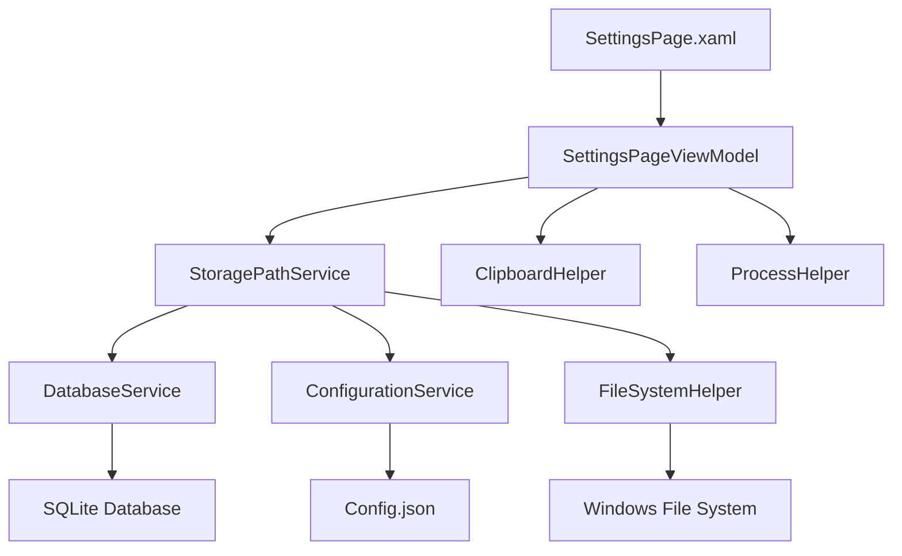
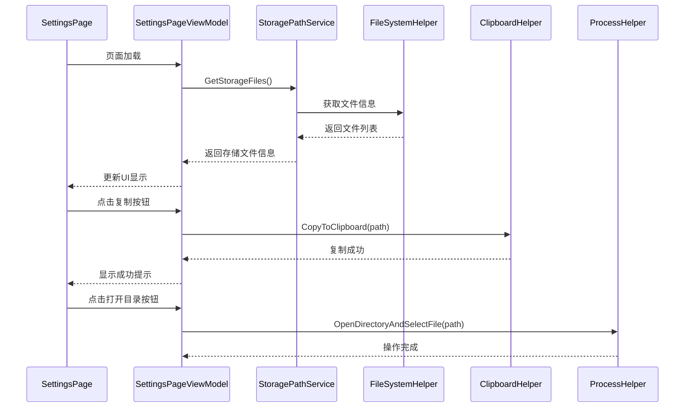

# 设计文档

## 概述

本设计文档描述了在设置页面添加存储文件路径显示功能的技术实现方案。该功能将在现有的SettingsPage中新增一个区域，显示应用程序使用的所有本地存储文件路径，并提供复制路径和打开目录的操作按钮。

## 架构

### 系统架构图



### 数据流图



## 组件和接口

### 1. StoragePathService

负责收集和管理应用程序的存储文件信息。

```csharp
public interface IStoragePathService
{
    Task<IEnumerable<StorageFileInfo>> GetStorageFilesAsync();
    Task RefreshStorageInfoAsync();
}

public class StorageFileInfo
{
    public string Name { get; set; }
    public string Description { get; set; }
    public string FullPath { get; set; }
    public long FileSize { get; set; }
    public DateTime LastModified { get; set; }
    public bool Exists { get; set; }
    public StorageFileType Type { get; set; }
}

public enum StorageFileType
{
    Database,
    Configuration,
    Log,
    Cache,
    Backup
}
```

### 2. SettingsPageViewModel 扩展

在现有的SettingsPageViewModel中添加存储路径相关的属性和命令。

```csharp
public partial class SettingsPageViewModel : ObservableObject
{
    // 新增属性
    [ObservableProperty]
    private ObservableCollection<StorageFileInfo> storageFiles = new();
    
    [ObservableProperty]
    private bool isLoadingStorageInfo;
    
    // 新增命令
    [RelayCommand]
    private async Task CopyPathAsync(string filePath);
    
    [RelayCommand]
    private async Task OpenDirectoryAsync(string filePath);
    
    [RelayCommand]
    private async Task RefreshStorageInfoAsync();
}
```

### 3. 辅助服务

#### ClipboardHelper
```csharp
public static class ClipboardHelper
{
    public static async Task<bool> CopyTextAsync(string text);
    public static void ShowCopySuccessNotification();
}
```

#### ProcessHelper
```csharp
public static class ProcessHelper
{
    public static async Task<bool> OpenDirectoryAndSelectFileAsync(string filePath);
    public static async Task<bool> OpenDirectoryAsync(string directoryPath);
}
```

## 数据模型

### StorageFileInfo 详细设计

```csharp
public class StorageFileInfo : ObservableObject
{
    [ObservableProperty]
    private string name = string.Empty;
    
    [ObservableProperty]
    private string description = string.Empty;
    
    [ObservableProperty]
    private string fullPath = string.Empty;
    
    [ObservableProperty]
    private long fileSize;
    
    [ObservableProperty]
    private DateTime lastModified;
    
    [ObservableProperty]
    private bool exists;
    
    [ObservableProperty]
    private StorageFileType type;
    
    public string FormattedFileSize => FormatFileSize(FileSize);
    public string FormattedLastModified => LastModified.ToString("yyyy-MM-dd HH:mm:ss");
    public string StatusText => Exists ? "存在" : "不存在";
    
    private static string FormatFileSize(long bytes)
    {
        if (bytes < 1024) return $"{bytes} B";
        if (bytes < 1024 * 1024) return $"{bytes / 1024.0:F1} KB";
        if (bytes < 1024 * 1024 * 1024) return $"{bytes / (1024.0 * 1024.0):F1} MB";
        return $"{bytes / (1024.0 * 1024.0 * 1024.0):F1} GB";
    }
}
```

## 错误处理

### 错误处理策略

1. **文件访问错误**
   - 捕获文件不存在异常
   - 捕获权限不足异常
   - 提供友好的错误提示

2. **剪贴板操作错误**
   - 检测剪贴板可用性
   - 处理剪贴板访问被拒绝的情况
   - 提供备用的路径显示方式

3. **进程启动错误**
   - 检测文件资源管理器可用性
   - 处理进程启动失败的情况
   - 提供备用的目录访问方式

### 错误处理实现

```csharp
public class StoragePathService : IStoragePathService
{
    public async Task<IEnumerable<StorageFileInfo>> GetStorageFilesAsync()
    {
        var files = new List<StorageFileInfo>();
        
        try
        {
            // 获取数据库文件信息
            var dbPath = DatabaseConfiguration.GetDefaultDatabasePath();
            files.Add(await CreateStorageFileInfoAsync(
                "数据库文件", 
                "存储排班数据的SQLite数据库", 
                dbPath, 
                StorageFileType.Database));
            
            // 获取配置文件信息
            var configPath = GetConfigurationFilePath();
            files.Add(await CreateStorageFileInfoAsync(
                "配置文件", 
                "应用程序设置和用户偏好", 
                configPath, 
                StorageFileType.Configuration));
                
        }
        catch (Exception ex)
        {
            // 记录错误但不中断流程
            System.Diagnostics.Debug.WriteLine($"获取存储文件信息时出错: {ex.Message}");
        }
        
        return files;
    }
}
```

## 测试策略

### 单元测试

1. **StoragePathService 测试**
   - 测试文件信息获取功能
   - 测试文件不存在的情况
   - 测试权限不足的情况

2. **辅助类测试**
   - 测试剪贴板操作
   - 测试进程启动功能
   - 测试文件大小格式化

### 集成测试

1. **UI 集成测试**
   - 测试页面加载和数据绑定
   - 测试按钮点击事件
   - 测试错误状态显示

2. **服务集成测试**
   - 测试服务间的协作
   - 测试异步操作的正确性

### 用户界面测试

1. **响应式布局测试**
   - 测试不同窗口大小下的显示效果
   - 测试主题切换的兼容性

2. **无障碍功能测试**
   - 测试屏幕阅读器兼容性
   - 测试键盘导航功能

## UI设计规范

### 布局设计

存储路径区域将采用与现有设置区域相同的卡片布局：

```xml
<Border Style="{StaticResource EnhancedCardStyle}">
    <StackPanel Spacing="16">
        <TextBlock Text="存储文件路径" 
                   Style="{StaticResource SubtitleTextStyle}"/>
        
        <ItemsControl ItemsSource="{x:Bind ViewModel.StorageFiles}">
            <!-- 文件项模板 -->
        </ItemsControl>
        
        <Button Content="刷新信息" 
                Command="{x:Bind ViewModel.RefreshStorageInfoCommand}"/>
    </StackPanel>
</Border>
```

### 文件项设计

每个文件项包含：
- 文件名称和描述
- 完整路径显示
- 文件大小和修改时间
- 存在状态指示器
- 复制和打开目录按钮

### 主题适配

- 支持浅色、深色和高对比度主题
- 使用主题资源中定义的颜色和样式
- 确保在所有主题下的可读性

### 无障碍设计

- 为所有交互元素提供AutomationProperties
- 支持键盘导航
- 提供屏幕阅读器友好的描述文本
- 使用适当的焦点指示器

## 性能考虑

### 异步操作

- 所有文件系统操作使用异步方法
- UI更新在主线程上执行
- 长时间操作显示加载指示器

### 缓存策略

- 文件信息在页面生命周期内缓存
- 提供手动刷新功能
- 避免频繁的文件系统访问

### 内存管理

- 及时释放文件句柄
- 使用using语句管理资源
- 避免内存泄漏