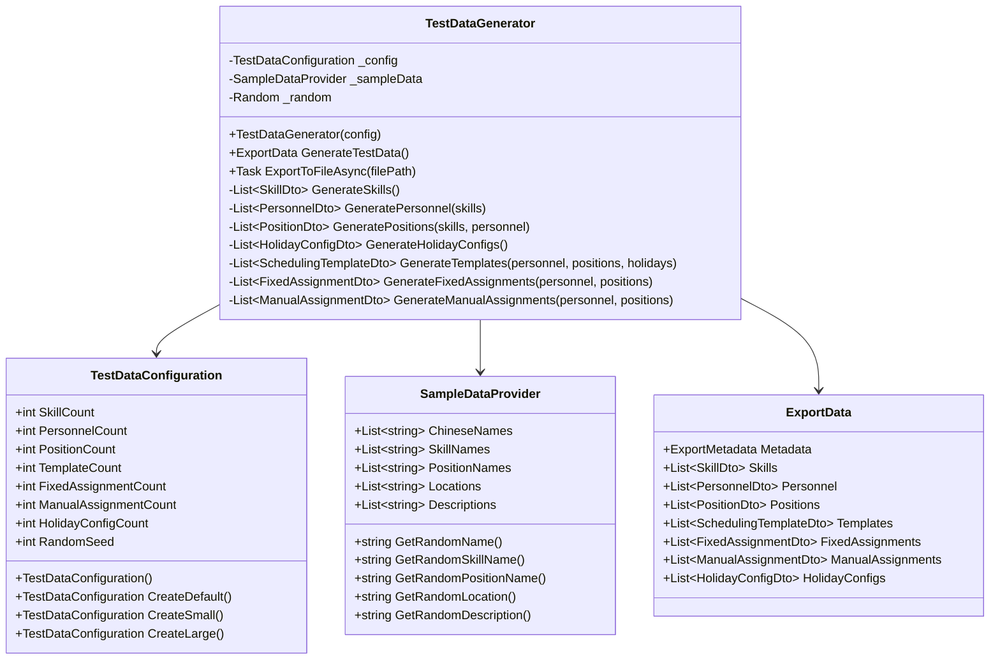
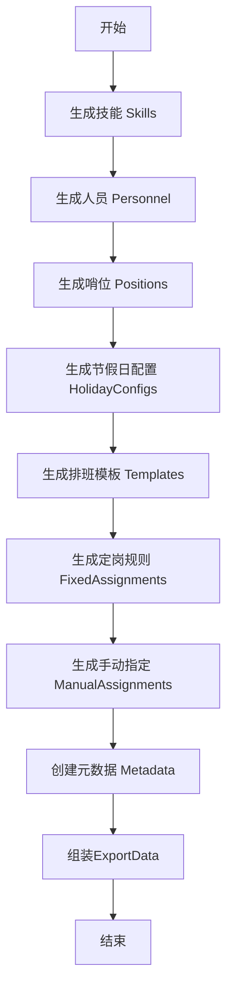
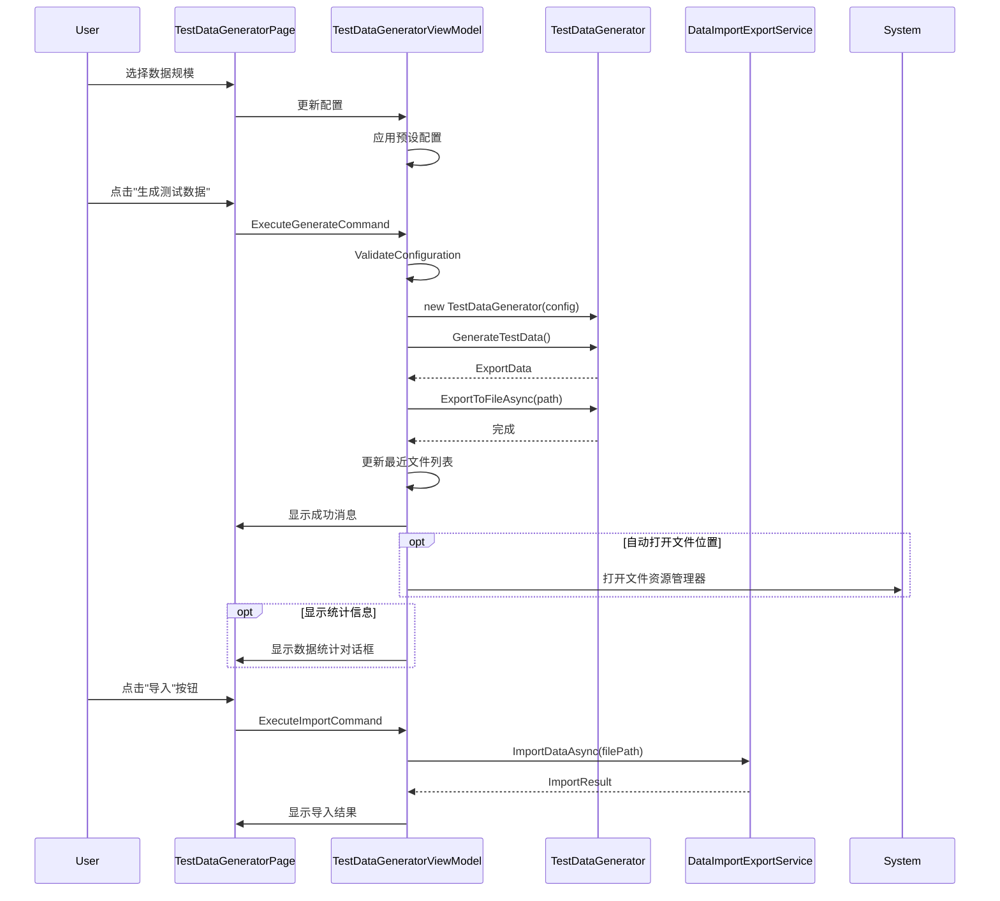

# 设计文档 - 测试数据生成器

## 概述

测试数据生成器是一个独立的工具类，用于创建符合系统规范的示例数据。它将生成包含所有核心实体（技能、人员、哨位、模板、约束等）的完整数据集，并确保数据之间的引用关系正确。生成的数据可以直接导出为JSON格式，用于测试导入导出功能。

### 设计目标

1. **数据完整性**: 生成的数据必须符合所有DTO的验证规则
2. **引用一致性**: 确保所有外键引用都指向存在的实体
3. **真实性**: 使用有意义的中文示例数据，模拟真实场景
4. **可配置性**: 支持配置生成数据的数量
5. **易用性**: 提供简单的API和使用示例

## 架构

### 组件结构

```
TestData/
├── TestDataGenerator.cs          # 主生成器类
├── TestDataConfiguration.cs      # 配置类
├── SampleDataProvider.cs         # 示例数据提供者
├── FileLocationManager.cs        # 文件位置管理器
└── Examples/
    └── GenerateTestDataExample.cs # 使用示例

Views/Settings/
├── TestDataGeneratorPage.xaml    # 测试数据生成器页面
└── TestDataGeneratorPage.xaml.cs

ViewModels/Settings/
└── TestDataGeneratorViewModel.cs  # 测试数据生成器视图模型

Services/Interfaces/
└── ITestDataGeneratorService.cs   # 测试数据生成服务接口
```

### 类图



## 组件设计

### 1. FileLocationManager 类

文件位置管理器，负责管理测试数据文件的存储位置和历史记录（符合WinUI3规范）。

#### 职责
- 提供默认测试数据目录（使用ApplicationData.LocalFolder）
- 管理最近生成的文件列表（使用FutureAccessList）
- 持久化用户偏好设置（使用LocalSettings）
- 提供文件清理功能

#### 实现

```csharp
using Windows.Storage;
using Windows.Storage.AccessCache;
using System.Text.Json;

public class FileLocationManager
{
    private const string TestDataFolderName = "TestData";
    private const string RecentFilesKey = "TestDataGenerator_RecentFiles";
    private const int MaxRecentFiles = 20;
    
    private readonly ILogger _logger;
    private StorageFolder _testDataFolder;
    
    public FileLocationManager(ILogger logger)
    {
        _logger = logger;
    }
    
    /// <summary>
    /// 获取或创建默认测试数据文件夹 (WinUI3方式)
    /// </summary>
    public async Task<StorageFolder> GetTestDataFolderAsync()
    {
        if (_testDataFolder == null)
        {
            var localFolder = ApplicationData.Current.LocalFolder;
            _testDataFolder = await localFolder.CreateFolderAsync(
                TestDataFolderName, 
                CreationCollisionOption.OpenIfExists);
            
            _logger.Log($"Test data folder: {_testDataFolder.Path}");
        }
        return _testDataFolder;
    }
    
    /// <summary>
    /// 生成新的文件名
    /// </summary>
    public string GenerateNewFileName()
    {
        var timestamp = DateTime.Now.ToString("yyyyMMdd-HHmmss");
        return $"test-data-{timestamp}.json";
    }
    
    /// <summary>
    /// 创建新的测试数据文件
    /// </summary>
    public async Task<StorageFile> CreateNewTestDataFileAsync()
    {
        var folder = await GetTestDataFolderAsync();
        var fileName = GenerateNewFileName();
        var file = await folder.CreateFileAsync(
            fileName, 
            CreationCollisionOption.GenerateUniqueName);
        
        _logger.Log($"Created test data file: {file.Path}");
        return file;
    }
    
    /// <summary>
    /// 添加到最近文件列表 (使用FutureAccessList)
    /// </summary>
    public async Task AddToRecentFilesAsync(StorageFile file)
    {
        try
        {
            // 添加到FutureAccessList以保持访问权限
            var token = StorageApplicationPermissions.FutureAccessList.Add(
                file, 
                file.Name);
            
            // 保存到LocalSettings
            var recentFiles = await GetRecentFileTokensAsync();
            
            var fileInfo = new RecentFileInfo
            {
                Token = token,
                FileName = file.Name,
                FilePath = file.Path,
                GeneratedAt = DateTime.Now
            };
            
            // 移除重复项
            recentFiles.RemoveAll(f => f.FilePath == file.Path);
            
            // 添加到列表开头
            recentFiles.Insert(0, fileInfo);
            
            // 限制列表大小
            if (recentFiles.Count > MaxRecentFiles)
            {
                // 移除超出的项并清理FutureAccessList
                for (int i = MaxRecentFiles; i < recentFiles.Count; i++)
                {
                    StorageApplicationPermissions.FutureAccessList.Remove(
                        recentFiles[i].Token);
                }
                recentFiles = recentFiles.Take(MaxRecentFiles).ToList();
            }
            
            // 保存到LocalSettings
            await SaveRecentFileTokensAsync(recentFiles);
            
            _logger.Log($"Added to recent files: {file.Name}");
        }
        catch (Exception ex)
        {
            _logger.LogError($"Failed to add to recent files: {ex.Message}");
        }
    }
    
    /// <summary>
    /// 获取最近的文件列表
    /// </summary>
    public async Task<List<GeneratedFileInfo>> GetRecentTestDataFilesAsync()
    {
        var result = new List<GeneratedFileInfo>();
        var recentFiles = await GetRecentFileTokensAsync();
        
        foreach (var fileInfo in recentFiles)
        {
            try
            {
                // 尝试从FutureAccessList获取文件
                var file = await StorageApplicationPermissions.FutureAccessList
                    .GetFileAsync(fileInfo.Token);
                
                var properties = await file.GetBasicPropertiesAsync();
                
                result.Add(new GeneratedFileInfo
                {
                    FileName = file.Name,
                    FilePath = file.Path,
                    GeneratedAt = fileInfo.GeneratedAt,
                    FileSize = (long)properties.Size,
                    StorageFile = file
                });
            }
            catch (Exception ex)
            {
                // 文件可能已被删除，从列表中移除
                _logger.Log($"File not accessible: {fileInfo.FileName}, removing from list");
                StorageApplicationPermissions.FutureAccessList.Remove(fileInfo.Token);
            }
        }
        
        // 更新列表（移除无效项）
        if (result.Count < recentFiles.Count)
        {
            var validTokens = result.Select(r => 
                recentFiles.First(f => f.FilePath == r.FilePath)).ToList();
            await SaveRecentFileTokensAsync(validTokens);
        }
        
        return result;
    }
    
    /// <summary>
    /// 从LocalSettings读取最近文件令牌
    /// </summary>
    private async Task<List<RecentFileInfo>> GetRecentFileTokensAsync()
    {
        try
        {
            var settings = ApplicationData.Current.LocalSettings;
            if (settings.Values.TryGetValue(RecentFilesKey, out var value))
            {
                var json = value as string;
                return JsonSerializer.Deserialize<List<RecentFileInfo>>(json) 
                    ?? new List<RecentFileInfo>();
            }
        }
        catch (Exception ex)
        {
            _logger.LogError($"Failed to load recent files: {ex.Message}");
        }
        
        return new List<RecentFileInfo>();
    }
    
    /// <summary>
    /// 保存最近文件令牌到LocalSettings
    /// </summary>
    private async Task SaveRecentFileTokensAsync(List<RecentFileInfo> recentFiles)
    {
        try
        {
            var settings = ApplicationData.Current.LocalSettings;
            var json = JsonSerializer.Serialize(recentFiles);
            settings.Values[RecentFilesKey] = json;
        }
        catch (Exception ex)
        {
            _logger.LogError($"Failed to save recent files: {ex.Message}");
        }
    }
    
    /// <summary>
    /// 清理旧文件
    /// </summary>
    public async Task CleanOldFilesAsync(int daysToKeep = 30)
    {
        try
        {
            var folder = await GetTestDataFolderAsync();
            var files = await folder.GetFilesAsync();
            var cutoffDate = DateTime.Now.AddDays(-daysToKeep);
            
            int deletedCount = 0;
            foreach (var file in files)
            {
                var properties = await file.GetBasicPropertiesAsync();
                if (properties.DateModified.DateTime < cutoffDate)
                {
                    await file.DeleteAsync();
                    deletedCount++;
                }
            }
            
            _logger.Log($"Cleaned {deletedCount} old test data files");
        }
        catch (Exception ex)
        {
            _logger.LogError($"Failed to clean old files: {ex.Message}");
        }
    }
}

/// <summary>
/// 最近文件信息（用于LocalSettings存储）
/// </summary>
public class RecentFileInfo
{
    public string Token { get; set; }
    public string FileName { get; set; }
    public string FilePath { get; set; }
    public DateTime GeneratedAt { get; set; }
        
        // 保存到设置
        await SaveRecentFilesAsync(recentFiles);
    }
    
    /// <summary>
    /// 获取最近文件列表
    /// </summary>
    public async Task<List<GeneratedFileInfo>> GetRecentTestDataFilesAsync()
    {
        try
        {
            var json = await LoadSettingA

主生成器类，负责协调所有数据的生成。

#### 职责
- 按依赖顺序生成各类数据
- 维护ID分配和引用关系
- 确保数据验证规则
- 导出数据到JSON文件

#### 关键方法

```csharp
public class TestDataGenerator
{
    // 生成完整的测试数据集
    public ExportData GenerateTestData();
    
    // 导出到JSON文件
    public async Task ExportToFileAsync(string filePath);
    
    // 私有生成方法（按依赖顺序）
    private List<SkillDto> GenerateSkills();
    private List<PersonnelDto> GeneratePersonnel(List<SkillDto> skills);
    private List<PositionDto> GeneratePositions(List<SkillDto> skills, List<PersonnelDto> personnel);
    private List<HolidayConfigDto> GenerateHolidayConfigs();
    private List<SchedulingTemplateDto> GenerateTemplates(...);
    private List<FixedAssignmentDto> GenerateFixedAssignments(...);
    private List<ManualAssignmentDto> GenerateManualAssignments(...);
}
```

### 2. TestDataConfiguration 类

配置类，用于控制生成数据的数量和特征。

#### 属性

```csharp
public class TestDataConfiguration
{
    public int SkillCount { get; set; } = 8;
    public int PersonnelCount { get; set; } = 15;
    public int PositionCount { get; set; } = 10;
    public int TemplateCount { get; set; } = 3;
    public int FixedAssignmentCount { get; set; } = 5;
    public int ManualAssignmentCount { get; set; } = 8;
    public int HolidayConfigCount { get; set; } = 2;
    public int RandomSeed { get; set; } = 42; // 可重现的随机数
}
```

#### 预设配置

```csharp
// 默认配置（中等规模）
public static TestDataConfiguration CreateDefault();

// 小规模配置（快速测试）
public static TestDataConfiguration CreateSmall();

// 大规模配置（压力测试）
public static TestDataConfiguration CreateLarge();
```

### 3. SampleDataProvider 类

提供中文示例数据的静态数据源。

#### 数据集

```csharp
public class SampleDataProvider
{
    // 中文姓名库（20+个）
    private static readonly List<string> ChineseNames = new()
    {
        "张伟", "李娜", "王芳", "刘洋", "陈静",
        "杨军", "赵敏", "黄强", "周涛", "吴磊",
        "徐丽", "孙鹏", "马超", "朱婷", "胡斌",
        "郭亮", "林峰", "何敏", "高洋", "罗娟"
    };
    
    // 技能名称库
    private static readonly List<string> SkillNames = new()
    {
        "安全检查", "设备维护", "应急处理", "监控操作",
        "巡逻执勤", "消防管理", "通讯联络", "文档记录",
        "车辆管理", "访客接待"
    };
    
    // 哨位名称库
    private static readonly List<string> PositionNames = new()
    {
        "主门岗", "东门岗", "西门岗", "北门岗",
        "监控室", "巡逻岗", "停车场岗", "仓库岗",
        "办公楼岗", "生产区岗"
    };
    
    // 地点库
    private static readonly List<string> Locations = new()
    {
        "主入口", "东侧入口", "西侧入口", "北侧入口",
        "中央监控室", "园区巡逻路线", "地下停车场",
        "仓库区域", "办公楼大厅", "生产车间入口"
    };
}
```

## 数据生成流程

### 生成顺序（按依赖关系）



### 详细生成逻辑

#### 1. 技能生成 (GenerateSkills)

```csharp
private List<SkillDto> GenerateSkills()
{
    var skills = new List<SkillDto>();
    var usedNames = new HashSet<string>();
    
    for (int i = 1; i <= _config.SkillCount; i++)
    {
        string name;
        do
        {
            name = _sampleData.GetRandomSkillName();
        } while (usedNames.Contains(name));
        
        usedNames.Add(name);
        
        skills.Add(new SkillDto
        {
            Id = i,
            Name = name,
            Description = $"{name}相关的专业技能",
            IsActive = _random.Next(100) < 90, // 90%激活
            CreatedAt = DateTime.UtcNow.AddDays(-_random.Next(365)),
            UpdatedAt = DateTime.UtcNow.AddDays(-_random.Next(30))
        });
    }
    
    return skills;
}
```

#### 2. 人员生成 (GeneratePersonnel)

```csharp
private List<PersonnelDto> GeneratePersonnel(List<SkillDto> skills)
{
    var personnel = new List<PersonnelDto>();
    var usedNames = new HashSet<string>();
    
    for (int i = 1; i <= _config.PersonnelCount; i++)
    {
        string name;
        do
        {
            name = _sampleData.GetRandomName();
        } while (usedNames.Contains(name));
        
        usedNames.Add(name);
        
        // 随机分配1-3个技能
        var skillCount = _random.Next(1, 4);
        var assignedSkills = skills
            .OrderBy(x => _random.Next())
            .Take(skillCount)
            .ToList();
        
        personnel.Add(new PersonnelDto
        {
            Id = i,
            Name = name,
            SkillIds = assignedSkills.Select(s => s.Id).ToList(),
            SkillNames = assignedSkills.Select(s => s.Name).ToList(),
            IsAvailable = _random.Next(100) < 85, // 85%可用
            IsRetired = _random.Next(100) < 10,   // 10%退役
            RecentShiftIntervalCount = _random.Next(0, 20),
            RecentHolidayShiftIntervalCount = _random.Next(0, 10),
            RecentPeriodShiftIntervals = Enumerable.Range(0, 12)
                .Select(_ => _random.Next(0, 15))
                .ToArray()
        });
    }
    
    return personnel;
}
```

#### 3. 哨位生成 (GeneratePositions)

```csharp
private List<PositionDto> GeneratePositions(
    List<SkillDto> skills, 
    List<PersonnelDto> personnel)
{
    var positions = new List<PositionDto>();
    var usedNames = new HashSet<string>();
    
    for (int i = 1; i <= _config.PositionCount; i++)
    {
        string name;
        do
        {
            name = _sampleData.GetRandomPositionName();
        } while (usedNames.Contains(name));
        
        usedNames.Add(name);
        
        // 随机分配1-2个所需技能
        var requiredSkills = skills
            .OrderBy(x => _random.Next())
            .Take(_random.Next(1, 3))
            .ToList();
        
        // 找出具备所需技能的人员
        var availablePersonnel = personnel
            .Where(p => p.IsAvailable && !p.IsRetired)
            .Where(p => requiredSkills.Any(rs => p.SkillIds.Contains(rs.Id)))
            .ToList();
        
        positions.Add(new PositionDto
        {
            Id = i,
            Name = name,
            Location = _sampleData.GetRandomLocation(),
            Description = $"{name}的职责描述",
            Requirements = $"需要{string.Join("、", requiredSkills.Select(s => s.Name))}技能",
            RequiredSkillIds = requiredSkills.Select(s => s.Id).ToList(),
            RequiredSkillNames = requiredSkills.Select(s => s.Name).ToList(),
            AvailablePersonnelIds = availablePersonnel.Select(p => p.Id).ToList(),
            AvailablePersonnelNames = availablePersonnel.Select(p => p.Name).ToList(),
            IsActive = true,
            CreatedAt = DateTime.UtcNow.AddDays(-_random.Next(180)),
            UpdatedAt = DateTime.UtcNow.AddDays(-_random.Next(30))
        });
    }
    
    return positions;
}
```

#### 4. 节假日配置生成 (GenerateHolidayConfigs)

```csharp
private List<HolidayConfigDto> GenerateHolidayConfigs()
{
    var configs = new List<HolidayConfigDto>();
    var baseDate = DateTime.UtcNow;
    
    // 配置1: 标准周末配置
    configs.Add(new HolidayConfigDto
    {
        Id = 1,
        ConfigName = "标准周末配置",
        EnableWeekendRule = true,
        WeekendDays = new List<DayOfWeek> 
        { 
            DayOfWeek.Saturday, 
            DayOfWeek.Sunday 
        },
        LegalHolidays = new List<DateTime>
        {
            new DateTime(baseDate.Year, 1, 1),   // 元旦
            new DateTime(baseDate.Year, 5, 1),   // 劳动节
            new DateTime(baseDate.Year, 10, 1),  // 国庆节
        },
        CustomHolidays = new List<DateTime>(),
        ExcludedDates = new List<DateTime>(),
        IsActive = true,
        CreatedAt = baseDate.AddDays(-90),
        UpdatedAt = baseDate.AddDays(-10)
    });
    
    // 配置2: 单休配置
    if (_config.HolidayConfigCount > 1)
    {
        configs.Add(new HolidayConfigDto
        {
            Id = 2,
            ConfigName = "单休配置",
            EnableWeekendRule = true,
            WeekendDays = new List<DayOfWeek> { DayOfWeek.Sunday },
            LegalHolidays = new List<DateTime>
            {
                new DateTime(baseDate.Year, 1, 1),
                new DateTime(baseDate.Year, 5, 1),
            },
            CustomHolidays = new List<DateTime>
            {
                baseDate.AddDays(15),
                baseDate.AddDays(30),
            },
            ExcludedDates = new List<DateTime>(),
            IsActive = false,
            CreatedAt = baseDate.AddDays(-60),
            UpdatedAt = baseDate.AddDays(-5)
        });
    }
    
    return configs;
}
```

#### 5. 排班模板生成 (GenerateTemplates)

```csharp
private List<SchedulingTemplateDto> GenerateTemplates(
    List<PersonnelDto> personnel,
    List<PositionDto> positions,
    List<HolidayConfigDto> holidayConfigs)
{
    var templates = new List<SchedulingTemplateDto>();
    var templateTypes = new[] { "regular", "holiday", "special" };
    var baseDate = DateTime.UtcNow;
    
    for (int i = 1; i <= _config.TemplateCount; i++)
    {
        var type = templateTypes[Math.Min(i - 1, templateTypes.Length - 1)];
        
        // 选择至少5个可用人员
        var selectedPersonnel = personnel
            .Where(p => p.IsAvailable && !p.IsRetired)
            .OrderBy(x => _random.Next())
            .Take(Math.Max(5, personnel.Count / 2))
            .ToList();
        
        // 选择至少3个哨位
        var selectedPositions = positions
            .OrderBy(x => _random.Next())
            .Take(Math.Max(3, positions.Count / 2))
            .ToList();
        
        templates.Add(new SchedulingTemplateDto
        {
            Id = i,
            Name = $"{GetTemplateTypeName(type)}排班模板{i}",
            Description = $"用于{GetTemplateTypeName(type)}的排班模板",
            TemplateType = type,
            IsDefault = i == 1,
            PersonnelIds = selectedPersonnel.Select(p => p.Id).ToList(),
            PositionIds = selectedPositions.Select(p => p.Id).ToList(),
            HolidayConfigId = holidayConfigs.FirstOrDefault()?.Id,
            UseActiveHolidayConfig = true,
            EnabledFixedRuleIds = new List<int>(),
            EnabledManualAssignmentIds = new List<int>(),
            DurationDays = type == "regular" ? 7 : (type == "holiday" ? 3 : 1),
            StrategyConfig = "{}",
            UsageCount = _random.Next(0, 50),
            IsActive = true,
            CreatedAt = baseDate.AddDays(-_random.Next(120)),
            UpdatedAt = baseDate.AddDays(-_random.Next(20)),
            LastUsedAt = _random.Next(100) < 70 
                ? baseDate.AddDays(-_random.Next(10)) 
                : null
        });
    }
    
    return templates;
}

private string GetTemplateTypeName(string type)
{
    return type switch
    {
        "regular" => "常规",
        "holiday" => "节假日",
        "special" => "特殊",
        _ => "未知"
    };
}
```

#### 6. 定岗规则生成 (GenerateFixedAssignments)

```csharp
private List<FixedAssignmentDto> GenerateFixedAssignments(
    List<PersonnelDto> personnel,
    List<PositionDto> positions)
{
    var assignments = new List<FixedAssignmentDto>();
    var baseDate = DateTime.UtcNow;
    
    for (int i = 1; i <= _config.FixedAssignmentCount; i++)
    {
        var person = personnel[_random.Next(personnel.Count)];
        
        // 选择1-3个允许的哨位
        var allowedPositions = positions
            .OrderBy(x => _random.Next())
            .Take(_random.Next(1, 4))
            .ToList();
        
        // 选择2-6个允许的时段
        var timeSlotCount = _random.Next(2, 7);
        var allowedTimeSlots = Enumerable.Range(0, 12)
            .OrderBy(x => _random.Next())
            .Take(timeSlotCount)
            .OrderBy(x => x)
            .ToList();
        
        var startDate = baseDate.AddDays(_random.Next(-30, 30));
        var endDate = startDate.AddDays(_random.Next(30, 180));
        
        assignments.Add(new FixedAssignmentDto
        {
            Id = i,
            PersonnelId = person.Id,
            PersonnelName = person.Name,
            AllowedPositionIds = allowedPositions.Select(p => p.Id).ToList(),
            AllowedPositionNames = allowedPositions.Select(p => p.Name).ToList(),
            AllowedTimeSlots = allowedTimeSlots,
            StartDate = startDate,
            EndDate = endDate,
            IsEnabled = _random.Next(100) < 80, // 80%启用
            RuleName = $"{person.Name}的定岗规则",
            Description = $"限制{person.Name}只能在指定哨位和时段工作",
            CreatedAt = baseDate.AddDays(-_random.Next(60)),
            UpdatedAt = baseDate.AddDays(-_random.Next(10))
        });
    }
    
    return assignments;
}
```

#### 7. 手动指定生成 (GenerateManualAssignments)

```csharp
private List<ManualAssignmentDto> GenerateManualAssignments(
    List<PersonnelDto> personnel,
    List<PositionDto> positions)
{
    var assignments = new List<ManualAssignmentDto>();
    var baseDate = DateTime.UtcNow;
    var usedCombinations = new HashSet<string>();
    
    for (int i = 1; i <= _config.ManualAssignmentCount; i++)
    {
        var position = positions[_random.Next(positions.Count)];
        var person = personnel
            .Where(p => position.AvailablePersonnelIds.Contains(p.Id))
            .OrderBy(x => _random.Next())
            .FirstOrDefault() ?? personnel[_random.Next(personnel.Count)];
        
        var date = baseDate.AddDays(_random.Next(-10, 30));
        var timeSlot = _random.Next(0, 12);
        
        // 确保不重复（同一哨位、日期、时段）
        var key = $"{position.Id}_{date:yyyyMMdd}_{timeSlot}";
        if (usedCombinations.Contains(key))
            continue;
        
        usedCombinations.Add(key);
        
        assignments.Add(new ManualAssignmentDto
        {
            Id = i,
            PositionId = position.Id,
            PositionName = position.Name,
            TimeSlot = timeSlot,
            PersonnelId = person.Id,
            PersonnelName = person.Name,
            Date = date,
            IsEnabled = _random.Next(100) < 90, // 90%启用
            Remarks = $"手动指定{person.Name}在{GetTimeSlotName(timeSlot)}值班",
            CreatedAt = baseDate.AddDays(-_random.Next(30)),
            UpdatedAt = baseDate.AddDays(-_random.Next(5))
        });
    }
    
    return assignments;
}

private string GetTimeSlotName(int slot)
{
    var hours = slot * 2;
    return $"{hours:D2}:00-{(hours + 2):D2}:00";
}
```

## 数据导出

### JSON序列化

使用与DataImportExportService相同的序列化选项：

```csharp
public async Task ExportToFileAsync(string filePath)
{
    var exportData = GenerateTestData();
    
    var options = new JsonSerializerOptions
    {
        WriteIndented = true,
        PropertyNamingPolicy = JsonNamingPolicy.CamelCase,
        DefaultIgnoreCondition = JsonIgnoreCondition.Never
    };
    
    var json = JsonSerializer.Serialize(exportData, options);
    await File.WriteAllTextAsync(filePath, json);
}
```

### 元数据生成

```csharp
private ExportMetadata CreateMetadata(ExportData data)
{
    return new ExportMetadata
    {
        ExportVersion = "1.0",
        ExportedAt = DateTime.UtcNow,
        DatabaseVersion = 1,
        ApplicationVersion = "1.0.0.0",
        Statistics = new DataStatistics
        {
            SkillCount = data.Skills?.Count ?? 0,
            PersonnelCount = data.Personnel?.Count ?? 0,
            PositionCount = data.Positions?.Count ?? 0,
            TemplateCount = data.Templates?.Count ?? 0,
            ConstraintCount = (data.FixedAssignments?.Count ?? 0) +
                            (data.ManualAssignments?.Count ?? 0) +
                            (data.HolidayConfigs?.Count ?? 0)
        }
    };
}
```

## 错误处理

### 验证策略

1. **生成前验证**: 检查配置参数的合理性
2. **生成中验证**: 确保引用关系正确
3. **生成后验证**: 验证生成的数据符合DTO规则

```csharp
private void ValidateConfiguration()
{
    if (_config.SkillCount < 1)
        throw new ArgumentException("至少需要生成1个技能");
    
    if (_config.PersonnelCount < 1)
        throw new ArgumentException("至少需要生成1个人员");
    
    if (_config.PositionCount < 1)
        throw new ArgumentException("至少需要生成1个哨位");
}

private void ValidateGeneratedData(ExportData data)
{
    // 验证引用完整性
    var skillIds = new HashSet<int>(data.Skills.Select(s => s.Id));
    var personnelIds = new HashSet<int>(data.Personnel.Select(p => p.Id));
    var positionIds = new HashSet<int>(data.Positions.Select(p => p.Id));
    
    // 验证人员的技能引用
    foreach (var person in data.Personnel)
    {
        foreach (var skillId in person.SkillIds)
        {
            if (!skillIds.Contains(skillId))
                throw new InvalidOperationException(
                    $"人员 {person.Name} 引用了不存在的技能ID: {skillId}");
        }
    }
    
    // 类似地验证其他引用...
}
```

## 测试策略

### 单元测试

1. 测试每个生成方法的输出
2. 验证数据数量符合配置
3. 验证引用关系正确性
4. 验证数据符合DTO验证规则

### 集成测试

1. 生成完整数据集
2. 导出到JSON文件
3. 使用DataImportExportService导入
4. 验证导入成功且数据完整

## 使用示例

### 基本使用

```csharp
// 使用默认配置
var generator = new TestDataGenerator();
var testData = generator.GenerateTestData();
await generator.ExportToFileAsync("test-data.json");

// 使用自定义配置
var config = new TestDataConfiguration
{
    SkillCount = 10,
    PersonnelCount = 20,
    PositionCount = 15
};
var generator2 = new TestDataGenerator(config);
await generator2.ExportToFileAsync("large-test-data.json");

// 使用预设配置
var smallConfig = TestDataConfiguration.CreateSmall();
var generator3 = new TestDataGenerator(smallConfig);
await generator3.ExportToFileAsync("small-test-data.json");
```

### 命令行工具示例

```csharp
class Program
{
    static async Task Main(string[] args)
    {
        Console.WriteLine("=== 测试数据生成器 ===");
        Console.WriteLine();
        
        // 选择配置
        Console.WriteLine("请选择数据规模:");
        Console.WriteLine("1. 小规模 (快速测试)");
        Console.WriteLine("2. 中等规模 (默认)");
        Console.WriteLine("3. 大规模 (压力测试)");
        Console.Write("请输入选项 (1-3): ");
        
        var choice = Console.ReadLine();
        var config = choice switch
        {
            "1" => TestDataConfiguration.CreateSmall(),
            "3" => TestDataConfiguration.CreateLarge(),
            _ => TestDataConfiguration.CreateDefault()
        };
        
        // 生成数据
        Console.WriteLine();
        Console.WriteLine("正在生成测试数据...");
        var generator = new TestDataGenerator(config);
        var testData = generator.GenerateTestData();
        
        // 显示统计
        Console.WriteLine($"生成完成:");
        Console.WriteLine($"  - 技能: {testData.Skills.Count}");
        Console.WriteLine($"  - 人员: {testData.Personnel.Count}");
        Console.WriteLine($"  - 哨位: {testData.Positions.Count}");
        Console.WriteLine($"  - 模板: {testData.Templates.Count}");
        Console.WriteLine($"  - 约束: {testData.FixedAssignments.Count + testData.ManualAssignments.Count}");
        
        // 导出文件
        var fileName = $"test-data-{DateTime.Now:yyyyMMdd-HHmmss}.json";
        await generator.ExportToFileAsync(fileName);
        
        Console.WriteLine();
        Console.WriteLine($"数据已导出到: {Path.GetFullPath(fileName)}");
        Console.WriteLine("按任意键退出...");
        Console.ReadKey();
    }
}
```

## 性能考虑

1. **内存使用**: 大规模数据生成时注意内存占用
2. **生成速度**: 使用高效的随机算法和数据结构
3. **文件大小**: JSON文件可能较大，考虑压缩选项

## UI设计 - 测试数据生成器页面

### 页面布局

测试数据生成器页面将集成到设置页面中，提供可视化的界面来配置和生成测试数据。

#### 页面结构

```
┌─────────────────────────────────────────────────┐
│  测试数据生成器                                    │
├─────────────────────────────────────────────────┤
│                                                 │
│  数据规模配置                                     │
│  ┌─────────────────────────────────────────┐   │
│  │ ○ 小规模 (快速测试)                        │   │
│  │ ● 中等规模 (默认)                          │   │
│  │ ○ 大规模 (压力测试)                        │   │
│  │ ○ 自定义                                  │   │
│  └─────────────────────────────────────────┘   │
│                                                 │
│  自定义配置 (仅在选择"自定义"时显示)               │
│  ┌─────────────────────────────────────────┐   │
│  │ 技能数量:     [  8  ] (1-50)              │   │
│  │ 人员数量:     [ 15  ] (1-100)             │   │
│  │ 哨位数量:     [ 10  ] (1-50)              │   │
│  │ 模板数量:     [  3  ] (1-20)              │   │
│  │ 定岗规则数量:  [  5  ] (0-50)              │   │
│  │ 手动指定数量:  [  8  ] (0-100)             │   │
│  │ 节假日配置数量: [  2  ] (1-10)             │   │
│  │ 随机种子:     [ 42  ] (可选)              │   │
│  └─────────────────────────────────────────┘   │
│                                                 │
│  生成选项                                        │
│  ┌─────────────────────────────────────────┐   │
│  │ ☑ 自动打开生成的文件位置                    │   │
│  │ ☑ 生成后显示数据统计                       │   │
│  └─────────────────────────────────────────┘   │
│                                                 │
│  输出文件                                        │
│  ┌─────────────────────────────────────────┐   │
│  │ [test-data-20241109-143022.json        ]│   │
│  │                              [浏览...]   │   │
│  └─────────────────────────────────────────┘   │
│                                                 │
│  [生成测试数据]  [取消]                          │
│                                                 │
│  ─────────────────────────────────────────────  │
│                                                 │
│  最近生成的文件                                   │
│  ┌─────────────────────────────────────────┐   │
│  │ test-data-20241109-143022.json  [导入]  │   │
│  │ test-data-20241108-091530.json  [导入]  │   │
│  │ test-data-20241107-165412.json  [导入]  │   │
│  └─────────────────────────────────────────┘   │
└─────────────────────────────────────────────────┘
```

### ViewModel设计

```csharp
public class TestDataGeneratorViewModel : ViewModelBase
{
    private readonly ITestDataGeneratorService _generatorService;
    private readonly IDataImportExportService _importExportService;
    private readonly IFileLocationManager _fileLocationManager;
    
    // 配置选项
    public ObservableCollection<string> ScaleOptions { get; }
    public string SelectedScale { get; set; }
    
    // 自定义配置
    public int SkillCount { get; set; }
    public int PersonnelCount { get; set; }
    public int PositionCount { get; set; }
    public int TemplateCount { get; set; }
    public int FixedAssignmentCount { get; set; }
    public int ManualAssignmentCount { get; set; }
    public int HolidayConfigCount { get; set; }
    public int RandomSeed { get; set; }
    
    // 生成选项
    public bool AutoOpenFileLocation { get; set; }
    public bool ShowStatisticsAfterGeneration { get; set; }
    
    // 输出文件
    public string OutputFilePath { get; set; }
    public string DefaultOutputDirectory { get; }
    
    // 最近生成的文件
    public ObservableCollection<GeneratedFileInfo> RecentFiles { get; }
    
    // 状态
    public bool IsGenerating { get; set; }
    public string StatusMessage { get; set; }
    public int ProgressPercentage { get; set; }
    
    // 命令
    public ICommand GenerateCommand { get; }
    public ICommand BrowseCommand { get; }
    public ICommand ImportFileCommand { get; }
    public ICommand CancelCommand { get; }
    public ICommand OpenFileLocationCommand { get; }
    public ICommand CleanOldFilesCommand { get; }
    public ICommand RefreshRecentFilesCommand { get; }
    
    // 初始化
    private async Task InitializeAsync()
    {
        // 生成默认文件名
        OutputFilePath = _fileLocationManager.GenerateNewFileName();
        
        // 加载最近文件
        await LoadRecentFilesAsync();
    }
    
    // 加载最近文件
    private async Task LoadRecentFilesAsync()
    {
        var files = await _fileLocationManager.GetRecentTestDataFilesAsync();
        RecentFiles.Clear();
        foreach (var file in files)
        {
            RecentFiles.Add(file);
        }
    }
    
    // 生成测试数据 (WinUI3方式)
    private async Task ExecuteGenerateAsync()
    {
        try
        {
            IsGenerating = true;
            StatusMessage = "正在生成测试数据...";
            ProgressPercentage = 0;
            
            // 创建配置
            var config = CreateConfiguration();
            
            // 创建生成器
            var generator = new TestDataGenerator(config);
            
            // 生成数据
            StatusMessage = "正在生成数据...";
            ProgressPercentage = 30;
            var testData = generator.GenerateTestData();
            
            // 创建文件
            StatusMessage = "正在保存文件...";
            ProgressPercentage = 60;
            var file = await _fileLocationManager.CreateNewTestDataFileAsync();
            
            // 导出到文件
            await generator.ExportToStorageFileAsync(file);
            
            // 添加到最近文件
            await _fileLocationManager.AddToRecentFilesAsync(file);
            
            // 刷新最近文件列表
            await LoadRecentFilesAsync();
            
            StatusMessage = "生成完成！";
            ProgressPercentage = 100;
            
            // 显示成功消息
            await ShowSuccessDialogAsync(file, testData);
            
            // 可选：打开文件位置
            if (AutoOpenFileLocation)
            {
                await Windows.System.Launcher.LaunchFolderAsync(
                    await file.GetParentAsync());
            }
        }
        catch (Exception ex)
        {
            StatusMessage = $"生成失败: {ex.Message}";
            await ShowErrorDialogAsync(ex.Message);
        }
        finally
        {
            IsGenerating = false;
        }
    }
    
    // 浏览保存位置 (使用FileSavePicker)
    private async Task ExecuteBrowseAsync()
    {
        var picker = new Windows.Storage.Pickers.FileSavePicker();
        
        // 获取窗口句柄 (WinUI3需要)
        var hwnd = WinRT.Interop.WindowNative.GetWindowHandle(App.MainWindow);
        WinRT.Interop.InitializeWithWindow.Initialize(picker, hwnd);
        
        picker.SuggestedStartLocation = 
            Windows.Storage.Pickers.PickerLocationId.DocumentsLibrary;
        picker.FileTypeChoices.Add("JSON文件", new List<string> { ".json" });
        picker.SuggestedFileName = _fileLocationManager.GenerateNewFileName();
        
        var file = await picker.PickSaveFileAsync();
        if (file != null)
        {
            OutputFilePath = file.Name;
            // 保存自定义文件引用供后续使用
            _customOutputFile = file;
        }
    }
}

public class GeneratedFileInfo
{
    public string FileName { get; set; }
    public string FilePath { get; set; }
    public DateTime GeneratedAt { get; set; }
    public long FileSize { get; set; }
    public StorageFile StorageFile { get; set; }  // WinUI3 StorageFile引用
    public string FormattedSize => FormatFileSize(FileSize);
    public string FormattedDate => GeneratedAt.ToString("yyyy-MM-dd HH:mm:ss");
    
    private string FormatFileSize(long bytes)
    {
        string[] sizes = { "B", "KB", "MB", "GB" };
        double len = bytes;
        int order = 0;
        while (len >= 1024 && order < sizes.Length - 1)
        {
            order++;
            len = len / 1024;
        }
        return $"{len:0.##} {sizes[order]}";
    }
}
```

### 交互流程



### 页面功能

#### 1. 数据规模选择

- **小规模**: 技能5个、人员8个、哨位6个，适合快速测试
- **中等规模**: 技能8个、人员15个、哨位10个，默认配置
- **大规模**: 技能15个、人员30个、哨位20个，压力测试
- **自定义**: 显示详细配置面板，允许精确控制

#### 2. 自定义配置面板

- 使用NumericUpDown控件限制输入范围
- 实时验证输入值
- 提供合理的默认值和范围提示

#### 3. 生成选项

- **自动打开文件位置**: 生成完成后在资源管理器中显示文件
- **显示数据统计**: 弹出对话框显示生成的数据详情

#### 4. 输出文件配置

- **默认保存位置** (符合WinUI3规范):
  - **LocalFolder**: `ApplicationData.Current.LocalFolder` + `TestData`
    - 完整路径: `C:\Users\{Username}\AppData\Local\Packages\{PackageFamilyName}\LocalState\TestData\`
    - 用于应用程序生成的测试数据
  - **文档库** (可选): 用户可选择保存到文档库以便于访问
    - 使用 `Windows.Storage.Pickers.FileSavePicker`
    - 需要在 `Package.appxmanifest` 中声明文档库权限
- **默认文件名格式**: `test-data-{timestamp}.json`
  - 示例: `test-data-20241109-143022.json`
  - 时间戳格式: `yyyyMMdd-HHmmss`
- **文件访问方式**:
  - 使用 `Windows.Storage.StorageFolder` 和 `StorageFile` API
  - 使用 `ApplicationData.Current.LocalFolder` 获取本地存储
  - 使用 `FutureAccessList` 保存用户选择的自定义位置访问权限
- **文件管理**:
  - 自动创建TestData子文件夹（使用 `CreateFolderAsync`）
  - 支持文件选择器选择自定义保存位置
  - 使用 `ApplicationData.Current.LocalSettings` 保存用户偏好设置
  - 使用 `StorageApplicationPermissions.FutureAccessList` 保存最近文件访问令牌
  - 最多保留最近20个生成的文件记录（存储在LocalSettings）
- **文件清理**:
  - 提供"清理旧文件"功能（可选）
  - 可配置自动清理策略（如保留最近30天）
  - 使用 `StorageFile.DeleteAsync()` 删除文件

#### 5. 最近生成的文件列表

- 显示最近5个生成的文件
- 显示文件名、生成时间、文件大小
- 提供快速导入按钮
- 支持双击打开文件

#### 6. 进度显示

- 生成过程中显示进度条
- 显示当前正在生成的数据类型
- 支持取消操作

### XAML关键元素

```xaml
<Page x:Class="AutoScheduling3.Views.Settings.TestDataGeneratorPage">
    <Grid Margin="20">
        <Grid.RowDefinitions>
            <RowDefinition Height="Auto"/>
            <RowDefinition Height="*"/>
        </Grid.RowDefinitions>
        
        <!-- 标题 -->
        <TextBlock Grid.Row="0" 
                   Text="测试数据生成器" 
                   Style="{StaticResource TitleTextBlockStyle}"/>
        
        <!-- 主内容 -->
        <ScrollViewer Grid.Row="1" Margin="0,20,0,0">
            <StackPanel Spacing="20">
                
                <!-- 数据规模配置 -->
                <StackPanel>
                    <TextBlock Text="数据规模配置" 
                               Style="{StaticResource SubtitleTextBlockStyle}"/>
                    <RadioButtons ItemsSource="{x:Bind ViewModel.ScaleOptions}"
                                  SelectedItem="{x:Bind ViewModel.SelectedScale, Mode=TwoWay}"/>
                </StackPanel>
                
                <!-- 自定义配置 -->
                <StackPanel Visibility="{x:Bind ViewModel.IsCustomScale, Mode=OneWay}">
                    <TextBlock Text="自定义配置" 
                               Style="{StaticResource SubtitleTextBlockStyle}"/>
                    <Grid ColumnSpacing="10" RowSpacing="10">
                        <!-- 配置项... -->
                    </Grid>
                </StackPanel>
                
                <!-- 生成选项 -->
                <StackPanel>
                    <TextBlock Text="生成选项" 
                               Style="{StaticResource SubtitleTextBlockStyle}"/>
                    <CheckBox Content="自动打开文件位置"
                              IsChecked="{x:Bind ViewModel.AutoOpenFileLocation, Mode=TwoWay}"/>
                    <CheckBox Content="生成后显示数据统计"
                              IsChecked="{x:Bind ViewModel.ShowStatisticsAfterGeneration, Mode=TwoWay}"/>
                </StackPanel>
                
                <!-- 输出文件 -->
                <StackPanel>
                    <TextBlock Text="输出文件" 
                               Style="{StaticResource SubtitleTextBlockStyle}"/>
                    <Grid ColumnSpacing="10">
                        <Grid.ColumnDefinitions>
                            <ColumnDefinition Width="*"/>
                            <ColumnDefinition Width="Auto"/>
                        </Grid.ColumnDefinitions>
                        <TextBox Grid.Column="0" 
                                 Text="{x:Bind ViewModel.OutputFilePath, Mode=TwoWay}"/>
                        <Button Grid.Column="1" 
                                Content="浏览..." 
                                Command="{x:Bind ViewModel.BrowseCommand}"/>
                    </Grid>
                </StackPanel>
                
                <!-- 操作按钮 -->
                <StackPanel Orientation="Horizontal" Spacing="10">
                    <Button Content="生成测试数据" 
                            Command="{x:Bind ViewModel.GenerateCommand}"
                            Style="{StaticResource AccentButtonStyle}"/>
                    <Button Content="取消" 
                            Command="{x:Bind ViewModel.CancelCommand}"
                            IsEnabled="{x:Bind ViewModel.IsGenerating, Mode=OneWay}"/>
                </StackPanel>
                
                <!-- 进度显示 -->
                <StackPanel Visibility="{x:Bind ViewModel.IsGenerating, Mode=OneWay}">
                    <ProgressBar Value="{x:Bind ViewModel.ProgressPercentage, Mode=OneWay}"
                                 Maximum="100"/>
                    <TextBlock Text="{x:Bind ViewModel.StatusMessage, Mode=OneWay}"
                               Margin="0,5,0,0"/>
                </StackPanel>
                
                <!-- 最近生成的文件 -->
                <StackPanel>
                    <TextBlock Text="最近生成的文件" 
                               Style="{StaticResource SubtitleTextBlockStyle}"/>
                    <ListView ItemsSource="{x:Bind ViewModel.RecentFiles}">
                        <ListView.ItemTemplate>
                            <DataTemplate x:DataType="local:GeneratedFileInfo">
                                <Grid ColumnSpacing="10">
                                    <Grid.ColumnDefinitions>
                                        <ColumnDefinition Width="*"/>
                                        <ColumnDefinition Width="Auto"/>
                                    </Grid.ColumnDefinitions>
                                    <StackPanel Grid.Column="0">
                                        <TextBlock Text="{x:Bind FileName}"/>
                                        <TextBlock Text="{x:Bind GeneratedAt}" 
                                                   Style="{StaticResource CaptionTextBlockStyle}"/>
                                    </StackPanel>
                                    <Button Grid.Column="1" 
                                            Content="导入"
                                            Command="{x:Bind ImportCommand}"
                                            CommandParameter="{x:Bind FilePath}"/>
                                </Grid>
                            </DataTemplate>
                        </ListView.ItemTemplate>
                    </ListView>
                </StackPanel>
                
            </StackPanel>
        </ScrollViewer>
    </Grid>
</Page>
```

### 集成到设置页面

在现有的SettingsPage中添加导航项：

```xaml
<NavigationViewItem Content="测试数据生成器" 
                    Icon="Document"
                    Tag="TestDataGenerator"/>
```

## WinUI3配置要求

### Package.appxmanifest配置

如果需要支持保存到文档库，需要在`Package.appxmanifest`中添加以下声明：

```xml
<Package>
  <Capabilities>
    <!-- 文档库访问权限（可选，用于FileSavePicker） -->
    <uap:Capability Name="documentsLibrary" />
  </Capabilities>
  
  <Extensions>
    <!-- 文件类型关联（可选） -->
    <uap:Extension Category="windows.fileTypeAssociation">
      <uap:FileTypeAssociation Name="testdata">
        <uap:SupportedFileTypes>
          <uap:FileType>.json</uap:FileType>
        </uap:SupportedFileTypes>
      </uap:FileTypeAssociation>
    </uap:Extension>
  </Extensions>
</Package>
```

### 依赖项

```xml
<PackageReference Include="Microsoft.WindowsAppSDK" Version="1.4.0" />
<PackageReference Include="Microsoft.Windows.SDK.BuildTools" Version="10.0.22621.0" />
```

## 扩展性

### 未来增强

1. 支持自定义数据模板
2. 支持从现有数据生成变体
3. 支持增量数据生成
4. 支持多语言数据生成
5. 支持数据质量配置（如错误率）
6. 支持批量生成多个测试文件
7. 支持导出为其他格式（CSV、Excel）
8. 支持数据预览功能
9. 支持云存储同步（OneDrive集成）
10. 支持分享测试数据文件
