# AutoScheduling3 自动排班系统 UI 设计方案

## 一、设计概览

### 1.1 设计原则

本设计方案遵循 WinUI 3 规范和 Windows 11 设计语言（Fluent Design System），实现前后端解耦的桌面应用界面。

**核心设计理念**：
- **流畅性（Fluency）**：使用 Acrylic 材质、动画过渡和微交互增强用户体验
- **适应性（Adaptability）**：支持亮色/暗色主题，响应式布局
- **清晰性（Clarity）**：信息层级分明，导航路径清晰
- **高效性（Efficiency）**：减少操作步骤，提供快捷操作入口

**架构特点**：
- 单一项目部署，前后端逻辑解耦
- 前端：WinUI 3 桌面应用，负责 UI 呈现和用户交互
- 后端：C# 业务逻辑层和数据访问层
- 数据流：Views → ViewModels → Services → Repositories → SQLite
- 状态管理：MVVM 模式，ViewModel 管理 UI 状态

### 1.2 技术栈

| 层级 | 技术选型 | 说明 |
|------|---------|------|
| 前端框架 | WinUI 3 | Windows 应用 SDK，原生 Windows 11 体验 |
| UI 架构 | MVVM（CommunityToolkit.Mvvm） | 视图模型分离，数据绑定 |
| 导航系统 | NavigationView + Frame | Win11 标准导航模式 |
| 业务逻辑 | C# Services | 纯 C# 类，依赖注入 |
| 数据访问 | Repository 模式 | ADO.NET + SQLite |
| 数据库 | SQLite | 轻量级嵌入式数据库 |
| 依赖注入 | Microsoft.Extensions.DependencyInjection | 服务生命周期管理 |

### 1.3 现有项目结构分析

**当前架构（单体应用）**：
```
AutoScheduling3/
├── Models/                     # 数据模型层
│   ├── Personal.cs
│   ├── PositionLocation.cs
│   ├── Schedule.cs
│   ├── Skill.cs
│   └── Constraints/
├── Data/                       # 数据访问层（Repository）
│   ├── PersonalRepository.cs
│   ├── PositionLocationRepository.cs
│   ├── SkillRepository.cs
│   └── ConstraintRepository.cs
├── Services/                   # 业务逻辑层
│   └── SchedulingService.cs
├── SchedulingEngine/           # 排班算法层
│   ├── Core/
│   ├── Strategies/
│   └── GreedyScheduler.cs
├── History/                    # 历史管理
│   └── HistoryManagement.cs
├── Views/                      # UI 视图层（待创建）
├── ViewModels/                 # 视图模型层（待创建）
├── App.xaml.cs                 # 应用入口
└── MainWindow.xaml.cs          # 主窗口
```

**问题**：
- UI、业务逻辑、数据访问紧密耦合在同一个项目中
- Repository 直接操作 SQLite 数据库
- SchedulingService 同时依赖 Repository 和业务逻辑
- 无法独立部署和扩展

### 1.4 前后端解耦架构设计

**目标架构（单项目内解耦）**：

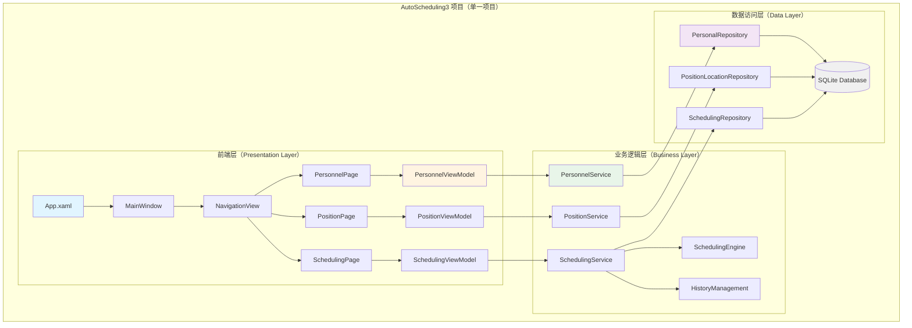

**架构分层说明**：

| 层级 | 职责 | 依赖方向 | 技术实现 |
|------|------|---------|----------|
| 展现层（Views） | UI 呈现、用户交互 | → ViewModels | XAML + Code-behind |
| 视图模型层（ViewModels） | UI 状态管理、命令处理 | → Services | MVVM 模式 |
| 业务逻辑层（Services） | 业务规则、流程控制 | → Repositories | 纯 C# 类 |
| 数据访问层（Repositories） | 数据持久化、CRUD | → 数据库 | ADO.NET + SQLite |
| 数据模型层（Models） | 数据结构定义 | 被所有层使用 | POCO 类 |

**解耦核心原则**：

1. **依赖倒置**：上层依赖接口而非具体实现
2. **单一职责**：每层只负责自己的职责范围
3. **数据传输对象**：层间使用 DTO 传递数据，避免直接暴露 Model
4. **依赖注入**：使用 DI 容器管理对象生命周期
5. **接口隔离**：定义清晰的接口边界

### 1.5 项目目录结构优化

**优化后的项目结构**：

```
AutoScheduling3/
├── Models/                         # 数据模型层（现有）
│   ├── Personal.cs
│   ├── PositionLocation.cs
│   ├── Schedule.cs
│   ├── Skill.cs
│   ├── SchedulingTemplate.cs          # 排班模板模型（新增）
│   └── Constraints/
│       ├── HolidayConfig.cs
│       ├── FixedPositionRule.cs
│       └── ManualAssignment.cs
│
├── DTOs/                           # 数据传输对象（新增）
│   ├── PersonnelDto.cs
│   ├── PositionDto.cs
│   ├── ScheduleDto.cs
│   ├── SchedulingTemplateDto.cs       # 模板 DTO（新增）
│   └── Mappers/                    # Model <-> DTO 映射
│       ├── PersonnelMapper.cs
│       ├── ScheduleMapper.cs
│       └── TemplateMapper.cs           # 模板映射（新增）
│
├── Data/                           # 数据访问层（现有，优化）
│   ├── Interfaces/                 # Repository 接口（新增）
│   │   ├── IPersonalRepository.cs
│   │   ├── IPositionRepository.cs
│   │   ├── ISkillRepository.cs
│   │   └── ITemplateRepository.cs      # 模板仓储接口（新增）
│   ├── PersonalRepository.cs
│   ├── PositionLocationRepository.cs
│   ├── SkillRepository.cs
│   ├── ConstraintRepository.cs
│   └── SchedulingTemplateRepository.cs # 模板仓储实现（新增）
│
├── Services/                       # 业务逻辑层（现有，扩展）
│   ├── Interfaces/                 # Service 接口（新增）
│   │   ├── IPersonnelService.cs
│   │   ├── IPositionService.cs
│   │   ├── ISkillService.cs
│   │   ├── ISchedulingService.cs
│   │   └── ITemplateService.cs         # 模板服务接口（新增）
│   ├── PersonnelService.cs         # 新增
│   ├── PositionService.cs          # 新增
│   ├── SkillService.cs             # 新增
│   ├── ConstraintService.cs        # 新增
│   ├── SchedulingService.cs        # 现有（重构）
│   └── TemplateService.cs          # 模板服务实现（新增）
│
├── SchedulingEngine/               # 排班算法层（现有）
│   ├── Core/
│   ├── Strategies/
│   └── GreedyScheduler.cs
│
├── History/                        # 历史管理（现有）
│   └── HistoryManagement.cs
│
├── ViewModels/                     # 视图模型层（新增）
│   ├── Base/
│   │   └── ViewModelBase.cs        # ViewModel 基类
│   ├── DataManagement/
│   │   ├── PersonnelViewModel.cs
│   │   ├── PositionViewModel.cs
│   │   ├── SkillViewModel.cs
│   │   └── ConstraintViewModel.cs
│   ├── Scheduling/
│   │   ├── CreateSchedulingViewModel.cs
│   │   ├── ScheduleResultViewModel.cs
│   │   └── TemplateViewModel.cs    # 模板管理（新增）
│   ├── History/
│   │   ├── HistoryListViewModel.cs
│   │   └── HistoryDetailViewModel.cs
│   └── MainViewModel.cs
│
├── Views/                          # 视图层（新增）
│   ├── DataManagement/
│   │   ├── PersonnelPage.xaml
│   │   ├── PositionPage.xaml
│   │   ├── SkillPage.xaml
│   │   └── ConstraintPage.xaml
│   ├── Scheduling/
│   │   ├── CreateSchedulingPage.xaml
│   │   ├── ScheduleResultPage.xaml
│   │   └── TemplatePage.xaml       # 模板管理页面（新增）
│   └── History/
│       ├── HistoryListPage.xaml
│       └── HistoryDetailPage.xaml
│
├── Controls/                       # 自定义控件（新增）
│   ├── ScheduleGridControl.xaml
│   ├── PersonnelCard.xaml
│   └── LoadingIndicator.xaml
│
├── Converters/                     # 值转换器（新增）
│   ├── BoolToVisibilityConverter.cs
│   └── DateTimeFormatConverter.cs
│
├── Helpers/                        # 辅助类（新增）
│   ├── NavigationService.cs
│   ├── DialogService.cs
│   └── SettingsHelper.cs
│
├── Assets/                         # 资源文件（现有）
│
├── App.xaml                        # 应用入口（现有）
├── App.xaml.cs
├── MainWindow.xaml                 # 主窗口（现有）
├── MainWindow.xaml.cs
└── AutoScheduling3.csproj
```

## 二、前后端解耦实现方案

### 2.1 解耦策略

**核心思想**：在同一项目内通过分层和依赖注入实现前后端逻辑分离，使各层职责清晰、可独立测试和维护。

**实现步骤**：

| 步骤 | 任务 | 预计时间 | 产出 |
|------|------|---------|------|
| 1 | 定义 Repository 接口 | 1小时 | IPersonalRepository 等接口 |
| 2 | 重构现有 Repository | 2小时 | 实现接口的 Repository 类 |
| 3 | 定义 Service 接口 | 2小时 | IPersonnelService 等接口 |
| 4 | 实现 Service 类 | 4小时 | PersonnelService 等实现类 |
| 5 | 创建 DTO 和 Mapper | 3小时 | DTOs/ 目录和 Mapper 类 |
| 6 | 创建 ViewModels | 6小时 | 所有 ViewModel 类 |
| 7 | 创建 Views | 8小时 | 所有 XAML 页面 |
| 8 | 实现模板管理功能 | 4小时 | 模板相关类和页面 |
| 9 | 配置依赖注入 | 2小时 | App.xaml.cs 配置 |
| 10 | 测试和调试 | 4小时 | 完整功能测试 |

**总计**：约 36 小时（4.5 个工作日）

### 2.2 核心接口定义

**IPersonnelService**：

| 方法 | 输入 | 输出 | 职责 |
|------|------|------|------|
| GetAllAsync | 无 | Task&lt;List&lt;PersonnelDto&gt;&gt; | 获取所有人员 |
| GetByIdAsync | int id | Task&lt;PersonnelDto&gt; | 获取单个人员 |
| CreateAsync | CreatePersonnelDto | Task&lt;PersonnelDto&gt; | 创建人员 |
| UpdateAsync | int id, UpdatePersonnelDto | Task | 更新人员 |
| DeleteAsync | int id | Task | 删除人员 |

**ISchedulingService**：

| 方法 | 输入 | 输出 | 职责 |
|------|------|------|------|
| ExecuteSchedulingAsync | SchedulingRequestDto | Task&lt;ScheduleDto&gt; | 执行排班 |
| GetDraftsAsync | 无 | Task&lt;List&lt;ScheduleSummaryDto&gt;&gt; | 获取草稿 |
| ConfirmAsync | int id | Task | 确认排班 |
| GetHistoryAsync | DateTime? start, DateTime? end | Task&lt;List&lt;ScheduleSummaryDto&gt;&gt; | 获取历史 |

### 2.3 SchedulingService 重构方案

#### 2.3.1 当前问题分析

**问题 1：职责过重（违反单一职责原则）**

当前 SchedulingService 承担了太多职责：
- ✗ 排班业务逻辑
- ✗ 人员管理（应该由 PersonnelService 负责）
- ✗ 哨位管理（应该由 PositionService 负责）
- ✗ 技能管理（应该由 SkillService 负责）
- ✗ 约束管理（应该由 ConstraintService 负责）
- ✗ 直接创建 Repository 实例（违反依赖倒置）

**问题 2：紧耦合**

当前实现：直接 new Repository 实例，导致紧耦合

影响：
- 无法进行单元测试（无法 Mock）
- 难以替换实现
- 违反依赖倒置原则

**问题 3：直接返回 Model 而非 DTO**

当前实现：直接返回 Model 对象

影响：
- UI 层直接依赖数据模型
- 数据模型变更会影响 UI 层
- 无法隐藏敏感字段

**问题 4：包含数据管理方法**

这些方法不应该在 SchedulingService 中：
- AddPersonalAsync、GetPersonalAsync 等人员管理方法
- AddPositionAsync、GetPositionAsync 等哨位管理方法
- AddSkillAsync、GetSkillAsync 等技能管理方法

#### 2.3.2 重构目标

**目标 1：职责分离**

| 服务 | 职责范围 | 不包含 |
|------|---------|--------|
| SchedulingService | 排班业务逻辑、历史管理 | 数据 CRUD |
| PersonnelService | 人员业务逻辑、人员 CRUD | 其他实体操作 |
| PositionService | 哨位业务逻辑、哨位 CRUD | 其他实体操作 |
| SkillService | 技能业务逻辑、技能 CRUD | 其他实体操作 |
| ConstraintService | 约束业务逻辑、约束 CRUD | 其他实体操作 |

**目标 2：依赖注入**

重构后：依赖接口而非具体实现，通过构造函数注入依赖

**目标 3：使用 DTO**

重构后：使用 DTO 在层间传递数据，隐藏实现细节

#### 2.3.3 重构步骤

**步骤 1：定义 ISchedulingService 接口**

接口方法：
- Task&lt;ScheduleDto&gt; ExecuteSchedulingAsync(SchedulingRequestDto request)
- Task&lt;List&lt;ScheduleSummaryDto&gt;&gt; GetDraftsAsync()
- Task&lt;ScheduleDto?&gt; GetScheduleByIdAsync(int id)
- Task ConfirmScheduleAsync(int id)
- Task DeleteDraftAsync(int id)
- Task&lt;List&lt;ScheduleSummaryDto&gt;&gt; GetHistoryAsync(DateTime? start, DateTime? end)

**步骤 2：移除数据管理方法**

从 SchedulingService 中删除以下方法：
- AddPersonalAsync、GetPersonalAsync、GetAllPersonalsAsync 等（移到 PersonnelService）
- AddPositionAsync、GetPositionAsync、GetAllPositionsAsync 等（移到 PositionService）
- AddSkillAsync、GetSkillAsync、GetAllSkillsAsync 等（移到 SkillService）
- AddFixedPositionRuleAsync、AddManualAssignmentAsync 等（移到 ConstraintService）

**步骤 3：修改构造函数为依赖注入**

修改前：
- 构造函数接收 dbPath 参数
- 内部直接 new 各个 Repository 实例
- 违反依赖倒置原则

修改后：
- 构造函数接收所有依赖的接口：
  - IPersonalRepository
  - IPositionRepository
  - ISkillRepository
  - IConstraintRepository
  - IHistoryManagement
  - ScheduleMapper
- 对每个参数进行空值检查
- 将接口实例保存到私有字段

**步骤 4：修改 ExecuteSchedulingAsync 方法**

修改前：
- 接收多个分散的参数（personalIds, positionIds, startDate, endDate 等）
- 返回 Schedule Model 对象
- UI 层直接依赖数据模型

修改后：
- 接收单个 SchedulingRequestDto 参数（封装所有请求数据）
- 从 DTO 中提取数据
- 调用原有业务逻辑
- 将结果 Schedule 转换为 ScheduleDto 后返回
- UI 层只依赖 DTO，不依赖 Model

**步骤 5：修改其他方法返回 DTO**

需要修改的方法：
- GetBufferSchedulesAsync → GetDraftsAsync（返回 ScheduleSummaryDto 列表）
- GetHistorySchedulesAsync → GetHistoryAsync（返回 ScheduleSummaryDto 列表）
- ConfirmSchedulingAsync → ConfirmScheduleAsync（参数改为 scheduleId）
- DeleteBufferScheduleAsync → DeleteDraftAsync（参数改为 scheduleId）

### 2.4 DTO 设计

#### 2.4.1 DTO 设计原则

| 原则 | 说明 | 示例 |
|------|------|------|
| 职责单一 | 每个 DTO 只负责一种数据传输场景 | PersonnelDto（展示）、CreatePersonnelDto（创建） |
| 轻量化 | 只包含必要字段，避免冗余 | 列表 DTO 不包含详细信息 |
| 扁平化 | 避免深层嵌套，必要时使用关联 ID | 使用 SkillId 而非嵌套 Skill 对象 |
| 不可变性 | 尽可能使用只读属性 | init 访问器或只读属性 |
| 验证友好 | 支持数据注解验证 | Required、Range 等特性 |

#### 2.4.2 核心 DTO 定义

**PersonnelDto（人员展示）**：

| 字段 | 类型 | 说明 |
|------|------|------|
| Id | int | 人员ID |
| Name | string | 姓名 |
| SkillId | int | 技能ID |
| SkillName | string | 技能名称（冗余字段，减少关联查询） |
| PositionLevel | int | 岗位级别 |
| DaysSinceLastShift | int | 距上次上岗天数 |
| IsActive | bool | 是否启用 |

**SchedulingRequestDto（排班请求）**：

| 字段 | 类型 | 说明 |
|------|------|------|
| PersonnelIds | List&lt;int&gt; | 参与排班人员ID列表 |
| PositionIds | List&lt;int&gt; | 参与排班哨位ID列表 |
| StartDate | DateTime | 排班开始日期 |
| EndDate | DateTime | 排班结束日期 |
| UseActiveHolidayConfig | bool | 是否使用活动休息日配置 |
| TemplateId | int? | 模板ID（可选） |

**ScheduleDto（排班结果）**：

| 字段 | 类型 | 说明 |
|------|------|------|
| Id | int | 排班表ID |
| Title | string | 标题 |
| StartDate | DateTime | 开始日期 |
| EndDate | DateTime | 结束日期 |
| PersonnelCount | int | 参与人数 |
| PositionCount | int | 哨位数量 |
| ShiftCount | int | 班次总数 |
| CreatedAt | DateTime | 创建时间 |
| IsConfirmed | bool | 是否已确认 |
| Shifts | List&lt;ShiftDto&gt; | 班次列表 |

**ShiftDto（班次）**：

| 字段 | 类型 | 说明 |
|------|------|------|
| Date | DateTime | 日期 |
| TimeSlot | int | 时段（0-11） |
| PositionId | int | 哨位ID |
| PositionName | string | 哨位名称 |
| PersonnelId | int | 人员ID |
| PersonnelName | string | 人员姓名 |

**ScheduleSummaryDto（排班摘要，用于列表显示）**：

| 字段 | 类型 | 说明 |
|------|------|------|
| Id | int | 排班表ID |
| Title | string | 标题 |
| StartDate | DateTime | 开始日期 |
| EndDate | DateTime | 结束日期 |
| PersonnelCount | int | 参与人数 |
| PositionCount | int | 哨位数量 |
| ShiftCount | int | 班次总数 |
| CreatedAt | DateTime | 创建时间 |
| IsConfirmed | bool | 是否已确认 |

#### 2.4.3 Mapper 设计

**PersonnelMapper**：

| 方法 | 输入 | 输出 | 职责 |
|------|------|------|------|
| ToDto | Personal model | PersonnelDto | Model 转 DTO |
| ToDtoList | List&lt;Personal&gt; | List&lt;PersonnelDto&gt; | 批量转换 |
| ToModel | CreatePersonnelDto | Personal | 创建时 DTO 转 Model |
| UpdateModel | UpdatePersonnelDto, Personal | void | 更新时合并数据 |

**ScheduleMapper**：

| 方法 | 输入 | 输出 | 职责 |
|------|------|------|------|
| ToDto | Schedule model | ScheduleDto | Model 转 DTO |
| ToSummaryDto | Schedule model | ScheduleSummaryDto | Model 转摘要 DTO |
| ToSummaryDtoList | List&lt;Schedule&gt; | List&lt;ScheduleSummaryDto&gt; | 批量转摘要 |

**Mapper 实现原则**：
- 使用同步方法进行简单映射
- 需要关联查询的字段（如 SkillName）在 Service 层异步加载后填充
- Mapper 只负责属性拷贝，不包含业务逻辑
- 使用空值检查，避免 NullReferenceException

### 2.5 依赖注入配置

#### 2.5.1 服务生命周期

| 服务类型 | 生命周期 | 原因 |
|---------|---------|------|
| Repositories | Singleton | 轻量级，无状态，全局共享连接池 |
| Services | Singleton | 业务逻辑无状态，全局共享 |
| Mappers | Singleton | 无状态，纯映射逻辑 |
| ViewModels | Transient | 每个页面实例独立，避免状态污染 |
| Helpers | Singleton | 辅助工具，全局共享 |

#### 2.5.2 App.xaml.cs 配置流程

**配置步骤**：

1. 创建 ServiceCollection 实例
2. 注册 Repositories（Singleton）
   - 使用工厂方法传递 DatabasePath
   - 注册接口和实现类
3. 注册 Mappers（Singleton）
   - 无构造参数，直接注册
4. 注册 Services（Singleton）
   - 依赖 Repositories 和 Mappers
   - 通过构造函数注入
5. 注册 Helpers（Singleton）
   - NavigationService、DialogService
6. 注册 ViewModels（Transient）
   - 依赖 Services 和 Helpers
7. 构建 ServiceProvider
8. 初始化数据库（调用各 Repository 的 InitAsync 方法）

#### 2.5.3 数据库初始化策略

**初始化时机**：OnLaunched 方法中，MainWindow 创建之前

**初始化流程**：
1. 从 ServiceProvider 获取所有 Repository 实例
2. 按依赖顺序调用 InitAsync 方法：
   - SkillRepository（无依赖）
   - PersonalRepository（依赖 Skill）
   - PositionLocationRepository（依赖 Skill）
   - ConstraintRepository（依赖 Personal、Position）
   - SchedulingRepository（依赖所有）
   - SchedulingTemplateRepository（依赖所有）
3. 异常处理：捕获异常并记录日志，不中断应用启动

**错误处理策略**：
- 记录详细错误信息到日志文件
- 显示用户友好的错误对话框
- 提供重试机制（可选）
- 降级策略：部分表初始化失败时，禁用相关功能但允许应用继续运行

## 三、主界面设计

### 3.1 MainWindow 布局结构

**整体布局**：

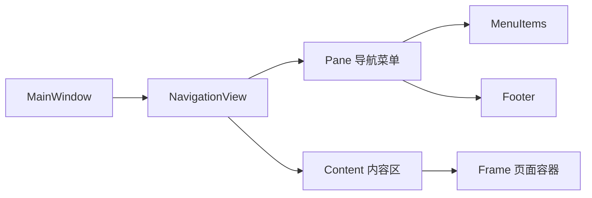

**NavigationView 配置**：

| 属性 | 值 | 说明 |
|------|-----|------|
| PaneDisplayMode | Left | 左侧导航模式 |
| IsBackButtonVisible | Collapsed | 隐藏返回按钮 |
| IsSettingsVisible | True | 显示设置按钮 |
| IsPaneToggleButtonVisible | True | 显示折叠按钮 |
| OpenPaneLength | 240 | 展开宽度 240px |

### 3.2 导航菜单结构

**一级菜单项**：

| 图标 | 标题 | 目标页面 | 功能说明 |
|------|------|---------|----------|
| Calendar | 排班管理 | CreateSchedulingPage | 创建新排班 |
| ContactInfo | 人员管理 | PersonnelPage | 人员信息维护 |
| MapPin | 哨位管理 | PositionPage | 哨位信息维护 |
| Education | 技能管理 | SkillPage | 技能信息维护 |
| Document | 模板管理 | TemplatePage | 排班模板管理 |
| History | 历史记录 | HistoryListPage | 查看历史排班 |

**Footer 菜单项**：

| 图标 | 标题 | 目标页面 | 功能说明 |
|------|------|---------|----------|
| Setting | 设置 | SettingsPage | 系统设置 |

### 3.3 导航交互逻辑

**页面跳转流程**：

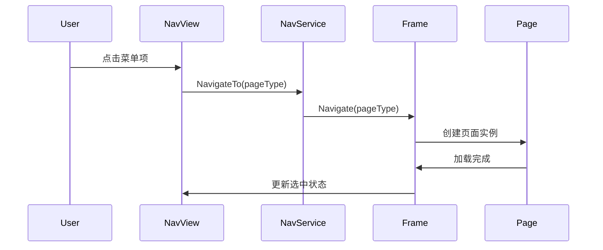

**导航状态管理**：

| 场景 | 处理方式 |
|------|---------|
| 首次启动 | 默认导航到 CreateSchedulingPage |
| 点击菜单项 | 导航到对应页面，更新选中状态 |
| 返回键 | 导航到上一页（如果有历史记录） |
| 外部触发导航 | 通过 NavigationService 统一管理 |

### 3.4 主题和样式

**主题支持**：

| 主题 | 触发方式 | 应用范围 |
|------|---------|----------|
| Light | 系统设置或手动切换 | 全局 |
| Dark | 系统设置或手动切换 | 全局 |
| HighContrast | 系统辅助功能 | 全局 |

**配色方案（Light 主题）**：

| 元素 | 颜色 | 用途 |
|------|------|------|
| 主色调 | #0078D4（蓝色） | 强调、选中状态 |
| 次色调 | #E1E1E1（浅灰） | 背景、分隔线 |
| 成功 | #107C10（绿色） | 成功状态 |
| 警告 | #FFB900（黄色） | 警告提示 |
| 错误 | #D13438（红色） | 错误提示 |
| 文本主色 | #000000（黑色） | 主要文本 |
| 文本次色 | #605E5C（灰色） | 次要文本 |

**配色方案（Dark 主题）**：

| 元素 | 颜色 | 用途 |
|------|------|------|
| 主色调 | #60CDFF（浅蓝色） | 强调、选中状态 |
| 次色调 | #2B2B2B（深灰） | 背景、分隔线 |
| 成功 | #6CCB5F（浅绿） | 成功状态 |
| 警告 | #FCE100（亮黄） | 警告提示 |
| 错误 | #FF99A4（浅红） | 错误提示 |
| 文本主色 | #FFFFFF（白色） | 主要文本 |
| 文本次色 | #8A8886（浅灰） | 次要文本 |

## 四、数据管理页面设计

### 4.1 人员管理页面（PersonnelPage）

#### 4.1.1 页面布局

**整体结构**：

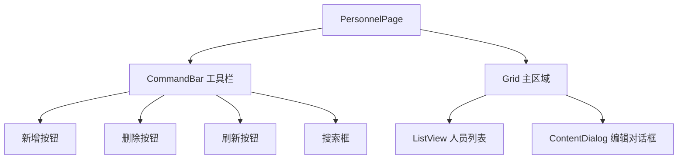

**CommandBar 工具栏**：

| 按钮 | 图标 | 快捷键 | 功能 |
|------|------|--------|------|
| 新增 | Add | Ctrl+N | 打开新增人员对话框 |
| 编辑 | Edit | Enter | 编辑选中人员 |
| 删除 | Delete | Delete | 删除选中人员 |
| 刷新 | Refresh | F5 | 重新加载列表 |
| 导入 | Import | - | 从文件导入人员数据 |
| 导出 | Export | - | 导出人员数据到文件 |

**搜索框**：
- 位置：CommandBar 右侧
- 占位符：搜索姓名或技能
- 实时过滤：输入时即时过滤列表

#### 4.1.2 人员列表设计

**ListView 列定义**：

| 列名 | 宽度 | 数据绑定 | 格式化 |
|------|------|---------|--------|
| 姓名 | 150px | Name | 无 |
| 技能 | 120px | SkillName | 无 |
| 岗位级别 | 100px | PositionLevel | 数字 |
| 距上次上岗 | 120px | DaysSinceLastShift | 天数单位 |
| 状态 | 80px | IsActive | 启用/禁用 |
| 操作 | 100px | - | 编辑/删除按钮 |

**列表项交互**：

| 交互 | 触发方式 | 响应 |
|------|---------|------|
| 单击 | 鼠标左键单击 | 选中行 |
| 双击 | 鼠标左键双击 | 打开编辑对话框 |
| 右键菜单 | 鼠标右键单击 | 显示上下文菜单（编辑、删除） |
| 多选 | Ctrl/Shift+单击 | 批量选中 |

**空状态显示**：
- 条件：列表无数据时
- 内容：显示提示文本"暂无人员数据，点击【新增】按钮创建"
- 图标：ContactInfo 图标（灰色）

#### 4.1.3 新增/编辑对话框

**ContentDialog 布局**：

| 字段 | 控件类型 | 验证规则 | 说明 |
|------|---------|---------|------|
| 姓名 | TextBox | 必填，最大50字符 | 人员姓名 |
| 技能 | ComboBox | 必选 | 从技能列表选择 |
| 岗位级别 | NumberBox | 必填，1-10 | 岗位级别数值 |
| 距上次上岗 | NumberBox | 必填，≥0 | 初始间隔天数 |
| 是否启用 | ToggleSwitch | - | 启用/禁用状态 |

**对话框按钮**：

| 按钮 | 功能 | 可用条件 |
|------|------|---------|
| 确定 | 保存数据并关闭 | 所有验证通过 |
| 取消 | 关闭对话框，不保存 | 始终可用 |

**验证反馈**：
- 实时验证：失焦时验证字段
- 错误提示：在控件下方显示红色错误文本
- 禁用提交：验证不通过时禁用"确定"按钮

#### 4.1.4 PersonnelViewModel 设计

**属性**：

| 属性名 | 类型 | 说明 |
|--------|------|------|
| Personnels | ObservableCollection&lt;PersonnelDto&gt; | 人员列表 |
| SelectedPersonnel | PersonnelDto? | 选中的人员 |
| IsLoading | bool | 是否正在加载 |
| SearchText | string | 搜索关键词 |
| Skills | List&lt;SkillDto&gt; | 技能下拉列表数据源 |

**命令**：

| 命令名 | 参数 | 功能 |
|--------|------|------|
| LoadCommand | 无 | 加载人员列表 |
| AddCommand | 无 | 打开新增对话框 |
| EditCommand | PersonnelDto | 打开编辑对话框 |
| DeleteCommand | PersonnelDto | 删除人员（带确认） |
| RefreshCommand | 无 | 刷新列表 |
| SearchCommand | string | 搜索过滤 |

**业务逻辑**：

| 方法 | 职责 | 异常处理 |
|------|------|---------|
| LoadPersonnelsAsync | 调用 PersonnelService.GetAllAsync | 显示错误对话框 |
| AddPersonnelAsync | 调用 PersonnelService.CreateAsync | 显示错误对话框 |
| UpdatePersonnelAsync | 调用 PersonnelService.UpdateAsync | 显示错误对话框 |
| DeletePersonnelAsync | 调用 PersonnelService.DeleteAsync | 显示错误对话框 |
| FilterPersonnels | 本地过滤 Personnels 集合 | 无 |

### 4.2 哨位管理页面（PositionPage）

#### 4.2.1 页面布局

布局结构与 PersonnelPage 类似，采用统一的数据管理页面模式。

**ListView 列定义**：

| 列名 | 宽度 | 数据绑定 | 格式化 |
|------|------|---------|--------|
| 哨位名称 | 150px | Name | 无 |
| 要求技能 | 120px | RequiredSkillName | 无 |
| 优先级 | 100px | Priority | 数字 |
| 状态 | 80px | IsActive | 启用/禁用 |
| 操作 | 100px | - | 编辑/删除按钮 |

#### 4.2.2 新增/编辑对话框

| 字段 | 控件类型 | 验证规则 | 说明 |
|------|---------|---------|------|
| 哨位名称 | TextBox | 必填，最大50字符 | 哨位名称 |
| 要求技能 | ComboBox | 必选 | 从技能列表选择 |
| 优先级 | NumberBox | 必填，1-10 | 优先级数值 |
| 是否启用 | ToggleSwitch | - | 启用/禁用状态 |

#### 4.2.3 PositionViewModel 设计

**属性**：

| 属性名 | 类型 | 说明 |
|--------|------|------|
| Positions | ObservableCollection&lt;PositionDto&gt; | 哨位列表 |
| SelectedPosition | PositionDto? | 选中的哨位 |
| IsLoading | bool | 是否正在加载 |
| SearchText | string | 搜索关键词 |
| Skills | List&lt;SkillDto&gt; | 技能下拉列表数据源 |

### 4.3 技能管理页面（SkillPage）

#### 4.3.1 页面布局

**ListView 列定义**：

| 列名 | 宽度 | 数据绑定 | 格式化 |
|------|------|---------|--------|
| 技能名称 | 200px | Name | 无 |
| 描述 | 300px | Description | 无 |
| 人员数量 | 100px | PersonnelCount | 统计数值 |
| 哨位数量 | 100px | PositionCount | 统计数值 |
| 操作 | 100px | - | 编辑/删除按钮 |

#### 4.3.2 新增/编辑对话框

| 字段 | 控件类型 | 验证规则 | 说明 |
|------|---------|---------|------|
| 技能名称 | TextBox | 必填，最大50字符 | 技能名称 |
| 描述 | TextBox | 可选，最大200字符 | 技能描述 |

#### 4.3.3 删除验证

**删除前检查**：
1. 检查是否有人员关联此技能
2. 检查是否有哨位要求此技能
3. 如果有关联，显示警告对话框：
   - 标题："无法删除技能"
   - 内容："该技能已被 X 个人员和 Y 个哨位使用，请先解除关联"
   - 按钮："确定"
4. 如果无关联，显示确认对话框：
   - 标题："确认删除"
   - 内容："确定要删除技能【{技能名称}】吗？"
   - 按钮："删除"、"取消"

### 4.4 模板管理页面（TemplatePage）

#### 4.4.1 页面布局

**整体结构**：

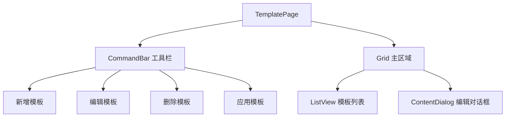

**ListView 列定义**：

| 列名 | 宽度 | 数据绑定 | 格式化 |
|------|------|---------|--------|
| 模板名称 | 150px | Name | 无 |
| 类型 | 100px | TemplateType | 常规/节假日/特殊 |
| 描述 | 200px | Description | 无 |
| 默认 | 60px | IsDefault | ⭐ 图标 |
| 使用次数 | 80px | UsageCount | 数字 |
| 最后使用 | 120px | LastUsedAt | 日期时间格式 |
| 操作 | 150px | - | 应用/编辑/删除按钮 |

#### 4.4.2 新增/编辑模板对话框

**对话框布局（分步骤）**：

**步骤 1：基本信息**

| 字段 | 控件类型 | 验证规则 |
|------|---------|---------|
| 模板名称 | TextBox | 必填，最大50字符 |
| 模板类型 | RadioButtons | 必选（常规/节假日/特殊） |
| 描述 | TextBox | 可选，最大200字符 |
| 设为默认 | CheckBox | - |

**步骤 2：人员和哨位选择**

| 字段 | 控件类型 | 说明 |
|------|---------|------|
| 参与人员 | ListView（多选） | 从人员列表选择 |
| 参与哨位 | ListView（多选） | 从哨位列表选择 |

**步骤 3：约束配置**

| 字段 | 控件类型 | 说明 |
|------|---------|------|
| 休息日配置 | ComboBox | 选择休息日配置或使用当前活动配置 |
| 定岗规则 | ListView（多选） | 启用的定岗规则 |
| 手动指定 | ListView（多选） | 启用的手动指定 |

**对话框导航**：

| 按钮 | 位置 | 功能 |
|------|------|------|
| 上一步 | 左下角 | 返回上一步（第1步禁用） |
| 下一步 | 右下角 | 进入下一步（第3步显示为"完成"） |
| 取消 | 右下角 | 关闭对话框 |

#### 4.4.3 应用模板功能

**应用模板流程**：

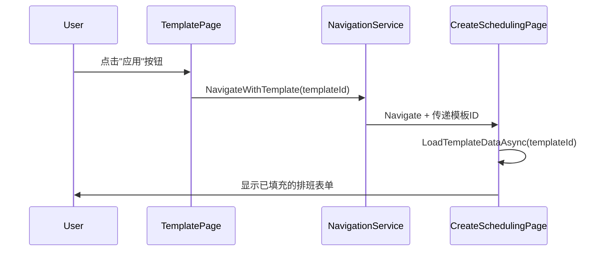

**模板数据填充**：
1. 自动选择模板中的人员列表
2. 自动选择模板中的哨位列表
3. 自动应用休息日配置
4. 自动启用定岗规则和手动指定
5. 用户可以修改任何自动填充的数据

#### 4.4.4 TemplateViewModel 设计

**属性**：

| 属性名 | 类型 | 说明 |
|--------|------|------|
| Templates | ObservableCollection&lt;TemplateDto&gt; | 模板列表 |
| SelectedTemplate | TemplateDto? | 选中的模板 |
| IsLoading | bool | 是否正在加载 |
| AvailablePersonnels | List&lt;PersonnelDto&gt; | 可选人员列表 |
| AvailablePositions | List&lt;PositionDto&gt; | 可选哨位列表 |

**命令**：

| 命令名 | 参数 | 功能 |
|--------|------|------|
| LoadCommand | 无 | 加载模板列表 |
| AddCommand | 无 | 打开新增模板对话框 |
| EditCommand | TemplateDto | 打开编辑模板对话框 |
| DeleteCommand | TemplateDto | 删除模板 |
| ApplyCommand | TemplateDto | 应用模板到排班页面 |
| SetDefaultCommand | TemplateDto | 设置为默认模板 |

## 五、排班管理页面设计

### 5.1 创建排班页面（CreateSchedulingPage）

#### 5.1.1 页面布局

**整体结构（三栏布局）**：

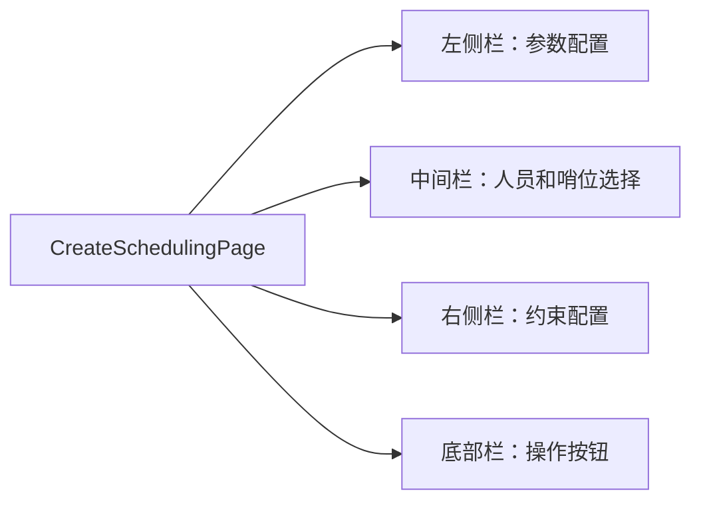

**左侧栏：参数配置（宽度 300px）**

| 控件 | 类型 | 说明 |
|------|------|------|
| 排班模板 | ComboBox | 选择已保存的模板（可选） |
| 开始日期 | DatePicker | 必选，默认今天 |
| 结束日期 | DatePicker | 必选，默认今天+6天 |
| 排班天数 | TextBlock | 自动计算（只读） |
| 班次总数 | TextBlock | 自动计算：天数 × 12（只读） |

**中间栏：人员和哨位选择（自适应宽度）**

**Tab 1：参与人员**

| 控件 | 类型 | 说明 |
|------|------|------|
| 全选/全不选 | CheckBox | 快速选择 |
| 搜索框 | AutoSuggestBox | 实时过滤 |
| 人员列表 | ListView（多选） | 显示姓名、技能、距上次上岗 |
| 已选统计 | TextBlock | 显示"已选 X 人" |

**Tab 2：参与哨位**

| 控件 | 类型 | 说明 |
|------|------|------|
| 全选/全不选 | CheckBox | 快速选择 |
| 搜索框 | AutoSuggestBox | 实时过滤 |
| 哨位列表 | ListView（多选） | 显示名称、要求技能、优先级 |
| 已选统计 | TextBlock | 显示"已选 X 个哨位" |

**右侧栏：约束配置（宽度 300px）**

**Expander 1：休息日配置**

| 控件 | 类型 | 说明 |
|------|------|------|
| 使用活动配置 | ToggleSwitch | 默认开启 |
| 配置选择 | ComboBox | 关闭上面开关时可选 |
| 配置详情 | TextBlock | 显示配置摘要 |

**Expander 2：定岗规则**

| 控件 | 类型 | 说明 |
|------|------|------|
| 规则列表 | ListView（多选） | 显示规则描述和启用状态 |
| 新增规则 | Button | 跳转到约束管理页面 |

**Expander 3：手动指定**

| 控件 | 类型 | 说明 |
|------|------|------|
| 指定列表 | ListView（多选） | 显示日期、时段、人员、哨位 |
| 新增指定 | Button | 打开手动指定对话框 |

**底部栏：操作按钮**

| 按钮 | 样式 | 功能 | 快捷键 |
|------|------|------|--------|
| 开始排班 | Accent（主要） | 执行排班算法 | Ctrl+Enter |
| 保存为模板 | Default | 保存当前配置为模板 | Ctrl+S |
| 重置 | Default | 重置所有配置 | Ctrl+R |

#### 5.1.2 数据验证

**验证规则**：

| 字段 | 验证规则 | 错误提示 |
|------|---------|----------|
| 开始日期 | 不能为空 | "请选择开始日期" |
| 结束日期 | 不能为空且≥开始日期 | "结束日期必须大于等于开始日期" |
| 参与人员 | 至少选择1人 | "请至少选择1名参与人员" |
| 参与哨位 | 至少选择1个哨位 | "请至少选择1个哨位" |

**验证时机**：
- 实时验证：字段失焦或值改变时
- 提交验证：点击"开始排班"按钮时
- 验证反馈：在控件下方显示红色错误文本，并禁用"开始排班"按钮

#### 5.1.3 排班执行流程

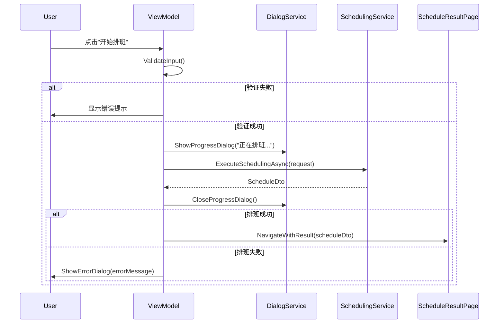

#### 5.1.4 SchedulingViewModel 设计

**属性**：

| 属性名 | 类型 | 说明 |
|--------|------|------|
| SelectedTemplate | TemplateDto? | 选中的模板 |
| StartDate | DateTimeOffset | 开始日期 |
| EndDate | DateTimeOffset | 结束日期 |
| DaysCount | int | 排班天数（计算属性） |
| ShiftsCount | int | 班次总数（计算属性） |
| AvailablePersonnels | ObservableCollection&lt;PersonnelDto&gt; | 可选人员列表 |
| SelectedPersonnels | ObservableCollection&lt;PersonnelDto&gt; | 已选人员列表 |
| AvailablePositions | ObservableCollection&lt;PositionDto&gt; | 可选哨位列表 |
| SelectedPositions | ObservableCollection&lt;PositionDto&gt; | 已选哨位列表 |
| UseActiveHolidayConfig | bool | 是否使用活动休息日配置 |
| IsExecuting | bool | 是否正在执行排班 |

**命令**：

| 命令名 | 功能 | 可用条件 |
|--------|------|---------|
| LoadTemplateCommand | 加载模板数据 | SelectedTemplate 不为空 |
| ExecuteSchedulingCommand | 执行排班 | 验证通过且未在执行中 |
| SaveAsTemplateCommand | 保存为模板 | 验证通过 |
| ResetCommand | 重置配置 | 始终可用 |

### 5.2 排班结果页面（ScheduleResultPage）

#### 5.2.1 页面布局

**整体结构**：

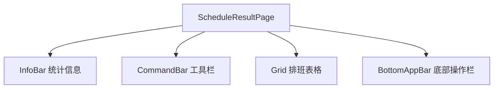

**InfoBar 统计信息**：

| 字段 | 数据源 | 格式 |
|------|--------|------|
| 排班时间范围 | StartDate - EndDate | "YYYY年MM月DD日 - YYYY年MM月DD日" |
| 参与人数 | PersonnelCount | "X 人" |
| 哨位数量 | PositionCount | "X 个" |
| 班次总数 | ShiftCount | "X 次" |
| 生成时间 | CreatedAt | "YYYY-MM-DD HH:mm:ss" |

**CommandBar 工具栏**：

| 按钮 | 图标 | 功能 |
|------|------|------|
| 确认排班 | Accept | 确认并保存到历史 |
| 保存草稿 | Save | 保存到草稿区 |
| 导出Excel | ExportMirrored | 导出为Excel文件 |
| 打印 | Print | 打印排班表 |
| 返回编辑 | Back | 返回创建排班页面 |

#### 5.2.2 排班表格设计

**表格结构（GridView）**：

**行头（垂直方向）**：

| 层级 | 内容 | 说明 |
|------|------|------|
| 第1列 | 日期 | "MM月DD日 星期X" |

**列头（水平方向）**：

| 层级 | 内容 | 说明 |
|------|------|------|
| 第1行 | 哨位名称 | 所有参与哨位 |
| 第2行 | 时段标签 | "00:00-02:00" 等12个时段 |

**单元格内容**：

| 内容 | 格式 | 交互 |
|------|------|------|
| 人员姓名 | 文本 | 悬停显示详细信息（技能、间隔天数） |
| 空班次 | "未排班" | 显示灰色 |

**表格交互**：

| 交互 | 触发方式 | 响应 |
|------|---------|------|
| 悬停单元格 | 鼠标悬停 | 显示 Tooltip（人员详细信息） |
| 点击单元格 | 鼠标单击 | 高亮该人员的所有班次 |
| 右键菜单 | 鼠标右键 | 显示"调整班次"菜单 |

**颜色编码**：

| 场景 | 颜色 | 说明 |
|------|------|------|
| 正常班次 | 默认背景 | 无特殊标记 |
| 固定岗位 | 浅蓝色背景 | 定岗规则指定 |
| 手动指定 | 浅绿色背景 | 手动指定 |
| 未排班 | 浅灰色背景 | 无人值班 |

#### 5.2.3 确认排班流程

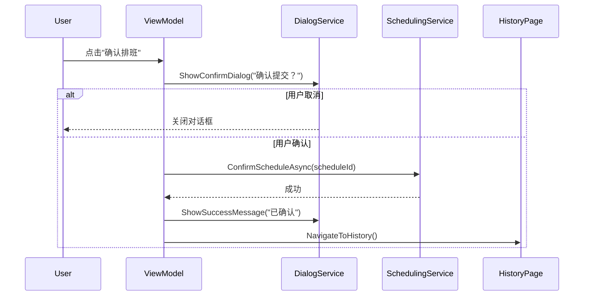

#### 5.2.4 ScheduleResultViewModel 设计

**属性**：

| 属性名 | 类型 | 说明 |
|--------|------|------|
| Schedule | ScheduleDto | 排班结果 |
| GridData | ObservableCollection&lt;ScheduleGridRow&gt; | 表格数据（转换后） |
| SelectedCell | ShiftDto? | 选中的单元格 |
| IsConfirmed | bool | 是否已确认 |

**命令**：

| 命令名 | 功能 |
|--------|------|
| ConfirmCommand | 确认排班 |
| SaveDraftCommand | 保存草稿 |
| ExportCommand | 导出Excel |
| PrintCommand | 打印 |
| BackCommand | 返回编辑 |

**数据转换逻辑**：

ScheduleDto → ScheduleGridRow 转换规则：
1. 按日期分组 Shifts
2. 每个日期创建一个 ScheduleGridRow 对象
3. ScheduleGridRow 包含：
   - Date：日期
   - Cells：Dictionary&lt;(int PositionId, int TimeSlot), ShiftDto&gt;
4. 通过 (PositionId, TimeSlot) 键快速查找单元格数据

### 5.3 草稿管理页面（DraftsPage）

#### 5.3.1 页面布局

**ListView 列定义**：

| 列名 | 宽度 | 数据绑定 | 格式化 |
|------|------|---------|--------|
| 标题 | 200px | Title | 无 |
| 时间范围 | 180px | - | "开始日期 - 结束日期" |
| 人数/哨位 | 120px | - | "X人 / Y个" |
| 班次数 | 80px | ShiftCount | 数字 |
| 创建时间 | 150px | CreatedAt | 日期时间 |
| 操作 | 150px | - | 查看/确认/删除按钮 |

**CommandBar 工具栏**：

| 按钮 | 功能 |
|------|------|
| 刷新 | 重新加载草稿列表 |
| 批量删除 | 删除选中的草稿 |
| 清空草稿 | 清空所有草稿 |

#### 5.3.2 草稿操作

**查看草稿**：
- 导航到 ScheduleResultPage，显示草稿内容
- 允许确认或继续编辑

**确认草稿**：
- 直接调用 ConfirmScheduleAsync
- 移动到历史记录

**删除草稿**：
- 显示确认对话框
- 调用 DeleteDraftAsync

### 5.4 历史记录页面（HistoryListPage）

#### 5.4.1 页面布局

**筛选栏**：

| 控件 | 类型 | 功能 |
|------|------|------|
| 开始日期 | DatePicker | 筛选起始日期 |
| 结束日期 | DatePicker | 筛选结束日期 |
| 搜索框 | AutoSuggestBox | 搜索标题 |
| 筛选按钮 | Button | 应用筛选条件 |

**ListView 列定义**：

| 列名 | 宽度 | 数据绑定 | 格式化 |
|------|------|---------|--------|
| 标题 | 200px | Title | 无 |
| 时间范围 | 180px | - | "开始日期 - 结束日期" |
| 人数/哨位 | 120px | - | "X人 / Y个" |
| 班次数 | 80px | ShiftCount | 数字 |
| 确认时间 | 150px | ConfirmedAt | 日期时间 |
| 操作 | 100px | - | 查看/导出按钮 |

#### 5.4.2 历史记录详情

**查看详情**：
- 导航到 ScheduleResultPage（只读模式）
- 隐藏"确认排班"和"保存草稿"按钮
- 只显示"导出"和"打印"按钮

**导出历史**：
- 导出为 Excel 文件
- 文件名格式："排班表_{标题}_{确认日期}.xlsx"

## 六、数据流和状态管理

### 6.1 MVVM 数据绑定

**数据绑定方向**：

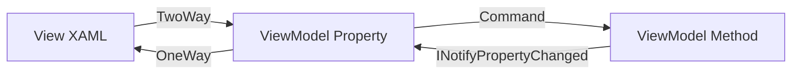

**绑定模式**：

| 绑定场景 | 绑定模式 | 示例 |
|---------|---------|------|
| 显示数据 | OneWay | TextBlock.Text="{Binding Name}" |
| 输入控件 | TwoWay | TextBox.Text="{Binding Name, Mode=TwoWay}" |
| 按钮命令 | OneTime | Button.Command="{Binding SaveCommand}" |
| 列表数据 | OneWay | ListView.ItemsSource="{Binding Items}" |

### 6.2 ObservableCollection 使用

**使用场景**：

| 场景 | 集合类型 | 原因 |
|------|---------|------|
| 列表数据 | ObservableCollection&lt;T&gt; | 自动通知 UI 更新 |
| 静态下拉列表 | List&lt;T&gt; | 数据不变，无需通知 |
| 临时数据 | List&lt;T&gt; | 仅内部使用，不绑定 |

**集合操作原则**：
- 在 UI 线程上操作 ObservableCollection
- 批量更新时使用 SuspendNotifications 模式（如果支持）
- 避免频繁 Clear + AddRange，尽量使用增量更新

### 6.3 INotifyPropertyChanged 实现

**实现方式**：

使用 CommunityToolkit.Mvvm 的 ObservableObject 基类

**属性定义模式**：

使用 [ObservableProperty] 特性自动生成属性通知代码

**手动通知**：

在复杂计算属性中，手动调用 OnPropertyChanged 方法

### 6.4 异步操作处理

**加载状态管理**：

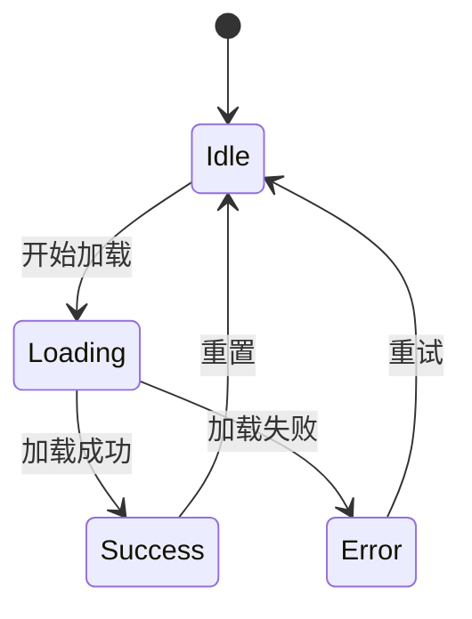

**异步加载模式**：

| 步骤 | ViewModel 操作 | UI 响应 |
|------|---------------|---------|
| 1 | IsLoading = true | 显示 ProgressRing |
| 2 | await Service.GetDataAsync() | 等待数据 |
| 3 | Items.Clear() + Items.Add(...) | 更新列表 |
| 4 | IsLoading = false | 隐藏 ProgressRing |
| 异常 | ShowError(ex.Message) | 显示错误对话框 |

**取消操作支持**：

- 长时间操作（如排班）支持 CancellationToken
- UI 提供"取消"按钮
- ViewModel 传递 CancellationTokenSource.Token 到 Service
- Service 在适当位置检查 token.IsCancellationRequested

### 6.5 错误处理策略

**异常分类处理**：

| 异常类型 | 处理方式 | 用户反馈 |
|---------|---------|----------|
| 验证异常 | 在 UI 显示验证错误 | 红色错误文本 |
| 业务异常 | 显示错误对话框 | 对话框 + 错误消息 |
| 数据访问异常 | 记录日志 + 显示对话框 | "数据操作失败，请重试" |
| 未知异常 | 记录日志 + 显示通用对话框 | "系统错误，请联系管理员" |

**全局异常处理**：

在 App.xaml.cs 中注册 UnhandledException 事件处理程序：
1. 记录异常详细信息到日志文件
2. 显示友好的错误对话框
3. 标记 e.Handled = true 防止应用崩溃
4. 根据异常严重程度决定是否继续运行

## 七、UI 控件和样式

### 7.1 自定义控件

#### 7.1.1 ScheduleGridControl（排班表格控件）

**用途**：显示排班结果的二维表格，支持日期 × 哨位 × 时段的三维数据展示

**属性**：

| 属性名 | 类型 | 说明 |
|--------|------|------|
| Schedule | ScheduleDto | 排班数据源 |
| ShowStatistics | bool | 是否显示统计信息 |
| IsReadOnly | bool | 是否只读模式 |
| SelectedShift | ShiftDto | 选中的班次 |

**事件**：

| 事件名 | 参数 | 说明 |
|--------|------|------|
| ShiftClicked | ShiftDto | 点击班次时触发 |
| ShiftRightClicked | ShiftDto | 右键班次时触发 |

**模板结构**：

- 外层：ScrollViewer（支持横向和纵向滚动）
- 内层：Grid（动态生成行列）
- 单元格：Border + TextBlock（显示人员姓名）
- 工具提示：ToolTip（显示人员详细信息）

#### 7.1.2 PersonnelCard（人员卡片控件）

**用途**：以卡片形式展示人员信息，用于列表或选择界面

**属性**：

| 属性名 | 类型 | 说明 |
|--------|------|------|
| Personnel | PersonnelDto | 人员数据 |
| IsSelected | bool | 是否选中 |
| ShowActions | bool | 是否显示操作按钮 |

**布局**：

```
┌─────────────────────────┐
│ 姓名              [启用]│
│ 技能：XXX              │
│ 岗位级别：X            │
│ 距上次上岗：X天        │
│ [编辑] [删除]          │
└─────────────────────────┘
```

#### 7.1.3 LoadingIndicator（加载指示器）

**用途**：显示加载状态，包含进度环和提示文本

**属性**：

| 属性名 | 类型 | 说明 |
|--------|------|------|
| IsLoading | bool | 是否显示加载状态 |
| Message | string | 加载提示文本 |

**样式**：

- 使用 ProgressRing 控件
- 半透明背景遮罩
- 居中显示
- 支持取消按钮（可选）

### 7.2 值转换器

#### 7.2.1 BoolToVisibilityConverter

**功能**：将布尔值转换为 Visibility 枚举

**转换规则**：

| 输入 | 输出（默认） | 输出（Inverted） |
|------|-------------|-----------------|
| true | Visible | Collapsed |
| false | Collapsed | Visible |
| null | Collapsed | Collapsed |

**参数**：

- ConverterParameter="Inverted"：反转转换逻辑

#### 7.2.2 DateTimeFormatConverter

**功能**：格式化 DateTime 对象为指定格式字符串

**转换规则**：

| 格式参数 | 输出示例 |
|---------|---------|
| Date | "2024年1月15日" |
| DateTime | "2024-01-15 14:30:00" |
| Time | "14:30" |
| Relative | "3天前" |

#### 7.2.3 NullToVisibilityConverter

**功能**：将 null 值转换为 Visibility 枚举

**转换规则**：

| 输入 | 输出（默认） | 输出（Inverted） |
|------|-------------|-----------------|
| null | Collapsed | Visible |
| 非null | Visible | Collapsed |


