# AutoScheduling3 自动排班系统 UI 设计方案

## 一、设计概览

### 1.1 设计原则

本设计方案遵循 WinUI 3 规范和 Windows 11 设计语言（Fluent Design System），实现前后端完全分离的桌面应用界面。

**核心设计理念**：
- **流畅性（Fluency）**：使用 Acrylic 材质、动画过渡和微交互增强用户体验
- **适应性（Adaptability）**：支持亮色/暗色主题，响应式布局
- **清晰性（Clarity）**：信息层级分明，导航路径清晰
- **高效性（Efficiency）**：减少操作步骤，提供快捷操作入口

**前后端分离架构**：
- 前端：WinUI 3 桌面应用，负责 UI 呈现和用户交互
- 后端：Web API 服务（ASP.NET Core），提供 RESTful 接口
- 通信：HTTP/HTTPS + JSON 数据格式
- 状态管理：前端使用 MVVM 模式，后端无状态设计

### 1.2 技术栈

| 层级 | 技术选型 | 说明 |
|------|---------|------|
| 前端框架 | WinUI 3 | Windows 应用 SDK，原生 Windows 11 体验 |
| UI 架构 | MVVM（CommunityToolkit.Mvvm） | 视图模型分离，数据绑定 |
| 导航系统 | NavigationView + Frame | Win11 标准导航模式 |
| HTTP 客户端 | HttpClient + System.Text.Json | RESTful API 调用 |
| 后端框架 | ASP.NET Core Web API | 跨平台、高性能 API 服务 |
| 数据持久化 | SQLite + Entity Framework Core | 轻量级数据库 |
| 接口文档 | OpenAPI (Swagger) | 自动生成 API 文档 |

### 1.3 应用结构

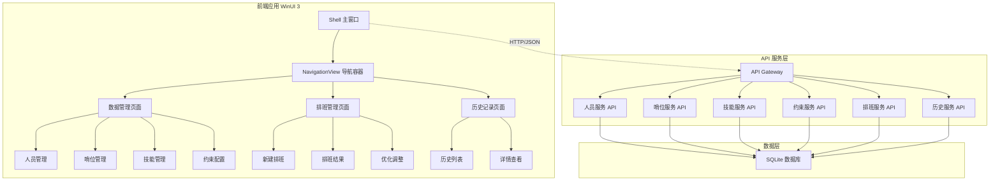

## 二、主界面框架设计

### 2.1 Shell 主窗口结构

**布局组成**：
- 标题栏：自定义标题栏，集成搜索框和用户菜单
- 导航面板：左侧 NavigationView，支持展开/折叠
- 内容区域：Frame 承载页面内容
- 状态栏：显示系统状态、通知和进度

**视觉层级**：
| 元素 | 层级 | 材质效果 | 用途 |
|------|------|---------|------|
| 标题栏 | Z-Index: 100 | Mica 背景 | 应用标识、全局操作 |
| 导航面板 | Z-Index: 90 | Acrylic 亚克力 | 页面导航 |
| 内容区域 | Z-Index: 10 | 纯色背景 | 主要内容展示 |
| 弹出层 | Z-Index: 200 | 模糊背景 | 对话框、菜单 |
| 状态栏 | Z-Index: 80 | 半透明背景 | 状态信息 |

### 2.2 导航结构

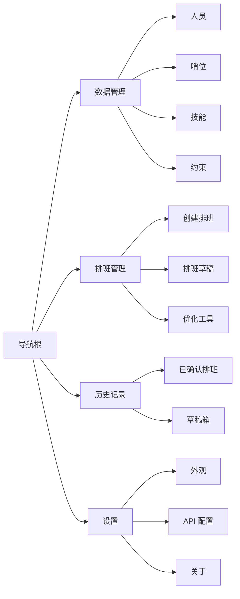

**导航菜单项定义**：

| 图标 | 标题 | 路由 | 权限 | 说明 |
|------|------|------|------|------|
| 📊 | 数据管理 | /data-management | 基础 | 人员、哨位、技能、约束管理 |
| 📅 | 排班管理 | /scheduling | 基础 | 创建和优化排班 |
| 📜 | 历史记录 | /history | 基础 | 查看历史排班 |
| ⚙️ | 设置 | /settings | 基础 | 应用配置 |

### 2.3 主题与配色

**Win11 色彩系统**：

| 主题 | 背景色 | 卡片色 | 强调色 | 文本色 | 边框色 |
|------|--------|--------|--------|--------|--------|
| 浅色模式 | #F3F3F3 | #FFFFFF | SystemAccentColor | #000000 (E1) | #E5E5E5 |
| 深色模式 | #202020 | #2C2C2C | SystemAccentColorLight1 | #FFFFFF (E1) | #3F3F3F |

**语义色彩**：

| 用途 | 浅色模式 | 深色模式 | 使用场景 |
|------|---------|---------|---------|
| 成功 | #107C10 | #6CCB5F | 操作成功提示 |
| 警告 | #FFB900 | #FCE100 | 约束冲突提示 |
| 错误 | #E81123 | #FF99A4 | 错误信息 |
| 信息 | #0078D4 | #60CDFF | 一般提示 |

## 三、核心页面设计

### 3.1 数据管理模块

#### 3.1.1 人员管理页面

**页面路径**：`/data-management/personnel`

**布局结构**：

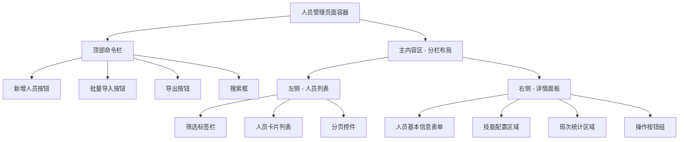

**左侧人员列表**：

| 控件类型 | 用途 | 数据绑定 | 交互行为 |
|---------|------|---------|---------|
| SplitButton（筛选） | 快速筛选 | 在职/退役状态 | 点击切换筛选条件 |
| SearchBox | 搜索人员 | 姓名、职位关键词 | 实时搜索 |
| ListView | 人员列表 | PersonnelViewModel.Personnel | 单选，点击显示详情 |
| Pagination | 分页导航 | 当前页/总页数 | 切换页面 |

**人员卡片内容结构**：
- 头像区域：显示人员头像（或首字母）
- 基础信息：姓名（粗体）、职位（次要文本）
- 状态标记：在职/退役 Badge、可用性指示器
- 快捷操作：编辑图标按钮、删除图标按钮

**右侧详情面板**：

**表单字段定义**：

| 字段名称 | 控件类型 | 验证规则 | API 字段 |
|---------|---------|---------|---------|
| 姓名 | TextBox | 必填，1-50字符 | Name |
| 职位 | ComboBox | 必选，关联哨位数据 | PositionId |
| 是否在职 | ToggleSwitch | 布尔值 | IsRetired（取反） |
| 是否可用 | ToggleSwitch | 布尔值 | IsAvailable |
| 技能列表 | CheckBox 组 | 至少选择一项 | SkillIds |
| 最近班次间隔 | NumberBox | 0-999，整数 | RecentShiftIntervalCount |
| 节假日班次间隔 | NumberBox | 0-999，整数 | RecentHolidayShiftIntervalCount |
| 时段班次间隔 | NumberBox[12] | 0-999，数组 | RecentPeriodShiftIntervals |

**技能配置区域**：
- 使用 ItemsRepeater 显示技能列表
- 每项技能使用 CheckBox + 技能名称标签
- 支持全选/反选快捷操作

**班次统计区域**：
- 使用 Expander 折叠面板
- 显示 12 个时段的班次间隔数据
- 使用 Grid 布局，每行 4 个时段

**API 交互流程**：

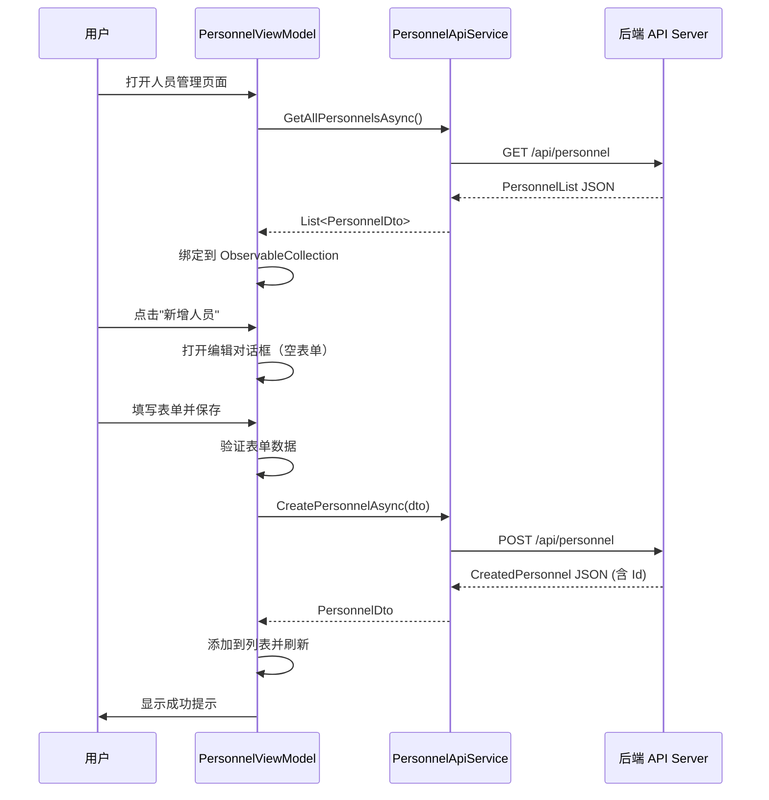

#### 3.1.2 哨位管理页面

**页面路径**：`/data-management/positions`

**布局结构**：与人员管理类似的主-从布局

**左侧哨位列表**：
- 网格卡片视图（GridView），显示哨位卡片
- 支持列表/网格视图切换
- 每张卡片显示：哨位名称、地点、技能标签、快捷操作

**右侧详情面板字段**：

| 字段名称 | 控件类型 | 验证规则 | API 字段 |
|---------|---------|---------|---------|
| 哨位名称 | TextBox | 必填，1-100字符 | Name |
| 地点 | TextBox | 必填，1-200字符 | Location |
| 介绍 | TextBox（多行） | 可选，最多500字符 | Description |
| 要求说明 | RichEditBox | 可选，支持格式化 | Requirements |
| 所需技能 | CheckBox 组 | 至少选择一项 | RequiredSkillIds |

**哨位卡片视觉设计**：
- 使用 CardPanel 容器（圆角、阴影）
- 顶部：哨位名称（18px 粗体）
- 中间：地点图标 + 地点文本
- 底部：技能标签（Chip 风格）
- Hover 效果：轻微上浮 + 阴影加深

#### 3.1.3 技能管理页面

**页面路径**：`/data-management/skills`

**布局模式**：简化的列表 + 内联编辑模式

**列表视图**：

| 列名 | 宽度 | 内容 | 可排序 |
|------|------|------|--------|
| ID | 60px | 技能 ID | 是 |
| 技能名称 | 200px | TextBox（可编辑） | 是 |
| 描述 | * | TextBox（可编辑） | 否 |
| 操作 | 100px | 保存/删除按钮 | 否 |

**内联编辑模式**：
- 点击行进入编辑状态，控件变为可编辑
- 保存按钮：调用 API 更新数据
- 取消按钮：恢复原始数据
- 删除按钮：弹出确认对话框

**新增技能**：
- 顶部固定一行"新增技能"表单
- 输入名称和描述后点击"添加"按钮
- 立即调用 API 创建并刷新列表

#### 3.1.4 约束配置页面

**页面路径**：`/data-management/constraints`

**标签页结构**：

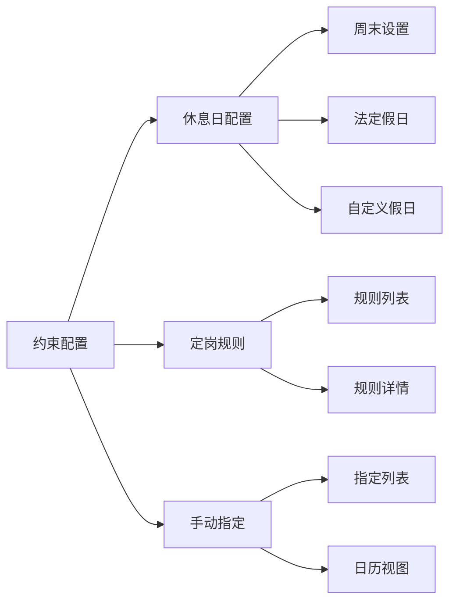

**休息日配置标签页**：

**字段设计**：

| 配置项 | 控件类型 | 说明 | API 字段 |
|--------|---------|------|---------|
| 配置名称 | TextBox | 如"2024年配置" | ConfigName |
| 启用周末规则 | ToggleSwitch | 是否启用 | EnableWeekendRule |
| 周末日期选择 | CheckBox 组 | 周一到周日多选 | WeekendDays |
| 法定假日列表 | CalendarDatePicker + ListView | 日期列表 | LegalHolidays |
| 自定义假日列表 | CalendarDatePicker + ListView | 日期列表 | CustomHolidays |
| 排除日期列表 | CalendarDatePicker + ListView | 强制工作日 | ExcludedDates |
| 是否启用 | ToggleSwitch | 当前活动配置 | IsActive |

**日期列表操作**：
- 使用 CalendarDatePicker 选择日期
- 点击"添加"按钮加入列表
- ListView 显示已添加日期，带删除按钮
- 支持批量导入（从文件或剪贴板）

**定岗规则标签页**：

**列表显示**：
- 左侧：规则列表（ListBox）
- 右侧：规则详情编辑面板

**规则表单字段**：

| 字段名称 | 控件类型 | 验证规则 | API 字段 |
|---------|---------|---------|---------|
| 规则名称 | TextBox | 必填 | RuleName |
| 人员 | ComboBox | 必选 | PersonalId |
| 允许哨位 | CheckBox 组 | 至少一项 | AllowedPositionIds |
| 允许时段 | CheckBox 组（12个） | 可空 | AllowedPeriods |
| 是否启用 | ToggleSwitch | 布尔值 | IsEnabled |

**手动指定标签页**：

**布局方式**：
- 顶部：日期范围选择器（显示指定的时间范围）
- 中间：日历视图 + 指定列表双视图
- 底部：新增指定按钮

**日历视图**：
- 使用 CalendarView 控件
- 已指定日期高亮显示（不同颜色表示不同哨位）
- 点击日期显示该日所有指定

**指定表单字段**：

| 字段名称 | 控件类型 | 验证规则 | API 字段 |
|---------|---------|---------|---------|
| 日期 | CalendarDatePicker | 必选 | Date |
| 时段 | ComboBox（12选1） | 必选 | Period |
| 哨位 | ComboBox | 必选 | PositionId |
| 人员 | ComboBox | 必选 | PersonalId |
| 是否启用 | ToggleSwitch | 布尔值 | IsEnabled |

### 3.2 排班管理模块

#### 3.2.1 创建排班页面

**页面路径**：`/scheduling/create`

**分步向导流程**：

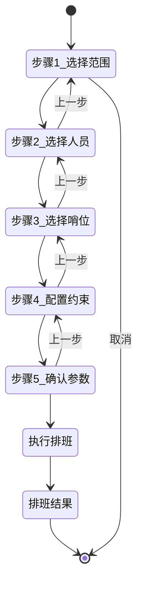

**步骤详细设计**：

**步骤 1：选择时间范围**

| 字段 | 控件 | 验证 | 默认值 |
|------|------|------|--------|
| 开始日期 | CalendarDatePicker | 必填，不早于今天 | 今天 |
| 结束日期 | CalendarDatePicker | 必填，不早于开始日期 | 今天+30天 |
| 排班表名称 | TextBox | 必填，1-100字符 | "排班表_年月日" |

**步骤 2：选择参与人员**

- 左侧：全部人员列表（带搜索和筛选）
- 中间：添加/移除按钮
- 右侧：已选人员列表
- 显示每个人员的基本信息和状态
- 支持快捷选择：全选在职、全选某职位

**步骤 3：选择参与哨位**

- 布局同步骤 2
- 左侧：全部哨位列表
- 右侧：已选哨位列表
- 显示哨位的技能要求
- 支持按地点筛选

**步骤 4：配置约束**

| 约束类型 | 控件 | 说明 |
|---------|------|------|
| 休息日配置 | ComboBox | 选择已保存的配置 |
| 定岗规则 | CheckBox 列表 | 多选启用的规则 |
| 手动指定 | CheckBox 列表 | 多选启用的指定 |

**步骤 5：确认并执行**

- 汇总显示所有配置信息
- 使用 InfoBar 控件分组展示
- 提供"返回修改"和"开始排班"按钮

**执行排班过程**：

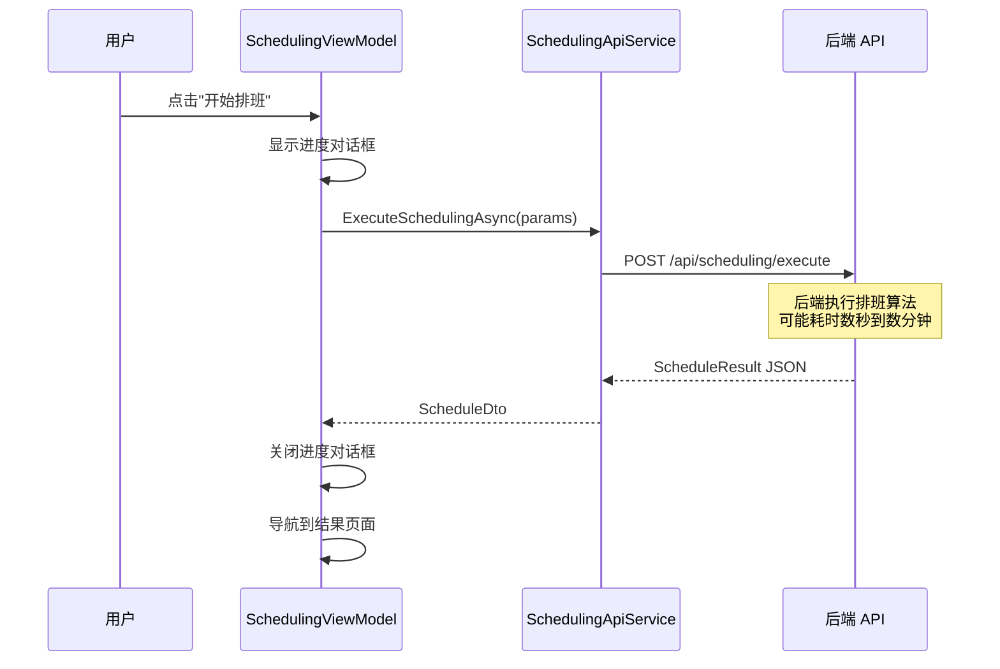

**进度对话框设计**：
- 使用 ProgressRing（不确定进度）
- 显示提示文本："正在生成排班，请稍候..."
- 提供"后台运行"按钮（可选）

#### 3.2.2 排班结果页面

**页面路径**：`/scheduling/result/{scheduleId}`

**布局结构**：

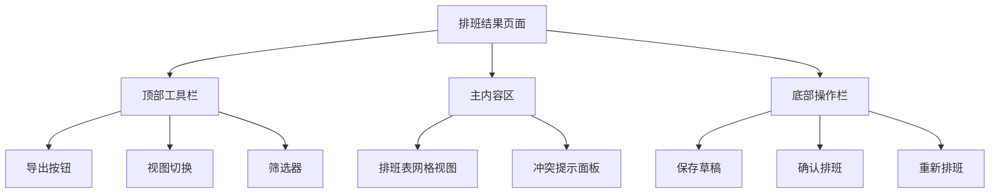

**排班表网格视图**：

**数据结构**：
- 行头：哨位列表（纵向）
- 列头：日期 + 时段（横向）
- 单元格：人员姓名 + 时段信息

**视觉设计**：

| 元素 | 样式 | 用途 |
|------|------|------|
| 表头 | 固定定位，灰色背景 | 日期时段标识 |
| 行头 | 固定定位，浅色背景 | 哨位标识 |
| 单元格 | 白色卡片，圆角边框 | 排班信息 |
| 空单元格 | 虚线边框 | 未分配提示 |
| 冲突单元格 | 红色边框，警告图标 | 约束冲突 |
| Hover 单元格 | 阴影加深 | 交互反馈 |

**单元格内容**：
- 第一行：人员姓名（粗体）
- 第二行：时段（如 08:00-16:00）
- 右上角：状态图标（正常/冲突）

**交互行为**：

| 操作 | 触发方式 | 效果 |
|------|---------|------|
| 查看详情 | 单击单元格 | 弹出详情对话框 |
| 拖拽调整 | 按住拖动单元格 | 交换两个班次 |
| 右键菜单 | 右键单元格 | 显示操作菜单 |
| 批量选择 | Ctrl+点击 | 多选单元格 |

**冲突提示面板**：
- 位置：页面右侧固定面板（可折叠）
- 内容：
  - 冲突类型标签（硬约束/软约束）
  - 冲突描述文本
  - 涉及的人员/哨位/时间
  - 建议操作按钮

**视图切换选项**：
- 网格视图（默认）
- 日历视图（按日期展开）
- 人员视图（按人员分组）
- 列表视图（纯表格）

**底部操作栏**：

| 按钮 | 图标 | 功能 | API 调用 |
|------|------|------|---------|
| 保存草稿 | 💾 | 保存到草稿箱 | POST /api/scheduling/buffer |
| 确认排班 | ✅ | 确认并移入历史 | POST /api/scheduling/confirm/{id} |
| 重新排班 | 🔄 | 返回参数配置 | 导航到创建页面 |
| 导出 | 📄 | 导出为 Excel/PDF | GET /api/scheduling/export/{id} |

#### 3.2.3 草稿箱页面

**页面路径**：`/scheduling/drafts`

**列表视图**：

| 列 | 宽度 | 内容 | 可排序 |
|-----|------|------|--------|
| 排班表名称 | 300px | 标题 | 是 |
| 创建时间 | 180px | 时间戳 | 是 |
| 日期范围 | 200px | 开始-结束 | 是 |
| 人员数 | 80px | 数量 | 是 |
| 哨位数 | 80px | 数量 | 是 |
| 操作 | 150px | 查看/确认/删除 | 否 |

**操作按钮**：
- 查看：导航到结果页面（只读模式）
- 确认：弹出确认对话框，调用确认 API
- 删除：弹出确认对话框，删除草稿

### 3.3 历史记录模块

#### 3.3.1 历史列表页面

**页面路径**：`/history`

**布局结构**：
- 顶部：搜索栏 + 日期范围筛选器
- 主内容：时间线视图 / 列表视图（可切换）

**时间线视图设计**：

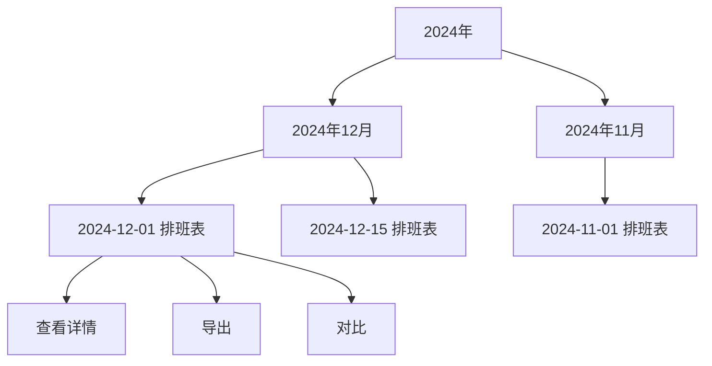

**时间线卡片内容**：
- 左侧：日期图标 + 日期文本
- 中间：排班表名称、人员数、哨位数、确认时间
- 右侧：操作按钮组

**列表视图**：
- 使用 DataGrid 控件
- 支持排序、筛选、分页
- 列设计：确认日期、排班表名称、日期范围、人员/哨位数量、操作

**筛选器选项**：

| 筛选项 | 控件类型 | 说明 |
|--------|---------|------|
| 日期范围 | DateRangePicker | 确认时间范围 |
| 关键词 | SearchBox | 搜索名称 |
| 排序方式 | ComboBox | 时间/名称 |

#### 3.3.2 历史详情页面

**页面路径**：`/history/detail/{scheduleId}`

**布局设计**：
- 顶部：排班表基本信息卡片
- 主内容：排班表网格（只读模式）
- 右侧：统计信息面板

**基本信息卡片**：

| 字段 | 显示方式 |
|------|---------|
| 排班表名称 | 大标题 |
| 日期范围 | 副标题 |
| 确认时间 | 时间戳 |
| 参与人员 | 人员标签组 |
| 参与哨位 | 哨位标签组 |

**统计信息面板**：

**统计指标**：

| 指标名称 | 计算方式 | 展示控件 |
|---------|---------|---------|
| 总班次数 | 所有单次排班数量 | 数字卡片 |
| 人均班次 | 总班次 / 人员数 | 数字卡片 |
| 休息日班次 | 节假日的班次数 | 数字卡片 |
| 各时段分布 | 12个时段的班次数 | 柱状图 |
| 人员负载 | 每人的班次数 | 横向条形图 |
| 哨位覆盖率 | 已分配/总需求 | 百分比进度条 |

**图表设计**（使用 WinUI Community Toolkit Chart 控件）：
- 时段分布：12 列柱状图，X 轴为时段，Y 轴为班次数
- 人员负载：水平条形图，X 轴为班次数，Y 轴为人员姓名

#### 3.3.3 对比页面

**页面路径**：`/history/compare`

**布局结构**：
- 顶部：选择两个排班表（ComboBox）
- 主内容：左右分栏对比视图
- 底部：差异统计汇总

**对比视图模式**：

| 模式 | 说明 | 视觉效果 |
|------|------|---------|
| 并排对比 | 左右两个网格视图 | 同步滚动 |
| 差异高亮 | 合并视图，差异单元格高亮 | 红色/绿色标记 |
| 统计对比 | 数据指标对比表 | 箭头指示增减 |

**差异类型**：

| 差异类型 | 颜色标记 | 说明 |
|---------|---------|------|
| 新增班次 | 绿色背景 | 右侧有，左侧无 |
| 删除班次 | 红色背景 | 左侧有，右侧无 |
| 人员变更 | 黄色背景 | 同位置不同人员 |
| 时间调整 | 蓝色背景 | 时段变化 |

## 四、前后端接口设计

### 4.1 API 端点规范

**RESTful 设计原则**：
- 使用名词复数形式表示资源
- 使用 HTTP 方法表示操作（GET/POST/PUT/DELETE）
- 使用路径参数传递 ID
- 使用查询参数传递筛选条件
- 统一返回 JSON 格式

**API 基础路径**：`https://localhost:5001/api/v1`

### 4.2 人员服务 API

| 方法 | 端点 | 说明 | 请求体 | 响应体 |
|------|------|------|--------|--------|
| GET | /personnel | 获取所有人员 | 无 | PersonnelDto[] |
| GET | /personnel/{id} | 获取指定人员 | 无 | PersonnelDto |
| POST | /personnel | 创建人员 | CreatePersonnelDto | PersonnelDto |
| PUT | /personnel/{id} | 更新人员 | UpdatePersonnelDto | PersonnelDto |
| DELETE | /personnel/{id} | 删除人员 | 无 | 204 No Content |
| GET | /personnel/search | 搜索人员 | Query: keyword | PersonnelDto[] |

**PersonnelDto 数据结构**：

| 字段 | 类型 | 说明 |
|------|------|------|
| id | int | 人员 ID |
| name | string | 姓名 |
| positionId | int | 职位 ID |
| positionName | string | 职位名称（冗余字段） |
| skillIds | int[] | 技能 ID 列表 |
| skillNames | string[] | 技能名称列表（冗余） |
| isAvailable | boolean | 是否可用 |
| isRetired | boolean | 是否退役 |
| recentShiftIntervalCount | int | 最近班次间隔 |
| recentHolidayShiftIntervalCount | int | 节假日班次间隔 |
| recentPeriodShiftIntervals | int[12] | 时段班次间隔 |

**CreatePersonnelDto**：

| 字段 | 类型 | 必填 | 验证规则 |
|------|------|------|---------|
| name | string | 是 | 1-50字符 |
| positionId | int | 是 | 存在的职位 ID |
| skillIds | int[] | 是 | 至少一项，存在的技能 ID |
| isAvailable | boolean | 否 | 默认 true |
| recentShiftIntervalCount | int | 否 | 0-999 |
| recentHolidayShiftIntervalCount | int | 否 | 0-999 |
| recentPeriodShiftIntervals | int[12] | 否 | 每项 0-999 |

### 4.3 哨位服务 API

| 方法 | 端点 | 说明 | 请求体 | 响应体 |
|------|------|------|--------|--------|
| GET | /positions | 获取所有哨位 | 无 | PositionDto[] |
| GET | /positions/{id} | 获取指定哨位 | 无 | PositionDto |
| POST | /positions | 创建哨位 | CreatePositionDto | PositionDto |
| PUT | /positions/{id} | 更新哨位 | UpdatePositionDto | PositionDto |
| DELETE | /positions/{id} | 删除哨位 | 无 | 204 No Content |

**PositionDto 数据结构**：

| 字段 | 类型 | 说明 |
|------|------|------|
| id | int | 哨位 ID |
| name | string | 哨位名称 |
| location | string | 地点 |
| description | string | 介绍 |
| requirements | string | 要求说明 |
| requiredSkillIds | int[] | 所需技能 ID |
| requiredSkillNames | string[] | 所需技能名称（冗余） |

### 4.4 技能服务 API

| 方法 | 端点 | 说明 | 请求体 | 响应体 |
|------|------|------|--------|--------|
| GET | /skills | 获取所有技能 | 无 | SkillDto[] |
| GET | /skills/{id} | 获取指定技能 | 无 | SkillDto |
| POST | /skills | 创建技能 | CreateSkillDto | SkillDto |
| PUT | /skills/{id} | 更新技能 | UpdateSkillDto | SkillDto |
| DELETE | /skills/{id} | 删除技能 | 无 | 204 No Content |

**SkillDto 数据结构**：

| 字段 | 类型 | 说明 |
|------|------|------|
| id | int | 技能 ID |
| name | string | 技能名称 |
| description | string | 技能描述 |

### 4.5 约束服务 API

**休息日配置**：

| 方法 | 端点 | 说明 | 请求体 | 响应体 |
|------|------|------|--------|--------|
| GET | /constraints/holidays | 获取所有配置 | 无 | HolidayConfigDto[] |
| GET | /constraints/holidays/active | 获取活动配置 | 无 | HolidayConfigDto |
| POST | /constraints/holidays | 创建配置 | CreateHolidayConfigDto | HolidayConfigDto |
| PUT | /constraints/holidays/{id} | 更新配置 | UpdateHolidayConfigDto | HolidayConfigDto |
| DELETE | /constraints/holidays/{id} | 删除配置 | 无 | 204 No Content |

**HolidayConfigDto 数据结构**：

| 字段 | 类型 | 说明 |
|------|------|------|
| id | int | 配置 ID |
| configName | string | 配置名称 |
| enableWeekendRule | boolean | 是否启用周末规则 |
| weekendDays | string[] | 周末日期（如 ["Saturday", "Sunday"]） |
| legalHolidays | string[] | 法定假日（ISO 8601 日期） |
| customHolidays | string[] | 自定义假日 |
| excludedDates | string[] | 排除日期 |
| isActive | boolean | 是否启用 |

**定岗规则**：

| 方法 | 端点 | 说明 |
|------|------|------|
| GET | /constraints/fixed-positions | 获取所有规则 |
| POST | /constraints/fixed-positions | 创建规则 |
| PUT | /constraints/fixed-positions/{id} | 更新规则 |
| DELETE | /constraints/fixed-positions/{id} | 删除规则 |

**手动指定**：

| 方法 | 端点 | 说明 |
|------|------|------|
| GET | /constraints/manual-assignments | 获取所有指定 |
| GET | /constraints/manual-assignments?start=&end= | 按日期范围获取 |
| POST | /constraints/manual-assignments | 创建指定 |
| PUT | /constraints/manual-assignments/{id} | 更新指定 |
| DELETE | /constraints/manual-assignments/{id} | 删除指定 |

### 4.6 排班服务 API

| 方法 | 端点 | 说明 | 请求体 | 响应体 |
|------|------|------|--------|--------|
| POST | /scheduling/execute | 执行排班 | SchedulingRequestDto | ScheduleDto |
| GET | /scheduling/drafts | 获取草稿列表 | 无 | ScheduleSummaryDto[] |
| GET | /scheduling/drafts/{id} | 获取草稿详情 | 无 | ScheduleDto |
| DELETE | /scheduling/drafts/{id} | 删除草稿 | 无 | 204 No Content |
| POST | /scheduling/confirm/{id} | 确认排班 | 无 | 204 No Content |
| GET | /scheduling/export/{id} | 导出排班表 | Query: format=excel\|pdf | 文件流 |

**SchedulingRequestDto 数据结构**：

| 字段 | 类型 | 必填 | 说明 |
|------|------|------|------|
| title | string | 是 | 排班表名称 |
| startDate | string | 是 | 开始日期（ISO 8601） |
| endDate | string | 是 | 结束日期 |
| personnelIds | int[] | 是 | 参与人员 ID 列表 |
| positionIds | int[] | 是 | 参与哨位 ID 列表 |
| useActiveHolidayConfig | boolean | 否 | 是否使用活动假日配置（默认 true） |
| enabledFixedRuleIds | int[] | 否 | 启用的定岗规则 ID |
| enabledManualAssignmentIds | int[] | 否 | 启用的手动指定 ID |

**ScheduleDto 数据结构**：

| 字段 | 类型 | 说明 |
|------|------|------|
| id | int | 排班表 ID |
| title | string | 排班表名称 |
| personnelIds | int[] | 人员 ID 列表 |
| positionIds | int[] | 哨位 ID 列表 |
| shifts | ShiftDto[] | 单次排班列表 |
| createdAt | string | 创建时间 |
| confirmedAt | string | 确认时间（草稿为 null） |

**ShiftDto 数据结构**：

| 字段 | 类型 | 说明 |
|------|------|------|
| id | int | 班次 ID |
| scheduleId | int | 所属排班表 ID |
| positionId | int | 哨位 ID |
| positionName | string | 哨位名称（冗余） |
| personnelId | int | 人员 ID |
| personnelName | string | 人员姓名（冗余） |
| startTime | string | 开始时间（ISO 8601） |
| endTime | string | 结束时间 |
| periodIndex | int | 时段索引（0-11） |

### 4.7 历史服务 API

| 方法 | 端点 | 说明 | 请求体 | 响应体 |
|------|------|------|--------|--------|
| GET | /history | 获取历史列表 | Query: page, size, startDate, endDate | PagedScheduleSummaryDto |
| GET | /history/{id} | 获取历史详情 | 无 | ScheduleDto |
| GET | /history/compare | 对比两个排班表 | Query: id1, id2 | CompareResultDto |

**PagedScheduleSummaryDto 数据结构**：

| 字段 | 类型 | 说明 |
|------|------|------|
| items | ScheduleSummaryDto[] | 排班表摘要列表 |
| totalCount | int | 总数 |
| page | int | 当前页码 |
| pageSize | int | 每页大小 |
| totalPages | int | 总页数 |

**ScheduleSummaryDto 数据结构**：

| 字段 | 类型 | 说明 |
|------|------|------|
| id | int | 排班表 ID |
| title | string | 排班表名称 |
| startDate | string | 开始日期 |
| endDate | string | 结束日期 |
| personnelCount | int | 人员数量 |
| positionCount | int | 哨位数量 |
| shiftCount | int | 班次数量 |
| confirmedAt | string | 确认时间 |

**CompareResultDto 数据结构**：

| 字段 | 类型 | 说明 |
|------|------|------|
| schedule1 | ScheduleDto | 第一个排班表 |
| schedule2 | ScheduleDto | 第二个排班表 |
| differences | DifferenceDto[] | 差异列表 |
| statistics | CompareStatisticsDto | 统计信息 |

**DifferenceDto 数据结构**：

| 字段 | 类型 | 说明 |
|------|------|------|
| type | string | 差异类型（Added/Removed/Modified） |
| positionId | int | 哨位 ID |
| date | string | 日期 |
| periodIndex | int | 时段索引 |
| oldPersonnelId | int | 原人员 ID（可空） |
| newPersonnelId | int | 新人员 ID（可空） |

### 4.8 API 通用响应格式

**成功响应**：

```json
{
  "success": true,
  "data": { /* 实际数据 */ },
  "message": "操作成功",
  "timestamp": "2024-01-01T12:00:00Z"
}
```

**错误响应**：

```json
{
  "success": false,
  "error": {
    "code": "VALIDATION_ERROR",
    "message": "数据验证失败",
    "details": [
      {
        "field": "name",
        "message": "姓名不能为空"
      }
    ]
  },
  "timestamp": "2024-01-01T12:00:00Z"
}
```

**HTTP 状态码规范**：

| 状态码 | 场景 | 说明 |
|--------|------|------|
| 200 | 成功 | GET/PUT 成功 |
| 201 | 创建成功 | POST 成功 |
| 204 | 无内容 | DELETE 成功 |
| 400 | 请求错误 | 参数验证失败 |
| 401 | 未授权 | 未登录或 Token 失效 |
| 403 | 禁止访问 | 无权限 |
| 404 | 未找到 | 资源不存在 |
| 409 | 冲突 | 数据冲突（如重复创建） |
| 500 | 服务器错误 | 内部错误 |

## 五、ViewModel 设计

### 5.1 MVVM 架构模式

**架构分层**：

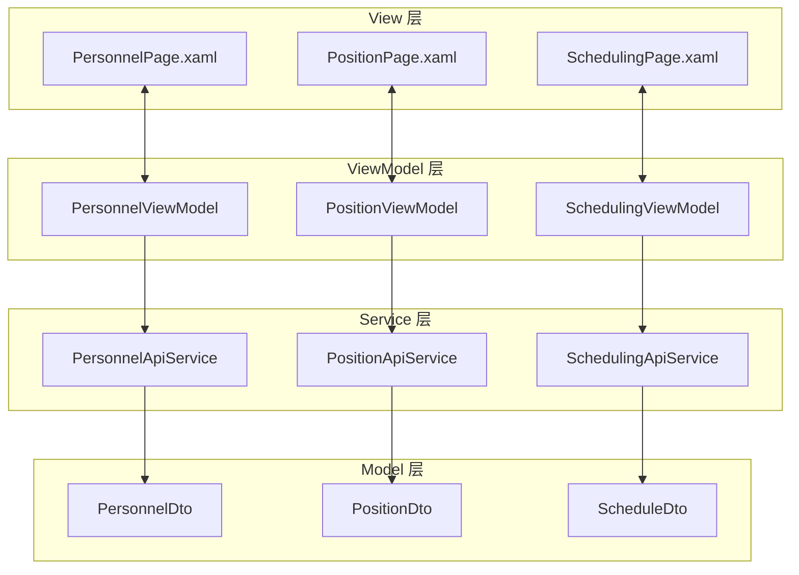

### 5.2 核心 ViewModel 设计

#### 5.2.1 PersonnelViewModel

**职责**：
- 管理人员列表的加载、筛选、搜索
- 处理人员的增删改操作
- 验证表单输入
- 管理选中状态

**属性定义**：

| 属性名称 | 类型 | 说明 | 通知变更 |
|---------|------|------|---------|
| Personnels | ObservableCollection\<PersonnelDto\> | 人员列表 | 是 |
| FilteredPersonnels | ObservableCollection\<PersonnelDto\> | 筛选后列表 | 是 |
| SelectedPersonnel | PersonnelDto | 选中人员 | 是 |
| IsLoading | bool | 加载状态 | 是 |
| SearchKeyword | string | 搜索关键词 | 是 |
| FilterStatus | PersonnelStatus | 筛选状态 | 是 |
| AllSkills | ObservableCollection\<SkillDto\> | 所有技能 | 是 |
| AllPositions | ObservableCollection\<PositionDto\> | 所有职位 | 是 |

**命令定义**：

| 命令名称 | 参数 | 说明 | 执行条件 |
|---------|------|------|---------|
| LoadPersonnelsCommand | 无 | 加载人员列表 | 总是可用 |
| CreatePersonnelCommand | 无 | 打开创建对话框 | 总是可用 |
| SavePersonnelCommand | PersonnelDto | 保存人员（创建或更新） | 表单验证通过 |
| DeletePersonnelCommand | int | 删除人员 | 有选中项 |
| SearchCommand | string | 搜索人员 | 总是可用 |
| ApplyFilterCommand | PersonnelStatus | 应用筛选 | 总是可用 |

**关键方法逻辑**：

**LoadPersonnelsAsync**：
1. 设置 IsLoading = true
2. 调用 PersonnelApiService.GetAllAsync()
3. 接收 PersonnelDto[] 并转换为 ObservableCollection
4. 绑定到 Personnels 属性
5. 应用筛选和搜索
6. 设置 IsLoading = false
7. 错误处理：捕获异常，显示错误对话框

**SavePersonnelAsync**：
1. 验证表单数据（姓名非空、技能至少一项等）
2. 判断是创建还是更新（Id == 0 为创建）
3. 创建：调用 CreateAsync(dto)
4. 更新：调用 UpdateAsync(id, dto)
5. 成功后刷新列表
6. 显示成功提示（InfoBar）
7. 关闭编辑对话框

**ApplyFilter**：
1. 根据 FilterStatus 筛选 Personnels
2. 应用 SearchKeyword 搜索姓名
3. 更新 FilteredPersonnels

#### 5.2.2 SchedulingViewModel

**职责**：
- 管理排班向导流程
- 收集排班参数
- 调用排班 API
- 展示排班结果

**属性定义**：

| 属性名称 | 类型 | 说明 |
|---------|------|------|
| CurrentStep | int | 当前步骤（1-5） |
| ScheduleTitle | string | 排班表名称 |
| StartDate | DateTimeOffset | 开始日期 |
| EndDate | DateTimeOffset | 结束日期 |
| AvailablePersonnels | ObservableCollection\<PersonnelDto\> | 可选人员 |
| SelectedPersonnels | ObservableCollection\<PersonnelDto\> | 已选人员 |
| AvailablePositions | ObservableCollection\<PositionDto\> | 可选哨位 |
| SelectedPositions | ObservableCollection\<PositionDto\> | 已选哨位 |
| HolidayConfigs | ObservableCollection\<HolidayConfigDto\> | 假日配置 |
| SelectedHolidayConfig | HolidayConfigDto | 选中配置 |
| FixedRules | ObservableCollection\<FixedRuleDto\> | 定岗规则 |
| EnabledFixedRules | List\<int\> | 启用规则 ID |
| ManualAssignments | ObservableCollection\<ManualAssignmentDto\> | 手动指定 |
| EnabledManualAssignments | List\<int\> | 启用指定 ID |
| IsExecuting | bool | 是否正在执行 |
| ResultSchedule | ScheduleDto | 排班结果 |

**命令定义**：

| 命令名称 | 说明 | 执行条件 |
|---------|------|---------|
| NextStepCommand | 下一步 | 当前步骤验证通过 |
| PreviousStepCommand | 上一步 | 不在第一步 |
| ExecuteSchedulingCommand | 执行排班 | 在最后一步且参数完整 |
| CancelCommand | 取消向导 | 总是可用 |

**执行排班流程**：

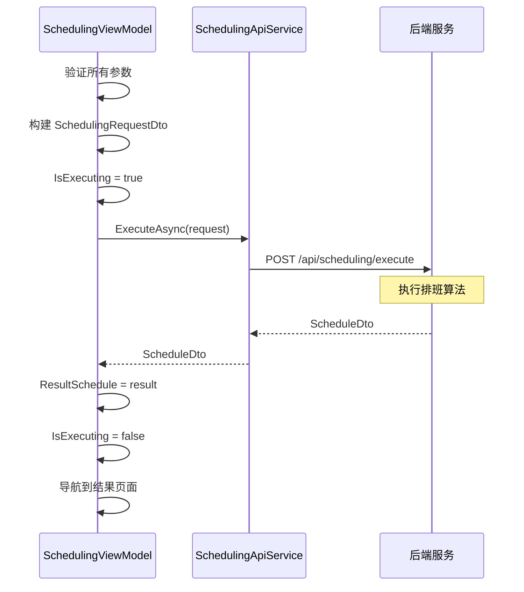

### 5.3 共享服务设计

#### 5.3.1 NavigationService

**职责**：页面导航管理

**方法定义**：

| 方法 | 参数 | 说明 |
|------|------|------|
| NavigateTo | string pageKey | 导航到指定页面 |
| NavigateToWithParameter | string pageKey, object parameter | 带参数导航 |
| GoBack | 无 | 返回上一页 |
| CanGoBack | 无 | 是否可返回 |

#### 5.3.2 DialogService

**职责**：对话框管理

**方法定义**：

| 方法 | 参数 | 返回值 | 说明 |
|------|------|--------|------|
| ShowMessageAsync | string title, string message | Task | 显示消息对话框 |
| ShowConfirmAsync | string title, string message | Task\<bool\> | 显示确认对话框 |
| ShowErrorAsync | string message | Task | 显示错误对话框 |
| ShowProgressAsync | string message | Task\<IDisposable\> | 显示进度对话框 |

#### 5.3.3 ApiClientService

**职责**：HTTP 请求封装

**方法定义**：

| 方法 | 说明 |
|------|------|
| GetAsync\<T\>(string url) | GET 请求 |
| PostAsync\<T\>(string url, object data) | POST 请求 |
| PutAsync\<T\>(string url, object data) | PUT 请求 |
| DeleteAsync(string url) | DELETE 请求 |

**通用逻辑**：
- 自动添加 Authorization Header
- 自动序列化/反序列化 JSON
- 统一异常处理
- 请求超时控制
- 请求日志记录

## 六、控件库与组件设计

### 6.1 自定义控件

#### 6.1.1 ScheduleGridControl（排班网格控件）

**用途**：显示排班表的网格视图

**属性**：

| 属性名称 | 类型 | 说明 |
|---------|------|------|
| Schedule | ScheduleDto | 排班数据源 |
| Positions | ObservableCollection\<PositionDto\> | 哨位列表 |
| Personnels | ObservableCollection\<PersonnelDto\> | 人员列表 |
| DateRange | DateRange | 显示的日期范围 |
| IsReadOnly | bool | 是否只读 |
| ShowConflicts | bool | 是否显示冲突 |

**事件**：

| 事件名称 | 参数 | 说明 |
|---------|------|------|
| CellClicked | ShiftDto | 单元格点击 |
| CellDoubleClicked | ShiftDto | 单元格双击 |
| ShiftDragged | DragEventArgs | 班次拖拽 |

**视觉结构**：
- 使用 Grid 布局
- 固定行头和列头
- 支持虚拟化滚动
- 单元格使用自定义 DataTemplate

#### 6.1.2 PersonnelCard（人员卡片控件）

**用途**：显示人员信息卡片

**属性**：

| 属性名称 | 类型 | 说明 |
|---------|------|------|
| Personnel | PersonnelDto | 人员数据 |
| ShowActions | bool | 是否显示操作按钮 |
| IsSelected | bool | 是否选中 |

**视觉设计**：
- 圆角卡片（CornerRadius="8"）
- Acrylic 背景
- Hover 动画（轻微上浮）
- 选中状态（边框高亮）

#### 6.1.3 PositionCard（哨位卡片控件）

**用途**：显示哨位信息卡片

**属性**：

| 属性名称 | 类型 | 说明 |
|---------|------|------|
| Position | PositionDto | 哨位数据 |
| ShowSkills | bool | 是否显示技能标签 |
| IsSelected | bool | 是否选中 |

### 6.2 通用组件

#### 6.2.1 LoadingIndicator（加载指示器）

**用途**：显示加载状态

**属性**：

| 属性名称 | 类型 | 说明 |
|---------|------|------|
| IsLoading | bool | 是否加载中 |
| Message | string | 加载提示文本 |
| Size | double | 指示器大小 |

**视觉设计**：
- 使用 ProgressRing
- 半透明遮罩层
- 居中显示
- 淡入/淡出动画

#### 6.2.2 EmptyState（空状态组件）

**用途**：显示空数据提示

**属性**：

| 属性名称 | 类型 | 说明 |
|---------|------|------|
| Icon | IconSource | 图标 |
| Title | string | 标题 |
| Message | string | 说明文本 |
| ActionText | string | 操作按钮文本 |
| ActionCommand | ICommand | 操作命令 |

**视觉设计**：
- 居中布局
- 大图标（48x48）
- 次要文本颜色
- 可选操作按钮

#### 6.2.3 ErrorState（错误状态组件）

**用途**：显示错误信息

**属性**：

| 属性名称 | 类型 | 说明 |
|---------|------|------|
| ErrorMessage | string | 错误消息 |
| ShowRetry | bool | 是否显示重试按钮 |
| RetryCommand | ICommand | 重试命令 |

## 七、动画与过渡效果

### 7.1 页面过渡动画

**导航过渡**：

| 场景 | 动画类型 | 时长 | 缓动函数 |
|------|---------|------|---------|
| 前进导航 | 从右滑入 | 300ms | CubicEase(EaseOut) |
| 后退导航 | 从左滑入 | 300ms | CubicEase(EaseOut) |
| 刷新 | 淡入淡出 | 200ms | Linear |

### 7.2 元素动画

**交互反馈**：

| 控件 | 触发事件 | 动画效果 | 说明 |
|------|---------|---------|------|
| Button | Hover | Scale(1.05) | 轻微放大 |
| Card | Hover | TranslateY(-4px) | 上浮效果 |
| Card | Hover | Shadow 加深 | 阴影增强 |
| ListItem | Click | 背景色变化 | 点击反馈 |
| Dialog | 打开 | Scale(0.9 → 1.0) + Fade(0 → 1) | 弹出动画 |
| Dialog | 关闭 | Scale(1.0 → 0.9) + Fade(1 → 0) | 收起动画 |

### 7.3 数据加载动画

**骨架屏**：
- 在数据加载时显示占位符
- 使用渐变动画模拟加载过程
- 加载完成后淡入真实内容

**列表加载**：
- 使用 ItemsRepeater 的增量加载
- 新项目从下方滑入
- 删除项目淡出

## 八、响应式布局与适配

### 8.1 窗口尺寸断点

| 断点名称 | 宽度范围 | 布局调整 |
|---------|---------|---------|
| Compact | < 640px | 单列布局，隐藏次要信息 |
| Medium | 640px - 1007px | 双列布局，保留主要功能 |
| Expanded | ≥ 1008px | 三列布局，完整功能 |

### 8.2 自适应行为

**导航面板**：
- Expanded：展开显示文本
- Medium：仅显示图标
- Compact：隐藏，使用汉堡菜单

**数据列表**：
- Expanded：网格视图（3-4列）
- Medium：网格视图（2列）
- Compact：列表视图（单列）

**详情面板**：
- Expanded：侧边固定面板
- Medium：可折叠面板
- Compact：全屏对话框

## 九、无障碍与国际化

### 9.1 无障碍设计

**键盘导航**：
- 所有交互元素支持 Tab 键导航
- 使用 AccessKey 提供快捷键
- 焦点顺序符合逻辑流程

**屏幕阅读器支持**：
- 所有图标按钮添加 AutomationProperties.Name
- 列表项提供完整描述
- 表单字段关联 Label

**对比度**：
- 文本与背景对比度 ≥ 4.5:1
- 大文本对比度 ≥ 3:1
- 焦点指示器清晰可见

### 9.2 国际化

**支持语言**：
- 简体中文（默认）
- 英语

**资源文件结构**：

| 资源键 | 简体中文 | 英语 |
|--------|---------|------|
| PersonnelPage.Title | 人员管理 | Personnel Management |
| PersonnelPage.AddButton | 新增人员 | Add Personnel |
| PersonnelPage.SearchPlaceholder | 搜索人员姓名 | Search by name |

**日期时间格式**：
- 使用用户系统的区域设置
- 日期格式：yyyy-MM-dd
- 时间格式：HH:mm:ss

## 十、性能优化策略

### 10.1 前端优化

**虚拟化列表**：
- 使用 ItemsRepeater 替代 ListView
- 启用虚拟化（VirtualizationMode="Recycling"）
- 大数据集使用增量加载

**图片优化**：
- 人员头像使用缩略图
- 延迟加载非可见图片
- 使用缓存机制

**UI 线程优化**：
- 耗时操作使用 Task.Run
- 使用 Dispatcher 更新 UI
- 避免阻塞主线程

### 10.2 API 通信优化

**请求优化**：
- 使用分页减少单次数据量
- 合并多个小请求
- 启用 HTTP/2 多路复用

**缓存策略**：

| 数据类型 | 缓存策略 | 过期时间 |
|---------|---------|---------|
| 技能列表 | 本地缓存 | 1小时 |
| 人员列表 | 内存缓存 | 5分钟 |
| 哨位列表 | 内存缓存 | 5分钟 |
| 排班结果 | 不缓存 | - |

**数据压缩**：
- 启用 Gzip/Brotli 压缩
- 响应体压缩率 > 60%

### 10.3 数据库优化

**索引策略**：
- PersonalId、PositionId、Date 建立索引
- 联合索引：(ScheduleId, Date)
- 避免过度索引

**查询优化**：
- 使用 EF Core 的 AsNoTracking
- 避免 N+1 查询
- 使用 Include 预加载关联数据

## 十一、安全性考虑

### 11.1 API 安全

**身份验证**（可选）：
- 使用 JWT Token
- Token 过期时间：1小时
- Refresh Token 机制

**数据验证**：
- 前端验证 + 后端验证
- 使用数据注解（DataAnnotations）
- 防止 SQL 注入（使用参数化查询）
- 防止 XSS（转义用户输入）

**HTTPS**：
- 强制使用 HTTPS
- 禁用不安全的 TLS 版本
- 使用有效的 SSL 证书

### 11.2 数据安全

**敏感数据**：
- 数据库文件加密（SQLite Encryption Extension）
- 配置文件加密存储

**日志安全**：
- 不记录敏感信息（密码、Token）
- 日志文件访问控制

## 十二、部署与配置

### 12.1 前端部署

**打包方式**：
- MSIX 打包（Microsoft Store）
- 独立安装包（Setup.exe）
- 便携版（Portable）

**配置文件**（appsettings.json）：

| 配置项 | 说明 | 示例值 |
|--------|------|--------|
| ApiBaseUrl | API 服务地址 | https://localhost:5001/api/v1 |
| DatabasePath | 数据库路径 | ./data/scheduling.db |
| LogLevel | 日志级别 | Information |
| Theme | 默认主题 | Light/Dark/System |

### 12.2 后端部署

**部署方式**：
- Windows Service
- IIS 托管
- Kestrel 独立运行
- Docker 容器

**配置文件**（appsettings.json）：

| 配置项 | 说明 | 示例值 |
|--------|------|--------|
| ConnectionStrings.DefaultConnection | 数据库连接字符串 | Data Source=scheduling.db |
| Cors.AllowedOrigins | 允许的跨域来源 | ["http://localhost:3000"] |
| Jwt.Secret | JWT 密钥 | [生成的随机密钥] |
| Jwt.ExpirationMinutes | Token 过期时间 | 60 |

### 12.3 数据库迁移

**初始化**：
- 首次运行自动创建数据库表
- 执行 EF Core Migrations

**版本升级**：
- 使用 Migration 脚本
- 备份旧数据
- 执行升级脚本
- 验证数据完整性

## 十三、测试策略

### 13.1 前端测试

**单元测试**：
- 测试 ViewModel 逻辑
- 测试数据验证
- 测试命令执行
- 使用 xUnit + Moq

**UI 测试**：
- 使用 WinAppDriver
- 测试页面导航
- 测试表单提交
- 测试数据绑定

### 13.2 后端测试

**API 测试**：
- 使用 WebApplicationFactory
- 测试所有端点
- 测试数据验证
- 测试错误处理

**集成测试**：
- 测试完整业务流程
- 测试数据库操作
- 测试排班算法

### 13.3 性能测试

**负载测试**：
- 模拟并发请求
- 测试响应时间
- 测试吞吐量

**压力测试**：
- 测试系统上限
- 测试错误恢复
- 测试资源占用
