# AutoScheduling3 自动排班系统 UI 设计方案

## 一、设计概览

### 1.1 设计原则

本设计方案遵循 WinUI 3 规范和 Windows 11 设计语言（Fluent Design System），实现前后端解耦的桌面应用界面。

**核心设计理念**：
- **流畅性（Fluency）**：使用 Acrylic 材质、动画过渡和微交互增强用户体验
- **适应性（Adaptability）**：支持亮色/暗色主题，响应式布局
- **清晰性（Clarity）**：信息层级分明，导航路径清晰
- **高效性（Efficiency）**：减少操作步骤，提供快捷操作入口

**架构特点**：
- 单一项目部署，前后端逻辑解耦
- 前端：WinUI 3 桌面应用，负责 UI 呈现和用户交互
- 后端：C# 业务逻辑层和数据访问层
- 数据流：Views → ViewModels → Services → Repositories → SQLite
- 状态管理：MVVM 模式，ViewModel 管理 UI 状态

### 1.2 技术栈

| 层级 | 技术选型 | 说明 |
|------|---------|------|
| 前端框架 | WinUI 3 | Windows 应用 SDK，原生 Windows 11 体验 |
| UI 架构 | MVVM（CommunityToolkit.Mvvm） | 视图模型分离，数据绑定 |
| 导航系统 | NavigationView + Frame | Win11 标准导航模式 |
| 业务逻辑 | C# Services | 纯 C# 类，依赖注入 |
| 数据访问 | Repository 模式 | ADO.NET + SQLite |
| 数据库 | SQLite | 轻量级嵌入式数据库 |
| 依赖注入 | Microsoft.Extensions.DependencyInjection | 服务生命周期管理 |

### 1.3 现有项目结构分析

**当前架构（单体应用）**：
```
AutoScheduling3/
├── Models/                     # 数据模型层
│   ├── Personal.cs
│   ├── PositionLocation.cs
│   ├── Schedule.cs
│   ├── Skill.cs
│   └── Constraints/
├── Data/                       # 数据访问层（Repository）
│   ├── PersonalRepository.cs
│   ├── PositionLocationRepository.cs
│   ├── SkillRepository.cs
│   └── ConstraintRepository.cs
├── Services/                   # 业务逻辑层
│   └── SchedulingService.cs
├── SchedulingEngine/           # 排班算法层
│   ├── Core/
│   ├── Strategies/
│   └── GreedyScheduler.cs
├── History/                    # 历史管理
│   └── HistoryManagement.cs
├── Views/                      # UI 视图层（待创建）
├── ViewModels/                 # 视图模型层（待创建）
├── App.xaml.cs                 # 应用入口
└── MainWindow.xaml.cs          # 主窗口
```

**问题**：
- UI、业务逻辑、数据访问紧密耦合在同一个项目中
- Repository 直接操作 SQLite 数据库
- SchedulingService 同时依赖 Repository 和业务逻辑
- 无法独立部署和扩展

### 1.4 前后端解耦架构设计

**目标架构（单项目内解耦）**：

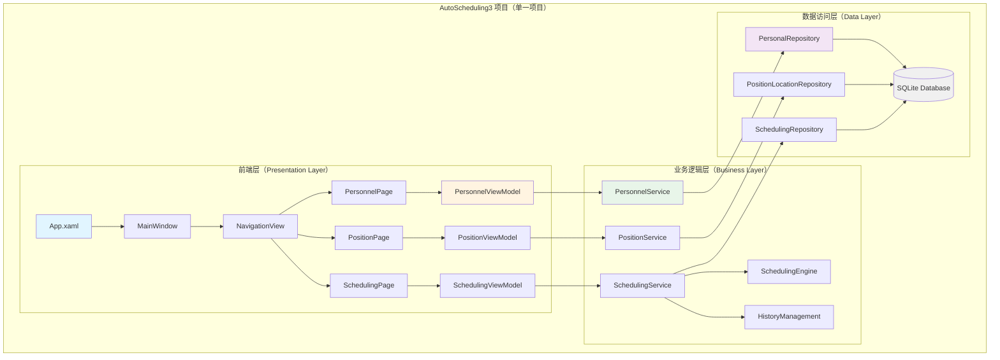
```mermaid
graph TB
    subgraph "AutoScheduling3 项目（单一项目）"
        subgraph "前端层（Presentation Layer）"
            A[App.xaml] --> B[MainWindow]
            B --> C[NavigationView]
            C --> V1[PersonnelPage]
            C --> V2[PositionPage]
            C --> V3[SchedulingPage]
            
            V1 --> VM1[PersonnelViewModel]
            V2 --> VM2[PositionViewModel]
            V3 --> VM3[SchedulingViewModel]
        end
        
        subgraph "业务逻辑层（Business Layer）"
            VM1 --> SVC1[PersonnelService]
            VM2 --> SVC2[PositionService]
            VM3 --> SVC3[SchedulingService]
            
            SVC3 --> ENGINE[SchedulingEngine]
            SVC3 --> HIST[HistoryManagement]
        end
        
        subgraph "数据访问层（Data Layer）"
            SVC1 --> R1[PersonalRepository]
            SVC2 --> R2[PositionLocationRepository]
            SVC3 --> R3[SchedulingRepository]
            
            R1 --> DB[(SQLite Database)]
            R2 --> DB
            R3 --> DB
        end
    end
    
    style A fill:#e1f5ff
    style VM1 fill:#fff4e1
    style SVC1 fill:#e8f5e9
    style R1 fill:#f3e5f5
    style DB fill:#f0f0f0
```

**架构分层说明**：

| 层级 | 职责 | 依赖方向 | 技术实现 |
|------|------|---------|----------|
| 展现层（Views） | UI 呈现、用户交互 | → ViewModels | XAML + Code-behind |
| 视图模型层（ViewModels） | UI 状态管理、命令处理 | → Services | MVVM 模式 |
| 业务逻辑层（Services） | 业务规则、流程控制 | → Repositories | 纯 C# 类 |
| 数据访问层（Repositories） | 数据持久化、CRUD | → 数据库 | ADO.NET + SQLite |
| 数据模型层（Models） | 数据结构定义 | 被所有层使用 | POCO 类 |

**解耦核心原则**：

1. **依赖倒置**：上层依赖接口而非具体实现
2. **单一职责**：每层只负责自己的职责范围
3. **数据传输对象**：层间使用 DTO 传递数据，避免直接暴露 Model
4. **依赖注入**：使用 DI 容器管理对象生命周期
5. **接口隔离**：定义清晰的接口边界

### 1.5 项目目录结构优化

**优化后的项目结构**：

```
AutoScheduling3/
├── Models/                         # 数据模型层（现有）
│   ├── Personal.cs
│   ├── PositionLocation.cs
│   ├── Schedule.cs
│   ├── Skill.cs
│   ├── SchedulingTemplate.cs          # 排班模板模型（新增）
│   └── Constraints/
│       ├── HolidayConfig.cs
│       ├── FixedPositionRule.cs
│       └── ManualAssignment.cs
│
├── DTOs/                           # 数据传输对象（新增）
│   ├── PersonnelDto.cs
│   ├── PositionDto.cs
│   ├── ScheduleDto.cs
│   ├── SchedulingTemplateDto.cs       # 模板 DTO（新增）
│   └── Mappers/                    # Model <-> DTO 映射
│       ├── PersonnelMapper.cs
│       ├── ScheduleMapper.cs
│       └── TemplateMapper.cs           # 模板映射（新增）
│
├── Data/                           # 数据访问层（现有，优化）
│   ├── Interfaces/                 # Repository 接口（新增）
│   │   ├── IPersonalRepository.cs
│   │   ├── IPositionRepository.cs
│   │   ├── ISkillRepository.cs
│   │   └── ITemplateRepository.cs      # 模板仓储接口（新增）
│   ├── PersonalRepository.cs
│   ├── PositionLocationRepository.cs
│   ├── SkillRepository.cs
│   ├── ConstraintRepository.cs
│   └── SchedulingTemplateRepository.cs # 模板仓储实现（新增）
│
├── Services/                       # 业务逻辑层（现有，扩展）
│   ├── Interfaces/                 # Service 接口（新增）
│   │   ├── IPersonnelService.cs
│   │   ├── IPositionService.cs
│   │   ├── ISkillService.cs
│   │   ├── ISchedulingService.cs
│   │   └── ITemplateService.cs         # 模板服务接口（新增）
│   ├── PersonnelService.cs         # 新增
│   ├── PositionService.cs          # 新增
│   ├── SkillService.cs             # 新增
│   ├── ConstraintService.cs        # 新增
│   ├── SchedulingService.cs        # 现有（重构）
│   └── TemplateService.cs          # 模板服务实现（新增）
│
├── SchedulingEngine/               # 排班算法层（现有）
│   ├── Core/
│   ├── Strategies/
│   └── GreedyScheduler.cs
│
├── History/                        # 历史管理（现有）
│   └── HistoryManagement.cs
│
├── ViewModels/                     # 视图模型层（新增）
│   ├── Base/
│   │   └── ViewModelBase.cs        # ViewModel 基类
│   ├── DataManagement/
│   │   ├── PersonnelViewModel.cs
│   │   ├── PositionViewModel.cs
│   │   ├── SkillViewModel.cs
│   │   └── ConstraintViewModel.cs
│   ├── Scheduling/
│   │   ├── CreateSchedulingViewModel.cs
│   │   ├── ScheduleResultViewModel.cs
│   │   └── TemplateViewModel.cs    # 模板管理（新增）
│   ├── History/
│   │   ├── HistoryListViewModel.cs
│   │   └── HistoryDetailViewModel.cs
│   └── MainViewModel.cs
│
├── Views/                          # 视图层（新增）
│   ├── DataManagement/
│   │   ├── PersonnelPage.xaml
│   │   ├── PositionPage.xaml
│   │   ├── SkillPage.xaml
│   │   └── ConstraintPage.xaml
│   ├── Scheduling/
│   │   ├── CreateSchedulingPage.xaml
│   │   ├── ScheduleResultPage.xaml
│   │   └── TemplatePage.xaml       # 模板管理页面（新增）
│   └── History/
│       ├── HistoryListPage.xaml
│       └── HistoryDetailPage.xaml
│
├── Controls/                       # 自定义控件（新增）
│   ├── ScheduleGridControl.xaml
│   ├── PersonnelCard.xaml
│   └── LoadingIndicator.xaml
│
├── Converters/                     # 值转换器（新增）
│   ├── BoolToVisibilityConverter.cs
│   └── DateTimeFormatConverter.cs
│
├── Helpers/                        # 辅助类（新增）
│   ├── NavigationService.cs
│   ├── DialogService.cs
│   └── SettingsHelper.cs
│
├── Assets/                         # 资源文件（现有）
│
├── App.xaml                        # 应用入口（现有）
├── App.xaml.cs
├── MainWindow.xaml                 # 主窗口（现有）
├── MainWindow.xaml.cs
└── AutoScheduling3.csproj
```

## 二、前后端解耦实现方案

### 2.1 解耦策略

**核心思想**：在同一项目内通过分层和依赖注入实现前后端逻辑分离，使各层职责清晰、可独立测试和维护。

**实现步骤**：

| 步骤 | 任务 | 预计时间 | 产出 |
|------|------|---------|------|
| 1 | 定义 Repository 接口 | 1小时 | IPersonalRepository 等接口 |
| 2 | 重构现有 Repository | 2小时 | 实现接口的 Repository 类 |
| 3 | 定义 Service 接口 | 2小时 | IPersonnelService 等接口 |
| 4 | 实现 Service 类 | 4小时 | PersonnelService 等实现类 |
| 5 | 创建 DTO 和 Mapper | 3小时 | DTOs/ 目录和 Mapper 类 |
| 6 | 创建 ViewModels | 6小时 | 所有 ViewModel 类 |
| 7 | 创建 Views | 8小时 | 所有 XAML 页面 |
| 8 | 实现模板管理功能 | 4小时 | 模板相关类和页面 |
| 9 | 配置依赖注入 | 2小时 | App.xaml.cs 配置 |
| 10 | 测试和调试 | 4小时 | 完整功能测试 |

**总计**：约 36 小时（4.5 个工作日）

### 2.2 核心接口定义

**IPersonnelService**：

| 方法 | 输入 | 输出 | 职责 |
|------|------|------|------|
| GetAllAsync | 无 | Task<List<PersonnelDto>> | 获取所有人员 |
| GetByIdAsync | int id | Task<PersonnelDto> | 获取单个人员 |
| CreateAsync | CreatePersonnelDto | Task<PersonnelDto> | 创建人员 |
| UpdateAsync | int id, UpdatePersonnelDto | Task | 更新人员 |
| DeleteAsync | int id | Task | 删除人员 |

**ISchedulingService**：

| 方法 | 输入 | 输出 | 职责 |
|------|------|------|------|
| ExecuteSchedulingAsync | SchedulingRequestDto | Task<ScheduleDto> | 执行排班 |
| GetDraftsAsync | 无 | Task<List<ScheduleSummaryDto>> | 获取草稿 |
| ConfirmAsync | int id | Task | 确认排班 |
| GetHistoryAsync | DateTime? start, DateTime? end | Task<List<ScheduleSummaryDto>> | 获取历史 |

### 2.3 SchedulingService 重构方案

#### 2.3.1 当前问题分析

**问题 1：职责过重（违反单一职责原则）**

当前 SchedulingService 承担了太多职责：
- ✗ 排班业务逻辑
- ✗ 人员管理（应该由 PersonnelService 负责）
- ✗ 哨位管理（应该由 PositionService 负责）
- ✗ 技能管理（应该由 SkillService 负责）
- ✗ 约束管理（应该由 ConstraintService 负责）
- ✗ 直接创建 Repository 实例（违反依赖倒置）

**问题 2：紧耦合**

```
// 当前实现：直接 new Repository
private readonly PersonalRepository _personalRepo;
private readonly PositionLocationRepository _positionRepo;

public SchedulingService(string dbPath)
{
    _personalRepo = new PersonalRepository(dbPath);  // 紧耦合
    _positionRepo = new PositionLocationRepository(dbPath);  // 紧耦合
}
```

影响：
- 无法进行单元测试（无法 Mock）
- 难以替换实现
- 违反依赖倒置原则

**问题 3：直接返回 Model 而非 DTO**

```
// 当前实现
public async Task<Schedule> ExecuteSchedulingAsync(...)
{
    return schedule;  // 直接返回 Model
}

public async Task<Personal?> GetPersonalAsync(int id)
{
    return await _personalRepo.GetByIdAsync(id);  // 直接返回 Model
}
```

影响：
- UI 层直接依赖数据模型
- 数据模型变更会影响 UI 层
- 无法隐藏敏感字段

**问题 4：包含数据管理方法**

```
// 这些方法不应该在 SchedulingService 中
public async Task<int> AddPersonalAsync(Personal personal)
public async Task<int> AddPositionAsync(PositionLocation position)
public async Task<int> AddSkillAsync(Skill skill)
```

#### 2.3.2 重构目标

**目标 1：职责分离**

| 服务 | 职责范围 | 不包含 |
|------|---------|--------|
| SchedulingService | 排班业务逻辑、历史管理 | 数据 CRUD |
| PersonnelService | 人员业务逻辑、人员 CRUD | 其他实体操作 |
| PositionService | 哨位业务逻辑、哨位 CRUD | 其他实体操作 |
| SkillService | 技能业务逻辑、技能 CRUD | 其他实体操作 |
| ConstraintService | 约束业务逻辑、约束 CRUD | 其他实体操作 |

**目标 2：依赖注入**

```
// 重构后：依赖接口
private readonly IPersonalRepository _personalRepo;
private readonly IPositionRepository _positionRepo;

public SchedulingService(
    IPersonalRepository personalRepo,
    IPositionRepository positionRepo,
    ...)
{
    _personalRepo = personalRepo;
    _positionRepo = positionRepo;
}
```

**目标 3：使用 DTO**

```
// 重构后：使用 DTO
public async Task<ScheduleDto> ExecuteSchedulingAsync(SchedulingRequestDto request)
{
    // 业务逻辑
    var schedule = await ExecuteScheduling(...);
    
    // 转换为 DTO
    return _scheduleMapper.ToDto(schedule);
}
```

#### 2.3.3 重构步骤

**步骤 1：定义 ISchedulingService 接口**

```
接口方法：
- Task<ScheduleDto> ExecuteSchedulingAsync(SchedulingRequestDto request)
- Task<List<ScheduleSummaryDto>> GetDraftsAsync()
- Task<ScheduleDto?> GetScheduleByIdAsync(int id)
- Task ConfirmScheduleAsync(int id)
- Task DeleteDraftAsync(int id)
- Task<List<ScheduleSummaryDto>> GetHistoryAsync(DateTime? start, DateTime? end)
```

**步骤 2：移除数据管理方法**

从 SchedulingService 中删除以下方法：
- AddPersonalAsync、GetPersonalAsync、GetAllPersonalsAsync 等（移到 PersonnelService）
- AddPositionAsync、GetPositionAsync、GetAllPositionsAsync 等（移到 PositionService）
- AddSkillAsync、GetSkillAsync、GetAllSkillsAsync 等（移到 SkillService）
- AddFixedPositionRuleAsync、AddManualAssignmentAsync 等（移到 ConstraintService）

**步骤 3：修改构造函数为依赖注入**

修改前：
- 构造函数接收 dbPath 参数
- 内部直接 new 各个 Repository 实例
- 违反依赖倒置原则

修改后：
- 构造函数接收所有依赖的接口：
  - IPersonalRepository
  - IPositionRepository
  - ISkillRepository
  - IConstraintRepository
  - IHistoryManagement
  - ScheduleMapper
- 对每个参数进行空值检查
- 将接口实例保存到私有字段

**步骤 4：修改 ExecuteSchedulingAsync 方法**

修改前：
- 接收多个分散的参数（personalIds, positionIds, startDate, endDate 等）
- 返回 Schedule Model 对象
- UI 层直接依赖数据模型

修改后：
- 接收封装的 SchedulingRequestDto 对象
- 返回 ScheduleDto 对象
- 执行流程：
  1. 验证请求参数（ValidateRequest）
  2. 加载数据并构建 SchedulingContext（BuildSchedulingContextAsync）
  3. 执行排班算法（GreedyScheduler）
  4. 保存到缓冲区
  5. 转换为 DTO 并返回

**步骤 5：添加辅助方法**

**ValidateRequest 方法**：
- 验证 request 不为空
- 验证排班表名称不为空
- 验证开始日期小于结束日期
- 验证至少选择一名人员
- 验证至少选择一个哨位
- 验证失败抛出 ArgumentException

**BuildSchedulingContextAsync 方法**：
- 创建 SchedulingContext 对象
- 根据 personnelIds 加载人员数据
- 根据 positionIds 加载哨位数据
- 加载所有技能数据
- 设置开始和结束日期
- 如果 useActiveHolidayConfig 为 true，加载活动的休息日配置
- 根据 enabledFixedRuleIds 加载启用的定岗规则
- 根据 enabledManualAssignmentIds 加载启用的手动指定（仅在日期范围内）
- 加载最后一次确认的排班（用于计算间隔）
- 返回完整的 SchedulingContext 对象

**步骤 6：修改 ConfirmSchedulingAsync 方法**

```
// 修改前
public async Task ConfirmSchedulingAsync(int bufferId)
{
    await _historyMgmt.ConfirmBufferScheduleAsync(bufferId);
    // TODO: 更新人员的历史统计数据
}

// 修改后
public async Task ConfirmScheduleAsync(int bufferId)
{
    // 1. 获取缓冲区排班
    var bufferSchedules = await _historyMgmt.GetAllBufferSchedulesAsync();
    var scheduleItem = bufferSchedules.FirstOrDefault(s => s.BufferId == bufferId);
    
    if (scheduleItem.Schedule == null)
        throw new InvalidOperationException($"缓冲区排班 {bufferId} 不存在");
    
    // 2. 确认排班（移至历史记录）
    await _historyMgmt.ConfirmBufferScheduleAsync(bufferId);
    
    // 3. 更新人员的历史统计数据
    await UpdatePersonnelStatisticsAsync(scheduleItem.Schedule);
}

private async Task UpdatePersonnelStatisticsAsync(Schedule schedule)
{
    // 计算每个人员的新间隔数
    var personnelStats = CalculatePersonnelStatistics(schedule);
    
    // 更新到数据库
    foreach (var (personnelId, stats) in personnelStats)
    {
        await _personalRepo.UpdateIntervalCountsAsync(
            personnelId,
            stats.RecentShiftInterval,
            stats.RecentHolidayInterval,
            stats.PeriodIntervals);
    }
}

private Dictionary<int, PersonnelStatistics> CalculatePersonnelStatistics(Schedule schedule)
{
    // 实现统计逻辑
    // 根据 schedule.Shifts 计算每个人的班次间隔
    var stats = new Dictionary<int, PersonnelStatistics>();
    
    foreach (var shift in schedule.Shifts)
    {
        if (!stats.ContainsKey(shift.PersonalId))
        {
            stats[shift.PersonalId] = new PersonnelStatistics();
        }
        
        // 更新统计数据
        stats[shift.PersonalId].IncrementShiftCount();
        stats[shift.PersonalId].UpdatePeriodInterval(shift.StartTime);
    }
    
    return stats;
}
```

**步骤 7：修改其他方法为 DTO 返回**

```
// GetDraftsAsync
public async Task<List<ScheduleSummaryDto>> GetDraftsAsync()
{
    var buffers = await _historyMgmt.GetAllBufferSchedulesAsync();
    
    return buffers.Select(b => new ScheduleSummaryDto
    {
        id = b.BufferId,
        title = b.Schedule.Title,
        personnelCount = b.Schedule.PersonalIds.Count,
        positionCount = b.Schedule.PositionIds.Count,
        shiftCount = b.Schedule.Shifts.Count,
        createdAt = b.CreateTime
    }).ToList();
}

// GetHistoryAsync
public async Task<List<ScheduleSummaryDto>> GetHistoryAsync(
    DateTime? startDate = null, 
    DateTime? endDate = null)
{
    var history = await _historyMgmt.GetAllHistorySchedulesAsync();
    
    // 日期过滤
    if (startDate.HasValue)
    {
        history = history.Where(h => h.ConfirmTime >= startDate.Value).ToList();
    }
    if (endDate.HasValue)
    {
        history = history.Where(h => h.ConfirmTime <= endDate.Value).ToList();
    }
    
    return history.Select(h => new ScheduleSummaryDto
    {
        id = h.Schedule.Id,
        title = h.Schedule.Title,
        personnelCount = h.Schedule.PersonalIds.Count,
        positionCount = h.Schedule.PositionIds.Count,
        shiftCount = h.Schedule.Shifts.Count,
        confirmedAt = h.ConfirmTime
    }).ToList();
}

// GetScheduleByIdAsync
public async Task<ScheduleDto?> GetScheduleByIdAsync(int id)
{
    // 先从草稿箱查找
    var buffers = await _historyMgmt.GetAllBufferSchedulesAsync();
    var buffer = buffers.FirstOrDefault(b => b.BufferId == id);
    if (buffer.Schedule != null)
    {
        return await _scheduleMapper.ToDtoAsync(buffer.Schedule);
    }
    
    // 再从历史记录查找
    var history = await _historyMgmt.GetAllHistorySchedulesAsync();
    var historyItem = history.FirstOrDefault(h => h.Schedule.Id == id);
    if (historyItem.Schedule != null)
    {
        return await _scheduleMapper.ToDtoAsync(historyItem.Schedule);
    }
    
    return null;
}
```

#### 2.3.4 重构后的完整结构

**SchedulingService 最终职责**：

| 方法 | 职责 | 依赖 |
|------|------|------|
| ExecuteSchedulingAsync | 执行排班算法 | Repositories, SchedulingEngine |
| GetDraftsAsync | 获取草稿列表 | HistoryManagement |
| GetScheduleByIdAsync | 获取排班详情 | HistoryManagement, Mapper |
| ConfirmScheduleAsync | 确认排班并更新统计 | HistoryManagement, PersonalRepository |
| DeleteDraftAsync | 删除草稿 | HistoryManagement |
| GetHistoryAsync | 获取历史记录 | HistoryManagement |

**移除的方法（迁移到其他 Service）**：

| 原方法 | 迁移到 | 新方法名 |
|--------|--------|----------|
| AddPersonalAsync | PersonnelService | CreateAsync |
| GetPersonalAsync | PersonnelService | GetByIdAsync |
| GetAllPersonalsAsync | PersonnelService | GetAllAsync |
| UpdatePersonalAsync | PersonnelService | UpdateAsync |
| DeletePersonalAsync | PersonnelService | DeleteAsync |
| AddPositionAsync | PositionService | CreateAsync |
| AddSkillAsync | SkillService | CreateAsync |
| AddFixedPositionRuleAsync | ConstraintService | CreateFixedRuleAsync |
| AddManualAssignmentAsync | ConstraintService | CreateManualAssignmentAsync |
| AddHolidayConfigAsync | ConstraintService | CreateHolidayConfigAsync |

**依赖关系变化**：

```
修改前：
SchedulingService
  └─> new PersonalRepository(dbPath)
  └─> new PositionLocationRepository(dbPath)
  └─> new SkillRepository(dbPath)
  └─> new ConstraintRepository(dbPath)
  └─> new HistoryManagement(dbPath)

修改后：
SchedulingService
  └─> IPersonalRepository (注入)
  └─> IPositionRepository (注入)
  └─> ISkillRepository (注入)
  └─> IConstraintRepository (注入)
  └─> IHistoryManagement (注入)
  └─> ScheduleMapper (注入)
```

#### 2.3.5 重构收益

| 改进项 | 修改前 | 修改后 | 收益 |
|--------|--------|--------|------|
| 职责范围 | 包含所有数据管理 | 仅包含排班业务 | 单一职责 |
| 依赖方式 | 直接 new Repository | 依赖注入接口 | 可测试性 |
| 返回类型 | Model 对象 | DTO 对象 | UI 层解耦 |
| 方法数量 | 30+ 方法 | 6 个核心方法 | 代码简洁 |
| 可测试性 | 难以 Mock | 易于 Mock | 单元测试 |
| 扩展性 | 紧耦合 | 松耦合 | 易于扩展 |

### 2.4 模板服务设计

#### 2.4.1 SchedulingTemplate 数据模型

**模型定义**：

| 字段名称 | 数据类型 | 是否可空 | 说明 |
|---------|----------|---------|------|
| Id | int | 否 | 模板 ID（主键） |
| Name | string | 否 | 模板名称 (1-100字符) |
| Description | string | 是 | 模板描述 (最多500字符) |
| TemplateType | string | 否 | 模板类型 (regular/holiday/special) |
| IsDefault | bool | 否 | 是否为默认模板 |
| PersonnelIdsJson | string | 否 | 人员 ID 列表 (JSON 序列化) |
| PositionIdsJson | string | 否 | 哨位 ID 列表 (JSON 序列化) |
| HolidayConfigId | int? | 是 | 休息日配置 ID |
| UseActiveHolidayConfig | bool | 否 | 是否使用活动配置 |
| EnabledFixedRuleIdsJson | string | 是 | 启用的定岗规则 ID (JSON) |
| EnabledManualAssignmentIdsJson | string | 是 | 启用的手动指定 ID (JSON) |
| CreatedAt | DateTime | 否 | 创建时间 |
| LastUsedAt | DateTime? | 是 | 最后使用时间 |
| UsageCount | int | 否 | 使用次数 |

**数据库表设计**：

表名：SchedulingTemplates

约束：
- Id 为主键，自增
- Name 唯一约束
- TemplateType 检查约束（仅允许 'regular', 'holiday', 'special'）
- HolidayConfigId 外键约束，关联 HolidayConfigs 表，级联删除时设为 NULL

索引：
- TemplateType 列索引（提升按类型查询性能）
- IsDefault 列索引（提升查询默认模板性能）

#### 2.4.2 ITemplateRepository 接口定义

**接口方法**：

| 方法名 | 输入参数 | 返回值 | 职责 |
|---------|----------|--------|------|
| GetAllAsync | 无 | Task<List<SchedulingTemplate>> | 获取所有模板 |
| GetByIdAsync | int id | Task<SchedulingTemplate?> | 获取指定模板 |
| GetByTypeAsync | string type | Task<List<SchedulingTemplate>> | 按类型获取模板 |
| GetDefaultByTypeAsync | string type | Task<SchedulingTemplate?> | 获取指定类型的默认模板 |
| CreateAsync | SchedulingTemplate template | Task<int> | 创建模板，返回 ID |
| UpdateAsync | SchedulingTemplate template | Task | 更新模板 |
| DeleteAsync | int id | Task | 删除模板 |
| IncrementUsageCountAsync | int id | Task | 增加使用次数 |
| UpdateLastUsedTimeAsync | int id, DateTime time | Task | 更新最后使用时间 |
| SearchByNameAsync | string keyword | Task<List<SchedulingTemplate>> | 按名称搜索 |

#### 2.4.3 ITemplateService 接口定义

**服务方法**：

| 方法名 | 输入参数 | 返回值 | 职责 |
|---------|----------|--------|------|
| GetAllTemplatesAsync | 无 | Task<List<SchedulingTemplateDto>> | 获取所有模板 |
| GetTemplateByIdAsync | int id | Task<SchedulingTemplateDto?> | 获取模板详情 |
| GetTemplatesByTypeAsync | string type | Task<List<SchedulingTemplateDto>> | 按类型筛选 |
| GetDefaultTemplateAsync | string type | Task<SchedulingTemplateDto?> | 获取默认模板 |
| CreateTemplateAsync | CreateTemplateDto dto | Task<SchedulingTemplateDto> | 创建模板 |
| UpdateTemplateAsync | int id, UpdateTemplateDto dto | Task | 更新模板 |
| DeleteTemplateAsync | int id | Task | 删除模板 |
| UseTemplateAsync | int id, UseTemplateDto dto | Task<ScheduleDto> | 使用模板创建排班 |
| ValidateTemplateAsync | int id | Task<TemplateValidationResult> | 验证模板有效性 |
| DuplicateTemplateAsync | int id, string newName | Task<SchedulingTemplateDto> | 复制模板 |

#### 2.4.4 TemplateService 实现逻辑

**构造函数依赖**：

需要注入以下服务：
- ITemplateRepository：模板数据访问
- IPersonalRepository：验证人员存在性
- IPositionRepository：验证哨位存在性
- IConstraintRepository：验证约束存在性
- ISchedulingService：执行排班
- TemplateMapper：Model/DTO 转换

**核心方法实现 - CreateTemplateAsync**：

流程：
1. 验证模板名称唯一性
2. 验证人员和哨位是否存在
3. 如果设置为默认，取消同类型其他模板的默认状态
4. 创建模板记录
5. 返回 DTO

**核心方法实现 - UseTemplateAsync**：

流程：
1. 获取模板配置
2. 验证模板有效性（人员、哨位、约束是否仍存在）
3. 构建 SchedulingRequestDto
   - 使用模板中的 personnelIds 和 positionIds
   - 或使用 overridePersonnelIds / overridePositionIds（如果提供）
   - 使用用户输入的 startDate、endDate、title
   - 加载模板中的约束配置
   - 对于手动指定，仅加载在所选时间范围内的指定
4. 调用 schedulingService.ExecuteSchedulingAsync(request)
5. 更新模板使用统计（usageCount, lastUsedAt）
6. 返回排班结果

**核心方法实现 - ValidateTemplateAsync**：

验证项：

| 验证项 | 验证逻辑 | 错误类型 |
|---------|----------|----------|
| 人员存在性 | 检查模板中的每个 personnelId 是否存在 | Warning/Error |
| 哨位存在性 | 检查模板中的每个 positionId 是否存在 | Warning/Error |
| 约束存在性 | 检查休息日配置、定岗规则是否存在 | Warning |
| 人员可用性 | 检查人员是否在职且可用 | Warning |
| 技能匹配 | 检查人员技能是否满足哨位需求 | Info |

**验证结果数据结构**：

TemplateValidationResult 包含：
- IsValid（bool）：整体是否有效
- Errors（List）：错误消息列表
- Warnings（List）：警告消息列表
- Infos（List）：信息消息列表

ValidationMessage 包含：
- Message（string）：消息内容
- PropertyName（string）：相关属性
- ResourceId（int?）：相关资源 ID

#### 2.4.5 模板使用场景示例

**场景 1：月度常规排班**

用户操作：
1. 首次创建排班时，选择人员、哨位、约束
2. 在步骤 5 点击"保存为模板"
3. 输入模板名称："月度常规排班"，类型：常规，设为默认
4. 下月创建排班时，点击"从模板创建"
5. 系统自动加载默认模板
6. 用户仅需设置新的时间范围，直接执行排班

**场景 2：节假日特殊排班**

用户操作：
1. 创建名为"国庆节特别排班"的模板
2. 选择特定人员组（如备勤人员）
3. 设置特殊约束（如节假日配置）
4. 保存为 holiday 类型模板
5. 每次节假日排班时使用该模板

**场景 3：团队轮流值班**

用户操作：
1. 创建多个模板："甲组值班"、"乙组值班"、"丙组值班"
2. 每个模板包含不同的人员组
3. 按计划轮流使用不同模板
4. 保证各组负载均衡

### 2.3 依赖注入配置

**App.xaml.cs 示例配置**：

配置流程：
1. 创建 ServiceCollection
2. 注册数据库路径配置
3. 注册 Repositories（Singleton）
4. 注册 Services（Singleton）
5. 注册 ViewModels（Transient）
6. 注册 Pages（Transient）
7. 注册辅助服务（Singleton）
8. 构建 ServiceProvider

**服务注册表**：

| 类型 | 接口 | 实现 | 生命周期 | 说明 |
|------|------|------|---------|------|
| Repository | IPersonalRepository | PersonalRepository | Singleton | 数据访问 |
| Repository | IPositionRepository | PositionLocationRepository | Singleton | 数据访问 |
| Repository | ITemplateRepository | SchedulingTemplateRepository | Singleton | 模板数据访问 |
| Service | IPersonnelService | PersonnelService | Singleton | 业务逻辑 |
| Service | ISchedulingService | SchedulingService | Singleton | 业务逻辑 |
| Service | ITemplateService | TemplateService | Singleton | 模板业务逻辑 |
| ViewModel | - | PersonnelViewModel | Transient | 页面状态 |
| ViewModel | - | TemplateViewModel | Transient | 模板页面状态 |
| Page | - | PersonnelPage | Transient | UI 视图 |
| Page | - | TemplatePage | Transient | 模板管理页面 |
| Helper | INavigationService | NavigationService | Singleton | 导航服务 |

## 三、主界面框架设计

### 3.1 Shell 主窗口结构

**布局组成**：
- 标题栏：自定义标题栏，集成搜索框和用户菜单
- 导航面板：左侧 NavigationView，支持展开/折叠
- 内容区域：Frame 承载页面内容
- 状态栏：显示系统状态、通知和进度

**视觉层级**：
| 元素 | 层级 | 材质效果 | 用途 |
|------|------|---------|------|
| 标题栏 | Z-Index: 100 | Mica 背景 | 应用标识、全局操作 |
| 导航面板 | Z-Index: 90 | Acrylic 亚克力 | 页面导航 |
| 内容区域 | Z-Index: 10 | 纯色背景 | 主要内容展示 |
| 弹出层 | Z-Index: 200 | 模糊背景 | 对话框、菜单 |
| 状态栏 | Z-Index: 80 | 半透明背景 | 状态信息 |

### 3.2 导航结构

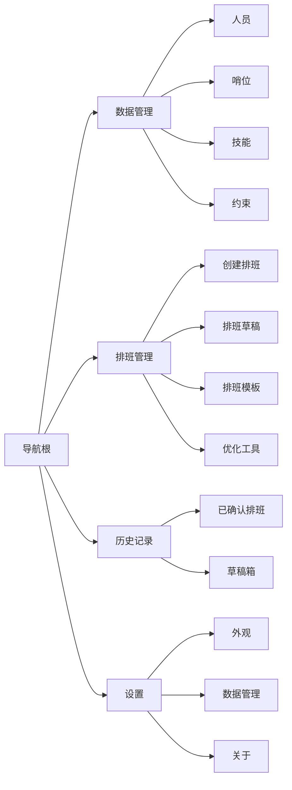
```mermaid
graph LR
    A[导航根] --> B[数据管理]
    A --> C[排班管理]
    A --> D[历史记录]
    A --> E[设置]
    
    B --> B1[人员]
    B --> B2[哨位]
    B --> B3[技能]
    B --> B4[约束]
    
    C --> C1[创建排班]
    C --> C2[排班草稿]
    C --> C3[排班模板]
    C --> C4[优化工具]
    
    D --> D1[已确认排班]
    D --> D2[草稿箱]
    
    E --> E1[外观]
    E --> E2[数据管理]
    E --> E3[关于]
```

**导航菜单项定义**：

| 图标 | 标题 | 路由 | 权限 | 说明 |
|------|------|------|------|------|
| 📊 | 数据管理 | /data-management | 基础 | 人员、哨位、技能、约束管理 |
| 📅 | 排班管理 | /scheduling | 基础 | 创建和优化排班 |
| 📜 | 历史记录 | /history | 基础 | 查看历史排班 |
| ⚙️ | 设置 | /settings | 基础 | 主题、数据库配置 |

### 3.3 主题与配色

**Win11 色彩系统**：

| 主题 | 背景色 | 卡片色 | 强调色 | 文本色 | 边框色 |
|------|--------|--------|--------|--------|--------|
| 浅色模式 | #F3F3F3 | #FFFFFF | SystemAccentColor | #000000 (E1) | #E5E5E5 |
| 深色模式 | #202020 | #2C2C2C | SystemAccentColorLight1 | #FFFFFF (E1) | #3F3F3F |

**语义色彩**：

| 用途 | 浅色模式 | 深色模式 | 使用场景 |
|------|---------|---------|---------|
| 成功 | #107C10 | #6CCB5F | 操作成功提示 |
| 警告 | #FFB900 | #FCE100 | 约束冲突提示 |
| 错误 | #E81123 | #FF99A4 | 错误信息 |
| 信息 | #0078D4 | #60CDFF | 一般提示 |

## 三点五、接口-页面映射与数据流转

### 3.5.1 页面服务依赖映射表

**人员管理页面 (PersonnelPage)**：

| 用户操作 | 触发命令 | 调用接口 | 输入参数 | 输出数据 | 异常处理 |
|---------|---------|---------|---------|---------|----------|
| 打开页面 | LoadPersonnelsCommand | IPersonnelService.GetAllAsync() | 无 | Task<List<PersonnelDto>> | 显示错误状态，提供重试按钮 |
| 新增人员 | CreatePersonnelCommand | IPersonnelService.CreateAsync(dto) | CreatePersonnelDto | Task<PersonnelDto> | 验证失败显示字段错误，保存失败显示重试对话框 |
| 编辑人员 | UpdatePersonnelCommand | IPersonnelService.UpdateAsync(id, dto) | int id, UpdatePersonnelDto | Task | 数据冲突提示刷新，超时提示重试 |
| 删除人员 | DeletePersonnelCommand | IPersonnelService.DeleteAsync(id) | int id | Task | 关联数据检查，提示影响范围后确认删除 |
| 搜索人员 | SearchCommand | IPersonnelService.SearchAsync(keyword) | string keyword | Task<List<PersonnelDto>> | 无结果显示空状态，异常显示错误提示 |

**CreatePersonnelDto 字段验证规则**：

| 字段 | 类型 | 验证规则 | 错误提示 |
|------|------|---------|----------|
| name | string | 必填，1-50字符，不能包含特殊字符（<>"'/\\） | "姓名为必填项，长度1-50字符" |
| positionId | int | 必填，必须存在于数据库中 | "请选择有效的职位" |
| skillIds | int[] | 必填，至少选择1项，所有ID必须存在 | "至少选择一项技能，且技能必须有效" |
| isAvailable | boolean | 默认 true | - |
| recentShiftIntervalCount | int | 0-999，非负整数 | "间隔数必须在0-999之间" |
| recentHolidayShiftIntervalCount | int | 0-999，非负整数 | "间隔数必须在0-999之间" |
| recentPeriodShiftIntervals | int[12] | 每项0-999，数组长度必须为12 | "时段间隔必须为12个，每项0-999" |

**创建排班页面 (CreateSchedulingPage)**：

| 用户操作 | 触发命令 | 调用接口 | 输入参数 | 输出数据 | 异常处理 |
|---------|---------|---------|---------|---------|----------|
| 加载人员列表 | LoadAvailablePersonnelsCommand | IPersonnelService.GetAllAsync() | 无 | Task<List<PersonnelDto>> | 失败时禁用下一步，显示重试按钮 |
| 加载哨位列表 | LoadAvailablePositionsCommand | IPositionService.GetAllAsync() | 无 | Task<List<PositionDto>> | 失败时禁用下一步，显示重试按钮 |
| 加载休息日配置 | LoadHolidayConfigsCommand | IConstraintService.GetAllHolidayConfigsAsync() | 无 | Task<List<HolidayConfigDto>> | 可选配置，失败时提示但允许继续 |
| 加载定岗规则 | LoadFixedRulesCommand | IConstraintService.GetAllFixedRulesAsync(enabledOnly: null) | bool? enabledOnly | Task<List<FixedRuleDto>> | 可选配置，失败时提示但允许继续 |
| 执行排班 | ExecuteSchedulingCommand | ISchedulingService.ExecuteSchedulingAsync(request) | SchedulingRequestDto | Task<ScheduleDto> | 参数验证失败显示字段错误，算法失败显示详细错误信息和建议 |
| 保存为模板 | SaveAsTemplateCommand | ITemplateService.CreateTemplateAsync(dto) | CreateTemplateDto | Task<SchedulingTemplateDto> | 名称重复提示修改，保存失败提示重试 |

**SchedulingRequestDto 参数验证与填充逻辑**：

| 字段 | 来源 | 验证规则 | 错误提示 |
|------|------|---------|----------|
| title | 步骤1用户输入 | 必填，1-100字符 | "排班表名称为必填项" |
| startDate | 步骤1用户选择 | 必填，不早于今天 | "开始日期不能早于今天" |
| endDate | 步骤1用户选择 | 必填，不早于startDate | "结束日期必须晚于开始日期" |
| personnelIds | 步骤2已选人员列表 | 必填，至少1人 | "至少选择一名人员" |
| positionIds | 步骤3已选哨位列表 | 必填，至少1个 | "至少选择一个哨位" |
| useActiveHolidayConfig | 步骤4复选框 | 默认 true | - |
| enabledFixedRuleIds | 步骤4已勾选规则 | 可选，所有ID必须存在 | "选中的规则无效，请刷新页面" |
| enabledManualAssignmentIds | 步骤4已勾选指定 | 可选，过滤日期范围外的ID | 自动过滤，无需提示 |

**从模板创建排班数据填充逻辑**：

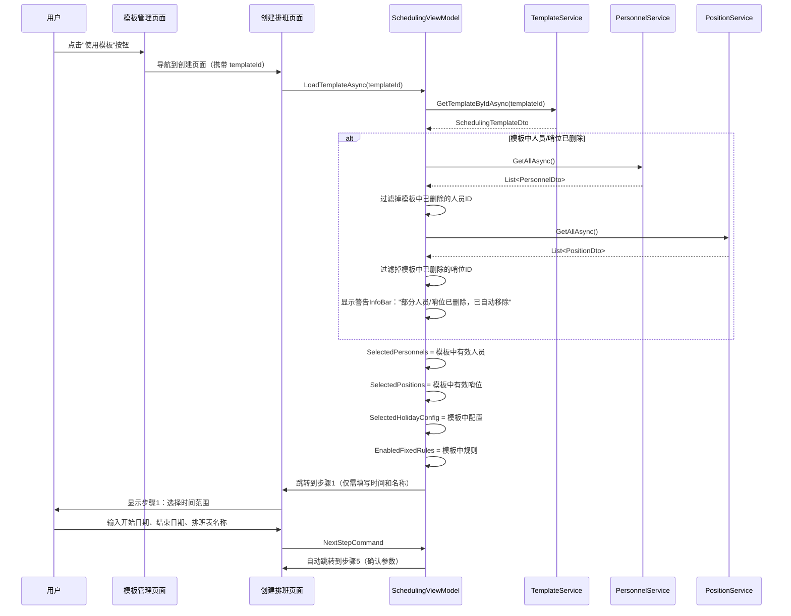
```mermaid
sequenceDiagram
    participant U as 用户
    participant T as 模板管理页面
    participant C as 创建排班页面
    participant V as SchedulingViewModel
    participant TS as TemplateService
    participant PS as PersonnelService
    participant POS as PositionService
    
    U->>T: 点击"使用模板"按钮
    T->>C: 导航到创建页面（携带 templateId）
    
    C->>V: LoadTemplateAsync(templateId)
    V->>TS: GetTemplateByIdAsync(templateId)
    TS-->>V: SchedulingTemplateDto
    
    alt 模板中人员/哨位已删除
        V->>PS: GetAllAsync()
        PS-->>V: List<PersonnelDto>
        V->>V: 过滤掉模板中已删除的人员ID
        V->>POS: GetAllAsync()
        POS-->>V: List<PositionDto>
        V->>V: 过滤掉模板中已删除的哨位ID
        V->>V: 显示警告InfoBar："部分人员/哨位已删除，已自动移除"
    end
    
    V->>V: SelectedPersonnels = 模板中有效人员
    V->>V: SelectedPositions = 模板中有效哨位
    V->>V: SelectedHolidayConfig = 模板中配置
    V->>V: EnabledFixedRules = 模板中规则
    V->>C: 跳转到步骤1（仅需填写时间和名称）
    
    C->>U: 显示步骤1：选择时间范围
    U->>C: 输入开始日期、结束日期、排班表名称
    C->>V: NextStepCommand
    V->>C: 自动跳转到步骤5（确认参数）
```

**模板管理页面 (TemplatePage)**：

| 用户操作 | 触发命令 | 调用接口 | 输入参数 | 输出数据 | 异常处理 |
|---------|---------|---------|---------|---------|----------|
| 加载模板列表 | LoadTemplatesCommand | ITemplateService.GetAllTemplatesAsync() | 无 | Task<List<SchedulingTemplateDto>> | 显示错误状态，提供重试按钮 |
| 创建模板 | CreateTemplateCommand | ITemplateService.CreateTemplateAsync(dto) | CreateTemplateDto | Task<SchedulingTemplateDto> | 名称重复提示修改，保存失败提示重试 |
| 验证模板 | ValidateTemplateCommand | ITemplateService.ValidateTemplateAsync(id) | int id | Task<TemplateValidationResult> | 显示验证结果（错误/警告/信息） |
| 使用模板 | UseTemplateCommand | 导航到创建排班页面 | 携带 templateId | - | 模板不存在时提示并刷新列表 |
| 复制模板 | DuplicateTemplateCommand | ITemplateService.DuplicateTemplateAsync(id, newName) | int id, string newName | Task<SchedulingTemplateDto> | 名称重复提示修改 |

### 3.5.2 异常场景完整流程设计

**场景1：执行排班时数据库连接超时**

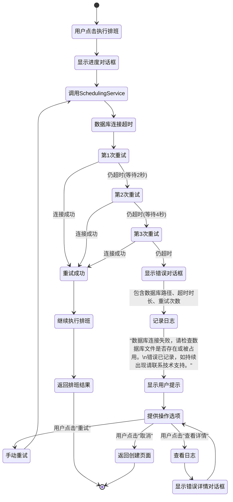
```mermaid
stateDiagram-v2
    [*] --> 用户点击执行排班
    用户点击执行排班 --> 显示进度对话框
    显示进度对话框 --> 调用SchedulingService
    调用SchedulingService --> 数据库连接超时
    
    数据库连接超时 --> 第1次重试
    第1次重试 --> 重试成功: 连接成功
    第1次重试 --> 第2次重试: 仍超时(等待2秒)
    
    第2次重试 --> 重试成功: 连接成功
    第2次重试 --> 第3次重试: 仍超时(等待4秒)
    
    第3次重试 --> 重试成功: 连接成功
    第3次重试 --> 显示错误对话框: 仍超时
    
    重试成功 --> 继续执行排班
    继续执行排班 --> 返回排班结果
    返回排班结果 --> [*]
    
    显示错误对话框 --> 记录日志: 包含数据库路径、超时时长、重试次数
    记录日志 --> 显示用户提示: "数据库连接失败，请检查数据库文件是否存在或被占用。\n错误已记录，如持续出现请联系技术支持。"
    显示用户提示 --> 提供操作选项
    提供操作选项 --> 手动重试: 用户点击"重试"
    提供操作选项 --> 返回创建页面: 用户点击"取消"
    提供操作选项 --> 查看日志: 用户点击"查看详情"
    
    手动重试 --> 调用SchedulingService
    返回创建页面 --> [*]
    查看日志 --> 显示错误详情对话框
    显示错误详情对话框 --> 提供操作选项
```

**场景2：排班算法执行失败（无法找到可行解）**

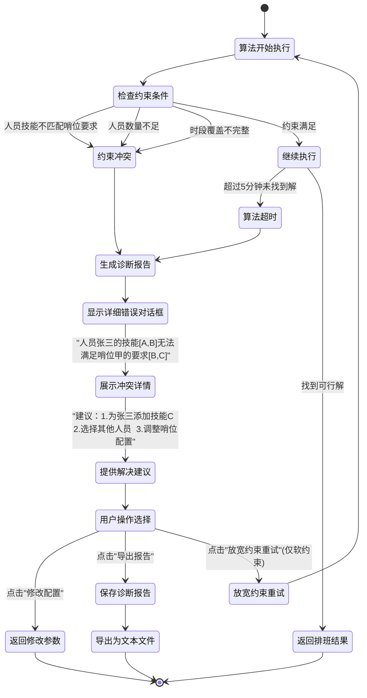
```mermaid
stateDiagram-v2
    [*] --> 算法开始执行
    算法开始执行 --> 检查约束条件
    
    检查约束条件 --> 约束冲突: 人员技能不匹配哨位要求
    检查约束条件 --> 约束冲突: 人员数量不足
    检查约束条件 --> 约束冲突: 时段覆盖不完整
    检查约束条件 --> 继续执行: 约束满足
    
    继续执行 --> 算法超时: 超过5分钟未找到解
    继续执行 --> 返回排班结果: 找到可行解
    
    约束冲突 --> 生成诊断报告
    算法超时 --> 生成诊断报告
    
    生成诊断报告 --> 显示详细错误对话框
    显示详细错误对话框 --> 展示冲突详情: "人员张三的技能[A,B]无法满足哨位甲的要求[B,C]"
    展示冲突详情 --> 提供解决建议: "建议：1.为张三添加技能C  2.选择其他人员  3.调整哨位配置"
    提供解决建议 --> 用户操作选择
    
    用户操作选择 --> 返回修改参数: 点击"修改配置"
    用户操作选择 --> 保存诊断报告: 点击"导出报告"
    用户操作选择 --> 放宽约束重试: 点击"放宽约束重试"(仅软约束)
    
    返回修改参数 --> [*]
    保存诊断报告 --> 导出为文本文件
    导出为文本文件 --> [*]
    放宽约束重试 --> 算法开始执行
    
    返回排班结果 --> [*]
```

**场景3：保存模板时名称重复**

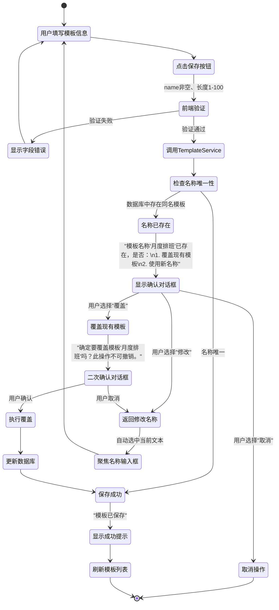
```mermaid
stateDiagram-v2
    [*] --> 用户填写模板信息
    用户填写模板信息 --> 点击保存按钮
    点击保存按钮 --> 前端验证: name非空、长度1-100
    
    前端验证 --> 显示字段错误: 验证失败
    前端验证 --> 调用TemplateService: 验证通过
    
    调用TemplateService --> 检查名称唯一性
    检查名称唯一性 --> 名称已存在: 数据库中存在同名模板
    检查名称唯一性 --> 保存成功: 名称唯一
    
    名称已存在 --> 显示确认对话框: "模板名称'月度排班'已存在，是否：\n1. 覆盖现有模板\n2. 使用新名称"
    
    显示确认对话框 --> 覆盖现有模板: 用户选择"覆盖"
    显示确认对话框 --> 返回修改名称: 用户选择"修改"
    显示确认对话框 --> 取消操作: 用户选择"取消"
    
    覆盖现有模板 --> 二次确认对话框: "确定要覆盖模板'月度排班'吗？此操作不可撤销。"
    二次确认对话框 --> 执行覆盖: 用户确认
    二次确认对话框 --> 返回修改名称: 用户取消
    
    执行覆盖 --> 更新数据库
    更新数据库 --> 保存成功
    
    返回修改名称 --> 聚焦名称输入框: 自动选中当前文本
    聚焦名称输入框 --> 用户填写模板信息
    
    显示字段错误 --> 用户填写模板信息
    取消操作 --> [*]
    保存成功 --> 显示成功提示: "模板已保存"
    显示成功提示 --> 刷新模板列表
    刷新模板列表 --> [*]
```

### 3.5.3 统一错误处理机制

**错误分类与处理策略**：

| 错误类型 | 触发场景 | UI反馈 | 重试策略 | 日志记录 |
|---------|---------|--------|---------|----------|
| 验证错误 | 用户输入不符合规则 | 字段下方显示红色错误文本 | 无需重试，用户修正 | 不记录 |
| 业务错误 | 违反业务规则（如删除被引用的数据） | InfoBar显示警告，说明原因 | 无需重试，用户调整 | 记录警告级别 |
| 网络/数据库错误 | 连接超时、文件锁定 | 对话框提示，提供重试按钮 | 自动重试3次（指数退避） | 记录错误级别 |
| 算法错误 | 无法找到可行解 | 详细错误对话框+解决建议 | 可选放宽约束重试 | 记录警告级别+诊断信息 |
| 系统错误 | 未捕获异常、内存溢出 | 全局错误对话框+程序重启选项 | 提示保存数据后重启 | 记录严重错误级别+堆栈信息 |

**全局异常处理流程**：

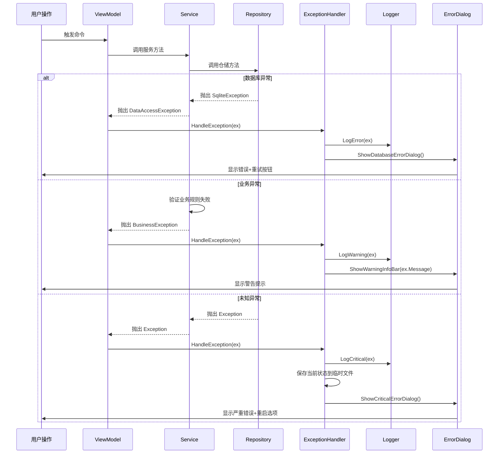
```mermaid
sequenceDiagram
    participant U as 用户操作
    participant V as ViewModel
    participant S as Service
    participant R as Repository
    participant EH as ExceptionHandler
    participant L as Logger
    participant UI as ErrorDialog
    
    U->>V: 触发命令
    V->>S: 调用服务方法
    S->>R: 调用仓储方法
    
    alt 数据库异常
        R-->>S: 抛出 SqliteException
        S-->>V: 抛出 DataAccessException
        V->>EH: HandleException(ex)
        EH->>L: LogError(ex)
        EH->>UI: ShowDatabaseErrorDialog()
        UI->>U: 显示错误+重试按钮
    else 业务异常
        S->>S: 验证业务规则失败
        S-->>V: 抛出 BusinessException
        V->>EH: HandleException(ex)
        EH->>L: LogWarning(ex)
        EH->>UI: ShowWarningInfoBar(ex.Message)
        UI->>U: 显示警告提示
    else 未知异常
        R-->>S: 抛出 Exception
        S-->>V: 抛出 Exception
        V->>EH: HandleException(ex)
        EH->>L: LogCritical(ex)
        EH->>EH: 保存当前状态到临时文件
        EH->>UI: ShowCriticalErrorDialog()
        UI->>U: 显示严重错误+重启选项
    end
```

## 四、核心页面设计

### 4.1 数据管理模块

#### 4.1.1 人员管理页面

**页面路径**：`/data-management/personnel`

**布局结构**：

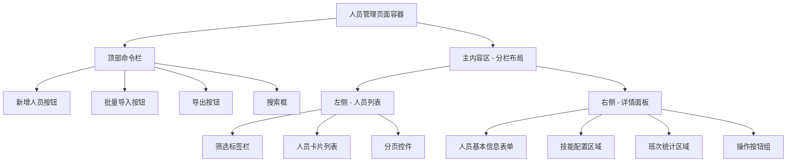
```mermaid
graph TB
    A[人员管理页面容器] --> B[顶部命令栏]
    A --> C[主内容区 - 分栏布局]
    
    B --> B1[新增人员按钮]
    B --> B2[批量导入按钮]
    B --> B3[导出按钮]
    B --> B4[搜索框]
    
    C --> D[左侧 - 人员列表]
    C --> E[右侧 - 详情面板]
    
    D --> D1[筛选标签栏]
    D --> D2[人员卡片列表]
    D --> D3[分页控件]
    
    E --> E1[人员基本信息表单]
    E --> E2[技能配置区域]
    E --> E3[班次统计区域]
    E --> E4[操作按钮组]
```

**左侧人员列表**：

| 控件类型 | 用途 | 数据绑定 | 交互行为 |
|---------|------|---------|---------|
| SplitButton（筛选） | 快速筛选 | 在职/退役状态 | 点击切换筛选条件 |
| SearchBox | 搜索人员 | 姓名、职位关键词 | 实时搜索 |
| ListView | 人员列表 | PersonnelViewModel.Personnel | 单选，点击显示详情 |
| Pagination | 分页导航 | 当前页/总页数 | 切换页面 |

**人员卡片内容结构**：
- 头像区域：显示人员头像（或首字母）
- 基础信息：姓名（粗体）、职位（次要文本）
- 状态标记：在职/退役 Badge、可用性指示器
- 快捷操作：编辑图标按钮、删除图标按钮

**右侧详情面板**：

**表单字段定义**：

| 字段名称 | 控件类型 | 验证规则 | API 字段 |
|---------|---------|---------|---------|
| 姓名 | TextBox | 必填，1-50字符 | Name |
| 职位 | ComboBox | 必选，关联哨位数据 | PositionId |
| 是否在职 | ToggleSwitch | 布尔值 | IsRetired（取反） |
| 是否可用 | ToggleSwitch | 布尔值 | IsAvailable |
| 技能列表 | CheckBox 组 | 至少选择一项 | SkillIds |
| 最近班次间隔 | NumberBox | 0-999，整数 | RecentShiftIntervalCount |
| 节假日班次间隔 | NumberBox | 0-999，整数 | RecentHolidayShiftIntervalCount |
| 时段班次间隔 | NumberBox[12] | 0-999，数组 | RecentPeriodShiftIntervals |

**技能配置区域**：
- 使用 ItemsRepeater 显示技能列表
- 每项技能使用 CheckBox + 技能名称标签
- 支持全选/反选快捷操作

**班次统计区域**：
- 使用 Expander 折叠面板
- 显示 12 个时段的班次间隔数据
- 使用 Grid 布局，每行 4 个时段

**数据交互流程**：

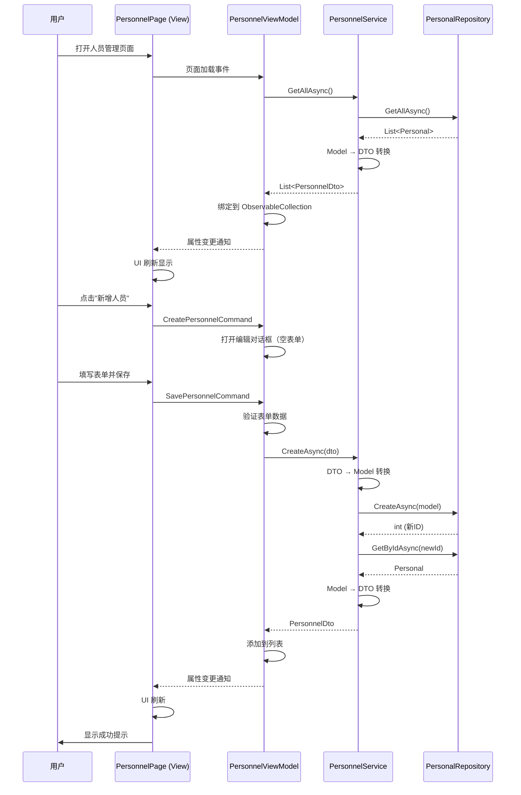
```mermaid
sequenceDiagram
    participant U as 用户
    participant V as PersonnelPage (View)
    participant VM as PersonnelViewModel
    participant S as PersonnelService
    participant R as PersonalRepository
    
    U->>V: 打开人员管理页面
    V->>VM: 页面加载事件
    VM->>S: GetAllAsync()
    S->>R: GetAllAsync()
    R-->>S: List<Personal>
    S->>S: Model → DTO 转换
    S-->>VM: List<PersonnelDto>
    VM->>VM: 绑定到 ObservableCollection
    VM-->>V: 属性变更通知
    V->>V: UI 刷新显示
    
    U->>V: 点击"新增人员"
    V->>VM: CreatePersonnelCommand
    VM->>VM: 打开编辑对话框（空表单）
    U->>V: 填写表单并保存
    V->>VM: SavePersonnelCommand
    VM->>VM: 验证表单数据
    VM->>S: CreateAsync(dto)
    S->>S: DTO → Model 转换
    S->>R: CreateAsync(model)
    R-->>S: int (新ID)
    S->>R: GetByIdAsync(newId)
    R-->>S: Personal
    S->>S: Model → DTO 转换
    S-->>VM: PersonnelDto
    VM->>VM: 添加到列表
    VM-->>V: 属性变更通知
    V->>V: UI 刷新
    V->>U: 显示成功提示
```

#### 3.1.2 哨位管理页面

**页面路径**：`/data-management/positions`

**布局结构**：与人员管理类似的主-从布局

**左侧哨位列表**：
- 网格卡片视图（GridView），显示哨位卡片
- 支持列表/网格视图切换
- 每张卡片显示：哨位名称、地点、技能标签、快捷操作

**右侧详情面板字段**：

| 字段名称 | 控件类型 | 验证规则 | API 字段 |
|---------|---------|---------|---------|
| 哨位名称 | TextBox | 必填，1-100字符 | Name |
| 地点 | TextBox | 必填，1-200字符 | Location |
| 介绍 | TextBox（多行） | 可选，最多500字符 | Description |
| 要求说明 | RichEditBox | 可选，支持格式化 | Requirements |
| 所需技能 | CheckBox 组 | 至少选择一项 | RequiredSkillIds |

**哨位卡片视觉设计**：
- 使用 CardPanel 容器（圆角、阴影）
- 顶部：哨位名称（18px 粗体）
- 中间：地点图标 + 地点文本
- 底部：技能标签（Chip 风格）
- Hover 效果：轻微上浮 + 阴影加深

#### 3.1.3 技能管理页面

**页面路径**：`/data-management/skills`

**布局模式**：简化的列表 + 内联编辑模式

**列表视图**：

| 列名 | 宽度 | 内容 | 可排序 |
|------|------|------|--------|
| ID | 60px | 技能 ID | 是 |
| 技能名称 | 200px | TextBox（可编辑） | 是 |
| 描述 | * | TextBox（可编辑） | 否 |
| 操作 | 100px | 保存/删除按钮 | 否 |

**内联编辑模式**：
- 点击行进入编辑状态，控件变为可编辑
- 保存按钮：调用 API 更新数据
- 取消按钮：恢复原始数据
- 删除按钮：弹出确认对话框

**新增技能**：
- 顶部固定一行"新增技能"表单
- 输入名称和描述后点击"添加"按钮
- 立即调用 API 创建并刷新列表

#### 3.1.4 约束配置页面

**页面路径**：`/data-management/constraints`

**标签页结构**：

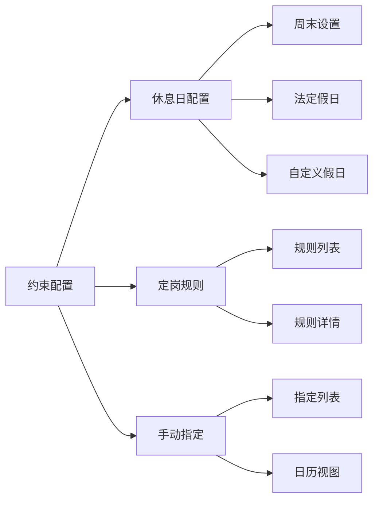
```mermaid
graph LR
    A[约束配置] --> B[休息日配置]
    A --> C[定岗规则]
    A --> D[手动指定]
    
    B --> B1[周末设置]
    B --> B2[法定假日]
    B --> B3[自定义假日]
    
    C --> C1[规则列表]
    C --> C2[规则详情]
    
    D --> D1[指定列表]
    D --> D2[日历视图]
```

**休息日配置标签页**：

**字段设计**：

| 配置项 | 控件类型 | 说明 | API 字段 |
|--------|---------|------|---------|
| 配置名称 | TextBox | 如"2024年配置" | ConfigName |
| 启用周末规则 | ToggleSwitch | 是否启用 | EnableWeekendRule |
| 周末日期选择 | CheckBox 组 | 周一到周日多选 | WeekendDays |
| 法定假日列表 | CalendarDatePicker + ListView | 日期列表 | LegalHolidays |
| 自定义假日列表 | CalendarDatePicker + ListView | 日期列表 | CustomHolidays |
| 排除日期列表 | CalendarDatePicker + ListView | 强制工作日 | ExcludedDates |
| 是否启用 | ToggleSwitch | 当前活动配置 | IsActive |

**日期列表操作**：
- 使用 CalendarDatePicker 选择日期
- 点击"添加"按钮加入列表
- ListView 显示已添加日期，带删除按钮
- 支持批量导入（从文件或剪贴板）

**定岗规则标签页**：

**列表显示**：
- 左侧：规则列表（ListBox）
- 右侧：规则详情编辑面板

**规则表单字段**：

| 字段名称 | 控件类型 | 验证规则 | API 字段 |
|---------|---------|---------|---------|
| 规则名称 | TextBox | 必填 | RuleName |
| 人员 | ComboBox | 必选 | PersonalId |
| 允许哨位 | CheckBox 组 | 至少一项 | AllowedPositionIds |
| 允许时段 | CheckBox 组（12个） | 可空 | AllowedPeriods |
| 是否启用 | ToggleSwitch | 布尔值 | IsEnabled |

**手动指定标签页**：

**布局方式**：
- 顶部：日期范围选择器（显示指定的时间范围）
- 中间：日历视图 + 指定列表双视图
- 底部：新增指定按钮

**日历视图**：
- 使用 CalendarView 控件
- 已指定日期高亮显示（不同颜色表示不同哨位）
- 点击日期显示该日所有指定

**指定表单字段**：

| 字段名称 | 控件类型 | 验证规则 | API 字段 |
|---------|---------|---------|---------|
| 日期 | CalendarDatePicker | 必选 | Date |
| 时段 | ComboBox（12选1） | 必选 | Period |
| 哨位 | ComboBox | 必选 | PositionId |
| 人员 | ComboBox | 必选 | PersonalId |
| 是否启用 | ToggleSwitch | 布尔值 | IsEnabled |

### 3.2 排班管理模块

#### 3.2.1 创建排班页面

**页面路径**：`/scheduling/create`

**页面入口模式**：

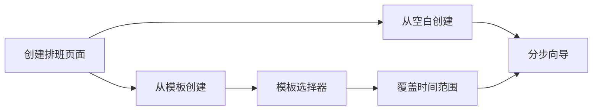
```mermaid
graph LR
    A[创建排班页面] --> B[从空白创建]
    A --> C[从模板创建]
    
    B --> D[分步向导]
    C --> E[模板选择器]
    E --> F[覆盖时间范围]
    F --> D
```

**从模板创建优势**：
- 节省配置时间（无需重新选择人员、哨位、约束）
- 保证配置一致性（相同场景使用相同配置）
- 快速应对周期性排班需求（如月度例行排班）

**分步向导流程**：

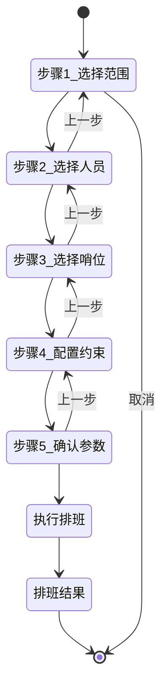
```mermaid
stateDiagram-v2
    [*] --> 步骤1_选择范围
    步骤1_选择范围 --> 步骤2_选择人员
    步骤2_选择人员 --> 步骤3_选择哨位
    步骤3_选择哨位 --> 步骤4_配置约束
    步骤4_配置约束 --> 步骤5_确认参数
    步骤5_确认参数 --> 执行排班
    执行排班 --> 排班结果
    排班结果 --> [*]
    
    步骤1_选择范围 --> [*] : 取消
    步骤2_选择人员 --> 步骤1_选择范围 : 上一步
    步骤3_选择哨位 --> 步骤2_选择人员 : 上一步
    步骤4_配置约束 --> 步骤3_选择哨位 : 上一步
    步骤5_确认参数 --> 步骤4_配置约束 : 上一步
```

**步骤详细设计**：

**步骤 1：选择时间范围**

| 字段 | 控件 | 验证 | 默认值 |
|------|------|------|--------|
| 开始日期 | CalendarDatePicker | 必填，不早于今天 | 今天 |
| 结束日期 | CalendarDatePicker | 必填，不早于开始日期 | 今天+30天 |
| 排班表名称 | TextBox | 必填，1-100字符 | "排班表_年月日" |

**步骤 2：选择参与人员**

- 左侧：全部人员列表（带搜索和筛选）
- 中间：添加/移除按钮
- 右侧：已选人员列表
- 显示每个人员的基本信息和状态
- 支持快捷选择：全选在职、全选某职位

**步骤 3：选择参与哨位**

- 布局同步骤 2
- 左侧：全部哨位列表
- 右侧：已选哨位列表
- 显示哨位的技能要求
- 支持按地点筛选

**步骤 4：配置约束**

| 约束类型 | 控件 | 说明 |
|---------|------|------|
| 休息日配置 | ComboBox | 选择已保存的配置 |
| 定岗规则 | CheckBox 列表 | 多选启用的规则 |
| 手动指定 | CheckBox 列表 | 多选启用的指定 |

**步骤 5：确认并执行**

- 汇总显示所有配置信息
- 使用 InfoBar 控件分组展示
- 提供"返回修改"、"保存为模板"和"开始排班"按钮

**保存为模板功能**：

当用户点击"保存为模板"按钮时，弹出对话框：

| 字段 | 控件 | 验证 | 说明 |
|------|------|------|------|
| 模板名称 | TextBox | 必填，1-100字符 | 如"月度常规排班" |
| 模板描述 | TextBox（多行） | 可选，最多500字符 | 模板用途说明 |
| 模板类型 | ComboBox | 必选 | 常规/节假日/特殊任务 |
| 是否设为默认 | ToggleSwitch | 布尔值 | 默认模板在创建时优先显示 |

**模板保存的内容**：
- ✓ 参与人员列表（personnelIds）
- ✓ 参与哨位列表（positionIds）
- ✓ 休息日配置（useActiveHolidayConfig / holidayConfigId）
- ✓ 定岗规则（enabledFixedRuleIds）
- ✓ 手动指定（enabledManualAssignmentIds）
- ✗ 开始日期（不保存，使用时设置）
- ✗ 结束日期（不保存，使用时设置）
- ✗ 排班表名称（不保存，使用时设置）

**执行排班过程**：

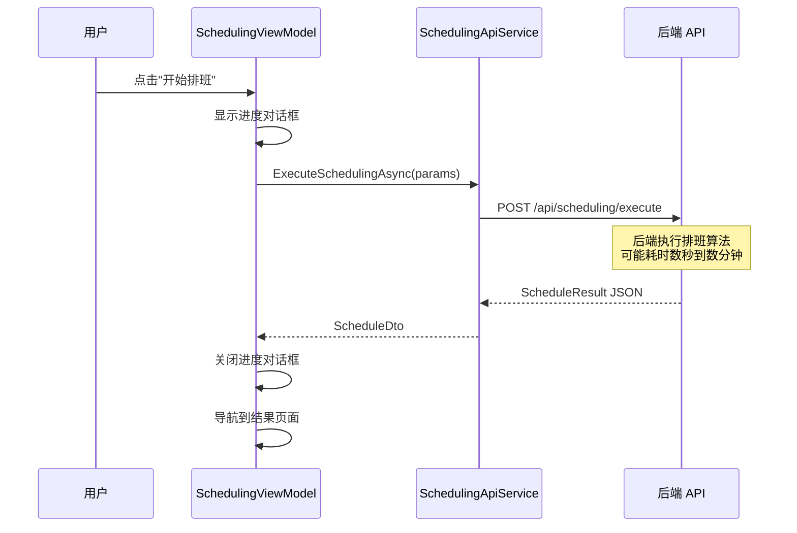
```mermaid
sequenceDiagram
    participant U as 用户
    participant V as SchedulingViewModel
    participant A as SchedulingApiService
    participant S as 后端 API
    
    U->>V: 点击"开始排班"
    V->>V: 显示进度对话框
    V->>A: ExecuteSchedulingAsync(params)
    A->>S: POST /api/scheduling/execute
    
    Note over S: 后端执行排班算法<br/>可能耗时数秒到数分钟
    
    S-->>A: ScheduleResult JSON
    A-->>V: ScheduleDto
    V->>V: 关闭进度对话框
    V->>V: 导航到结果页面
```

**进度对话框设计**：
- 使用 ProgressRing（不确定进度）
- 显示提示文本："正在生成排班，请稍候..."
- 提供"后台运行"按钮（可选）

#### 3.2.2 排班结果页面

**页面路径**：`/scheduling/result/{scheduleId}`

**布局结构**：

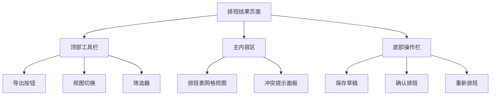
```mermaid
graph TB
    A[排班结果页面] --> B[顶部工具栏]
    A --> C[主内容区]
    A --> D[底部操作栏]
    
    B --> B1[导出按钮]
    B --> B2[视图切换]
    B --> B3[筛选器]
    
    C --> C1[排班表网格视图]
    C --> C2[冲突提示面板]
    
    D --> D1[保存草稿]
    D --> D2[确认排班]
    D --> D3[重新排班]
```

**排班表网格视图**：

**数据结构**：
- 行头：哨位列表（纵向）
- 列头：日期 + 时段（横向）
- 单元格：人员姓名 + 时段信息

**视觉设计**：

| 元素 | 样式 | 用途 |
|------|------|------|
| 表头 | 固定定位，灰色背景 | 日期时段标识 |
| 行头 | 固定定位，浅色背景 | 哨位标识 |
| 单元格 | 白色卡片，圆角边框 | 排班信息 |
| 空单元格 | 虚线边框 | 未分配提示 |
| 冲突单元格 | 红色边框，警告图标 | 约束冲突 |
| Hover 单元格 | 阴影加深 | 交互反馈 |

**单元格内容**：
- 第一行：人员姓名（粗体）
- 第二行：时段（如 08:00-16:00）
- 右上角：状态图标（正常/冲突）

**交互行为**：

| 操作 | 触发方式 | 效果 |
|------|---------|------|
| 查看详情 | 单击单元格 | 弹出详情对话框 |
| 拖拽调整 | 按住拖动单元格 | 交换两个班次 |
| 右键菜单 | 右键单元格 | 显示操作菜单 |
| 批量选择 | Ctrl+点击 | 多选单元格 |

**冲突提示面板**：
- 位置：页面右侧固定面板（可折叠）
- 内容：
  - 冲突类型标签（硬约束/软约束）
  - 冲突描述文本
  - 涉及的人员/哨位/时间
  - 建议操作按钮

**视图切换选项**：
- 网格视图（默认）
- 日历视图（按日期展开）
- 人员视图（按人员分组）
- 列表视图（纯表格）

**底部操作栏**：

| 按钮 | 图标 | 功能 | API 调用 |
|------|------|------|---------|
| 保存草稿 | 💾 | 保存到草稿箱 | POST /api/scheduling/buffer |
| 确认排班 | ✅ | 确认并移入历史 | POST /api/scheduling/confirm/{id} |
| 重新排班 | 🔄 | 返回参数配置 | 导航到创建页面 |
| 导出 | 📄 | 导出为 Excel/PDF | GET /api/scheduling/export/{id} |

#### 3.2.3 排班模板管理页面

**页面路径**：`/scheduling/templates`

**功能概述**：

排班模板是一种预定义的排班配置，包含人员、哨位和约束设置，但不包含具体的时间范围。用户可以保存常用配置为模板，在下次创建排班时只需指定新的时间范围即可。

**使用场景**：
- 周期性排班：每月例行排班，人员和哨位配置基本相同
- 常规与特殊任务：区分平日和节假日排班配置
- 团队轮换：多个团队轮流值班，每个团队使用独立模板

**布局结构**：

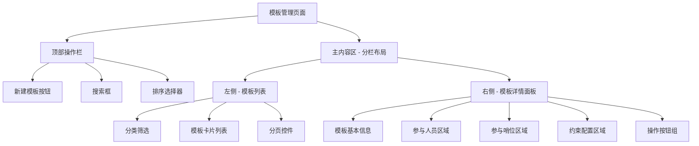
```mermaid
graph TB
    A[模板管理页面] --> B[顶部操作栏]
    A --> C[主内容区 - 分栏布局]
    
    B --> B1[新建模板按钮]
    B --> B2[搜索框]
    B --> B3[排序选择器]
    
    C --> D[左侧 - 模板列表]
    C --> E[右侧 - 模板详情面板]
    
    D --> D1[分类筛选]
    D --> D2[模板卡片列表]
    D --> D3[分页控件]
    
    E --> E1[模板基本信息]
    E --> E2[参与人员区域]
    E --> E3[参与哨位区域]
    E --> E4[约束配置区域]
    E --> E5[操作按钮组]
```

**左侧模板列表**：

| 控件类型 | 用途 | 数据绑定 | 交互行为 |
|---------|----|---------|----------|
| SegmentedControl | 分类筛选 | 全部/常规/节假日/特殊 | 点击切换分类 |
| SearchBox | 搜索模板 | 模板名称关键词 | 实时搜索 |
| ListView | 模板列表 | TemplateViewModel.Templates | 单选，点击显示详情 |
| Pagination | 分页导航 | 当前页/总页数 | 切换页面 |

**模板卡片内容结构**：
- 顶部：模板名称（粗体）
- 分类标签：Badge 显示模板类型
- 统计信息：人员数 / 哨位数 / 约束数
- 时间信息：创建时间、最后使用时间
- 状态指示：默认模板显示星标图标
- 快捷操作：使用按钮、编辑按钮、删除按钮

**右侧详情面板**：

**模板基本信息表单**：

| 字段名称 | 控件类型 | 验证规则 | 说明 |
|---------|---------|---------|------|
| 模板名称 | TextBox | 必填，1-100字符 | 模板标识 |
| 模板描述 | TextBox（多行） | 可选，最多500字符 | 用途说明 |
| 模板类型 | ComboBox | 必选 | 常规/节假日/特殊任务 |
| 是否默认 | ToggleSwitch | 布尔值 | 创建排班时默认选中 |
| 创建时间 | TextBlock（只读） | - | 系统自动记录 |
| 最后使用 | TextBlock（只读） | - | 系统自动更新 |
| 使用次数 | TextBlock（只读） | - | 统计数据 |

**参与人员区域**：
- 标题：“参与人员 (X 人)”
- 布局：左右分栏 + 中间按钮
- 左侧：全部人员列表（带搜索和筛选）
- 中间：添加/移除按钮
- 右侧：已选人员列表（支持拖动排序）
- 快捷选择：全选在职、按职位选择、清空

**参与哨位区域**：
- 标题：“参与哨位 (X 个)”
- 布局：与人员区域相同
- 左侧：全部哨位列表（按地点分组）
- 右侧：已选哨位列表
- 显示哨位的技能要求标签

**约束配置区域**：

使用 Expander 控件分组显示三类约束：

| 约束类型 | 控件 | 说明 |
|---------|------|------|
| 休息日配置 | ComboBox | 选择已保存的配置 |
| 定岗规则 | CheckBox 列表 | 多选启用的规则 |
| 手动指定 | CheckBox 列表 | 多选启用的指定（注意：需在时间范围内） |

**注意事项**：
- 手动指定约束与具体日期相关，在使用模板时仅加载在所选时间范围内的指定
- 如果模板中的人员/哨位/约束已被删除，使用时显示警告提示

**操作按钮组**：

| 按钮 | 图标 | 功能 | 启用条件 |
|------|------|------|----------|
| 使用模板 | 🚀 | 跳转到创建排班，预填配置 | 已选中模板 |
| 保存 | 💾 | 保存模板修改 | 编辑模式 |
| 取消 | ❌ | 放弃修改 | 编辑模式 |
| 复制 | 📋 | 创建副本 | 已选中模板 |
| 删除 | 🗑️ | 删除模板 | 非默认模板 |

**使用模板流程**：

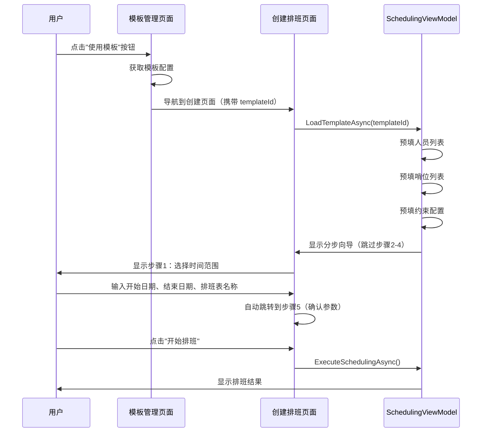
```mermaid
sequenceDiagram
    participant U as 用户
    participant T as 模板管理页面
    participant C as 创建排班页面
    participant V as SchedulingViewModel
    
    U->>T: 点击"使用模板"按钮
    T->>T: 获取模板配置
    T->>C: 导航到创建页面（携带 templateId）
    
    C->>V: LoadTemplateAsync(templateId)
    V->>V: 预填人员列表
    V->>V: 预填哨位列表
    V->>V: 预填约束配置
    V->>C: 显示分步向导（跳过步骤2-4）
    
    C->>U: 显示步骤1：选择时间范围
    U->>C: 输入开始日期、结束日期、排班表名称
    C->>C: 自动跳转到步骤5（确认参数）
    
    U->>C: 点击"开始排班"
    C->>V: ExecuteSchedulingAsync()
    V->>U: 显示排班结果
```

**模板数据结构（SchedulingTemplateDto）**：

| 字段 | 类型 | 说明 |
|------|------|------|
| id | int | 模板 ID |
| name | string | 模板名称 |
| description | string | 模板描述 |
| templateType | string | 模板类型（regular/holiday/special） |
| isDefault | boolean | 是否默认模板 |
| personnelIds | int[] | 参与人员 ID 列表 |
| positionIds | int[] | 参与哨位 ID 列表 |
| holidayConfigId | int? | 休息日配置 ID（可选） |
| useActiveHolidayConfig | boolean | 是否使用当前活动配置 |
| enabledFixedRuleIds | int[] | 启用的定岗规则 ID |
| enabledManualAssignmentIds | int[] | 启用的手动指定 ID（注：仅保存 ID，使用时按日期过滤） |
| createdAt | DateTime | 创建时间 |
| lastUsedAt | DateTime? | 最后使用时间 |
| usageCount | int | 使用次数 |

**模板验证规则**：

| 验证项 | 规则 | 错误提示 |
|---------|------|----------|
| 模板名称 | 必填，1-100字符，名称不能重复 | "模板名称已存在，请使用其他名称" |
| 参与人员 | 至少选择1人 | "必须选择至少一名人员" |
| 参与哨位 | 至少选择1个 | "必须选择至少一个哨位" |
| 默认模板 | 每种类型只能有1个默认 | "该类型已有默认模板，是否替换？" |

**UseTemplateDto 数据结构**：

| 字段 | 类型 | 必填 | 说明 |
|------|------|------|------|
| templateId | int | 是 | 模板 ID |
| startDate | DateTime | 是 | 开始日期 |
| endDate | DateTime | 是 | 结束日期 |
| title | string | 是 | 排班表名称 |
| overridePersonnelIds | int[]? | 否 | 覆盖人员列表（为空则使用模板配置） |
| overridePositionIds | int[]? | 否 | 覆盖哨位列表 |

#### 3.2.4 草稿箱页面

**页面路径**：`/scheduling/drafts`

**列表视图**：

| 列 | 宽度 | 内容 | 可排序 |
|-----|------|------|--------|
| 排班表名称 | 300px | 标题 | 是 |
| 创建时间 | 180px | 时间戳 | 是 |
| 日期范围 | 200px | 开始-结束 | 是 |
| 人员数 | 80px | 数量 | 是 |
| 哨位数 | 80px | 数量 | 是 |
| 操作 | 150px | 查看/确认/删除 | 否 |

**操作按钮**：
- 查看：导航到结果页面（只读模式）
- 确认：弹出确认对话框，调用确认 API
- 删除：弹出确认对话框，删除草稿

### 3.3 历史记录模块

#### 3.3.1 历史列表页面

**页面路径**：`/history`

**布局结构**：
- 顶部：搜索栏 + 日期范围筛选器
- 主内容：时间线视图 / 列表视图（可切换）

**时间线视图设计**：

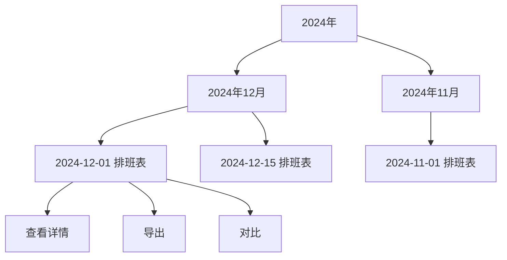
```mermaid
graph TB
    A[2024年] --> B[2024年12月]
    B --> C1[2024-12-01 排班表]
    B --> C2[2024-12-15 排班表]
    A --> D[2024年11月]
    D --> E1[2024-11-01 排班表]
    
    C1 --> F1[查看详情]
    C1 --> F2[导出]
    C1 --> F3[对比]
```

**时间线卡片内容**：
- 左侧：日期图标 + 日期文本
- 中间：排班表名称、人员数、哨位数、确认时间
- 右侧：操作按钮组

**列表视图**：
- 使用 DataGrid 控件
- 支持排序、筛选、分页
- 列设计：确认日期、排班表名称、日期范围、人员/哨位数量、操作

**筛选器选项**：

| 筛选项 | 控件类型 | 说明 |
|--------|---------|------|
| 日期范围 | DateRangePicker | 确认时间范围 |
| 关键词 | SearchBox | 搜索名称 |
| 排序方式 | ComboBox | 时间/名称 |

#### 3.3.2 历史详情页面

**页面路径**：`/history/detail/{scheduleId}`

**布局设计**：
- 顶部：排班表基本信息卡片
- 主内容：排班表网格（只读模式）
- 右侧：统计信息面板

**基本信息卡片**：

| 字段 | 显示方式 |
|------|---------|
| 排班表名称 | 大标题 |
| 日期范围 | 副标题 |
| 确认时间 | 时间戳 |
| 参与人员 | 人员标签组 |
| 参与哨位 | 哨位标签组 |

**统计信息面板**：

**统计指标**：

| 指标名称 | 计算方式 | 展示控件 |
|---------|---------|---------|
| 总班次数 | 所有单次排班数量 | 数字卡片 |
| 人均班次 | 总班次 / 人员数 | 数字卡片 |
| 休息日班次 | 节假日的班次数 | 数字卡片 |
| 各时段分布 | 12个时段的班次数 | 柱状图 |
| 人员负载 | 每人的班次数 | 横向条形图 |
| 哨位覆盖率 | 已分配/总需求 | 百分比进度条 |

**图表设计**（使用 WinUI Community Toolkit Chart 控件）：
- 时段分布：12 列柱状图，X 轴为时段，Y 轴为班次数
- 人员负载：水平条形图，X 轴为班次数，Y 轴为人员姓名

#### 3.3.3 对比页面

**页面路径**：`/history/compare`

**布局结构**：
- 顶部：选择两个排班表（ComboBox）
- 主内容：左右分栏对比视图
- 底部：差异统计汇总

**对比视图模式**：

| 模式 | 说明 | 视觉效果 |
|------|------|---------|
| 并排对比 | 左右两个网格视图 | 同步滚动 |
| 差异高亮 | 合并视图，差异单元格高亮 | 红色/绿色标记 |
| 统计对比 | 数据指标对比表 | 箭头指示增减 |

**差异类型**：

| 差异类型 | 颜色标记 | 说明 |
|---------|---------|------|
| 新增班次 | 绿色背景 | 右侧有，左侧无 |
| 删除班次 | 红色背景 | 左侧有，右侧无 |
| 人员变更 | 黄色背景 | 同位置不同人员 |
| 时间调整 | 蓝色背景 | 时段变化 |

## 四、数据流转与交互设计

### 4.1 数据流转架构

**分层数据流转**：

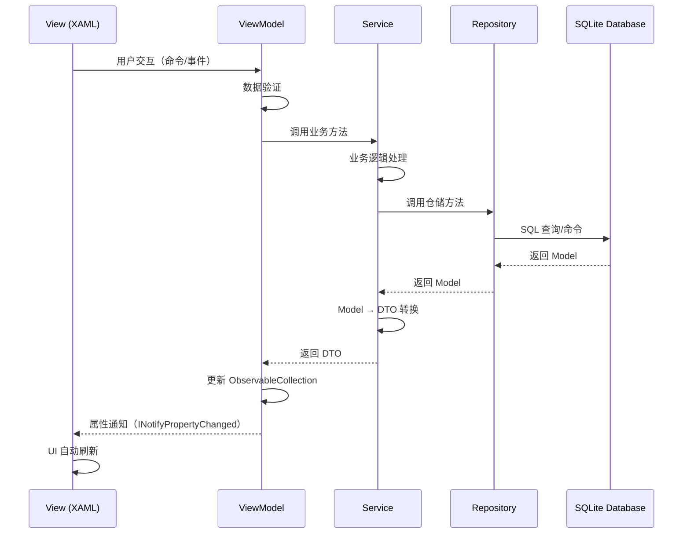
```mermaid
sequenceDiagram
    participant V as View (XAML)
    participant VM as ViewModel
    participant S as Service
    participant R as Repository
    participant DB as SQLite Database
    
    V->>VM: 用户交互（命令/事件）
    VM->>VM: 数据验证
    VM->>S: 调用业务方法
    S->>S: 业务逻辑处理
    S->>R: 调用仓储方法
    R->>DB: SQL 查询/命令
    DB-->>R: 返回 Model
    R-->>S: 返回 Model
    S->>S: Model → DTO 转换
    S-->>VM: 返回 DTO
    VM->>VM: 更新 ObservableCollection
    VM-->>V: 属性通知（INotifyPropertyChanged）
    V->>V: UI 自动刷新
```

**数据层级设计原则**：

| 层级 | 输入 | 输出 | 职责 |
|------|------|------|------|
| View | 用户操作 | UI 更新 | 显示数据，触发命令 |
| ViewModel | Command/Event | ObservableCollection | 状态管理，调用 Service |
| Service | DTO/参数 | DTO | 业务逻辑，DTO 转换 |
| Repository | Model | Model | CRUD 操作，SQL 执行 |
| Database | SQL | 原始数据 | 数据持久化 |

### 4.2 服务接口定义

#### 4.2.1 人员服务接口 (IPersonnelService)

| 方法名 | 输入参数 | 返回值 | 职责 |
|---------|----------|--------|------|
| GetAllAsync | 无 | Task<List<PersonnelDto>> | 获取所有人员 |
| GetByIdAsync | int id | Task<PersonnelDto?> | 获取指定人员 |
| CreateAsync | CreatePersonnelDto dto | Task<PersonnelDto> | 创建人员 |
| UpdateAsync | int id, UpdatePersonnelDto dto | Task | 更新人员 |
| DeleteAsync | int id | Task | 删除人员 |
| SearchAsync | string keyword | Task<List<PersonnelDto>> | 搜索人员 |

**PersonnelDto 数据结构**：

| 字段 | 类型 | 说明 |
|------|------|------|
| id | int | 人员 ID |
| name | string | 姓名 |
| positionId | int | 职位 ID |
| positionName | string | 职位名称（冗余字段） |
| skillIds | int[] | 技能 ID 列表 |
| skillNames | string[] | 技能名称列表（冗余） |
| isAvailable | boolean | 是否可用 |
| isRetired | boolean | 是否退役 |
| recentShiftIntervalCount | int | 最近班次间隔 |
| recentHolidayShiftIntervalCount | int | 节假日班次间隔 |
| recentPeriodShiftIntervals | int[12] | 时段班次间隔 |

**CreatePersonnelDto**：

| 字段 | 类型 | 必填 | 验证规则 |
|------|------|------|---------|
| name | string | 是 | 1-50字符 |
| positionId | int | 是 | 存在的职位 ID |
| skillIds | int[] | 是 | 至少一项，存在的技能 ID |
| isAvailable | boolean | 否 | 默认 true |
| recentShiftIntervalCount | int | 否 | 0-999 |
| recentHolidayShiftIntervalCount | int | 否 | 0-999 |
| recentPeriodShiftIntervals | int[12] | 否 | 每项 0-999 |

#### 4.2.2 哨位服务接口 (IPositionService)

| 方法名 | 输入参数 | 返回值 | 职责 |
|---------|----------|--------|------|
| GetAllAsync | 无 | Task<List<PositionDto>> | 获取所有哨位 |
| GetByIdAsync | int id | Task<PositionDto?> | 获取指定哨位 |
| CreateAsync | CreatePositionDto dto | Task<PositionDto> | 创建哨位 |
| UpdateAsync | int id, UpdatePositionDto dto | Task | 更新哨位 |
| DeleteAsync | int id | Task | 删除哨位 |

#### 4.2.3 技能服务接口 (ISkillService)

| 方法名 | 输入参数 | 返回值 | 职责 |
|---------|----------|--------|------|
| GetAllAsync | 无 | Task<List<SkillDto>> | 获取所有技能 |
| GetByIdAsync | int id | Task<SkillDto?> | 获取指定技能 |
| CreateAsync | CreateSkillDto dto | Task<SkillDto> | 创建技能 |
| UpdateAsync | int id, UpdateSkillDto dto | Task | 更新技能 |
| DeleteAsync | int id | Task | 删除技能 |

#### 4.2.4 约束服务接口 (IConstraintService)

**休息日配置**：

| 方法名 | 输入参数 | 返回值 | 职责 |
|---------|----------|--------|------|
| GetAllHolidayConfigsAsync | 无 | Task<List<HolidayConfigDto>> | 获取所有配置 |
| GetActiveHolidayConfigAsync | 无 | Task<HolidayConfigDto?> | 获取当前活动配置 |
| CreateHolidayConfigAsync | CreateHolidayConfigDto dto | Task<HolidayConfigDto> | 创建配置 |
| UpdateHolidayConfigAsync | int id, UpdateHolidayConfigDto dto | Task | 更新配置 |
| DeleteHolidayConfigAsync | int id | Task | 删除配置 |

**定岗规则**：

| 方法名 | 输入参数 | 返回值 | 职责 |
|---------|----------|--------|------|
| GetAllFixedRulesAsync | bool? enabledOnly | Task<List<FixedRuleDto>> | 获取所有规则 |
| CreateFixedRuleAsync | CreateFixedRuleDto dto | Task<FixedRuleDto> | 创建规则 |
| UpdateFixedRuleAsync | int id, UpdateFixedRuleDto dto | Task | 更新规则 |
| DeleteFixedRuleAsync | int id | Task | 删除规则 |

**手动指定**：

| 方法名 | 输入参数 | 返回值 | 职责 |
|---------|----------|--------|------|
| GetAllManualAssignmentsAsync | bool? enabledOnly | Task<List<ManualAssignmentDto>> | 获取所有指定 |
| GetManualAssignmentsByDateRangeAsync | DateTime start, DateTime end, bool? enabledOnly | Task<List<ManualAssignmentDto>> | 按日期范围获取 |
| CreateManualAssignmentAsync | CreateManualAssignmentDto dto | Task<ManualAssignmentDto> | 创建指定 |
| UpdateManualAssignmentAsync | int id, UpdateManualAssignmentDto dto | Task | 更新指定 |
| DeleteManualAssignmentAsync | int id | Task | 删除指定 |

#### 4.2.5 排班服务接口 (ISchedulingService)

| 方法名 | 输入参数 | 返回值 | 职责 |
|---------|----------|--------|------|
| ExecuteSchedulingAsync | SchedulingRequestDto request | Task<ScheduleDto> | 执行排班算法 |
| GetDraftsAsync | 无 | Task<List<ScheduleSummaryDto>> | 获取草稿列表 |
| GetScheduleByIdAsync | int id | Task<ScheduleDto?> | 获取排班详情 |
| ConfirmScheduleAsync | int id | Task | 确认草稿 |
| DeleteDraftAsync | int id | Task | 删除草稿 |
| GetHistoryAsync | DateTime? start, DateTime? end | Task<List<ScheduleSummaryDto>> | 获取历史记录 |
| ExportScheduleAsync | int id, ExportFormat format | Task<byte[]> | 导出排班表 |

### 4.3 数据传输对象 (DTO) 定义

#### 4.3.1 PersonnelDto 数据结构

| 字段 | 类型 | 说明 |
|------|------|------|
| id | int | 人员 ID |
| name | string | 姓名 |
| positionId | int | 职位 ID |
| positionName | string | 职位名称（冗余字段） |
| skillIds | int[] | 技能 ID 列表 |
| skillNames | string[] | 技能名称列表（冗余） |
| isAvailable | boolean | 是否可用 |
| isRetired | boolean | 是否退役 |
| recentShiftIntervalCount | int | 最近班次间隔 |
| recentHolidayShiftIntervalCount | int | 节假日班次间隔 |
| recentPeriodShiftIntervals | int[12] | 时段班次间隔 |

**CreatePersonnelDto**：

| 字段 | 类型 | 必填 | 验证规则 |
|------|------|------|----------|
| name | string | 是 | 1-50字符 |
| positionId | int | 是 | 存在的职位 ID |
| skillIds | int[] | 是 | 至少一项，存在的技能 ID |
| isAvailable | boolean | 否 | 默认 true |
| recentShiftIntervalCount | int | 否 | 0-999 |
| recentHolidayShiftIntervalCount | int | 否 | 0-999 |
| recentPeriodShiftIntervals | int[12] | 否 | 每项 0-999 |

**UpdatePersonnelDto**：与 CreatePersonnelDto 相同

#### 4.3.2 PositionDto 数据结构

| 字段 | 类型 | 说明 |
|------|------|------|
| id | int | 哨位 ID |
| name | string | 哨位名称 |
| location | string | 地点 |
| description | string | 介绍 |
| requirements | string | 要求说明 |
| requiredSkillIds | int[] | 所需技能 ID |
| requiredSkillNames | string[] | 所需技能名称（冗余） |

**CreatePositionDto / UpdatePositionDto**：

| 字段 | 类型 | 必填 | 验证规则 |
|------|------|------|----------|
| name | string | 是 | 1-100字符 |
| location | string | 是 | 1-200字符 |
| description | string | 否 | 最多500字符 |
| requirements | string | 否 | 最多1000字符 |
| requiredSkillIds | int[] | 是 | 至少一项 |

#### 4.3.3 SkillDto 数据结构

| 字段 | 类型 | 说明 |
|------|------|------|
| id | int | 技能 ID |
| name | string | 技能名称 |
| description | string | 技能描述 |

**CreateSkillDto / UpdateSkillDto**：

| 字段 | 类型 | 必填 | 验证规则 |
|------|------|------|----------|
| name | string | 是 | 1-50字符，唯一 |
| description | string | 否 | 最多200字符 |

#### 4.3.4 HolidayConfigDto 数据结构

| 字段 | 类型 | 说明 |
|------|------|------|
| id | int | 配置 ID |
| configName | string | 配置名称 |
| enableWeekendRule | boolean | 是否启用周末规则 |
| weekendDays | string[] | 周末日期（如 ["Saturday", "Sunday"]） |
| legalHolidays | DateTime[] | 法定假日 |
| customHolidays | DateTime[] | 自定义假日 |
| excludedDates | DateTime[] | 排除日期 |
| isActive | boolean | 是否启用 |

#### 4.3.5 SchedulingRequestDto 数据结构

| 字段 | 类型 | 必填 | 说明 |
|------|------|------|------|
| title | string | 是 | 排班表名称 |
| startDate | DateTime | 是 | 开始日期 |
| endDate | DateTime | 是 | 结束日期 |
| personnelIds | int[] | 是 | 参与人员 ID 列表 |
| positionIds | int[] | 是 | 参与哨位 ID 列表 |
| useActiveHolidayConfig | boolean | 否 | 是否使用活动假日配置（默认 true） |
| enabledFixedRuleIds | int[] | 否 | 启用的定岗规则 ID |
| enabledManualAssignmentIds | int[] | 否 | 启用的手动指定 ID |

#### 4.3.6 ScheduleDto 数据结构

| 字段 | 类型 | 说明 |
|------|------|------|
| id | int | 排班表 ID |
| title | string | 排班表名称 |
| personnelIds | int[] | 人员 ID 列表 |
| positionIds | int[] | 哨位 ID 列表 |
| shifts | ShiftDto[] | 单次排班列表 |
| createdAt | DateTime | 创建时间 |
| confirmedAt | DateTime? | 确认时间（草稿为 null） |

**ShiftDto 数据结构**：

| 字段 | 类型 | 说明 |
|------|------|------|
| id | int | 班次 ID |
| scheduleId | int | 所属排班表 ID |
| positionId | int | 哨位 ID |
| positionName | string | 哨位名称（冗余） |
| personnelId | int | 人员 ID |
| personnelName | string | 人员姓名（冗余） |
| startTime | DateTime | 开始时间 |
| endTime | DateTime | 结束时间 |
| periodIndex | int | 时段索引（0-11） |

**ScheduleSummaryDto 数据结构**：

| 字段 | 类型 | 说明 |
|------|------|------|
| id | int | 排班表 ID |
| title | string | 排班表名称 |
| startDate | DateTime | 开始日期 |
| endDate | DateTime | 结束日期 |
| personnelCount | int | 人员数量 |
| positionCount | int | 哨位数量 |
| shiftCount | int | 班次数量 |
| confirmedAt | DateTime? | 确认时间 |

## 五、ViewModel 设计

### 5.1 MVVM 架构模式

**架构分层**：

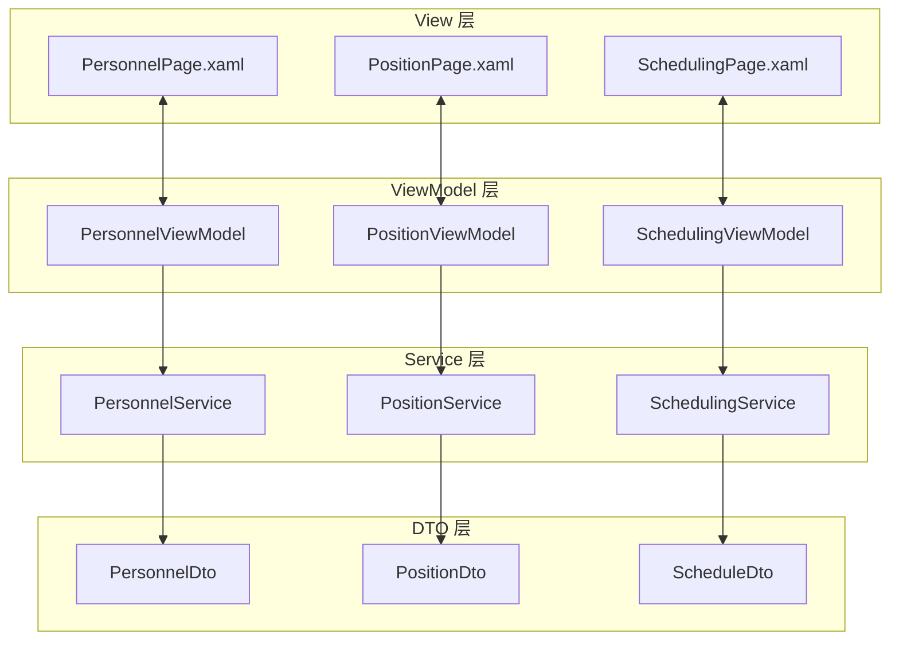
```mermaid
graph TB
    subgraph "View 层"
        V1[PersonnelPage.xaml]
        V2[PositionPage.xaml]
        V3[SchedulingPage.xaml]
    end
    
    subgraph "ViewModel 层"
        VM1[PersonnelViewModel]
        VM2[PositionViewModel]
        VM3[SchedulingViewModel]
    end
    
    subgraph "Service 层"
        S1[PersonnelService]
        S2[PositionService]
        S3[SchedulingService]
    end
    
    subgraph "DTO 层"
        M1[PersonnelDto]
        M2[PositionDto]
        M3[ScheduleDto]
    end
    
    V1 <--> VM1
    V2 <--> VM2
    V3 <--> VM3
    
    VM1 --> S1
    VM2 --> S2
    VM3 --> S3
    
    S1 --> M1
    S2 --> M2
    S3 --> M3
```

**数据流转说明**：
- View 通过数据绑定与 ViewModel 交互
- ViewModel 通过依赖注入获取 Service 实例
- Service 返回 DTO 对象给 ViewModel
- ViewModel 中使用 ObservableCollection 管理列表数据
- 通过 INotifyPropertyChanged 实现 UI 自动更新

### 5.2 核心 ViewModel 设计

#### 5.2.1 PersonnelViewModel

**职责**：
- 管理人员列表的加载、筛选、搜索
- 处理人员的增删改操作
- 验证表单输入
- 管理选中状态

**属性定义**：

| 属性名称 | 类型 | 说明 | 通知变更 |
|---------|------|------|---------|
| Personnels | ObservableCollection\<PersonnelDto\> | 人员列表 | 是 |
| FilteredPersonnels | ObservableCollection\<PersonnelDto\> | 筛选后列表 | 是 |
| SelectedPersonnel | PersonnelDto | 选中人员 | 是 |
| IsLoading | bool | 加载状态 | 是 |
| SearchKeyword | string | 搜索关键词 | 是 |
| FilterStatus | PersonnelStatus | 筛选状态 | 是 |
| AllSkills | ObservableCollection\<SkillDto\> | 所有技能 | 是 |
| AllPositions | ObservableCollection\<PositionDto\> | 所有职位 | 是 |

**命令定义**：

| 命令名称 | 参数 | 说明 | 执行条件 |
|---------|------|------|---------|
| LoadPersonnelsCommand | 无 | 加载人员列表 | 总是可用 |
| CreatePersonnelCommand | 无 | 打开创建对话框 | 总是可用 |
| SavePersonnelCommand | PersonnelDto | 保存人员（创建或更新） | 表单验证通过 |
| DeletePersonnelCommand | int | 删除人员 | 有选中项 |
| SearchCommand | string | 搜索人员 | 总是可用 |
| ApplyFilterCommand | PersonnelStatus | 应用筛选 | 总是可用 |

**关键方法逻辑**：

**LoadPersonnelsAsync**：
1. 设置 IsLoading = true
2. 调用 _personnelService.GetAllAsync()
3. 接收 PersonnelDto[] 并转换为 ObservableCollection
4. 绑定到 Personnels 属性
5. 应用筛选和搜索
6. 设置 IsLoading = false
7. 错误处理：捕获异常，显示错误对话框

**SavePersonnelAsync**：
1. 验证表单数据（姓名非空、技能至少一项等）
2. 判断是创建还是更新（Id == 0 为创建）
3. 创建：调用 _personnelService.CreateAsync(dto)
4. 更新：调用 _personnelService.UpdateAsync(id, dto)
5. 成功后刷新列表
6. 显示成功提示（InfoBar）
7. 关闭编辑对话框

**ApplyFilter**：
1. 根据 FilterStatus 筛选 Personnels
2. 应用 SearchKeyword 搜索姓名
3. 更新 FilteredPersonnels

#### 5.2.2 SchedulingViewModel

**职责**：
- 管理排班向导流程
- 收集排班参数
- 调用排班 API
- 展示排班结果

**属性定义**：

| 属性名称 | 类型 | 说明 |
|---------|------|------|
| CurrentStep | int | 当前步骤（1-5） |
| ScheduleTitle | string | 排班表名称 |
| StartDate | DateTimeOffset | 开始日期 |
| EndDate | DateTimeOffset | 结束日期 |
| AvailablePersonnels | ObservableCollection\<PersonnelDto\> | 可选人员 |
| SelectedPersonnels | ObservableCollection\<PersonnelDto\> | 已选人员 |
| AvailablePositions | ObservableCollection\<PositionDto\> | 可选哨位 |
| SelectedPositions | ObservableCollection\<PositionDto\> | 已选哨位 |
| HolidayConfigs | ObservableCollection\<HolidayConfigDto\> | 假日配置 |
| SelectedHolidayConfig | HolidayConfigDto | 选中配置 |
| FixedRules | ObservableCollection\<FixedRuleDto\> | 定岗规则 |
| EnabledFixedRules | List\<int\> | 启用规则 ID |
| ManualAssignments | ObservableCollection\<ManualAssignmentDto\> | 手动指定 |
| EnabledManualAssignments | List\<int\> | 启用指定 ID |
| IsExecuting | bool | 是否正在执行 |
| ResultSchedule | ScheduleDto | 排班结果 |

**命令定义**：

| 命令名称 | 说明 | 执行条件 |
|---------|------|---------|
| NextStepCommand | 下一步 | 当前步骤验证通过 |
| PreviousStepCommand | 上一步 | 不在第一步 |
| ExecuteSchedulingCommand | 执行排班 | 在最后一步且参数完整 |
| CancelCommand | 取消向导 | 总是可用 |

**执行排班流程**：

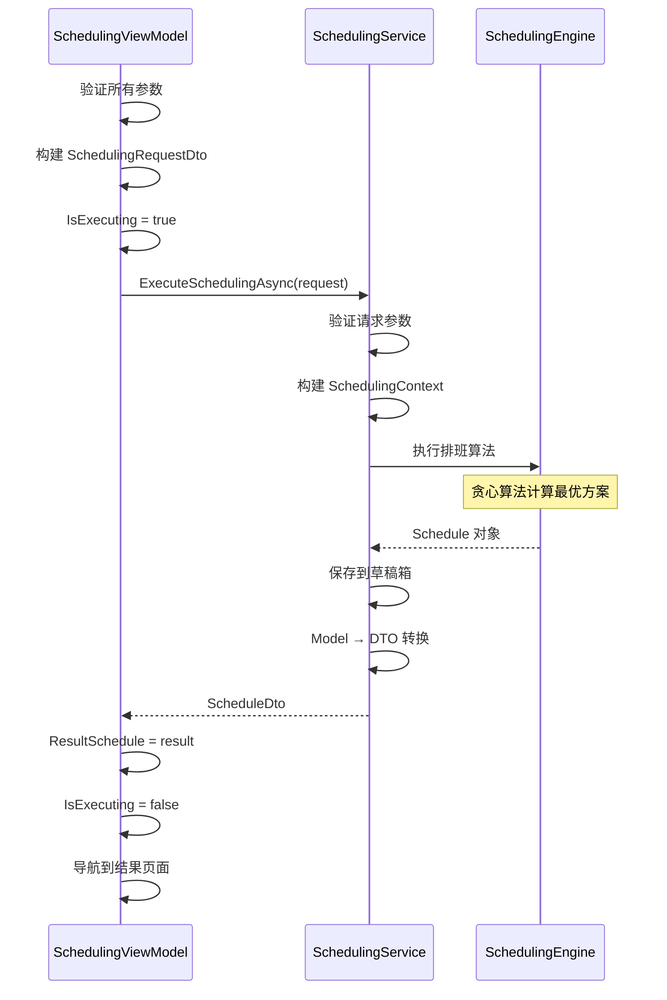
```mermaid
sequenceDiagram
    participant VM as SchedulingViewModel
    participant S as SchedulingService
    participant Engine as SchedulingEngine
    
    VM->>VM: 验证所有参数
    VM->>VM: 构建 SchedulingRequestDto
    VM->>VM: IsExecuting = true
    VM->>S: ExecuteSchedulingAsync(request)
    S->>S: 验证请求参数
    S->>S: 构建 SchedulingContext
    S->>Engine: 执行排班算法
    
    Note over Engine: 贪心算法计算最优方案
    
    Engine-->>S: Schedule 对象
    S->>S: 保存到草稿箱
    S->>S: Model → DTO 转换
    S-->>VM: ScheduleDto
    VM->>VM: ResultSchedule = result
    VM->>VM: IsExecuting = false
    VM->>VM: 导航到结果页面
```

### 5.3 共享服务设计

#### 5.3.1 NavigationService

**职责**：页面导航管理

**方法定义**：

| 方法 | 参数 | 说明 |
|------|------|------|
| NavigateTo | string pageKey | 导航到指定页面 |
| NavigateToWithParameter | string pageKey, object parameter | 带参数导航 |
| GoBack | 无 | 返回上一页 |
| CanGoBack | 无 | 是否可返回 |

#### 5.3.2 DialogService

**职责**：对话框管理

**方法定义**：

| 方法 | 参数 | 返回值 | 说明 |
|------|------|--------|------|
| ShowMessageAsync | string title, string message | Task | 显示消息对话框 |
| ShowConfirmAsync | string title, string message | Task\<bool\> | 显示确认对话框 |
| ShowErrorAsync | string message | Task | 显示错误对话框 |
| ShowProgressAsync | string message | Task\<IDisposable\> | 显示进度对话框 |

## 六、控件库与组件设计

### 6.1 自定义控件设计规范

#### 6.1.1 ScheduleGridControl（排班网格控件）

**用途**：显示排班表的网格视图

**属性**：

| 属性名称 | 类型 | 说明 |
|---------|------|------|
| Schedule | ScheduleDto | 排班数据源 |
| Positions | ObservableCollection\<PositionDto\> | 哨位列表 |
| Personnels | ObservableCollection\<PersonnelDto\> | 人员列表 |
| DateRange | DateRange | 显示的日期范围 |
| IsReadOnly | bool | 是否只读 |
| ShowConflicts | bool | 是否显示冲突 |

**视觉设计规范**：

| 元素 | 参数 | 数值 | 说明 |
|------|------|------|------|
| 单元格宽度 | Width | 120px | 固定宽度，保证内容可读 |
| 单元格高度 | Height | 64px | 容纳两行文本+间距 |
| 单元格间距 | Margin | 4px | 单元格之间的间隙 |
| 圆角 | CornerRadius | 4px | 单元格圆角 |
| 边框宽度 | BorderThickness | 1px | 正常状态边框 |
| 冲突边框 | BorderThickness | 2px | 冲突状态加粗 |
| 表头高度 | Height | 40px | 日期时段标识栏 |
| 行头宽度 | Width | 160px | 哨位名称栏 |
| 字体-主文本 | FontSize | 14px | 人员姓名 |
| 字体-次要文本 | FontSize | 12px | 时段信息 |
| 字体-表头 | FontSize / FontWeight | 13px / SemiBold | 表头标识 |

**颜色规范**：

| 状态 | 背景色（浅色） | 背景色（深色） | 边框色（浅色） | 边框色（深色） |
|------|--------------|--------------|--------------|-------------|
| 正常单元格 | #FFFFFF | #2C2C2C | #E5E5E5 | #3F3F3F |
| 空单元格 | #FAFAFA | #262626 | #E0E0E0 (虚线) | #404040 (虚线) |
| 冲突单元格 | #FFF4F4 | #3A2828 | #E81123 | #FF99A4 |
| Hover状态 | #F5F5F5 | #323232 | #D0D0D0 | #4A4A4A |
| 选中状态 | #E3F2FD | #1E3A5F | SystemAccentColor | SystemAccentColorLight1 |
| 表头 | #F3F3F3 | #202020 | #E5E5E5 | #3F3F3F |

**阴影规范**：

| 状态 | 阴影 | 说明 |
|------|------|------|
| 默认 | 0 1px 3px rgba(0,0,0,0.08) | 轻微阴影 |
| Hover | 0 2px 8px rgba(0,0,0,0.12) | 阴影加深 |
| 选中 | 0 4px 12px rgba(0,0,0,0.16) | 明显阴影 |

**交互边界规则**：

| 交互类型 | 触发条件 | 允许操作 | 冲突检测 |
|---------|---------|---------|----------|
| 单击 | 鼠标左键单击单元格 | 选中单元格，弹出详情对话框 | 无 |
| 双击 | 鼠标左键双击单元格 | 进入编辑模式 | 无 |
| 拖拽 | 按住单元格拖动到目标位置 | 交换两个班次 | 检查目标人员技能是否匹配目标哨位 |
| 右键菜单 | 鼠标右键单击单元格 | 显示操作菜单（编辑/删除/复制） | 无 |
| Ctrl+多选 | 按住Ctrl键点击多个单元格 | 批量选中 | 无 |

**拖拽冲突检测逻辑**：

1. 获取源单元格的 personnelId 和 positionId
2. 获取目标单元格的 positionId
3. 查询人员的 skillIds
4. 查询哨位的 requiredSkillIds
5. 检查 skillIds 是否包含所有 requiredSkillIds
6. 如果不匹配，显示警告对话框："人员{name}的技能不满足哨位{positionName}的要求，是否强制交换？"
7. 用户确认后执行交换，并标记为冲突单元格

**虚拟化渲染实现**：

| 参数 | 配置值 | 说明 |
|------|---------|------|
| 单次加载行数 | 20行 | 可见区域+上下各10行缓冲 |
| 单次加载列数 | 15列 | 可见区域+左右5列缓冲 |
| 滚动触发阈值 | 80% | 滚动到80%时预加载下一批 |
| 单元格复用策略 | 池化管理 | 最多保留500个单元格实例 |
| 数据更新策略 | 增量更新 | 仅重绘变更的单元格 |

**性能指标**：

| 场景 | 数据量 | 目标渲染时间 | 内存占用 |
|------|---------|------------|----------|
| 小规模 | 10人 x 7天 x 12时段 = 840单元格 | < 200ms | < 20MB |
| 中规模 | 50人 x 15天 x 12时段 = 9000单元格 | < 500ms | < 50MB |
| 大规模 | 100人 x 30天 x 12时段 = 36000单元格 | < 1500ms | < 150MB |

#### 6.1.2 PersonnelCard（人员卡片控件）

**用途**：显示人员信息卡片

**属性**：

| 属性名称 | 类型 | 说明 |
|---------|------|------|
| Personnel | PersonnelDto | 人员数据 |
| ShowActions | bool | 是否显示操作按钮 |
| IsSelected | bool | 是否选中 |

**视觉设计规范**：

| 参数 | 数值 | 说明 |
|------|------|------|
| 宽度 | 180px | 固定宽度 |
| 高度 | 120px | 固定高度 |
| 圆角 | 8px | 卡片圆角 |
| 内边距 | 12px | 内容边距 |
| 阴影（默认） | 0 2px 8px rgba(0,0,0,0.1) | 轻微阴影 |
| 阴影（Hover） | 0 4px 16px rgba(0,0,0,0.15) | 阴影加深 |
| 阴影（选中） | 0 0 0 2px SystemAccentColor | 边框高亮 |
| 动画时长 | 150ms | Hover动画时长 |
| 缓动函数 | cubic-bezier(0.4, 0.0, 0.2, 1) | Material Design缓动 |

**布局结构**：

```
┌──────────────────────┐
│ [头像]  张三         │  ← 姓名 (14px, SemiBold)
│        工程师         │  ← 职位 (12px, 次要文本)
│                      │
│ 技能: [A] [B] [C]    │  ← 技能标签 (10px)
│                      │
│ [在职] [可用]       │  ← 状态标签
│                      │
│      [编辑] [删除]  │  ← 操作按钮(可选)
└──────────────────────┘
```

**Hover动画效果**：

| 属性 | 初始值 | Hover值 | 说明 |
|------|---------|---------|------|
| TranslateY | 0px | -4px | 卡片上浮 |
| Scale | 1.0 | 1.0 | 不缩放（避免布局抽动） |
| BoxShadow | 0 2px 8px rgba(0,0,0,0.1) | 0 4px 16px rgba(0,0,0,0.15) | 阴影加深 |
| BorderColor | Transparent | SystemAccentColorLight2 | 边框微亮 |

#### 6.1.3 PositionCard（哨位卡片控件）

**视觉设计规范**：与 PersonnelCard 相同

**布局结构**：

```
┌──────────────────────┐
│ 📍 东门哨位         │  ← 哨位名称 (14px, SemiBold)
│    东门大街123号    │  ← 地点 (12px, 次要文本)
│                      │
│ 技能要求: [B] [C]    │  ← 技能标签 (10px)
│                      │
│ 描述: 重要哨位...   │  ← 描述 (11px, 省略)
│                      │
│      [编辑] [删除]  │  ← 操作按钮(可选)
└──────────────────────┘
```

### 6.2 通用组件设计规范

#### 6.2.1 LoadingIndicator（加载指示器）

**用途**：显示加载状态

**视觉规范**：

| 参数 | 数值 | 说明 |
|------|------|------|
| ProgressRing 直径 | 24px | 默认尺寸 |
| ProgressRing 颜色 | SystemAccentColor | 系统强调色 |
| 遮罩层背景 | rgba(0,0,0,0.3) 浅色 / rgba(0,0,0,0.6) 深色 | 半透明 |
| 加载文本字体 | 13px | 提示文本 |
| 加载文本颜色 | White (浅色) / White (深色) | 高对比 |
| 动画时长 | 200ms | 淡入/淡出 |

**布局规范**：

```
┌───────────────────────────────────┐
│         [遮罩层 - 全屏]              │
│                                   │
│            [● 旋转]               │  ← ProgressRing
│         正在加载中...             │  ← 提示文本
│                                   │
│                                   │
└───────────────────────────────────┘
```

#### 6.2.2 EmptyState（空状态组件）

**用途**：显示空数据提示

**视觉规范**：

| 参数 | 数值 | 说明 |
|------|------|------|
| 图标尺寸 | 64x64px | 大图标 |
| 图标颜色 | TextFillColorSecondary | 次要文本颜色 |
| 标题字体 | 16px / SemiBold | 主标题 |
| 标题颜色 | TextFillColorPrimary | 主文本颜色 |
| 描述字体 | 13px / Regular | 说明文本 |
| 描述颜色 | TextFillColorSecondary | 次要文本颜色 |
| 按钮宽度 | 120px | 操作按钮 |
| 按钮高度 | 32px | 标准高度 |
| 元素间距 | 16px | 垂直间距 |

**布局结构**：

```
┌───────────────────────────────────┐
│                                   │
│           [📄 图标 64px]            │
│                                   │
│            暂无数据                │  ← 标题 (16px)
│      您还没有添加任何人员         │  ← 描述 (13px)
│                                   │
│         [添加人员 按钮]            │  ← 操作按钮
│                                   │
└───────────────────────────────────┘
```

#### 6.2.3 ErrorState（错误状态组件）

**用途**：显示错误信息

**视觉规范**：

| 参数 | 数值 | 说明 |
|------|------|------|
| 错误图标尺寸 | 64x64px | 大图标 |
| 错误图标颜色 | #E81123 (浅色) / #FF99A4 (深色) | 错误红色 |
| 错误标题字体 | 16px / SemiBold | 主标题 |
| 错误标题颜色 | #E81123 (浅色) / #FF99A4 (深色) | 错误红色 |
| 错误描述字体 | 13px / Regular | 说明文本 |
| 错误描述颜色 | TextFillColorSecondary | 次要文本颜色 |
| 重试按钮样式 | AccentButtonStyle | 强调按钮 |
| 详情按钮样式 | DefaultButtonStyle | 默认按钮 |

**布局结构**：

```
┌───────────────────────────────────┐
│                                   │
│           [⚠️ 图标 64px]            │
│                                   │
│            加载失败                │  ← 标题 (16px, 红色)
│     数据库连接超时，请重试        │  ← 描述 (13px)
│                                   │
│      [重试] [查看详情]            │  ← 操作按钮
│                                   │
└───────────────────────────────────┘
```

### 6.3 统一状态视觉规范

**状态切换规则**：

```mermaid
stateDiagram-v2
    [*] --> 加载中: 开始加载数据
    加载中 --> 有数据: 加载成功且有数据
    加载中 --> 空状态: 加载成功但无数据
    加载中 --> 错误状态: 加载失败
    
    有数据 --> 加载中: 用户刷新
    空状态 --> 加载中: 用户添加数据后刷新
    错误状态 --> 加载中: 用户点击重试
    
    有数据 --> 空状态: 用户删除所有数据
    空状态 --> 有数据: 用户添加数据
```

**各状态视觉要素**：

| 状态 | 显示元素 | 位置 | 动画 | 用户操作 |
|------|---------|------|------|----------|
| 加载中 | LoadingIndicator | 居中全屏 | 淡入 200ms | 无，等待加载完成 |
| 有数据 | 数据列表/网格 | 满屏 | 数据项逐个淡入 | 浏览、搜索、筛选 |
| 空状态 | EmptyState组件 | 居中 | 淡入 200ms | 点击按钮添加数据 |
| 错误状态 | ErrorState组件 | 居中 | 淡入 200ms | 点击重试或查看详情 |

**InfoBar 提示规范**：

| 类型 | Severity | 图标 | 背景色（浅色） | 背景色（深色） | 使用场景 |
|------|----------|------|--------------|--------------|----------|
| 信息 | Informational | ℹ️ | #F3F9FD | #1E3A5F | 一般信息提示 |
| 成功 | Success | ✅ | #F1FAF1 | #1F3A1F | 操作成功反馈 |
| 警告 | Warning | ⚠️ | #FFF8E1 | #3A3420 | 约束冲突、数据失效 |
| 错误 | Error | ❌ | #FFF4F4 | #3A2828 | 操作失败、系统错误 |

**对话框规范**：

| 类型 | 标题 | 内容 | 按钮 | 默认按钮 | 使用场景 |
|------|------|------|------|----------|----------|
| 确认 | 确认操作 | 操作说明 | 确定/取消 | 确定 | 删除、覆盖等不可逆操作 |
| 错误 | 错误信息 | 错误详情+解决建议 | 重试/取消/查看详情 | 重试 | 数据库错误、网络错误 |
| 警告 | 警告 | 警告信息+影响说明 | 继续/取消 | 取消 | 数据冲突、操作风险提示 |
| 进度 | 正在执行 | 进度条/ProgressRing | 后台运行(可选) | - | 排班算法执行、导出文件 |

## 七、动画与过渡效果

### 6.1 自定义控件

#### 6.1.1 ScheduleGridControl（排班网格控件）

**用途**：显示排班表的网格视图

**属性**：

| 属性名称 | 类型 | 说明 |
|---------|------|------|
| Schedule | ScheduleDto | 排班数据源 |
| Positions | ObservableCollection\<PositionDto\> | 哨位列表 |
| Personnels | ObservableCollection\<PersonnelDto\> | 人员列表 |
| DateRange | DateRange | 显示的日期范围 |
| IsReadOnly | bool | 是否只读 |
| ShowConflicts | bool | 是否显示冲突 |

**事件**：

| 事件名称 | 参数 | 说明 |
|---------|------|------|
| CellClicked | ShiftDto | 单元格点击 |
| CellDoubleClicked | ShiftDto | 单元格双击 |
| ShiftDragged | DragEventArgs | 班次拖拽 |

**视觉结构**：
- 使用 Grid 布局
- 固定行头和列头
- 支持虚拟化滚动
- 单元格使用自定义 DataTemplate

#### 6.1.2 PersonnelCard（人员卡片控件）

**用途**：显示人员信息卡片

**属性**：

| 属性名称 | 类型 | 说明 |
|---------|------|------|
| Personnel | PersonnelDto | 人员数据 |
| ShowActions | bool | 是否显示操作按钮 |
| IsSelected | bool | 是否选中 |

**视觉设计**：
- 圆角卡片（CornerRadius="8"）
- Acrylic 背景
- Hover 动画（轻微上浮）
- 选中状态（边框高亮）

#### 6.1.3 PositionCard（哨位卡片控件）

**用途**：显示哨位信息卡片

**属性**：

| 属性名称 | 类型 | 说明 |
|---------|------|------|
| Position | PositionDto | 哨位数据 |
| ShowSkills | bool | 是否显示技能标签 |
| IsSelected | bool | 是否选中 |

### 6.2 通用组件

#### 6.2.1 LoadingIndicator（加载指示器）

**用途**：显示加载状态

**属性**：

| 属性名称 | 类型 | 说明 |
|---------|------|------|
| IsLoading | bool | 是否加载中 |
| Message | string | 加载提示文本 |
| Size | double | 指示器大小 |

**视觉设计**：
- 使用 ProgressRing
- 半透明遮罩层
- 居中显示
- 淡入/淡出动画

#### 6.2.2 EmptyState（空状态组件）

**用途**：显示空数据提示

**属性**：

| 属性名称 | 类型 | 说明 |
|---------|------|------|
| Icon | IconSource | 图标 |
| Title | string | 标题 |
| Message | string | 说明文本 |
| ActionText | string | 操作按钮文本 |
| ActionCommand | ICommand | 操作命令 |

**视觉设计**：
- 居中布局
- 大图标（48x48）
- 次要文本颜色
- 可选操作按钮

#### 6.2.3 ErrorState（错误状态组件）

**用途**：显示错误信息

**属性**：

| 属性名称 | 类型 | 说明 |
|---------|------|------|
| ErrorMessage | string | 错误消息 |
| ShowRetry | bool | 是否显示重试按钮 |
| RetryCommand | ICommand | 重试命令 |

## 七、动画与过渡效果

### 7.1 页面过渡动画

**导航过渡**：

| 场景 | 动画类型 | 时长 | 缓动函数 |
|------|---------|------|---------|
| 前进导航 | 从右滑入 | 300ms | CubicEase(EaseOut) |
| 后退导航 | 从左滑入 | 300ms | CubicEase(EaseOut) |
| 刷新 | 淡入淡出 | 200ms | Linear |

### 7.2 元素动画

**交互反馈**：

| 控件 | 触发事件 | 动画效果 | 说明 |
|------|---------|---------|------|
| Button | Hover | Scale(1.05) | 轻微放大 |
| Card | Hover | TranslateY(-4px) | 上浮效果 |
| Card | Hover | Shadow 加深 | 阴影增强 |
| ListItem | Click | 背景色变化 | 点击反馈 |
| Dialog | 打开 | Scale(0.9 → 1.0) + Fade(0 → 1) | 弹出动画 |
| Dialog | 关闭 | Scale(1.0 → 0.9) + Fade(1 → 0) | 收起动画 |

### 7.3 数据加载动画

**骨架屏**：
- 在数据加载时显示占位符
- 使用渐变动画模拟加载过程
- 加载完成后淡入真实内容

**列表加载**：
- 使用 ItemsRepeater 的增量加载
- 新项目从下方滑入
- 删除项目淡出

## 八、响应式布局与适配

### 8.1 窗口尺寸断点

| 断点名称 | 宽度范围 | 布局调整 |
|---------|---------|---------|
| Compact | < 640px | 单列布局，隐藏次要信息 |
| Medium | 640px - 1007px | 双列布局，保留主要功能 |
| Expanded | ≥ 1008px | 三列布局，完整功能 |

### 8.2 自适应行为

**导航面板**：
- Expanded：展开显示文本
- Medium：仅显示图标
- Compact：隐藏，使用汉堡菜单

**数据列表**：
- Expanded：网格视图（3-4列）
- Medium：网格视图（2列）
- Compact：列表视图（单列）

**详情面板**：
- Expanded：侧边固定面板
- Medium：可折叠面板
- Compact：全屏对话框

## 九、无障碍与国际化

### 9.1 无障碍设计

**键盘导航**：
- 所有交互元素支持 Tab 键导航
- 使用 AccessKey 提供快捷键
- 焦点顺序符合逻辑流程

**屏幕阅读器支持**：
- 所有图标按钮添加 AutomationProperties.Name
- 列表项提供完整描述
- 表单字段关联 Label

**对比度**：
- 文本与背景对比度 ≥ 4.5:1
- 大文本对比度 ≥ 3:1
- 焦点指示器清晰可见

### 9.2 国际化

**支持语言**：
- 简体中文（默认）
- 英语

**资源文件结构**：

| 资源键 | 简体中文 | 英语 |
|--------|---------|------|
| PersonnelPage.Title | 人员管理 | Personnel Management |
| PersonnelPage.AddButton | 新增人员 | Add Personnel |
| PersonnelPage.SearchPlaceholder | 搜索人员姓名 | Search by name |

**日期时间格式**：
- 使用用户系统的区域设置
- 日期格式：yyyy-MM-dd
- 时间格式：HH:mm:ss

## 十、性能优化策略

### 10.1 前端优化

**虚拟化列表**：
- 使用 ItemsRepeater 替代 ListView
- 启用虚拟化（VirtualizationMode="Recycling"）
- 大数据集使用增量加载

**图片优化**：
- 人员头像使用缩略图
- 延迟加载非可见图片
- 使用缓存机制

**UI 线程优化**：
- 耗时操作使用 Task.Run
- 使用 Dispatcher 更新 UI
- 避免阻塞主线程

### 10.2 API 通信优化

**请求优化**：
- 使用分页减少单次数据量
- 合并多个小请求
- 启用 HTTP/2 多路复用

**缓存策略**：

| 数据类型 | 缓存策略 | 过期时间 |
|---------|---------|---------|
| 技能列表 | 本地缓存 | 1小时 |
| 人员列表 | 内存缓存 | 5分钟 |
| 哨位列表 | 内存缓存 | 5分钟 |
| 排班结果 | 不缓存 | - |

**数据压缩**：
- 启用 Gzip/Brotli 压缩
- 响应体压缩率 > 60%

### 10.3 数据库优化

**索引策略**：
- PersonalId、PositionId、Date 建立索引
- 联合索引：(ScheduleId, Date)
- 避免过度索引

**查询优化**：
- 使用参数化查询防止 SQL 注入
- 避免 N+1 查询（一次查询获取关联数据）
- 使用 DataReader 读取大量数据
- 合理使用事务减少数据库往返

## 十一、安全性考虑

### 11.1 输入验证

**前端验证**：
- 使用 DataAnnotations 进行模型验证
- ViewModel 中验证用户输入
- 实时反馈验证错误

**业务逻辑层验证**：
- Service 层进行二次验证
- 验证业务规则（如人员可用性、技能匹配）
- 防止非法数据进入数据库

**数据访问层安全**：
- 使用参数化查询防止 SQL 注入
- 转义用户输入防止 XSS
- 限制查询结果数量防止拒绝服务

### 11.2 数据安全

**敏感数据**：
- 数据库文件加密（SQLite Encryption Extension）
- 配置文件加密存储

**日志安全**：
- 不记录敏感信息（密码、Token）
- 日志文件访问控制

## 十二、部署与配置

### 12.1 应用部署

**打包方式**：
- MSIX 打包（Microsoft Store）
- 独立安装包（Setup.exe）
- 便携版（Portable）

**配置文件**（appsettings.json）：

| 配置项 | 说明 | 示例值 |
|--------|------|--------|
| DatabasePath | 数据库路径 | ./data/scheduling.db |
| LogLevel | 日志级别 | Information |
| Theme | 默认主题 | Light/Dark/System |
| EnableAutoBackup | 自动备份 | true |
| BackupInterval | 备份间隔（天） | 7 |

### 12.2 数据库管理

**初始化**：
- 首次运行自动创建数据库表
- 执行 SQL 建表脚本
- 创建必要的索引

**版本升级**：
- 检测数据库版本
- 备份旧数据库文件
- 执行 ALTER TABLE 等升级语句
- 验证数据完整性
- 失败时自动回滚到备份

## 十三、测试策略

### 13.1 前端测试

**单元测试**：
- 测试 ViewModel 逻辑
- 测试数据验证
- 测试命令执行
- 使用 xUnit + Moq

**UI 测试**：
- 使用 WinAppDriver
- 测试页面导航
- 测试表单提交
- 测试数据绑定

### 13.2 业务逻辑测试

**Service 层测试**：
- 使用 Moq 模拟 Repository
- 测试业务规则
- 测试数据验证
- 测试异常处理

**集成测试**：
- 测试完整业务流程（创建排班、确认排班等）
- 测试数据库操作（使用内存数据库）
- 测试排班算法正确性
- 测试约束验证逻辑

### 13.3 性能测试

**UI 性能测试**：
- 测试大数据量列表渲染性能
- 测试页面导航响应时间
- 测试内存占用情况

**算法性能测试**：
- 测试不同规模排班的执行时间
- 测试内存占用
- 测试数据库查询性能

## 十四、性能与兼容性风险评估

### 14.1 性能风险评估与缓解方案

#### 14.1.1 大数据量场景性能风险

**风险场景定义**：

| 场景级别 | 人员数 | 天数 | 时段数 | 总单元格数 | 预计数据量 |
|---------|---------|------|---------|------------|------------|
| 小规模 | 10 | 7 | 12 | 840 | < 10KB |
| 中规模 | 50 | 15 | 12 | 9,000 | < 100KB |
| 大规模 | 100 | 30 | 12 | 36,000 | < 500KB |
| 超大规模 | 200 | 60 | 12 | 144,000 | < 2MB |

**性能目标**：

| 场景 | 首次渲染 | 滚动流畅度 | 单元格操作响应 | 内存占用 | CPU占用率 |
|------|---------|-----------|--------------|----------|----------|
| 小规模 | < 200ms | 60 FPS | < 50ms | < 50MB | < 10% |
| 中规模 | < 500ms | 60 FPS | < 100ms | < 150MB | < 20% |
| 大规模 | < 1500ms | 50 FPS | < 150ms | < 300MB | < 30% |
| 超大规模 | < 3000ms | 30 FPS | < 200ms | < 600MB | < 40% |

**风险点与缓解方案**：

**风险 1：ScheduleGridControl 渲染过慢**

| 风险描述 | 影响范围 | 触发条件 | 严重程度 |
|---------|---------|---------|----------|
| 超多单元格同时渲染导致 UI 冻结 | 排班结果页面 | 大规模场景 (>10000单元格) | 高 |

**缓解方案**：

| 方案 | 实施方式 | 预期效果 | 实施成本 |
|------|---------|---------|----------|
| 虚拟化滚动 | 使用 ItemsRepeater + VirtualizingLayout | 渲染时间降低 80% | 中 |
| 分页加载 | 每页显示 7 天，提供翻页控件 | 单次渲染数据量降低 75% | 低 |
| 延迟加载 | 先渲染框架，单元格内容异步填充 | 首屏时间降低 60% | 中 |
| 简化视觉 | 大规模时禁用阴影、圆角等效果 | CPU 占用降低 20% | 低 |

**实施优先级**：
1. 分页加载（必选，立即实施）
2. 虚拟化滚动（强烈推荐，第二阶段实施）
3. 简化视觉（备选方案）
4. 延迟加载（备选方案）

**风险 2：排班算法执行时间过长**

| 风险描述 | 影响范围 | 触发条件 | 严重程度 |
|---------|---------|---------|----------|
| 算法耗时过久导致用户等待不耐烦 | 创建排班页面 | 超大规模场景 (>100人) | 中 |

**缓解方案**：

| 方案 | 实施方式 | 预期效果 | 实施成本 |
|------|---------|---------|----------|
| 后台线程 | Task.Run 异步执行，不阻塞 UI | 用户体验提升 90% | 低 |
| 进度反馈 | 显示百分比进度条 | 用户焦虑降低 70% | 中 |
| 分段执行 | 每执行一部分更新进度 | 响应性提升 50% | 中 |
| 超时保护 | 设置 5 分钟超时，超时后提示用户 | 避免无限等待 | 低 |

**风险 3：内存泄漏**

| 风险描述 | 影响范围 | 触发条件 | 严重程度 |
|---------|---------|---------|----------|
| 频繁创建大规模排班导致内存不释放 | 所有页面 | 长时间使用 | 高 |

**缓解方案**：

| 方案 | 实施方式 | 预期效果 | 实施成本 |
|------|---------|---------|----------|
| 对象池 | 复用 DTO 对象和 UI 元素 | 内存分配降低 60% | 中 |
| Weak Reference | 缓存数据使用弱引用 | GC 压力降低 40% | 中 |
| 及时清理 | 页面切换时清空 ObservableCollection | 内存占用降低 50% | 低 |
| 内存监控 | 定时检测内存，超阈值提示用户 | 防止崩溃 | 低 |

#### 14.1.2 数据库性能风险

**风险 4：SQLite 并发写入锁竞争**

| 风险描述 | 影响范围 | 触发条件 | 严重程度 |
|---------|---------|---------|----------|
| 多线程同时写入导致数据库锁定 | 所有写操作 | 并发保存数据 | 中 |

**缓解方案**：

| 方案 | 实施方式 | 预期效果 | 实施成本 |
|------|---------|---------|----------|
| WAL 模式 | 启用 SQLite WAL (Write-Ahead Logging) | 并发性能提升 300% | 低 |
| 连接池 | 使用单例连接池，写操作排队 | 锁竞争降低 80% | 中 |
| 批量操作 | 将多个写入合并为一个事务 | 写入效率提升 200% | 低 |
| 重试机制 | 锁定时自动重试 3 次 | 成功率提升 95% | 低 |

**实施优先级**：
1. WAL 模式（必选）
2. 重试机制（必选）
3. 连接池（推荐）
4. 批量操作（可选）

**风险 5：查询性能下降**

| 风险描述 | 影响范围 | 触发条件 | 严重程度 |
|---------|---------|---------|----------|
| 历史数据积累导致查询变慢 | 历史记录页面 | 数据量 > 10000 条 | 中 |

**缓解方案**：

| 方案 | 实施方式 | 预期效果 | 实施成本 |
|------|---------|---------|----------|
| 索引优化 | 关键字段建立索引 (PersonalId, Date, ScheduleId) | 查询速度提升 500% | 低 |
| 分页查询 | LIMIT + OFFSET 分页加载 | 单次查询时间降低 90% | 低 |
| 数据归档 | 老旧数据移至归档表 | 主表数据量降低 80% | 中 |
| 缓存结果 | 常用查询结果缓存 5 分钟 | 重复查询耗时降低 95% | 低 |

### 14.2 兼容性风险评估与应对方案

#### 14.2.1 Windows 版本兼容性

**支持的 Windows 版本**：

| Windows 版本 | 版本号 | WinUI 3 支持 | 测试状态 | 兼容性级别 |
|---------------|---------|-------------|----------|------------|
| Windows 11 22H2 | 22621+ | 完全支持 | 已测试 | 完全兼容 |
| Windows 11 21H2 | 22000+ | 完全支持 | 已测试 | 完全兼容 |
| Windows 10 1809+ | 17763+ | 部分支持 | 未测试 | 部分兼容 |
| Windows 10 < 1809 | < 17763 | 不支持 | - | 不兼容 |

**注意事项**：

1. **Windows 10 兼容性限制**：
   - Mica 材质不可用，降级为 Acrylic
   - 部分 WinUI 3 控件样式可能异常
   - 需要安装 Windows App SDK Runtime

2. **推荐配置**：
   - 最低系统：Windows 11 21H2
   - 推荐系统：Windows 11 22H2 或更高

**风险与应对**：

| 风险 | 影响 | 检测方法 | 应对方案 |
|------|------|---------|----------|
| Mica 不可用 | 背景效果降级 | 运行时检测 Windows 版本 | 自动降级为 Acrylic 或纯色 |
| 控件样式异常 | 部分 UI 显示错误 | UI 自动化测试 | 提供 Fallback 样式 |
| Runtime 未安装 | 程序无法启动 | 启动时检测 | 弹窗引导安装 Runtime |

#### 14.2.2 硬件配置要求

**最低配置**：

| 组件 | 最低要求 | 推荐配置 | 说明 |
|------|---------|---------|------|
| CPU | Intel Core i3 / AMD Ryzen 3 | Intel Core i5 / AMD Ryzen 5 | 单核性能影响算法速度 |
| 内存 | 4GB | 8GB+ | 大规模排班需要更多内存 |
| 存储 | 500MB | 2GB | 包含程序 + 数据库 |
| 显卡 | 支持 DirectX 11 | 支持 DirectX 12 | 影响 UI 渲染效果 |
| 屏幕分辨率 | 1280x720 | 1920x1080+ | 响应式布局适配 |

**性能预期**：

| 配置级别 | CPU | 内存 | 支持场景 | 排班算法耗时 |
|---------|-----|------|---------|------------|
| 最低 | i3 | 4GB | 小规模 (10人 x 7天) | ~30秒 |
| 推荐 | i5 | 8GB | 中规模 (50人 x 15天) | ~60秒 |
| 高配 | i7 | 16GB | 大规模 (100人 x 30天) | ~120秒 |
| 发烧 | i9 | 32GB | 超大规模 (200人 x 60天) | ~300秒 |

#### 14.2.3 屏幕分辨率兼容性

**支持的分辨率范围**：

| 分辨率级别 | 分辨率 | DPI 缩放 | 布局调整 | 测试状态 |
|-----------|---------|---------|---------|----------|
| HD | 1280x720 | 100% | Compact 布局 | 已测试 |
| Full HD | 1920x1080 | 100% / 125% | Medium 布局 | 已测试 |
| 2K | 2560x1440 | 125% / 150% | Expanded 布局 | 已测试 |
| 4K | 3840x2160 | 150% / 200% | Expanded 布局 | 部分测试 |

**DPI 缩放处理**：

| 缩放级别 | 字体调整 | 图标调整 | 间距调整 | 预期效果 |
|---------|---------|---------|---------|----------|
| 100% | 无 | 无 | 无 | 标准显示 |
| 125% | +1px | 1.25x | 1.25x | 清晰可读 |
| 150% | +2px | 1.5x | 1.5x | 清晰可读 |
| 200% | +4px | 2.0x | 2.0x | 清晰可读 |

**风险与应对**：

| 风险 | 影响 | 应对方案 |
|------|------|----------|
| 高 DPI 文本模糊 | 阅读体验下降 | 使用 Vector 字体，启用 ClearType |
| 图标失真 | 视觉效果差 | 使用 SVG 或 Font Icon |
| 布局错位 | UI 显示异常 | 使用响应式布局，避免固定像素 |

#### 14.2.4 多语言兼容性

**目前支持语言**：
- 简体中文（默认）
- English（计划支持）

**潜在风险**：

| 风险 | 影响 | 应对方案 |
|------|------|----------|
| 文本截断 | UI 显示不全 | 使用 TextTrimming + ToolTip |
| 布局溢出 | 按钮重叠 | 自适应宽度或折行 |
| 日期格式 | 不同区域格式不同 | 使用 CultureInfo 自动适配 |

### 14.3 风险级别定义与监控策略

**风险级别定义**：

| 级别 | 影响范围 | 发生概率 | 处理优先级 | 响应时间 |
|------|---------|---------|-----------|----------|
| 严重 | 程序崩溃、数据丢失 | < 1% | P0 | 立即修复 |
| 高 | 功能不可用、体验严重下降 | < 5% | P1 | 1周内修复 |
| 中 | 性能下降、部分功能异常 | < 10% | P2 | 1月内修复 |
| 低 | 视觉缺陷、边缘场景问题 | < 20% | P3 | 计划中修复 |

**监控策略**：

| 监控项 | 监控方式 | 阈值 | 报警机制 |
|------|---------|------|----------|
| 内存占用 | 实时采集 | > 500MB | 记录警告日志 |
| CPU 占用 | 实时采集 | > 40% 持续 10秒 | 记录警告日志 |
| UI 响应时间 | 命令执行耗时 | > 200ms | 记录慢查询日志 |
| 数据库错误 | 异常捕获 | 任何错误 | 记录错误日志+堆栈 |
| 程序崩溃 | 未处理异常 | 任何崩溃 | 生成 Dump 文件 |
