# 排班算法设计

## 概述

本文档定义自动排班系统的核心算法设计，采用基于贪心策略的约束满足求解方式，实现岗哨人员的智能分配。系统在满足所有硬性约束的前提下，通过软性约束评分机制优化排班质量。

### 设计目标

- 满足8个硬约束条件（夜哨唯一、时段不连续、人员可用性、定岗、技能匹配、单人上哨、一人一哨、手动指定）
- 优化3个软约束得分（充分休息、时段平衡、休息日平衡）
- 支持历史数据延续和跨周期约束处理
- 提供高性能计算，支持大规模排班（多哨位×多人员×长周期）

### 算法策略

**第一阶段实现**：基于MRV启发式的贪心算法  
**未来扩展**：贪心初始解 + 遗传算法优化

## 系统架构

### 文件结构设计

**当前项目状态**：基础数据层已完成，算法层待实现。

```
AutoScheduling3/
├── Models/                          # 数据模型层 ✅已完成
│   ├── Personal.cs                 # 人员模型
│   ├── PositionLocation.cs         # 哨位模型
│   ├── Schedule.cs                 # 排班表模型
│   ├── SingleShift.cs              # 单次班次模型
│   ├── Skill.cs                    # 技能模型
│   └── Constraints/                # 📋待创建：约束配置模型
│
├── SchedulingEngine/               # 🔧待实现：算法核心层
│   ├── Core/                       # 核心组件（可行性张量、约束处理器、评分计算器）
│   ├── Constraints/                # 约束实现（8个硬约束 + 3个软约束评分器）
│   ├── Strategies/                 # MRV启发式策略
│   └── GreedyScheduler.cs         # 贪心算法主调度器
│
├── Data/                           # 数据访问层 ⚠️部分完成
│   ├── SchedulingRepository.cs    # ✅已完成
│   ├── PositionLocationRepository.cs # ✅已完成
│   └── PersonalRepository.cs      # 📋待创建
│
├── History/                        # 历史管理层 ✅已完成
│   └── HistoryManagement.cs       # 需扩展历史统计接口
│
└── Services/                       # 📋待创建：业务服务层
    └── SchedulingService.cs       # 排班服务统一入口
```

### 模块职责说明

| 模块 | 职责 | 实现状态 |
|-----|------|----------|
| Models | 核心数据结构（人员、哨位、排班表、技能） | ✅已完成，需扩展约束配置模型 |
| SchedulingEngine | 算法核心（可行性张量、约束处理、MRV策略、贪心调度器） | 🔧待实现 |
| Data | 数据持久化（SQLite访问） | ⚠️已完成2/3，需补充PersonalRepository |
| History | 历史记录和缓冲区管理 | ✅已完成，需扩展历史统计接口 |
| Services | 业务编排和对外服务接口 | 📋待创建 |

### 核心组件

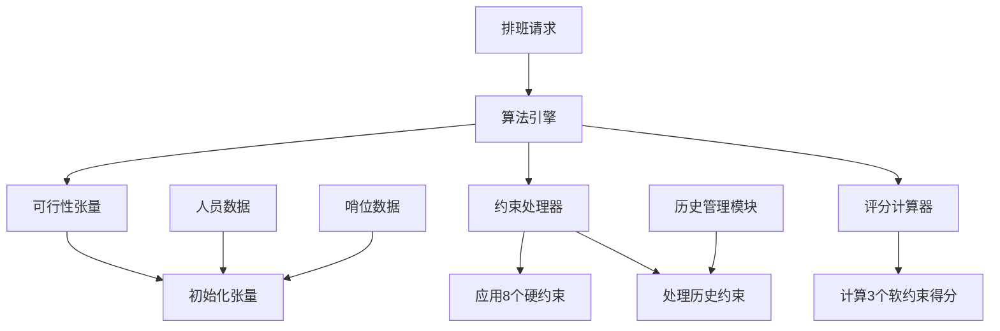

### 数据流程

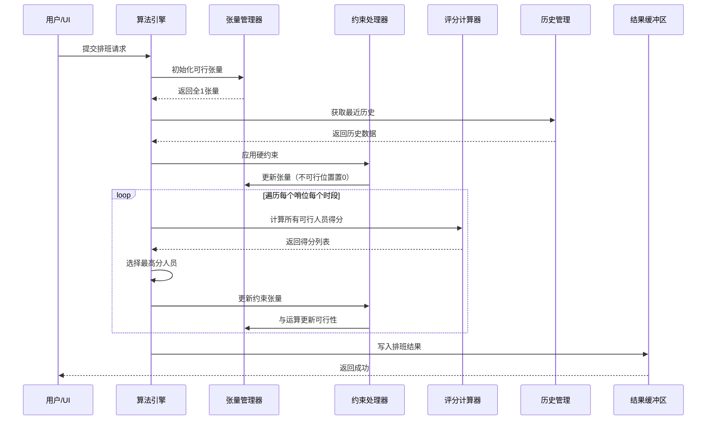

## 算法核心流程

### 输入参数

| 参数 | 类型 | 说明 |
|------|------|------|
| 待排班表 | Schedule | 人员ID集合 + 哨位ID集合 |
| 开始日期 | DateTime | 排班周期起始 |
| 结束日期 | DateTime | 排班周期结束 |
| 时段划分 | 固定 | 一天平均分12个时段，每个2小时 |
| 休息日配置 | HolidayConfig | 休息日判定规则 |

### 预处理阶段

#### 休息日判定机制设计

为了准确识别休息日并应用休息日平衡评分，系统提供灵活的休息日判定配置。

**判定策略类型：**

| 策略类型 | 说明 | 优先级 | 适用场景 |
|---------|------|--------|----------|
| 法定节假日 | 国家法定节假日（如春节、国庆等） | 高 | 必须遵守的法定休息日 |
| 周末规则 | 每周固定的休息日（如周六、周日） | 中 | 常规周末休息 |
| 自定义日期列表 | 用户手动指定的特殊休息日 | 高 | 单位特殊假期、调休日 |
| 排除日期列表 | 明确指定的工作日（用于调休场景） | 最高 | 节假日调休后的补班日 |

**HolidayConfig 配置模型：**

| 字段名 | 类型 | 说明 |
|-------|------|------|
| EnableWeekendRule | bool | 是否启用周末规则 |
| WeekendDays | List&lt;DayOfWeek&gt; | 周末日期（如 [Saturday, Sunday]） |
| LegalHolidays | List&lt;DateTime&gt; | 法定节假日日期列表 |
| CustomHolidays | List&lt;DateTime&gt; | 自定义休息日日期列表 |
| ExcludedDates | List&lt;DateTime&gt; | 排除日期（强制为工作日） |

**判定流程：**

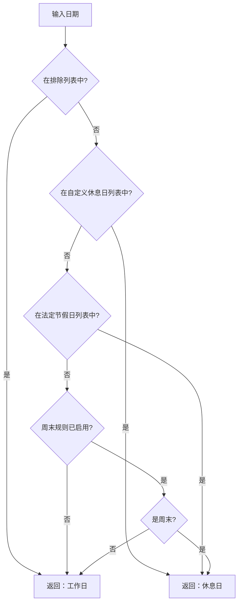

**判定优先级说明：**
1. **最高优先级**：排除日期列表（ExcludedDates）—— 强制为工作日，覆盖所有其他规则
2. **高优先级**：自定义休息日（CustomHolidays）—— 优先于周末规则
3. **高优先级**：法定节假日（LegalHolidays）—— 优先于周末规则
4. **中优先级**：周末规则（WeekendDays）—— 最后检查

**实现逻辑示例：**

```
判定函数 IsHoliday(date, config):
    // 第一优先级：检查排除列表
    如果 date 在 config.ExcludedDates 中:
        返回 false  // 强制为工作日
    
    // 第二优先级：检查自定义休息日
    如果 date 在 config.CustomHolidays 中:
        返回 true
    
    // 第三优先级：检查法定节假日
    如果 date 在 config.LegalHolidays 中:
        返回 true
    
    // 第四优先级：检查周末规则
    如果 config.EnableWeekendRule == true:
        如果 date.DayOfWeek 在 config.WeekendDays 中:
            返回 true
    
    // 默认为工作日
    返回 false
```

**配置示例场景：**

**场景1：国庆节调休**
- 法定节假日：2024-10-01 ~ 2024-10-07
- 排除日期：2024-09-29（周日）、2024-10-12（周六）—— 调休补班
- 结果：9月29日和10月12日虽然是周末，但被判定为工作日

**场景2：仅周末休息**
- EnableWeekendRule = true
- WeekendDays = [Saturday, Sunday]
- 结果：所有周六周日为休息日

**场景3：值班单位无固定休息日**
- EnableWeekendRule = false
- CustomHolidays = [2024-01-01, 2024-01-15, ...]  // 轮休日期
- 结果：仅指定日期为休息日

**软约束评分中的应用：**

在计算休息日平衡得分时，系统会：
1. 调用 `IsHoliday(当前日期, config)` 判定当前是否为休息日
2. 若为休息日，则将 `RecentHolidayShiftIntervalCount` 纳入评分计算
3. 分配后，若当前日期为休息日，将该人员的 `RecentHolidayShiftIntervalCount` 重置为0

**数据持久化建议：**

创建 `HolidayConfigs` 表存储配置：

| 字段 | 类型 | 说明 |
|-----|------|------|
| Id | int | 主键 |
| ConfigName | string | 配置名称（如"2024年休息日配置"） |
| EnableWeekendRule | bool | 是否启用周末规则 |
| WeekendDays | string (JSON) | 周末日期（JSON数组） |
| LegalHolidays | string (JSON) | 法定节假日列表 |
| CustomHolidays | string (JSON) | 自定义休息日列表 |
| ExcludedDates | string (JSON) | 排除日期列表 |
| IsActive | bool | 是否为当前启用配置 |

#### 序号分配

为提高计算效率和张量索引的一致性，系统需要为参与排班的实体分配连续序号：

| 实体类型 | 序号范围 | 映射规则 |
|---------|---------|---------|
| 哨位 | 0 ~ N-1 | N为参与排班的哨位总数，按哨位ID排序 |
| 人员 | 0 ~ M-1 | M为参与排班的人员总数，按人员ID排序 |
| 时段 | 0 ~ 11 | 固定12个时段，按时间顺序 |

维护双向映射表：
- **序号→实体ID映射表**：快速根据张量索引获取实际实体
- **实体ID→序号映射表**：快速根据实体查找张量位置

#### 可行性张量初始化

构建三维布尔张量 `FeasibilityTensor[x, y, z]`：

| 维度 | 含义 | 范围 |
|-----|------|------|
| x轴 | 哨位序号 | 0 ~ N-1 |
| y轴 | 时段序号 | 0 ~ 11 |
| z轴 | 人员序号 | 0 ~ M-1 |

**张量值语义：**
- `1`（true）：该分配方案可行
- `0`（false）：该分配方案不可行

**初始状态：** 所有元素初始化为 `1`（全部可行）

**存储优化：** 采用位压缩（Bitwise）存储，利用 MathNet.Numerics 库加速位运算。每个 z 轴切片可视为一个位图，便于快速批量操作。

### 约束处理阶段

#### 历史约束应用

从历史管理模块获取最近确认的排班记录，提取人员的以下信息：

| 历史数据项 | 数据源字段 | 用途 |
|-----------|-----------|------|
| 最近班次间隔数 | Personal.RecentShiftIntervalCount | 充分休息约束 |
| 最近节假日班次间隔数 | Personal.RecentHolidayShiftIntervalCount | 休息日平衡约束 |
| 各时段间隔数组 | Personal.RecentPeriodShiftIntervals[12] | 时段平衡约束 |
| 上期排班最后班次信息 | 历史Schedule的最后一批SingleShift | 跨周期硬约束延续 |

**处理方式：** 生成历史约束张量，与可行性张量进行逐位与（AND）运算。

**跨周期硬约束延续机制：**

历史排班的最后班次可能对新排班周期的初始时段产生硬约束影响，需要在初始化阶段处理。

**影响场景分析：**

| 硬约束类型 | 历史影响 | 处理逻辑 |
|-----------|---------|----------|
| 夜哨唯一 | 上期最后有夜哨（时段11）的人员，新周期第一天凌晨（时段0、1、2）不能上哨 | 检查历史最后一天是否有时段11分配，若有则新周期第一天时段0、1、2不可行 |
| 时段不连续 | 上期最后时段（如时段11）的人员，新周期第一个时段（时段0）不能上哨 | 检查历史最后时段分配，将相邻时段标记为不可行 |
| 充分休息（软约束影响） | 上期最后班次距离新周期开始的间隔 | 从历史数据加载RecentShiftIntervalCount |

**历史约束处理流程：**

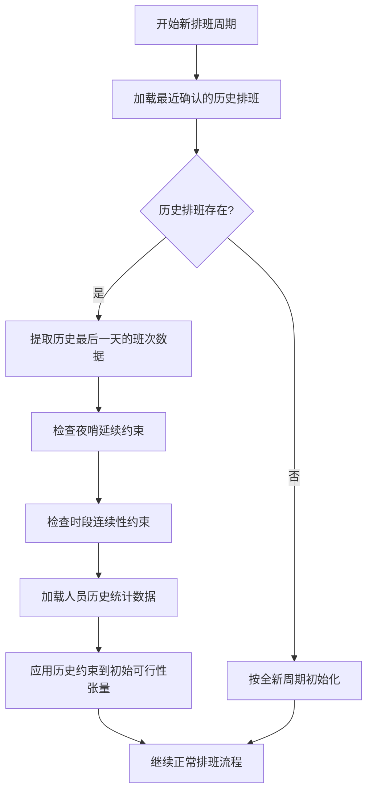

**具体实现逻辑：**

**1. 夜哨唯一的历史延续**
```
获取上期排班最后一天（假设为D日）的班次记录
对于每个人员z:
    如果该人员在D日的时段11有班次:
        // D日夜晚包括：D日时段11 + (D+1)日时段0、1、2
        // 新周期起始日期为(D+1)日
        将FeasibilityTensor[所有哨位, 时段0, z] = 0
        将FeasibilityTensor[所有哨位, 时段1, z] = 0
        将FeasibilityTensor[所有哨位, 时段2, z] = 0
```

**2. 时段不连续的历史延续**
```
获取上期排班最后一个时段（时段11）的班次记录
对于每个人员z:
    如果该人员在时段11有班次:
        // 时段11的下一个时段是时段0（跨日）
        将FeasibilityTensor[所有哨位, 时段0, z] = 0
```

**3. 历史数据加载时机**

| 时机 | 操作 | 数据来源 |
|-----|------|----------|
| 算法初始化前 | 从数据库加载人员历史统计 | Personal表的间隔计数字段 |
| 可行性张量初始化后 | 应用历史硬约束 | 最近确认Schedule的最后一天班次 |
| 每次分配后 | 更新临时统计（不写库） | 内存中的临时状态 |
| 排班确认后 | 持久化新的历史统计 | 更新Personal表 |

**历史数据示例场景：**

**场景：跨周排班**
- 上周排班：2024年1月1日-1月7日
- 新周排班：2024年1月8日-1月14日
- 历史最后一天（1月7日）情况：
  - 张三：时段11（1月7日22:00-24:00）在1号哨位
  - 李四：时段10（1月7日20:00-22:00）在2号哨位

**新周期初始化约束：**
- 张三：
  - 1月8日时段0、1、2不可行（夜哨唯一延续）
  - 1月8日时段0不可行（时段不连续延续）
- 李四：
  - 1月8日时段11不可行（时段不连续延续）

**数据持久化要求：**

为支持历史约束延续，需要确保：
1. 每次排班确认后，更新所有参与人员的历史统计数据
2. Personal表的间隔计数字段能够反映最新状态
3. 历史Schedule保留完整的班次明细，便于跨周期查询

#### 人员可用性约束

基于 `Personal.IsAvailable` 和 `Personal.IsRetired` 字段：

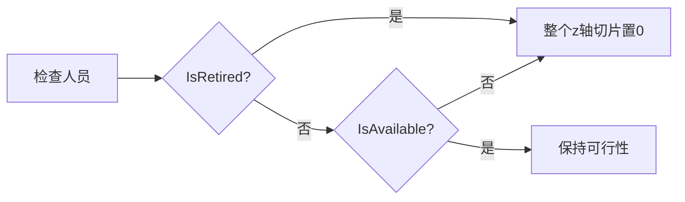

**实现：** 对不可用人员，将其对应的所有 `FeasibilityTensor[*, *, z]` 置为 `0`。

#### 硬约束张量生成

根据8个硬约束条件动态生成约束张量，每次分配后更新：

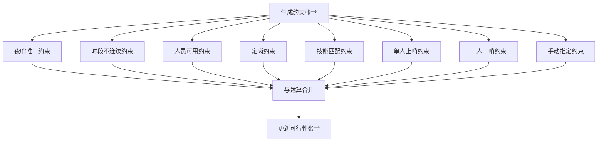

### 人员分配阶段

#### 分配顺序策略

采用**最少剩余值（Minimum Remaining Values, MRV）**启发式策略，动态选择约束最严格的哨位-时段进行分配。

**核心思想：** 优先处理候选人员最少的哨位-时段组合，减少后期陷入无解困境的风险。

**执行流程：**

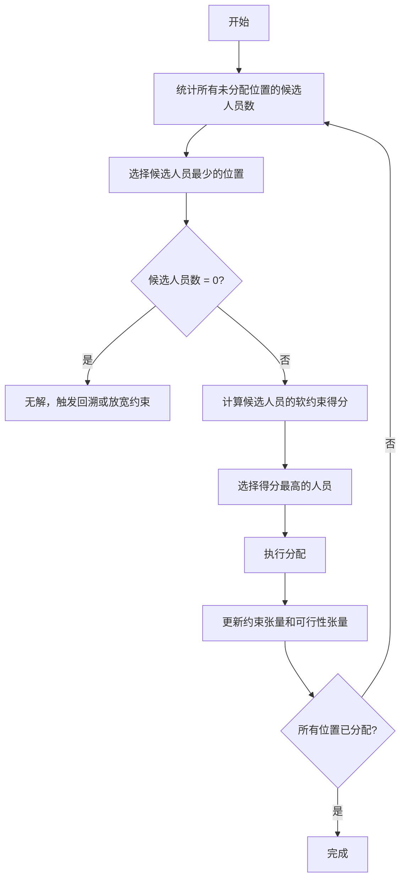

**候选人员数计算：**

对于每个未分配的 `(哨位x, 时段y)`，计算：
```
候选人员数[x, y] = Count(FeasibilityTensor[x, y, z] == 1 for all z)
```

**选择规则：**
1. 优先选择 `候选人员数` 最小且大于0的位置
2. 若多个位置候选人员数相同，采用次级排序：
   - 优先选择时段序号较小的（保证时间连续性）
   - 同时段则优先选择哨位序号较小的（保证确定性）

**伪代码逻辑：**
```
当存在未分配位置时:
    // 第1步：统计候选人员数
    对于每个未分配的 (x, y):
        候选人员数[x, y] = 统计 FeasibilityTensor[x, y, z] == 1 的数量
    
    // 第2步：选择约束最严格的位置
    (选中的x, 选中的y) = 找到候选人员数最小且 > 0 的位置
    
    // 第3步：无解检测
    如果 候选人员数[选中的x, 选中的y] == 0:
        触发无解处理流程
        退出
    
    // 第4步：评分与分配
    候选人员列表 = 获取所有 FeasibilityTensor[选中的x, 选中的y, z] == 1 的人员z
    对于每个候选人员:
        计算软约束得分
    选择得分最高的人员进行分配
    
    // 第5步：更新张量
    更新约束张量
    与运算更新可行性张量
    标记该位置为已分配
```

**策略优势：**

| 优势项 | 说明 |
|-------|------|
| 降低无解风险 | 优先处理候选少的位置，避免后期陷入困境 |
| 提升求解质量 | 关键位置优先决策，减少次优选择 |
| 早期失败检测 | 快速识别无解情况，节省计算资源 |
| 适应复杂约束 | 在人员紧张、约束严格场景下表现优异 |

**性能优化：**
- 使用增量更新机制：每次分配后只更新受影响位置的候选人员数，避免全量重新计算
- 维护优先级队列（最小堆）：快速获取候选人员数最少的位置
- 缓存候选人员数组：减少重复的张量扫描操作

#### 软约束评分机制

**评分计算策略：** 采用增量更新的缓存机制，避免重复计算。

**人员评分状态维护：**

为每个人员维护一份实时评分状态对象 `PersonScoreState`，在整个排班过程中动态更新：

| 字段名 | 类型 | 说明 | 初始值来源 |
|-------|------|------|----------|
| PersonalId | int | 人员ID | 人员数据 |
| RecentShiftInterval | int | 距离上次班次的间隔 | Personal.RecentShiftIntervalCount |
| RecentHolidayInterval | int | 距离上次休息日班次的间隔 | Personal.RecentHolidayShiftIntervalCount |
| PeriodIntervals | int[12] | 各时段的间隔数 | Personal.RecentPeriodShiftIntervals |
| LastAssignedPeriod | int | 最后分配的时段序号（-1表示未分配） | -1 |
| LastAssignedDate | DateTime? | 最后分配的日期 | null |

**评分公式：**

| 时间类型 | 评分项组成 |
|---------|-----------|
| 工作日 | 充分休息得分 + 当前时段平衡得分 |
| 休息日 | 充分休息得分 + 当前时段平衡得分 + 休息日平衡得分 |

**各评分项计算方式：**

| 评分项 | 计算方式 | 数值越大含义 |
|-------|---------|-------------|
| 充分休息得分 | PersonScoreState.RecentShiftInterval | 休息时间越长 |
| 时段平衡得分 | PersonScoreState.PeriodIntervals[当前时段] | 该时段未分配时间越长 |
| 休息日平衡得分 | PersonScoreState.RecentHolidayInterval | 未在休息日上哨时间越长 |

**增量更新机制：**

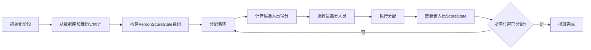

**评分计算优化：**

```
计算人员z在(日期date, 时段period)的得分:
    // 从缓存获取状态，无需重新计算
    state = PersonScoreState[z]
    
    // 计算充分休息得分
    restScore = state.RecentShiftInterval
    
    // 计算时段平衡得分
    periodScore = state.PeriodIntervals[period]
    
    // 判断是否为休息日
    isHoliday = IsHoliday(date, holidayConfig)
    
    // 计算总分
    如果 isHoliday:
        holidayScore = state.RecentHolidayInterval
        总分 = restScore + periodScore + holidayScore
    否则:
        总分 = restScore + periodScore
    
    返回 总分
```

**状态更新逻辑：**

```
当人员z被分配到(日期date, 时段period)后:
    state = PersonScoreState[z]
    
    // 1. 重置充分休息间隔
    state.RecentShiftInterval = 0
    
    // 2. 重置当前时段间隔
    state.PeriodIntervals[period] = 0
    
    // 3. 如果是休息日，重置休息日间隔
    如果 IsHoliday(date, holidayConfig):
        state.RecentHolidayInterval = 0
    
    // 4. 记录最后分配信息
    state.LastAssignedPeriod = period
    state.LastAssignedDate = date
```

**全局间隔增量：**

在处理每个新的日期或时段时，需要对所有未分配人员进行间隔增量：

```
当进入新的时段时:
    对于每个人员z:
        state = PersonScoreState[z]
        
        // 如果该人员在当前时段未被分配
        如果 当前时段未分配给z:
            // 充分休息间隔+1
            state.RecentShiftInterval += 1
            
            // 各时段间隔+1
            对于每个时段p (0到11):
                state.PeriodIntervals[p] += 1

当进入新的日期且为休息日时:
    对于每个人员z:
        state = PersonScoreState[z]
        
        // 如果该人员在当前休息日未被分配
        如果 当前日期未分配给z:
            // 休息日间隔+1
            state.RecentHolidayInterval += 1
```

**性能优化效果：**

| 优化项 | 优化前 | 优化后 | 提升 |
|-------|-------|--------|------|
| 单次评分计算 | 访问数据库或遍历历史 | 直接读取缓存 | O(n) → O(1) |
| 每轮分配耗时 | M个人员 × 数据库查询 | M个人员 × 内存读取 | 100-1000倍 |
| 内存占用 | 最小 | M × sizeof(PersonScoreState) | 约M × 64字节 |

**得分计算示例：**

假设人员张三在工作日时段5的评分：
- PersonScoreState[张三].RecentShiftInterval = 8 → 充分休息得分 = 8
- PersonScoreState[张三].PeriodIntervals[5] = 15 → 时段平衡得分 = 15
- 总分 = 8 + 15 = 23

若李四同时段评分为20，则优先选择张三。

**状态持久化：**

| 时机 | 操作 | 目的 |
|-----|------|------|
| 排班开始 | 从Personal表加载历史统计到PersonScoreState | 初始化缓存 |
| 排班过程中 | 仅在内存中更新PersonScoreState | 保持高性能 |
| 排班确认后 | 将最终PersonScoreState写回Personal表 | 持久化供下次使用 |
| 排班取消 | 丢弃内存中的PersonScoreState | 不影响原始数据 |

#### 动态约束更新

每次分配完成后，立即执行以下操作：

1. **记录分配结果：** 标记 `(哨位x, 时段y, 人员z)` 已分配
2. **重新计算约束张量：** 基于当前已分配状态，更新所有硬约束
3. **更新可行性张量：** 执行 `FeasibilityTensor &= ConstraintTensor`
4. **更新人员状态：** 临时更新该人员的间隔计数（用于后续评分）

### 结果输出阶段

所有分配完成后，系统生成 `Schedule` 对象：

| 字段 | 值来源 |
|-----|-------|
| Title | 用户输入或自动生成（如"2024年1月排班表"） |
| PersonalIds | 参与排班的人员ID列表 |
| PositionIds | 参与排班的哨位ID列表 |
| Shifts | SingleShift 对象列表，每个包含 PositionId、PersonalId、StartTime、EndTime |

**写入流程：**

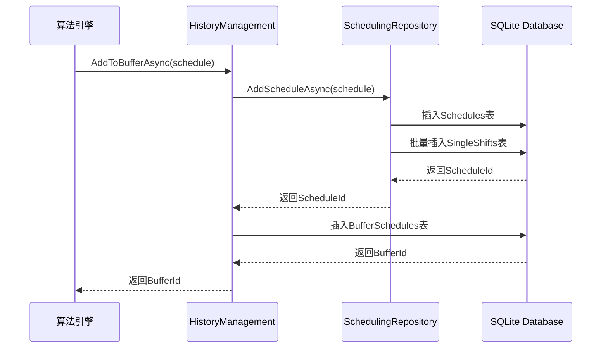

## 硬约束条件详细定义

### 1. 夜哨唯一

**约束描述：** 同一人员在同一晚上只能上一个夜哨。

**夜哨时段定义：** 时段11、0、1、2（22:00-06:00，跨日）。

**同一晚上的界定：**
- 夜哨以开始日期为准，时段11为当日夜哨，时段0、1、2为前一日夜哨的延续
- 例如：1月1日夜哨包括时段11（1月1日22:00-24:00）+ 时段0、1、2（1月2日00:00-06:00）

**检查逻辑：**
- 若人员z已在某日期的任一夜哨时段被分配（时段11、0、1、2中的任意一个）
- 则该人员在同一夜晚的其他夜哨时段不可行

**张量更新示例：**
```
情况1：若分配了时段11（如1月1日22:00-24:00）
  → 将该人员在时段0、1、2（1月2日00:00-06:00）的所有哨位置为0

情况2：若分配了时段0、1或2（如1月2日00:00-06:00的某时段）
  → 将该人员在同一夜晚的时段11（1月1日22:00-24:00）以及其他夜哨时段置为0
```

**跨日关联关系：**

| 日期 | 夜哨时段11 | 对应次日夜哨时段0、1、2 | 同一夜晚标识 |
|-----|-----------|---------------------|-------------|
| 1月1日 | 1月1日 22:00-24:00 | 1月2日 00:00-06:00 | 1月1日夜晚 |
| 1月2日 | 1月2日 22:00-24:00 | 1月3日 00:00-06:00 | 1月2日夜晚 |
| 1月3日 | 1月3日 22:00-24:00 | 1月4日 00:00-06:00 | 1月3日夜晚 |

### 2. 时段不连续

**约束描述：** 同一人员不能在相邻时段连续上哨。

**相邻定义：** 时段y和时段y+1为相邻时段（跨日则时段11和时段0相邻）。

**检查逻辑：**
- 若人员z已分配到时段y
- 则该人员在时段y-1和时段y+1不可行

**张量更新：** 将 `FeasibilityTensor[所有哨位, y-1, z]` 和 `FeasibilityTensor[所有哨位, y+1, z]` 置为 `0`

### 3. 人员可用

**约束描述：** 仅可用人员可参与排班。

**检查字段：**
- `Personal.IsAvailable == false`：不可用（生病、外出、休假等）
- `Personal.IsRetired == true`：已退役/离职

**张量更新：** 初始化阶段即将不可用人员的整个z轴切片置为 `0`

### 4. 定岗

**约束描述：** 某些人员仅能在特定哨位或特定时段上哨。

**配置方式：** 通过额外的定岗规则表存储，包含：
- 人员ID
- 限定哨位ID列表（若为空则不限制哨位）
- 限定时段列表（若为空则不限制时段）

**张量更新：**
- 若人员z限定只能在哨位集合Px上哨，则将 `FeasibilityTensor[非Px哨位, *, z]` 置为 `0`
- 若人员z限定只能在时段集合Ty上哨，则将 `FeasibilityTensor[*, 非Ty时段, z]` 置为 `0`

### 5. 技能匹配

**约束描述：** 人员必须拥有哨位所需的全部技能。

**数据来源：**
- `Personal.SkillIds`：人员拥有的技能ID列表
- `PositionLocation.Requirements`：哨位要求（需解析为技能ID列表）

**检查逻辑：**
- 若哨位x要求技能集合Sx
- 人员z拥有技能集合Sz
- 则需满足 Sx ⊆ Sz

**张量更新：** 若人员z不满足哨位x的技能要求，将 `FeasibilityTensor[x, *, z]` 置为 `0`

### 6. 单人上哨

**约束描述：** 每个哨位每个时段仅能分配一名人员。

**检查逻辑：**
- 若 `(哨位x, 时段y)` 已分配给人员z
- 则其他人员不可再分配到该位置

**张量更新：** 分配后立即将 `FeasibilityTensor[x, y, 所有其他人员]` 置为 `0`

### 7. 一人一哨

**约束描述：** 同一人员在同一时段仅能上一个哨位。

**检查逻辑：**
- 若人员z已在时段y的某哨位被分配
- 则该人员在时段y的其他哨位不可行

**张量更新：** 分配后立即将 `FeasibilityTensor[其他哨位, y, z]` 置为 `0`

### 8. 手动指定

**约束描述：** 用户预先指定某些哨位-时段-人员的固定分配。

**实现方式：**
- 初始化时优先处理手动指定分配
- 将这些分配标记为已完成
- 更新约束张量，阻止冲突分配

**张量更新：**
- 将手动指定的 `(x, y, z)` 锁定
- 应用"单人上哨"和"一人一哨"约束更新张量

## 软约束评分详细定义

### 1. 充分休息评分

**评分目标：** 让人员有足够的休息间隔，避免频繁上哨。

**数据来源：** `Personal.RecentShiftIntervalCount`

**计算方式：**
```
充分休息得分 = RecentShiftIntervalCount
```

**得分含义：** 数值越大，表示距离上次上哨时间越久，优先级越高。

**更新机制：**
- 分配后，将该人员的 `RecentShiftIntervalCount` 重置为 `0`
- 每经过一个时段未分配，该值自增 `1`

### 2. 休息日平衡评分

**评分目标：** 公平分配休息日（节假日）的班次。

**数据来源：** `Personal.RecentHolidayShiftIntervalCount`

**适用时机：** 仅在当前日期为休息日时计入。

**计算方式：**
```
休息日平衡得分 = RecentHolidayShiftIntervalCount
```

**得分含义：** 数值越大，表示距离上次在休息日上哨时间越久，应优先分配。

**更新机制：**
- 在休息日分配后，将该人员的 `RecentHolidayShiftIntervalCount` 重置为 `0`
- 每经过一个休息日未分配，该值自增 `1`

### 3. 各时段平衡评分

**评分目标：** 确保人员在各个时段的分配相对均衡。

**数据来源：** `Personal.RecentPeriodShiftIntervals[12]`

**计算方式：**
```
时段平衡得分 = RecentPeriodShiftIntervals[当前时段序号]
```

**得分含义：** 数值越大，表示该时段很久未分配给此人员，应优先分配。

**更新机制：**
- 分配到时段y后，将该人员的 `RecentPeriodShiftIntervals[y]` 重置为 `0`
- 每经过一个调度周期，所有时段计数自增 `1`

### 综合评分策略

**工作日总分：**
```
总分 = 充分休息得分 + 时段平衡得分
```

**休息日总分：**
```
总分 = 充分休息得分 + 时段平衡得分 + 休息日平衡得分
```

**冲突处理：** 若多个人员得分相同，采用以下次级排序规则：
1. 优先选择序号较小的人员（保证确定性）
2. 可扩展为随机选择（增加多样性）

## 性能优化策略

### 位运算加速

**优化目标：** 利用位压缩和位运算提升张量操作效率。

**实现方案：**
- 使用 `BitArray` 或自定义位图类存储每个 `(x, y)` 切片
- 约束更新时使用位与运算：`Feasibility[x,y] &= Constraint[x,y]`
- 查找可行人员时使用位扫描算法

**库支持：** 利用 MathNet.Numerics 的稀疏矩阵和向量化运算能力。

### 缓存机制

**缓存内容：**
- 技能匹配结果缓存：避免重复计算人员-哨位的技能检查
- 定岗规则缓存：预计算每个人员的哨位和时段限制

**缓存更新：** 初始化阶段一次性计算，排班过程中只读访问。

### 分配顺序优化实现

**增量候选人员数更新：**

维护一个二维数组 `CandidateCount[N, 12]` 存储每个位置的候选人员数。

**初始化：**
```
对于每个哨位 x (0 到 N-1):
    对于每个时段 y (0 到 11):
        CandidateCount[x, y] = Count(FeasibilityTensor[x, y, z] == 1)
```

**增量更新策略：**

当分配 `(哨位x0, 时段y0, 人员z0)` 后，仅需更新以下位置：

| 影响范围 | 更新原因 | 更新方式 |
|---------|---------|----------|
| `[x0, 所有时段]` | "一人一哨"约束：人员z0在其他时段不可用 | 若原本可行则 `CandidateCount[x0, y]--` |
| `[所有哨位, y0]` | "单人上哨"约束：时段y0已被占用 | 若原本可行则 `CandidateCount[x, y0]--` |
| `[所有哨位, y0±1]` | "时段不连续"约束：人员z0相邻时段不可用 | 若原本可行则 `CandidateCount[x, y0±1]--` |
| `[所有哨位, 夜哨时段]` | "夜哨唯一"约束：人员z0同一晚其他夜哨不可用 | 若原本可行则 `CandidateCount[x, 夜哨时段]--` |

**优先级队列维护：**

使用最小堆（Min-Heap）管理未分配位置，堆的比较规则：
1. 候选人员数小的优先
2. 候选人员数相同时，时段序号小的优先
3. 时段相同时，哨位序号小的优先

**堆操作复杂度：**
- 插入：O(log(N×12))
- 取最小值：O(1)
- 删除最小值：O(log(N×12))
- 更新元素：O(log(N×12))

**算法整体复杂度分析：**

假设 N 个哨位，M 个人员，12 个时段：
- 时间复杂度：O(N × 12 × log(N×12) × M)（堆操作 + 评分）
- 空间复杂度：O(N × 12 + M)（候选人员数数组 + 优先级队列）

**实际性能：** MRV策略通过减少无解情况和回溯次数，在约束严格场景下显著优于固定顺序遍历。

## 现有代码改进建议

### 数据模型层改进

#### 1. PositionLocation 模型扩展

**当前状态：** `Requirements` 字段为字符串类型，不便于算法处理技能匹配约束。

**改进方案：** 添加结构化的技能要求字段。

| 字段名 | 类型 | 说明 | 改进点 |
|-------|------|------|--------|
| Requirements | string | 哨位要求的文本描述 | 保留用于显示 |
| RequiredSkillIds | List&lt;int&gt; | 哨位要求的技能ID列表 | **新增**，用于算法快速匹配 |

#### 2. Skill 模型访问修饰符调整

**当前状态：** `Skill` 类使用 `internal` 访问修饰符，限制了跨程序集访问。

**改进方案：** 将访问修饰符改为 `public`，并添加数据注解。

| 改进项 | 当前 | 建议 |
|-------|------|------|
| 访问修饰符 | internal class Skill | public class Skill |
| 主键标注 | 无 | 添加 [Key] 注解到 Id 属性 |
| 注释风格 | 英文单行注释 | 改为中文 XML 文档注释 |

#### 3. Personal 模型字段语义调整

**当前状态：** `PositionId` 字段名易与哨位（PositionLocation）混淆。

**改进方案：** 根据业务语义调整字段名称。

| 字段含义 | 当前字段名 | 建议字段名 | 说明 |
|---------|-----------|-----------|------|
| 人员职位/岗位 | PositionId | JobTitleId 或 RankId | 若表示职级（如排长、班长） |
| 定岗限制 | 无 | AllowedPositionIds | **新增**，表示允许上哨的哨位ID列表 |

### 数据访问层改进

#### 4. 缺少 PersonalRepository

**当前状态：** 仅存在 `PositionLocationRepository` 和 `SchedulingRepository`，缺少人员数据访问类。

**改进方案：** 创建 `PersonalRepository.cs` 文件，提供人员数据的 CRUD 操作。

**必需功能：**

| 方法名 | 功能 | 用途 |
|-------|------|------|
| InitAsync() | 初始化 Personal 表 | 创建数据库表结构 |
| AddAsync(Personal) | 添加人员 | 插入新人员记录 |
| GetByIdAsync(int) | 根据ID查询人员 | 获取单个人员详情 |
| GetAllAsync() | 查询所有人员 | 获取全部人员列表 |
| GetByIdsAsync(List&lt;int&gt;) | 批量查询人员 | **重要**：算法需批量加载参与排班的人员 |
| UpdateAsync(Personal) | 更新人员信息 | 修改人员属性 |
| UpdateIntervalCountsAsync(int, Personal) | 更新间隔计数 | **重要**：排班后更新历史统计数据 |
| DeleteAsync(int) | 删除人员 | 移除人员记录 |

**数据库表结构注意事项：**
- `SkillIds` 和 `RecentPeriodShiftIntervals` 需使用 JSON 序列化存储
- 参考 `SchedulingRepository` 中的 JSON 处理方式

#### 5. PositionLocationRepository 扩展

**当前状态：** 缺少批量查询方法，算法需要一次性加载所有参与排班的哨位。

**改进方案：** 添加批量查询方法。

| 方法名 | 功能 | 实现方式 |
|-------|------|----------|
| GetByIdsAsync(List&lt;int&gt;) | 根据ID列表批量查询哨位 | 使用 SQL IN 子句，避免循环查询 |

### 历史管理层改进

#### 6. HistoryManagement 功能增强

**当前状态：** 仅提供历史记录的增删查功能，缺少算法所需的历史数据提取接口。

**改进方案：** 添加历史数据分析方法。

| 方法名 | 功能 | 返回值 | 用途 |
|-------|------|--------|------|
| GetRecentHistoryForPersonsAsync(List&lt;int&gt; personIds) | 获取指定人员的最近历史统计 | Dictionary&lt;int, PersonHistoryStats&gt; | **新增**：算法初始化时加载人员历史间隔数据 |
| GetLastConfirmedScheduleAsync() | 获取最近一次确认的排班表 | Schedule | **新增**：作为历史约束处理的数据源 |

**PersonHistoryStats 结构定义：**

| 字段 | 类型 | 说明 |
|-----|------|------|
| PersonalId | int | 人员ID |
| RecentShiftIntervalCount | int | 最近班次间隔数 |
| RecentHolidayShiftIntervalCount | int | 最近节假日班次间隔数 |
| RecentPeriodShiftIntervals | int[12] | 各时段间隔数 |

### 新增模型建议

#### 7. 约束配置模型

需要新增以下配置模型以支持算法运行：

**TimePeriodConfig（时段配置）：**

系统采用固定时段划分方式，将一天平均分为12个时段，每个时段2小时：

| 时段序号 | 开始时间 | 结束时间 | 时段名称 | 是否夜哨 |
|---------|---------|---------|---------|----------|
| 0 | 00:00 | 02:00 | 凌晨时段 | 是 |
| 1 | 02:00 | 04:00 | 深夜时段 | 是 |
| 2 | 04:00 | 06:00 | 黎明时段 | 是 |
| 3 | 06:00 | 08:00 | 早晨时段 | 否 |
| 4 | 08:00 | 10:00 | 上午时段1 | 否 |
| 5 | 10:00 | 12:00 | 上午时段2 | 否 |
| 6 | 12:00 | 14:00 | 中午时段 | 否 |
| 7 | 14:00 | 16:00 | 下午时段1 | 否 |
| 8 | 16:00 | 18:00 | 下午时段2 | 否 |
| 9 | 18:00 | 20:00 | 傍晚时段 | 否 |
| 10 | 20:00 | 22:00 | 晚间时段 | 否 |
| 11 | 22:00 | 24:00 | 夜间时段 | 是 |

**夜哨定义：**
- 夜哨时间范围：**晚上22:00至次日早上06:00**（共8小时）
- 对应时段序号：**11, 0, 1, 2**（共4个时段，跨日）
- 具体时段：
  - 时段11（22:00-24:00）→ 时段0（00:00-02:00）→ 时段1（02:00-04:00）→ 时段2（04:00-06:00）

**配置说明：**
- 时段序号为固定值，算法中直接使用0-11索引
- 夜哨时段用于"夜哨唯一"约束判定
- 跨日处理：时段11结束后衔接次日时段0

**FixedPositionRule（定岗规则）：**

| 字段 | 类型 | 说明 |
|-----|------|------|
| PersonalId | int | 人员ID |
| AllowedPositionIds | List&lt;int&gt; | 允许的哨位ID列表（空表示不限制） |
| AllowedPeriods | List&lt;int&gt; | 允许的时段序号列表（空表示不限制） |

**ManualAssignment（手动指定）：**

| 字段 | 类型 | 说明 |
|-----|------|------|
| PositionId | int | 哨位ID |
| PeriodIndex | int | 时段序号 |
| PersonalId | int | 指定人员ID |
| Date | DateTime | 日期 |

### 数据库表更新需求

为支持新增功能，需要在数据库初始化时创建以下表：

| 表名 | 用途 | 关联Repository |
|-----|------|---------------|
| Personal | 人员信息存储 | PersonalRepository（待创建） |
| Skills | 技能信息存储 | SkillRepository（待创建） |
| FixedPositionRules | 定岗规则存储 | ConstraintRepository（待创建） |
| ManualAssignments | 手动指定分配存储 | ConstraintRepository（待创建） |
| TimePeriodConfigs | 时段配置存储 | ConfigRepository（待创建） |

### 改进优先级

| 优先级 | 改进项 | 影响范围 |
|-------|--------|----------|
| P0（必需） | 创建 PersonalRepository | 算法无法运行 |
| P0（必需） | 添加批量查询方法 | 性能严重影响 |
| P0（必需） | 新增约束配置模型 | 算法核心功能缺失 |
| P1（重要） | PositionLocation 添加 RequiredSkillIds | 技能匹配约束无法实现 |
| P1（重要） | HistoryManagement 添加历史统计接口 | 软约束评分不准确 |
| P2（建议） | Skill 模型访问修饰符调整 | 代码规范性问题 |
| P2（建议） | Personal 字段语义调整 | 可读性和维护性 |

## 扩展性设计

### 遗传算法集成预留

**设计思路：** 贪心算法生成初始解，遗传算法进一步优化。

**接口设计：**

| 组件 | 职责 |
|-----|------|
| GreedyScheduler | 生成初始可行解 |
| GeneticOptimizer | 接收初始解，执行进化优化 |
| FitnessEvaluator | 评估排班方案的综合得分（硬约束违反 + 软约束得分） |

**遗传算法流程：**

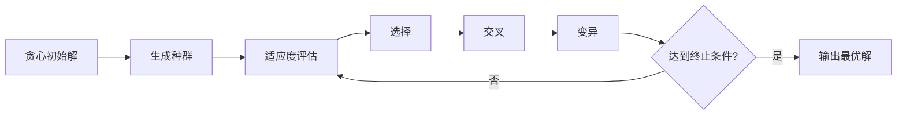

### 多目标优化支持

**扩展方向：** 支持多个软约束权重配置。

**配置示例：**

| 软约束项 | 默认权重 | 可调范围 |
|---------|---------|---------|
| 充分休息 | 1.0 | 0.5 ~ 2.0 |
| 时段平衡 | 1.0 | 0.5 ~ 2.0 |
| 休息日平衡 | 1.5 | 1.0 ~ 3.0 |

**计算公式：**
```
加权总分 = w1 × 充分休息得分 + w2 × 时段平衡得分 + w3 × 休息日平衡得分
```

## 异常处理与容错

### 无解情况处理

**检测机制：** 在分配过程中，若某个 `(哨位x, 时段y)` 的所有候选人员可行性均为 `0`，则无解。

**处理策略：**

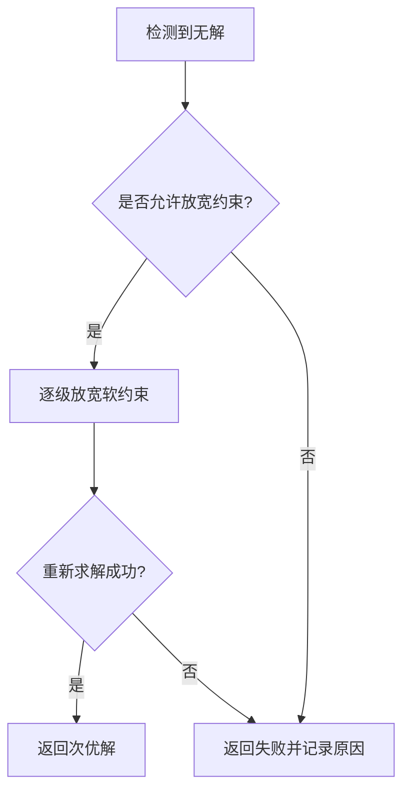

**放宽顺序：**
1. 降低软约束权重
2. 忽略部分时段平衡约束
3. 允许人工干预调整

### 数据一致性保障

**事务处理：** 写入缓冲区时使用数据库事务，确保 `Schedules` 和 `SingleShifts` 的原子性。

**回滚机制：** 若写入失败，清理中间结果，恢复可行性张量状态。

**日志记录：** 记录每次分配决策和约束更新，便于调试和审计。


