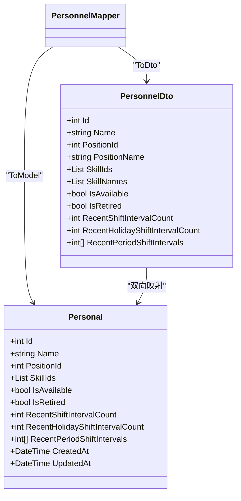
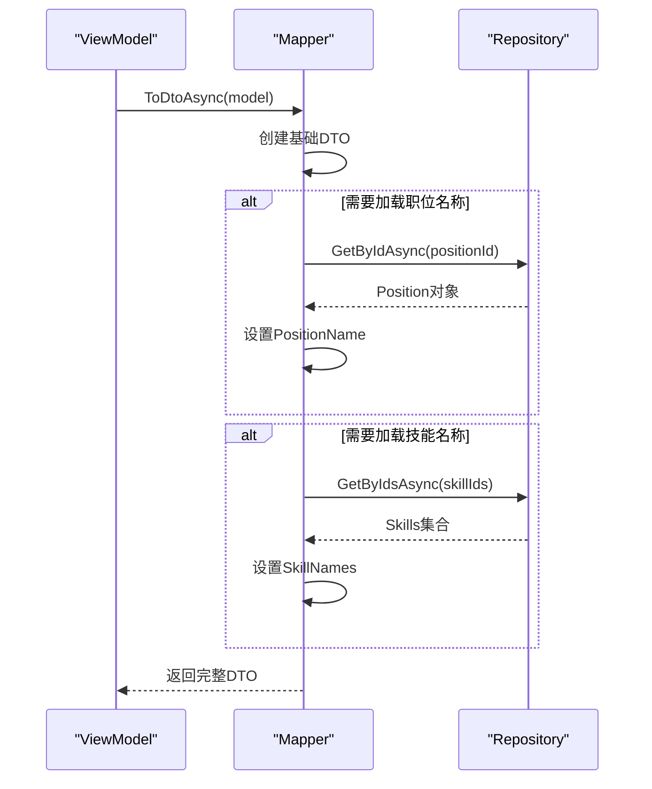
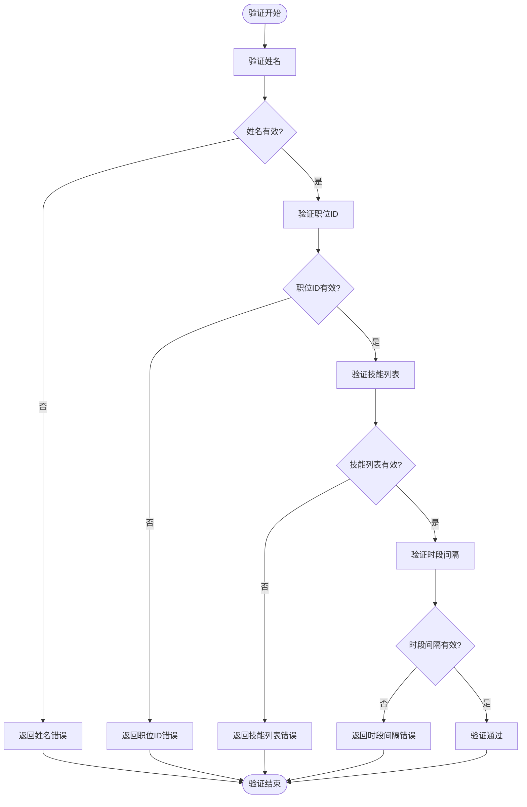

# 数据传输对象

<cite>
**本文档中引用的文件**  
- [PersonnelDto.cs](file://DTOs/PersonnelDto.cs)
- [PositionDto.cs](file://DTOs/PositionDto.cs)
- [SkillDto.cs](file://DTOs/SkillDto.cs)
- [ScheduleDto.cs](file://DTOs/ScheduleDto.cs)
- [SchedulingTemplateDto.cs](file://DTOs/SchedulingTemplateDto.cs)
- [PersonnelMapper.cs](file://DTOs/Mappers/PersonnelMapper.cs)
- [PositionMapper.cs](file://DTOs/Mappers/PositionMapper.cs)
- [SkillMapper.cs](file://DTOs/Mappers/SkillMapper.cs)
- [ScheduleMapper.cs](file://DTOs/Mappers/ScheduleMapper.cs)
- [TemplateMapper.cs](file://DTOs/Mappers/TemplateMapper.cs)
- [Personal.cs](file://Models/Personal.cs)
- [PositionLocation.cs](file://Models/PositionLocation.cs)
- [Skill.cs](file://Models/Skill.cs)
- [Schedule.cs](file://Models/Schedule.cs)
- [SchedulingTemplate.cs](file://Models/SchedulingTemplate.cs)
</cite>

## 目录
1. [引言](#引言)
2. [核心DTO结构详解](#核心dto结构详解)
   - [PersonnelDto](#personneldto)
   - [PositionDto](#positiondto)
   - [SkillDto](#skilldto)
   - [ScheduleDto](#scheduledto)
   - [SchedulingTemplateDto](#schedulingtemplatedto)
3. [DTO与Model映射关系](#dto与model映射关系)
   - [映射器类概述](#映射器类概述)
   - [字段映射规则](#字段映射规则)
   - [异步加载机制](#异步加载机制)
4. [序列化与验证机制](#序列化与验证机制)
   - [JSON序列化行为](#json序列化行为)
   - [空值处理策略](#空值处理策略)
   - [数据验证规则](#数据验证规则)
5. [API边界传输最佳实践](#api边界传输最佳实践)
   - [字段命名规范](#字段命名规范)
   - [版本兼容性处理](#版本兼容性处理)
   - [敏感数据保护措施](#敏感数据保护措施)
6. [总结](#总结)

## 引言
本文件全面文档化了自动排班系统中的数据传输对象（DTO），详细描述了`PersonnelDto`、`PositionDto`、`SkillDto`、`ScheduleDto`和`SchedulingTemplateDto`等核心DTO的结构、用途及其在系统各层间通信中的作用。文档涵盖了DTO与对应数据模型（Model）之间的映射关系、序列化行为、验证规则以及在API边界传输时的最佳实践。通过分析Mapper类中的转换逻辑，阐明了数据在不同层之间的流转机制，为系统的维护和扩展提供了清晰的技术指导。

## 核心DTO结构详解

### PersonnelDto
`PersonnelDto`用于传输人员相关数据，包含人员基本信息、职位关联、技能列表及排班状态统计。该DTO在人员管理、排班计算和前端展示中广泛使用。

**字段定义与业务含义：**
- `id`：人员唯一标识符，整型，对应数据库主键
- `name`：姓名，字符串类型，长度限制1-50字符，必填项
- `positionId`：职位ID，整型，必须大于0，用于关联`PositionLocation`
- `positionName`：职位名称，冗余字段，便于前端直接显示，无需额外查询
- `skillIds`：技能ID列表，整型集合，表示该人员具备的技能
- `skillNames`：技能名称列表，冗余字段，用于前端展示
- `isAvailable`：是否可用，布尔值，表示人员当前是否可参与排班
- `isRetired`：是否已退役，布尔值，表示人员是否已离职
- `recentShiftIntervalCount`：最近班次间隔计数，整型，范围0-999，用于排班算法中的公平性考量
- `recentHolidayShiftIntervalCount`：最近节假日班次间隔计数，整型，范围0-999
- `recentPeriodShiftIntervals`：各时段班次间隔计数数组，固定长度12，对应12个时段的排班间隔
- `isActive`：计算属性，表示人员是否在职且可用（`IsAvailable && !IsRetired`）

**Section sources**
- [PersonnelDto.cs](file://DTOs/PersonnelDto.cs#L9-L88)

### PositionDto
`PositionDto`用于传输哨位/职位相关数据，包含哨位基本信息、地理位置、要求说明及所需技能。

**字段定义与业务含义：**
- `id`：哨位ID，整型，对应数据库主键
- `name`：哨位名称，字符串类型，长度限制1-100字符，必填项
- `location`：地点，字符串类型，长度限制1-200字符，必填项
- `description`：介绍，可选字符串，长度不超过500字符
- `requirements`：要求说明，可选字符串，长度不超过1000字符
- `requiredSkillIds`：所需技能ID列表，整型集合，用于算法匹配
- `requiredSkillNames`：所需技能名称列表，冗余字段，便于前端显示

**Section sources**
- [PositionDto.cs](file://DTOs/PositionDto.cs#L9-L59)

### SkillDto
`SkillDto`用于传输技能相关数据，包含技能基本信息、状态和时间戳。

**字段定义与业务含义：**
- `id`：技能ID，整型，对应数据库主键
- `name`：技能名称，字符串类型，长度限制1-50字符，必填项
- `description`：技能描述，可选字符串，长度不超过200字符
- `isActive`：是否激活，布尔值，表示技能是否可用
- `createdAt`：创建时间，日期时间类型，记录技能创建时间
- `updatedAt`：更新时间，日期时间类型，记录技能最后更新时间

**Section sources**
- [SkillDto.cs](file://DTOs/SkillDto.cs#L9-L49)

### ScheduleDto
`ScheduleDto`用于传输排班表完整数据，包含排班基本信息、参与人员与哨位、具体班次安排及冲突信息。

**字段定义与业务含义：**
- `id`：排班表ID，整型，对应数据库主键
- `title`：排班表名称，字符串类型，长度限制1-100字符，必填项
- `personnelIds`：参与人员ID列表，整型集合，至少包含一名人员
- `positionIds`：参与哨位ID列表，整型集合，至少包含一个哨位
- `shifts`：单次排班列表，`ShiftDto`集合，包含具体的排班安排
- `conflicts`：冲突/约束提示集合，`ConflictDto`集合，用于前端展示排班冲突
- `createdAt`：创建时间，日期时间类型，必填项
- `confirmedAt`：确认时间，可空日期时间类型，草稿状态为null
- `startDate`：开始日期，日期时间类型，必填项
- `endDate`：结束日期，日期时间类型，必填项

**Section sources**
- [ScheduleDto.cs](file://DTOs/ScheduleDto.cs#L10-L81)

### SchedulingTemplateDto
`SchedulingTemplateDto`用于传输排班模板数据，支持模板化排班配置的保存与复用。

**字段定义与业务含义：**
- `id`：模板ID，整型，对应数据库主键
- `name`：模板名称，字符串类型，长度限制1-100字符，必填项
- `description`：模板描述，可选字符串，长度不超过500字符
- `templateType`：模板类型，字符串类型，枚举值`regular`、`holiday`或`special`，必填项
- `isDefault`：是否为默认模板，布尔值
- `personnelIds`：参与人员ID列表，整型集合，至少包含一名人员
- `positionIds`：参与哨位ID列表，整型集合，至少包含一个哨位
- `holidayConfigId`：休息日配置ID，可空整型，可选
- `useActiveHolidayConfig`：是否使用当前活动配置，布尔值
- `enabledFixedRuleIds`：启用的定岗规则ID，整型集合
- `enabledManualAssignmentIds`：启用的手动指定ID，整型集合
- `createdAt`：创建时间，日期时间类型，必填项
- `lastUsedAt`：最后使用时间，可空日期时间类型
- `usageCount`：使用次数，整型，非负数

**Section sources**
- [SchedulingTemplateDto.cs](file://DTOs/SchedulingTemplateDto.cs#L10-L106)

## DTO与Model映射关系

### 映射器类概述
系统通过专用的Mapper类实现DTO与Model之间的双向转换，确保数据在不同层之间安全、准确地流转。每个Mapper类负责特定实体的转换逻辑，并处理必要的数据验证和业务规则。

**核心Mapper类：**
- `PersonnelMapper`：处理`Personal`模型与`PersonnelDto`之间的转换
- `PositionMapper`：处理`PositionLocation`模型与`PositionDto`之间的转换
- `SkillMapper`：处理`Skill`模型与`SkillDto`之间的转换
- `ScheduleMapper`：处理`Schedule`模型与`ScheduleDto`之间的转换
- `TemplateMapper`：处理`SchedulingTemplate`模型与`SchedulingTemplateDto`之间的转换

这些Mapper类遵循统一的设计模式，提供同步和异步版本的转换方法，以适应不同的使用场景。

**Section sources**
- [PersonnelMapper.cs](file://DTOs/Mappers/PersonnelMapper.cs#L14-L203)
- [PositionMapper.cs](file://DTOs/Mappers/PositionMapper.cs#L14-L177)
- [SkillMapper.cs](file://DTOs/Mappers/SkillMapper.cs#L12-L127)
- [ScheduleMapper.cs](file://DTOs/Mappers/ScheduleMapper.cs#L14-L422)
- [TemplateMapper.cs](file://DTOs/Mappers/TemplateMapper.cs#L11-L100)

### 字段映射规则
DTO与Model之间的字段映射遵循严格的对应关系，确保数据的一致性和完整性。Mapper类中的转换方法详细定义了每个字段的映射逻辑。

**映射示例：**

**Diagram sources**
- [PersonnelDto.cs](file://DTOs/PersonnelDto.cs#L9-L88)
- [Personal.cs](file://Models/Personal.cs#L15-L80)
- [PersonnelMapper.cs](file://DTOs/Mappers/PersonnelMapper.cs#L28-L47)

### 异步加载机制
对于包含冗余显示字段（如`PositionName`、`SkillNames`）的DTO，系统采用异步加载机制来提高性能。Mapper类提供同步和异步两个版本的转换方法，允许在需要时才加载关联名称。

**异步加载流程：**

**Diagram sources**
- [PersonnelMapper.cs](file://DTOs/Mappers/PersonnelMapper.cs#L49-L78)
- [PositionMapper.cs](file://DTOs/Mappers/PositionMapper.cs#L43-L62)

## 序列化与验证机制

### JSON序列化行为
所有DTO均使用`System.Text.Json.Serialization`进行JSON序列化，通过`[JsonPropertyName]`属性精确控制序列化后的字段名称，确保与API契约一致。

**序列化特性：**
- 使用`JsonPropertyName`指定JSON字段名，实现C#命名与JSON命名的转换
- 支持可空类型（如`DateTime?`）的序列化
- 数组和集合类型自动序列化为JSON数组
- 计算属性（如`IsActive`）默认包含在序列化输出中

**Section sources**
- [PersonnelDto.cs](file://DTOs/PersonnelDto.cs#L9-L88)
- [ScheduleDto.cs](file://DTOs/ScheduleDto.cs#L10-L81)

### 空值处理策略
系统采用明确的空值处理策略，确保数据的完整性和一致性。

**空值处理规则：**
- 字符串字段使用`string.Empty`而非`null`作为默认值
- 集合类型（`List<T>`）初始化为空集合而非`null`
- 数组类型（`int[]`）初始化为固定长度的零值数组
- 可空值类型（如`DateTime?`）用于表示可选的时间字段
- 冗余显示字段在同步转换时初始化为空值，由异步方法填充

**Section sources**
- [PersonnelDto.cs](file://DTOs/PersonnelDto.cs#L9-L88)
- [PositionDto.cs](file://DTOs/PositionDto.cs#L9-L59)

### 数据验证规则
DTO通过数据注解（Data Annotations）实现声明式验证，确保传输数据的合法性。

**验证规则示例：**

**Diagram sources**
- [PersonnelDto.cs](file://DTOs/PersonnelDto.cs#L9-L88)
- [ScheduleMapper.cs](file://DTOs/Mappers/ScheduleMapper.cs#L378-L422)

## API边界传输最佳实践

### 字段命名规范
DTO字段命名遵循统一的规范，确保API的一致性和可读性。

**命名规范：**
- 使用小写驼峰命名法（lowerCamelCase）作为JSON字段名
- 通过`[JsonPropertyName]`属性显式指定序列化名称
- 避免使用C#关键字作为字段名
- 布尔字段使用`is`前缀（如`isAvailable`）
- ID字段统一使用`Id`后缀
- 时间字段明确区分`startTime`、`endTime`、`createdAt`等

**Section sources**
- [PersonnelDto.cs](file://DTOs/PersonnelDto.cs#L9-L88)
- [PositionDto.cs](file://DTOs/PositionDto.cs#L9-L59)

### 版本兼容性处理
系统通过多种机制确保DTO的版本兼容性，支持平滑的API演进。

**兼容性策略：**
- 新增字段采用可空类型或提供默认值
- 避免删除现有字段，标记为`[Obsolete]`并逐步弃用
- 使用`[JsonExtensionData]`捕获未知字段，实现向后兼容
- 通过`templateType`等枚举字段的正则表达式验证，支持未来值的扩展
- 提供详细的错误消息，帮助客户端理解验证失败原因

**Section sources**
- [SchedulingTemplateDto.cs](file://DTOs/SchedulingTemplateDto.cs#L10-L106)
- [ScheduleDto.cs](file://DTOs/ScheduleDto.cs#L10-L81)

### 敏感数据保护措施
系统实施严格的数据保护措施，防止敏感信息的意外泄露。

**保护措施：**
- DTO仅包含必要的业务数据，不暴露数据库内部结构
- 敏感字段（如密码）不在DTO中传输
- 使用`IsActive`等计算属性替代直接暴露内部状态
- 通过`Required`、`StringLength`等验证属性防止数据注入
- 在Mapper层进行数据清理和转换，确保输出安全
- 冗余显示字段在需要时才通过异步加载，减少不必要的数据传输

**Section sources**
- [PersonnelDto.cs](file://DTOs/PersonnelDto.cs#L9-L88)
- [PersonnelMapper.cs](file://DTOs/Mappers/PersonnelMapper.cs#L28-L47)

## 总结
本文档全面阐述了自动排班系统中数据传输对象的设计与实现。通过详细的DTO结构描述、Mapper类的映射逻辑分析、序列化与验证机制说明以及API最佳实践建议，为系统的开发和维护提供了完整的参考。DTO模式的使用有效隔离了不同层之间的耦合，确保了数据在传输过程中的安全性和一致性。异步加载机制和冗余字段的设计优化了性能，而严格的验证规则和保护措施保障了系统的健壮性。这些设计决策共同构成了一个高效、可靠且易于维护的自动排班系统架构。