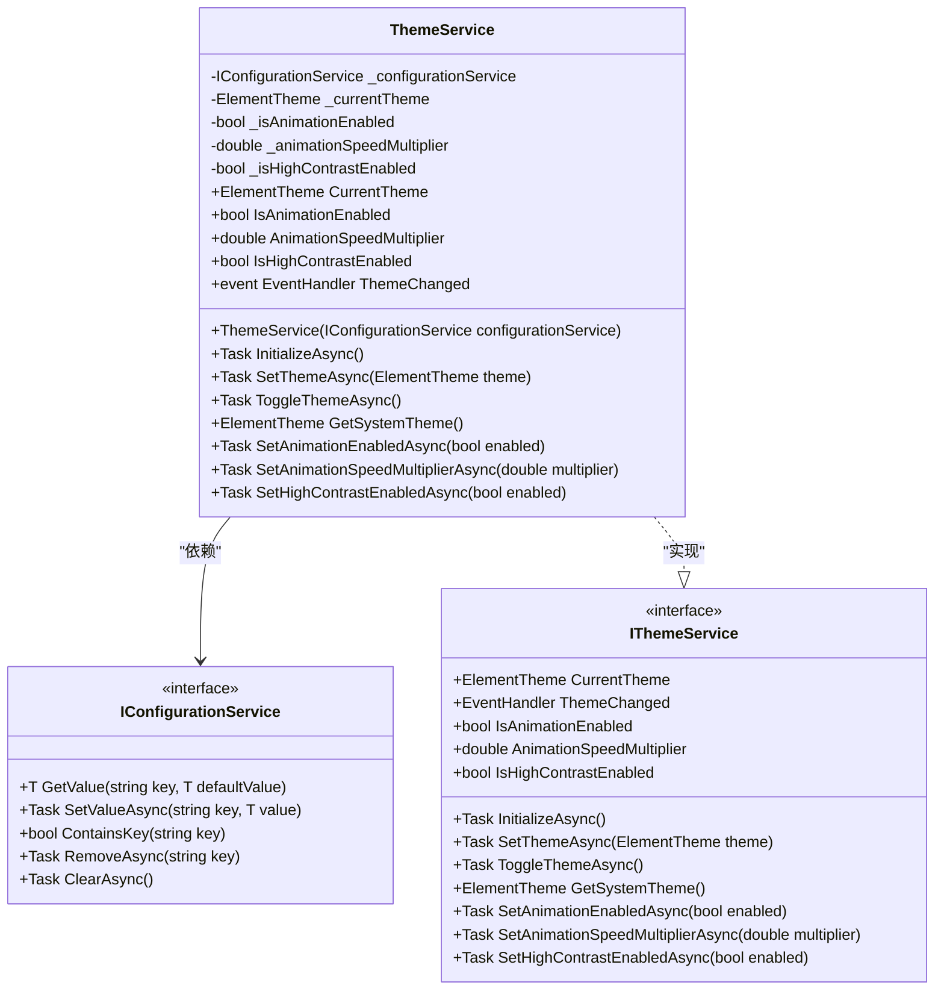
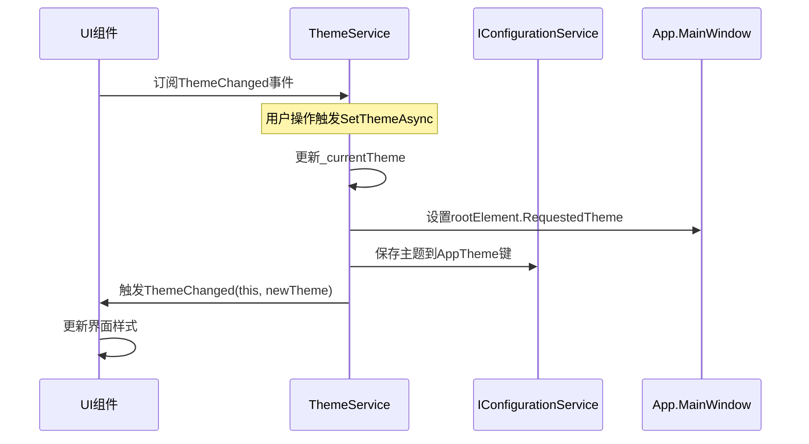
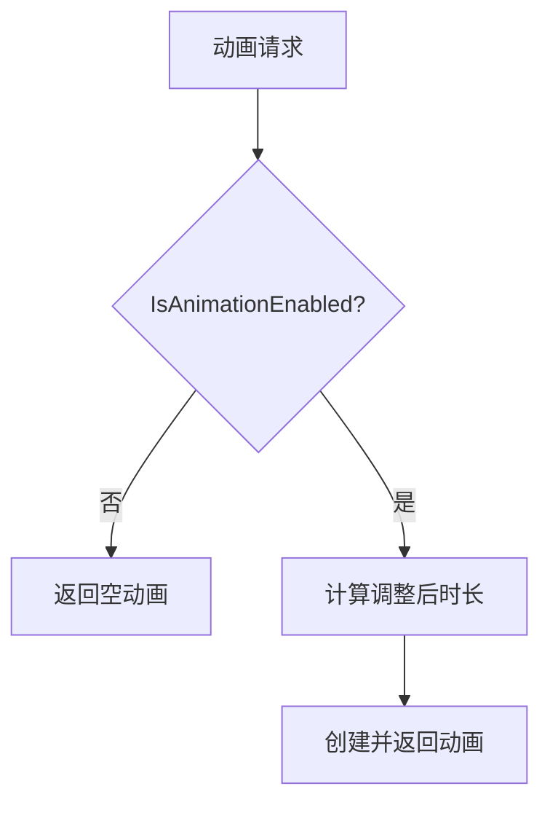
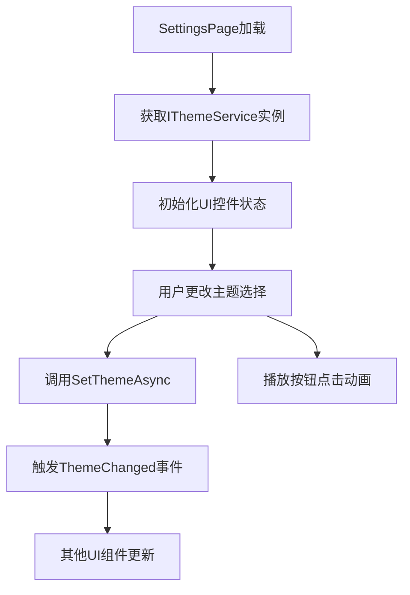
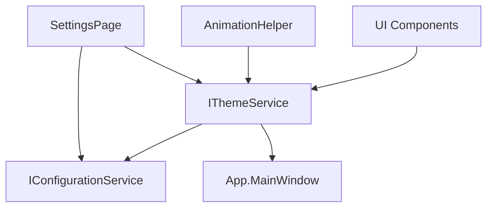

# 主题服务API

<cite>
**本文档中引用的文件**  
- [IThemeService.cs](file://Services/Interfaces/IThemeService.cs)
- [ThemeService.cs](file://Services/ThemeService.cs)
- [SettingsPage.xaml.cs](file://Views/Settings/SettingsPage.xaml.cs)
- [AnimationHelper.cs](file://Helpers/AnimationHelper.cs)
- [IConfigurationService.cs](file://Services/Interfaces/IConfigurationService.cs)
</cite>

## 目录
1. [简介](#简介)
2. [接口定义](#接口定义)
3. [核心属性与事件](#核心属性与事件)
4. [方法详解](#方法详解)
5. [主题切换广播机制](#主题切换广播机制)
6. [视觉状态持久化策略](#视觉状态持久化策略)
7. [动画配置分级控制](#动画配置分级控制)
8. [高对比度模式与无障碍支持](#高对比度模式与无障碍支持)
9. [系统主题同步实现](#系统主题同步实现)
10. [SettingsPage集成示例](#settingspage集成示例)
11. [依赖关系图](#依赖关系图)

## 简介
`IThemeService` 接口为应用程序提供统一的主题管理功能，支持深色、浅色和默认主题的动态切换，同时管理动画效果、速度调节和高对比度等个性化设置。该服务通过事件驱动机制通知UI组件主题变更，并结合配置服务实现用户偏好持久化。

**Section sources**
- [IThemeService.cs](file://Services/Interfaces/IThemeService.cs#L9-L71)

## 接口定义
`IThemeService` 定义了主题管理的核心契约，包括当前主题获取、主题切换、动画控制和高对比度模式等功能。其实现类 `ThemeService` 依赖 `IConfigurationService` 实现配置的持久化存储。

**Diagram sources**
- [IThemeService.cs](file://Services/Interfaces/IThemeService.cs#L9-L71)
- [ThemeService.cs](file://Services/ThemeService.cs#L10-L123)
- [IConfigurationService.cs](file://Services/Interfaces/IConfigurationService.cs#L7-L43)

## 核心属性与事件

### CurrentTheme 属性
获取当前应用程序的主题设置，返回 `ElementTheme` 枚举值（Light、Dark、Default），反映用户或系统当前选择的主题。

### ThemeChanged 事件
当主题发生变更时触发，所有订阅该事件的UI组件可接收到新的主题值并相应更新界面样式，实现主题的实时响应。

**Section sources**
- [IThemeService.cs](file://Services/Interfaces/IThemeService.cs#L13-L21)

## 方法详解

### SetThemeAsync
异步设置应用程序主题。若新主题与当前主题不同，则更新内部状态，将主题应用到主窗口的 `RequestedTheme`，保存至配置服务，并触发 `ThemeChanged` 事件。

### ToggleThemeAsync
循环切换主题：Light → Dark → Default → Light。提供便捷的用户交互方式，无需指定具体主题值即可切换。

### SetAnimationEnabledAsync
启用或禁用全局动画效果。此设置影响所有使用 `AnimationHelper` 的动画行为，提升性能或满足特定用户需求。

### SetAnimationSpeedMultiplierAsync
设置动画速度倍数（范围0.1–3.0），用于加快或减慢动画播放速度，增强用户体验的个性化程度。

### SetHighContrastEnabledAsync
启用或禁用高对比度模式，提升视觉障碍用户的可访问性。

**Section sources**
- [IThemeService.cs](file://Services/Interfaces/IThemeService.cs#L35-L71)
- [ThemeService.cs](file://Services/ThemeService.cs#L77-L123)

## 主题切换广播机制
主题变更通过 `ThemeChanged` 事件进行广播。任何需要响应主题变化的组件均可订阅此事件。例如，页面或控件在收到事件后可重新加载资源字典或刷新样式。

**Diagram sources**
- [ThemeService.cs](file://Services/ThemeService.cs#L95-L105)
- [SettingsPage.xaml.cs](file://Views/Settings/SettingsPage.xaml.cs#L100-L108)

## 视觉状态持久化策略
所有主题相关设置均通过 `IConfigurationService` 持久化存储，使用以下键名：

| 配置项 | 键名 | 数据类型 |
|--------|------|----------|
| 应用主题 | AppTheme | ElementTheme |
| 动画启用状态 | AnimationEnabled | bool |
| 动画速度倍数 | AnimationSpeed | double |
| 高对比度模式 | HighContrast | bool |

初始化时从配置服务加载上次保存的设置，确保用户偏好在应用重启后依然保留。

**Section sources**
- [ThemeService.cs](file://Services/ThemeService.cs#L38-L55)

## 动画配置分级控制
动画行为由 `IThemeService` 统一控制，`AnimationHelper` 类通过注入 `IThemeService` 获取当前动画设置：

- 若 `IsAnimationEnabled` 为 `false`，所有动画持续时间为 `TimeSpan.Zero`，即禁用动画。
- `AnimationSpeedMultiplier` 用于调整基础动画时长，公式为：`调整后时长 = 原始时长 / 倍数`。

此机制实现全局动画的集中管理，确保一致性。

**Diagram sources**
- [AnimationHelper.cs](file://Helpers/AnimationHelper.cs#L21-L35)
- [ThemeService.cs](file://Services/ThemeService.cs#L107-L113)

## 高对比度模式与无障碍支持
`SetHighContrastEnabledAsync` 方法控制高对比度模式的开启与关闭。当启用时，系统可强制使用高对比度资源或调整颜色方案，以满足无障碍需求。

在 `SettingsPage` 中，高对比度切换会立即应用，并可通过 `RequestedTheme` 强制使用默认主题以确保可读性。

**Section sources**
- [ThemeService.cs](file://Services/ThemeService.cs#L115-L123)
- [SettingsPage.xaml.cs](file://Views/Settings/SettingsPage.xaml.cs#L150-L158)

## 系统主题同步实现
`GetSystemTheme` 方法通过 `Windows.UI.ViewManagement.UISettings` 获取系统背景色，并根据RGB值总和判断系统是否为深色主题（阈值384）。若系统为深色则返回 `ElementTheme.Dark`，否则返回 `ElementTheme.Light`。

此功能允许应用程序初始时自动匹配系统外观。

**Section sources**
- [ThemeService.cs](file://Services/ThemeService.cs#L77-L88)

## SettingsPage集成示例
`SettingsPage` 页面集成主题控制，展示如何使用 `IThemeService`：

1. 在 `OnNavigatedTo` 中获取服务实例。
2. `InitializeSettings` 方法中读取当前主题并设置UI控件状态。
3. 通过事件处理器响应用户操作，调用相应服务方法。
4. 使用 `AnimationHelper.AnimateButtonPress` 提供微交互反馈。

**Diagram sources**
- [SettingsPage.xaml.cs](file://Views/Settings/SettingsPage.xaml.cs#L50-L78)
- [SettingsPage.xaml.cs](file://Views/Settings/SettingsPage.xaml.cs#L100-L108)
- [AnimationHelper.cs](file://Helpers/AnimationHelper.cs#L150-L158)

**Section sources**
- [SettingsPage.xaml.cs](file://Views/Settings/SettingsPage.xaml.cs#L41-L191)

## 依赖关系图
系统各组件围绕主题服务的依赖关系如下：

**Diagram sources**
- [ThemeService.cs](file://Services/ThemeService.cs#L10-L123)
- [SettingsPage.xaml.cs](file://Views/Settings/SettingsPage.xaml.cs#L25-L30)
- [AnimationHelper.cs](file://Helpers/AnimationHelper.cs#L12-L290)