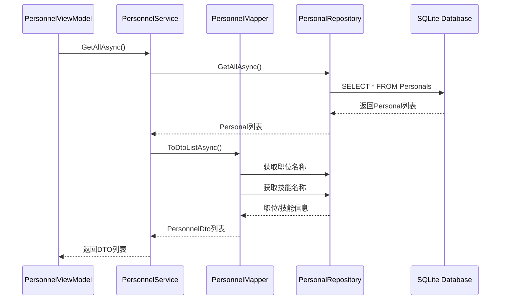
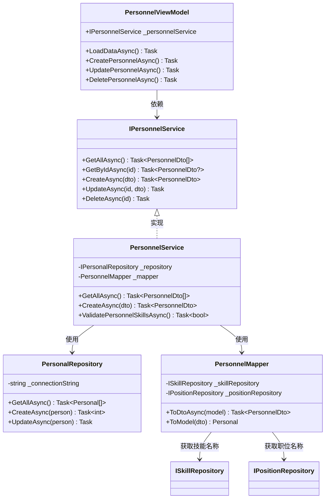
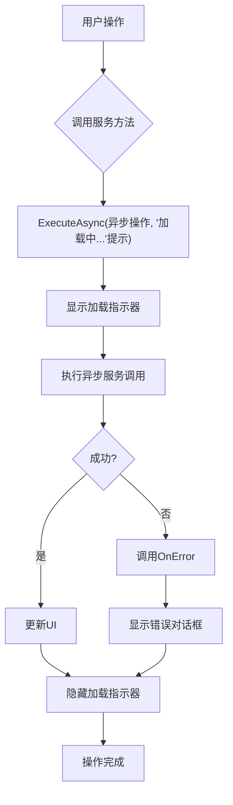
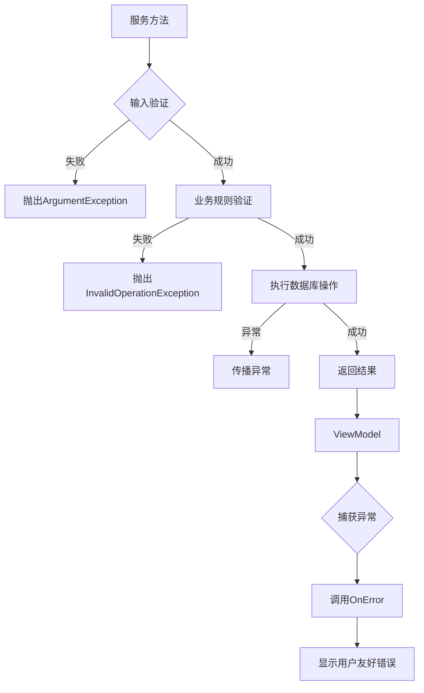
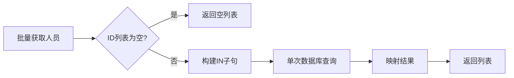
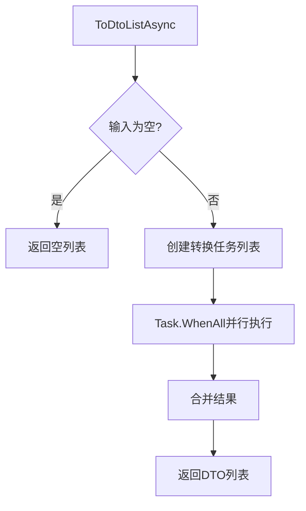

# 人员服务API

<cite>
**本文档引用的文件**
- [IPersonnelService.cs](file://Services/Interfaces/IPersonnelService.cs)
- [PersonnelService.cs](file://Services/PersonnelService.cs)
- [PersonalRepository.cs](file://Data/PersonalRepository.cs)
- [PersonnelMapper.cs](file://DTOs/Mappers/PersonnelMapper.cs)
- [PersonnelDto.cs](file://DTOs/PersonnelDto.cs)
- [PersonnelViewModel.cs](file://ViewModels/DataManagement/PersonnelViewModel.cs)
- [PersonnelPage.xaml.cs](file://Views/DataManagement/PersonnelPage.xaml.cs)
</cite>

## 目录
1. [简介](#简介)
2. [核心API方法说明](#核心api方法说明)
3. [数据交互流程](#数据交互流程)
4. [MVVM架构中的角色定位](#mvvm架构中的角色定位)
5. [异步调用最佳实践](#异步调用最佳实践)
6. [错误处理机制](#错误处理机制)
7. [性能优化建议](#性能优化建议)
8. [总结](#总结)

## 简介

`IPersonnelService` 是自动排班系统中的核心服务接口，负责人员信息的全生命周期管理。该服务为上层 ViewModel 提供异步数据访问能力，封装了底层数据存储细节，并实现了业务规则验证、数据转换和关联查询等关键功能。作为 MVVM 架构中的服务层，它连接了 UI 层与数据访问层，确保了系统的松耦合和可维护性。

**Section sources**
- [IPersonnelService.cs](file://Services/Interfaces/IPersonnelService.cs#L9-L50)

## 核心API方法说明

### GetAllAsync
获取所有人员列表。

- **参数类型**: 无
- **返回值**: `Task<List<PersonnelDto>>` - 包含所有人员信息的列表
- **异常情况**: 无特定业务异常，底层数据库异常会被传播

### GetByIdAsync
根据ID获取单个人员信息。

- **参数类型**: `int id` - 人员唯一标识
- **返回值**: `Task<PersonnelDto?>` - 找到则返回人员DTO，否则返回null
- **异常情况**: 无特定业务异常

### CreateAsync
创建新人员。

- **参数类型**: `CreatePersonnelDto dto` - 创建人员所需数据
- **返回值**: `Task<PersonnelDto>` - 包含ID的完整人员信息
- **异常情况**: 
  - 姓名为空或超长
  - 未选择技能
  - 职位ID无效
  - 技能ID无效

### UpdateAsync
更新现有人员信息。

- **参数类型**: `int id`, `UpdatePersonnelDto dto`
- **返回值**: `Task` - 无返回值
- **异常情况**: 
  - 人员不存在
  - 姓名为空或超长
  - 未选择技能
  - 职位ID无效
  - 技能ID无效

### DeleteAsync
删除指定人员。

- **参数类型**: `int id` - 人员ID
- **返回值**: `Task` - 无返回值
- **异常情况**: 人员不存在时抛出 `InvalidOperationException`

### SearchAsync
按姓名关键字搜索人员。

- **参数类型**: `string keyword` - 搜索关键词
- **返回值**: `Task<List<PersonnelDto>>` - 匹配的人员列表
- **异常情况**: 无特定业务异常

### GetAvailablePersonnelAsync
获取可用人员（在职且可用）。

- **参数类型**: 无
- **返回值**: `Task<List<PersonnelDto>>` - 可用人员列表
- **异常情况**: 无特定业务异常

### ValidatePersonnelSkillsAsync
验证人员技能是否满足岗位要求。

- **参数类型**: `int personnelId`, `int positionId`
- **返回值**: `Task<bool>` - true表示技能匹配
- **异常情况**: 无异常，人员或岗位不存在时返回false

**Section sources**
- [IPersonnelService.cs](file://Services/Interfaces/IPersonnelService.cs#L9-L50)
- [PersonnelService.cs](file://Services/PersonnelService.cs#L50-L194)

## 数据交互流程



**Diagram sources**
- [PersonnelService.cs](file://Services/PersonnelService.cs#L50-L65)
- [PersonalRepository.cs](file://Data/PersonalRepository.cs#L100-L130)
- [PersonnelMapper.cs](file://DTOs/Mappers/PersonnelMapper.cs#L50-L90)

## MVVM架构中的角色定位



**Diagram sources**
- [PersonnelViewModel.cs](file://ViewModels/DataManagement/PersonnelViewModel.cs#L10-L242)
- [PersonnelService.cs](file://Services/PersonnelService.cs#L10-L194)
- [PersonalRepository.cs](file://Data/PersonalRepository.cs#L10-L326)
- [PersonnelMapper.cs](file://DTOs/Mappers/PersonnelMapper.cs#L10-L203)

**Section sources**
- [PersonnelViewModel.cs](file://ViewModels/DataManagement/PersonnelViewModel.cs#L10-L242)
- [PersonnelService.cs](file://Services/PersonnelService.cs#L10-L194)

## 异步调用最佳实践

在 `PersonnelViewModel` 中，所有服务调用都通过 `ExecuteAsync` 包装，确保UI线程不被阻塞：



**Diagram sources**
- [PersonnelViewModel.cs](file://ViewModels/DataManagement/PersonnelViewModel.cs#L100-L120)
- [ViewModelBase.cs](file://ViewModels/Base/ViewModelBase.cs#L50-L80)

## 错误处理机制

服务层和ViewModel层采用分层错误处理策略：



**Diagram sources**
- [PersonnelService.cs](file://Services/PersonnelService.cs#L100-L150)
- [PersonnelViewModel.cs](file://ViewModels/DataManagement/PersonnelViewModel.cs#L240-L242)

**Section sources**
- [PersonnelService.cs](file://Services/PersonnelService.cs#L100-L150)
- [PersonnelViewModel.cs](file://ViewModels/DataManagement/PersonnelViewModel.cs#L240-L242)

## 性能优化建议

### 分页策略
虽然当前 `GetAllAsync` 未实现分页，但可通过扩展支持：

```csharp
// 建议的分页接口扩展
Task<PagedResult<PersonnelDto>> GetPagedAsync(int page, int pageSize, string? keyword = null);
```

### 批量操作优化
`PersonalRepository` 已优化批量查询：



**Diagram sources**
- [PersonalRepository.cs](file://Data/PersonalRepository.cs#L150-L180)

### 数据映射优化
`PersonnelMapper` 使用 `Task.WhenAll` 并行处理批量转换：



**Diagram sources**
- [PersonnelMapper.cs](file://DTOs/Mappers/PersonnelMapper.cs#L70-L90)

## 总结

`IPersonnelService` 作为系统的核心服务之一，提供了完整的人员管理功能。通过清晰的接口定义、严格的业务验证、高效的数据库交互和优雅的MVVM集成，确保了系统的稳定性和可维护性。建议未来增加分页支持以应对大数据量场景，并考虑缓存机制进一步提升性能。

**Section sources**
- [IPersonnelService.cs](file://Services/Interfaces/IPersonnelService.cs#L9-L50)
- [PersonnelService.cs](file://Services/PersonnelService.cs#L10-L194)