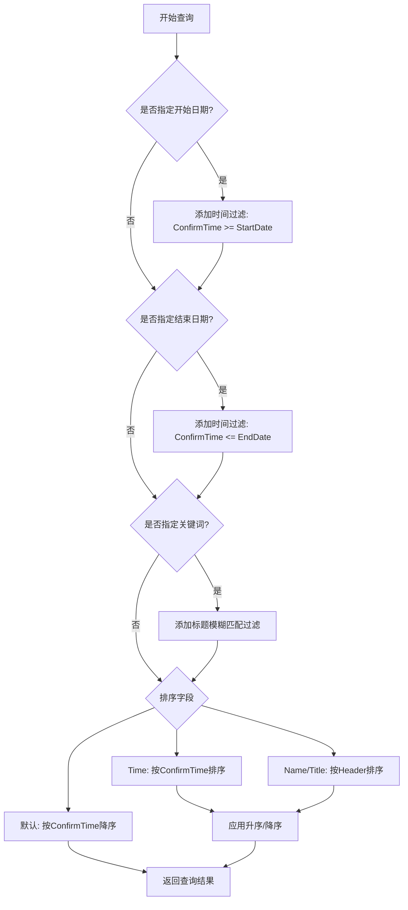
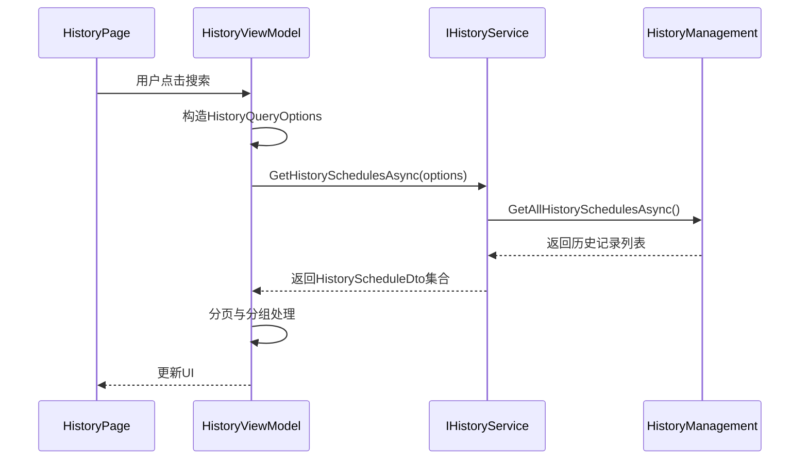
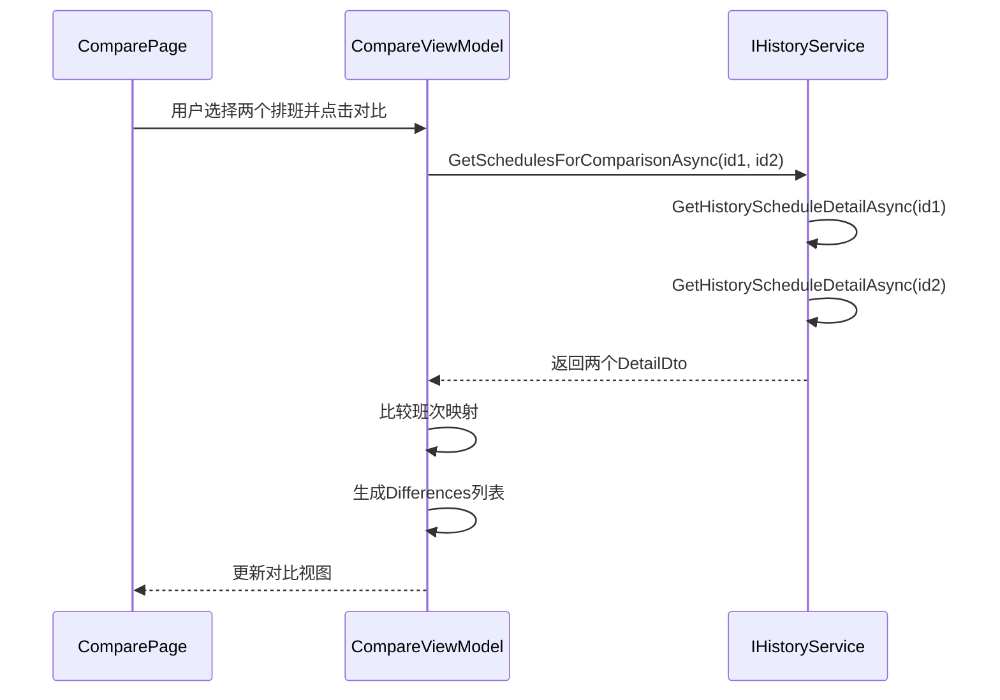
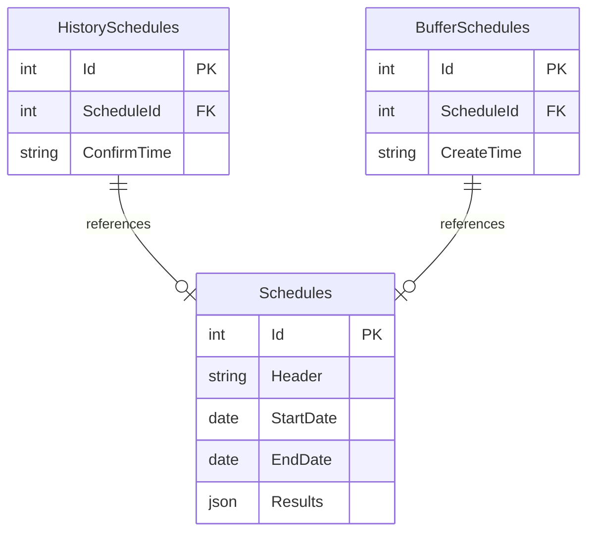
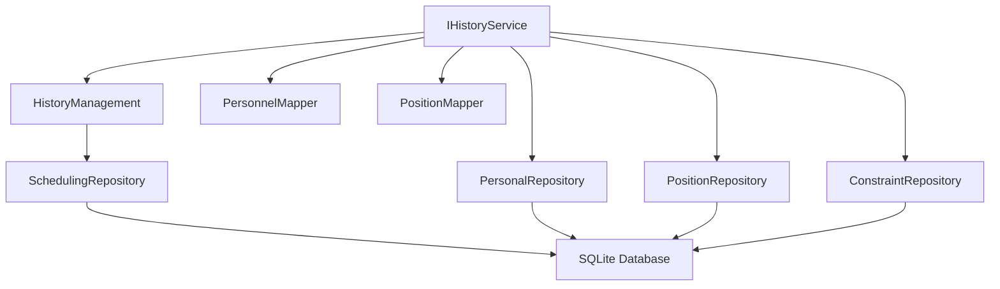

# 历史服务API

<cite>
**本文档引用的文件**  
- [IHistoryService.cs](file://Services/Interfaces/IHistoryService.cs)
- [HistoryService.cs](file://Services/HistoryService.cs)
- [HistoryViewModel.cs](file://ViewModels/History/HistoryViewModel.cs)
- [CompareViewModel.cs](file://ViewModels/History/CompareViewModel.cs)
- [HistoryScheduleDetailDto.cs](file://DTOs/HistoryScheduleDetailDto.cs)
- [HIstoryManagement.cs](file://History/HIstoryManagement.cs)
- [IHistoryManagement.cs](file://History/IHistoryManagement.cs)
</cite>

## 目录
1. [简介](#简介)
2. [核心接口与方法](#核心接口与方法)
3. [历史查询选项](#历史查询选项)
4. [历史详情数据组装](#历史详情数据组装)
5. [视图模型中的服务调用示例](#视图模型中的服务调用示例)
6. [历史数据存储策略](#历史数据存储策略)
7. [查询性能优化建议](#查询性能优化建议)
8. [版本对比差异计算逻辑](#版本对比差异计算逻辑)
9. [架构与依赖关系](#架构与依赖关系)

## 简介
本API文档详细说明了`IHistoryService`接口的功能与实现，重点描述其在历史排班记录管理中的作用。该服务为前端提供历史排班的查询、详情获取和版本对比功能，支持灵活的过滤、排序与分页机制，并集成统计信息生成与差异分析能力。系统通过`HistoryManagement`组件实现持久化管理，确保历史数据的完整性与一致性。

## 核心接口与方法
`IHistoryService`接口定义了三个核心异步方法，用于支持历史排班功能的完整生命周期操作。

### GetHistorySchedulesAsync
该方法根据`HistoryQueryOptions`参数查询符合条件的历史排班列表。返回值为`IEnumerable<HistoryScheduleDto>`，包含排班的基本元数据，如名称、时间范围、确认时间及参与人员/岗位数量。

### GetHistoryScheduleDetailAsync
该方法根据排班ID获取详细的排班信息，返回`HistoryScheduleDetailDto`对象。该对象不仅包含基础信息，还包含完整的人员列表、岗位列表、班次详情以及统计信息。

### GetSchedulesForComparisonAsync
该方法接收两个排班ID，分别调用`GetHistoryScheduleDetailAsync`获取两个排班的详细信息，并以元组形式返回，专用于版本对比功能。

**Section sources**
- [IHistoryService.cs](file://Services/Interfaces/IHistoryService.cs#L7-L12)
- [HistoryService.cs](file://Services/HistoryService.cs#L34-L120)

## 历史查询选项
`HistoryQueryOptions`类定义了历史查询的过滤与排序条件，支持以下属性：

- **StartDate**: 可选，用于筛选确认时间大于等于该日期的排班记录。
- **EndDate**: 可选，用于筛选确认时间小于等于该日期的排班记录。
- **Keyword**: 可选，用于在排班标题中进行不区分大小写的模糊匹配。
- **SortBy**: 排序字段，支持"Time"（按确认时间）和"Name"（按标题）两种方式，默认为"Time"。
- **IsAscending**: 是否升序排序，降序为默认行为。

分页功能在`HistoryViewModel`中实现，通过`CurrentPage`和`PageSize`控制每页显示数量，结合`LoadDataAsync`方法完成分页加载。

**Diagram sources**
- [HistoryService.cs](file://Services/HistoryService.cs#L34-L75)
- [HistoryViewModel.cs](file://ViewModels/History/HistoryViewModel.cs#L100-L120)

**Section sources**
- [IHistoryService.cs](file://Services/Interfaces/IHistoryService.cs#L14-L21)
- [HistoryService.cs](file://Services/HistoryService.cs#L34-L75)
- [HistoryViewModel.cs](file://ViewModels/History/HistoryViewModel.cs#L40-L60)

## 历史详情数据组装
`GetHistoryScheduleDetailAsync`方法负责组装完整的排班详情数据。其组装过程如下：

1. 通过`_historyManagement.GetHistoryScheduleByScheduleIdAsync`获取历史记录项。
2. 从`SchedulingRepository`中加载完整的排班对象。
3. 使用`IPersonalRepository`和`IPositionRepository`分别获取参与人员和岗位的完整信息。
4. 通过`PersonnelMapper`和`PositionMapper`将实体转换为DTO。
5. 构建`HistoryScheduleDetailDto`对象，填充基础信息和关联数据。
6. 计算并填充统计信息，包括总班次数、人均班次、周末班次及人员班次分布。

统计信息的计算充分利用了LINQ查询，确保高效性与准确性。

**Section sources**
- [HistoryService.cs](file://Services/HistoryService.cs#L77-L113)
- [HistoryScheduleDetailDto.cs](file://DTOs/HistoryScheduleDetailDto.cs#L10-L45)

## 视图模型中的服务调用示例
### HistoryViewModel
`HistoryViewModel`通过`IHistoryService`实现历史记录的展示功能。用户在界面上设置日期范围、关键词和排序方式后，`LoadDataAsync`方法会构造`HistoryQueryOptions`并调用`GetHistorySchedulesAsync`获取数据。结果按年月分组，便于时间轴视图展示。

**Diagram sources**
- [HistoryViewModel.cs](file://ViewModels/History/HistoryViewModel.cs#L100-L150)
- [HistoryService.cs](file://Services/HistoryService.cs#L34-L75)

### CompareViewModel
`CompareViewModel`实现排班版本对比功能。用户选择两个历史排班后，调用`GetSchedulesForComparisonAsync`获取两个排班的详细信息。随后，系统通过比较两个排班的班次映射（以DayIndex和PositionId为键），识别出新增、删除或人员变更的班次，并生成`ShiftDiff`列表用于高亮显示差异。

**Diagram sources**
- [CompareViewModel.cs](file://ViewModels/History/CompareViewModel.cs#L100-L150)
- [HistoryService.cs](file://Services/HistoryService.cs#L115-L120)

**Section sources**
- [HistoryViewModel.cs](file://ViewModels/History/HistoryViewModel.cs#L100-L150)
- [CompareViewModel.cs](file://ViewModels/History/CompareViewModel.cs#L100-L150)

## 历史数据存储策略
历史数据通过`HistoryManagement`类进行管理，采用SQLite数据库持久化存储。系统设计了两个核心表：

- **HistorySchedules**: 存储已确认的历史排班记录，包含`ScheduleId`和`ConfirmTime`。
- **BufferSchedules**: 存储待确认的排班缓冲区，包含`ScheduleId`和`CreateTime`。

排班详情存储在`Schedules`表中，通过外键关联。当用户确认一个排班时，系统将其从缓冲区移动到历史表，并清空其他缓冲区内容，确保每次只有一个有效排班草案。

**Diagram sources**
- [HIstoryManagement.cs](file://History/HIstoryManagement.cs#L30-L50)
- [IHistoryManagement.cs](file://History/IHistoryManagement.cs#L10-L19)

**Section sources**
- [HIstoryManagement.cs](file://History/HIstoryManagement.cs#L12-L359)
- [IHistoryManagement.cs](file://History/IHistoryManagement.cs#L10-L19)

## 查询性能优化建议
1. **索引优化**: 在`HistorySchedules`表的`ConfirmTime`字段上创建索引，以加速时间范围查询。
2. **缓存机制**: 对频繁访问的历史记录（如最近的排班）实现内存缓存，减少数据库访问。
3. **分页处理**: 始终在服务端实现分页，避免一次性加载大量数据。
4. **异步加载**: 所有数据访问均使用异步方法，防止UI线程阻塞。
5. **批量查询**: 在获取人员和岗位信息时，使用`GetPersonnelByIdsAsync`和`GetPositionsByIdsAsync`进行批量查询，减少数据库往返次数。

## 版本对比差异计算逻辑
差异计算在`CompareViewModel.CompareAsync`方法中实现，核心逻辑如下：

1. 将两个排班的班次列表分别按`(DayIndex, PositionId)`分组，构建字典映射。
2. 获取两个字典的所有唯一键（即所有出现过的班次位置）。
3. 遍历每个键，比较左右两个排班在该位置的人员分配情况：
   - 若左空右有：标记为“新增班次”
   - 若左有右空：标记为“删除班次”
   - 若均有但人员不同：标记为“人员变更”
4. 将差异结果存储在`Differences`集合中，供UI进行高亮渲染。

此算法时间复杂度为O(n+m)，其中n和m分别为两个排班的班次数，具有良好的性能表现。

**Section sources**
- [CompareViewModel.cs](file://ViewModels/History/CompareViewModel.cs#L100-L150)

## 架构与依赖关系
`IHistoryService`的实现依赖于多个组件，形成清晰的分层架构：

这种设计实现了关注点分离，`HistoryService`专注于业务逻辑，而数据访问和对象映射由专用组件处理，提高了代码的可维护性和可测试性。

**Diagram sources**
- [HistoryService.cs](file://Services/HistoryService.cs#L20-L30)
- [HIstoryManagement.cs](file://History/HIstoryManagement.cs#L20-L30)

**Section sources**
- [HistoryService.cs](file://Services/HistoryService.cs#L20-L30)
- [HIstoryManagement.cs](file://History/HIstoryManagement.cs#L20-L30)