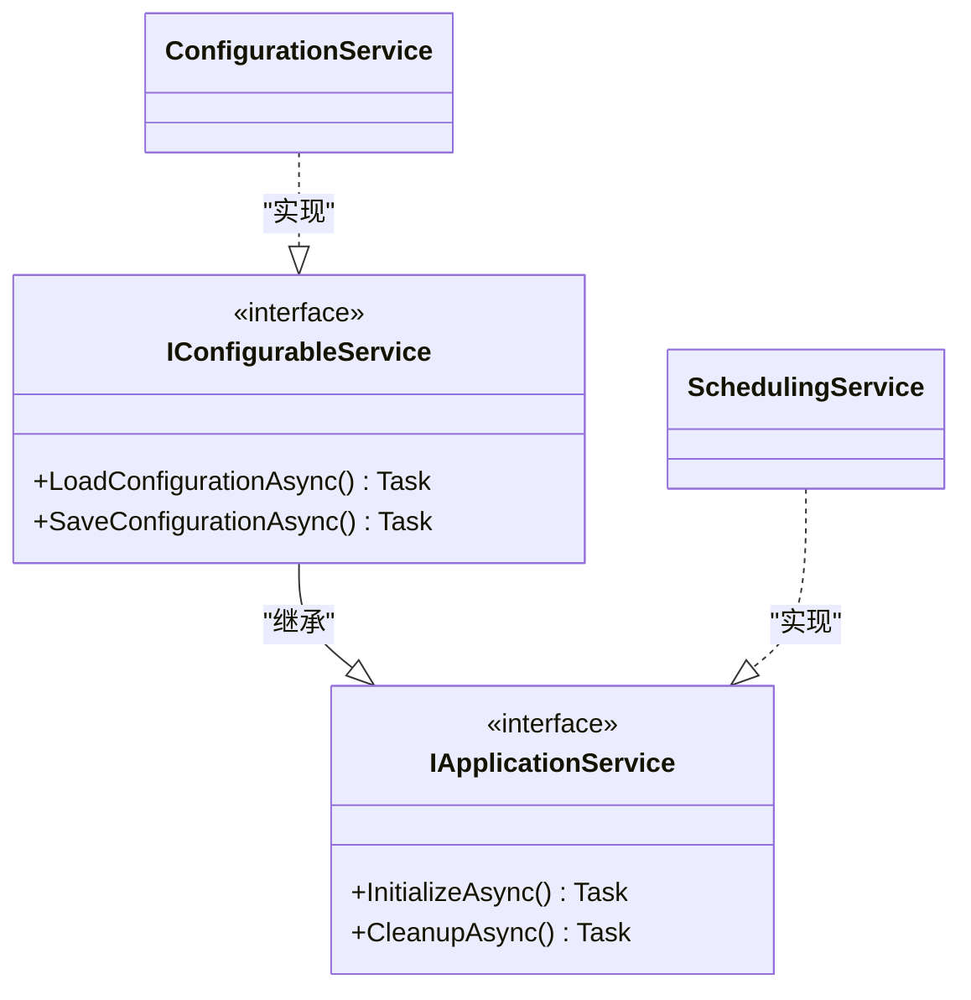
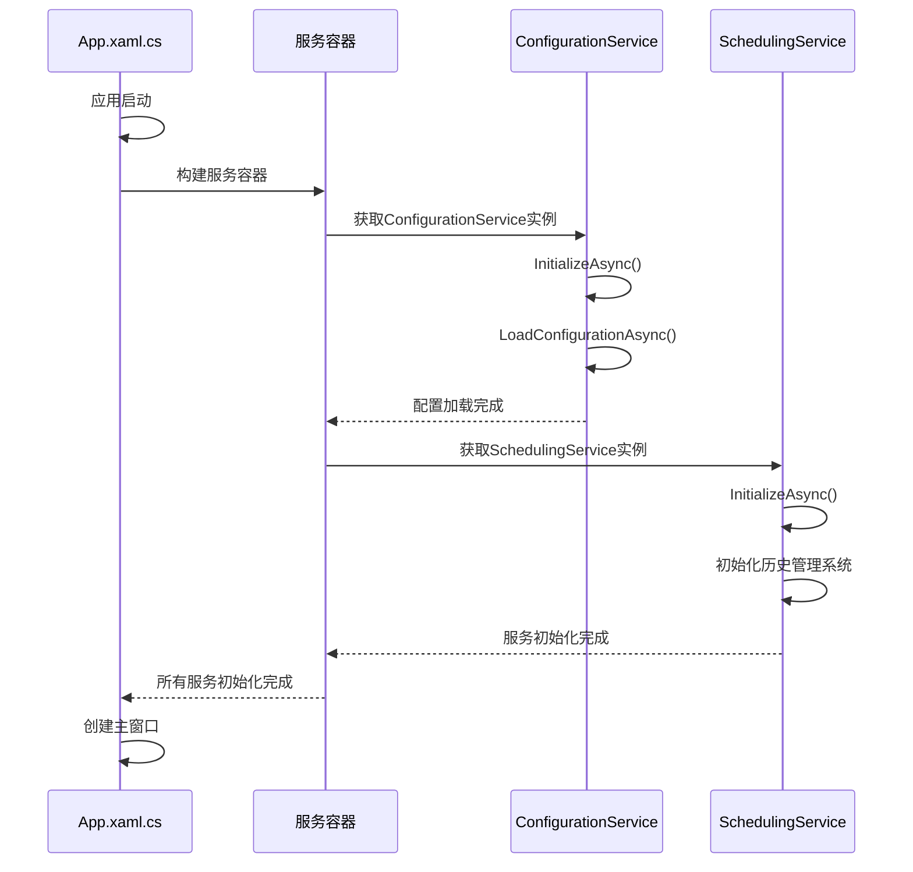
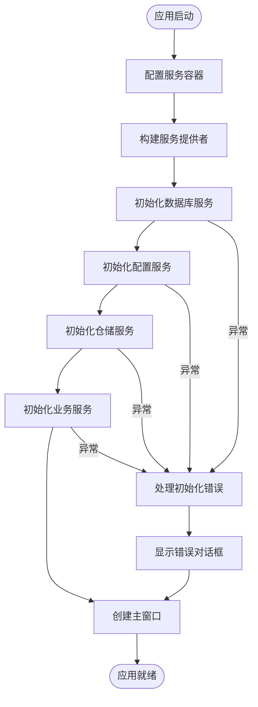

# 应用服务API

<cite>
**Referenced Files in This Document**  
- [IApplicationService.cs](file://Services/Interfaces/IApplicationService.cs)
- [App.xaml.cs](file://App.xaml.cs)
- [ConfigurationService.cs](file://Services/ConfigurationService.cs)
- [SchedulingService.cs](file://Services/SchedulingService.cs)
- [ServiceCollectionExtensions.cs](file://Extensions/ServiceCollectionExtensions.cs)
- [PersonnelService.cs](file://Services/PersonnelService.cs)
- [PositionService.cs](file://Services/PositionService.cs)
</cite>

## 目录
1. [简介](#简介)
2. [核心接口设计](#核心接口设计)
3. [生命周期管理](#生命周期管理)
4. [服务协调流程](#服务协调流程)
5. [最佳实践](#最佳实践)
6. [结论](#结论)

## 简介
`IApplicationService`接口是本应用服务架构的核心基类，定义了应用程序级别服务的标准化生命周期管理契约。该接口通过`InitializeAsync`和`CleanupAsync`两个核心方法，为所有应用服务提供了统一的初始化和清理机制，确保了应用在启动和关闭过程中的稳定性和资源管理效率。

## 核心接口设计

`IApplicationService`接口作为服务初始化的基类，其设计意图在于为应用程序中的各类服务提供一个统一的生命周期管理契约。该接口定义了两个关键的异步方法：

- `InitializeAsync`: 用于服务的初始化操作
- `CleanupAsync`: 用于服务的资源清理操作

该接口还派生出`IConfigurableService`接口，扩展了配置管理能力，包含`LoadConfigurationAsync`和`SaveConfigurationAsync`方法，专门用于处理配置相关的初始化和持久化操作。

**Diagram sources**
- [IApplicationService.cs](file://Services/Interfaces/IApplicationService.cs#L7-L34)

**Section sources**
- [IApplicationService.cs](file://Services/Interfaces/IApplicationService.cs#L7-L34)

## 生命周期管理

### 初始化流程
`InitializeAsync`方法在应用启动时被调用，负责执行服务的初始化逻辑。不同服务的初始化职责各不相同：

- **ConfigurationService**: 在`InitializeAsync`中调用`LoadConfigurationAsync`，从本地文件系统加载持久化的配置数据
- **SchedulingService**: 初始化历史管理系统，并通过反射机制调用相关仓储的`InitAsync`方法，确保排班引擎的依赖组件正确初始化

### 清理流程
`CleanupAsync`方法在应用关闭时被调用，负责执行资源清理和状态持久化：

- **ConfigurationService**: 在`CleanupAsync`中调用`SaveConfigurationAsync`，将当前配置状态异步保存到JSON文件中，确保用户设置不会丢失
- **其他服务**: 执行必要的资源释放操作，如关闭数据库连接、清理缓存等

**Diagram sources**
- [App.xaml.cs](file://App.xaml.cs#L1-L175)
- [ConfigurationService.cs](file://Services/ConfigurationService.cs#L1-L158)
- [SchedulingService.cs](file://Services/SchedulingService.cs#L1-L750)

**Section sources**
- [App.xaml.cs](file://App.xaml.cs#L1-L175)
- [ConfigurationService.cs](file://Services/ConfigurationService.cs#L1-L158)
- [SchedulingService.cs](file://Services/SchedulingService.cs#L1-L750)

## 服务协调流程

### 依赖注入容器集成
应用通过`Microsoft.Extensions.DependencyInjection`实现依赖注入，所有服务在`App.xaml.cs`的`ConfigureServices`方法中注册。`ServiceCollectionExtensions.cs`文件中的`AddApplicationServices`扩展方法集中管理了所有服务的注册逻辑。

### 启动顺序控制
服务的启动顺序通过以下机制进行控制：

1. **数据库优先**: 首先初始化`DatabaseService`，确保数据访问层可用
2. **配置次之**: 接着初始化`ConfigurationService`，加载应用配置
3. **业务服务最后**: 最后按需初始化其他业务服务

这种分层启动策略确保了服务间的依赖关系得到正确处理。

### 异常处理机制
在服务初始化过程中，系统实现了完善的异常处理：

- 使用`try-catch`块捕获初始化过程中的异常
- 记录详细的错误日志到调试输出
- 通过`DialogService`向用户显示友好的错误信息
- 即使部分服务初始化失败，仍尝试启动应用主界面，提供有限功能

**Diagram sources**
- [App.xaml.cs](file://App.xaml.cs#L1-L175)
- [ServiceCollectionExtensions.cs](file://Extensions/ServiceCollectionExtensions.cs#L1-L131)

**Section sources**
- [App.xaml.cs](file://App.xaml.cs#L1-L175)
- [ServiceCollectionExtensions.cs](file://Extensions/ServiceCollectionExtensions.cs#L1-L131)

## 最佳实践

### 服务注册
- 使用扩展方法组织服务注册逻辑，提高代码可维护性
- 按功能模块分组注册服务，如仓储、业务服务、辅助服务等
- 使用合适的生命周期（如`AddSingleton`）确保服务实例的正确管理

### 资源释放
- 在`CleanupAsync`中执行所有必要的资源清理操作
- 对于需要持久化的状态（如配置），确保在应用关闭前保存
- 使用异步操作避免阻塞主线程

### 启动顺序
- 明确服务间的依赖关系，按依赖顺序初始化
- 对于可选依赖，实现优雅降级机制
- 使用健康检查确保关键服务正常运行

### 异常处理
- 在初始化过程中捕获并处理所有异常
- 提供详细的错误日志用于诊断
- 向用户展示清晰、友好的错误信息
- 实现故障恢复机制，尽可能保持应用可用

## 结论
`IApplicationService`接口在确保应用稳定性和资源管理效率方面发挥着关键作用。通过标准化的生命周期管理契约，该接口实现了服务的有序初始化和清理，有效避免了资源泄漏和状态不一致问题。结合依赖注入容器的协调机制，该设计模式为应用提供了良好的可扩展性和可维护性，是本系统架构中的核心组成部分。