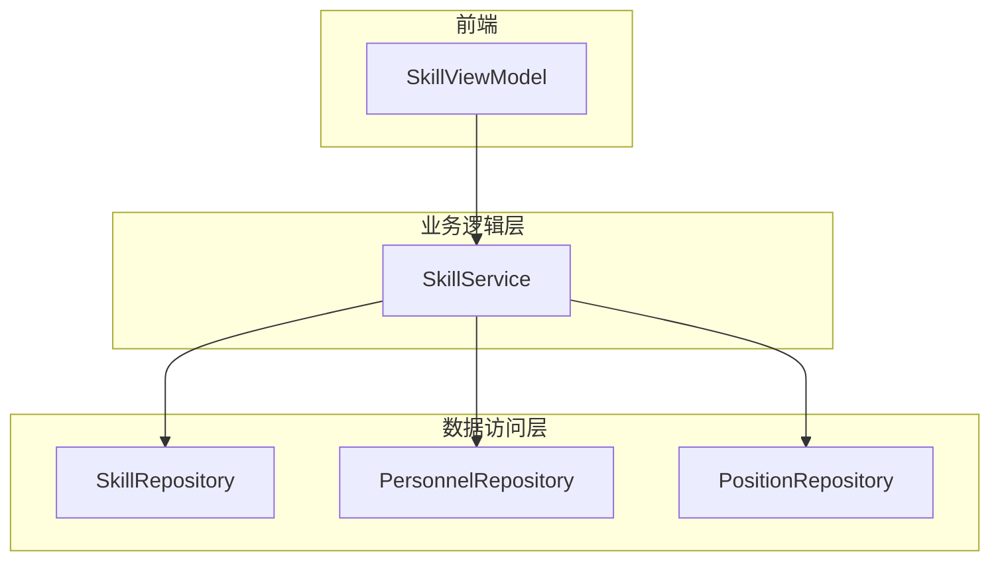
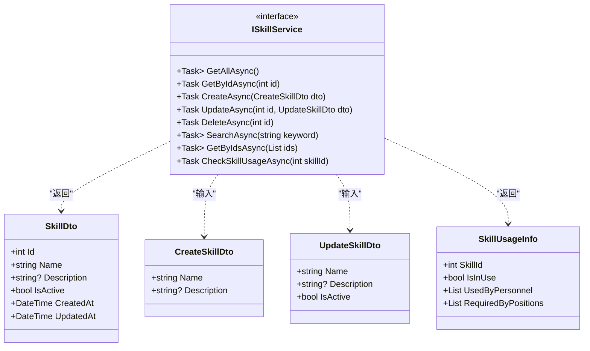
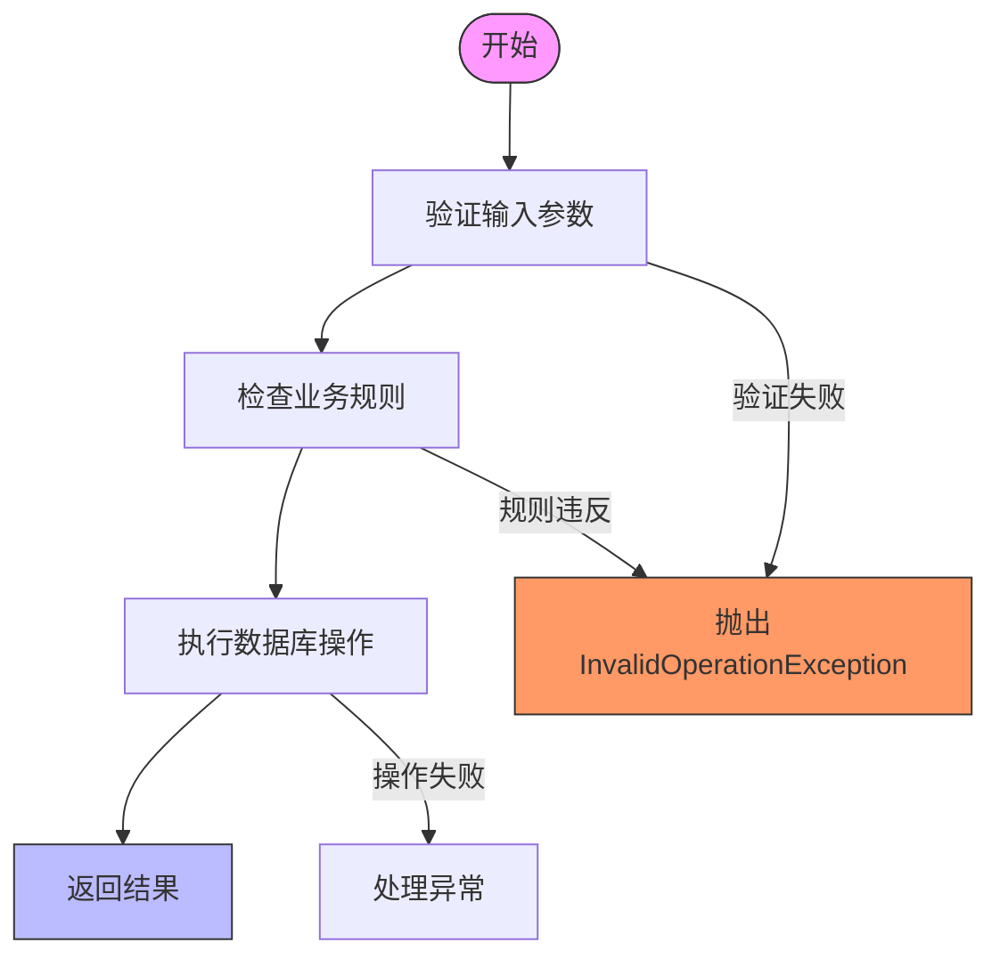
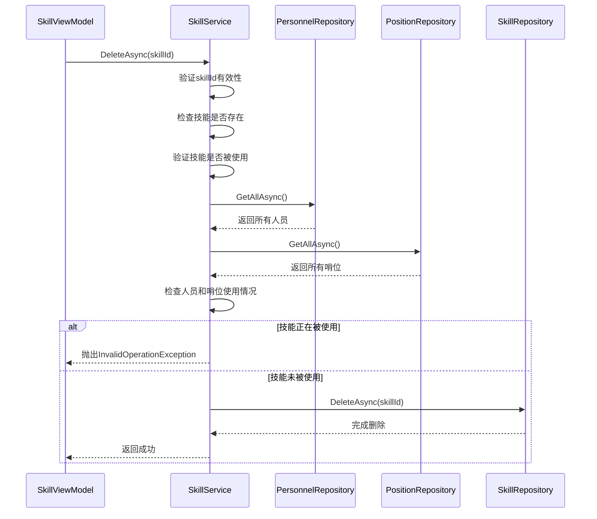
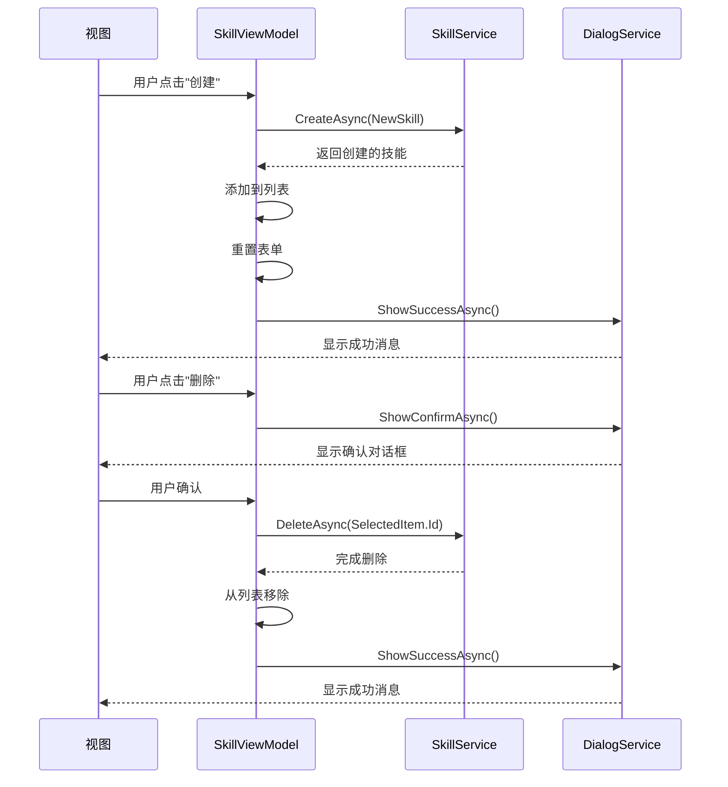
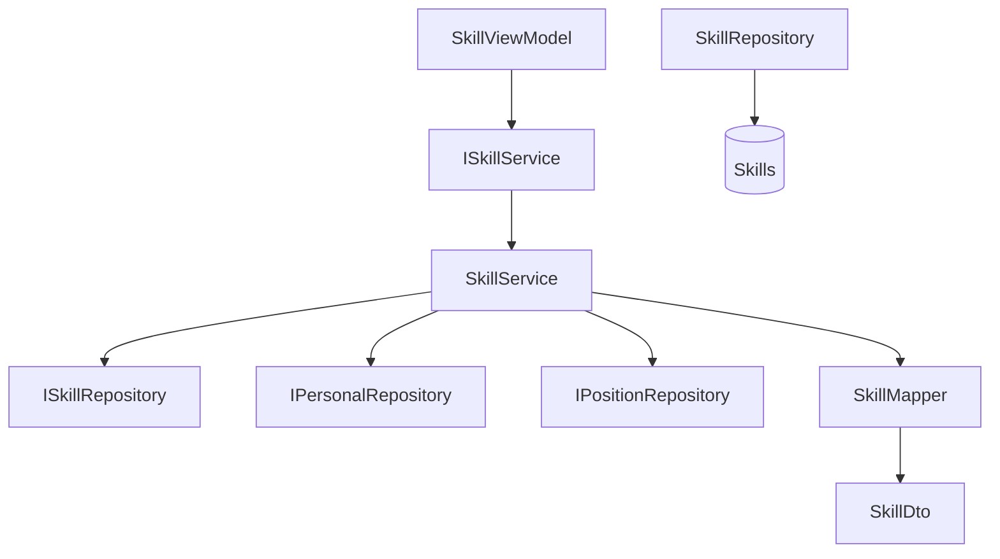

# 技能服务API

<cite>
**本文档引用的文件**
- [ISkillService.cs](file://Services/Interfaces/ISkillService.cs)
- [SkillService.cs](file://Services/SkillService.cs)
- [SkillViewModel.cs](file://ViewModels/DataManagement/SkillViewModel.cs)
- [SkillDto.cs](file://DTOs/SkillDto.cs)
- [SkillRepository.cs](file://Data/SkillRepository.cs)
- [SkillServiceTests.cs](file://Tests/SkillServiceTests.cs)
</cite>

## 目录
1. [简介](#简介)
2. [核心组件](#核心组件)
3. [架构概览](#架构概览)
4. [详细组件分析](#详细组件分析)
5. [依赖分析](#依赖分析)
6. [性能考虑](#性能考虑)
7. [故障排除指南](#故障排除指南)
8. [结论](#结论)

## 简介
本API文档全面描述了`ISkillService`接口的实现细节，重点涵盖技能管理的增删改查操作、技能使用情况检查的业务逻辑及其在人员排班中的约束作用。文档详细说明了服务在`SkillViewModel`中的调用示例，展示了如何实现技能的批量操作和数据一致性保障机制，并提供了缓存策略建议以及与`PersonnelService`的关联查询模式。

## 核心组件

`ISkillService`接口定义了技能管理的核心功能，包括获取、创建、更新、删除技能等操作。`SkillService`类实现了该接口，通过依赖注入方式与`ISkillRepository`、`IPersonalRepository`和`IPositionRepository`进行交互，确保数据的一致性和完整性。`SkillViewModel`作为前端视图模型，封装了用户界面操作逻辑，通过调用`ISkillService`实现技能管理功能。

**Section sources**
- [ISkillService.cs](file://Services/Interfaces/ISkillService.cs#L1-L51)
- [SkillService.cs](file://Services/SkillService.cs#L1-L266)
- [SkillViewModel.cs](file://ViewModels/DataManagement/SkillViewModel.cs#L1-L206)

## 架构概览

**Diagram sources**
- [SkillViewModel.cs](file://ViewModels/DataManagement/SkillViewModel.cs#L1-L206)
- [SkillService.cs](file://Services/SkillService.cs#L1-L266)
- [SkillRepository.cs](file://Data/SkillRepository.cs#L1-L260)

## 详细组件分析

### ISkillService 接口分析

`ISkillService`接口定义了技能管理的八个核心方法，采用异步编程模型以提高系统响应性。接口设计遵循RESTful原则，方法命名清晰表达了其业务意图。

#### 方法说明
- `GetAllAsync`: 获取所有技能列表
- `GetByIdAsync`: 根据ID获取单个技能
- `CreateAsync`: 创建新技能
- `UpdateAsync`: 更新现有技能
- `DeleteAsync`: 删除指定技能
- `SearchAsync`: 按关键字搜索技能
- `GetByIdsAsync`: 批量获取多个技能
- `CheckSkillUsageAsync`: 检查技能使用情况

**Diagram sources**
- [ISkillService.cs](file://Services/Interfaces/ISkillService.cs#L1-L51)
- [SkillDto.cs](file://DTOs/SkillDto.cs#L1-L91)

**Section sources**
- [ISkillService.cs](file://Services/Interfaces/ISkillService.cs#L1-L51)
- [SkillDto.cs](file://DTOs/SkillDto.cs#L1-L91)

### SkillService 实现分析

`SkillService`类实现了`ISkillService`接口，通过构造函数注入依赖项，遵循依赖倒置原则。服务实现包含完整的输入验证、业务规则验证和异常处理机制。

#### 业务逻辑流程

**Diagram sources**
- [SkillService.cs](file://Services/SkillService.cs#L1-L266)

#### 技能删除业务逻辑

**Diagram sources**
- [SkillService.cs](file://Services/SkillService.cs#L1-L266)
- [SkillRepository.cs](file://Data/SkillRepository.cs#L1-L260)

**Section sources**
- [SkillService.cs](file://Services/SkillService.cs#L1-L266)

### SkillViewModel 调用示例分析

`SkillViewModel`作为MVVM模式中的视图模型，封装了技能管理界面的所有操作逻辑，通过命令模式实现用户交互。

#### ViewModel 调用流程

**Diagram sources**
- [SkillViewModel.cs](file://ViewModels/DataManagement/SkillViewModel.cs#L1-L206)

**Section sources**
- [SkillViewModel.cs](file://ViewModels/DataManagement/SkillViewModel.cs#L1-L206)

## 依赖分析

**Diagram sources**
- [SkillService.cs](file://Services/SkillService.cs#L1-L266)
- [SkillRepository.cs](file://Data/SkillRepository.cs#L1-L260)

**Section sources**
- [SkillService.cs](file://Services/SkillService.cs#L1-L266)
- [SkillRepository.cs](file://Data/SkillRepository.cs#L1-L260)

## 性能考虑

技能服务的性能主要受数据库查询效率和数据量影响。建议实施以下优化策略：
1. 在`Skills`表的`Name`字段上创建索引以加速搜索操作
2. 考虑实现缓存机制，对频繁访问的技能数据进行缓存
3. 对于批量操作，考虑使用数据库事务以提高效率
4. 在高并发场景下，考虑使用连接池优化数据库连接管理

## 故障排除指南

### 常见错误及解决方案
- **技能创建失败**: 检查技能名称是否已存在，确保名称唯一性
- **技能删除失败**: 检查技能是否被人员或哨位使用，可通过`CheckSkillUsageAsync`方法预先检查
- **更新技能失败**: 确认技能ID有效且技能存在
- **搜索无结果**: 验证搜索关键字是否正确，注意搜索不区分大小写

**Section sources**
- [SkillService.cs](file://Services/SkillService.cs#L1-L266)
- [SkillServiceTests.cs](file://Tests/SkillServiceTests.cs#L1-L214)

## 结论

`ISkillService`提供了完整的技能管理功能，通过严格的输入验证和业务规则检查确保数据完整性。服务设计考虑了人员排班系统的特殊需求，特别是在技能使用情况检查方面实现了完善的约束机制。`SkillViewModel`提供了友好的用户界面操作封装，使前端开发更加简洁高效。建议在生产环境中实施适当的缓存策略以提升系统性能。