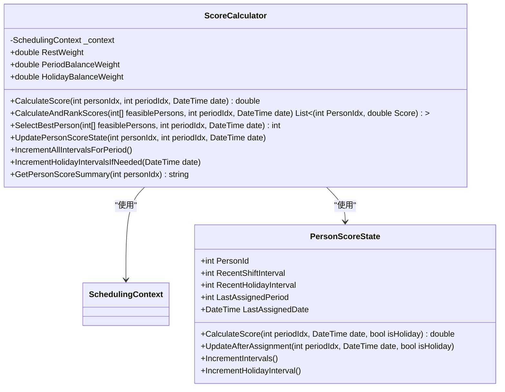

# 排班执行

<cite>
**本文档中引用的文件**  
- [SchedulingService.cs](file://Services/SchedulingService.cs)
- [GreedyScheduler.cs](file://SchedulingEngine/GreedyScheduler.cs)
- [SchedulingContext.cs](file://SchedulingEngine/Core/SchedulingContext.cs)
- [FeasibilityTensor.cs](file://SchedulingEngine/Core/FeasibilityTensor.cs)
- [MRVStrategy.cs](file://SchedulingEngine/Strategies/MRVStrategy.cs)
- [ScoreCalculator.cs](file://SchedulingEngine/Core/ScoreCalculator.cs)
- [ScheduleDto.cs](file://DTOs/ScheduleDto.cs)
</cite>

## 目录
1. [引言](#引言)
2. [排班请求与响应结构](#排班请求与响应结构)
3. [ExecuteSchedulingAsync方法执行流程](#executeschedulingasync方法执行流程)
4. [排班上下文构建](#排班上下文构建)
5. [可行性张量初始化与约束应用](#可行性张量初始化与约束应用)
6. [MRV策略的应用](#mrv策略的应用)
7. [软约束评分机制](#软约束评分机制)
8. [CancellationToken的使用](#cancellationtoken的使用)
9. [排班参数影响分析](#排班参数影响分析)
10. [典型调用场景示例](#典型调用场景示例)

## 引言
本文档详细阐述了`ExecuteSchedulingAsync`方法的完整执行流程，从接收`SchedulingRequestDto`请求到返回`ScheduleDto`的全过程。重点说明排班上下文（SchedulingContext）的构建、可行性张量（FeasibilityTensor）的初始化、MRV策略的应用以及软约束评分机制。同时提供`CancellationToken`在长时间排班计算中的正确使用示例，包括如何响应取消请求并清理资源。此外，解释排班请求中各参数（如人员列表、哨位列表、约束配置）如何影响最终排班结果，并给出典型调用场景的代码示例。

## 排班请求与响应结构
### 排班请求结构
`SchedulingRequestDto`类定义了排班请求所需的所有参数，包括排班表名称、开始日期、结束日期、参与人员ID列表、参与哨位ID列表、是否使用活动的休息日配置、启用的定岗规则ID列表、启用的手动指定ID列表以及休息日配置ID。

**Section sources**
- [ScheduleDto.cs](file://DTOs/ScheduleDto.cs#L220-L270)

### 排班响应结构
`ScheduleDto`类定义了排班结果的结构，包括排班ID、标题、人员ID列表、哨位ID列表、班次列表、创建时间、确认时间、开始日期、结束日期和冲突信息。

**Section sources**
- [ScheduleDto.cs](file://DTOs/ScheduleDto.cs#L1-L219)

## ExecuteSchedulingAsync方法执行流程
`ExecuteSchedulingAsync`方法是排班服务的核心方法，负责处理排班请求并生成排班结果。该方法的执行流程如下：

1. **请求验证**：首先对传入的`SchedulingRequestDto`进行基本验证，确保所有必填字段都已提供且符合业务规则。
2. **基础数据加载**：并行加载参与人员、哨位和技能信息。
3. **排班上下文构建**：根据请求参数和加载的基础数据构建`SchedulingContext`对象。
4. **排班算法执行**：使用`GreedyScheduler`执行排班算法，生成排班结果。
5. **结果保存与映射**：将生成的排班结果保存至缓冲区，并映射为`ScheduleDto`返回给调用方。


**Diagram sources**
- [SchedulingService.cs](file://Services/SchedulingService.cs#L57-L140)
- [GreedyScheduler.cs](file://SchedulingEngine/GreedyScheduler.cs#L50-L489)

## 排班上下文构建
`SchedulingContext`类是排班算法的核心数据结构，包含了排班所需的所有数据和映射关系。在`ExecuteSchedulingAsync`方法中，首先通过并行加载基础数据，然后根据请求参数和加载的数据构建`SchedulingContext`对象。


**Diagram sources**
- [SchedulingContext.cs](file://SchedulingEngine/Core/SchedulingContext.cs#L1-L157)

## 可行性张量初始化与约束应用
`FeasibilityTensor`类是一个三维布尔张量，用于快速判断某个分配方案是否可行。在`GreedyScheduler`的`ExecuteAsync`方法中，首先初始化`FeasibilityTensor`，然后应用所有硬约束条件。


**Diagram sources**
- [GreedyScheduler.cs](file://SchedulingEngine/GreedyScheduler.cs#L150-L220)
- [FeasibilityTensor.cs](file://SchedulingEngine/Core/FeasibilityTensor.cs#L1-L570)

## MRV策略的应用
MRV（Minimum Remaining Values）策略是一种启发式算法，优先选择候选人员最少的哨位-时段进行分配，以减少无解的风险。在`GreedyScheduler`中，`MRVStrategy`类实现了这一策略。


**Diagram sources**
- [MRVStrategy.cs](file://SchedulingEngine/Strategies/MRVStrategy.cs#L1-L270)
- [FeasibilityTensor.cs](file://SchedulingEngine/Core/FeasibilityTensor.cs#L1-L570)

## 软约束评分机制
软约束评分机制通过`ScoreCalculator`类实现，用于计算人员在特定时段和日期的综合得分。得分越高，表示该人员在该时段和日期的排班优先级越高。



**Diagram sources**
- [ScoreCalculator.cs](file://SchedulingEngine/Core/ScoreCalculator.cs#L1-L163)
- [SchedulingContext.cs](file://SchedulingEngine/Core/SchedulingContext.cs#L1-L157)

## CancellationToken的使用
`CancellationToken`用于在长时间排班计算中响应取消请求。在`ExecuteSchedulingAsync`方法中，每个关键步骤都会检查`cancellationToken`是否已被取消，如果已取消则立即抛出`OperationCanceledException`。


**Diagram sources**
- [SchedulingService.cs](file://Services/SchedulingService.cs#L57-L140)
- [GreedyScheduler.cs](file://SchedulingEngine/GreedyScheduler.cs#L50-L489)

## 排班参数影响分析
### 人员列表
人员列表决定了参与排班的人员范围。系统会验证所有指定的人员ID是否存在且可用。如果人员数量不足，可能会导致排班失败。

### 哨位列表
哨位列表决定了需要排班的哨位范围。系统会验证所有指定的哨位ID是否存在。如果哨位有技能要求，系统还会验证是否有人员能够胜任。

### 约束配置
约束配置包括休息日配置、定岗规则和手动指定。这些配置直接影响排班结果的可行性。例如，休息日配置决定了哪些日期是休息日，定岗规则强制某些人员必须在特定哨位上哨，手动指定则预先确定某些班次的人员。

**Section sources**
- [SchedulingService.cs](file://Services/SchedulingService.cs#L57-L140)

## 典型调用场景示例
以下是一个典型的`ExecuteSchedulingAsync`方法调用示例：

```csharp
var request = new SchedulingRequestDto
{
    Title = "周排班",
    StartDate = DateTime.Today,
    EndDate = DateTime.Today.AddDays(6),
    PersonnelIds = new List<int> { 1, 2, 3, 4, 5 },
    PositionIds = new List<int> { 101, 102, 103 },
    UseActiveHolidayConfig = true,
    EnabledFixedRuleIds = new List<int> { 1, 2 },
    EnabledManualAssignmentIds = new List<int> { 1001 }
};

using var cts = new CancellationTokenSource(TimeSpan.FromMinutes(5));
try
{
    var result = await schedulingService.ExecuteSchedulingAsync(request, cts.Token);
    Console.WriteLine($"排班成功，生成了{result.Shifts.Count}个班次");
}
catch (OperationCanceledException)
{
    Console.WriteLine("排班被取消");
}
catch (Exception ex)
{
    Console.WriteLine($"排班失败: {ex.Message}");
}
```

**Section sources**
- [SchedulingService.cs](file://Services/SchedulingService.cs#L57-L140)