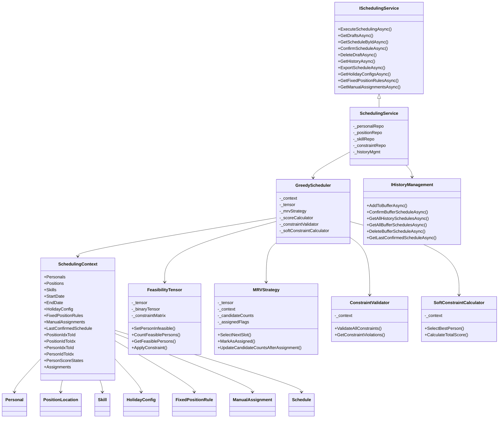

# 排班服务API

<cite>
**本文档引用文件**   
- [ISchedulingService.cs](file://Services/Interfaces/ISchedulingService.cs)
- [SchedulingService.cs](file://Services/SchedulingService.cs)
- [SchedulingViewModel.cs](file://ViewModels/Scheduling/SchedulingViewModel.cs)
- [GreedyScheduler.cs](file://SchedulingEngine/GreedyScheduler.cs)
- [SchedulingContext.cs](file://SchedulingEngine/Core/SchedulingContext.cs)
- [ConstraintValidator.cs](file://SchedulingEngine/Core/ConstraintValidator.cs)
- [SoftConstraintCalculator.cs](file://SchedulingEngine/Core/SoftConstraintCalculator.cs)
- [FeasibilityTensor.cs](file://SchedulingEngine/Core/FeasibilityTensor.cs)
- [MRVStrategy.cs](file://SchedulingEngine/Strategies/MRVStrategy.cs)
- [HistoryManagement.cs](file://History/HIstoryManagement.cs)
- [Schedule.cs](file://Models/Schedule.cs)
- [ScheduleDto.cs](file://DTOs/ScheduleDto.cs)
</cite>

## 目录
1. [接口概述](#接口概述)
2. [核心方法工作机制](#核心方法工作机制)
3. [排班引擎集成方法](#排班引擎集成方法)
4. [调用链路示例](#调用链路示例)
5. [CancellationToken使用](#cancellationtoken使用)
6. [批量操作性能考量](#批量操作性能考量)
7. [草稿清理策略](#草稿清理策略)
8. [架构设计](#架构设计)

## 接口概述

`ISchedulingService` 接口是排班系统的核心服务契约，定义了排班生成、管理、查询和导出的完整功能集。该接口遵循异步编程模式，所有方法均返回 `Task` 或 `Task<T>` 类型，确保UI线程不被阻塞。接口设计遵循单一职责原则，将排班相关的所有操作集中管理。

接口主要分为三大功能模块：
- **排班生命周期管理**：包括 `ExecuteSchedulingAsync`、`ConfirmScheduleAsync`、`DeleteDraftAsync` 等方法，负责排班的创建、确认和删除
- **数据查询与检索**：包括 `GetDraftsAsync`、`GetScheduleByIdAsync`、`GetHistoryAsync` 等方法，提供对草稿和历史排班的访问
- **排班引擎集成**：包括 `GetHolidayConfigsAsync`、`GetFixedPositionRulesAsync` 等方法，为前端向导提供约束配置数据

**Section sources**
- [ISchedulingService.cs](file://Services/Interfaces/ISchedulingService.cs#L12-L87)

## 核心方法工作机制

### ExecuteSchedulingAsync 方法

`ExecuteSchedulingAsync` 方法是排班系统的核心，负责执行完整的排班算法。该方法接收 `SchedulingRequestDto` 请求对象和可选的 `CancellationToken`，返回生成的 `ScheduleDto`。

方法执行流程如下：
1. **请求验证**：验证请求参数的完整性和业务逻辑，包括排班标题、日期范围、人员和哨位选择等
2. **并行数据加载**：使用 `Task.WhenAll` 并行加载人员、哨位和技能等基础数据
3. **上下文构建**：创建 `SchedulingContext` 对象，包含所有排班所需的数据和配置
4. **约束加载**：根据请求配置加载休息日配置、定岗规则和手动指定等约束条件
5. **算法执行**：实例化 `GreedyScheduler` 并执行排班算法
6. **结果保存**：将生成的排班结果保存到缓冲区（草稿）
7. **DTO映射**：将模型对象映射为DTO对象返回

该方法实现了完整的业务规则验证，包括人员可用性、技能匹配、人员与哨位数量比例等，确保排班请求的合理性。

**Section sources**
- [SchedulingService.cs](file://Services/SchedulingService.cs#L100-L250)

### GetDraftsAsync 方法

`GetDraftsAsync` 方法用于获取所有草稿排班的摘要列表。该方法从 `IHistoryManagement` 服务获取所有缓冲区排班，然后将每个排班转换为 `ScheduleSummaryDto` 对象。

转换过程包括：
- 提取排班ID、标题、日期范围等基本信息
- 计算参与人员数量、哨位数量和班次数量
- 设置创建时间和确认时间（草稿的确认时间为null）

该方法返回一个 `List<ScheduleSummaryDto>`，便于前端列表展示。

**Section sources**
- [SchedulingService.cs](file://Services/SchedulingService.cs#L252-L265)

### GetScheduleByIdAsync 方法

`GetScheduleByIdAsync` 方法根据ID获取排班详情，支持草稿和历史排班。该方法首先尝试在缓冲区中查找指定ID的排班，如果未找到则在历史记录中查找。

查找逻辑：
1. 从 `IHistoryManagement` 获取所有缓冲区排班
2. 查找与指定ID匹配的缓冲区项
3. 如果找到，使用 `MapToScheduleDtoAsync` 方法映射为DTO对象
4. 如果未找到，从历史记录中查找
5. 返回匹配的排班DTO或null

该方法实现了统一的排班详情访问接口，无需区分草稿和历史排班。

**Section sources**
- [SchedulingService.cs](file://Services/SchedulingService.cs#L267-L295)

### ConfirmScheduleAsync 方法

`ConfirmScheduleAsync` 方法用于确认草稿排班，将其转为历史记录。该方法首先验证指定ID的草稿是否存在，然后进行确认前的最终业务规则验证。

确认流程：
1. 查找指定ID的缓冲区排班
2. 验证排班结果的合规性，包括关键时段分配和人员工作量
3. 调用 `IHistoryManagement.ConfirmBufferScheduleAsync` 完成确认
4. 确认后自动清空其他所有草稿

该方法确保只有符合业务规则的排班才能被确认，维护了排班质量。

**Section sources**
- [SchedulingService.cs](file://Services/SchedulingService.cs#L297-L315)

### DeleteDraftAsync 方法

`DeleteDraftAsync` 方法用于删除指定ID的草稿排班。该方法首先查找指定ID的缓冲区排班，如果存在则调用 `IHistoryManagement.DeleteBufferScheduleAsync` 删除。

删除操作是幂等的，如果指定ID的草稿不存在，方法将静默返回而不抛出异常。

**Section sources**
- [SchedulingService.cs](file://Services/SchedulingService.cs#L317-L327)

### GetHistoryAsync 方法

`GetHistoryAsync` 方法获取历史排班记录，支持按日期范围过滤。该方法从 `IHistoryManagement` 获取所有历史排班，然后根据可选的开始日期和结束日期进行过滤。

过滤逻辑：
- 如果提供了开始日期，过滤出确认时间大于等于该日期的排班
- 如果提供了结束日期，过滤出确认时间小于等于该日期的排班
- 按确认时间降序排列

返回的每个历史排班都包含完整的摘要信息。

**Section sources**
- [SchedulingService.cs](file://Services/SchedulingService.cs#L329-L350)

### ExportScheduleAsync 方法

`ExportScheduleAsync` 方法用于导出指定排班表。目前支持Excel和CSV格式导出。

导出流程：
1. 调用 `GetScheduleByIdAsync` 获取排班详情
2. 根据格式参数调用相应的生成方法
3. 对于CSV/Excel格式，调用 `GenerateCsvAsync` 生成CSV内容
4. 返回字节数组形式的导出数据

`GenerateCsvAsync` 方法构建了标准的CSV格式，第一行为日期标题，后续每行为一个哨位的数据。

**Section sources**
- [SchedulingService.cs](file://Services/SchedulingService.cs#L352-L420)

## 排班引擎集成方法

### 前端向导协作方式

排班服务提供了多个方法供前端向导加载约束配置数据，实现前后端的紧密协作：


**Diagram sources**
- [SchedulingViewModel.cs](file://ViewModels/Scheduling/SchedulingViewModel.cs#L240-L280)
- [SchedulingService.cs](file://Services/SchedulingService.cs#L550-L555)

### GetHolidayConfigsAsync 方法

`GetHolidayConfigsAsync` 方法获取全部休息日配置列表，供前端向导选择。该方法直接委托给 `IConstraintRepository` 的 `GetAllHolidayConfigsAsync` 方法。

前端向导使用此方法填充休息日配置下拉框，用户可以选择使用活动配置或自定义配置。

**Section sources**
- [SchedulingService.cs](file://Services/SchedulingService.cs#L550-L552)

### GetFixedPositionRulesAsync 方法

`GetFixedPositionRulesAsync` 方法获取全部定岗规则，支持可选的启用状态过滤。该方法允许前端向导加载所有定岗规则，并根据 `enabledOnly` 参数决定是否只返回启用的规则。

在向导界面中，这些规则以复选框列表形式展示，用户可以启用或禁用特定规则。

**Section sources**
- [SchedulingService.cs](file://Services/SchedulingService.cs#L553-L555)

### GetManualAssignmentsAsync 方法

`GetManualAssignmentsAsync` 方法获取指定日期范围内的手动指定，支持启用状态过滤。该方法特别适用于向导的第4步，根据用户选择的日期范围加载相关手动指定。

前端向导使用此方法确保只显示与当前排班周期相关的手动指定，提高用户体验。

**Section sources**
- [SchedulingService.cs](file://Services/SchedulingService.cs#L556-L558)

## 调用链路示例

### 从SchedulingViewModel到GreedyScheduler的完整调用链路

以下是从 `SchedulingViewModel` 发起排班请求到 `GreedyScheduler` 完成计算的完整调用链路：


**Diagram sources**
- [SchedulingViewModel.cs](file://ViewModels/Scheduling/SchedulingViewModel.cs#L295-L306)
- [SchedulingService.cs](file://Services/SchedulingService.cs#L100-L250)
- [GreedyScheduler.cs](file://SchedulingEngine/GreedyScheduler.cs#L90-L250)

## CancellationToken使用

`CancellationToken` 在排班服务中被正确使用，确保长时间运行的排班操作可以被取消。

### 使用位置

1. **接口定义**：`ExecuteSchedulingAsync` 方法的参数中包含可选的 `CancellationToken`
2. **方法实现**：在关键执行点调用 `ThrowIfCancellationRequested`
3. **算法执行**：`GreedyScheduler.ExecuteAsync` 方法在每个处理阶段检查取消请求

### 典型使用模式

```csharp
public async Task<ScheduleDto> ExecuteSchedulingAsync(SchedulingRequestDto request, CancellationToken cancellationToken = default)
{
    // 在关键执行点检查取消
    cancellationToken.ThrowIfCancellationRequested();
    
    // 执行业务逻辑
    await ValidateSchedulingRequestBusinessLogicAsync(request);
    
    // 再次检查取消
    cancellationToken.ThrowIfCancellationRequested();
    
    // 继续执行...
}
```

### 调用示例

在 `SchedulingViewModel` 中，`ExecuteSchedulingAsync` 命令使用 `CancellationTokenSource` 管理取消：

```csharp
private async Task ExecuteSchedulingAsync()
{
    var cts = new CancellationTokenSource();
    _progressDialog = _dialogService.ShowLoadingDialog("正在生成排班，请稍候...", cts);
    
    try
    {
        var schedule = await _schedulingService.ExecuteSchedulingAsync(request, cts.Token);
        // 处理结果
    }
    catch (OperationCanceledException)
    {
        await _dialogService.ShowWarningAsync("排班生成已取消");
    }
    finally
    {
        _progressDialog?.Hide();
        _progressDialog = null;
    }
}
```

这种模式确保用户可以在任何时候取消排班生成操作，提升用户体验。

**Section sources**
- [SchedulingService.cs](file://Services/SchedulingService.cs#L100-L250)
- [SchedulingViewModel.cs](file://ViewModels/Scheduling/SchedulingViewModel.cs#L295-L340)

## 批量操作性能考量

### ConfirmMultipleSchedulesAsync 方法

`ConfirmMultipleSchedulesAsync` 方法实现了批量确认多个草稿排班的功能，考虑了以下性能因素：

1. **批量验证**：一次性加载所有缓冲区排班，避免多次数据库查询
2. **顺序处理**：按创建时间顺序确认，确保业务逻辑的一致性
3. **事务管理**：每个确认操作在独立的事务中执行，避免长时间锁定
4. **错误处理**：在确认前验证每个排班，提前发现并报告所有问题

### 性能优化策略

1. **并行数据加载**：在 `ExecuteSchedulingAsync` 中使用 `Task.WhenAll` 并行加载人员、哨位和技能数据
2. **缓存映射**：`SchedulingContext` 中维护ID到索引的映射字典，避免重复查找
3. **增量更新**：`MRVStrategy` 使用候选计数缓存，避免重复计算
4. **二进制优化**：`FeasibilityTensor` 使用二进制存储和位运算优化性能

### 批量操作示例


**Diagram sources**
- [SchedulingService.cs](file://Services/SchedulingService.cs#L750-L780)

## 草稿清理策略

### CleanupExpiredDraftsAsync 方法

`CleanupExpiredDraftsAsync` 方法实现了草稿清理策略，支持可配置的保留天数。

方法逻辑：
1. 获取所有缓冲区排班
2. 计算过期时间点（当前时间减去保留天数）
3. 筛选出创建时间早于过期时间点的草稿
4. 逐个删除过期草稿
5. 记录清理日志

### 配置选项

该方法接受 `daysToKeep` 参数，默认值为7天，支持以下配置：
- **短期保留**：设置较小的值（如3天），适用于频繁排班的场景
- **长期保留**：设置较大的值（如30天），适用于不频繁排班的场景
- **永久保留**：设置为0或负数，但不推荐，可能导致数据库膨胀

### 自动清理机制

虽然当前实现需要手动调用，但可以轻松扩展为自动清理：
1. 在应用启动时调用 `CleanupExpiredDraftsAsync`
2. 使用后台服务定期执行清理
3. 在每次 `GetDraftsAsync` 调用后自动清理

### 清理策略示例

```csharp
// 清理超过14天的草稿
await schedulingService.CleanupExpiredDraftsAsync(14);

// 清理超过30天的草稿
await schedulingService.CleanupExpiredDraftsAsync(30);
```

这种灵活的配置选项使系统能够适应不同的业务需求和存储策略。

**Section sources**
- [SchedulingService.cs](file://Services/SchedulingService.cs#L782-L810)

## 架构设计

### 整体架构

排班服务采用分层架构设计，各层职责清晰：


**Diagram sources**
- [SchedulingViewModel.cs](file://ViewModels/Scheduling/SchedulingViewModel.cs)
- [SchedulingService.cs](file://Services/SchedulingService.cs)
- [GreedyScheduler.cs](file://SchedulingEngine/GreedyScheduler.cs)
- [HistoryManagement.cs](file://History/HIstoryManagement.cs)

### 核心组件关系



**Diagram sources**
- [ISchedulingService.cs](file://Services/Interfaces/ISchedulingService.cs)
- [SchedulingService.cs](file://Services/SchedulingService.cs)
- [GreedyScheduler.cs](file://SchedulingEngine/GreedyScheduler.cs)
- [SchedulingContext.cs](file://SchedulingEngine/Core/SchedulingContext.cs)
- [FeasibilityTensor.cs](file://SchedulingEngine/Core/FeasibilityTensor.cs)
- [MRVStrategy.cs](file://SchedulingEngine/Strategies/MRVStrategy.cs)
- [ConstraintValidator.cs](file://SchedulingEngine/Core/ConstraintValidator.cs)
- [SoftConstraintCalculator.cs](file://SchedulingEngine/Core/SoftConstraintCalculator.cs)
- [HistoryManagement.cs](file://History/HIstoryManagement.cs)