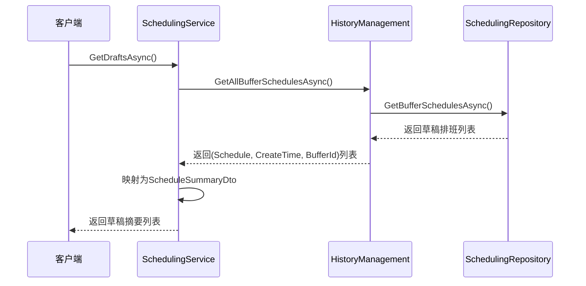
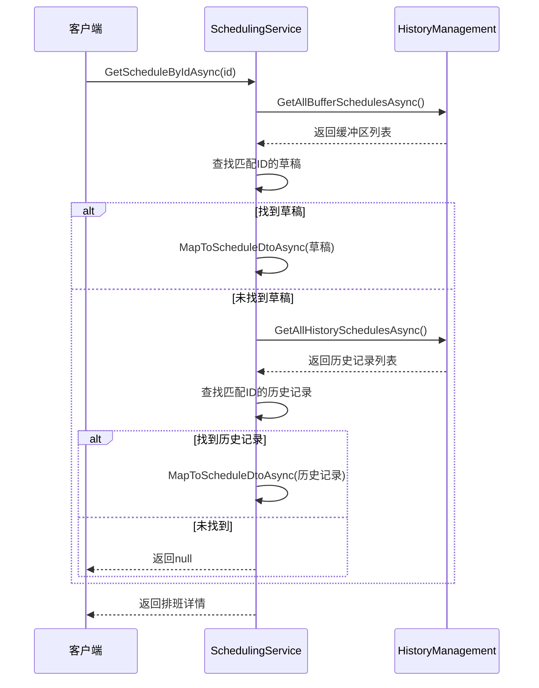
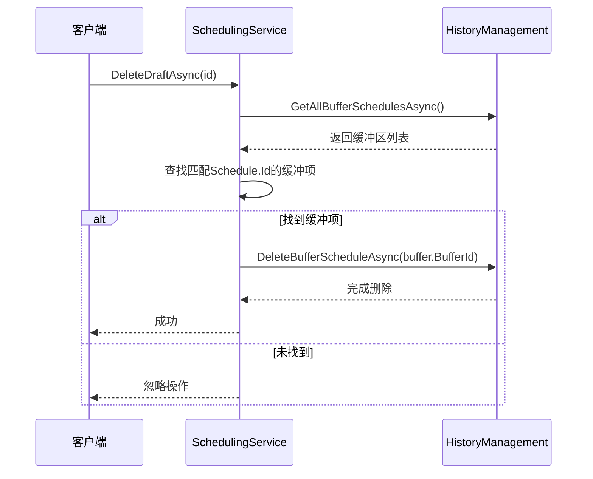
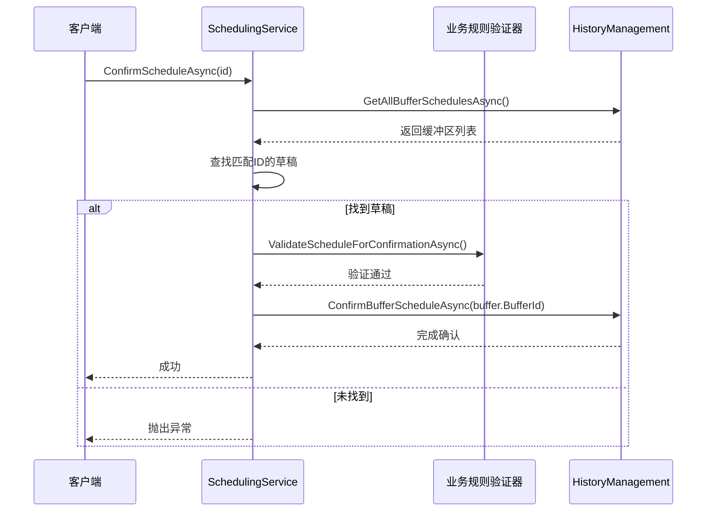
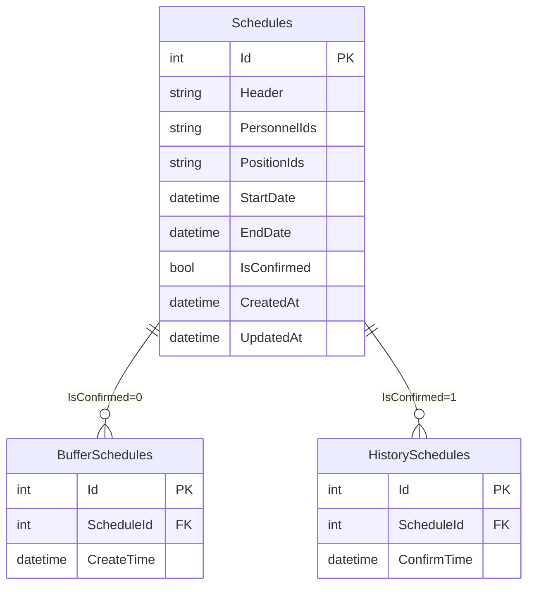
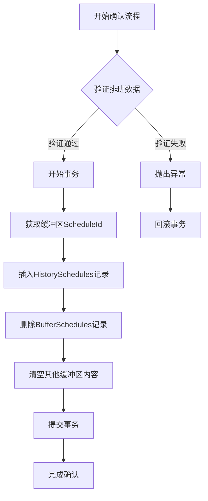
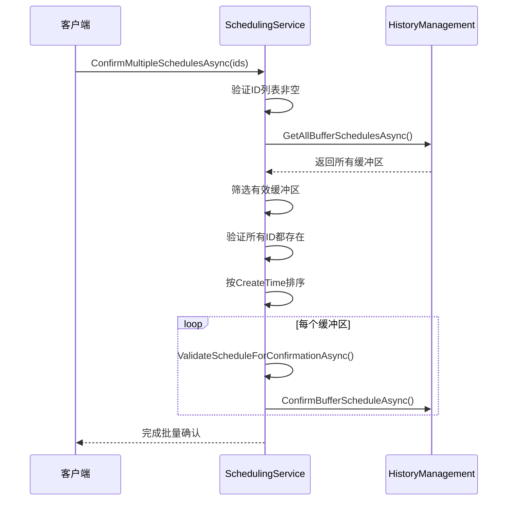
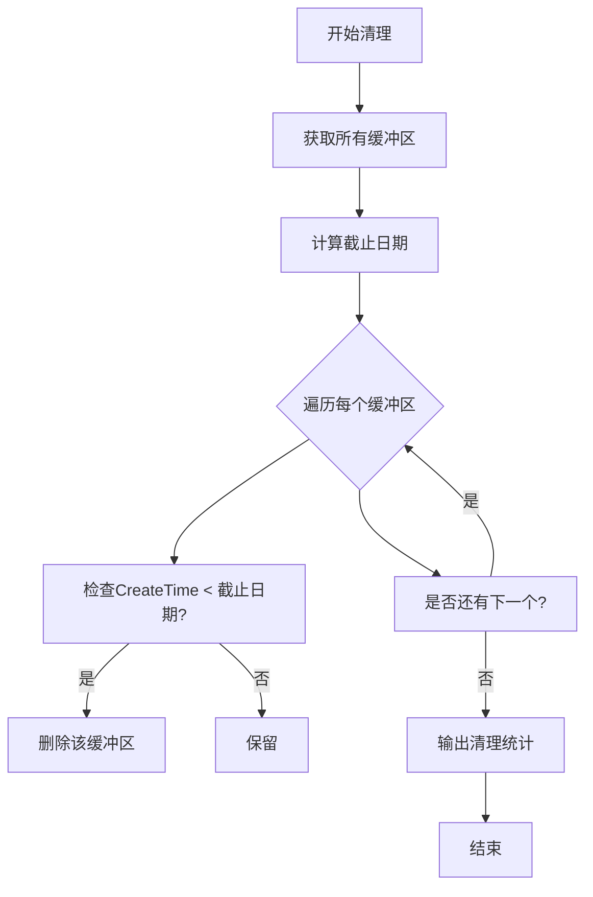

# 草稿管理

<cite>
**本文档引用的文件**  
- [SchedulingService.cs](file://Services/SchedulingService.cs)
- [SchedulingRepository.cs](file://Data/SchedulingRepository.cs)
- [HIstoryManagement.cs](file://History/HIstoryManagement.cs)
- [Schedule.cs](file://Models/Schedule.cs)
- [ISchedulingService.cs](file://Services/Interfaces/ISchedulingService.cs)
- [ISchedulingRepository.cs](file://Data/Interfaces/ISchedulingRepository.cs)
- [IHistoryManagement.cs](file://History/IHistoryManagement.cs)
</cite>

## 目录
1. [引言](#引言)
2. [核心方法实现机制](#核心方法实现机制)
3. [草稿状态存储与查询优化](#草稿状态存储与查询优化)
4. [草稿与历史记录转换逻辑](#草稿与历史记录转换逻辑)
5. [批量操作最佳实践](#批量操作最佳实践)
6. [过期草稿清理策略](#过期草稿清理策略)
7. [结论](#结论)

## 引言
本文档深入解析草稿管理相关方法的实现机制，包括 `GetDraftsAsync`、`GetScheduleByIdAsync`、`DeleteDraftAsync` 和 `ConfirmScheduleAsync`。详细说明草稿在数据库中的存储方式、查询性能优化策略以及草稿与历史记录之间的转换逻辑。同时提供批量操作（如批量确认、批量删除）的最佳实践，涵盖异常处理和事务管理。最后，详细阐述 `CleanupExpiredDraftsAsync` 方法的配置选项及其对系统存储的影响，并给出自动化清理任务的配置建议。

## 核心方法实现机制

### GetDraftsAsync 方法
该方法用于获取所有未确认的草稿排班列表。它通过调用 `_historyMgmt.GetAllBufferSchedulesAsync()` 获取所有缓冲区中的排班数据，并将其映射为 `ScheduleSummaryDto` 对象列表返回。



**图示来源**  
- [SchedulingService.cs](file://Services/SchedulingService.cs#L142-L157)
- [HIstoryManagement.cs](file://History/HIstoryManagement.cs#L220-L247)
- [SchedulingRepository.cs](file://Data/SchedulingRepository.cs#L300-L324)

### GetScheduleByIdAsync 方法
该方法根据ID获取指定排班的详细信息，支持从草稿或历史记录中查找。首先尝试在缓冲区中查找，若未找到则在历史记录中搜索。



**图示来源**  
- [SchedulingService.cs](file://Services/SchedulingService.cs#L159-L175)
- [HIstoryManagement.cs](file://History/HIstoryManagement.cs#L220-L270)

### DeleteDraftAsync 方法
该方法用于删除指定ID的草稿排班。通过缓冲区ID执行删除操作，确保数据一致性。



**图示来源**  
- [SchedulingService.cs](file://Services/SchedulingService.cs#L192-L196)
- [HIstoryManagement.cs](file://History/HIstoryManagement.cs#L334-L361)

### ConfirmScheduleAsync 方法
该方法将指定草稿排班确认为正式历史记录。在确认前会进行业务规则验证。



**图示来源**  
- [SchedulingService.cs](file://Services/SchedulingService.cs#L177-L190)
- [HIstoryManagement.cs](file://History/HIstoryManagement.cs#L249-L270)

## 草稿状态存储与查询优化

### 数据库存储结构
草稿状态通过 `Schedules` 表的 `IsConfirmed` 字段区分（0=草稿，1=已确认）。同时使用独立的 `BufferSchedules` 和 `HistorySchedules` 表记录创建/确认时间。



**图示来源**  
- [SchedulingRepository.cs](file://Data/SchedulingRepository.cs#L15-L45)
- [HIstoryManagement.cs](file://History/HIstoryManagement.cs#L35-L55)

### 查询性能优化策略
1. **索引优化**：在 `Schedules.IsConfirmed` 字段上建立索引，加速草稿/历史记录的筛选。
2. **分页查询**：`GetBufferSchedulesAsync` 按 `CreatedAt DESC` 排序，优先返回最新草稿。
3. **批量加载**：一次性获取所有缓冲区数据，减少数据库往返次数。
4. **JSON存储**：`PersonnelIds` 和 `PositionIds` 使用JSON格式存储，避免关联查询。

**代码来源**  
- [SchedulingRepository.cs](file://Data/SchedulingRepository.cs#L300-L324)
- [HIstoryManagement.cs](file://History/HIstoryManagement.cs#L220-L247)

## 草稿与历史记录转换逻辑

### 转换流程
草稿转历史记录的过程涉及多个步骤，确保数据完整性和一致性：



**图示来源**  
- [HIstoryManagement.cs](file://History/HIstoryManagement.cs#L249-L270)

### 数据一致性保障
- **事务管理**：整个确认过程在数据库事务中执行，确保原子性。
- **外键约束**：使用 `ON DELETE CASCADE` 确保主从表数据一致性。
- **时间戳更新**：确认时更新 `UpdatedAt` 时间戳。
- **缓冲区清理**：确认后清空所有缓冲区内容，防止重复确认。

**代码来源**  
- [HIstoryManagement.cs](file://History/HIstoryManagement.cs#L249-L270)
- [SchedulingRepository.cs](file://Data/SchedulingRepository.cs#L375-L384)

## 批量操作最佳实践

### 批量确认（ConfirmMultipleSchedulesAsync）
批量确认多个草稿排班，按创建时间顺序处理，确保操作有序性。



**异常处理**：
- 输入验证：检查ID列表是否为空
- 存在性验证：确保所有ID对应的草稿存在
- 业务规则验证：逐个验证排班数据有效性
- 事务性：每个确认操作独立，但整体按顺序执行

**代码来源**  
- [SchedulingService.cs](file://Services/SchedulingService.cs#L699-L725)

### 批量删除最佳实践
虽然未直接提供批量删除方法，但可通过循环调用 `DeleteDraftAsync` 实现：

```csharp
public async Task DeleteMultipleDraftsAsync(List<int> draftIds)
{
    foreach (var id in draftIds)
    {
        try
        {
            await DeleteDraftAsync(id);
        }
        catch (Exception ex)
        {
            // 记录单个删除失败，但继续处理其他项
            _logger.LogWarning($"删除草稿 {id} 失败: {ex.Message}");
        }
    }
}
```

**最佳实践建议**：
1. **分批处理**：对于大量删除，建议分批次进行，避免长时间事务。
2. **错误容忍**：单个删除失败不应中断整体流程。
3. **日志记录**：记录每个操作的结果，便于追踪和审计。
4. **权限验证**：确保调用者有权限删除指定草稿。

## 过期草稿清理策略

### CleanupExpiredDraftsAsync 方法
该方法用于清理过期的草稿排班，支持配置保留天数。



**参数说明**：
- `daysToKeep`：保留天数，默认7天
- 使用 `DateTime.UtcNow.AddDays(-daysToKeep)` 计算截止日期
- 清理后输出调试信息，记录清理数量

**代码来源**  
- [SchedulingService.cs](file://Services/SchedulingService.cs#L727-L749)

### 配置选项与系统影响
| 配置项 | 推荐值 | 存储影响 | 性能影响 |
|--------|--------|----------|----------|
| daysToKeep = 3 | 短期保留 | 最小存储占用 | 频繁清理操作 |
| daysToKeep = 7 | 平衡选择 | 适中存储占用 | 适中清理频率 |
| daysToKeep = 14 | 长期保留 | 较大存储占用 | 较少清理操作 |
| daysToKeep = 30 | 最大保留 | 最大存储占用 | 极少清理操作 |

**系统影响分析**：
- **存储空间**：保留天数越长，占用的数据库空间越大
- **查询性能**：缓冲区数据量影响 `GetDraftsAsync` 的响应时间
- **清理开销**：清理操作涉及数据库删除，可能影响并发性能
- **恢复能力**：较长的保留期提供更好的误操作恢复能力

### 自动化清理任务配置
建议通过定时任务定期执行清理操作：

```csharp
// 示例：每天凌晨2点执行清理
public void ConfigureScheduledTasks()
{
    // 每天执行一次，保留7天草稿
    ScheduleAsync(() => CleanupExpiredDraftsAsync(7))
        .ToRunEvery(1).Days()
        .At(2, 0);
    
    // 或每周执行一次，保留14天草稿
    ScheduleAsync(() => CleanupExpiredDraftsAsync(14))
        .ToRunEvery(7).Days()
        .At(2, 0);
}
```

**配置建议**：
1. **执行时间**：选择系统低峰期（如凌晨2点）
2. **执行频率**：根据草稿生成频率调整，通常每天或每周一次
3. **保留策略**：根据业务需求选择3-14天的保留期
4. **监控告警**：监控清理任务的执行情况和耗时
5. **日志记录**：记录每次清理的数量和耗时，便于分析

**代码来源**  
- [SchedulingService.cs](file://Services/SchedulingService.cs#L727-L749)
- [Tests\SchedulingServiceIntegrationTests.cs](file://Tests/SchedulingServiceIntegrationTests.cs#L292-L314)

## 结论
草稿管理系统通过 `SchedulingService`、`HistoryManagement` 和 `SchedulingRepository` 三个核心组件协同工作，实现了完整的草稿生命周期管理。系统采用分离式存储设计，通过 `IsConfirmed` 标志和独立的时间记录表，有效区分草稿与历史记录。批量操作支持事务性处理和异常容忍，确保数据一致性。过期清理策略提供了灵活的配置选项，可根据实际存储需求和性能要求进行调整。建议生产环境中配置每日自动清理任务，保留7-14天的草稿数据，在存储效率和用户体验之间取得平衡。