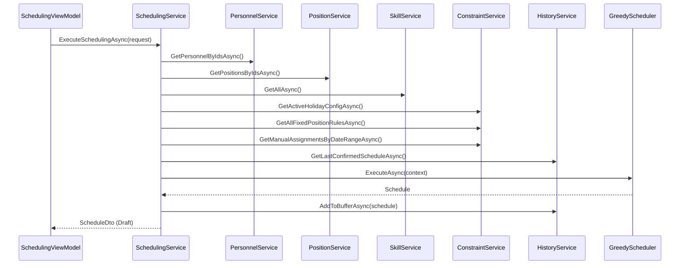
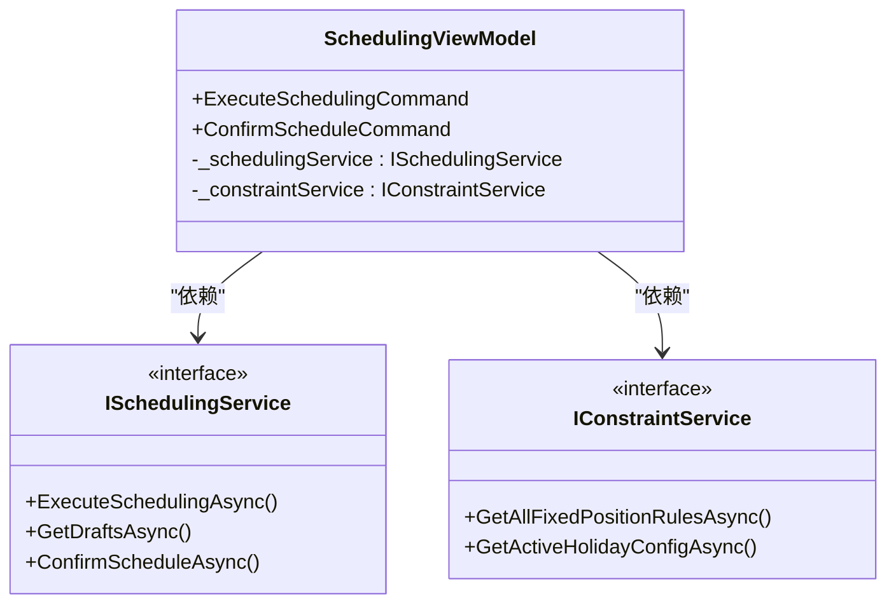

# 服务API

<cite>
**本文档中引用的文件**   
- [IApplicationService.cs](file://Services/Interfaces/IApplicationService.cs)
- [IConfigurationService.cs](file://Services/Interfaces/IConfigurationService.cs)
- [IConstraintService.cs](file://Services/Interfaces/IConstraintService.cs)
- [IHistoryService.cs](file://Services/Interfaces/IHistoryService.cs)
- [IPersonnelService.cs](file://Services/Interfaces/IPersonnelService.cs)
- [IPositionService.cs](file://Services/Interfaces/IPositionService.cs)
- [ISchedulingService.cs](file://Services/Interfaces/ISchedulingService.cs)
- [ISkillService.cs](file://Services/Interfaces/ISkillService.cs)
- [ITemplateService.cs](file://Services/Interfaces/ITemplateService.cs)
</cite>

## 目录
1. [简介](#简介)
2. [核心服务接口](#核心服务接口)
3. [服务依赖关系与调用顺序](#服务依赖关系与调用顺序)
4. [异步方法最佳实践与线程安全](#异步方法最佳实践与线程安全)
5. [错误处理模式](#错误处理模式)
6. [MVVM架构中的服务角色](#mvvm架构中的服务角色)

## 简介
本API文档详细说明了自动排班系统中的核心服务接口。这些服务构成了系统业务逻辑的基石，负责处理从人员、哨位、技能管理到复杂排班算法执行、历史记录维护以及模板化排班的全部功能。文档将逐一介绍`IApplicationService`、`IConfigurationService`、`IConstraintService`、`IHistoryService`、`IPersonnelService`、`IPositionService`、`ISchedulingService`、`ISkillService`和`ITemplateService`等接口，涵盖其方法签名、参数、返回值、异常及调用场景，并解释它们在MVVM架构中的作用。

## 核心服务接口

### IApplicationService: 应用程序服务基础接口
该接口定义了所有应用程序级别服务的生命周期管理方法。

**方法说明**:
- `Task InitializeAsync()`: 异步初始化服务，应在应用程序启动时调用。
- `Task CleanupAsync()`: 异步清理服务资源，应在应用程序关闭前调用。

**调用场景**: 所有实现此接口的服务都必须在应用启动和关闭时进行初始化和资源清理。

**Section sources**
- [IApplicationService.cs](file://Services/Interfaces/IApplicationService.cs#L7-L18)

### IConfigurationService: 配置服务接口
该接口继承自`IApplicationService`，用于管理应用程序的持久化配置。

**方法说明**:
- `T GetValue<T>(string key, T defaultValue)`: 根据键获取配置值，若不存在则返回默认值。
- `Task SetValueAsync<T>(string key, T value)`: 异步设置配置值并持久化。
- `bool ContainsKey(string key)`: 检查指定配置键是否存在。
- `Task RemoveAsync(string key)`: 异步移除指定的配置项。
- `Task ClearAsync()`: 异步清空所有配置。

**调用场景**: 用于存储和读取用户偏好设置、系统参数等。例如，保存窗口大小、主题颜色或默认排班周期。

**Section sources**
- [IApplicationService.cs](file://Services/Interfaces/IApplicationService.cs#L7-L18)
- [IConfigurationService.cs](file://Services/Interfaces/IConfigurationService.cs#L7-L43)

### IConstraintService: 约束管理服务接口
该服务负责管理排班过程中的所有业务约束，是确保排班结果合法性的核心。

**方法说明**:
- **定岗规则管理**: `CreateFixedPositionRuleAsync`, `GetAllFixedPositionRulesAsync`, `GetFixedPositionRulesByPersonAsync`, `UpdateFixedPositionRuleAsync`, `DeleteFixedPositionRuleAsync`。用于管理特定人员只能在特定哨位值班的规则。
- **手动指定管理**: `CreateManualAssignmentAsync`, `GetManualAssignmentsByDateRangeAsync`, `UpdateManualAssignmentAsync`, `DeleteManualAssignmentAsync`。用于为特定人员在特定日期和时段手动分配哨位。
- **休息日配置管理**: `CreateHolidayConfigAsync`, `GetActiveHolidayConfigAsync`, `GetAllHolidayConfigsAsync`, `UpdateHolidayConfigAsync`, `DeleteHolidayConfigAsync`。用于定义和管理休息日规则。
- **业务规则验证**: `ValidateFixedPositionRuleAsync`, `ValidateManualAssignmentAsync`, `IsHolidayAsync`。用于验证数据的有效性。
- **DTO方法**: 提供了一系列以DTO为参数或返回值的方法，便于与UI层集成。

**调用场景**: 在排班前，通过此服务加载所有约束；在创建或修改约束时调用相应的CRUD方法。

**Section sources**
- [IConstraintService.cs](file://Services/Interfaces/IConstraintService.cs#L11-L157)

### IHistoryService: 历史服务接口
该服务负责管理已确认的排班历史记录。

**方法说明**:
- `Task<IEnumerable<HistoryScheduleDto>> GetHistorySchedulesAsync(HistoryQueryOptions options)`: 根据查询选项获取历史排班列表。
- `Task<HistoryScheduleDetailDto> GetHistoryScheduleDetailAsync(int scheduleId)`: 获取指定历史排班的详细信息。
- `Task<Tuple<HistoryScheduleDetailDto, HistoryScheduleDetailDto>> GetSchedulesForComparisonAsync(int scheduleId1, int scheduleId2)`: 获取两个历史排班进行对比。

**调用场景**: 在“历史记录”页面中，用于展示和查询过往的排班表，并支持对比功能。

**Section sources**
- [IHistoryService.cs](file://Services/Interfaces/IHistoryService.cs#L7-L12)

### IPersonnelService: 人员服务接口
该服务负责管理所有人员信息。

**方法说明**:
- `Task<List<PersonnelDto>> GetAllAsync()`: 获取所有人员列表。
- `Task<PersonnelDto?> GetByIdAsync(int id)`: 根据ID获取单个人员。
- `Task<PersonnelDto> CreateAsync(CreatePersonnelDto dto)`: 创建新人员。
- `Task UpdateAsync(int id, UpdatePersonnelDto dto)`: 更新人员信息。
- `Task DeleteAsync(int id)`: 删除人员。
- `Task<List<PersonnelDto>> SearchAsync(string keyword)`: 根据关键字搜索人员。
- `Task<List<PersonnelDto>> GetAvailablePersonnelAsync()`: 获取所有可用（在职且可用）的人员。
- `Task<bool> ValidatePersonnelSkillsAsync(int personnelId, int positionId)`: 验证指定人员的技能是否满足指定哨位的要求。

**调用场景**: 在“人员管理”页面进行CRUD操作，或在排班前验证人员的可用性和技能匹配度。

**Section sources**
- [IPersonnelService.cs](file://Services/Interfaces/IPersonnelService.cs#L9-L50)

### IPositionService: 哨位服务接口
该服务负责管理所有哨位信息。

**方法说明**:
- `Task<List<PositionDto>> GetAllAsync()`: 获取所有哨位列表。
- `Task<PositionDto?> GetByIdAsync(int id)`: 根据ID获取单个哨位。
- `Task<PositionDto> CreateAsync(CreatePositionDto dto)`: 创建新哨位。
- `Task UpdateAsync(int id, UpdatePositionDto dto)`: 更新哨位信息。
- `Task DeleteAsync(int id)`: 删除哨位。
- `Task<List<PositionDto>> SearchAsync(string keyword)`: 根据关键字搜索哨位。
- `Task<bool> ValidatePositionDataAsync(PositionDto position)`: 验证哨位数据的完整性。

**调用场景**: 在“哨位管理”页面进行CRUD操作，或在创建排班时验证哨位的有效性。

**Section sources**
- [IPositionService.cs](file://Services/Interfaces/IPositionService.cs#L9-L45)

### ISchedulingService: 排班服务接口
该服务是整个系统的核心，负责执行排班算法和管理排班草稿。

**方法说明**:
- `Task<ScheduleDto> ExecuteSchedulingAsync(SchedulingRequestDto request, CancellationToken cancellationToken)`: 执行排班算法，生成排班结果。
- `Task<List<ScheduleSummaryDto>> GetDraftsAsync()`: 获取所有排班草稿列表。
- `Task<ScheduleDto?> GetScheduleByIdAsync(int id)`: 根据ID获取排班详情（草稿或历史）。
- `Task ConfirmScheduleAsync(int id)`: 将草稿排班确认为历史记录。
- `Task DeleteDraftAsync(int id)`: 删除排班草稿。
- `Task<List<ScheduleSummaryDto>> GetHistoryAsync(DateTime? startDate, DateTime? endDate)`: 获取历史排班记录。
- `Task<byte[]> ExportScheduleAsync(int id, string format)`: 导出指定排班表。
- `Task<List<HolidayConfig>> GetHolidayConfigsAsync()`: 获取全部休息日配置列表（供前端向导使用）。
- `Task<List<FixedPositionRule>> GetFixedPositionRulesAsync(bool enabledOnly)`: 获取全部定岗规则（供前端向导使用）。
- `Task<List<ManualAssignment>> GetManualAssignmentsAsync(DateTime startDate, DateTime endDate, bool enabledOnly)`: 获取指定日期范围内的手动指定（供前端向导使用）。
- `Task<Dictionary<string, object>> GetSchedulingEngineStatusAsync()`: 获取排班引擎状态信息。
- `Task<ScheduleStatisticsDto> GetScheduleStatisticsAsync()`: 获取排班统计信息。
- `Task ConfirmMultipleSchedulesAsync(List<int> scheduleIds)`: 批量确认多个草稿排班。
- `Task CleanupExpiredDraftsAsync(int daysToKeep)`: 清理过期的草稿排班。

**调用场景**: 在“创建排班”页面中，调用`ExecuteSchedulingAsync`生成排班；在“草稿箱”和“历史记录”页面中，调用相应方法进行管理。

**Section sources**
- [ISchedulingService.cs](file://Services/Interfaces/ISchedulingService.cs#L12-L87)

### ISkillService: 技能服务接口
该服务负责管理所有技能信息。

**方法说明**:
- `Task<List<SkillDto>> GetAllAsync()`: 获取所有技能列表。
- `Task<SkillDto?> GetByIdAsync(int id)`: 根据ID获取单个技能。
- `Task<SkillDto> CreateAsync(CreateSkillDto dto)`: 创建新技能。
- `Task UpdateAsync(int id, UpdateSkillDto dto)`: 更新技能信息。
- `Task DeleteAsync(int id)`: 删除技能。
- `Task<List<SkillDto>> SearchAsync(string keyword)`: 根据关键字搜索技能。
- `Task<List<SkillDto>> GetByIdsAsync(List<int> ids)`: 根据ID列表批量获取技能。
- `Task<SkillUsageInfo> CheckSkillUsageAsync(int skillId)`: 检查技能的使用情况。

**调用场景**: 在“技能管理”页面进行CRUD操作，或在删除技能前调用`CheckSkillUsageAsync`以防止误删。

**Section sources**
- [ISkillService.cs](file://Services/Interfaces/ISkillService.cs#L9-L50)

### ITemplateService: 排班模板服务接口
该服务负责管理排班模板，实现排班的复用。

**方法说明**:
- `Task<List<SchedulingTemplateDto>> GetAllAsync()`: 获取所有模板列表。
- `Task<SchedulingTemplateDto?> GetByIdAsync(int id)`: 根据ID获取单个模板。
- `Task<SchedulingTemplateDto> CreateAsync(CreateTemplateDto dto)`: 创建新模板。
- `Task UpdateAsync(int id, UpdateTemplateDto dto)`: 更新模板信息。
- `Task DeleteAsync(int id)`: 删除模板。
- `Task<SchedulingTemplateDto?> GetDefaultAsync()`: 获取默认模板。
- `Task<List<SchedulingTemplateDto>> GetByTypeAsync(string templateType)`: 根据类型获取模板。
- `Task<TemplateValidationResult> ValidateAsync(int templateId)`: 验证模板配置的有效性。
- `Task<ScheduleDto> UseTemplateAsync(UseTemplateDto dto)`: 使用模板创建新的排班。

**调用场景**: 在“模板管理”页面进行模板的CRUD操作，并在创建新排班时选择模板以快速生成。

**Section sources**
- [ITemplateService.cs](file://Services/Interfaces/ITemplateService.cs#L9-L55)

## 服务依赖关系与调用顺序
各服务之间存在明确的依赖关系，共同协作完成复杂的业务流程。

### SchedulingService协调流程
`SchedulingService`是排班流程的协调者，它在执行排班算法时会协调调用其他服务：
1.  **数据准备**: `SchedulingService`首先通过`IPersonnelService`、`IPositionService`和`ISkillService`并行加载参与排班的人员、哨位和技能数据。
2.  **约束加载**: 接着，它调用`IConstraintService`来获取当前活跃的休息日配置、定岗规则和指定日期范围内的手动指定。
3.  **历史参考**: 为了计算评分，`SchedulingService`会调用`IHistoryService`获取最近一次已确认的排班记录，作为计算人员工作量间隔的参考。
4.  **算法执行**: 将上述所有数据整合到`SchedulingContext`中，传递给排班引擎（`GreedyScheduler`）执行算法。
5.  **结果保存**: 排班结果首先作为草稿保存到`IHistoryService`管理的缓冲区中。
6.  **确认与归档**: 当用户确认排班后，`SchedulingService`再次调用`IHistoryService`，将草稿从缓冲区移动到历史记录中。

**Diagram sources**
- [ISchedulingService.cs](file://Services/Interfaces/ISchedulingService.cs#L12-L87)
- [SchedulingService.cs](file://Services/SchedulingService.cs#L12-L750)

## 异步方法最佳实践与线程安全
所有服务接口的方法均为异步（`async Task`），这是为了保证UI的响应性。

**最佳实践**:
- **始终使用`await`**: 调用服务方法时，必须使用`await`关键字，以避免死锁和确保异常能被正确抛出。
- **取消支持**: `ExecuteSchedulingAsync`方法接受`CancellationToken`，允许用户取消长时间运行的排班操作。
- **并行加载**: 在`SchedulingService`中，通过`Task.WhenAll`并行加载多个数据源，显著提高了性能。
- **线程安全**: `ConfigurationService`内部使用`lock`语句来确保对配置字典的读写操作是线程安全的，防止在多线程环境下出现数据竞争。

## 错误处理模式
系统采用了一致的错误处理模式，主要通过抛出`ArgumentException`、`InvalidOperationException`等标准异常来报告业务规则错误。

**常见错误场景**:
- **数据验证失败**: 如创建人员时姓名为空，会抛出`ArgumentException`。
- **业务规则冲突**: 如删除一个正在被使用的技能，会抛出`InvalidOperationException`。
- **资源不存在**: 如根据ID获取一个不存在的实体，通常返回`null`或抛出`InvalidOperationException`。
- **并发操作**: 服务内部通过锁机制处理并发，避免数据不一致。

**调用方应**捕获这些异常，并向用户展示友好的错误提示。

## MVVM架构中的服务角色
在MVVM架构中，这些服务是`ViewModel`与`Model`（数据层）之间的桥梁。

- **ViewModel的角色**: `ViewModel`（如`SchedulingViewModel`）负责处理用户交互、数据绑定和命令。它不直接访问数据库或执行复杂算法。
- **服务的角色**: `ViewModel`通过依赖注入获取服务实例，并调用服务的方法来执行业务逻辑。例如，`SchedulingViewModel`调用`ISchedulingService.ExecuteSchedulingAsync`来生成排班，而不是自己实现排班算法。
- **优势**: 这种分离使得`ViewModel`更轻量，业务逻辑可重用，并且易于进行单元测试。

**Diagram sources**
- [ISchedulingService.cs](file://Services/Interfaces/ISchedulingService.cs#L12-L87)
- [IConstraintService.cs](file://Services/Interfaces/IConstraintService.cs#L11-L157)
- [SchedulingViewModel.cs](file://ViewModels/Scheduling/SchedulingViewModel.cs#L1-L100)