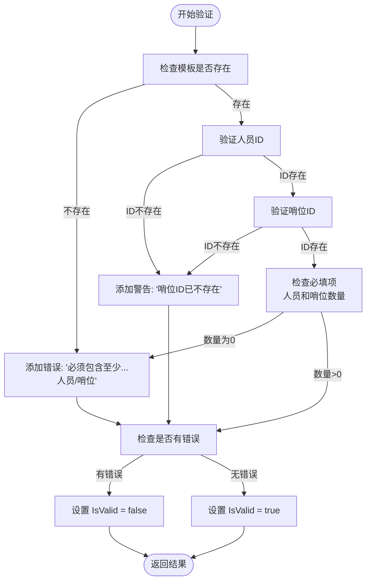
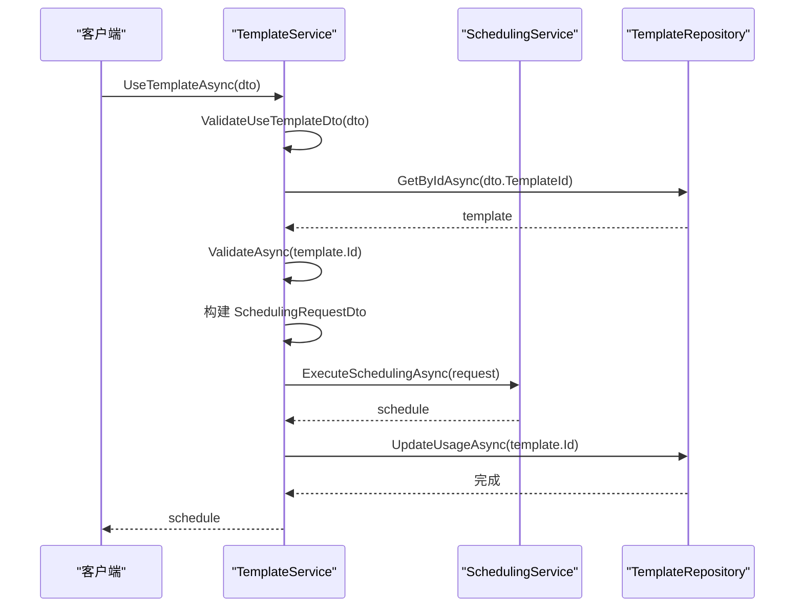
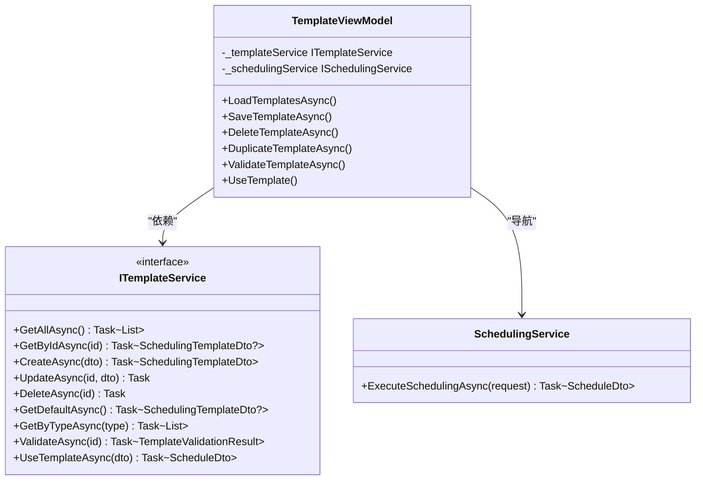

# 模板服务API

<cite>
**本文档引用的文件**
- [ITemplateService.cs](file://Services\Interfaces\ITemplateService.cs)
- [TemplateService.cs](file://Services\TemplateService.cs)
- [SchedulingTemplate.cs](file://Models\SchedulingTemplate.cs)
- [SchedulingTemplateDto.cs](file://DTOs\SchedulingTemplateDto.cs)
- [TemplateMapper.cs](file://DTOs\Mappers\TemplateMapper.cs)
- [ITemplateRepository.cs](file://Data\Interfaces\ITemplateRepository.cs)
- [SchedulingTemplateRepository.cs](file://Data\SchedulingTemplateRepository.cs)
- [TemplateViewModel.cs](file://ViewModels\Scheduling\TemplateViewModel.cs)
</cite>

## 目录
1. [接口概述](#接口概述)
2. [核心方法详解](#核心方法详解)
3. [模板验证机制](#模板验证机制)
4. [使用模板创建排班](#使用模板创建排班)
5. [模板版本管理与默认模板](#模板版本管理与默认模板)
6. [模板与约束配置的关联](#模板与约束配置的关联)
7. [在ViewModel中调用服务](#在viewmodel中调用服务)
8. [最佳实践与建议](#最佳实践与建议)

## 接口概述

`ITemplateService` 接口是排班系统的核心服务之一，负责管理排班模板的全生命周期。模板作为排班配置的预设方案，允许用户保存和复用特定的人员、哨位及约束配置组合，极大地提升了排班效率和用户体验。该接口通过定义一系列异步方法，实现了对模板的增删改查、验证和应用等操作。

**接口来源**
- [ITemplateService.cs](file://Services\Interfaces\ITemplateService.cs#L9-L55)

## 核心方法详解

### 获取所有模板 (GetAllAsync)
此方法返回系统中所有活动的模板列表，按使用次数降序和名称升序排列。它为用户提供了一个全局视图，便于浏览和选择现有模板。

### 根据ID获取模板 (GetByIdAsync)
根据提供的模板ID，获取单个模板的详细信息。此方法包含输入验证，确保ID有效，并在模板不存在时返回 `null`。

### 创建模板 (CreateAsync)
创建一个新模板。该方法执行严格的业务规则验证，包括：
- 模板名称不能为空且长度不超过100字符。
- 模板类型必须是 `regular`、`holiday` 或 `special` 之一。
- 必须包含至少一名人员和一个哨位。
- 人员和哨位ID必须在系统中存在。
- 模板名称在同类型中必须唯一。
- 如果新模板被设为默认，则会清除同类型中其他模板的默认标记。

### 更新模板 (UpdateAsync)
更新指定ID的现有模板。除了执行与创建模板相同的验证规则外，还确保更新后的名称在同类型中不与其他模板冲突（排除自身）。

### 删除模板 (DeleteAsync)
删除指定ID的模板。此操作是永久性的，仅当模板ID有效且存在时才会执行。

### 获取默认模板 (GetDefaultAsync)
获取当前类型中被标记为默认的模板。系统保证同类型中只有一个默认模板。

### 根据类型获取模板 (GetByTypeAsync)
根据指定的模板类型（`regular`、`holiday`、`special`）获取该类型下的所有模板。此方法用于对模板进行分类管理。

**核心方法来源**
- [ITemplateService.cs](file://Services\Interfaces\ITemplateService.cs#L9-L55)
- [TemplateService.cs](file://Services\TemplateService.cs#L25-L150)

## 模板验证机制

`ValidateAsync` 方法是确保模板数据完整性和有效性的关键。它执行以下验证步骤：

1.  **存在性检查**：首先确认模板ID对应的模板是否存在。
2.  **人员与哨位验证**：遍历模板中引用的人员和哨位ID，检查它们在数据库中是否仍然存在。如果不存在，会生成一条**警告**（Warning），但不会导致验证失败，因为模板本身仍被视为“有效”。
3.  **必填项检查**：验证模板是否至少包含一名人员和一个哨位。如果缺少，会生成一条**错误**（Error），并导致 `IsValid` 返回 `false`。

验证结果通过 `TemplateValidationResult` 对象返回，该对象包含 `IsValid` 标志、`Errors`、`Warnings` 和 `Infos` 列表。只有当存在错误时，模板才被视为无效。

**Diagram sources**
- [TemplateService.cs](file://Services\TemplateService.cs#L152-L206)
- [SchedulingTemplateDto.cs](file://DTOs\SchedulingTemplateDto.cs#L150-L180)

## 使用模板创建排班

`UseTemplateAsync` 方法是将模板配置应用于实际排班的核心流程。其内部执行步骤如下：

1.  **DTO验证**：首先对传入的 `UseTemplateDto` 进行验证，确保模板ID、排班名称、日期范围等参数有效。
2.  **获取模板**：根据ID从数据库中获取模板数据。
3.  **模板验证**：调用 `ValidateAsync` 方法对模板进行验证。如果验证结果包含**错误**，则抛出异常，阻止排班创建。
4.  **构建排班请求**：创建一个 `SchedulingRequestDto` 对象。其中，人员和哨位列表优先使用 `UseTemplateDto` 中的覆盖列表（`OverridePersonnelIds` 和 `OverridePositionIds`），若未提供则使用模板中的配置。
5.  **执行排班**：调用 `ISchedulingService.ExecuteSchedulingAsync` 方法，将构建好的请求传递给排班引擎，生成排班结果。
6.  **更新使用记录**：成功创建排班后，调用 `ITemplateRepository.UpdateUsageAsync` 方法，将模板的 `UsageCount` 加1，并更新 `LastUsedAt` 时间。

**Diagram sources**
- [TemplateService.cs](file://Services\TemplateService.cs#L211-L249)
- [SchedulingService.cs](file://Services\SchedulingService.cs#L12-L87)

## 模板版本管理与默认模板

### 模板版本管理建议
虽然当前系统未显式实现版本控制，但可以通过以下方式模拟版本管理：
- **命名约定**：在模板名称后添加版本号，如 "标准排班模板 v1.0"、"标准排班模板 v1.1"。
- **描述字段**：利用 `Description` 字段详细记录每次修改的内容和原因。
- **使用次数统计**：`UsageCount` 字段可作为衡量模板受欢迎程度和稳定性的指标，高使用次数的模板可视为“稳定版”。

### 默认模板的优先级处理逻辑
系统通过 `IsDefault` 布尔字段和 `ClearDefaultForTypeAsync` 方法来维护默认模板的唯一性。当创建或更新一个模板并将其 `IsDefault` 设为 `true` 时，服务会自动调用 `ClearDefaultForTypeAsync`，将同类型（`TemplateType`）下所有其他模板的 `IsDefault` 标记清除。这确保了在任何给定类型中，最多只有一个模板被标记为默认。

**Section sources**
- [TemplateService.cs](file://Services\TemplateService.cs#L77-L119)
- [SchedulingTemplateRepository.cs](file://Data\SchedulingTemplateRepository.cs#L300-L305)

## 模板与约束配置的关联

模板通过以下字段与系统的约束配置紧密关联：
- **休息日配置** (`HolidayConfigId` 和 `UseActiveHolidayConfig`)：模板可以指定一个特定的休息日配置，或选择使用当前活动的配置。
- **定岗规则** (`EnabledFixedRuleIds`)：模板可以启用一组定岗规则，这些规则在排班时会被应用。
- **手动指定** (`EnabledManualAssignmentIds`)：模板可以关联一组手动指定，确保在生成排班时保留这些特定的安排。

当使用模板创建排班时，这些关联的约束配置会被提取并包含在 `SchedulingRequestDto` 中，从而确保排班过程遵循模板预设的业务规则。

**Section sources**
- [SchedulingTemplate.cs](file://Models\SchedulingTemplate.cs#L10-L113)
- [TemplateService.cs](file://Services\TemplateService.cs#L211-L249)

## 在ViewModel中调用服务

`TemplateViewModel` 是 `ITemplateService` 的主要消费者，它在MVVM模式下封装了所有与模板相关的UI逻辑。

**Diagram sources**
- [TemplateViewModel.cs](file://ViewModels\Scheduling\TemplateViewModel.cs#L19-L495)
- [ITemplateService.cs](file://Services\Interfaces\ITemplateService.cs#L9-L55)

`TemplateViewModel` 通过其构造函数注入 `ITemplateService` 实例，并在其命令（如 `SaveTemplateCommand`、`DeleteTemplateCommand`、`ValidateTemplateCommand`）的执行方法中调用服务方法。例如，`ValidateTemplateAsync` 方法会调用 `ITemplateService.ValidateAsync` 并将结果展示给用户。`UseTemplate` 方法则通过 `NavigationService` 导航到排班创建页面，并将模板ID作为参数传递，从而启动基于模板的排班流程。

**Section sources**
- [TemplateViewModel.cs](file://ViewModels\Scheduling\TemplateViewModel.cs#L179-L205)

## 最佳实践与建议

1.  **模板命名规范**：采用清晰、一致的命名规则，便于识别和搜索。
2.  **合理使用默认模板**：为每种类型设置一个经过验证的默认模板，作为新用户的快速入门方案。
3.  **定期验证模板**：利用 `ValidateAsync` 方法定期检查模板的有效性，及时发现并修复因人员或哨位变更导致的警告。
4.  **利用覆盖功能**：在 `UseTemplateAsync` 时，通过 `OverridePersonnelIds` 和 `OverridePositionIds` 实现灵活调整，避免为微小变动创建新模板。
5.  **监控使用情况**：关注 `UsageCount` 和 `LastUsedAt` 字段，识别出不再使用的模板进行归档或删除。