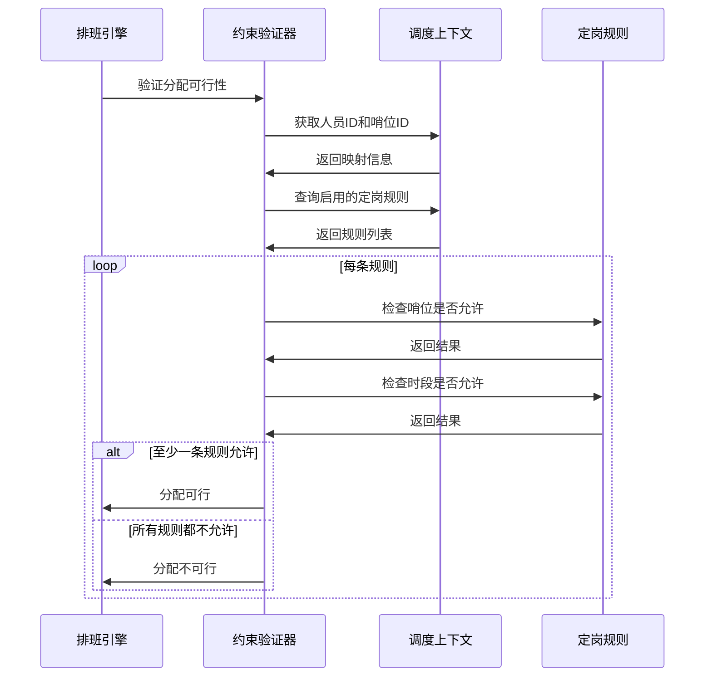
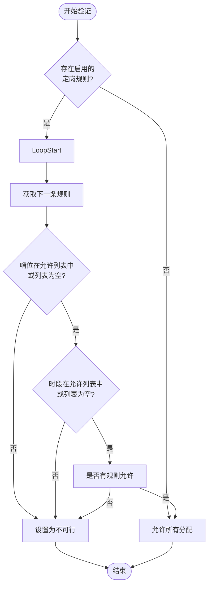

# 定岗规则

<cite>
**Referenced Files in This Document**   
- [FixedPositionRule.cs](file://Models/Constraints/FixedPositionRule.cs)
- [ConstraintService.cs](file://Services/ConstraintService.cs)
- [ConstraintMapper.cs](file://DTOs/Mappers/ConstraintMapper.cs)
- [ConstraintValidator.cs](file://SchedulingEngine/Core/ConstraintValidator.cs)
- [IHardConstraint.cs](file://SchedulingEngine/Core/IHardConstraint.cs)
- [SchedulingContext.cs](file://SchedulingEngine/Core/SchedulingContext.cs)
- [FeasibilityTensor.cs](file://SchedulingEngine/Core/FeasibilityTensor.cs)
</cite>

## 目录
1. [简介](#简介)
2. [核心API文档](#核心api文档)
3. [定岗规则模型详解](#定岗规则模型详解)
4. [DTO与实体模型映射逻辑](#dto与实体模型映射逻辑)
5. [排班算法中的约束验证机制](#排班算法中的约束验证机制)
6. [代码示例](#代码示例)

## 简介
定岗规则（FixedPositionRule）是自动排班系统中的核心约束机制，用于定义特定人员仅能在指定哨位或时段上哨的业务规则。该规则作为硬约束（IHardConstraint）在排班过程中强制执行，确保调度方案符合预设的人员分配限制。本文档详细说明了定岗规则的API接口、数据模型、映射逻辑及在排班引擎中的消费方式。

## 核心API文档

### CreateFixedPositionRuleAsync
创建新的定岗规则。

**参数约束**:
- `rule`: FixedPositionRule对象，必须包含有效的人员ID、允许的哨位ID列表和允许的时段列表。
- 人员ID必须对应系统中存在的人员。
- 允许的哨位ID必须对应系统中存在的哨位。
- 允许的时段序号必须在0-11范围内。

**返回值语义**:
- 成功时返回新创建规则的数据库主键ID。
- 失败时抛出异常。

**异常处理机制**:
- `ArgumentNullException`: 当`rule`参数为null时抛出。
- `ArgumentException`: 当人员ID不存在、哨位ID无效或时段序号超出范围时抛出。

**Section sources**
- [ConstraintService.cs](file://Services/ConstraintService.cs#L25-L30)

### GetFixedPositionRulesByPersonAsync
根据人员ID获取其所有定岗规则。

**参数约束**:
- `personalId`: 人员ID，必须为正整数且对应系统中存在的人员。

**返回值语义**:
- 成功时返回该人员的所有定岗规则列表。
- 若人员不存在，抛出`ArgumentException`。

**异常处理机制**:
- `ArgumentException`: 当指定的人员ID不存在时抛出。

**Section sources**
- [ConstraintService.cs](file://Services/ConstraintService.cs#L37-L42)

### UpdateFixedPositionRuleAsync
更新现有定岗规则。

**参数约束**:
- `rule`: FixedPositionRule对象，其ID必须对应系统中存在的规则。
- 更新时需重新验证人员ID、哨位ID和时段序号的有效性。

**返回值语义**:
- 方法为void类型，成功执行表示更新完成。
- 失败时抛出异常。

**异常处理机制**:
- `ArgumentNullException`: 当`rule`参数为null时抛出。
- `ArgumentException`: 当规则ID对应的规则不存在，或人员/哨位/时段信息无效时抛出。

**Section sources**
- [ConstraintService.cs](file://Services/ConstraintService.cs#L44-L49)

### DeleteFixedPositionRuleAsync
删除指定ID的定岗规则。

**参数约束**:
- `id`: 规则ID，必须为正整数且对应系统中存在的规则。

**返回值语义**:
- 方法为void类型，成功执行表示删除完成。
- 失败时抛出异常。

**异常处理机制**:
- 删除操作直接通过ID在数据库中移除对应记录，无特殊异常。

**Section sources**
- [ConstraintService.cs](file://Services/ConstraintService.cs#L51-L54)

## 定岗规则模型详解

### FixedPositionRule 模型
`FixedPositionRule`模型定义了定岗规则的核心属性：

- `Id`: 数据库主键ID。
- `PersonalId`: 关联的人员ID。
- `AllowedPositionIds`: 允许的哨位ID列表，空列表表示不限制哨位。
- `AllowedPeriods`: 允许的时段序号列表（0-11），空列表表示不限制时段。
- `IsEnabled`: 规则是否启用。
- `Description`: 规则描述。

**业务含义**:
- `AllowedPositionIds`字段定义了人员可以被分配的特定哨位集合。当该列表为空时，表示人员可以在任何哨位上哨。
- `AllowedPeriods`字段定义了人员可以被分配的特定时段集合。系统将一天划分为12个时段（0-11），该列表指定了人员可以上哨的具体时段。

**Section sources**
- [FixedPositionRule.cs](file://Models/Constraints/FixedPositionRule.cs#L9-L46)

## DTO与实体模型映射逻辑

### 映射器实现
`ConstraintMapper`类负责在DTO与实体模型之间进行转换。

#### CreateFixedAssignmentAsync
将`CreateFixedAssignmentDto`转换为`FixedPositionRule`实体并创建规则。

**映射逻辑**:
- `PersonnelId` → `PersonalId`
- `AllowedPositionIds` → `AllowedPositionIds`
- `AllowedTimeSlots` → `AllowedPeriods`
- `IsEnabled` → `IsEnabled`
- `Description` → `Description`

**Section sources**
- [ConstraintMapper.cs](file://DTOs/Mappers/ConstraintMapper.cs#L77-L89)

#### GetFixedAssignmentDtosByPersonAsync
将`FixedPositionRule`实体列表转换为`FixedAssignmentDto` DTO列表。

**映射逻辑**:
- `Id` → `Id`
- `PersonalId` → `PersonnelId`
- `AllowedPositionIds` → `AllowedPositionIds`
- `AllowedPeriods` → `AllowedTimeSlots`
- `IsEnabled` → `IsEnabled`
- `Description` → `Description`
- 同时通过仓库查询填充`PersonnelName`和`AllowedPositionNames`等显示信息。

**Section sources**
- [ConstraintMapper.cs](file://DTOs/Mappers/ConstraintMapper.cs#L110-L128)

## 排班算法中的约束验证机制

### 硬约束验证流程
定岗规则作为硬约束在排班过程中被`ConstraintValidator`消费。



**Diagram sources**
- [ConstraintValidator.cs](file://SchedulingEngine/Core/ConstraintValidator.cs#L150-L180)
- [SchedulingContext.cs](file://SchedulingEngine/Core/SchedulingContext.cs#L20-L40)

### 可行性张量应用
在`FeasibilityTensor`中，定岗规则通过设置不可行状态来影响调度决策。



**Diagram sources**
- [FeasibilityTensor.cs](file://SchedulingEngine/Core/FeasibilityTensor.cs#L100-L150)
- [ConstraintValidator.cs](file://SchedulingEngine/Core/ConstraintValidator.cs#L150-L180)

## 代码示例

### 为特定人员设置定岗约束
以下示例展示如何为特定人员设置仅允许在指定哨位或时段上哨的约束。

```csharp
// 创建定岗规则DTO
var dto = new CreateFixedAssignmentDto
{
    PersonnelId = 1001,
    AllowedPositionIds = new List<int> { 1, 2 },
    AllowedTimeSlots = new List<int> { 0, 1, 2 },
    IsEnabled = true,
    Description = "仅允许在A区哨位的早班时段"
};

// 通过服务创建规则
var ruleId = await _constraintService.CreateFixedAssignmentAsync(dto);
```

### 查询人员的定岗规则
```csharp
// 获取特定人员的所有定岗规则
var rules = await _constraintService.GetFixedAssignmentDtosByPersonAsync(1001);

// 处理返回的规则列表
foreach (var rule in rules)
{
    Console.WriteLine($"人员: {rule.PersonnelName}");
    Console.WriteLine($"允许哨位: {string.Join(",", rule.AllowedPositionNames)}");
    Console.WriteLine($"允许时段: {string.Join(",", rule.AllowedTimeSlots)}");
}
```

**Section sources**
- [ConstraintService.cs](file://Services/ConstraintService.cs#L25-L54)
- [ConstraintMapper.cs](file://DTOs/Mappers/ConstraintMapper.cs#L77-L107)