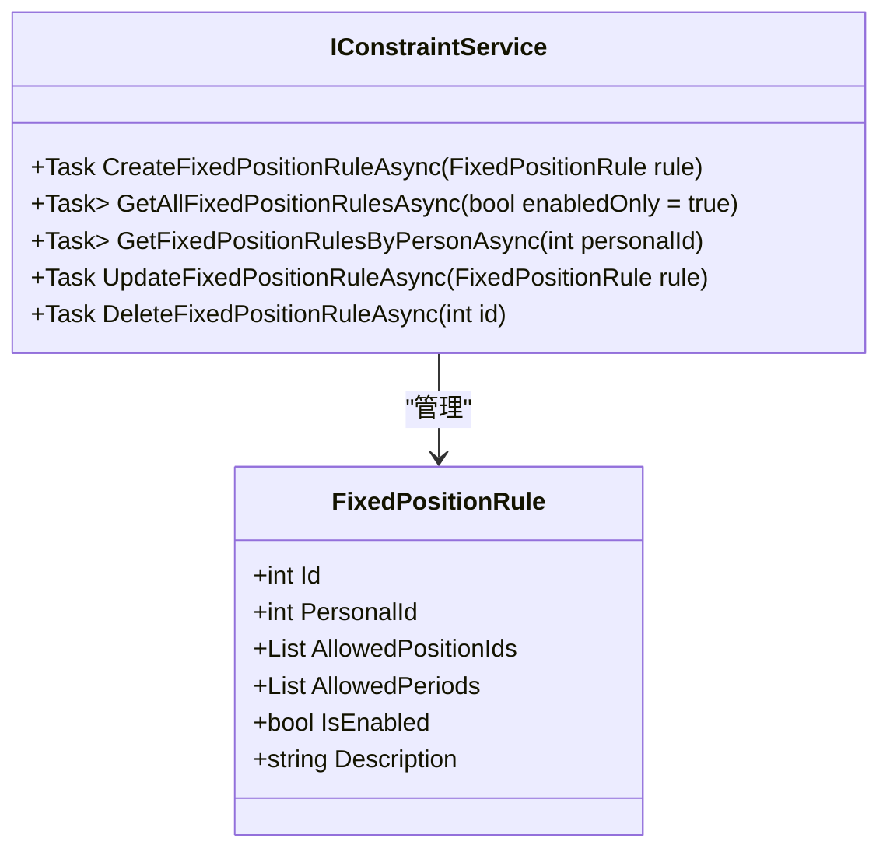
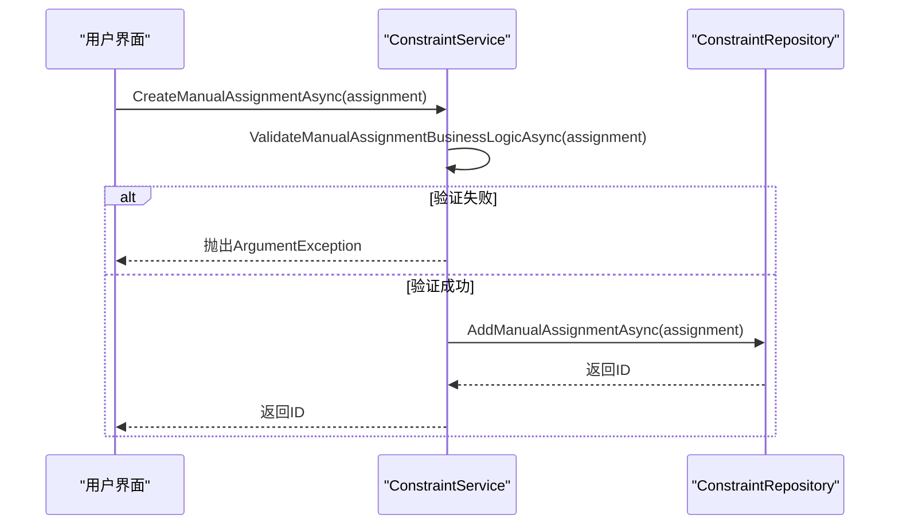
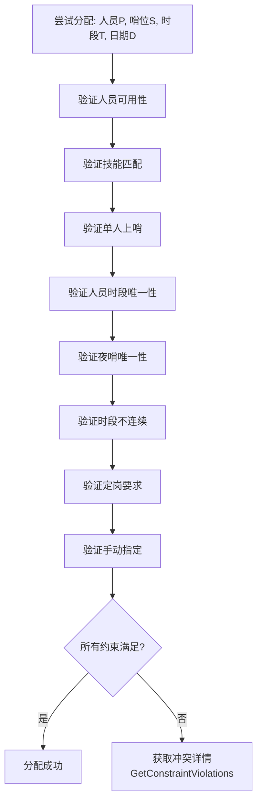

# 约束服务API

<cite>
**本文档引用文件**  
- [IConstraintService.cs](file://Services/Interfaces/IConstraintService.cs)
- [ConstraintService.cs](file://Services/ConstraintService.cs)
- [ConstraintMapper.cs](file://DTOs/Mappers/ConstraintMapper.cs)
- [FixedPositionRule.cs](file://Models/Constraints/FixedPositionRule.cs)
- [ManualAssignment.cs](file://Models/Constraints/ManualAssignment.cs)
- [HolidayConfig.cs](file://Models/Constraints/HolidayConfig.cs)
- [ConstraintValidator.cs](file://SchedulingEngine/Core/ConstraintValidator.cs)
</cite>

## 目录
1. [简介](#简介)
2. [核心约束类型](#核心约束类型)
3. [定岗规则管理](#定岗规则管理)
4. [手动指定管理](#手动指定管理)
5. [休息日配置管理](#休息日配置管理)
6. [约束验证方法](#约束验证方法)
7. [DTO与模型映射规则](#dto与模型映射规则)
8. [约束冲突检测机制](#约束冲突检测机制)
9. [排班计算中的优先级处理](#排班计算中的优先级处理)
10. [附录](#附录)

## 简介
本技术文档系统阐述了`IConstraintService`接口的设计与实现，涵盖定岗规则、手动指定和休息日配置三大核心约束类型的管理方法。文档详细说明了关键方法的业务语义、数据验证逻辑、DTO与模型的转换机制、约束冲突检测策略以及在排班计算中的优先级处理。该服务是自动化排班系统的核心组件，确保排班方案的合规性、可行性和高效性。

**Section sources**
- [IConstraintService.cs](file://Services/Interfaces/IConstraintService.cs#L1-L157)

## 核心约束类型
系统定义了三种主要的业务约束，用于指导和限制排班过程：

1.  **定岗规则 (Fixed Position Rule)**：限制特定人员只能在指定的哨位或特定的时段上哨。
2.  **手动指定 (Manual Assignment)**：由用户预先指定在特定日期、特定时段、特定哨位必须由特定人员值班。
3.  **休息日配置 (Holiday Config)**：定义如何判定某一天是否为休息日的规则集合。

这些约束类型共同构成了排班引擎的硬性规则基础。

**Section sources**
- [FixedPositionRule.cs](file://Models/Constraints/FixedPositionRule.cs#L1-L48)
- [ManualAssignment.cs](file://Models/Constraints/ManualAssignment.cs#L1-L52)
- [HolidayConfig.cs](file://Models/Constraints/HolidayConfig.cs#L1-L88)

## 定岗规则管理
定岗规则管理接口提供了对`FixedPositionRule`模型的CRUD操作和业务验证。

### 创建与获取定岗规则


**Diagram sources**
- [FixedPositionRule.cs](file://Models/Constraints/FixedPositionRule.cs#L1-L48)
- [IConstraintService.cs](file://Services/Interfaces/IConstraintService.cs#L10-L34)

#### 方法说明
- **CreateFixedPositionRuleAsync**: 创建新的定岗规则。方法会进行完整的业务逻辑验证，包括人员和哨位的存在性、时段序号的有效性（0-11）等。验证通过后，规则将被持久化。
- **GetFixedPositionRulesByPersonAsync**: 根据人员ID查询其所有定岗规则。在查询前会验证该人员ID是否存在于系统中，若不存在则抛出异常。

**Section sources**
- [ConstraintService.cs](file://Services/ConstraintService.cs#L20-L65)
- [FixedPositionRule.cs](file://Models/Constraints/FixedPositionRule.cs#L1-L48)

## 手动指定管理
手动指定管理接口用于处理用户预先设定的固定排班。

### 手动指定的创建与查询


**Diagram sources**
- [ManualAssignment.cs](file://Models/Constraints/ManualAssignment.cs#L1-L52)
- [ConstraintService.cs](file://Services/ConstraintService.cs#L70-L105)

#### 方法说明
- **CreateManualAssignmentAsync**: 创建手动指定。该方法执行严格的业务验证，包括：
    - 人员和哨位的存在性。
    - 时段序号的有效性（0-11）。
    - **日期不能是过去的日期**。
    - 人员的可用性（未退役且可用）。
    - 人员的技能是否满足哨位要求。
- **GetManualAssignmentsByDateRangeAsync**: 根据日期范围查询手动指定。会验证开始日期不能晚于结束日期。

**Section sources**
- [ConstraintService.cs](file://Services/ConstraintService.cs#L70-L105)
- [ManualAssignment.cs](file://Models/Constraints/ManualAssignment.cs#L1-L52)

## 休息日配置管理
休息日配置管理接口负责维护判定休息日的规则。

### 休息日配置的激活与优先级
```mermaid
flowchart TD
A[判定日期是否为休息日] --> B{排除日期列表<br/>ExcludedDates}
B --> |存在| C[不是休息日<br/>(最高优先级)]
B --> |不存在| D{自定义休息日列表<br/>CustomHolidays}
D --> |存在| E[是休息日]
D --> |不存在| F{法定节假日列表<br/>LegalHolidays}
F --> |存在| E
F --> |不存在| G{周末规则}
G --> |启用且为周末| E
G --> |不满足| H[是工作日]
```

**Diagram sources**
- [HolidayConfig.cs](file://Models/Constraints/HolidayConfig.cs#L1-L88)

#### 方法说明
- **CreateHolidayConfigAsync**: 创建新的休息日配置。如果新配置的`IsActive`为`true`，则会自动将其他所有活跃的配置设为非活跃状态，确保系统中只有一个活跃的配置。
- **GetActiveHolidayConfigAsync**: 获取当前系统中唯一活跃的休息日配置，该配置用于`IsHolidayAsync`等方法的判定。

**Section sources**
- [ConstraintService.cs](file://Services/ConstraintService.cs#L110-L155)
- [HolidayConfig.cs](file://Models/Constraints/HolidayConfig.cs#L1-L88)

## 约束验证方法
`IConstraintService`提供了用于业务规则验证的方法，这些方法在创建或更新约束时被内部调用。

### 验证方法的使用场景
```mermaid
classDiagram
class IConstraintService {
+Task<bool> ValidateFixedPositionRuleAsync(FixedPositionRule rule)
+Task<bool> ValidateManualAssignmentAsync(ManualAssignment assignment)
+Task<bool> IsHolidayAsync(DateTime date)
}
note right of IConstraintService
这些方法用于在执行CRUD操作前
预判操作是否合法，避免无效数据写入。
end note
```

**Diagram sources**
- [IConstraintService.cs](file://Services/Interfaces/IConstraintService.cs#L130-L145)

#### 方法说明
- **ValidateFixedPositionRuleAsync**: 尝试执行`CreateFixedPositionRuleAsync`中的验证逻辑，若验证通过则返回`true`，否则捕获异常并返回`false`。可用于UI层在提交前进行预验证。
- **ValidateManualAssignmentAsync**: 同上，用于手动指定的预验证。
- **IsHolidayAsync**: 检查指定日期是否为休息日。该方法会获取当前活跃的`HolidayConfig`，并调用其`IsHoliday`实例方法进行判定。

**Section sources**
- [ConstraintService.cs](file://Services/ConstraintService.cs#L160-L180)

## DTO与模型映射规则
为了隔离数据访问层与业务逻辑层，系统使用DTO（数据传输对象）与UI层交互。`ConstraintMapper`类负责模型与DTO之间的转换。

### 映射规则
| 映射方向 | 源属性 | 目标属性 | 转换逻辑 |
| :--- | :--- | :--- | :--- |
| **FixedPositionRule → FixedAssignmentDto** | `PersonalId` | `PersonnelId`, `PersonnelName` | 通过`IPersonalRepository`查询人员姓名 |
| | `AllowedPositionIds` | `AllowedPositionNames` | 通过`IPositionRepository`批量查询哨位名称 |
| | N/A | `RuleName` | 格式化为"定岗规则-{人员姓名}" |
| | N/A | `StartDate`, `EndDate` | 使用默认值（实际业务中应从上下文获取） |
| **ManualAssignment → ManualAssignmentDto** | `PersonalId` | `PersonnelName` | 通过`IPersonalRepository`查询人员姓名 |
| | `PositionId` | `PositionName` | 通过`IPositionRepository`查询哨位名称 |

**Section sources**
- [ConstraintMapper.cs](file://DTOs/Mappers/ConstraintMapper.cs#L1-L325)

## 约束冲突检测机制
约束冲突检测由排班引擎中的`ConstraintValidator`类负责，它在生成排班方案时实时检查所有硬性约束。

### 冲突检测流程


**Diagram sources**
- [ConstraintValidator.cs](file://SchedulingEngine/Core/ConstraintValidator.cs#L1-L338)

`ConstraintValidator`按特定顺序检查所有约束，一旦发现违反即返回`false`。`GetConstraintViolations`方法可返回详细的违反原因列表，用于调试和用户提示。

**Section sources**
- [ConstraintValidator.cs](file://SchedulingEngine/Core/ConstraintValidator.cs#L1-L338)

## 排班计算中的优先级处理
在排班计算过程中，不同约束类型的优先级至关重要。

### 优先级策略
1.  **手动指定 (最高优先级)**：手动指定的分配是强制性的，排班引擎必须首先满足所有手动指定，然后才能进行自动排班。
2.  **定岗规则**：在自动排班时，定岗规则限制了人员可分配的范围，是排班搜索空间的过滤器。
3.  **休息日配置**：虽然`IsHolidayAsync`是一个独立的API，但在排班上下文中，它通常与人员的可用性或特定的软约束结合使用，其优先级低于硬性约束。
4.  **其他硬约束**：如技能匹配、时段不连续等，与定岗规则处于同一优先级层级，共同构成排班的可行性基础。

**Section sources**
- [ConstraintValidator.cs](file://SchedulingEngine/Core/ConstraintValidator.cs#L250-L275)
- [ConstraintService.cs](file://Services/ConstraintService.cs#L280-L285)

## 附录
本文档所涉及的核心接口和实现类的完整定义，请参考源代码文件。