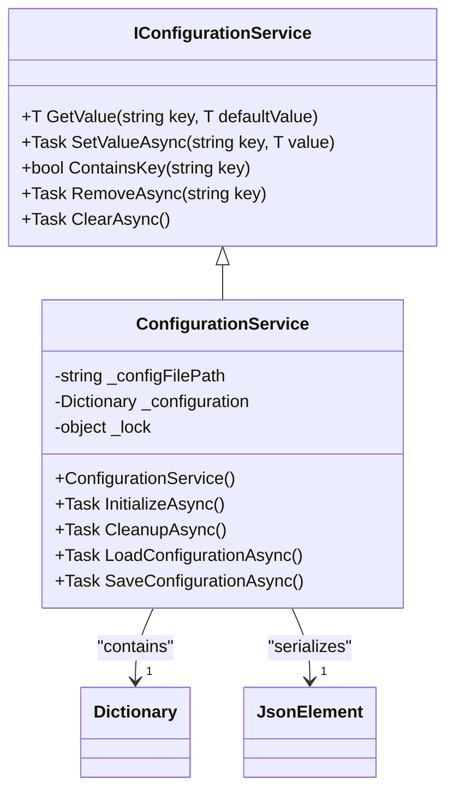
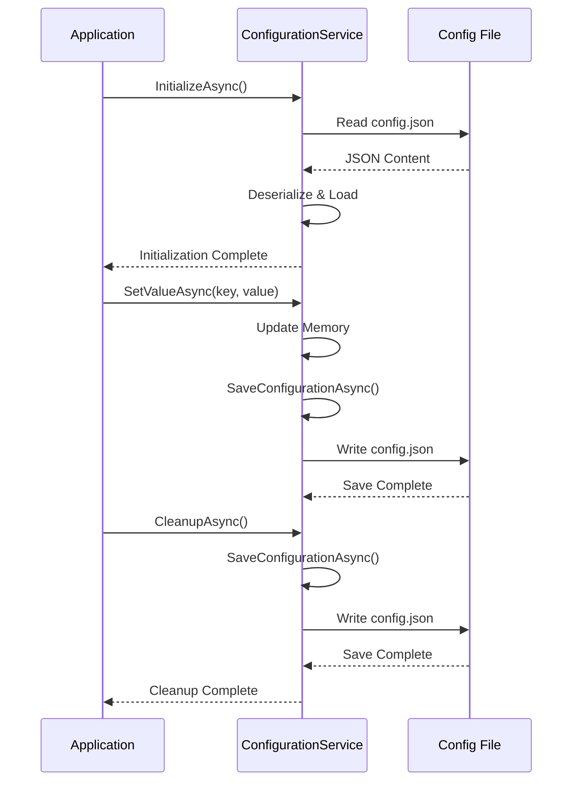
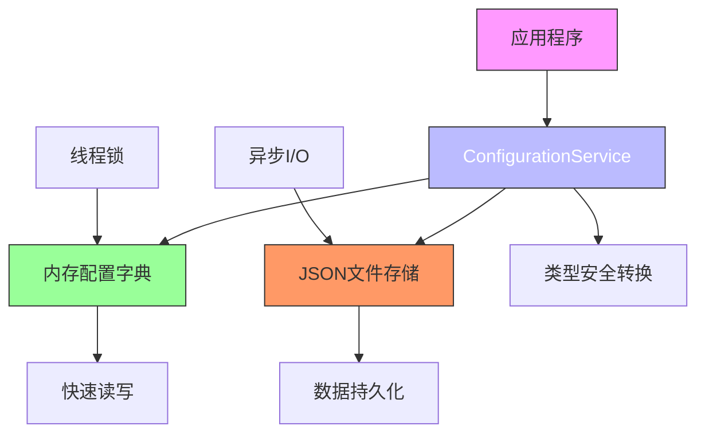

# 配置服务API

<cite>
**Referenced Files in This Document**   
- [IConfigurationService.cs](file://Services/Interfaces/IConfigurationService.cs)
- [ConfigurationService.cs](file://Services/ConfigurationService.cs)
- [ApplicationConstants.cs](file://Constants/ApplicationConstants.cs)
- [IApplicationService.cs](file://Services/Interfaces/IApplicationService.cs)
</cite>

## 目录
1. [简介](#简介)
2. [核心功能](#核心功能)
3. [配置键命名规范](#配置键命名规范)
4. [默认值处理策略](#默认值处理策略)
5. [数据类型安全保证](#数据类型安全保证)
6. [生命周期集成](#生命周期集成)
7. [使用示例](#使用示例)
8. [架构设计](#架构设计)

## 简介
`IConfigurationService` 接口为应用程序提供统一的配置管理功能，支持类型安全的配置值访问和异步持久化。该服务实现了 `IApplicationService` 接口，确保与应用程序生命周期的紧密集成。通过泛型方法，服务能够安全地处理各种数据类型的配置值，并在后台自动将更改持久化到JSON文件中。

**Section sources**
- [IConfigurationService.cs](file://Services/Interfaces/IConfigurationService.cs#L7-L43)
- [ConfigurationService.cs](file://Services/ConfigurationService.cs#L12-L25)

## 核心功能

### GetValue方法
`GetValue<T>` 方法用于获取指定键的配置值。该方法采用泛型参数确保类型安全，并支持提供默认值。当配置键不存在或类型转换失败时，返回提供的默认值。

### SetValueAsync方法
`SetValueAsync<T>` 方法用于设置配置值。该方法接受泛型参数，允许存储任意类型的配置值。设置操作完成后，配置会自动异步持久化到文件系统。

### ContainsKey方法
`ContainsKey` 方法用于检查指定的配置键是否存在。该方法提供同步访问，适用于需要快速判断配置项存在性的场景。

### RemoveAsync方法
`RemoveAsync` 方法用于移除指定的配置项。移除操作完成后，配置会自动异步持久化。

### ClearAsync方法
`ClearAsync` 方法用于清空所有配置项。该操作会重置整个配置系统，并触发异步持久化。

**Section sources**
- [IConfigurationService.cs](file://Services/Interfaces/IConfigurationService.cs#L7-L43)
- [ConfigurationService.cs](file://Services/ConfigurationService.cs#L100-L158)

## 配置键命名规范
配置键采用分层命名约定，使用点号（.）分隔命名空间。根据 `ApplicationConstants.ConfigKeys` 类定义，主要命名前缀包括：

- **窗口状态**: `WindowState.` 前缀，用于存储窗口位置和大小等UI状态
- **用户偏好**: `UserPreferences.` 前缀，用于存储用户个性化设置
- **排班参数**: `SchedulingParameters.` 前缀，用于存储排班算法相关参数

这种分层命名方式有助于组织配置项，避免命名冲突，并便于批量操作特定类别的配置。

**Section sources**
- [ApplicationConstants.cs](file://Constants/ApplicationConstants.cs#L97-L114)

## 默认值处理策略
`GetValue<T>` 方法采用稳健的默认值处理策略：

1. 当配置键不存在时，返回调用者提供的默认值
2. 当类型转换失败时，返回默认值
3. 支持多种类型转换机制，包括直接类型匹配、JSON反序列化和`Convert.ChangeType`转换
4. 使用`default!`作为泛型方法的默认参数，允许调用者省略默认值参数

这种策略确保了配置访问的可靠性，即使在配置缺失或损坏的情况下也能提供合理的回退行为。

**Section sources**
- [ConfigurationService.cs](file://Services/ConfigurationService.cs#L100-L118)

## 数据类型安全保证
配置服务通过以下机制确保数据类型安全：

1. **泛型接口**: 所有配置访问方法都使用泛型参数，确保编译时类型检查
2. **类型转换保护**: 在运行时尝试多种转换方式，并在失败时安全回退到默认值
3. **JSON元素处理**: 对于从文件加载的JSON数据，使用`JsonSerializer`进行精确的类型反序列化
4. **线程安全**: 使用锁机制保护内部配置字典，防止并发访问导致的数据竞争

这些机制共同确保了配置值的类型完整性，防止了类型不匹配导致的运行时错误。



**Diagram sources**
- [IConfigurationService.cs](file://Services/Interfaces/IConfigurationService.cs#L7-L43)
- [ConfigurationService.cs](file://Services/ConfigurationService.cs#L12-L158)

## 生命周期集成
`IConfigurationService` 通过继承 `IApplicationService` 接口与应用程序生命周期集成：

- **初始化**: 在 `InitializeAsync` 方法中调用 `LoadConfigurationAsync`，在应用启动时从文件系统加载配置
- **清理**: 在 `CleanupAsync` 方法中调用 `SaveConfigurationAsync`，在应用关闭时确保所有配置更改都被持久化
- **异步持久化**: 所有配置更改都触发异步保存操作，避免阻塞主线程

这种集成模式确保了配置数据的持久性和一致性，同时保持了良好的用户体验。



**Diagram sources**
- [ConfigurationService.cs](file://Services/ConfigurationService.cs#L27-L97)
- [IApplicationService.cs](file://Services/Interfaces/IApplicationService.cs#L7-L18)

## 使用示例

### 应用启动时初始化配置
```csharp
// 配置服务会自动在构造函数中设置文件路径
var configService = new ConfigurationService();
await configService.InitializeAsync(); // 从文件加载现有配置
```

### 运行时动态更新配置
```csharp
// 获取用户主题设置，如果不存在则使用默认值
var theme = configService.GetValue("UserPreferences.Theme", "Light");

// 更新语言设置
await configService.SetValueAsync("UserPreferences.Language", "zh-CN");

// 检查特定配置是否存在
if (configService.ContainsKey("SchedulingParameters.MaxAssignments"))
{
    var maxAssignments = configService.GetValue("SchedulingParameters.MaxAssignments", 10);
}
```

**Section sources**
- [ConfigurationService.cs](file://Services/ConfigurationService.cs#L27-L97)
- [ApplicationConstants.cs](file://Constants/ApplicationConstants.cs#L97-L114)

## 架构设计
配置服务采用内存+持久化的双层架构设计：

1. **内存层**: 使用`Dictionary<string, object>`缓存所有配置，提供快速访问
2. **持久化层**: 基于JSON文件的持久化存储，确保数据不会丢失
3. **同步机制**: 使用对象锁确保线程安全，防止并发修改
4. **异步I/O**: 所有文件操作都采用异步方式，避免阻塞UI线程

这种设计在性能和数据持久性之间取得了良好平衡，既提供了内存访问的速度，又保证了数据的可靠性。



**Diagram sources**
- [ConfigurationService.cs](file://Services/ConfigurationService.cs#L12-L158)