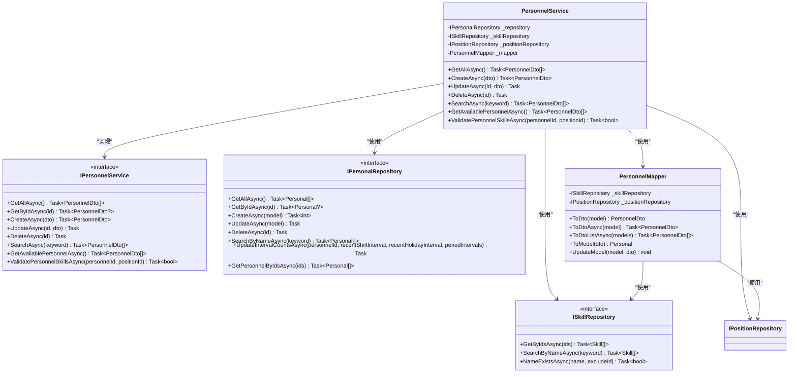
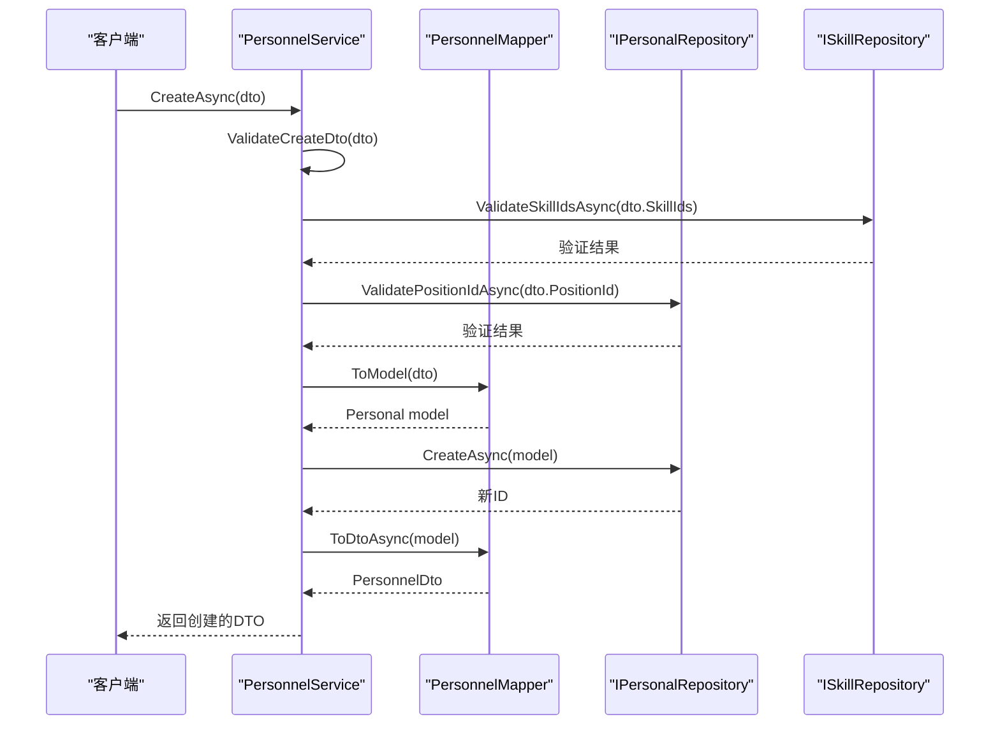
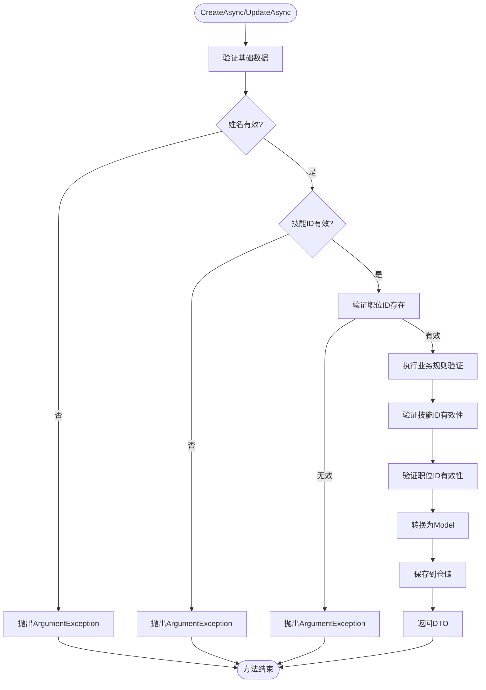
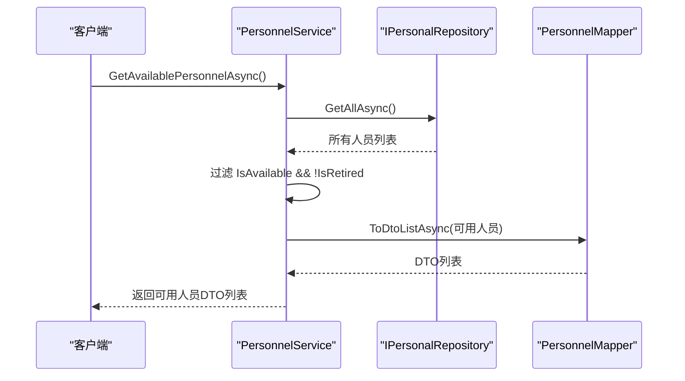
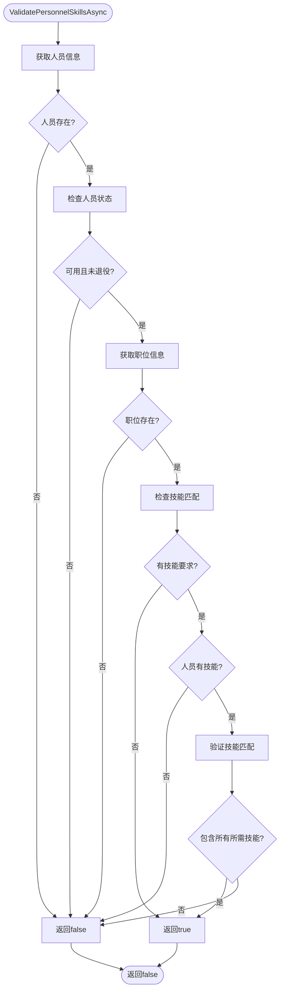
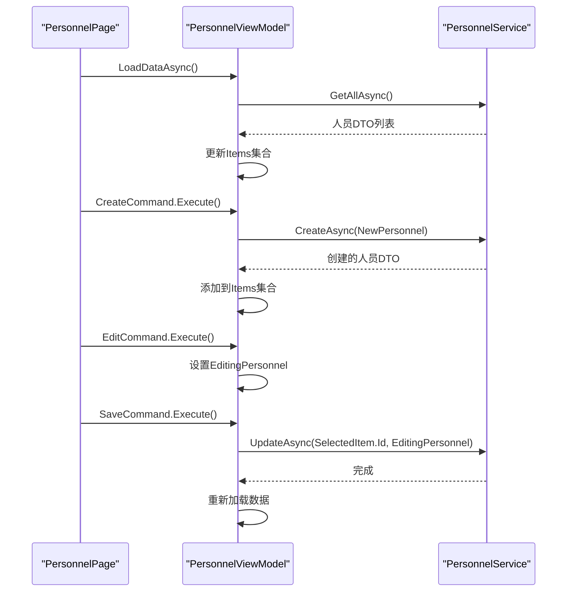
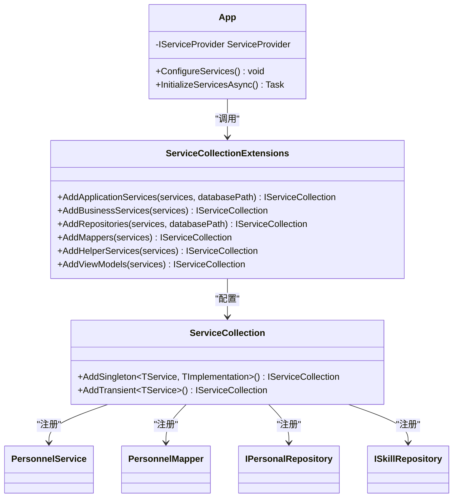

# 人员服务

<cite>
**Referenced Files in This Document**  
- [PersonnelService.cs](file://Services/PersonnelService.cs)
- [PersonnelMapper.cs](file://DTOs/Mappers/PersonnelMapper.cs)
- [IPersonalRepository.cs](file://Data/Interfaces/IPersonalRepository.cs)
- [ISkillRepository.cs](file://Data/Interfaces/ISkillRepository.cs)
- [PersonnelViewModel.cs](file://ViewModels/DataManagement/PersonnelViewModel.cs)
- [App.xaml.cs](file://App.xaml.cs)
- [ServiceCollectionExtensions.cs](file://Extensions/ServiceCollectionExtensions.cs)
</cite>

## 目录
1. [简介](#简介)
2. [核心组件分析](#核心组件分析)
3. [服务方法实现](#服务方法实现)
4. [关键业务规则](#关键业务规则)
5. [MVVM架构交互](#mvvm架构交互)
6. [依赖注入配置](#依赖注入配置)

## 简介
人员服务(PersonnelService)是自动排班系统中的核心业务组件，负责人员数据的全生命周期管理。该服务实现了人员信息的增删改查、搜索、可用性筛选和技能匹配验证等关键功能。服务采用分层架构设计，通过依赖注入与仓储层、映射器等组件解耦，确保了代码的可维护性和可测试性。

## 核心组件分析

### 人员服务架构
人员服务通过依赖注入获取其所需的所有依赖项，包括人员仓储(IPersonalRepository)、技能仓储(ISkillRepository)、职位仓储(IPositionRepository)和人员映射器(PersonnelMapper)。这种设计模式实现了关注点分离，使服务专注于业务逻辑而非数据访问细节。

**Diagram sources**
- [PersonnelService.cs](file://Services/PersonnelService.cs#L14-L193)
- [IPersonnelService.cs](file://Services/Interfaces/IPersonnelService.cs#L9-L50)
- [IPersonalRepository.cs](file://Data/Interfaces/IPersonalRepository.cs#L9-L25)
- [ISkillRepository.cs](file://Data/Interfaces/ISkillRepository.cs#L9-L25)
- [PersonnelMapper.cs](file://DTOs/Mappers/PersonnelMapper.cs#L14-L203)

**Section sources**
- [PersonnelService.cs](file://Services/PersonnelService.cs#L14-L193)
- [IPersonnelService.cs](file://Services/Interfaces/IPersonnelService.cs#L9-L50)

## 服务方法实现

### 核心CRUD方法
人员服务提供了完整的CRUD操作，每个方法都包含严格的数据验证和业务规则检查。

**Diagram sources**
- [PersonnelService.cs](file://Services/PersonnelService.cs#L60-L80)
- [PersonnelMapper.cs](file://DTOs/Mappers/PersonnelMapper.cs#L120-L140)
- [IPersonalRepository.cs](file://Data/Interfaces/IPersonalRepository.cs#L15-L20)

**Section sources**
- [PersonnelService.cs](file://Services/PersonnelService.cs#L60-L80)

### 数据验证规则
服务在创建和更新人员时执行严格的数据验证，确保数据的完整性和一致性。

**Diagram sources**
- [PersonnelService.cs](file://Services/PersonnelService.cs#L140-L190)
- [PersonnelService.cs](file://Services/PersonnelService.cs#L82-L138)

**Section sources**
- [PersonnelService.cs](file://Services/PersonnelService.cs#L82-L138)

## 关键业务规则

### 可用人员筛选
`GetAvailablePersonnelAsync`方法实现了筛选可用人员的业务规则，只返回在职且可用的人员。

**Diagram sources**
- [PersonnelService.cs](file://Services/PersonnelService.cs#L150-L160)

**Section sources**
- [PersonnelService.cs](file://Services/PersonnelService.cs#L150-L160)

### 人员技能验证
`ValidatePersonnelSkillsAsync`方法实现了人员技能匹配的核心业务规则，用于验证特定人员是否具备担任特定职位所需的全部技能。

**Diagram sources**
- [PersonnelService.cs](file://Services/PersonnelService.cs#L162-L189)

**Section sources**
- [PersonnelService.cs](file://Services/PersonnelService.cs#L162-L189)

## MVVM架构交互

### 与PersonnelViewModel的交互
人员服务在MVVM架构中与PersonnelViewModel紧密协作，为UI层提供数据和业务逻辑支持。

**Diagram sources**
- [PersonnelViewModel.cs](file://ViewModels/DataManagement/PersonnelViewModel.cs#L100-L140)
- [PersonnelService.cs](file://Services/PersonnelService.cs#L40-L60)

**Section sources**
- [PersonnelViewModel.cs](file://ViewModels/DataManagement/PersonnelViewModel.cs#L100-L140)

## 依赖注入配置

### 服务注册
人员服务通过依赖注入容器进行配置和管理，确保在整个应用程序生命周期中的一致性和可管理性。

**Diagram sources**
- [App.xaml.cs](file://App.xaml.cs#L40-L60)
- [ServiceCollectionExtensions.cs](file://Extensions/ServiceCollectionExtensions.cs#L70-L130)

**Section sources**
- [App.xaml.cs](file://App.xaml.cs#L40-L60)
- [ServiceCollectionExtensions.cs](file://Extensions/ServiceCollectionExtensions.cs#L70-L130)