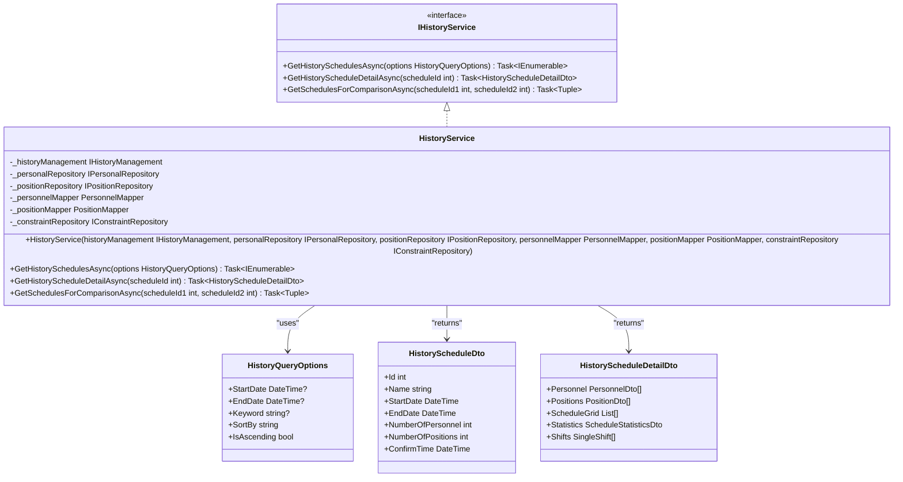
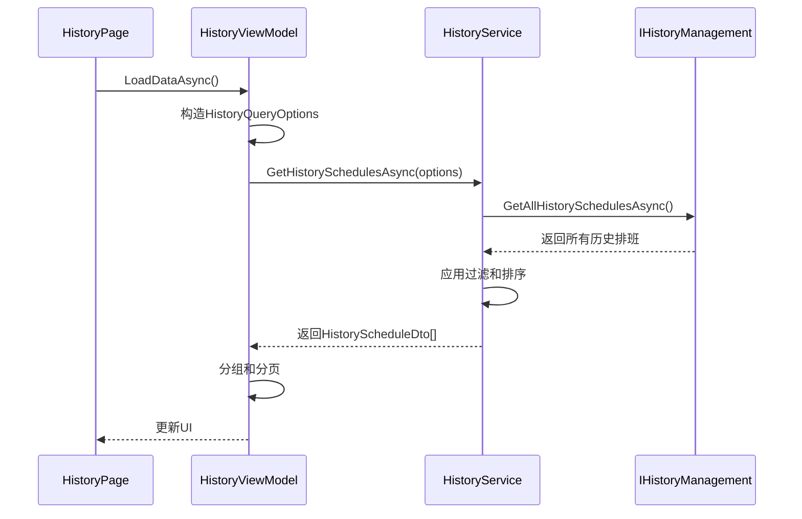

# 历史服务

<cite>
**Referenced Files in This Document**   
- [HistoryService.cs](file://Services/HistoryService.cs)
- [IHistoryService.cs](file://Services/Interfaces/IHistoryService.cs)
- [HistoryViewModel.cs](file://ViewModels/History/HistoryViewModel.cs)
- [HistoryDetailViewModel.cs](file://ViewModels/History/HistoryDetailViewModel.cs)
- [CompareViewModel.cs](file://ViewModels/History/CompareViewModel.cs)
- [HistoryScheduleDto.cs](file://DTOs/HistoryScheduleDto.cs)
- [HistoryScheduleDetailDto.cs](file://DTOs/HistoryScheduleDetailDto.cs)
- [ScheduleStatisticsDto.cs](file://DTOs/ScheduleStatisticsDto.cs)
- [SingleShift.cs](file://Models/SingleShift.cs)
- [PersonnelMapper.cs](file://DTOs/Mappers/PersonnelMapper.cs)
- [HistoryPage.xaml.cs](file://Views/History/HistoryPage.xaml.cs)
- [ComparePage.xaml.cs](file://Views/History/ComparePage.xaml.cs)
</cite>

## 目录
1. [简介](#简介)
2. [核心功能](#核心功能)
3. [历史排班查询](#历史排班查询)
4. [历史排班详情获取](#历史排班详情获取)
5. [历史排班对比分析](#历史排班对比分析)
6. [与历史管理UI的协作](#与历史管理ui的协作)
7. [数据传输对象](#数据传输对象)

## 简介
历史服务（`HistoryService`）是系统中负责管理、查询和分析历史排班记录的核心组件。它为历史管理UI提供数据支持，使用户能够浏览、查看和对比已确认的排班表。该服务通过与`IHistoryManagement`、`IPersonalRepository`、`IPositionRepository`和`IConstraintRepository`等数据访问层协作，从持久化存储中获取排班数据，并将其转换为前端可用的数据传输对象（DTO）。

**Section sources**
- [HistoryService.cs](file://Services/HistoryService.cs#L15-L121)

## 核心功能
历史服务主要提供三大核心功能：
1.  **历史排班查询**：根据时间范围、关键词和排序选项，检索历史排班列表。
2.  **历史排班详情获取**：根据排班ID，聚合排班、人员、哨位和约束信息，生成详细的排班报告。
3.  **历史排班对比分析**：同时获取两个历史排班的详细信息，支持用户进行对比分析。

这些功能通过`IHistoryService`接口对外暴露，确保了服务的可测试性和可替换性。

**Diagram sources**
- [HistoryService.cs](file://Services/HistoryService.cs#L15-L121)
- [IHistoryService.cs](file://Services/Interfaces/IHistoryService.cs#L7-L21)
- [HistoryScheduleDto.cs](file://DTOs/HistoryScheduleDto.cs#L8-L59)
- [HistoryScheduleDetailDto.cs](file://DTOs/HistoryScheduleDetailDto.cs#L8-L47)

## 历史排班查询
`GetHistorySchedulesAsync`方法是历史排班查询的核心。它接收一个`HistoryQueryOptions`对象作为参数，该对象定义了查询的过滤和排序条件。

### 过滤逻辑
- **时间范围过滤**：如果`StartDate`或`EndDate`有值，则分别过滤确认时间在该日期之后或之前的排班记录。
- **关键词过滤**：如果`Keyword`不为空，则过滤排班名称（Header）中包含该关键词的记录，搜索不区分大小写。

### 排序逻辑
- **按时间排序**：当`SortBy`为"Time"时，根据`IsAscending`标志决定按确认时间升序或降序排列。
- **按名称排序**：当`SortBy`为"Name"或"Title"时，根据`IsAscending`标志决定按排班名称升序或降序排列。
- **默认排序**：如果`SortBy`不符合上述条件，则默认按确认时间降序排列，确保最新的排班显示在最前面。

该方法最终返回一个`HistoryScheduleDto`对象的集合，包含了排班的基本信息，如ID、名称、日期范围、人员和哨位数量以及确认时间。

**Section sources**
- [HistoryService.cs](file://Services/HistoryService.cs#L34-L69)

## 历史排班详情获取
`GetHistoryScheduleDetailAsync`方法负责获取单个历史排班的详细信息。它通过以下步骤聚合数据：

1.  **获取排班记录**：调用`_historyManagement.GetHistoryScheduleByScheduleIdAsync`根据`scheduleId`从历史管理模块获取完整的排班记录。
2.  **获取人员信息**：使用`_personalRepository.GetPersonnelByIdsAsync`根据排班中的人员ID列表，批量获取所有相关人员的详细信息。
3.  **获取哨位信息**：使用`_positionRepository.GetPositionsByIdsAsync`根据排班中的哨位ID列表，批量获取所有相关哨位的详细信息。
4.  **获取节假日配置**：调用`_constraintRepository.GetActiveHolidayConfigAsync`获取当前有效的节假日配置，用于计算周末班次。
5.  **数据映射与聚合**：将获取到的原始数据模型（Model）通过`PersonnelMapper`和`PositionMapper`等映射器转换为`PersonnelDto`和`PositionDto`，并填充到`HistoryScheduleDetailDto`中。
6.  **计算统计信息**：基于排班结果（`schedule.Results`）计算关键统计指标，如总班次数、人均班次数、周末班次数以及按人员分布的班次统计。

此方法返回一个包含丰富信息的`HistoryScheduleDetailDto`，为前端展示详细的排班报告提供了全面的数据支持。

**Section sources**
- [HistoryService.cs](file://Services/HistoryService.cs#L71-L118)
- [PersonnelMapper.cs](file://DTOs/Mappers/PersonnelMapper.cs#L10-L203)

## 历史排班对比分析
`GetSchedulesForComparisonAsync`方法支持对两个历史排班进行对比分析。其工作流程非常直接：
1.  分别调用`GetHistoryScheduleDetailAsync`方法，异步获取两个指定ID的排班详情。
2.  将这两个`HistoryScheduleDetailDto`对象封装在一个`Tuple`中并返回。

这个方法本身不执行对比逻辑，而是为前端的对比功能提供所需的数据。前端的`CompareViewModel`会接收这两个DTO，然后在内存中进行差异分析，例如比较班次的增减、人员变更等。

**Section sources**
- [HistoryService.cs](file://Services/HistoryService.cs#L120-L123)

## 与历史管理UI的协作
历史服务与`HistoryViewModel`及其相关视图模型紧密协作，为历史管理UI提供数据驱动。

### 与HistoryViewModel的协作
`HistoryViewModel`是历史记录列表页的视图模型。它依赖于`IHistoryService`，在`LoadDataAsync`方法中：
1.  将自身的UI状态（如`StartDate`、`EndDate`、`Keyword`、`SelectedSortBy`、`IsSortAscending`）封装成一个`HistoryQueryOptions`对象。
2.  调用`_historyService.GetHistorySchedulesAsync(options)`获取过滤和排序后的排班列表。
3.  将获取到的数据填充到`Items`和`GroupedHistorySchedules`中，供UI绑定显示。

**Diagram sources**
- [HistoryViewModel.cs](file://ViewModels/History/HistoryViewModel.cs#L10-L219)
- [HistoryService.cs](file://Services/HistoryService.cs#L34-L69)
- [HistoryPage.xaml.cs](file://Views/History/HistoryPage.xaml.cs#L8-L18)

### 与HistoryDetailViewModel的协作
当用户点击某个排班查看详情时，导航到`HistoryDetailPage`。其`HistoryDetailViewModel`在`LoadDetailAsync`方法中：
1.  调用`_historyService.GetHistoryScheduleDetailAsync(scheduleId)`获取指定排班的详细信息。
2.  将获取到的`ScheduleDetail`和其中的统计信息（如`ShiftsByTimeOfDay`、`ShiftsPerPerson`）绑定到UI，展示排班的详细数据和统计图表。

### 与CompareViewModel的协作
`CompareViewModel`负责排班对比功能。在`CompareAsync`命令执行时：
1.  它调用`_historyService.GetSchedulesForComparisonAsync`获取两个排班的详细信息。
2.  在本地对`ScheduleDetail1.Shifts`和`ScheduleDetail2.Shifts`进行比较，找出班次的新增、删除和人员变更，并将差异结果填充到`Differences`集合中，供UI以高亮等方式展示。

## 数据传输对象
本服务主要使用以下数据传输对象（DTO）进行数据交换：

### HistoryScheduleDto
该DTO用于表示历史排班的概要信息，是列表页的主要数据模型。

| 属性 | 类型 | 描述 |
| :--- | :--- | :--- |
| `Id` | `int` | 排班表ID |
| `Name` | `string` | 排班表名称 |
| `StartDate` | `DateTime` | 排班周期的开始日期 |
| `EndDate` | `DateTime` | 排班周期的结束日期 |
| `NumberOfPersonnel` | `int` | 参与本次排班的人员数量 |
| `NumberOfPositions` | `int` | 参与本次排班的哨位数量 |
| `ConfirmTime` | `DateTime` | 该排班被确认的时间 |

**Section sources**
- [HistoryScheduleDto.cs](file://DTOs/HistoryScheduleDto.cs#L8-L59)

### HistoryScheduleDetailDto
该DTO继承自`HistoryScheduleDto`，并扩展了详细的排班信息。

| 属性 | 类型 | 描述 |
| :--- | :--- | :--- |
| `Personnel` | `List<PersonnelDto>` | 参与排班的人员列表 |
| `Positions` | `List<PositionDto>` | 参与排班的哨位列表 |
| `ScheduleGrid` | `List<List<string>>` | 用于表格显示的排班网格数据 |
| `Statistics` | `ScheduleStatisticsDto` | 排班的统计信息 |
| `Shifts` | `List<SingleShift>` | 班次详情列表，包含每个班次的具体信息 |

**Section sources**
- [HistoryScheduleDetailDto.cs](file://DTOs/HistoryScheduleDetailDto.cs#L8-L47)

### ScheduleStatisticsDto
该DTO封装了排班的统计信息，用于生成报告和图表。

| 属性 | 类型 | 描述 |
| :--- | :--- | :--- |
| `TotalShifts` | `int` | 总班次数 |
| `AverageShiftsPerPerson` | `double` | 人均班次数 |
| `WeekendShifts` | `int` | 周末班次数 |
| `ShiftsByTimeOfDay` | `Dictionary<string, int>` | 按时段分布的班次统计 |
| `ShiftsPerPerson` | `Dictionary<string, int>` | 按人员分布的班次统计 |

**Section sources**
- [ScheduleStatisticsDto.cs](file://DTOs/ScheduleStatisticsDto.cs#L8-L89)