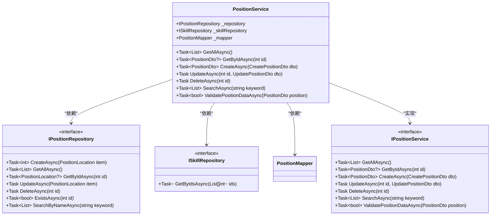
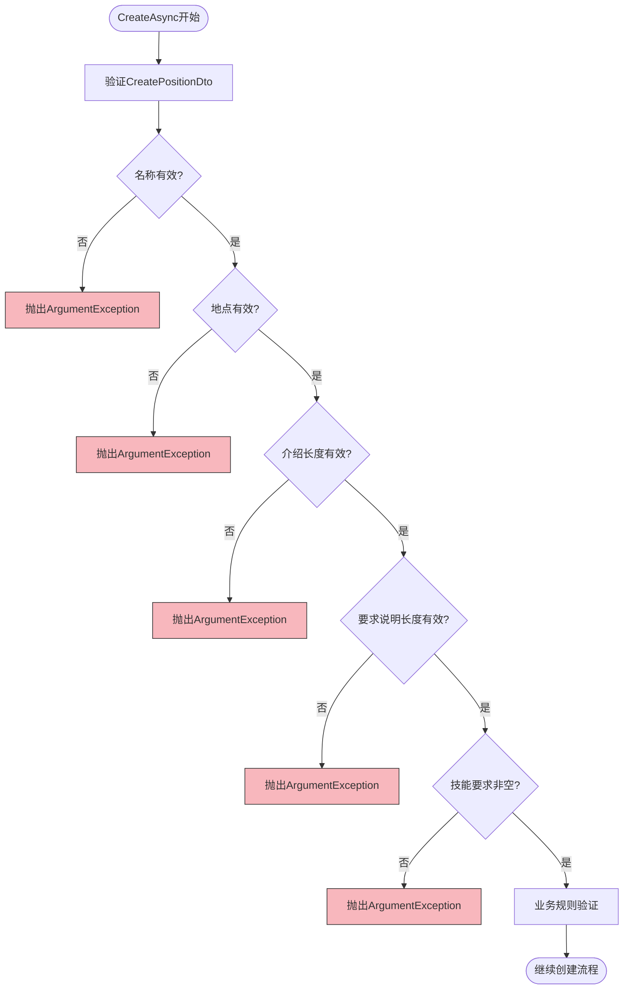
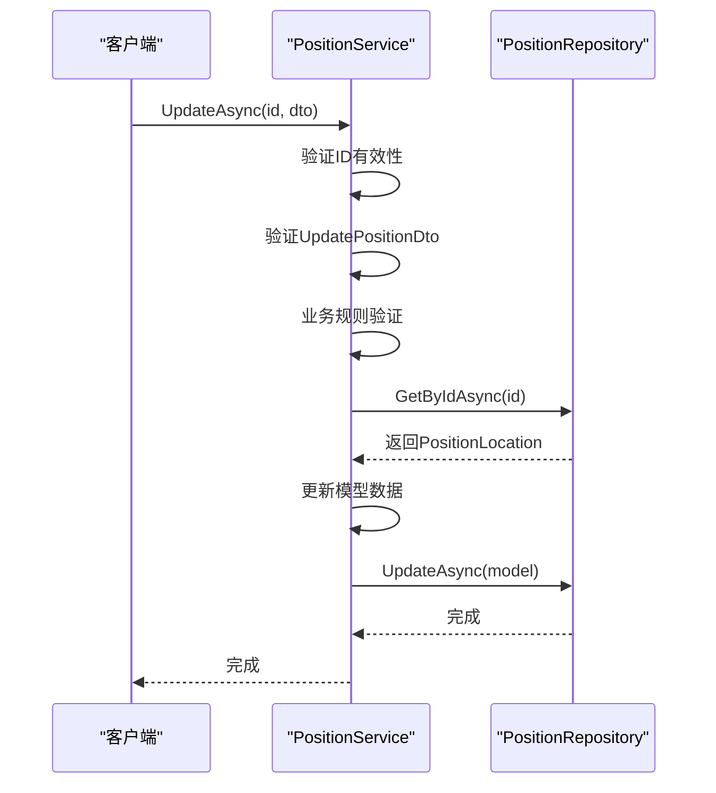
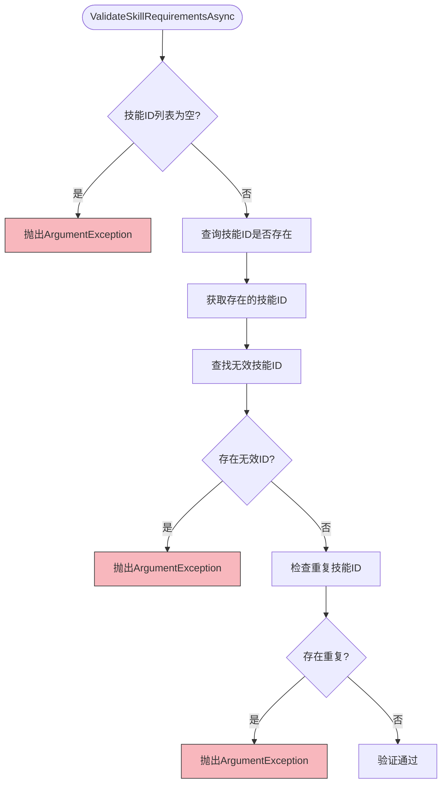
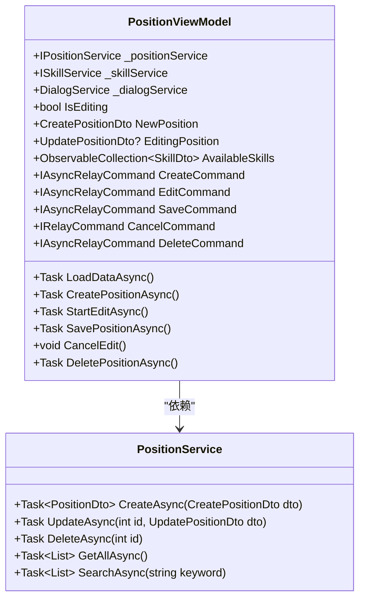
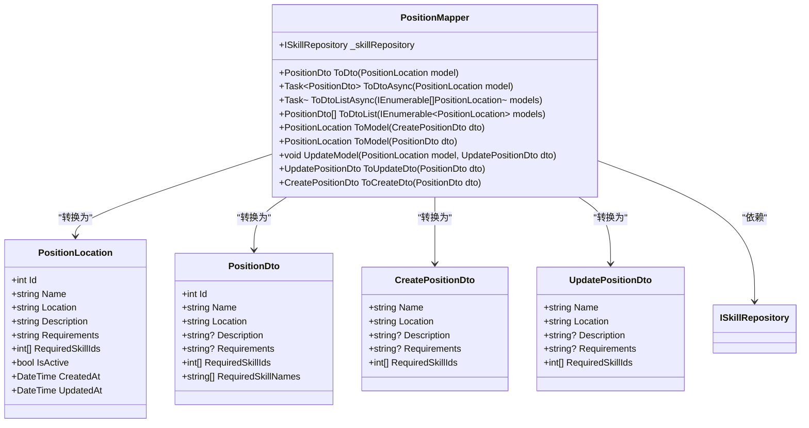
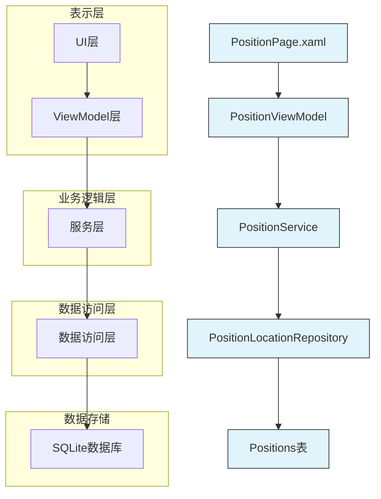

# 哨位服务

<cite>
**Referenced Files in This Document**   
- [PositionService.cs](file://Services/PositionService.cs)
- [PositionViewModel.cs](file://ViewModels/DataManagement/PositionViewModel.cs)
- [PositionMapper.cs](file://DTOs/Mappers/PositionMapper.cs)
- [PositionLocation.cs](file://Models/PositionLocation.cs)
- [PositionDto.cs](file://DTOs/PositionDto.cs)
- [PositionLocationRepository.cs](file://Data/PositionLocationRepository.cs)
- [IPositionService.cs](file://Services/Interfaces/IPositionService.cs)
- [PositionPage.xaml.cs](file://Views/DataManagement/PositionPage.xaml.cs)
</cite>

## 目录
1. [简介](#简介)
2. [核心职责](#核心职责)
3. [数据验证逻辑](#数据验证逻辑)
4. [业务规则验证](#业务规则验证)
5. [与PositionViewModel的协作](#与positionviewmodel的协作)
6. [Model与DTO的转换](#model与dto的转换)
7. [架构与依赖关系](#架构与依赖关系)

## 简介

哨位服务(PositionService)是自动排班系统中的核心业务组件，负责管理哨位的全生命周期操作。该服务实现了`IPositionService`接口，提供了哨位的增删改查、搜索和数据验证等核心功能。服务通过依赖注入获取`IPositionRepository`和`ISkillRepository`来访问数据存储，并使用`PositionMapper`在数据模型和数据传输对象之间进行转换。

**Section sources**
- [PositionService.cs](file://Services/PositionService.cs#L14-L250)
- [IPositionService.cs](file://Services/Interfaces/IPositionService.cs#L9-L46)

## 核心职责

哨位服务的主要职责包括：

- **增删改查操作**：提供`CreateAsync`、`UpdateAsync`、`DeleteAsync`、`GetByIdAsync`和`GetAllAsync`等方法，实现对哨位数据的完整CRUD操作。
- **数据搜索**：通过`SearchAsync`方法支持根据关键词搜索哨位名称和地点。
- **数据验证**：在创建和更新操作中执行严格的数据验证，确保数据完整性。
- **业务规则验证**：通过`ValidatePositionDataAsync`方法验证哨位数据的业务规则完整性。

服务采用依赖注入模式，依赖于`IPositionRepository`进行数据持久化，`ISkillRepository`验证技能要求，以及`PositionMapper`进行数据转换。

**Diagram sources**
- [PositionService.cs](file://Services/PositionService.cs#L14-L250)
- [IPositionService.cs](file://Services/Interfaces/IPositionService.cs#L9-L46)
- [PositionLocationRepository.cs](file://Data/PositionLocationRepository.cs#L14-L243)

**Section sources**
- [PositionService.cs](file://Services/PositionService.cs#L14-L250)
- [PositionLocationRepository.cs](file://Data/PositionLocationRepository.cs#L14-L243)

## 数据验证逻辑

哨位服务在`CreateAsync`和`UpdateAsync`方法中实施了严格的数据验证逻辑，确保输入数据的完整性和有效性。

### CreateAsync方法验证

`CreateAsync`方法首先调用`ValidateCreateDto`方法对`CreatePositionDto`对象进行验证，验证规则包括：

- **哨位名称**：必填项，不能为空或空白，长度不能超过100个字符。
- **地点**：必填项，不能为空或空白，长度不能超过200个字符。
- **介绍**：可选字段，如果提供，长度不能超过500个字符。
- **要求说明**：可选字段，如果提供，长度不能超过1000个字符。
- **技能要求**：必须至少包含一项技能，不能为空或空列表。

**Diagram sources**
- [PositionService.cs](file://Services/PositionService.cs#L14-L250)

### UpdateAsync方法验证

`UpdateAsync`方法的验证逻辑与`CreateAsync`基本相同，通过`ValidateUpdateDto`方法执行验证。唯一的区别是`UpdateAsync`方法需要验证提供的ID是否有效（大于0），并且对应的哨位是否存在。

**Diagram sources**
- [PositionService.cs](file://Services/PositionService.cs#L14-L250)
- [PositionLocationRepository.cs](file://Data/PositionLocationRepository.cs#L14-L243)

**Section sources**
- [PositionService.cs](file://Services/PositionService.cs#L14-L250)

## 业务规则验证

哨位服务通过`ValidateSkillRequirementsAsync`和`ValidatePositionDataAsync`方法实现业务规则验证，确保数据的业务完整性。

### ValidateSkillRequirementsAsync方法

该方法负责验证技能要求的业务规则，主要检查两个方面：

1. **技能ID存在性**：通过`ISkillRepository.GetByIdsAsync`方法查询提供的技能ID是否都存在于系统中。如果存在无效的技能ID，将抛出`ArgumentException`。
2. **技能ID唯一性**：检查提供的技能ID列表中是否有重复项。如果有重复的技能ID，将抛出`ArgumentException`。

**Diagram sources**
- [PositionService.cs](file://Services/PositionService.cs#L14-L250)

### ValidatePositionDataAsync方法

该方法是哨位数据完整性的综合验证器，用于验证`PositionDto`对象是否符合所有业务规则。它检查：

- 哨位名称和地点是否非空
- 技能要求列表是否非空
- 通过调用`ValidateSkillRequirementsAsync`验证技能要求的业务规则

该方法返回布尔值，表示验证是否通过，通常用于在保存前进行最终验证。

**Section sources**
- [PositionService.cs](file://Services/PositionService.cs#L14-L250)

## 与PositionViewModel的协作

哨位服务与`PositionViewModel`紧密协作，为UI层提供数据和业务逻辑支持。

### 依赖关系

`PositionViewModel`通过构造函数注入`IPositionService`，建立与服务的依赖关系。这种设计模式实现了关注点分离，使ViewModel专注于UI逻辑，而服务专注于业务逻辑。

**Diagram sources**
- [PositionViewModel.cs](file://ViewModels/DataManagement/PositionViewModel.cs#L15-L225)
- [PositionService.cs](file://Services/PositionService.cs#L14-L250)

### 操作流程

`PositionViewModel`通过命令模式封装了对`PositionService`的调用：

- **创建操作**：当用户点击"创建"按钮时，`CreateCommand`执行`CreatePositionAsync`方法，调用`PositionService.CreateAsync`创建新哨位。
- **更新操作**：当用户编辑哨位时，`SaveCommand`执行`SavePositionAsync`方法，调用`PositionService.UpdateAsync`更新现有哨位。
- **删除操作**：当用户点击"删除"按钮时，`DeleteCommand`执行`DeletePositionAsync`方法，调用`PositionService.DeleteAsync`删除哨位。
- **数据加载**：`LoadDataAsync`方法调用`PositionService.GetAllAsync`或`SearchAsync`加载哨位数据。

**Section sources**
- [PositionViewModel.cs](file://ViewModels/DataManagement/PositionViewModel.cs#L15-L225)

## Model与DTO的转换

`PositionMapper`负责在数据模型(`PositionLocation`)和数据传输对象(`PositionDto`)之间进行转换，实现了数据层与服务层的解耦。

### 转换方法

`PositionMapper`提供了多种转换方法：

- `ToDto`和`ToDtoAsync`：将`PositionLocation`模型转换为`PositionDto`
- `ToModel`：将`CreatePositionDto`或`PositionDto`转换为`PositionLocation`模型
- `UpdateModel`：将`UpdatePositionDto`的数据更新到现有的`PositionLocation`模型
- `ToDtoList`和`ToDtoListAsync`：批量转换模型列表

### 异步转换

`PositionMapper`的异步转换方法（如`ToDtoAsync`）不仅转换基本数据，还会通过`ISkillRepository`查询技能名称，填充`PositionDto.RequiredSkillNames`字段，为UI显示提供便利。

**Diagram sources**
- [PositionMapper.cs](file://DTOs/Mappers/PositionMapper.cs#L14-L177)
- [PositionLocation.cs](file://Models/PositionLocation.cs#L11-L68)
- [PositionDto.cs](file://DTOs/PositionDto.cs#L9-L59)

**Section sources**
- [PositionMapper.cs](file://DTOs/Mappers/PositionMapper.cs#L14-L177)

## 架构与依赖关系

哨位服务在整个系统架构中处于业务逻辑层，连接数据访问层和表示层。

**Diagram sources**
- [PositionPage.xaml.cs](file://Views/DataManagement/PositionPage.xaml.cs#L12-L12)
- [PositionViewModel.cs](file://ViewModels/DataManagement/PositionViewModel.cs#L15-L225)
- [PositionService.cs](file://Services/PositionService.cs#L14-L250)
- [PositionLocationRepository.cs](file://Data/PositionLocationRepository.cs#L14-L243)
- [PositionLocation.cs](file://Models/PositionLocation.cs#L11-L68)

**Section sources**
- [PositionPage.xaml.cs](file://Views/DataManagement/PositionPage.xaml.cs#L12-L12)
- [PositionViewModel.cs](file://ViewModels/DataManagement/PositionViewModel.cs#L15-L225)
- [PositionService.cs](file://Services/PositionService.cs#L14-L250)
- [PositionLocationRepository.cs](file://Data/PositionLocationRepository.cs#L14-L243)