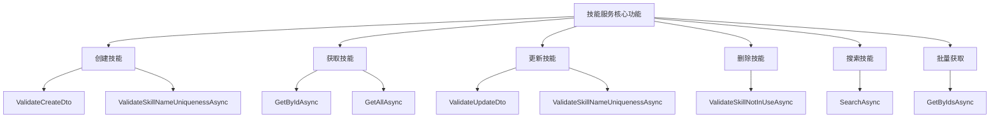
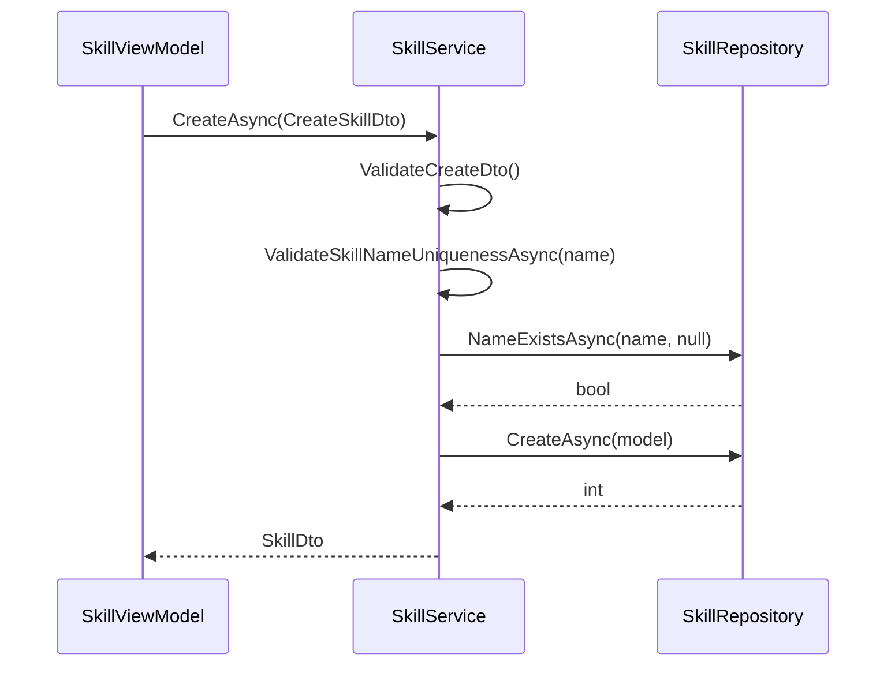
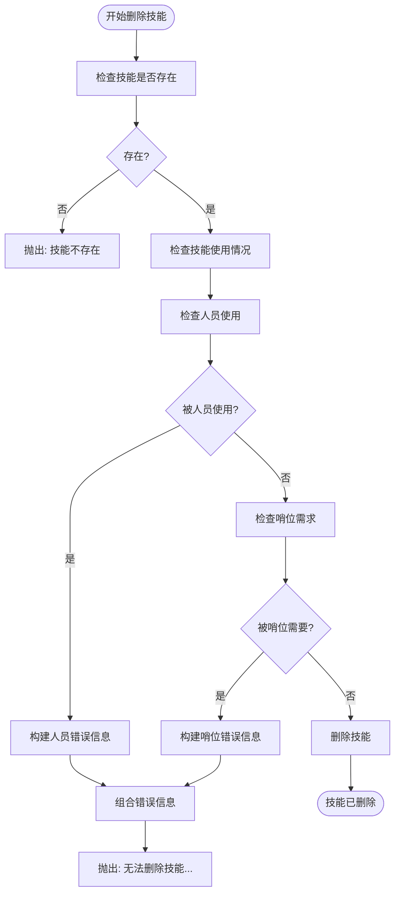
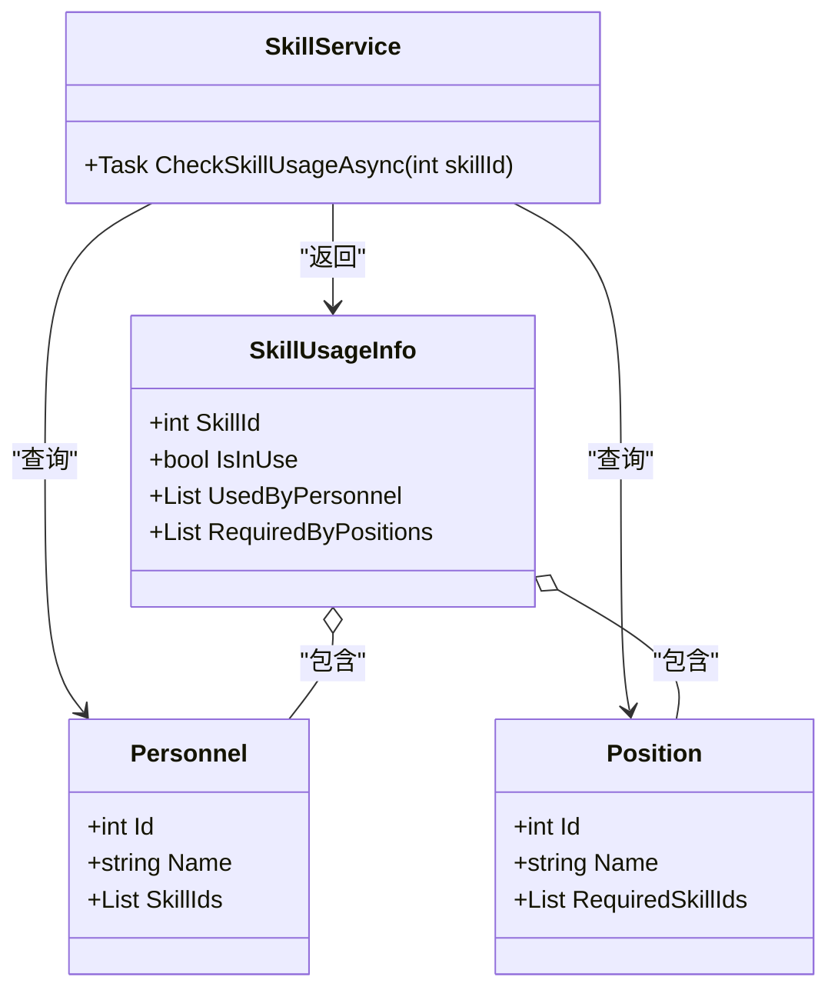
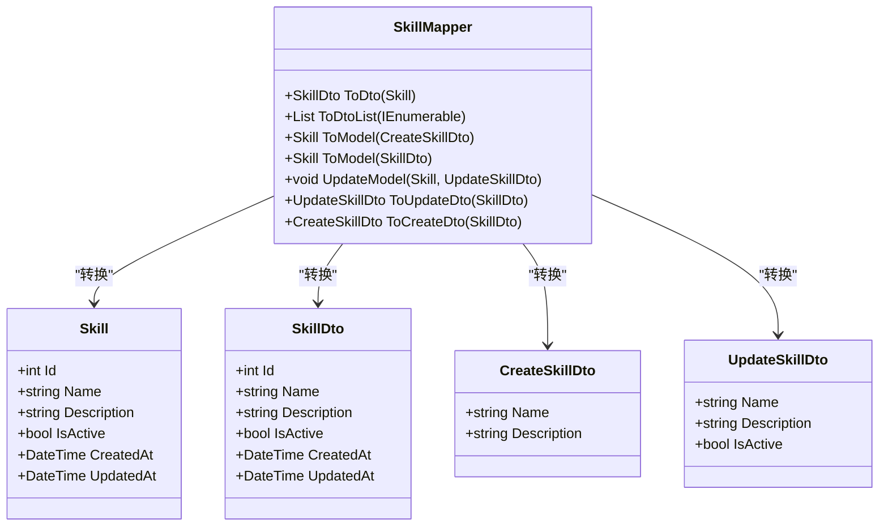
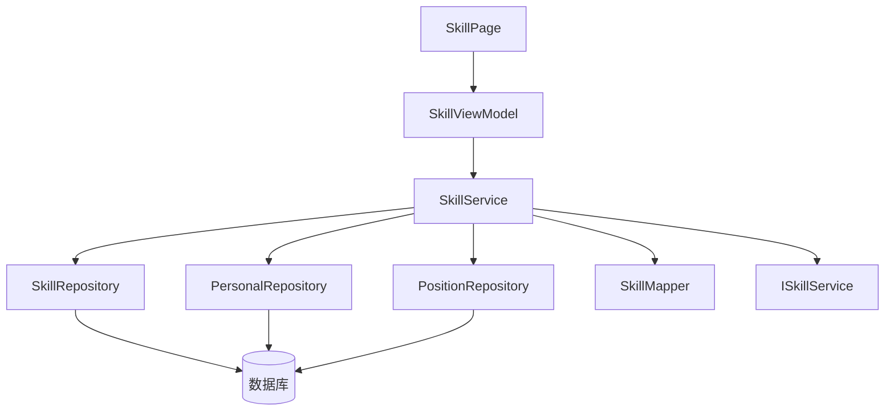

# 技能服务

<cite>
**Referenced Files in This Document**   
- [SkillService.cs](file://Services/SkillService.cs)
- [SkillMapper.cs](file://DTOs/Mappers/SkillMapper.cs)
- [SkillViewModel.cs](file://ViewModels/DataManagement/SkillViewModel.cs)
- [SkillDto.cs](file://DTOs/SkillDto.cs)
- [SkillPage.xaml.cs](file://Views/DataManagement/SkillPage.xaml.cs)
- [ISkillService.cs](file://Services/Interfaces/ISkillService.cs)
- [SkillRepository.cs](file://Data/SkillRepository.cs)
</cite>

## 目录
1. [简介](#简介)
2. [核心功能](#核心功能)
3. [业务规则验证](#业务规则验证)
4. [数据转换与映射](#数据转换与映射)
5. [UI集成与视图模型](#ui集成与视图模型)
6. [依赖关系图](#依赖关系图)

## 简介
技能服务（SkillService）是自动排班系统中的核心组件，负责管理所有与技能相关的操作。该服务实现了技能的增删改查、搜索和批量获取等完整生命周期管理功能。服务通过严格的业务规则验证确保数据完整性，并与视图模型和UI组件紧密集成，为用户提供直观的技能管理界面。

**Section sources**
- [SkillService.cs](file://Services/SkillService.cs#L14-L253)

## 核心功能
技能服务提供了全面的技能管理功能，包括创建、读取、更新、删除、搜索和批量获取操作。服务通过异步方法确保高性能和响应性，所有操作都遵循统一的错误处理和验证机制。



**Diagram sources**
- [SkillService.cs](file://Services/SkillService.cs#L14-L253)

**Section sources**
- [SkillService.cs](file://Services/SkillService.cs#L14-L253)

## 业务规则验证
技能服务实现了严格的业务规则验证，确保数据的一致性和完整性。关键验证包括技能名称唯一性检查和技能使用情况检查。

### 技能名称唯一性验证
`ValidateSkillNameUniquenessAsync` 方法确保技能名称在整个系统中是唯一的。在创建新技能时，该方法检查指定名称是否已存在；在更新现有技能时，它会排除当前技能ID以允许名称不变的更新。



**Diagram sources**
- [SkillService.cs](file://Services/SkillService.cs#L215-L225)
- [SkillRepository.cs](file://Data/SkillRepository.cs#L245-L259)

### 技能使用情况检查
`ValidateSkillNotInUseAsync` 方法在删除技能前检查其是否被其他实体引用。该方法会检查人员和哨位两个维度，如果技能正在被使用，则抛出包含详细信息的异常。

当删除被引用的技能时，服务会抛出详细的错误信息：
- 如果有人员使用该技能，错误信息会列出所有使用该技能的人员姓名
- 如果有哨位需要该技能，错误信息会列出所有需要该技能的哨位名称



**Diagram sources**
- [SkillService.cs](file://Services/SkillService.cs#L227-L256)

### 技能使用情况查询
`CheckSkillUsageAsync` 方法提供了一种非破坏性的方式来检查技能的使用情况。该方法返回一个 `SkillUsageInfo` 对象，详细说明技能被哪些人员使用以及被哪些哨位需要。



**Diagram sources**
- [SkillService.cs](file://Services/SkillService.cs#L258-L264)
- [SkillService.cs](file://Services/SkillService.cs#L257-L264)

**Section sources**
- [SkillService.cs](file://Services/SkillService.cs#L215-L256)

## 数据转换与映射
技能服务通过 `SkillMapper` 类实现数据模型与数据传输对象（DTO）之间的转换。这种分离确保了领域模型的稳定性，同时提供了灵活的数据传输格式。



**Diagram sources**
- [SkillMapper.cs](file://DTOs/Mappers/SkillMapper.cs#L12-L127)

**Section sources**
- [SkillMapper.cs](file://DTOs/Mappers/SkillMapper.cs#L12-L127)

## UI集成与视图模型
技能服务与 `SkillViewModel` 紧密集成，为UI提供数据和命令。`SkillPage` 作为视图，通过 `SkillViewModel` 与 `SkillService` 交互，实现了完整的MVVM模式。

```mermaid
graph TB
subgraph "View"
SP[SkillPage]
end
subgraph "ViewModel"
SVM[SkillViewModel]
end
subgraph "Service"
SS[SkillService]
end
subgraph "Repository"
SR[SkillRepository]
end
SP --> SVM : "绑定 ViewModel"
SVM --> SS : "调用服务方法"
SS --> SR : "访问数据"
SR --> SS : "返回数据"
SS --> SVM : "返回结果"
SVM --> SP : "更新 UI"
```

**Diagram sources**
- [SkillViewModel.cs](file://ViewModels/DataManagement/SkillViewModel.cs#L13-L204)
- [SkillPage.xaml.cs](file://Views/DataManagement/SkillPage.xaml.cs#L12-L21)

**Section sources**
- [SkillViewModel.cs](file://ViewModels/DataManagement/SkillViewModel.cs#L13-L204)
- [SkillPage.xaml.cs](file://Views/DataManagement/SkillPage.xaml.cs#L12-L21)

## 依赖关系图
技能服务的完整依赖关系展示了其在整个系统架构中的位置和交互。



**Diagram sources**
- [SkillService.cs](file://Services/SkillService.cs#L14-L253)
- [SkillMapper.cs](file://DTOs/Mappers/SkillMapper.cs#L12-L127)
- [SkillViewModel.cs](file://ViewModels/DataManagement/SkillViewModel.cs#L13-L204)
- [SkillPage.xaml.cs](file://Views/DataManagement/SkillPage.xaml.cs#L12-L21)
- [ISkillService.cs](file://Services/Interfaces/ISkillService.cs#L9-L50)
- [SkillRepository.cs](file://Data/SkillRepository.cs#L14-L259)

**Section sources**
- [SkillService.cs](file://Services/SkillService.cs#L14-L253)
- [SkillMapper.cs](file://DTOs/Mappers/SkillMapper.cs#L12-L127)
- [SkillViewModel.cs](file://ViewModels/DataManagement/SkillViewModel.cs#L13-L204)
- [SkillPage.xaml.cs](file://Views/DataManagement/SkillPage.xaml.cs#L12-L21)
- [ISkillService.cs](file://Services/Interfaces/ISkillService.cs#L9-L50)
- [SkillRepository.cs](file://Data/SkillRepository.cs#L14-L259)