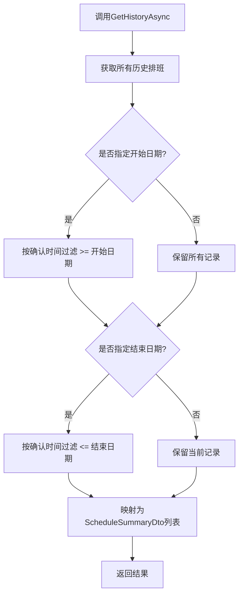
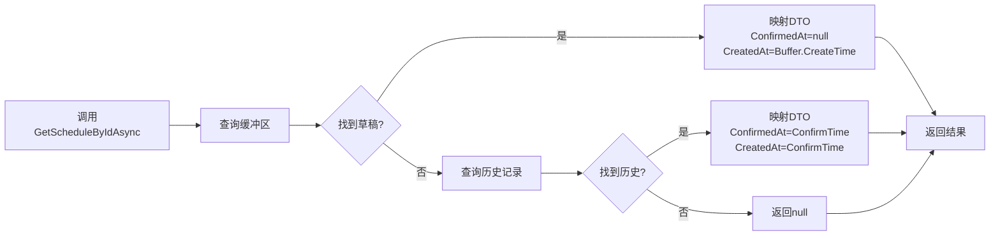
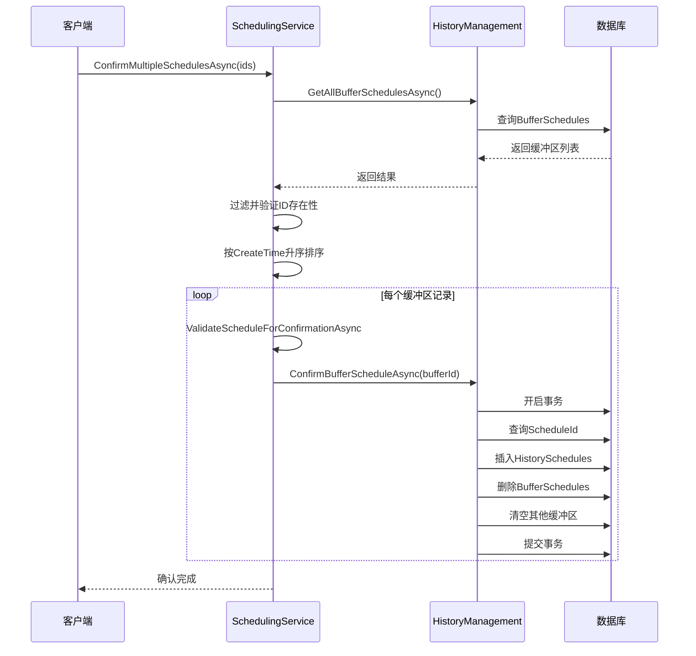
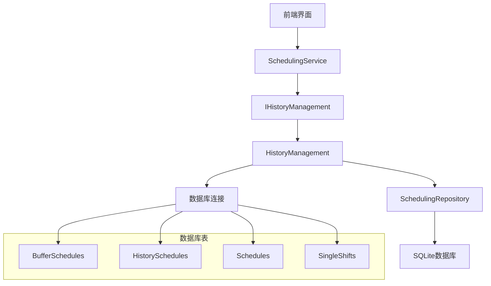
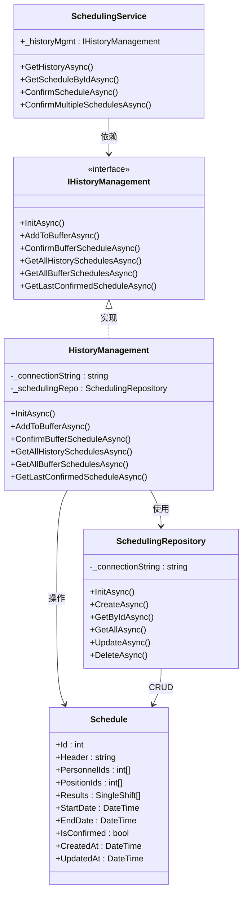

# 历史记录管理

<cite>
**本文档中引用的文件**  
- [SchedulingService.cs](file://Services/SchedulingService.cs)
- [HIstoryManagement.cs](file://History/HIstoryManagement.cs)
- [IHistoryManagement.cs](file://History/IHistoryManagement.cs)
- [Schedule.cs](file://Models/Schedule.cs)
- [ScheduleDto.cs](file://DTOs/ScheduleDto.cs)
- [SchedulingRepository.cs](file://Data/SchedulingRepository.cs)
</cite>

## 目录
1. [简介](#简介)
2. [历史记录查询功能](#历史记录查询功能)
3. [统一排班查询逻辑](#统一排班查询逻辑)
4. [排班确认流程](#排班确认流程)
5. [实际应用场景](#实际应用场景)
6. [架构与数据流](#架构与数据流)
7. [依赖关系分析](#依赖关系分析)

## 简介
本系统提供完整的历史记录管理功能，支持对已确认排班记录的查询、草稿与历史排班的统一查询、以及单个或批量排班的确认操作。核心功能通过`SchedulingService`与`HistoryManagement`组件协同实现，采用缓冲区（Buffer）和历史记录（History）双表结构进行数据管理，确保操作的原子性和数据一致性。

## 历史记录查询功能

`GetHistoryAsync`方法用于从历史管理系统中获取所有已确认的排班记录，并支持按日期范围进行过滤。该方法首先调用`IHistoryManagement.GetAllHistorySchedulesAsync()`获取全部历史记录，然后根据传入的`startDate`和`endDate`参数对结果进行筛选。

返回的`ScheduleSummaryDto`列表包含排班的基本信息，如ID、标题、人员数量、岗位数量、班次数量等。特别地，`CreatedAt`字段优先使用排班自身的创建时间，若为空则回退为确认时间；`ConfirmedAt`字段则直接映射历史记录中的确认时间。

**图示来源**  
- [SchedulingService.cs](file://Services/SchedulingService.cs#L200-L219)
- [HIstoryManagement.cs](file://History/HIstoryManagement.cs#L150-L170)

**本节来源**  
- [SchedulingService.cs](file://Services/SchedulingService.cs#L200-L219)
- [HIstoryManagement.cs](file://History/HIstoryManagement.cs#L150-L170)

## 统一排班查询逻辑

`GetScheduleByIdAsync`方法实现了对草稿和历史排班的统一查询逻辑。该方法首先尝试在缓冲区中查找指定ID的排班，若存在则返回草稿版本，其`ConfirmedAt`为null，`CreatedAt`使用缓冲区记录的创建时间。

若未在缓冲区找到，则继续在历史记录中查找。若存在，则返回已确认版本，其`ConfirmedAt`和`CreatedAt`均设置为历史记录中的确认时间（根据业务逻辑，已确认排班的创建时间也以确认时间为准）。

此设计实现了对前端透明的统一接口，无论排班处于草稿还是历史状态，均可通过同一方法获取，简化了调用方的处理逻辑。

**图示来源**  
- [SchedulingService.cs](file://Services/SchedulingService.cs#L159-L175)
- [HIstoryManagement.cs](file://History/HIstoryManagement.cs#L130-L150)

**本节来源**  
- [SchedulingService.cs](file://Services/SchedulingService.cs#L159-L175)
- [HIstoryManagement.cs](file://History/HIstoryManagement.cs#L130-L150)

## 排班确认流程

### 单个排班确认
`ConfirmScheduleAsync`方法负责将指定ID的草稿排班确认为历史记录。执行前会进行业务规则验证，确保排班结果满足关键约束（如无关键时段未分配、无人员过度工作等）。验证通过后，调用`IHistoryManagement.ConfirmBufferScheduleAsync`完成确认操作。

### 批量排班确认
`ConfirmMultipleSchedulesAsync`方法支持批量确认多个草稿排班。其实现包含以下关键步骤：
1. 验证输入的排班ID列表非空
2. 从缓冲区中查找所有对应的草稿记录
3. 验证所有指定ID均存在，否则抛出异常
4. **按创建时间升序排序**，确保先创建的排班先被确认
5. 依次对每个排班执行验证和确认操作

该批量确认策略保证了排班历史的时序一致性，避免因并发操作导致的时间顺序混乱。

**图示来源**  
- [SchedulingService.cs](file://Services/SchedulingService.cs#L250-L280)
- [HIstoryManagement.cs](file://History/HIstoryManagement.cs#L80-L110)

**本节来源**  
- [SchedulingService.cs](file://Services/SchedulingService.cs#L250-L280)
- [HIstoryManagement.cs](file://History/HIstoryManagement.cs#L80-L110)

## 实际应用场景

### 历史查询
用户可通过`GetHistoryAsync(startDate, endDate)`查询特定时间段内的所有已确认排班，用于审计、统计或对比分析。

### 排班对比
通过`GetScheduleByIdAsync`分别获取新生成的草稿排班和最近的历史排班，可在前端进行可视化对比，辅助决策。

### 确认操作
用户在审查草稿排班后，可通过`ConfirmScheduleAsync`将其正式确认。对于周期性排班任务，可使用`ConfirmMultipleSchedulesAsync`批量确认一周或一月的排班计划，提高操作效率。

## 架构与数据流

系统采用分层架构，历史记录管理功能涉及以下核心组件：

**图示来源**  
- [SchedulingService.cs](file://Services/SchedulingService.cs)
- [HIstoryManagement.cs](file://History/HIstoryManagement.cs)
- [SchedulingRepository.cs](file://Data/SchedulingRepository.cs)

**本节来源**  
- [SchedulingService.cs](file://Services/SchedulingService.cs)
- [HIstoryManagement.cs](file://History/HIstoryManagement.cs)
- [SchedulingRepository.cs](file://Data/SchedulingRepository.cs)

## 依赖关系分析

历史记录管理功能依赖以下关键组件和服务：

**图示来源**  
- [SchedulingService.cs](file://Services/SchedulingService.cs)
- [IHistoryManagement.cs](file://History/IHistoryManagement.cs)
- [HIstoryManagement.cs](file://History/HIstoryManagement.cs)
- [SchedulingRepository.cs](file://Data/SchedulingRepository.cs)
- [Schedule.cs](file://Models/Schedule.cs)

**本节来源**  
- [SchedulingService.cs](file://Services/SchedulingService.cs)
- [IHistoryManagement.cs](file://History/IHistoryManagement.cs)
- [HIstoryManagement.cs](file://History/HIstoryManagement.cs)
- [SchedulingRepository.cs](file://Data/SchedulingRepository.cs)
- [Schedule.cs](file://Models/Schedule.cs)