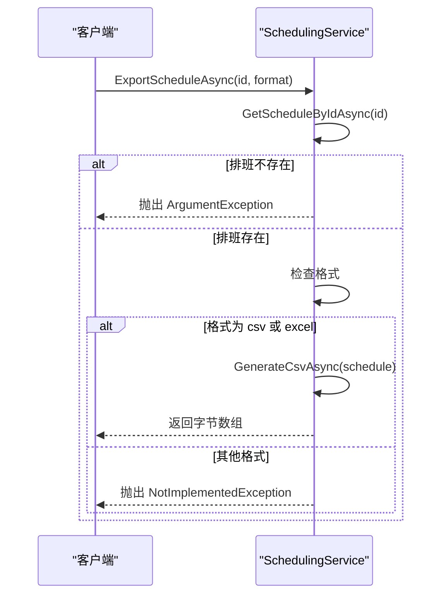

# 排班导出

<cite>
**Referenced Files in This Document**   
- [SchedulingService.cs](file://Services/SchedulingService.cs)
- [ISchedulingService.cs](file://Services/Interfaces/ISchedulingService.cs)
- [ScheduleDto.cs](file://DTOs/ScheduleDto.cs)
- [Schedule.cs](file://Models/Schedule.cs)
- [IPositionRepository.cs](file://Data/Interfaces/IPositionRepository.cs)
- [README.md](file://README.md)
</cite>

## 目录
1. [排班导出功能概述](#排班导出功能概述)
2. [ExportScheduleAsync方法分析](#exportscheduleasync方法分析)
3. [GenerateCsvAsync内部实现](#generatecsvasync内部实现)
4. [数据格式化与特殊字符处理](#数据格式化与特殊字符处理)
5. [导出格式限制与扩展可能性](#导出格式限制与扩展可能性)
6. [用户工作流中的应用场景](#用户工作流中的应用场景)
7. [性能考虑](#性能考虑)

## 排班导出功能概述

排班导出功能是AutoScheduling3自动排班系统中的重要组成部分，允许用户将生成的排班数据导出为结构化文件，便于在外部系统中查看、分析和存档。该功能主要服务于管理人员和调度员，使他们能够将排班结果分享给相关人员或集成到其他办公系统中。

根据系统文档，排班导出功能通过`ExportScheduleAsync`方法实现，该方法根据提供的排班ID获取相应的排班数据，并支持多种格式的导出。目前系统实现了CSV格式的导出，同时预留了对Excel等其他格式的支持。导出的文件以表格形式组织数据，其中行代表哨位，列代表日期，单元格内容显示该哨位在该日期的班次安排。

**Section sources**
- [README.md](file://README.md#L1-L285)

## ExportScheduleAsync方法分析

`ExportScheduleAsync`方法是排班导出功能的主要入口点，负责协调整个导出流程。该方法接收两个参数：排班ID和导出格式，返回一个字节数组，表示导出文件的二进制内容。

方法首先通过`GetScheduleByIdAsync`方法根据提供的ID获取排班数据。如果找不到对应的排班记录，方法会抛出`ArgumentException`异常。获取到排班数据后，方法检查请求的导出格式。目前系统支持"csv"和"excel"两种格式（不区分大小写），这两种格式都通过`GenerateCsvAsync`方法实现。对于不支持的格式，方法会抛出`NotImplementedException`异常，提示用户该格式尚未实现。

该方法的设计体现了良好的错误处理机制和扩展性考虑。通过将格式检查与实际生成逻辑分离，系统可以轻松地在未来添加新的导出格式，而无需修改主方法的结构。

**Diagram sources **
- [SchedulingService.cs](file://Services/SchedulingService.cs#L221-L235)

**Section sources**
- [SchedulingService.cs](file://Services/SchedulingService.cs#L221-L235)
- [ISchedulingService.cs](file://Services/Interfaces/ISchedulingService.cs#L47-L47)

## GenerateCsvAsync内部实现

`GenerateCsvAsync`方法是排班导出功能的核心实现，负责将排班数据转换为CSV格式的文本内容。该方法接收一个`ScheduleDto`对象作为输入，返回包含CSV内容的字节数组。

方法的实现分为两个主要部分：表头生成和数据行构建。

### 表头生成

表头行以"Position/Date"开始，表示第一列是哨位名称，后续每列对应一个日期。方法通过循环从排班的开始日期到结束日期，为每一天生成一个日期列，格式为"yyyy-MM-dd"。这种设计使得导出的文件具有清晰的时间序列结构，便于用户按日期查看排班情况。

### 数据行构建

数据行按哨位组织，每个哨位对应一行。方法首先使用`ToLookup`方法将班次数据按哨位ID分组，然后从数据库获取所有相关哨位的信息。对于每个哨位，方法生成一行数据：

1. 第一个单元格是哨位名称，用双引号包围以处理可能包含逗号的名称
2. 对于每一天，方法查找该哨位在当天的所有班次，按开始时间排序
3. 每个班次信息格式化为"人员姓名(开始时间-结束时间)"的形式
4. 同一天的多个班次用" | "分隔
5. 最终的单元格内容用双引号包围，防止CSV解析错误

这种按哨位组织数据的方式符合管理人员查看排班的常规习惯，使他们能够快速了解每个哨位在整个排班周期内的人员安排情况。

**Diagram sources **
- [SchedulingService.cs](file://Services/SchedulingService.cs#L237-L277)
- [ScheduleDto.cs](file://DTOs/ScheduleDto.cs#L40-L89)
- [Schedule.cs](file://Models/Schedule.cs#L43-L67)
- [IPositionRepository.cs](file://Data/Interfaces/IPositionRepository.cs#L18-L21)

**Section sources**
- [SchedulingService.cs](file://Services/SchedulingService.cs#L237-L277)

## 数据格式化与特殊字符处理

在导出过程中，系统采用了多种技术确保生成的CSV文件能够在Excel等电子表格软件中正确显示。

### 单元格内容格式化

系统使用StringBuilder高效地构建CSV内容。为了处理可能包含逗号、引号等特殊字符的文本，所有单元格内容（包括哨位名称和班次信息）都用双引号包围。这是CSV格式的标准做法，可以防止内容中的逗号被误解析为字段分隔符。

### 班次信息格式

班次信息采用"人员姓名(开始时间-结束时间)"的格式，这种格式清晰直观，便于用户快速理解。例如，"张三(08:00-10:00)"明确表示张三在8点到10点值班。同一天同一哨位的多个班次用" | "分隔，这种分隔符在中文环境中易于阅读，且不太可能出现在人员姓名中，减少了歧义。

### 字符编码

生成的CSV内容使用UTF-8编码转换为字节数组，确保中文字符能够正确显示。UTF-8是广泛支持的编码格式，能够处理包括中文在内的各种Unicode字符，避免了在不同系统间传输时出现乱码问题。

这些格式化策略共同确保了导出文件的可读性和兼容性，使用户无需额外处理即可在Excel中直接打开和查看排班数据。

**Section sources**
- [SchedulingService.cs](file://Services/SchedulingService.cs#L237-L277)

## 导出格式限制与扩展可能性

目前，排班导出功能仅实际支持CSV格式，尽管接口声明支持"excel"格式。当用户请求"excel"格式时，系统仍然生成CSV内容。这种设计可能是为了保持接口的前瞻性，为未来真正的Excel支持做准备。

### 当前限制

- **单一格式支持**：尽管接口允许多种格式，但实际只实现了CSV
- **无样式支持**：生成的CSV文件是纯文本，没有字体、颜色、边框等样式信息
- **无公式支持**：文件不包含任何Excel公式或计算
- **大文件处理**：对于包含大量日期或哨位的排班，生成的文件可能很大，影响Excel的加载性能

### 未来扩展可能性

系统架构为扩展其他导出格式提供了良好的基础：

1. **真正的Excel支持**：可以使用如EPPlus或ClosedXML等库生成真正的.xlsx文件，支持样式、公式和数据验证
2. **PDF导出**：可以添加PDF格式支持，生成适合打印的排班表
3. **HTML导出**：生成网页格式的排班表，支持交互式功能
4. **JSON导出**：为系统集成提供机器可读的格式

扩展这些功能时，可以保持`ExportScheduleAsync`方法的接口不变，只需为新的格式添加相应的生成方法，并在格式检查后调用相应的方法即可。这种设计遵循了开闭原则，使系统易于扩展而不影响现有功能。

**Section sources**
- [SchedulingService.cs](file://Services/SchedulingService.cs#L221-L235)

## 用户工作流中的应用场景

排班导出功能在用户的日常工作中扮演着重要角色，主要应用于以下几个场景：

### 排班确认后分发

当调度员完成排班并确认后，他们通常需要将排班结果分发给相关人员。通过导出功能，调度员可以生成CSV文件，通过电子邮件或即时通讯工具发送给各哨位负责人，确保信息及时传达。

### 会议讨论与审查

在管理会议上，团队需要审查排班安排的合理性和公平性。导出的CSV文件可以导入到电子表格软件中，便于进行排序、筛选和条件格式化，帮助管理者快速识别潜在问题，如人员工作量不均衡或休息日分配不公平。

### 存档与审计

组织需要保留排班记录以备审计和历史查询。导出的文件可以按日期命名并存储在文件服务器或文档管理系统中，形成完整的排班历史档案。

### 与其他系统集成

导出的CSV文件可以作为数据源，导入到人力资源管理系统、考勤系统或财务系统中，用于计算工资、统计工作量或生成报告，实现系统间的数据流动。

这些应用场景体现了导出功能在连接排班系统与其他业务流程中的桥梁作用。

**Section sources**
- [README.md](file://README.md#L1-L285)

## 性能考虑

排班导出功能的性能主要受排班周期长度和哨位数量的影响。系统在设计时考虑了以下性能因素：

### 时间复杂度

`GenerateCsvAsync`方法的时间复杂度主要由嵌套循环决定。外层循环遍历所有哨位（O(P)），内层循环遍历所有日期（O(D)），在每个日期内还需要查找和排序班次（O(S)）。总体时间复杂度为O(P×D×S)，其中P是哨位数量，D是排班天数，S是平均每天每个哨位的班次数。

### 内存使用

方法使用StringBuilder构建整个CSV内容，这意味着内存使用量与最终文件大小成正比。对于大型排班，这可能导致较高的内存占用。然而，这种方法避免了频繁的字符串拼接操作，提高了生成效率。

### 优化建议

1. **分页导出**：对于超大排班，可以考虑分页导出，每次只生成部分日期的数据
2. **异步流式生成**：改用流式生成方式，边生成边写入文件，减少内存峰值
3. **缓存机制**：对于频繁导出的排班，可以缓存生成的文件，避免重复计算

目前的实现对于常规规模的排班（如一个月内，几十个哨位）性能表现良好，能够快速响应用户请求。

**Section sources**
- [SchedulingService.cs](file://Services/SchedulingService.cs#L237-L277)
- [README.md](file://README.md#L1-L285)