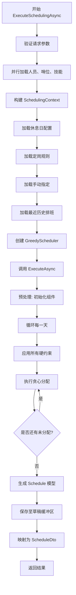

# 排班执行

<cite>
**本文档中引用的文件**  
- [SchedulingService.cs](file://Services/SchedulingService.cs)
- [SchedulingContext.cs](file://SchedulingEngine/Core/SchedulingContext.cs)
- [GreedyScheduler.cs](file://SchedulingEngine/GreedyScheduler.cs)
- [ScheduleDto.cs](file://DTOs/ScheduleDto.cs)
- [SchedulingRequestDto.cs](file://DTOs/SchedulingRequestDto.cs)
</cite>

## 目录
1. [引言](#引言)
2. [排班请求与参数验证](#排班请求与参数验证)
3. [并行数据加载与上下文构建](#并行数据加载与上下文构建)
4. [约束配置填充上下文](#约束配置填充上下文)
5. [调用贪心排班算法](#调用贪心排班算法)
6. [请求构建与异步调用示例](#请求构建与异步调用示例)
7. [异常处理机制](#异常处理机制)
8. [性能优化策略](#性能优化策略)

## 引言
本文档深入解析排班系统的核心执行流程，重点围绕 `ExecuteSchedulingAsync` 方法展开。该方法是整个排班引擎的入口，负责接收排班请求、验证参数、加载必要数据、构建调度上下文，并最终触发排班算法。文档将详细阐述其内部实现机制，包括并行处理、上下文管理、约束应用和异常处理，为开发者提供全面的技术参考。

## 排班请求与参数验证
`ExecuteSchedulingAsync` 方法接收一个 `SchedulingRequestDto` 对象作为核心输入，该对象封装了排班所需的所有配置信息。

### SchedulingRequestDto 请求对象
该数据传输对象（DTO）定义了排班任务的完整参数集，其主要属性包括：
- **Title**: 排班表的名称，不能为空且长度在1-100字符之间。
- **StartDate / EndDate**: 排班周期的起止日期，结束日期不得早于开始日期，且周期最长不超过365天。
- **PersonnelIds / PositionIds**: 参与排班的人员和哨位ID列表，两者都必须至少包含一个元素。
- **UseActiveHolidayConfig**: 布尔值，指示是否使用当前激活的休息日配置。
- **HolidayConfigId**: 可选，指定一个特定的休息日配置ID。
- **EnabledFixedRuleIds**: 可选，指定要启用的定岗规则ID列表。
- **EnabledManualAssignmentIds**: 可选，指定要启用的手动指定分配ID列表。

**Section sources**
- [SchedulingRequestDto.cs](file://DTOs/SchedulingRequestDto.cs#L1-L45)

### 参数验证流程
在执行任何业务逻辑之前，系统会进行严格的参数验证，分为两个层次：

1.  **基础参数验证 (`ValidateRequest`)**:
    *   检查 `request` 对象本身是否为 `null`。
    *   验证 `Title` 是否为空或空白。
    *   确保 `StartDate` 不晚于 `EndDate`。
    *   确认 `PersonnelIds` 和 `PositionIds` 列表不为空。
    *   限制排班周期不超过365天。

2.  **业务规则验证 (`ValidateSchedulingRequestBusinessLogicAsync`)**:
    *   **存在性验证**: 检查请求中的所有人员和哨位ID是否在数据库中真实存在。
    *   **可用性验证**: 确保所有选中的人员当前状态为“可用”且未“退休”。
    *   **技能兼容性验证**: 检查是否有至少一名人员具备所有哨位所要求的技能，避免出现无法胜任的情况。
    *   **数量合理性验证**: 计算理论上的最大班次供给（人员数 × 天数 × 8个时段）与总需求（哨位数 × 天数 × 12个时段），确保供给大于需求。如果利用率超过80%，会记录警告日志。

此双重验证机制确保了排班任务在启动前就具备了数据的完整性和业务的可行性。

**Section sources**
- [SchedulingService.cs](file://Services/SchedulingService.cs#L284-L300)
- [SchedulingService.cs](file://Services/SchedulingService.cs#L457-L530)

## 并行数据加载与上下文构建
为了提升性能，系统采用并行方式加载排班所需的基础数据。

### 并行数据加载
方法通过 `Task.WhenAll` 同时发起三个异步数据加载任务：
1.  **人员数据**: 调用 `IPersonalRepository.GetPersonnelByIdsAsync` 根据 `PersonnelIds` 加载所有相关人员的完整信息。
2.  **哨位数据**: 调用 `IPositionRepository.GetPositionsByIdsAsync` 根据 `PositionIds` 加载所有相关哨位的完整信息。
3.  **技能数据**: 调用 `ISkillRepository.GetAllAsync` 加载系统中所有的技能信息。

这三个任务是独立的，可以并行执行，显著减少了总的等待时间。

### 构建 SchedulingContext 上下文
当所有数据加载完成后，系统会立即构建一个 `SchedulingContext` 对象。这个上下文是排班算法的核心数据容器，它将所有零散的数据整合为一个结构化的整体，供后续的算法使用。

`SchedulingContext` 的初始化包括：
- 将并行加载得到的 `Personals`、`Positions` 和 `Skills` 列表赋值给上下文。
- 设置 `StartDate` 和 `EndDate`。
- 初始化内部的映射字典（如 `PersonIdToIdx`），用于在人员/哨位的ID和其在数组中的索引之间进行快速转换，这是算法高效运行的基础。

**Section sources**
- [SchedulingService.cs](file://Services/SchedulingService.cs#L65-L87)
- [SchedulingContext.cs](file://SchedulingEngine/Core/SchedulingContext.cs#L10-L25)

## 约束配置填充上下文
在基础数据加载完毕后，系统会根据 `SchedulingRequestDto` 中的配置，从数据库加载相应的约束规则，并填充到 `SchedulingContext` 中。

### 休息日配置 (HolidayConfig)
根据请求中的 `UseActiveHolidayConfig` 和 `HolidayConfigId` 字段决定加载哪个配置：
- 如果 `UseActiveHolidayConfig` 为 `true`，则加载当前系统中被标记为“激活”的休息日配置。
- 否则，如果 `HolidayConfigId` 有值，则加载指定ID的配置。
- 该配置最终被赋值给 `context.HolidayConfig`，用于判断某一天是否为休息日。

### 定岗规则 (FixedPositionRules)
根据请求中的 `EnabledFixedRuleIds` 列表决定加载哪些规则：
- 如果列表不为空，则只加载ID在该列表中的、且状态为“启用”的定岗规则。
- 否则，加载所有状态为“启用”的定岗规则。
- 这些规则被赋值给 `context.FixedPositionRules`，用于在排班时强制某些人员必须或不能在特定哨位上工作。

### 手动指定 (ManualAssignments)
根据请求中的 `EnabledManualAssignmentIds` 列表和排班日期范围加载手动指定：
- 如果列表不为空，则只加载ID在该列表中、状态为“启用”、且日期在排班范围内的手动指定。
- 否则，加载所有在排班日期范围内、状态为“启用”的手动指定。
- 这些手动指定被赋值给 `context.ManualAssignments`，算法会优先满足这些硬性要求。

### 历史排班数据
最后，系统会从历史管理服务中获取最近一次已确认的排班表（`LastConfirmedSchedule`），并将其赋值给上下文。这一信息对于计算“休息间隔”等软约束的评分至关重要，确保新排班能与历史排班平滑衔接。

**Section sources**
- [SchedulingService.cs](file://Services/SchedulingService.cs#L89-L122)
- [SchedulingContext.cs](file://SchedulingEngine/Core/SchedulingContext.cs#L27-L35)

## 调用贪心排班算法
当 `SchedulingContext` 完全构建并填充好所有数据后，系统正式进入排班计算阶段。

### 初始化 GreedyScheduler
系统创建一个 `GreedyScheduler` 实例，并将已准备好的 `SchedulingContext` 作为构造函数参数传入。这使得调度器能够访问到所有必要的数据和规则。

### 执行排班
调度器的 `ExecuteAsync` 方法被调用，并传入 `cancellationToken` 以支持异步取消。该方法的执行流程如下：
1.  **预处理**: 初始化内部的可行性张量（`FeasibilityTensor`）、MRV（最小剩余值）策略、评分计算器等核心组件。
2.  **按天循环**: 对排班周期内的每一天进行循环处理。
3.  **应用约束**: 在每一天开始时，根据上下文中的所有硬约束（如技能、休息日、定岗规则、手动指定等）更新可行性张量，标记出哪些人员在哪些时段和哨位上是不可行的。
4.  **贪心分配**: 使用MRV策略选择下一个最需要分配的“时段-哨位”组合，然后使用软约束评分计算器从所有可行的人员中选择得分最高的人员进行分配。
5.  **更新状态**: 每次成功分配后，更新张量、评分状态和MRV策略，为下一次分配做准备。
6.  **生成结果**: 当所有天数处理完毕后，将内部的分配记录转换为一个 `Schedule` 模型对象并返回。



**Diagram sources**
- [SchedulingService.cs](file://Services/SchedulingService.cs#L57-L140)
- [GreedyScheduler.cs](file://SchedulingEngine/GreedyScheduler.cs#L50-L120)

**Section sources**
- [SchedulingService.cs](file://Services/SchedulingService.cs#L124-L140)
- [GreedyScheduler.cs](file://SchedulingEngine/GreedyScheduler.cs#L50-L120)

## 请求构建与异步调用示例
以下是一个典型的前端或服务调用方如何构建请求并调用 `ExecuteSchedulingAsync` 的代码示例。

### 构建 SchedulingRequestDto
```csharp
var request = new SchedulingRequestDto
{
    Title = "国庆节排班",
    StartDate = new DateTime(2023, 10, 1),
    EndDate = new DateTime(2023, 10, 7),
    PersonnelIds = new List<int> { 101, 102, 103 },
    PositionIds = new List<int> { 201, 202 },
    UseActiveHolidayConfig = true,
    EnabledFixedRuleIds = new List<int> { 501 },
    EnabledManualAssignmentIds = new List<int> { 601 }
};
```

### 异步调用与取消令牌
```csharp
try
{
    // 创建取消令牌源
    var cts = new CancellationTokenSource(TimeSpan.FromMinutes(5)); // 5分钟后自动取消

    // 异步调用排班服务
    var resultDto = await schedulingService.ExecuteSchedulingAsync(request, cts.Token);

    // 处理成功结果
    Console.WriteLine($"排班成功，ID: {resultDto.Id}");
}
catch (OperationCanceledException)
{
    // 处理取消或超时
    Console.WriteLine("排班操作已取消或超时。");
}
catch (ArgumentException ex)
{
    // 处理参数验证失败
    Console.WriteLine($"请求参数错误: {ex.Message}");
}
catch (InvalidOperationException ex)
{
    // 处理业务逻辑错误
    Console.WriteLine($"业务规则错误: {ex.Message}");
}
```
在此示例中，`CancellationTokenSource` 被用来设置一个5分钟的超时。如果排班算法在5分钟内未能完成，`cts.Token` 将被触发，`ExecuteSchedulingAsync` 方法会在检查到取消请求时抛出 `OperationCanceledException`。

**Section sources**
- [SchedulingRequestDto.cs](file://DTOs/SchedulingRequestDto.cs#L1-L45)
- [SchedulingService.cs](file://Services/SchedulingService.cs#L57-L140)

## 异常处理机制
`ExecuteSchedulingAsync` 方法实现了完善的异常处理机制，以应对各种可能的错误情况。

### 异常类型
1.  **ArgumentNullException**: 当传入的 `request` 参数为 `null` 时抛出。
2.  **ArgumentException**: 由 `ValidateRequest` 抛出，表示基础参数验证失败，如标题为空、日期无效等。
3.  **InvalidOperationException**: 由 `ValidateSchedulingRequestBusinessLogicAsync` 抛出，表示业务规则验证失败，如人员不存在、技能不匹配、人员不足等。
4.  **OperationCanceledException**: 当传入的 `CancellationToken` 被触发时抛出，表示操作被取消或超时。

### 异常处理策略
- **防御性编程**: 在方法入口处立即检查 `null` 值。
- **早期验证**: 在进行任何耗时操作（如数据加载）之前，先进行快速的参数验证，避免不必要的资源消耗。
- **业务规则隔离**: 将复杂的业务规则验证封装在独立的方法中，使主流程更清晰。
- **取消支持**: 在关键步骤后调用 `cancellationToken.ThrowIfCancellationRequested()`，确保能够及时响应取消请求，释放资源。

这种分层的异常处理策略保证了系统的健壮性和用户体验。

**Section sources**
- [SchedulingService.cs](file://Services/SchedulingService.cs#L57-L140)
- [SchedulingService.cs](file://Services/SchedulingService.cs#L457-L530)

## 性能优化策略
该排班执行流程在设计上充分考虑了性能优化。

### 并行数据加载
如前所述，使用 `Task.WhenAll` 并行加载人员、哨位和技能数据，将串行的I/O等待时间减少为最长的单个任务时间，是提升响应速度的关键。

### 上下文构建
通过在 `SchedulingContext` 中建立 `ID` 到 `Index` 的映射字典，算法在后续的计算中可以直接使用整数索引进行数组访问，避免了频繁的 `List.Find` 或 `Dictionary` 查找，极大地提高了计算效率。

### 算法内部优化
`GreedyScheduler` 内部也采用了多种优化：
- **可行性张量 (FeasibilityTensor)**: 使用一个三维数组（或优化的位图）来高效地存储和查询每个“人员-时段-哨位”组合的可行性。
- **批量约束应用**: 在应用硬约束时，先收集所有违反项，再进行批量更新，减少了对张量的重复操作。
- **异步让出 (Task.Yield)**: 在长时间的循环中定期调用 `Task.Yield()`，允许其他异步任务有机会执行，避免长时间阻塞线程池。

这些策略共同确保了系统在处理大规模排班任务时仍能保持良好的性能。

**Section sources**
- [SchedulingService.cs](file://Services/SchedulingService.cs#L65-L87)
- [SchedulingContext.cs](file://SchedulingEngine/Core/SchedulingContext.cs#L50-L58)
- [GreedyScheduler.cs](file://SchedulingEngine/GreedyScheduler.cs#L150-L160)