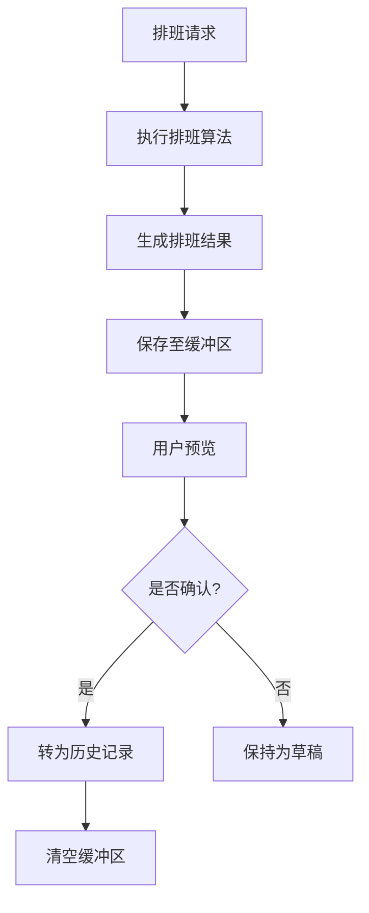
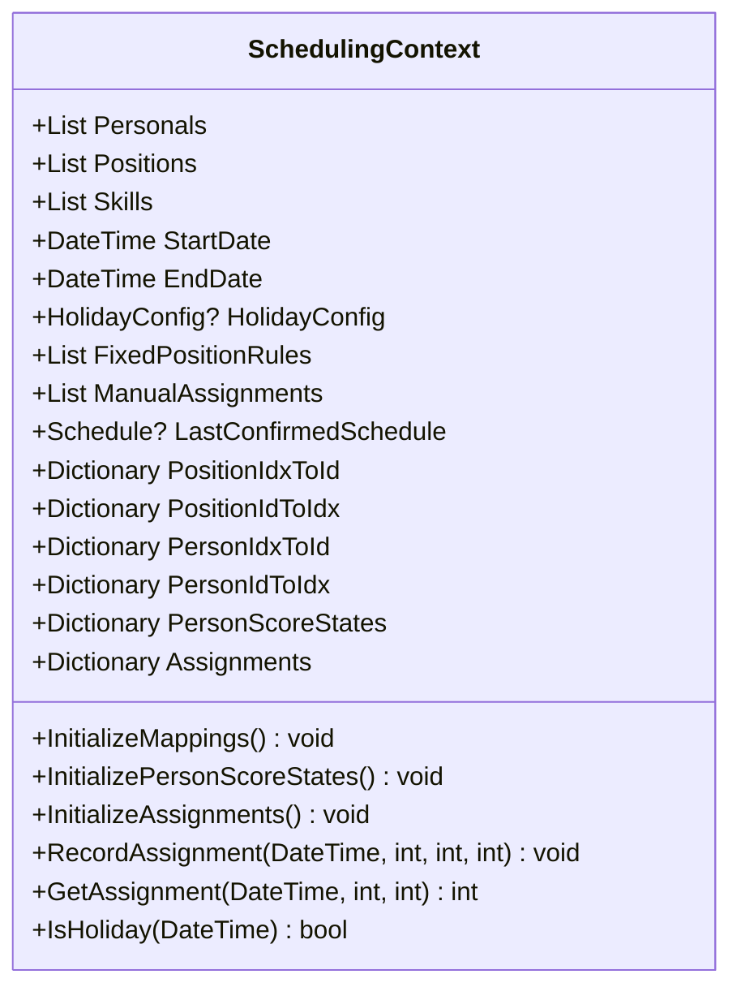
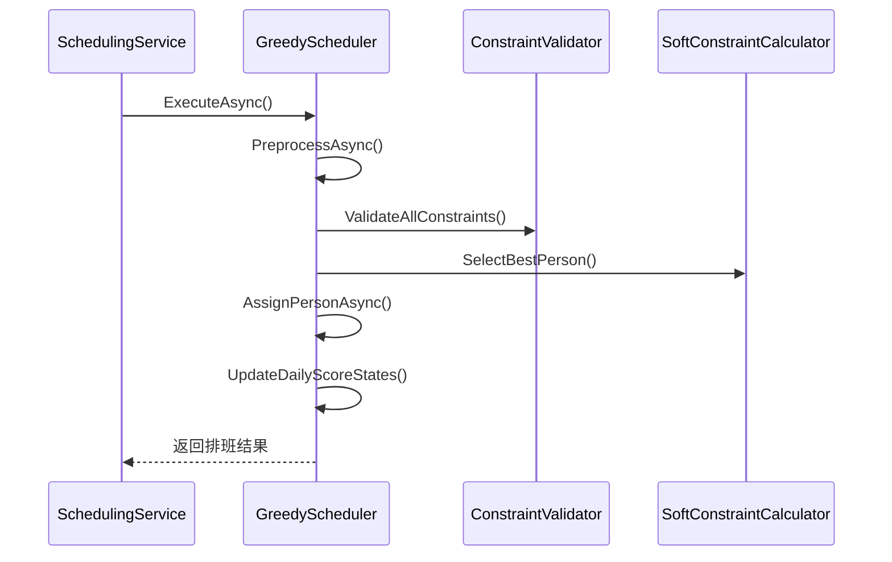
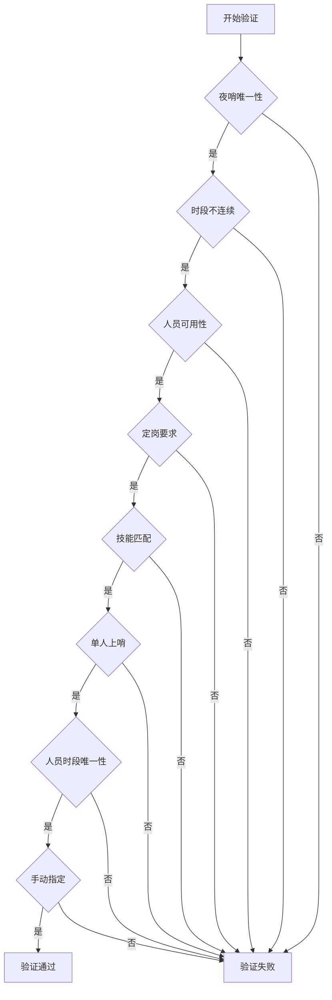
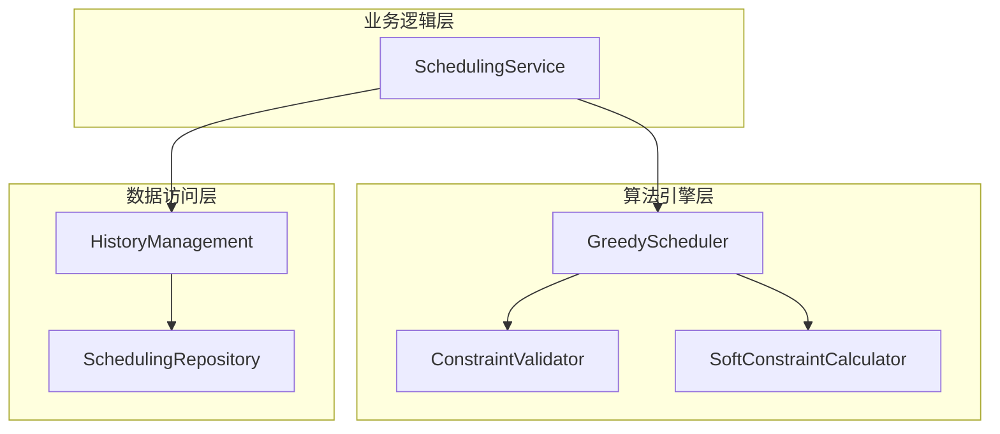

# 排班服务

<cite>
**本文档引用的文件**   
- [SchedulingService.cs](file://Services\SchedulingService.cs)
- [SchedulingContext.cs](file://SchedulingEngine\Core\SchedulingContext.cs)
- [GreedyScheduler.cs](file://SchedulingEngine\GreedyScheduler.cs)
- [ConstraintValidator.cs](file://SchedulingEngine\Core\ConstraintValidator.cs)
- [SoftConstraintCalculator.cs](file://SchedulingEngine\Core\SoftConstraintCalculator.cs)
- [HistoryManagement.cs](file://History\HIstoryManagement.cs)
- [SchedulingRepository.cs](file://Data\SchedulingRepository.cs)
</cite>

## 目录
1. [简介](#简介)
2. [排班执行流程](#排班执行流程)
3. [草稿与历史管理](#草稿与历史管理)
4. [排班确认流程](#排班确认流程)
5. [核心组件分析](#核心组件分析)
6. [架构概览](#架构概览)

## 简介
排班服务是自动排班系统的核心业务组件，负责协调人员、哨位、技能和约束规则，通过智能算法生成最优的排班方案。该服务实现了从排班请求到最终确认的完整生命周期管理，包括排班执行、草稿保存、历史记录和排班确认等关键功能。服务通过依赖注入与数据访问层、算法引擎和历史管理组件紧密协作，确保了系统的可维护性和可扩展性。

## 排班执行流程

排班执行是排班服务的核心功能，由`ExecuteSchedulingAsync`方法实现。该方法接收排班请求，经过业务规则验证后，构建排班上下文并调用贪心调度器执行算法。

**Section sources**
- [SchedulingService.cs](file://Services\SchedulingService.cs#L57-L140)
- [SchedulingContext.cs](file://SchedulingEngine\Core\SchedulingContext.cs#L11-L155)
- [GreedyScheduler.cs](file://SchedulingEngine\GreedyScheduler.cs#L16-L430)

## 草稿与历史管理

排班服务通过历史管理组件实现草稿和历史记录的分离管理。新生成的排班结果首先作为草稿保存在缓冲区，用户预览确认后才转为正式的历史记录。

**Diagram sources **
- [SchedulingService.cs](file://Services\SchedulingService.cs#L142-L155)
- [HistoryManagement.cs](file://History\HIstoryManagement.cs#L85-L115)

## 排班确认流程

排班确认是确保排班结果质量的关键步骤。服务在确认前会进行最终验证，检查是否存在未分配的关键时段或过度工作的人员。

**Section sources**
- [SchedulingService.cs](file://Services\SchedulingService.cs#L220-L240)
- [SchedulingService.cs](file://Services\SchedulingService.cs#L360-L400)

## 核心组件分析

### 排班上下文 (SchedulingContext)
排班上下文是算法执行所需的所有数据和状态的容器，包括人员、哨位、技能等基础数据，以及休息日配置、定岗规则等约束数据。

**Diagram sources **
- [SchedulingContext.cs](file://SchedulingEngine\Core\SchedulingContext.cs#L11-L155)

### 贪心调度器 (GreedyScheduler)
贪心调度器是排班算法的核心实现，采用MRV（最小剩余值）启发式策略，按照先哨位再时段的顺序进行人员分配。

**Diagram sources **
- [GreedyScheduler.cs](file://SchedulingEngine\GreedyScheduler.cs#L16-L430)
- [ConstraintValidator.cs](file://SchedulingEngine\Core\ConstraintValidator.cs#L13-L337)
- [SoftConstraintCalculator.cs](file://SchedulingEngine\Core\SoftConstraintCalculator.cs#L11-L282)

### 约束验证器 (ConstraintValidator)
约束验证器负责检查所有硬约束是否满足，确保排班方案的合规性和可行性。

**Diagram sources **
- [ConstraintValidator.cs](file://SchedulingEngine\Core\ConstraintValidator.cs#L13-L337)

## 架构概览

排班服务采用分层架构设计，各组件职责清晰，通过接口进行通信，实现了高内聚低耦合的设计原则。

**Diagram sources **
- [SchedulingService.cs](file://Services\SchedulingService.cs#L19-L749)
- [GreedyScheduler.cs](file://SchedulingEngine\GreedyScheduler.cs#L16-L430)
- [HistoryManagement.cs](file://History\HIstoryManagement.cs#L12-L359)
- [SchedulingRepository.cs](file://Data\SchedulingRepository.cs#L15-L525)