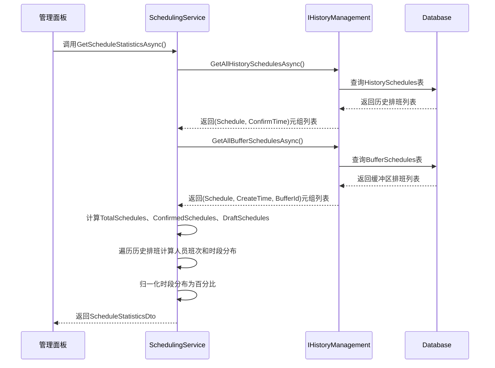
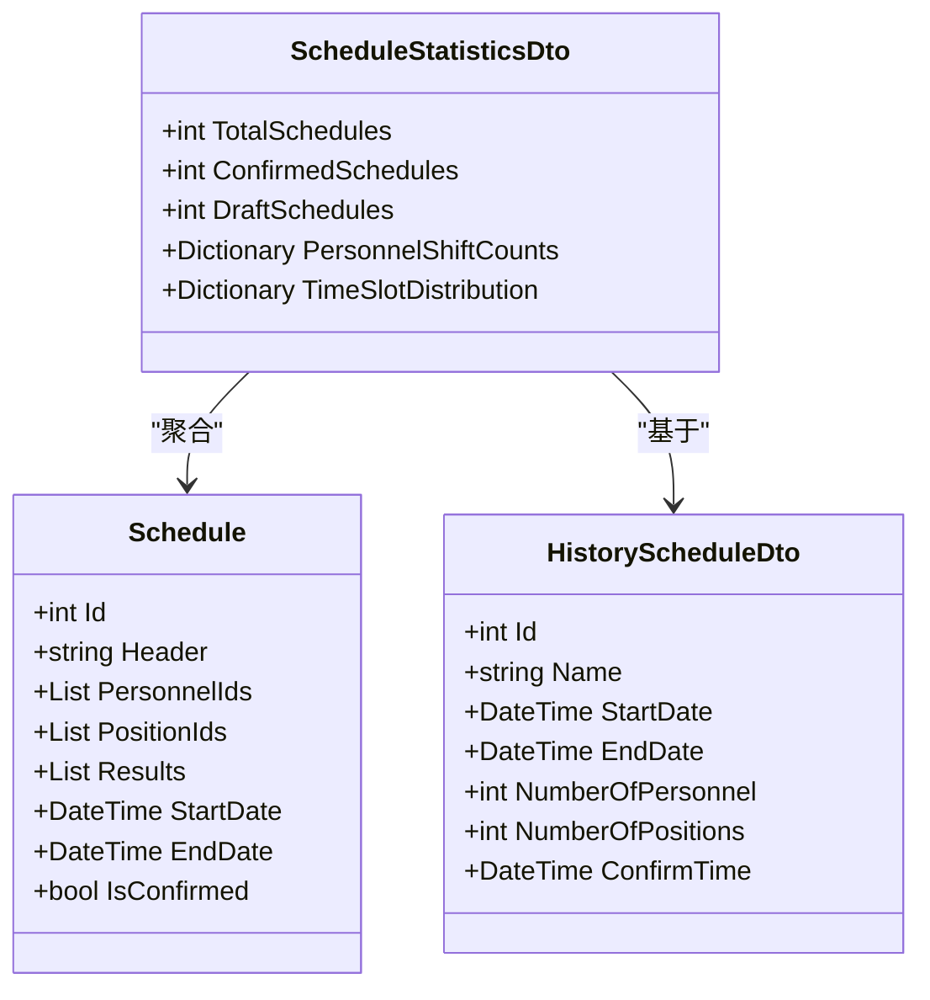
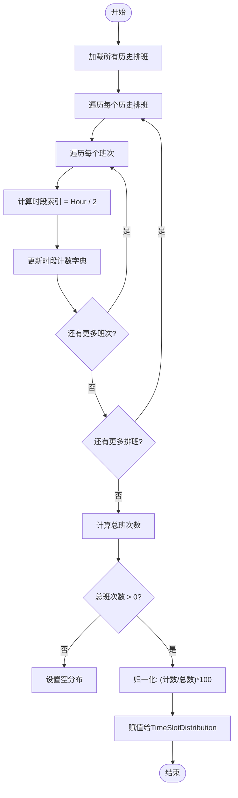

# 排班统计分析

<cite>
**本文档引用的文件**
- [SchedulingService.cs](file://Services/SchedulingService.cs)
- [ScheduleStatisticsDto.cs](file://DTOs/ScheduleStatisticsDto.cs)
- [HistoryScheduleDto.cs](file://DTOs/HistoryScheduleDto.cs)
- [Schedule.cs](file://Models/Schedule.cs)
- [IHistoryManagement.cs](file://History/IHistoryManagement.cs)
- [HIstoryManagement.cs](file://History/HIstoryManagement.cs)
</cite>

## 目录
1. [简介](#简介)
2. [核心统计逻辑分析](#核心统计逻辑分析)
3. [排班状态计数机制](#排班状态计数机制)
4. [人员班次统计聚合](#人员班次统计聚合)
5. [时段分布统计与归一化](#时段分布统计与归一化)
6. [管理面板可视化应用](#管理面板可视化应用)
7. [性能优化考虑](#性能优化考虑)
8. [结论](#结论)

## 简介
本文件详细文档化排班系统中的统计分析功能，重点说明 `GetScheduleStatisticsAsync` 方法如何聚合草稿和历史排班的统计数据。该功能为管理决策提供关键数据支持，包括排班总量、确认状态分布、人员工作量分布及时段需求热力图等核心指标。

## 核心统计逻辑分析

`GetScheduleStatisticsAsync` 方法是排班统计功能的核心实现，负责从历史和草稿数据中提取并聚合关键统计信息。该方法通过调用历史管理服务获取所有已确认的历史排班和未确认的草稿排班，然后计算各类统计指标。



**Diagram sources**
- [SchedulingService.cs](file://Services/SchedulingService.cs#L649-L697)
- [IHistoryManagement.cs](file://History/IHistoryManagement.cs#L8-L19)

**Section sources**
- [SchedulingService.cs](file://Services/SchedulingService.cs#L649-L697)

## 排班状态计数机制

排班状态计数通过聚合历史排班和草稿排班的数量来实现，提供了系统排班活动的总体概览。

- **TotalSchedules（总排班数）**：历史排班数与草稿排班数之和，反映系统中所有存在的排班实例总数。
- **ConfirmedSchedules（已确认排班数）**：直接取自历史管理服务返回的历史排班列表的计数，代表已正式实施的排班计划。
- **DraftSchedules（草稿排班数）**：直接取自历史管理服务返回的缓冲区排班列表的计数，代表正在编辑或待确认的排班方案。



**Diagram sources**
- [ScheduleStatisticsDto.cs](file://DTOs/ScheduleStatisticsDto.cs#L15-L90)
- [Schedule.cs](file://Models/Schedule.cs#L15-L68)
- [HistoryScheduleDto.cs](file://DTOs/HistoryScheduleDto.cs#L15-L59)

**Section sources**
- [SchedulingService.cs](file://Services/SchedulingService.cs#L651-L656)

## 人员班次统计聚合

人员班次统计（PersonnelShiftCounts）通过遍历所有历史排班的结果数据进行聚合计算。该统计仅基于已确认的历史排班，不包含草稿状态的排班，以确保统计数据的准确性和权威性。

计算过程如下：
1. 初始化一个以人员ID为键、班次数为值的字典。
2. 遍历每个历史排班的 `Results` 列表（即 `SingleShift` 对象集合）。
3. 对于每个班次，检查其 `PersonnelId` 是否已在字典中存在，若不存在则初始化为0。
4. 将对应人员的班次计数递增1。
5. 最终得到每位人员在历史排班中承担的总班次数。

此统计为分析人员工作量分布、识别过度工作或工作量不足的人员提供了数据基础。

**Section sources**
- [SchedulingService.cs](file://Services/SchedulingService.cs#L662-L670)
- [ScheduleStatisticsDto.cs](file://DTOs/ScheduleStatisticsDto.cs#L80-L89)

## 时段分布统计与归一化

时段分布统计（TimeSlotDistribution）用于分析不同时间段的排班需求强度，计算过程与人员统计类似，但需先将具体时间转换为时段索引。

### 时段索引计算
系统将一天24小时划分为12个2小时的时段，通过 `CalcPeriodIndex` 静态方法实现：
```csharp
private static int CalcPeriodIndex(DateTime startTime) => startTime.Hour / 2;
```
例如，00:00-01:59 的班次属于时段0，02:00-03:59 属于时段1，以此类推。

### 统计与归一化
1. 初始化一个以时段索引为键、班次数为值的字典。
2. 遍历每个历史排班的班次，计算其 `PeriodIndex` 并累加计数。
3. 计算所有时段的总班次数。
4. 创建新的字典，将每个时段的原始计数除以总班次数并乘以100，转换为百分比形式。
5. 将归一化后的分布数据赋值给 `TimeSlotDistribution` 属性。

归一化处理使得不同时期、不同规模的排班数据具有可比性，便于识别高峰需求时段。



**Diagram sources**
- [SchedulingService.cs](file://Services/SchedulingService.cs#L672-L688)
- [SchedulingService.cs](file://Services/SchedulingService.cs#L364-L364)

**Section sources**
- [SchedulingService.cs](file://Services/SchedulingService.cs#L672-L688)

## 管理面板可视化应用

统计结果在管理面板中通过多种可视化图表呈现，帮助管理者直观理解排班数据。

### 人员工作量分布图
基于 `PersonnelShiftCounts` 字典数据，生成柱状图或条形图，横轴为人员姓名（或ID），纵轴为班次数。该图表可：
- 识别工作量过重或过轻的人员
- 辅助进行公平的排班调整
- 追踪人员历史工作负荷趋势

### 时段需求热力图
基于归一化的 `TimeSlotDistribution` 数据，生成热力图或折线图，横轴为一天中的12个时段（可标注为00:00-02:00等），纵轴为百分比。该图表可：
- 识别排班需求的高峰和低谷时段
- 优化人员配置，确保高峰时段有足够人力
- 分析需求模式，为长期人力规划提供依据

这些可视化组件通过调用 `GetScheduleStatisticsAsync` API 获取数据，实现了数据驱动的管理决策支持。

**Section sources**
- [SchedulingService.cs](file://Services/SchedulingService.cs#L649-L697)
- [ScheduleStatisticsDto.cs](file://DTOs/ScheduleStatisticsDto.cs#L80-L89)

## 性能优化考虑

在大数据量场景下，`GetScheduleStatisticsAsync` 方法的性能需要特别关注：

1. **数据加载优化**：`GetAllHistorySchedulesAsync` 和 `GetAllBufferSchedulesAsync` 方法一次性加载所有相关排班数据，避免了循环中的多次数据库查询，这是主要的性能优化点。

2. **内存消耗**：随着历史排班数据的增长，一次性加载所有数据可能导致内存占用过高。建议在数据量极大时，考虑实现分页或按时间范围查询的统计接口。

3. **计算复杂度**：人员和时段统计的计算复杂度为O(N)，其中N为历史排班中所有班次的总数，属于线性时间，效率较高。

4. **缓存策略**：对于不频繁变化的统计结果（如历史排班统计），可考虑在服务层实现缓存机制，避免重复计算。

5. **异步执行**：方法本身为异步，不会阻塞主线程，适合在Web服务中使用。

**Section sources**
- [SchedulingService.cs](file://Services/SchedulingService.cs#L649-L697)
- [HIstoryManagement.cs](file://History/HIstoryManagement.cs#L150-L200)

## 结论
`GetScheduleStatisticsAsync` 方法通过聚合历史和草稿排班数据，提供了全面的排班统计分析功能。其设计合理，能够准确计算排班状态、人员工作量和时段需求分布等关键指标。归一化的百分比输出增强了数据的可比性，而管理面板的可视化应用则将数据转化为直观的决策支持信息。在大数据量场景下，可通过引入分页、范围查询或缓存等策略进一步优化性能。