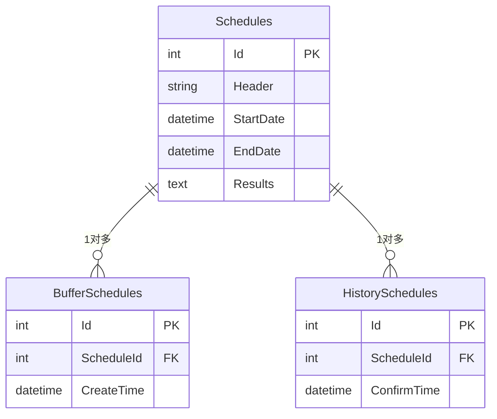
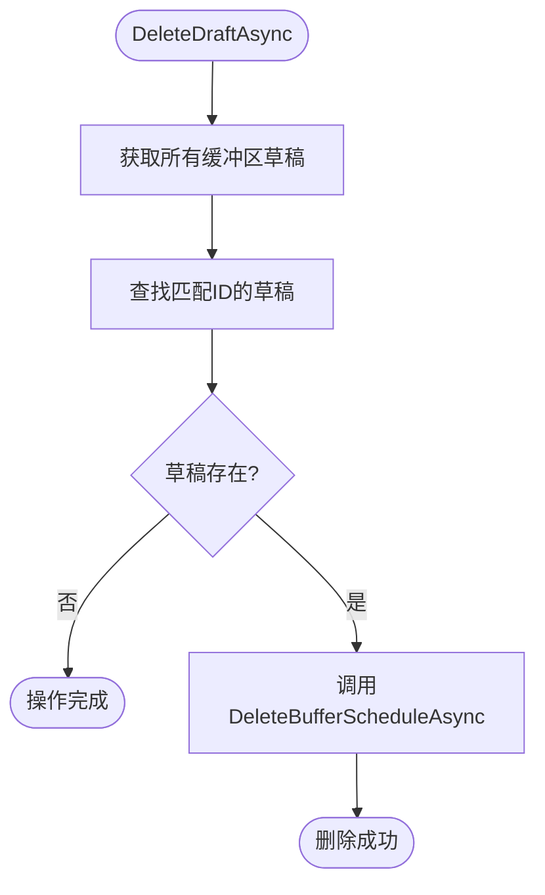
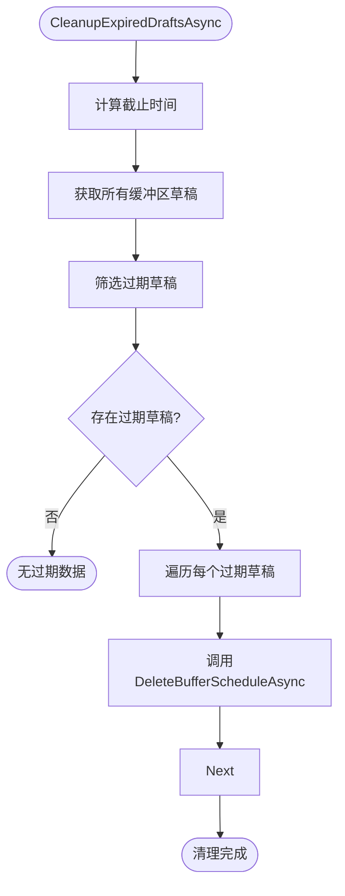
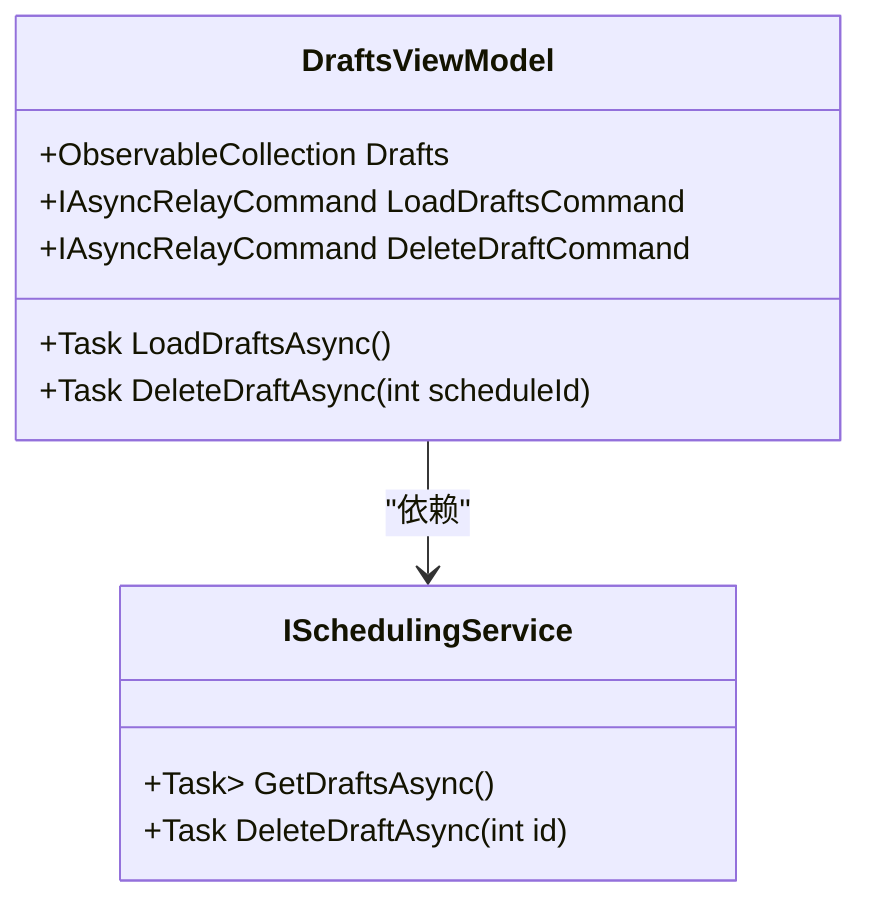

# 草稿管理

<cite>
**本文档中引用的文件**  
- [SchedulingService.cs](file://Services/SchedulingService.cs)
- [IHistoryManagement.cs](file://History/IHistoryManagement.cs)
- [HIstoryManagement.cs](file://History/HIstoryManagement.cs)
- [DraftsViewModel.cs](file://ViewModels/Scheduling/DraftsViewModel.cs)
- [ScheduleDto.cs](file://DTOs/ScheduleDto.cs)
</cite>

## 目录
1. [简介](#简介)
2. [草稿存储机制](#草稿存储机制)
3. [GetDraftsAsync 方法详解](#getdraftsasync-方法详解)
4. [DeleteDraftAsync 方法详解](#deletedraftasync-方法详解)
5. [CleanupExpiredDraftsAsync 方法详解](#cleanupexpireddraftsasync-方法详解)
6. [使用示例与UI集成](#使用示例与ui集成)
7. [结论](#结论)

## 简介
本文档详细说明了排班系统中的草稿管理功能，涵盖草稿的查询、删除和过期清理机制。草稿作为未确认的排班方案，存储在缓冲区中，通过 `IHistoryManagement` 接口进行统一管理。核心方法包括 `GetDraftsAsync`、`DeleteDraftAsync` 和 `CleanupExpiredDraftsAsync`，分别用于获取草稿列表、删除指定草稿以及批量清理过期草稿。

**Section sources**
- [SchedulingService.cs](file://Services/SchedulingService.cs#L142-L157)

## 草稿存储机制
草稿通过 `IHistoryManagement` 接口存储在数据库的缓冲区表（`BufferSchedules`）中。每次生成新的排班方案时，系统会将其保存至 `Schedules` 表，并在 `BufferSchedules` 表中创建一条记录，包含 `ScheduleId` 和 `CreateTime`。缓冲区设计为单例模式，仅允许存在一个有效草稿，确保用户不会同时保留多个未确认方案。

草稿与历史记录分离存储：
- **缓冲区（BufferSchedules）**：存放当前未确认的草稿。
- **历史表（HistorySchedules）**：存放已确认的排班记录。

当草稿被确认后，系统将其从缓冲区移除并插入历史表，同时清空其余缓冲区内容，保证系统状态一致性。



**Diagram sources**
- [HIstoryManagement.cs](file://History/HIstoryManagement.cs#L45-L60)
- [IHistoryManagement.cs](file://History/IHistoryManagement.cs#L8-L19)

## GetDraftsAsync 方法详解
`GetDraftsAsync` 方法用于获取当前所有草稿排班的摘要信息列表，返回类型为 `List<ScheduleSummaryDto>`。

该方法首先调用 `_historyMgmt.GetAllBufferSchedulesAsync()` 从缓冲区获取所有草稿及其创建时间，然后将每个草稿的 `Schedule` 对象映射为 `ScheduleSummaryDto`。映射过程中，`ConfirmedAt` 字段设为 `null`，以明确标识其为草稿状态。

关键字段映射如下：
- `Id` → `Schedule.Id`
- `Title` → `Schedule.Header`
- `StartDate` / `EndDate` → 排班周期
- `PersonnelCount` / `PositionCount` / `ShiftCount` → 对应集合的计数
- `CreatedAt` → `CreateTime`（来自缓冲区记录）
- `ConfirmedAt` → `null`

此方法不进行分页或过滤，返回全部草稿，适用于前端草稿列表页面的全量加载。

**Section sources**
- [SchedulingService.cs](file://Services/SchedulingService.cs#L142-L157)
- [ScheduleDto.cs](file://DTOs/ScheduleDto.cs#L152-L215)

## DeleteDraftAsync 方法详解
`DeleteDraftAsync` 方法用于删除指定ID的草稿排班。

执行逻辑如下：
1. 调用 `GetAllBufferSchedulesAsync()` 获取所有缓冲区草稿。
2. 根据传入的 `id` 查找对应的草稿记录，获取其 `BufferId`。
3. 若未找到匹配项，则直接返回，不抛出异常（幂等性设计）。
4. 若找到，则调用 `DeleteBufferScheduleAsync(bufferId)` 从数据库中删除该缓冲区记录及其关联的排班数据。

该方法处理了边界条件：
- **ID不存在**：静默忽略，避免异常中断流程。
- **并发删除**：基于 `BufferId` 删除，确保操作原子性。
- **数据一致性**：事务性删除缓冲区记录和排班主表数据，防止数据残留。



**Diagram sources**
- [SchedulingService.cs](file://Services/SchedulingService.cs#L205-L212)
- [HIstoryManagement.cs](file://History/HIstoryManagement.cs#L185-L208)

## CleanupExpiredDraftsAsync 方法详解
`CleanupExpiredDraftsAsync` 方法用于批量清理过期的草稿，防止数据库膨胀。

其核心策略为：
- **默认保留7天**：通过参数 `daysToKeep = 7` 控制保留时间窗口。
- **可配置清理周期**：调用时可传入自定义天数，适应不同部署环境需求。
- **基于创建时间清理**：计算 `cutoffDate = DateTime.UtcNow.AddDays(-daysToKeep)`，删除所有 `CreateTime < cutoffDate` 的草稿。

执行流程：
1. 获取所有缓冲区草稿。
2. 筛选出创建时间早于截止时间的过期草稿。
3. 遍历并逐个调用 `DeleteBufferScheduleAsync` 删除。

该方法在系统启动或定时任务中调用，属于后台维护操作。清理后会输出日志，便于监控执行情况。



**Diagram sources**
- [SchedulingService.cs](file://Services/SchedulingService.cs#L380-L398)
- [HIstoryManagement.cs](file://History/HIstoryManagement.cs#L185-L208)

## 使用示例与UI集成
### 查询草稿
```csharp
var drafts = await schedulingService.GetDraftsAsync();
// 返回 ScheduleSummaryDto 列表，用于绑定UI列表控件
```

### 删除草稿
```csharp
await schedulingService.DeleteDraftAsync(draftId);
await draftsViewModel.LoadDraftsAsync(); // 刷新UI
```

### 批量清理过期草稿
```csharp
// 启动时清理超过10天的草稿
await schedulingService.CleanupExpiredDraftsAsync(10);
```

### UI集成（DraftsViewModel）
在 `DraftsViewModel` 中，通过命令模式封装草稿操作：
- `LoadDraftsCommand`：加载草稿列表
- `DeleteDraftCommand`：绑定删除按钮，执行删除并刷新
- 使用 `DialogService` 提示确认，防止误删
- 使用 `NavigationService` 支持查看草稿详情



**Diagram sources**
- [DraftsViewModel.cs](file://ViewModels/Scheduling/DraftsViewModel.cs#L1-L116)
- [SchedulingService.cs](file://Services/SchedulingService.cs#L142-L157)

**Section sources**
- [DraftsViewModel.cs](file://ViewModels/Scheduling/DraftsViewModel.cs#L1-L116)

## 结论
草稿管理功能通过 `IHistoryManagement` 接口实现了草稿的存储、查询、删除和自动清理。`GetDraftsAsync` 将缓冲区数据转换为前端可用的摘要列表，`DeleteDraftAsync` 安全地处理删除操作，`CleanupExpiredDraftsAsync` 提供可配置的过期清理策略。整体设计注重数据一致性、用户体验和系统维护性，为排班流程提供了可靠的中间状态管理机制。