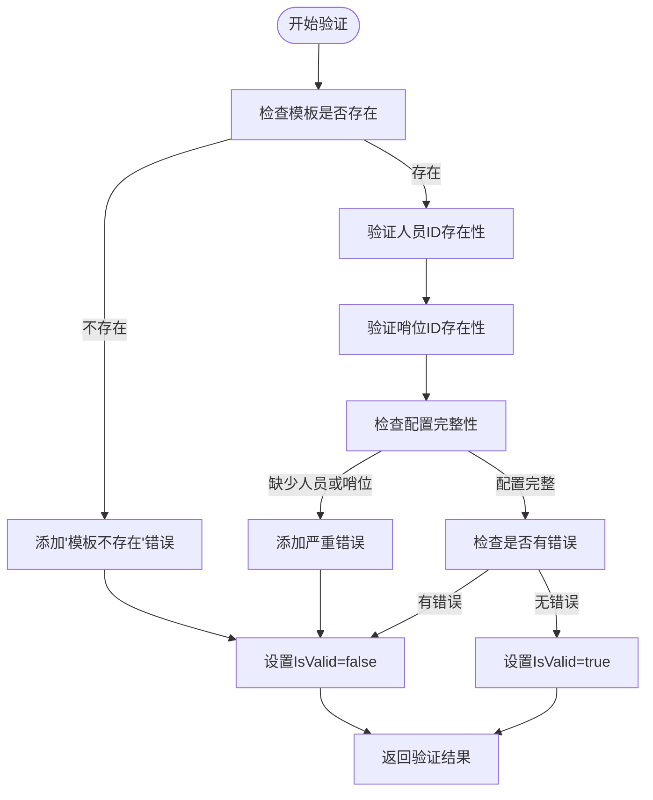
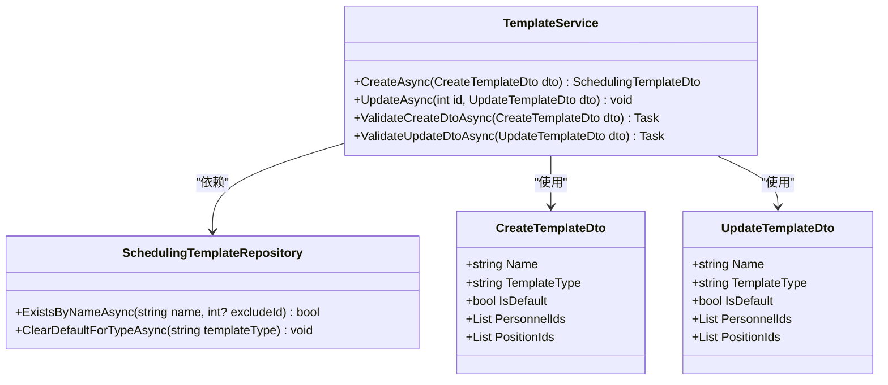
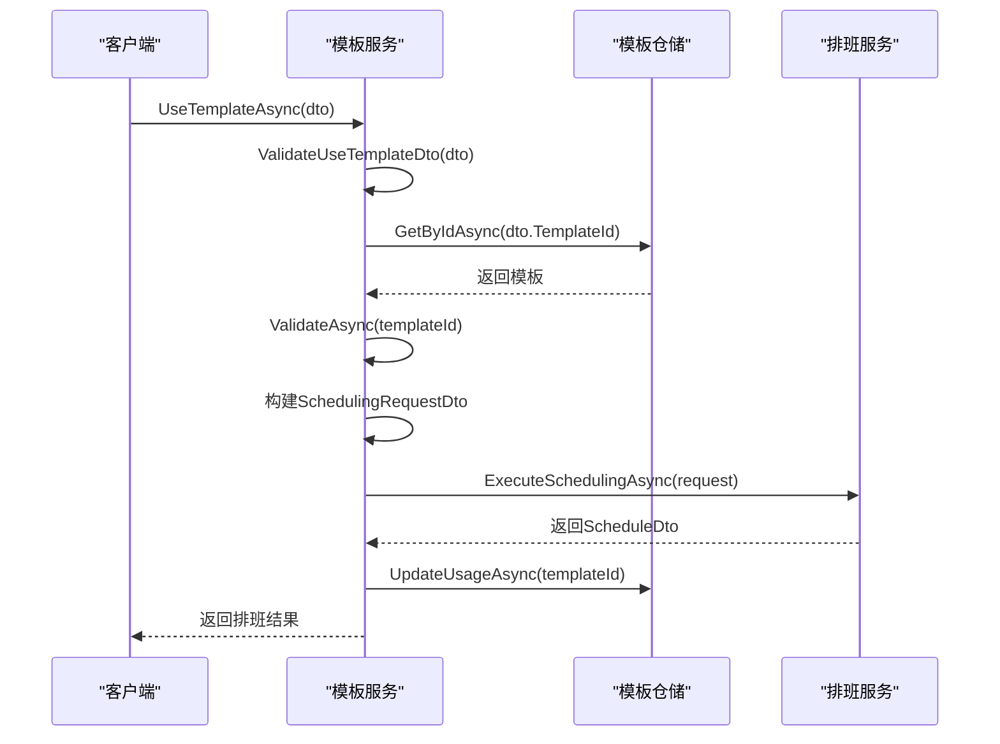

# 模板服务

<cite>
**Referenced Files in This Document**   
- [TemplateService.cs](file://Services/TemplateService.cs)
- [SchedulingTemplateRepository.cs](file://Data/SchedulingTemplateRepository.cs)
- [SchedulingTemplate.cs](file://Models/SchedulingTemplate.cs)
- [SchedulingTemplateDto.cs](file://DTOs/SchedulingTemplateDto.cs)
- [TemplateMapper.cs](file://DTOs/Mappers/TemplateMapper.cs)
- [SchedulingService.cs](file://Services/SchedulingService.cs)
</cite>

## 目录
1. [简介](#简介)
2. [核心功能](#核心功能)
3. [模板验证逻辑](#模板验证逻辑)
4. [业务规则](#业务规则)
5. [使用模板创建排班](#使用模板创建排班)
6. [结论](#结论)

## 简介
模板服务（TemplateService）是自动排班系统中的核心组件，负责管理排班模板的全生命周期。该服务提供了模板的增删改查、默认模板管理以及使用模板创建排班等核心功能。通过模板，用户可以保存和复用常用的排班配置，提高排班效率和一致性。本文档详细阐述了模板服务的各项功能、实现逻辑和业务规则。

## 核心功能

模板服务实现了对排班模板的完整管理功能，包括增删改查、默认模板管理和使用模板创建排班。

### 模板的增删改查
模板服务提供了对排班模板的完整CRUD（创建、读取、更新、删除）操作。用户可以通过服务接口创建新的排班模板，保存特定的人员、哨位和约束配置。服务支持根据ID或类型查询模板，方便用户快速找到所需的模板配置。更新功能允许用户修改现有模板的名称、描述、参与人员和哨位等属性。删除功能则允许移除不再需要的模板。

### 默认模板管理
模板服务支持设置和管理默认模板。系统允许用户将某个模板标记为默认模板，以便在创建新排班时快速应用。服务确保了同类型模板中只能有一个默认模板，当用户将一个模板设为默认时，系统会自动取消同类型中其他模板的默认状态。这种设计保证了默认模板的唯一性，避免了配置冲突。

**Section sources**
- [TemplateService.cs](file://Services/TemplateService.cs#L60-L79)
- [TemplateService.cs](file://Services/TemplateService.cs#L81-L100)
- [TemplateService.cs](file://Services/TemplateService.cs#L102-L112)
- [TemplateService.cs](file://Services/TemplateService.cs#L114-L122)
- [TemplateService.cs](file://Services/TemplateService.cs#L124-L135)

## 模板验证逻辑

模板服务通过`ValidateAsync`方法实现模板配置的验证逻辑，确保模板的完整性和有效性。

### 验证流程
`ValidateAsync`方法首先检查指定ID的模板是否存在。如果模板不存在，则返回验证失败结果。对于存在的模板，方法会进行多项验证：

1. **人员存在性验证**：遍历模板中引用的人员ID列表，逐个检查每个人员ID在人员库中是否存在。如果发现不存在的人员ID，会将其作为警告信息添加到验证结果中。
2. **哨位存在性验证**：类似地，遍历模板中引用的哨位ID列表，检查每个哨位ID在哨位库中是否存在。不存在的哨位ID也会被记录为警告。
3. **基本完整性验证**：检查模板是否包含至少一名人员和至少一个哨位。如果缺少这些基本配置，则视为严重错误。

### 验证结果处理
验证结果包含`IsValid`标志、错误列表和警告列表。只有当存在严重错误（如模板不存在或缺少必要配置）时，`IsValid`才会被设置为`false`。人员或哨位不存在的情况被视为警告而非错误，因为模板可能引用了已删除的资源，但这并不影响模板本身的结构完整性。这种设计允许用户查看和编辑存在问题的模板，而不是完全阻止访问。

**Diagram sources**
- [TemplateService.cs](file://Services/TemplateService.cs#L152-L206)

**Section sources**
- [TemplateService.cs](file://Services/TemplateService.cs#L152-L206)
- [SchedulingTemplate.cs](file://Models/SchedulingTemplate.cs#L45-L50)

## 业务规则

模板服务在创建和更新模板时实施了严格的业务规则，确保数据的一致性和唯一性。

### 模板名称唯一性
在创建和更新模板时，服务会检查模板名称的唯一性。对于创建操作，系统会查询数据库中是否存在同名模板，如果存在则抛出异常。对于更新操作，系统会排除当前正在更新的模板本身，检查是否有其他同名模板。这种设计允许用户修改模板名称，但不允许创建名称冲突的模板。

### 默认模板唯一性
服务确保同类型模板中只能有一个默认模板。当用户创建或更新模板并将其设为默认时，系统会调用`ClearDefaultForTypeAsync`方法，将同类型中所有其他模板的默认状态清除。这种"先清除后设置"的策略保证了默认模板的唯一性，避免了多个默认模板并存的情况。

**Diagram sources**
- [TemplateService.cs](file://Services/TemplateService.cs#L60-L79)
- [TemplateService.cs](file://Services/TemplateService.cs#L81-L100)
- [SchedulingTemplateRepository.cs](file://Data/SchedulingTemplateRepository.cs#L290-L305)

**Section sources**
- [TemplateService.cs](file://Services/TemplateService.cs#L60-L79)
- [TemplateService.cs](file://Services/TemplateService.cs#L81-L100)
- [SchedulingTemplateRepository.cs](file://Data/SchedulingTemplateRepository.cs#L290-L305)

## 使用模板创建排班

`UseTemplateAsync`方法是模板服务的核心功能之一，它将模板配置转换为实际的排班请求并执行排班。

### 方法流程
1. **输入验证**：首先对输入的`UseTemplateDto`进行验证，确保模板ID、排班名称、日期范围等必要信息完整且有效。
2. **模板获取**：根据提供的模板ID从数据库中获取模板数据。
3. **模板验证**：调用`ValidateAsync`方法对模板进行验证。如果验证失败（存在严重错误），则抛出异常阻止排班创建。
4. **排班请求构建**：基于模板配置和用户输入构建`SchedulingRequestDto`对象。用户可以通过`OverridePersonnelIds`和`OverridePositionIds`参数覆盖模板中的人员和哨位配置。
5. **执行排班**：调用`SchedulingService`的`ExecuteSchedulingAsync`方法执行实际的排班算法。
6. **更新使用记录**：成功创建排班后，更新模板的使用次数和最后使用时间。

### 配置转换
在构建排班请求时，服务会将模板中的配置直接映射到排班请求中：
- 模板的人员ID列表和哨位ID列表被复制到排班请求中（除非被覆盖）
- 休息日配置ID和是否使用活动配置的设置被直接传递
- 启用的定岗规则ID和手动指定ID列表也被复制到排班请求中

这种直接的映射关系确保了模板配置能够准确地应用于新的排班。

**Diagram sources**
- [TemplateService.cs](file://Services/TemplateService.cs#L211-L249)
- [SchedulingService.cs](file://Services/SchedulingService.cs#L45-L75)

**Section sources**
- [TemplateService.cs](file://Services/TemplateService.cs#L211-L249)
- [SchedulingService.cs](file://Services/SchedulingService.cs#L45-L75)

## 结论
模板服务通过提供完整的模板管理功能，极大地提升了排班系统的易用性和效率。服务通过严格的验证机制和业务规则确保了数据的完整性和一致性。`UseTemplateAsync`方法的实现展示了如何将模板配置有效地转换为实际的排班请求，并与排班引擎无缝集成。整体设计体现了高内聚、低耦合的原则，各组件职责明确，便于维护和扩展。