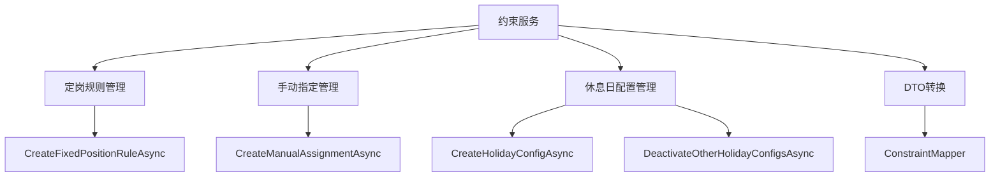
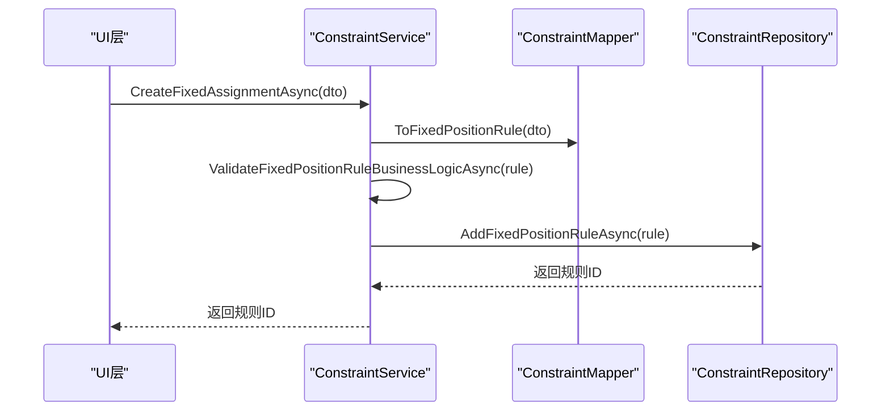
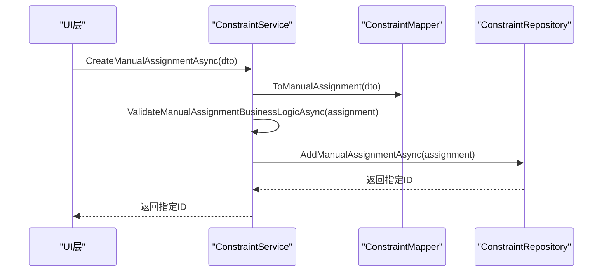
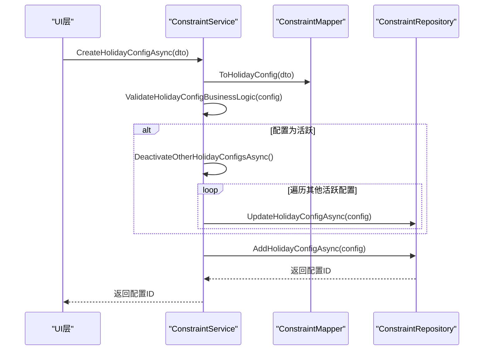
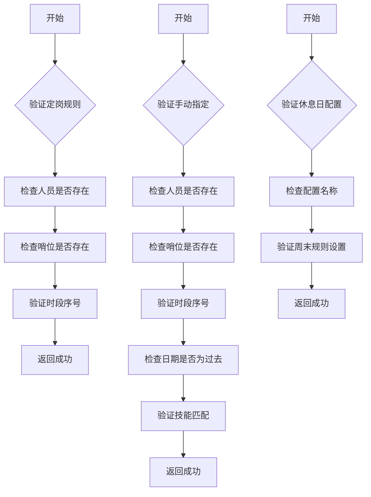
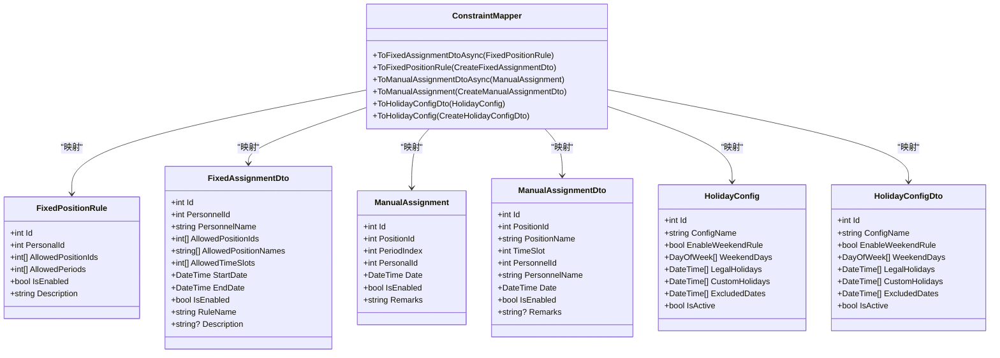

# 约束服务

<cite>
**Referenced Files in This Document**   
- [ConstraintService.cs](file://Services/ConstraintService.cs)
- [IConstraintService.cs](file://Services/Interfaces/IConstraintService.cs)
- [ConstraintMapper.cs](file://DTOs/Mappers/ConstraintMapper.cs)
- [FixedPositionRule.cs](file://Models/Constraints/FixedPositionRule.cs)
- [ManualAssignment.cs](file://Models/Constraints/ManualAssignment.cs)
- [HolidayConfig.cs](file://Models/Constraints/HolidayConfig.cs)
- [FixedAssignmentDto.cs](file://DTOs/FixedAssignmentDto.cs)
- [ManualAssignmentDto.cs](file://DTOs/ManualAssignmentDto.cs)
- [HolidayConfigDto.cs](file://DTOs/HolidayConfigDto.cs)
</cite>

## 目录
1. [简介](#简介)
2. [核心功能概述](#核心功能概述)
3. [定岗规则管理](#定岗规则管理)
4. [手动指定管理](#手动指定管理)
5. [休息日配置管理](#休息日配置管理)
6. [业务规则验证逻辑](#业务规则验证逻辑)
7. [数据传输对象(DTO)转换](#数据传输对象dto转换)
8. [结论](#结论)

## 简介
约束服务（ConstraintService）是自动排班系统中的核心组件，负责管理影响排班结果的各类约束条件。该服务实现了三大核心功能：定岗规则、手动指定和休息日配置的管理。通过这些功能，系统能够满足特定人员只能在特定哨位或时段上哨、预先指定某些人员的排班以及灵活定义休息日规则等业务需求。本文档将详细说明这些功能的实现机制和业务规则。

**Section sources**
- [ConstraintService.cs](file://Services/ConstraintService.cs#L1-L364)

## 核心功能概述
约束服务提供了对三种主要约束类型的完整生命周期管理：定岗规则、手动指定和休息日配置。每种约束类型都有对应的创建、读取、更新和删除（CRUD）操作，并通过严格的业务规则验证确保数据的完整性和有效性。服务还提供了与UI层集成的DTO转换方法，支持前端的数据展示和用户交互。

**Diagram sources**
- [ConstraintService.cs](file://Services/ConstraintService.cs#L15-L364)
- [ConstraintMapper.cs](file://DTOs/Mappers/ConstraintMapper.cs#L13-L325)

**Section sources**
- [ConstraintService.cs](file://Services/ConstraintService.cs#L15-L364)

## 定岗规则管理
定岗规则功能允许系统管理员定义某些人员仅能在特定哨位或特定时段上哨的约束。`CreateFixedPositionRuleAsync`方法负责创建新的定岗规则，该方法首先调用`ValidateFixedPositionRuleBusinessLogicAsync`进行业务规则验证，然后将规则持久化到数据库。

**Diagram sources**
- [ConstraintService.cs](file://Services/ConstraintService.cs#L36-L42)
- [ConstraintMapper.cs](file://DTOs/Mappers/ConstraintMapper.cs#L77-L89)

**Section sources**
- [ConstraintService.cs](file://Services/ConstraintService.cs#L36-L42)
- [FixedPositionRule.cs](file://Models/Constraints/FixedPositionRule.cs#L9-L46)
- [FixedAssignmentDto.cs](file://DTOs/FixedAssignmentDto.cs#L18-L280)

## 手动指定管理
手动指定功能允许用户预先指定某些哨位-时段-人员的固定分配。`CreateManualAssignmentAsync`方法负责创建手动指定，该方法首先调用`ValidateManualAssignmentBusinessLogicAsync`进行业务规则验证，然后将指定信息持久化到数据库。

**Diagram sources**
- [ConstraintService.cs](file://Services/ConstraintService.cs#L76-L82)
- [ConstraintMapper.cs](file://DTOs/Mappers/ConstraintMapper.cs#L161-L174)

**Section sources**
- [ConstraintService.cs](file://Services/ConstraintService.cs#L76-L82)
- [ManualAssignment.cs](file://Models/Constraints/ManualAssignment.cs#L8-L50)
- [ManualAssignmentDto.cs](file://DTOs/ManualAssignmentDto.cs#L23-L182)

## 休息日配置管理
休息日配置功能允许系统管理员定义如何判定休息日的规则。`CreateHolidayConfigAsync`方法负责创建新的休息日配置，该方法首先进行业务规则验证，然后检查是否将配置设置为活跃状态。如果是，则调用`DeactivateOtherHolidayConfigsAsync`方法确保系统中只有一个活跃的休息日配置。

**Diagram sources**
- [ConstraintService.cs](file://Services/ConstraintService.cs#L109-L121)
- [ConstraintService.cs](file://Services/ConstraintService.cs#L297-L306)
- [ConstraintMapper.cs](file://DTOs/Mappers/ConstraintMapper.cs#L244-L258)

**Section sources**
- [ConstraintService.cs](file://Services/ConstraintService.cs#L109-L121)
- [HolidayConfig.cs](file://Models/Constraints/HolidayConfig.cs#L9-L86)
- [HolidayConfigDto.cs](file://DTOs/HolidayConfigDto.cs#L23-L200)

## 业务规则验证逻辑
约束服务通过私有验证方法确保所有约束数据的业务规则得到遵守。`ValidateFixedPositionRuleBusinessLogicAsync`方法验证定岗规则中人员和哨位的存在性，以及时段序号的有效性（0-11）。`ValidateManualAssignmentBusinessLogicAsync`方法除了验证人员和哨位的存在性外，还验证日期不能是过去的日期，并检查人员技能是否匹配哨位要求。`ValidateHolidayConfigBusinessLogic`方法验证配置名称不能为空且长度不超过100字符，以及启用周末规则时必须指定周末日期。

**Diagram sources**
- [ConstraintService.cs](file://Services/ConstraintService.cs#L222-L266)
- [ConstraintService.cs](file://Services/ConstraintService.cs#L268-L295)
- [ConstraintService.cs](file://Services/ConstraintService.cs#L297-L306)

**Section sources**
- [ConstraintService.cs](file://Services/ConstraintService.cs#L222-L306)

## 数据传输对象(DTO)转换
约束服务通过`ConstraintMapper`类提供的DTO转换方法支持UI层的数据展示。这些方法将数据库模型转换为包含冗余显示字段（如人员姓名、哨位名称）的DTO，便于前端直接使用。同时，服务还提供了反向转换方法，将UI层传入的DTO转换为数据库模型。这种设计实现了数据访问层与表示层的解耦，提高了系统的可维护性和灵活性。

**Diagram sources**
- [ConstraintMapper.cs](file://DTOs/Mappers/ConstraintMapper.cs#L13-L325)
- [FixedPositionRule.cs](file://Models/Constraints/FixedPositionRule.cs#L9-L46)
- [FixedAssignmentDto.cs](file://DTOs/FixedAssignmentDto.cs#L18-L280)
- [ManualAssignment.cs](file://Models/Constraints/ManualAssignment.cs#L8-L50)
- [ManualAssignmentDto.cs](file://DTOs/ManualAssignmentDto.cs#L23-L182)
- [HolidayConfig.cs](file://Models/Constraints/HolidayConfig.cs#L9-L86)
- [HolidayConfigDto.cs](file://DTOs/HolidayConfigDto.cs#L23-L200)

**Section sources**
- [ConstraintMapper.cs](file://DTOs/Mappers/ConstraintMapper.cs#L13-L325)

## 结论
约束服务通过精心设计的API和严格的业务规则验证，为自动排班系统提供了可靠的约束管理能力。服务的三大核心功能——定岗规则、手动指定和休息日配置——覆盖了排班过程中的主要业务需求。通过`DeactivateOtherHolidayConfigsAsync`方法确保活跃休息日配置的唯一性，以及通过`ValidateManualAssignmentBusinessLogicAsync`方法验证人员技能匹配和日期有效性，体现了服务对业务规则的严格遵守。DTO转换机制则有效支持了UI层的数据展示需求，实现了前后端的良好协作。