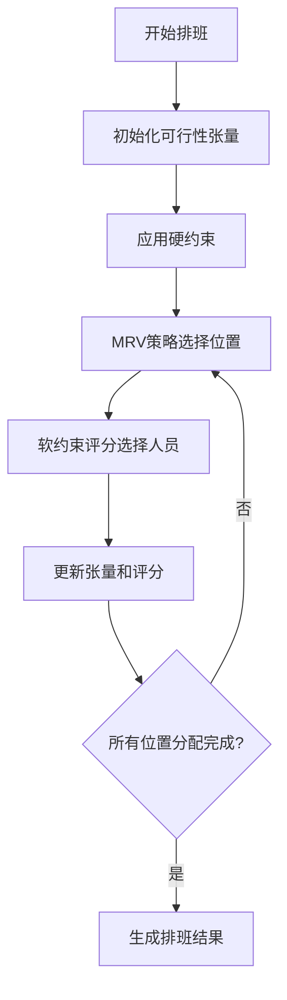
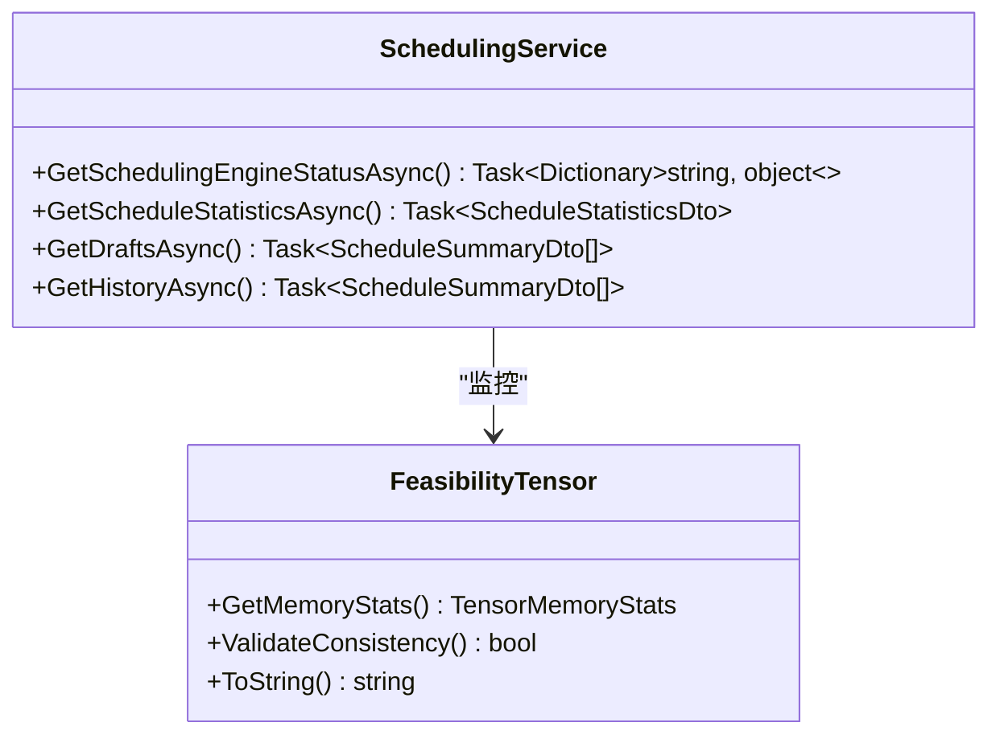
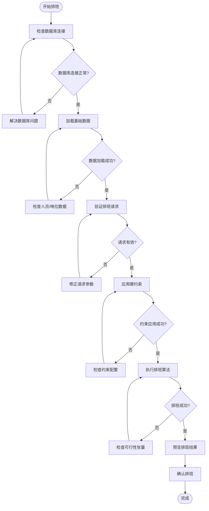

# 常见问题解答

<cite>
**本文档引用的文件**  
- [README.md](file://README.md)
- [SchedulingService.cs](file://Services/SchedulingService.cs)
- [GreedyScheduler.cs](file://SchedulingEngine/GreedyScheduler.cs)
- [FeasibilityTensor.cs](file://SchedulingEngine/Core/FeasibilityTensor.cs)
- [ApplicationConstants.cs](file://Constants/ApplicationConstants.cs)
- [DatabaseConfiguration.cs](file://Data/DatabaseConfiguration.cs)
- [ARCHITECTURE_IMPLEMENTATION_SUMMARY.md](file://ARCHITECTURE_IMPLEMENTATION_SUMMARY.md)
- [IMPLEMENTATION_SUMMARY.md](file://IMPLEMENTATION_SUMMARY.md)
- [PROJECT_COMPLETION_REPORT.md](file://PROJECT_COMPLETION_REPORT.md)
</cite>

## 目录
1. [环境配置问题](#环境配置问题)
2. [常见错误解决方案](#常见错误解决方案)
3. [性能优化建议](#性能优化建议)
4. [功能使用疑问](#功能使用疑问)
5. [故障排除流程图](#故障排除流程图)
6. [调试技巧](#调试技巧)

## 环境配置问题

### 如何初始化数据库？

在使用 AutoScheduling3 之前，需要先初始化数据库。系统会自动创建 SQLite 数据库文件并初始化所有数据表。

```csharp
var service = new SchedulingService("scheduling.db");
await service.InitializeAsync();
```

数据库文件将创建在应用程序数据目录下，路径由 `DatabaseConfiguration.GetDefaultDatabasePath()` 确定。

**Section sources**
- [SchedulingService.cs](file://Services/SchedulingService.cs#L50-L58)
- [DatabaseConfiguration.cs](file://Data/DatabaseConfiguration.cs#L14-L35)

### 数据库连接失败怎么办？

如果出现数据库连接错误，检查以下几点：
1. 确保数据库路径可写
2. 检查是否有足够的磁盘空间
3. 确认应用程序有文件系统访问权限

系统提供了 `DatabaseConfiguration.ValidateDatabasePath()` 方法来验证数据库路径的有效性。

**Section sources**
- [DatabaseConfiguration.cs](file://Data/DatabaseConfiguration.cs#L60-L78)
- [ApplicationConstants.cs](file://Constants/ApplicationConstants.cs#L140-L162)

### 如何配置排班时段？

系统将一天分为12个时段，每个时段2小时。时段定义如下：

| 时段 | 时间范围 | 说明 |
|-----|---------|------|
| 0 | 00:00-02:00 | 凌晨 (夜哨) |
| 1 | 02:00-04:00 | 深夜 (夜哨) |
| 2 | 04:00-06:00 | 黎明 (夜哨) |
| 3 | 06:00-08:00 | 早晨 |
| 4 | 08:00-10:00 | 上午1 |
| 5 | 10:00-12:00 | 上午2 |
| 6 | 12:00-14:00 | 中午 |
| 7 | 14:00-16:00 | 下午1 |
| 8 | 16:00-18:00 | 下午2 |
| 9 | 18:00-20:00 | 傍晚 |
| 10 | 20:00-22:00 | 晚间 |
| 11 | 22:00-24:00 | 夜间 (夜哨) |

这些常量定义在 `ApplicationConstants.Scheduling` 类中。

**Section sources**
- [ApplicationConstants.cs](file://Constants/ApplicationConstants.cs#L30-L50)
- [README.md](file://README.md#L180-L200)

## 常见错误解决方案

### "无法连接到数据库"错误如何解决？

当出现 "无法连接到数据库" 错误时，请按以下步骤排查：

1. **检查数据库路径权限**：确保应用程序对数据库目录有读写权限
2. **验证路径有效性**：使用 `DatabaseConfiguration.ValidateDatabasePath()` 验证路径
3. **检查磁盘空间**：确认有足够的磁盘空间
4. **尝试内存数据库**：使用 `:memory:` 作为数据库路径进行测试

```csharp
// 测试数据库连接
try 
{
    var service = new SchedulingService("scheduling.db");
    await service.InitializeAsync();
}
catch (Exception ex)
{
    // 处理连接错误
    Console.WriteLine($"数据库连接失败: {ex.Message}");
}
```

**Section sources**
- [DatabaseConfiguration.cs](file://Data/DatabaseConfiguration.cs#L60-L78)
- [ApplicationConstants.cs](file://Constants/ApplicationConstants.cs#L150-L153)

### "人员数量不足"错误是什么意思？

当系统提示 "人员数量不足" 时，表示参与排班的人员无法满足所有班次的需求。这通常发生在：

- 人员数量太少
- 排班周期太长
- 约束条件过于严格

解决方案：
1. 增加参与排班的人员
2. 缩短排班周期
3. 放宽某些约束条件

系统会在 `SchedulingService.ValidatePersonnelPositionRatio()` 方法中进行此检查。

**Section sources**
- [SchedulingService.cs](file://Services/SchedulingService.cs#L450-L470)
- [README.md](file://README.md#L100-L120)

### "以下人员当前不可用"错误如何处理？

此错误表示尝试排班的人员中包含不可用或已退休的人员。解决方法：

1. 检查人员的 `IsAvailable` 和 `IsRetired` 属性
2. 在人员管理界面更新人员状态
3. 重新选择可用人员参与排班

系统在 `SchedulingService.ValidateSchedulingRequestBusinessLogicAsync()` 中验证人员可用性。

**Section sources**
- [SchedulingService.cs](file://Services/SchedulingService.cs#L360-L375)
- [Models/Personal.cs](file://Models/Personal.cs)

### "没有合适的人员能够胜任"错误怎么办？

此错误表示某些哨位没有具备所需技能的人员。解决步骤：

1. 检查哨位的 `RequiredSkillIds` 配置
2. 检查人员的 `SkillIds` 配置
3. 确保有人员具备哨位所需的所有技能

系统在 `SchedulingService.ValidateSkillCompatibilityAsync()` 方法中进行技能匹配验证。

**Section sources**
- [SchedulingService.cs](file://Services/SchedulingService.cs#L400-L430)
- [Models/PositionLocation.cs](file://Models/PositionLocation.cs)
- [Models/Personal.cs](file://Models/Personal.cs)

## 性能优化建议

### 如何提高排班算法性能？

AutoScheduling3 使用了多种性能优化技术：

1. **可行性张量优化**：使用三维布尔数组 `[哨位][时段][人员]` 快速判断分配可行性
2. **二进制存储**：使用 `ulong` 存储64个状态，减少内存占用
3. **批量操作**：支持批量应用约束条件
4. **增量更新**：每次分配后只更新受影响的约束



**Diagram sources**
- [FeasibilityTensor.cs](file://SchedulingEngine/Core/FeasibilityTensor.cs#L11-L556)
- [GreedyScheduler.cs](file://SchedulingEngine/GreedyScheduler.cs#L16-L430)

**Section sources**
- [FeasibilityTensor.cs](file://SchedulingEngine/Core/FeasibilityTensor.cs#L11-L556)
- [GreedyScheduler.cs](file://SchedulingEngine/GreedyScheduler.cs#L16-L430)

### 大规模排班时如何避免性能问题？

对于大规模排班（超过100人或30天），建议：

1. **分批处理**：将长周期排班分解为多个短周期
2. **限制参与人员**：只选择必要的人员参与排班
3. **关闭日志记录**：设置 `GreedySchedulerConfig.EnableAssignmentLogging = false`
4. **使用优化张量**：确保 `UseOptimizedTensor = true`

系统提供了 `GetSchedulingEngineStatusAsync()` 方法来监控排班引擎状态。

**Section sources**
- [GreedyScheduler.cs](file://SchedulingEngine/GreedyScheduler.cs#L300-L330)
- [SchedulingService.cs](file://Services/SchedulingService.cs#L500-L530)

### 如何监控排班过程？

系统提供了多种监控机制：

1. **状态检查**：使用 `GetSchedulingEngineStatusAsync()` 获取引擎状态
2. **统计信息**：使用 `GetScheduleStatisticsAsync()` 获取排班统计
3. **日志记录**：启用 `EnableAssignmentLogging` 记录分配过程
4. **内存监控**：使用 `GetMemoryStats()` 监控张量内存使用



**Diagram sources**
- [SchedulingService.cs](file://Services/SchedulingService.cs#L500-L580)
- [FeasibilityTensor.cs](file://SchedulingEngine/Core/FeasibilityTensor.cs#L500-L518)

**Section sources**
- [SchedulingService.cs](file://Services/SchedulingService.cs#L500-L580)
- [FeasibilityTensor.cs](file://SchedulingEngine/Core/FeasibilityTensor.cs#L500-L518)

## 功能使用疑问

### 如何执行自动排班？

执行自动排班的步骤如下：

1. 创建 `SchedulingRequestDto` 请求对象
2. 调用 `ExecuteSchedulingAsync()` 方法
3. 在缓冲区查看排班结果
4. 确认排班

```csharp
var request = new SchedulingRequestDto
{
    Title = "本周排班",
    PersonnelIds = new List<int> { 1, 2, 3, 4, 5 },
    PositionIds = new List<int> { 1, 2, 3 },
    StartDate = new DateTime(2024, 1, 1),
    EndDate = new DateTime(2024, 1, 7),
    UseActiveHolidayConfig = true
};

var schedule = await service.ExecuteSchedulingAsync(request);
```

**Section sources**
- [SchedulingService.cs](file://Services/SchedulingService.cs#L70-L150)
- [README.md](file://README.md#L130-L150)

### 如何配置休息日规则？

休息日配置通过 `HolidayConfig` 类实现：

```csharp
var holidayConfig = new HolidayConfig
{
    ConfigName = "2024年休息日配置",
    EnableWeekendRule = true,
    WeekendDays = new List<DayOfWeek> { DayOfWeek.Saturday, DayOfWeek.Sunday },
    LegalHolidays = new List<DateTime>
    {
        new DateTime(2024, 1, 1),  // 元旦
        new DateTime(2024, 10, 1)  // 国庆
    },
    IsActive = true
};

await service.AddHolidayConfigAsync(holidayConfig);
```

系统会自动应用活动的休息日配置。

**Section sources**
- [SchedulingService.cs](file://Services/SchedulingService.cs#L180-L200)
- [Models/Constraints/HolidayConfig.cs](file://Models/Constraints/HolidayConfig.cs)

### 如何使用定岗规则？

定岗规则用于限制特定人员只能在指定哨位或时段上岗：

```csharp
var rule = new FixedPositionRule
{
    PersonalId = 1,
    AllowedPositionIds = new List<int> { 1, 2 },
    AllowedPeriods = new List<int> { 0, 1, 2, 11 },
    IsEnabled = true,
    Description = "张三仅夜哨"
};

await service.AddFixedPositionRuleAsync(rule);
```

这些规则在排班时会作为硬约束应用。

**Section sources**
- [SchedulingService.cs](file://Services/SchedulingService.cs#L200-L220)
- [Models/Constraints/FixedPositionRule.cs](file://Models/Constraints/FixedPositionRule.cs)

### 如何进行手动指定？

手动指定用于预先安排特定的班次：

```csharp
var assignment = new ManualAssignment
{
    PositionId = 1,
    PeriodIndex = 11,
    PersonalId = 1,
    Date = new DateTime(2024, 1, 1),
    IsEnabled = true,
    Remarks = "特殊安排"
};

await service.AddManualAssignmentAsync(assignment);
```

手动指定的班次会优先于自动排班。

**Section sources**
- [SchedulingService.cs](file://Services/SchedulingService.cs#L220-L240)
- [Models/Constraints/ManualAssignment.cs](file://Models/Constraints/ManualAssignment.cs)

## 故障排除流程图



**Diagram sources**
- [SchedulingService.cs](file://Services/SchedulingService.cs#L70-L150)
- [GreedyScheduler.cs](file://SchedulingEngine/GreedyScheduler.cs#L50-L100)

## 调试技巧

### 如何启用详细日志？

要启用详细的排班日志，可以：

1. 设置 `GreedySchedulerConfig.EnableAssignmentLogging = true`
2. 查看系统调试输出
3. 使用 `LogAssignmentAsync()` 方法记录分配过程

日志会显示每个班次的分配情况，包括时间、哨位、人员和分配类型（自动/手动）。

**Section sources**
- [GreedyScheduler.cs](file://SchedulingEngine/GreedyScheduler.cs#L250-L270)
- [GreedyScheduler.cs](file://SchedulingEngine/GreedyScheduler.cs#L400-L420)

### 如何检查约束冲突？

系统提供了多种方法检查约束冲突：

1. **未分配检查**：`GetCriticalUnassignedSlotsAsync()` 检查关键时段未分配
2. **过度工作检查**：`GetOverworkedPersonnelAsync()` 检查工作量过重的人员
3. **冲突检测**：`GenerateBasicConflicts()` 生成基本冲突信息

这些方法在确认排班前会自动调用进行验证。

**Section sources**
- [SchedulingService.cs](file://Services/SchedulingService.cs#L480-L580)
- [SchedulingService.cs](file://Services/SchedulingService.cs#L280-L300)

### 如何测试排班算法？

可以使用以下方法测试排班算法：

1. **单元测试**：测试 `FeasibilityTensor` 和 `ConstraintValidator`
2. **集成测试**：测试完整的排班流程
3. **性能测试**：监控 `GetSchedulingEngineStatusAsync()` 的响应时间
4. **边界测试**：测试极端情况（如最小/最大人员数量）

系统提供了 `IntegrationTests.cs` 作为集成测试示例。

**Section sources**
- [SchedulingService.cs](file://Services/SchedulingService.cs#L500-L530)
- [Tests/IntegrationTests.cs](file://Tests/IntegrationTests.cs)