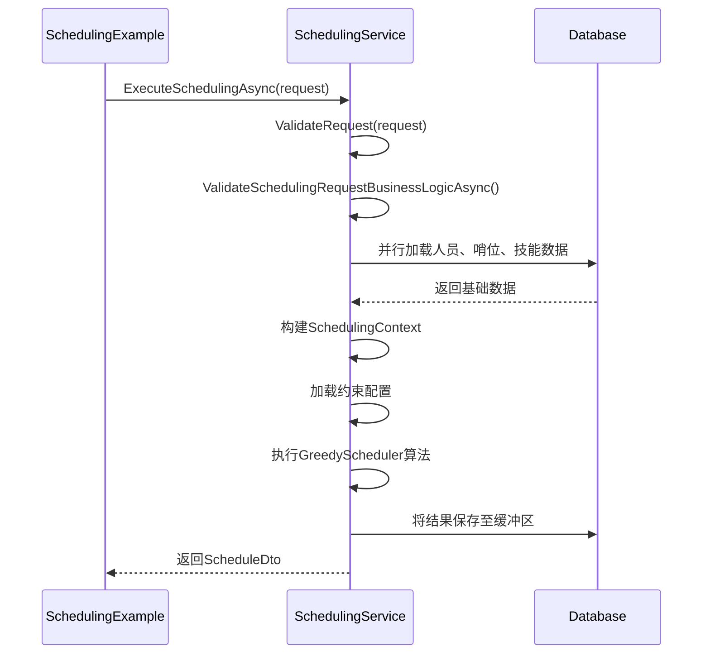
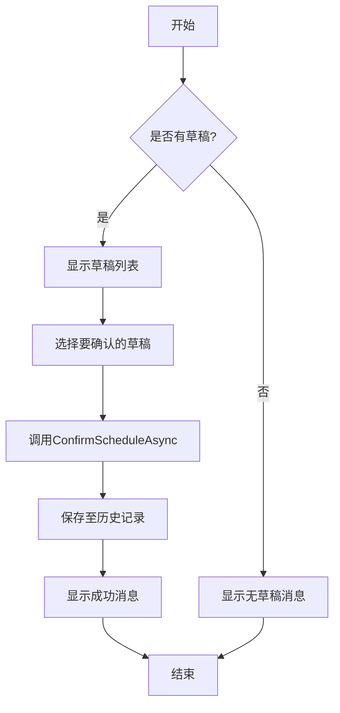

# 快速开始指南

<cite>
**本文档中引用的文件**  
- [README.md](file://README.md)
- [SchedulingExample.cs](file://Examples/SchedulingExample.cs)
- [SchedulingService.cs](file://Services/SchedulingService.cs)
- [AutoScheduling3.csproj](file://AutoScheduling3.csproj)
</cite>

## 目录
1. [简介](#简介)
2. [环境准备](#环境准备)
3. [项目构建与运行](#项目构建与运行)
4. [执行第一个排班任务](#执行第一个排班任务)
5. [查看排班结果](#查看排班结果)
6. [常见问题](#常见问题)

## 简介

本指南旨在帮助新手开发者快速搭建开发环境并成功运行第一个自动排班任务。通过本教程，您将学习如何安装必要的开发工具、编译项目代码，并使用示例代码执行基本的排班操作。整个过程设计为循序渐进，确保您能够快速获得实践成果和成就感。

**Section sources**
- [README.md](file://README.md#L1-L284)

## 环境准备

### 安装 .NET 8.0 SDK

要运行本项目，您需要安装 .NET 8.0 SDK。请按照以下步骤进行安装：

1. 访问 [.NET 下载页面](https://dotnet.microsoft.com/download/dotnet/8.0)
2. 选择适合您操作系统的 .NET 8.0 SDK 版本进行下载
3. 运行安装程序并按照提示完成安装
4. 安装完成后，打开命令行工具（如 PowerShell 或 CMD），输入以下命令验证安装是否成功：

```bash
dotnet --version
```

您应该看到输出版本号为 `8.0.xxxx.x`，表示 .NET 8.0 SDK 已正确安装。

### 恢复 NuGet 包

项目依赖多个 NuGet 包，这些包会在构建时自动恢复。您也可以手动恢复：

```bash
dotnet restore
```

从项目文件 `AutoScheduling3.csproj` 中可以看到项目依赖的关键包包括：
- `Microsoft.Data.Sqlite`：用于 SQLite 数据库访问
- `CommunityToolkit.Mvvm`：MVVM 模式支持
- `MathNet.Numerics`：数学计算库

**Section sources**
- [AutoScheduling3.csproj](file://AutoScheduling3.csproj#L1-L63)
- [README.md](file://README.md#L1-L284)

## 项目构建与运行

### 构建项目

在项目根目录下执行以下命令来构建项目：

```bash
dotnet build
```

如果构建成功，您将看到类似以下的输出：
```
AutoScheduling3 -> bin\Debug\net8.0-windows10.0.19041.0\AutoScheduling3.exe
```

### 运行应用程序

构建成功后，可以通过以下命令运行应用程序：

```bash
dotnet run
```

或者直接运行生成的可执行文件：
```bash
.\bin\Debug\net8.0-windows10.0.19041.0\AutoScheduling3.exe
```

**Section sources**
- [AutoScheduling3.csproj](file://AutoScheduling3.csproj#L1-L63)

## 执行第一个排班任务

### 使用示例代码执行排班

项目提供了 `SchedulingExample.cs` 示例文件，演示了如何使用排班服务。以下是执行排班的核心步骤：

1. **创建排班服务实例**：示例中通过手动装配依赖创建了 `SchedulingService` 实例，并指定数据库文件名为 `scheduling_example.db`。

2. **执行排班请求**：调用 `ExecuteSchedulingAsync` 方法，传入排班请求参数，包括：
   - 排班标题
   - 开始和结束日期
   - 参与人员ID列表
   - 参与哨位ID列表
   - 是否使用激活的休息日配置

3. **请求参数验证**：系统会自动验证请求参数的合法性，包括人员和哨位是否存在、日期范围是否合理、人员数量是否充足等。



**Diagram sources**
- [SchedulingExample.cs](file://Examples/SchedulingExample.cs#L1-L102)
- [SchedulingService.cs](file://Services/SchedulingService.cs#L57-L140)

**Section sources**
- [SchedulingExample.cs](file://Examples/SchedulingExample.cs#L1-L102)
- [SchedulingService.cs](file://Services/SchedulingService.cs#L57-L140)

## 查看排班结果

### 获取草稿列表

排班结果首先会保存在缓冲区（草稿）中，您可以通过以下代码获取草稿列表：

```csharp
var drafts = await _service.GetDraftsAsync();
```

每个草稿包含排班表的基本信息，如标题、日期范围、班次数等。

### 确认排班结果

当您对排班结果满意时，可以将其确认为正式的历史排班记录：

```csharp
await _service.ConfirmScheduleAsync(draftId);
```

确认后，该排班表将从草稿区移至历史记录区。

### 查看历史记录

通过以下代码可以获取所有已确认的历史排班记录：

```csharp
var histories = await _service.GetHistoryAsync();
```

您可以遍历历史记录并查看详细的排班信息。



**Diagram sources**
- [SchedulingExample.cs](file://Examples/SchedulingExample.cs#L1-L102)
- [SchedulingService.cs](file://Services/SchedulingService.cs#L142-L180)

**Section sources**
- [SchedulingExample.cs](file://Examples/SchedulingExample.cs#L1-L102)
- [SchedulingService.cs](file://Services/SchedulingService.cs#L142-L240)

## 常见问题

### 数据库初始化

首次运行时，系统会自动创建数据库文件并初始化所有表结构。您无需手动创建数据库。

### 人员和哨位数据

示例代码假设数据库中已存在人员和哨位数据。在实际使用中，您需要先通过相应的服务方法添加基础数据。

### 排班失败的可能原因

1. **人员不足**：系统会验证人员数量是否足够满足排班需求
2. **技能不匹配**：人员必须具备哨位所需的技能
3. **日期范围过大**：排班周期不能超过365天
4. **存在冲突约束**：定岗规则或手动指定可能导致无解

**Section sources**
- [README.md](file://README.md#L1-L284)
- [SchedulingService.cs](file://Services/SchedulingService.cs#L300-L500)