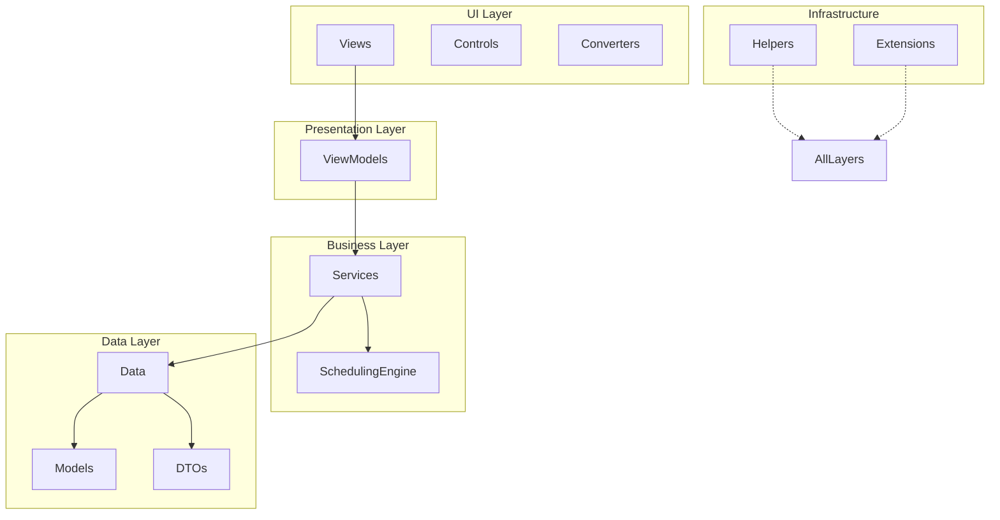
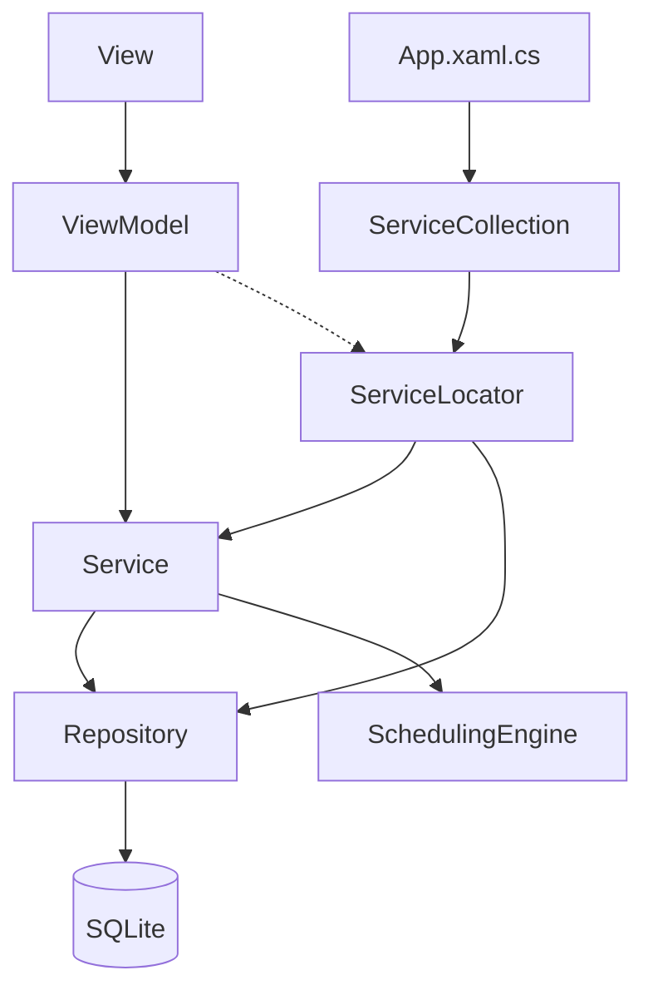
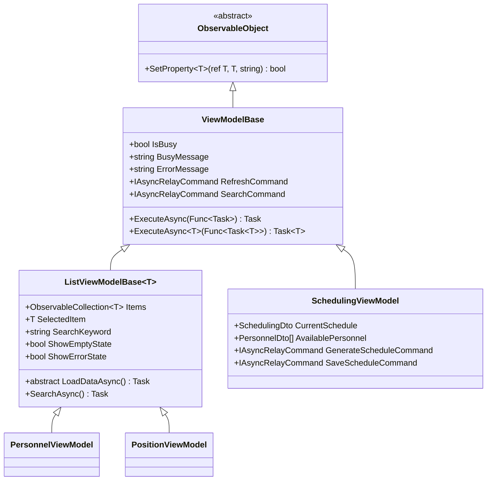
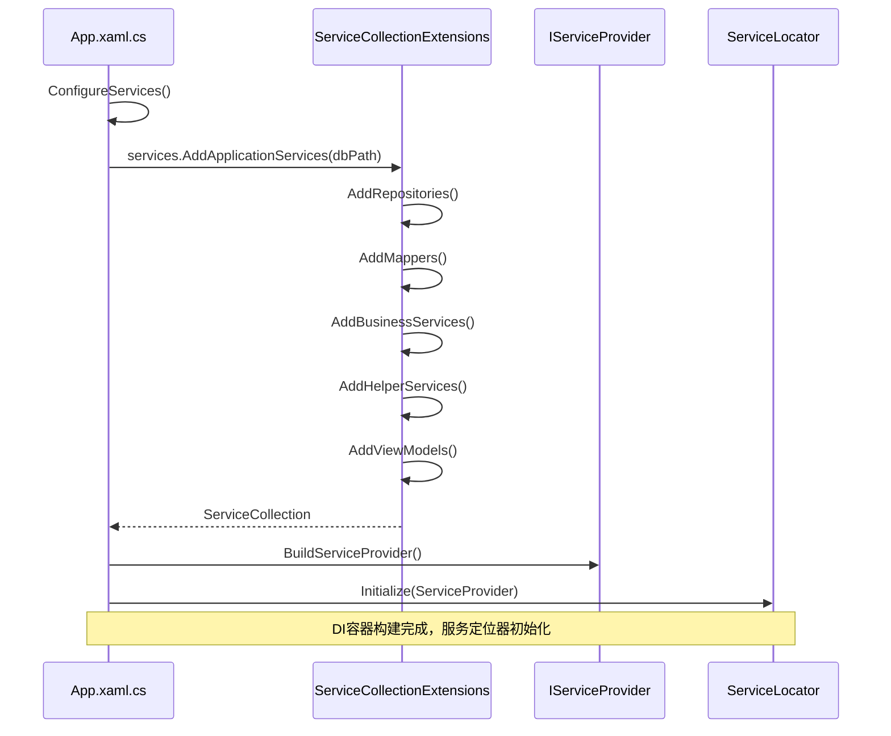
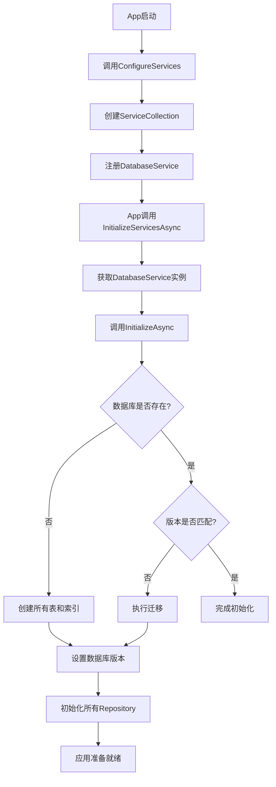

# 技术栈与依赖

<cite>
**本文档中引用的文件**  
- [AutoScheduling3.csproj](file://AutoScheduling3.csproj)
- [App.xaml.cs](file://App.xaml.cs)
- [DatabaseConfiguration.cs](file://Data/DatabaseConfiguration.cs)
- [DatabaseService.cs](file://Data/DatabaseService.cs)
- [ServiceLocator.cs](file://Helpers/ServiceLocator.cs)
- [ServiceCollectionExtensions.cs](file://Extensions/ServiceCollectionExtensions.cs)
- [ViewModelBase.cs](file://ViewModels/Base/ViewModelBase.cs)
- [PersonnelDto.cs](file://DTOs/PersonnelDto.cs)
- [PersonalRepository.cs](file://Data/PersonalRepository.cs)
- [PersonnelService.cs](file://Services/PersonnelService.cs)
</cite>

## 目录
1. [简介](#简介)
2. [项目结构](#项目结构)
3. [核心组件](#核心组件)
4. [架构概述](#架构概述)
5. [详细组件分析](#详细组件分析)
6. [依赖分析](#依赖分析)
7. [性能考虑](#性能考虑)
8. [故障排除指南](#故障排除指南)
9. [结论](#结论)

## 简介
AutoScheduling3 是一个基于 .NET 8.0 和 WinUI 3 的现代化桌面排班系统，采用 MVVM 模式和依赖注入架构，实现人员、岗位、技能和排班规则的集中管理与智能调度。本项目通过模块化设计和清晰的分层架构，确保了系统的可维护性、可扩展性和可测试性。技术选型聚焦于微软最新技术栈，结合轻量级数据库和高效的序列化机制，构建了一个高性能、响应迅速的桌面应用。

## 项目结构
项目采用功能分层与模块化相结合的目录结构，清晰地分离了关注点。核心结构包括：`Models`（领域模型）、`DTOs`（数据传输对象）、`Data`（数据访问层）、`Services`（业务逻辑层）、`ViewModels`（视图模型层）和 `Views`（视图层）。这种分层设计遵循了典型的 MVVM 模式，确保了 UI 与业务逻辑的解耦。`SchedulingEngine` 目录封装了核心的排班算法，而 `Helpers` 和 `Extensions` 则提供了通用的工具方法和框架扩展。

**Diagram sources**
- [AutoScheduling3.csproj](file://AutoScheduling3.csproj)

**Section sources**
- [AutoScheduling3.csproj](file://AutoScheduling3.csproj)

## 核心组件
项目的核心组件围绕排班业务展开，包括人员管理、岗位配置、技能体系、约束规则和排班引擎。`PersonnelService` 和 `PositionService` 等服务类封装了业务逻辑，通过 `Repository` 模式与 SQLite 数据库交互。`ViewModels` 层作为桥梁，将数据和命令暴露给 `Views` 层，利用 `CommunityToolkit.Mvvm` 实现双向数据绑定。`SchedulingEngine` 是系统的大脑，负责根据复杂的约束条件生成最优排班方案。

**Section sources**
- [Services/PersonnelService.cs](file://Services/PersonnelService.cs)
- [Data/PersonalRepository.cs](file://Data/PersonalRepository.cs)
- [ViewModels/Scheduling/SchedulingViewModel.cs](file://ViewModels/Scheduling/SchedulingViewModel.cs)

## 架构概述
系统采用经典的分层架构，从上至下分为：视图层 (Views)、视图模型层 (ViewModels)、服务层 (Services)、数据访问层 (Data) 和模型层 (Models)。依赖注入 (DI) 容器贯穿整个应用，由 `App.xaml.cs` 在启动时配置，通过 `ServiceCollectionExtensions` 统一注册所有服务。`ServiceLocator` 提供了全局访问 DI 容器的静态方法，方便在非 DI 上下文中获取服务。数据持久化通过 `Microsoft.Data.Sqlite` 实现，利用 `System.Text.Json` 进行对象序列化。

**Diagram sources**
- [App.xaml.cs](file://App.xaml.cs)
- [Extensions/ServiceCollectionExtensions.cs](file://Extensions/ServiceCollectionExtensions.cs)
- [Helpers/ServiceLocator.cs](file://Helpers/ServiceLocator.cs)

## 详细组件分析

### UI框架：WinUI 3
WinUI 3 作为本项目的核心 UI 框架，提供了现代化的 Fluent Design 设计语言和强大的原生 Windows 11 体验。它允许开发者使用 XAML 和 C# 构建高性能、高保真的桌面应用。在 AutoScheduling3 中，WinUI 3 不仅用于构建主窗口 (`MainWindow.xaml`) 和各个功能页面 (`Views` 目录)，还通过 `CommunityToolkit.WinUI.UI.Controls.DataGrid` 扩展了数据网格控件，实现了复杂的数据展示和交互。其与 Windows App SDK 的深度集成，确保了应用在不同 Windows 版本上的兼容性和稳定性。

**Section sources**
- [AutoScheduling3.csproj](file://AutoScheduling3.csproj)
- [MainWindow.xaml.cs](file://MainWindow.xaml.cs)
- [Views/Scheduling/CreateSchedulingPage.xaml.cs](file://Views/Scheduling/CreateSchedulingPage.xaml.cs)

### MVVM模式：CommunityToolkit.Mvvm
`CommunityToolkit.Mvvm` 库是实现 MVVM 模式的关键，它极大地简化了视图模型的开发。`ViewModelBase` 类继承自 `ObservableObject`，利用 `[ObservableProperty]` 源生成器自动生成属性变更通知代码，避免了手动编写 `INotifyPropertyChanged` 的繁琐。`IAsyncRelayCommand` 用于创建异步命令，将 UI 操作（如按钮点击）安全地绑定到视图模型中的异步方法，同时自动管理 `IsBusy` 状态。`ListViewModelBase` 提供了列表管理的通用功能，如搜索、刷新和选中项变更处理。

**Diagram sources**
- [ViewModels/Base/ViewModelBase.cs](file://ViewModels/Base/ViewModelBase.cs)
- [ViewModels/Base/ListViewModelBase.cs](file://ViewModels/Base/ListViewModelBase.cs)

### 依赖注入：Microsoft.Extensions.DependencyInjection
`Microsoft.Extensions.DependencyInjection` 提供了强大且灵活的依赖注入容器，是整个应用架构的基石。在 `App.xaml.cs` 的 `ConfigureServices` 方法中，通过 `ServiceCollection` 注册了所有服务、仓储、映射器和视图模型。`ServiceCollectionExtensions.cs` 文件定义了 `AddApplicationServices` 扩展方法，将服务注册逻辑模块化，提高了代码的可读性和可维护性。服务的生命周期被精心管理，例如，仓储和业务服务通常注册为单例 (`Singleton`)，而视图模型则注册为瞬态 (`Transient`)，以确保每个视图都有独立的视图模型实例。

**Diagram sources**
- [App.xaml.cs](file://App.xaml.cs#L75-L95)
- [Extensions/ServiceCollectionExtensions.cs](file://Extensions/ServiceCollectionExtensions.cs)

### 数据持久化：SQLite
SQLite 被选为数据持久化方案，主要因其轻量级、零配置、嵌入式和跨平台的特性，非常适合桌面应用。项目通过 `Microsoft.Data.Sqlite` 包与 SQLite 数据库交互。`DatabaseService` 负责数据库的初始化、版本管理和迁移，确保数据结构的演进。`DatabaseConfiguration` 类管理数据库路径，支持将数据库文件存储在用户本地应用数据目录中。数据访问层 (`Data` 目录) 的各个 `Repository` 类使用原生 SQL 命令执行 CRUD 操作，并利用 `System.Text.Json` 将复杂对象（如技能ID列表）序列化为 JSON 字符串存储在数据库中。

**Diagram sources**
- [App.xaml.cs](file://App.xaml.cs#L102-L134)
- [Data/DatabaseService.cs](file://Data/DatabaseService.cs)
- [Data/DatabaseConfiguration.cs](file://Data/DatabaseConfiguration.cs)

### 序列化：System.Text.Json
`System.Text.Json` 被广泛用于对象的序列化和反序列化。在数据访问层，`PersonalRepository` 等类使用它将 `List<int>` 类型的技能ID列表和 `int[]` 类型的时段间隔数组序列化为 JSON 字符串，以便存储在 SQLite 的 TEXT 字段中。在 DTO 层，`[JsonPropertyName]` 属性用于控制 JSON 序列化的字段名称，确保与 API 或前端的约定一致。此外，`[Required]`、`[StringLength]` 等数据注解与 `System.Text.Json` 结合，可以在反序列化时进行基本的数据验证。

**Section sources**
- [Data/PersonalRepository.cs](file://Data/PersonalRepository.cs#L45-L50)
- [DTOs/PersonnelDto.cs](file://DTOs/PersonnelDto.cs)

## 依赖分析
项目的关键 NuGet 依赖及其版本如下表所示。这些依赖共同构成了项目的技术基础。

| 包名称 | 版本 | 用途 |
| :--- | :--- | :--- |
| Microsoft.WindowsAppSDK | 1.8.251003001 | Windows App SDK 核心库，提供 WinUI 3 运行时支持 |
| CommunityToolkit.Mvvm | 8.4.0 | 实现 MVVM 模式，提供命令、属性通知等 |
| Microsoft.Extensions.DependencyInjection | 9.0.10 | 依赖注入容器 |
| Microsoft.Data.Sqlite | 9.0.10 | SQLite 数据库提供程序 |
| System.Text.Json | 内置 | JSON 序列化与反序列化 |
| MathNet.Numerics | 5.0.0 | 数值计算库，用于排班算法 |
| CommunityToolkit.WinUI.UI.Controls.DataGrid | 7.1.2 | 数据网格控件 |

**Diagram sources**
- [AutoScheduling3.csproj](file://AutoScheduling3.csproj)

**Section sources**
- [AutoScheduling3.csproj](file://AutoScheduling3.csproj)

## 性能考虑
项目在性能方面进行了多项优化。数据库层面，`DatabaseService` 在初始化时创建了大量索引，以加速 `Personals`、`Positions` 等表的查询操作。`DatabaseConfiguration` 提供了优化的连接字符串，启用了 WAL (Write-Ahead Logging) 模式，提高了并发写入性能。在应用层面，`ListViewModelBase` 的 `SearchAsync` 命令会触发异步加载，避免了 UI 线程阻塞。`SchedulingEngine` 的核心算法被设计为高效运行，以减少生成排班方案的时间。

## 故障排除指南
若应用启动失败，首先检查 `App.xaml.cs` 中的 `ConfigureServices` 是否成功构建了 `IServiceProvider`。若出现数据库错误，请检查 `DatabaseConfiguration.GetDefaultDatabasePath()` 返回的路径是否可写。若 UI 无响应，检查 `ViewModelBase.ExecuteAsync` 是否被正确使用，避免在 UI 线程上执行耗时的同步操作。若依赖注入失败，确认服务是否在 `ServiceCollectionExtensions` 中正确注册，并检查构造函数注入的参数类型是否匹配。

**Section sources**
- [App.xaml.cs](file://App.xaml.cs#L40-L79)
- [Helpers/ServiceLocator.cs](file://Helpers/ServiceLocator.cs)

## 结论
AutoScheduling3 项目成功地整合了 .NET 8.0、WinUI 3、CommunityToolkit.Mvvm 和 SQLite 等现代技术，构建了一个结构清晰、易于维护的桌面应用。依赖注入和 MVVM 模式的应用确保了代码的高内聚低耦合。SQLite 作为嵌入式数据库，完美契合了本项目的轻量级需求。对于新开发者，建议首先理解 `ServiceCollectionExtensions` 中的服务注册流程和 `ViewModelBase` 的基类功能，这是掌握整个项目架构的关键。