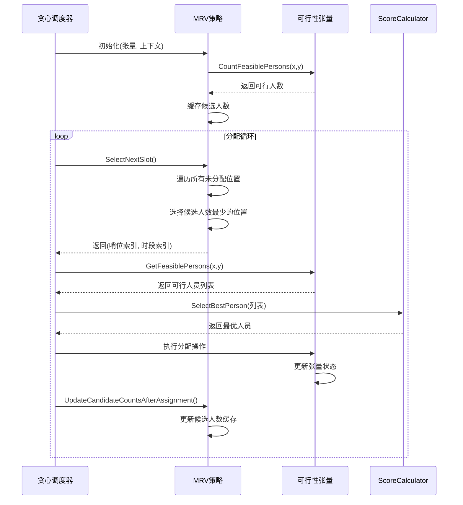
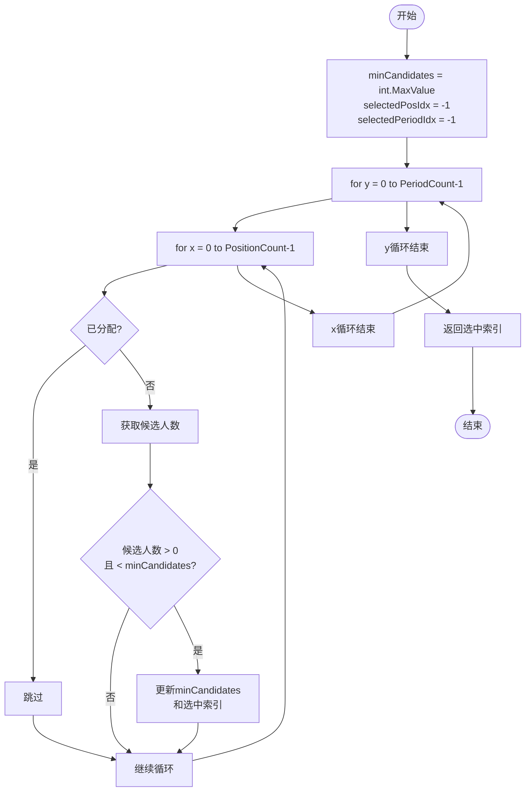

# MRV策略

<cite>
**Referenced Files in This Document**   
- [MRVStrategy.cs](file://SchedulingEngine/Strategies/MRVStrategy.cs)
- [FeasibilityTensor.cs](file://SchedulingEngine/Core/FeasibilityTensor.cs)
- [SchedulingContext.cs](file://SchedulingEngine/Core/SchedulingContext.cs)
- [GreedyScheduler.cs](file://SchedulingEngine/GreedyScheduler.cs)
- [ConstraintValidator.cs](file://SchedulingEngine/Core/ConstraintValidator.cs)
- [ScoreCalculator.cs](file://SchedulingEngine/Core/ScoreCalculator.cs)
- [PersonScoreState.cs](file://Models/PersonScoreState.cs)
</cite>

## 目录
1. [引言](#引言)
2. [核心组件分析](#核心组件分析)
3. [MRV策略与可行性张量的协同](#mrv策略与可行性张量的协同)
4. [SelectNextSlot方法的核心逻辑](#selectnextslot方法的核心逻辑)
5. [调度状态的维护机制](#调度状态的维护机制)
6. [排班失败的诊断](#排班失败的诊断)
7. [算法优化指导](#算法优化指导)
8. [结论](#结论)

## 引言

MRV（Minimum Remaining Values，最小剩余值）策略是本自动排班系统中的核心启发式算法。该策略通过优先选择可行人员最少的（哨位, 时段）组合进行分配，旨在尽早暴露潜在的冲突和约束问题，从而有效降低搜索空间并提高排班算法的成功率。本系统通过`MRVStrategy`类实现该策略，其与`FeasibilityTensor`（可行性张量）紧密协作，共同构成了排班引擎的决策基础。`MRVStrategy`作为`GreedyScheduler`（贪心调度器）的关键组件，负责在每一步选择最优的分配位置，而`FeasibilityTensor`则高效地维护着所有可能的分配方案的可行性状态。

**Section sources**
- [MRVStrategy.cs](file://SchedulingEngine/Strategies/MRVStrategy.cs#L1-L270)
- [GreedyScheduler.cs](file://SchedulingEngine/GreedyScheduler.cs#L16-L430)

## 核心组件分析

本节深入分析MRV策略所依赖的核心组件，包括`MRVStrategy`、`FeasibilityTensor`和`SchedulingContext`，阐明它们在排班流程中的角色和交互关系。

### MRVStrategy类

`MRVStrategy`类是MRV启发式策略的具体实现。它接收一个`FeasibilityTensor`和一个`SchedulingContext`作为构造参数，用于初始化其内部状态。该类的核心是两个二维数组：`_candidateCounts`和`_assignedFlags`。`_candidateCounts`是一个缓存，存储了每个（哨位, 时段）组合的可行人员数量，避免了在每次选择时都重新计算。`_assignedFlags`则是一个布尔标记数组，用于记录哪些（哨位, 时段）组合已经被分配，防止重复分配。

**Section sources**
- [MRVStrategy.cs](file://SchedulingEngine/Strategies/MRVStrategy.cs#L11-L270)

### FeasibilityTensor类

`FeasibilityTensor`（可行性张量）是一个三维布尔数组`[哨位, 时段, 人员]`，它是整个排班系统的核心数据结构。它以二进制形式高效地存储了所有可能的分配方案的可行性。张量中的每个元素`[x, y, z]`表示第`z`位人员是否可以在第`x`个哨位、第`y`个时段值班。该类提供了多种优化方法，如`CountFeasiblePersons`用于统计特定（哨位, 时段）的可行人员数，`SetOthersInfeasibleForSlot`用于在分配后将该（哨位, 时段）的其他人员标记为不可行，从而动态更新张量状态。

**Section sources**
- [FeasibilityTensor.cs](file://SchedulingEngine/Core/FeasibilityTensor.cs#L11-L556)

### SchedulingContext类

`SchedulingContext`（调度上下文）是排班算法所需的所有数据和配置的容器。它包含了人员列表、哨位列表、排班周期、历史排班信息、定岗规则、手动分配指令等。此外，它还维护着`PersonScoreStates`（人员评分状态），用于软约束的评分计算。`SchedulingContext`为`MRVStrategy`和`FeasibilityTensor`提供了必要的数据支持，是连接业务数据与算法逻辑的桥梁。

**Section sources**
- [SchedulingContext.cs](file://SchedulingEngine/Core/SchedulingContext.cs#L11-L155)

## MRV策略与可行性张量的协同

MRV策略的有效性高度依赖于`FeasibilityTensor`提供的实时、准确的可行性信息。两者通过紧密的协同工作，实现了高效的排班决策。

**Diagram sources **
- [MRVStrategy.cs](file://SchedulingEngine/Strategies/MRVStrategy.cs#L11-L270)
- [FeasibilityTensor.cs](file://SchedulingEngine/Core/FeasibilityTensor.cs#L11-L556)
- [GreedyScheduler.cs](file://SchedulingEngine/GreedyScheduler.cs#L16-L430)

如序列图所示，`GreedyScheduler`在每次迭代中调用`MRVStrategy`的`SelectNextSlot`方法。`MRVStrategy`通过查询其内部的`_candidateCounts`缓存来选择候选人数最少的未分配位置。一旦选定位置，`GreedyScheduler`会从`FeasibilityTensor`中获取该位置的可行人员列表，并通过`ScoreCalculator`选出最优人员。在完成分配后，`FeasibilityTensor`会更新其内部状态，而`MRVStrategy`则通过`UpdateCandidateCountsAfterAssignment`方法同步更新其缓存，确保下一次选择的准确性。

## SelectNextSlot方法的核心逻辑

`SelectNextSlot`方法是`MRVStrategy`类的核心，它实现了MRV启发式策略的决策逻辑。

**Diagram sources **
- [MRVStrategy.cs](file://SchedulingEngine/Strategies/MRVStrategy.cs#L110-L140)

该方法的逻辑流程如下：
1.  **初始化**：设置`minCandidates`为最大值，`selectedPosIdx`和`selectedPeriodIdx`为-1，用于记录最优解。
2.  **双重循环遍历**：外层循环遍历所有时段（`y`），内层循环遍历所有哨位（`x`）。这种“先按时段，再按哨位”的顺序有助于在时间维度上保持一定的连续性。
3.  **跳过已分配位置**：检查`_assignedFlags[x, y]`，如果为`true`，则跳过该位置。
4.  **候选人数比较**：获取`_candidateCounts[x, y]`的值，即该位置的可行人员数。只有当该值大于0（存在可行人员）且小于当前记录的`minCandidates`时，才更新`minCandidates`和选中的索引。
5.  **返回结果**：循环结束后，返回选中的（哨位索引, 时段索引）。如果所有位置都已分配或无可行分配，则返回(-1, -1)。

此方法通过优先选择候选人数最少的位置，使得算法在早期就处理最“困难”的分配，从而最大限度地减少后续搜索的分支，提高算法效率。

**Section sources**
- [MRVStrategy.cs](file://SchedulingEngine/Strategies/MRVStrategy.cs#L110-L140)

## 调度状态的维护机制

为了保证排班过程的正确性和一致性，系统通过`MarkAsAssigned`和`UpdateCandidateCountsAfterAssignment`两个方法来维护调度状态。

### MarkAsAssigned方法

`MarkAsAssigned`方法非常简单直接，其作用是将指定的（哨位索引, 时段索引）在`_assignedFlags`数组中标记为`true`。这确保了`SelectNextSlot`方法在后续调用时不会再选择这个已分配的位置，从而避免了重复分配。

**Section sources**
- [MRVStrategy.cs](file://SchedulingEngine/Strategies/MRVStrategy.cs#L143-L147)

### UpdateCandidateCountsAfterAssignment方法

`UpdateCandidateCountsAfterAssignment`方法是状态维护的核心，它在一次成功分配后，根据各种硬约束增量地更新`_candidateCounts`缓存。其主要逻辑包括：

1.  **“一人一哨”约束**：对于已分配人员在当前时段的其他所有未分配哨位，如果该人员在`FeasibilityTensor`中是可行的，则将其候选人数减1。这是因为该人员在同一时段只能在一个哨位值班。
2.  **“单人上哨”约束**：将已分配的（哨位, 时段）的候选人数直接设为0，因为该位置已被占用。
3.  **“时段不连续”约束**：调用`UpdateAdjacentPeriodCounts`，将该人员在相邻时段（前一个和后一个）的所有未分配哨位的候选人数减1，防止连续上哨。
4.  **“夜哨唯一”约束**：调用`UpdateNightShiftCounts`，将该人员在同一晚的其他夜哨时段（如23:00-01:00, 01:00-03:00等）的所有未分配哨位的候选人数减1，确保一人一晚只上一个夜哨。

通过这种增量更新的方式，系统避免了在每次分配后重新计算整个`_candidateCounts`数组，极大地提升了性能。

**Section sources**
- [MRVStrategy.cs](file://SchedulingEngine/Strategies/MRVStrategy.cs#L150-L220)

## 排班失败的诊断

当排班算法无法为所有（哨位, 时段）组合找到可行人员时，`GetUnassignedWithNoCandidates`方法提供了一种强大的诊断工具。

该方法遍历所有未分配的位置，检查其`_candidateCounts`是否为0。如果为0，则意味着没有任何人员可以被分配到该位置，这通常是由于硬约束（如技能不匹配、定岗规则、人员不可用等）过于严格或存在冲突导致的。该方法返回一个包含所有此类位置的列表，系统可以利用此信息进行日志记录或向用户报告具体的排班失败原因，例如“2023-10-01 08:00-10:00 哨位A 无可用人员”，从而帮助用户调整约束条件或手动干预。

**Section sources**
- [MRVStrategy.cs](file://SchedulingEngine/Strategies/MRVStrategy.cs#L255-L268)

## 算法优化指导

为了在排班效率与解的质量之间取得更好的平衡，可以考虑以下优化策略：

1.  **混合选择策略**：MRV策略虽然高效，但可能导致解的质量（如人员休息平衡）不是最优。可以引入混合策略，例如在候选人数少于某个阈值（如3人）时使用MRV策略，以处理困难的分配；而在候选人数较多时，切换到基于软约束评分的策略，优先选择能最大化综合得分的（哨位, 时段）组合，从而提升整体排班质量。
2.  **动态权重调整**：`ScoreCalculator`中的软约束权重（`RestWeight`, `HolidayWeight`, `TimeSlotWeight`）可以设计为可配置的。通过分析历史排班数据和用户反馈，动态调整这些权重，可以使算法更符合实际需求。
3.  **回溯与重试机制**：当`GetUnassignedWithNoCandidates`检测到排班失败时，可以实现一个有限的回溯机制，撤销最近的几次分配，并尝试不同的选择路径。或者，可以重新初始化`FeasibilityTensor`和`MRVStrategy`，并以不同的随机种子或顺序重新开始排班，增加找到可行解的概率。
4.  **并行化探索**：对于大型排班问题，可以考虑并行运行多个`GreedyScheduler`实例，每个实例采用略微不同的策略或随机扰动，然后选择其中质量最高的解作为最终结果。

## 结论

本文档详细解析了自动排班系统中MRV启发式策略的实现。`MRVStrategy`类通过与`FeasibilityTensor`的紧密协作，利用候选人数缓存和增量更新机制，高效地实现了“最小剩余值”选择逻辑。`SelectNextSlot`方法通过优先处理候选人员最少的分配，有效降低了搜索空间。`MarkAsAssigned`和`UpdateCandidateCountsAfterAssignment`方法共同维护了调度状态的一致性。`GetUnassignedWithNoCandidates`方法为诊断排班失败提供了关键信息。未来可通过引入混合策略、动态权重和回溯机制等优化手段，进一步提升算法的鲁棒性和解的质量。