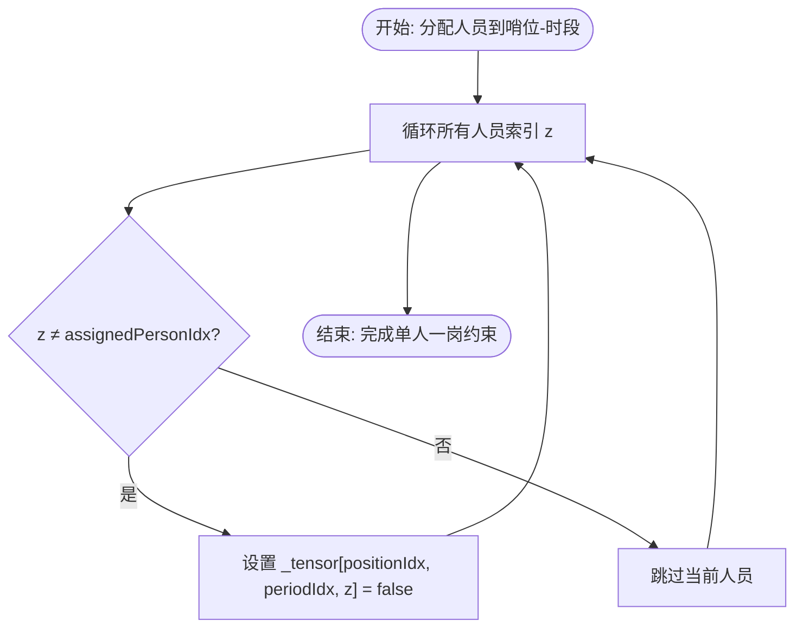
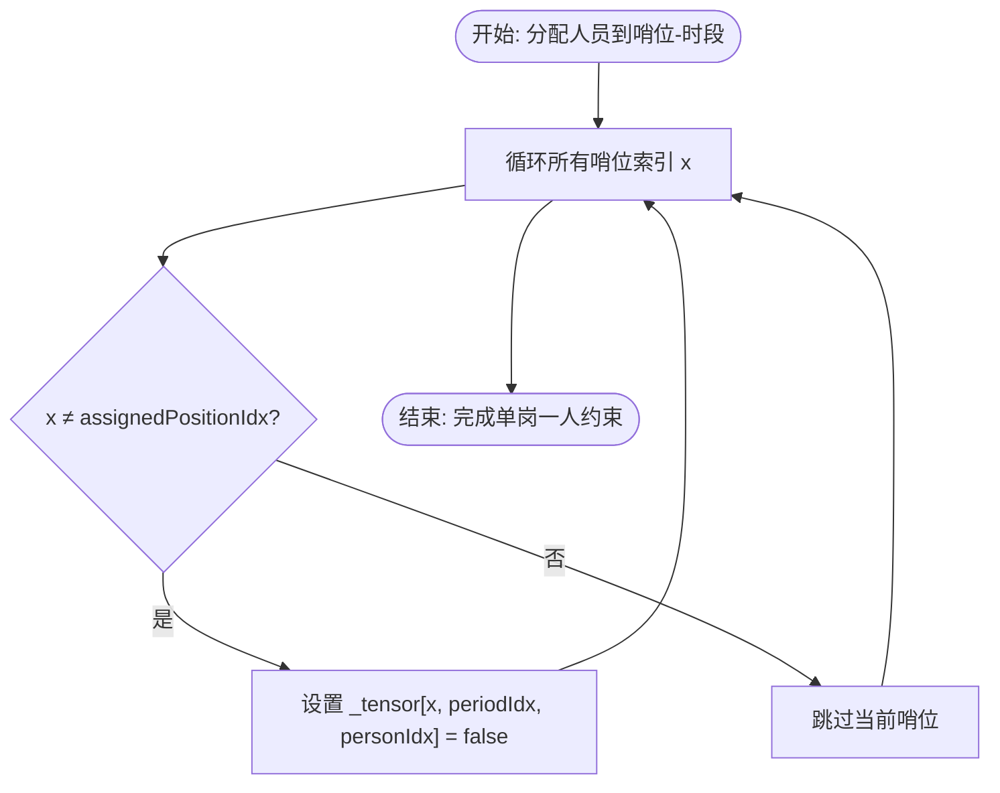
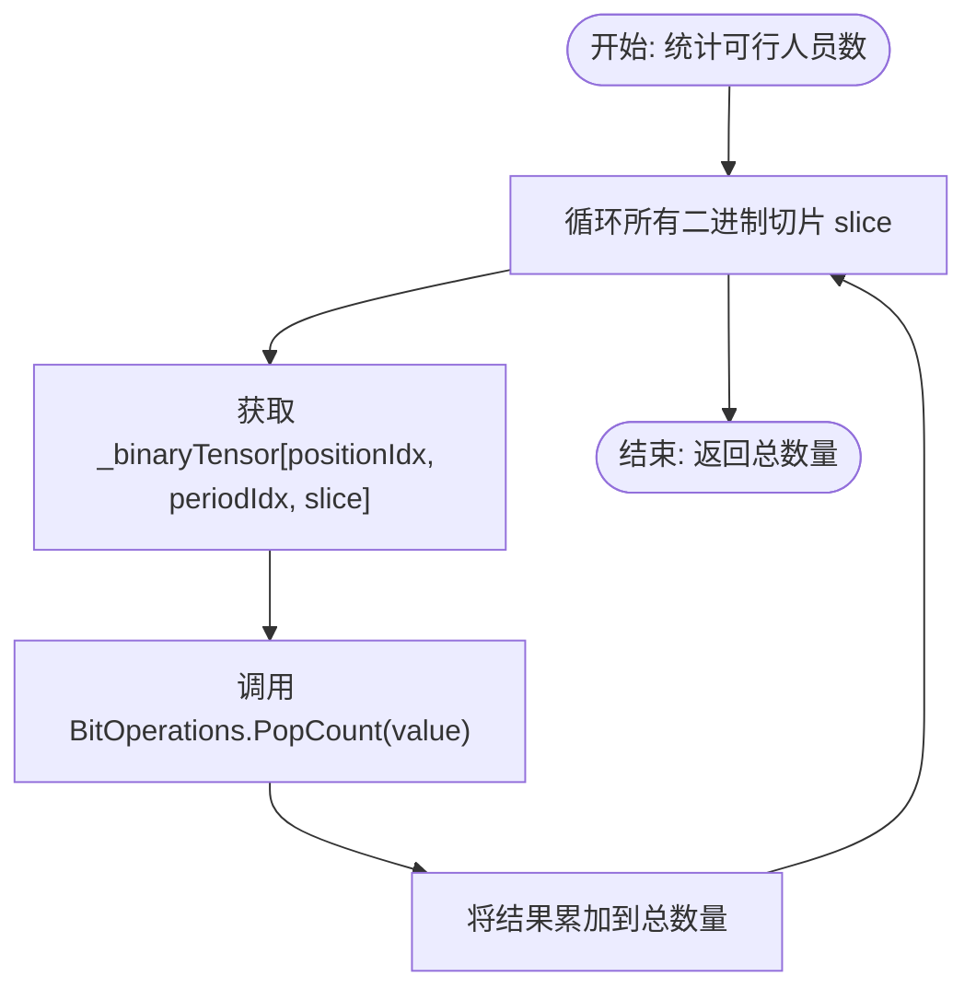

# 可行性张量

<cite>
**Referenced Files in This Document**  
- [FeasibilityTensor.cs](file://SchedulingEngine/Core/FeasibilityTensor.cs)
- [ConstraintValidator.cs](file://SchedulingEngine/Core/ConstraintValidator.cs)
- [SchedulingContext.cs](file://SchedulingEngine/Core/SchedulingContext.cs)
</cite>

## Table of Contents
1. [可行性张量概述](#可行性张量概述)
2. [三维布尔数组与二进制优化存储](#三维布尔数组与二进制优化存储)
3. [MathNet矩阵加速原理](#mathnet矩阵加速原理)
4. [关键约束方法实现](#关键约束方法实现)
5. [位运算优化与批量约束应用](#位运算优化与批量约束应用)
6. [张量初始化与内存管理](#张量初始化与内存管理)

## 可行性张量概述

可行性张量（FeasibilityTensor）是排班系统中的核心数据结构，采用三维布尔数组 `[哨位, 时段, 人员]` 高效表示三者之间的可行性关系。该张量作为调度算法的决策基础，通过预计算和优化存储，显著提升了排班方案的生成效率和约束验证速度。

**Section sources**
- [FeasibilityTensor.cs](file://SchedulingEngine/Core/FeasibilityTensor.cs#L11-L556)

## 三维布尔数组与二进制优化存储

可行性张量的核心是三维布尔数组 `_tensor`，其三个维度分别对应哨位、时段和人员。每个元素 `_tensor[positionIdx, periodIdx, personIdx]` 表示特定人员在特定哨位和时段的分配可行性，`true` 表示可行，`false` 表示不可行。

为优化存储和性能，系统引入了二进制存储机制 `_binaryTensor`，使用 `ulong[,,]` 类型。由于一个 `ulong` 可以存储64个布尔值（64位），系统将人员维度按64人一组进行切片（`_binarySlices`）。例如，若有100名人员，则需要2个 `ulong` 切片（`_binarySlices = (100 + 63) / 64 = 2`）。

这种二进制优化带来了显著的性能优势：
- **空间压缩**：相比原始的 `bool[,,]`，`ulong[,,]` 将存储空间压缩了约8倍。
- **操作加速**：对整个切片的位运算（如与、或、非）可以一次性处理64个布尔值，远快于逐个元素的循环操作。

**Section sources**
- [FeasibilityTensor.cs](file://SchedulingEngine/Core/FeasibilityTensor.cs#L36-L80)

## MathNet矩阵加速原理

为实现更高级的批量操作，可行性张量集成了 MathNet.Numerics 库的矩阵功能。通过将三维张量映射到二维矩阵 `_constraintMatrix`，系统可以利用高效的线性代数运算来处理复杂的约束。

矩阵的行对应 `[哨位, 时段]` 的组合（`positionIdx * _periodCount + periodIdx`），列对应人员。矩阵初始化时所有元素为1.0，表示初始状态下所有分配都是可行的。

当需要批量应用约束时，系统直接将矩阵中对应位置的值设为0.0，然后通过 `SyncTensorFromMatrix()` 方法将结果同步回原始的布尔张量。这种方法特别适合处理大量并发的约束更新，避免了传统循环的开销。

**Section sources**
- [FeasibilityTensor.cs](file://SchedulingEngine/Core/FeasibilityTensor.cs#L68-L78)

## 关键约束方法实现

### 单人一岗约束（SetOthersInfeasibleForSlot）

`SetOthersInfeasibleForSlot` 方法用于实施“单人一岗”约束，即确保一个哨位在特定时段只能由一名人员值守。当某人员被分配到某个哨位-时段组合时，该方法会将该组合下所有其他人员的可行性设为 `false`。

**Diagram sources**
- [FeasibilityTensor.cs](file://SchedulingEngine/Core/FeasibilityTensor.cs#L188-L197)

### 单岗一人约束（SetOtherPositionsInfeasibleForPersonPeriod）

`SetOtherPositionsInfeasibleForPersonPeriod` 方法用于实施“单岗一人”约束，即确保一名人员在特定时段只能在一个哨位值守。当某人员被分配到某个哨位-时段组合时，该方法会将该人员在该时段所有其他哨位的可行性设为 `false`。

**Diagram sources**
- [FeasibilityTensor.cs](file://SchedulingEngine/Core/FeasibilityTensor.cs#L202-L211)

## 位运算优化与批量约束应用

### CountFeasiblePersons 的位运算优化

`CountFeasiblePersons` 方法用于统计特定哨位-时段组合下可行的人员数量。系统提供了基础和优化两个版本：

- **基础版本**：遍历所有人员，逐个检查布尔值并计数。
- **优化版本**：利用 `System.Numerics.BitOperations.PopCount` 方法，该方法能高效计算一个 `ulong` 值中1的位数（即可行人员数）。

**Diagram sources**
- [FeasibilityTensor.cs](file://SchedulingEngine/Core/FeasibilityTensor.cs#L216-L226)

### ApplyConstraint 的批量约束应用

`ApplyConstraint` 方法用于批量应用外部约束。系统通过逐位与运算（`&=`）将传入的约束张量与现有张量进行合并，从而高效地更新可行性状态。

- **基础版本**：直接对 `bool[,,]` 进行逐元素的与运算。
- **优化版本**：将约束张量转换为二进制格式，然后对 `ulong[,,]` 进行逐切片的与运算，性能大幅提升。

**Section sources**
- [FeasibilityTensor.cs](file://SchedulingEngine/Core/FeasibilityTensor.cs#L274-L284)

## 张量初始化与内存管理

### 张量初始化

可行性张量在构造函数中完成初始化：
1. 创建 `bool[,,] _tensor` 并将所有元素初始化为 `true`。
2. 计算 `_binarySlices` 并创建 `ulong[,,] _binaryTensor`。
3. 调用 `InitializeBinaryTensor()` 将二进制张量的所有位初始化为1。
4. （可选）创建 MathNet 矩阵 `_constraintMatrix`。

**Section sources**
- [FeasibilityTensor.cs](file://SchedulingEngine/Core/FeasibilityTensor.cs#L48-L78)

### 状态同步

为保持 `bool[,,]` 和 `ulong[,,]` 两种表示的一致性，系统提供了双向同步方法：
- `SyncBinaryTensorFromBool()`：从布尔张量更新二进制张量。
- `SyncBoolTensorFromBinary()`：从二进制张量更新布尔张量。

这些同步操作在每次修改后自动调用，确保数据一致性。

### 内存使用建议

系统通过 `GetMemoryStats()` 方法提供详细的内存使用统计，包括：
- 布尔张量占用的字节数
- 二进制张量占用的字节数
- 矩阵占用的字节数
- 总内存占用
- 压缩比

建议在人员数量较少时（如少于100人），可以禁用优化操作以减少内存开销；在大规模调度场景下，应启用所有优化以获得最佳性能。

**Section sources**
- [FeasibilityTensor.cs](file://SchedulingEngine/Core/FeasibilityTensor.cs#L453-L496)