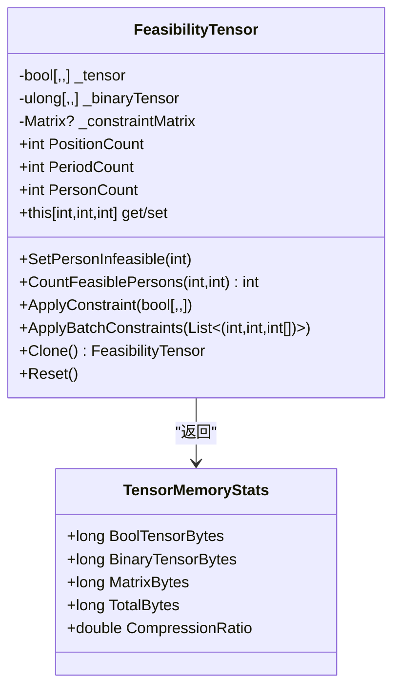
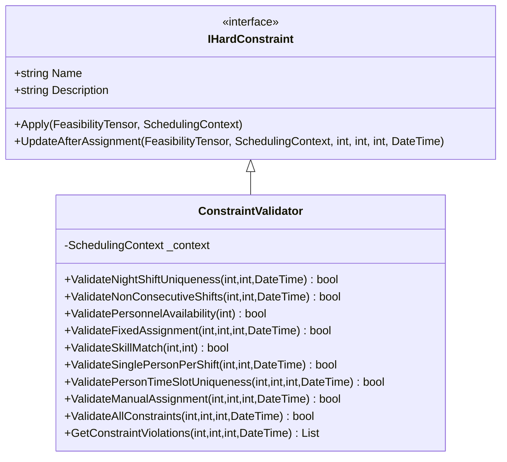
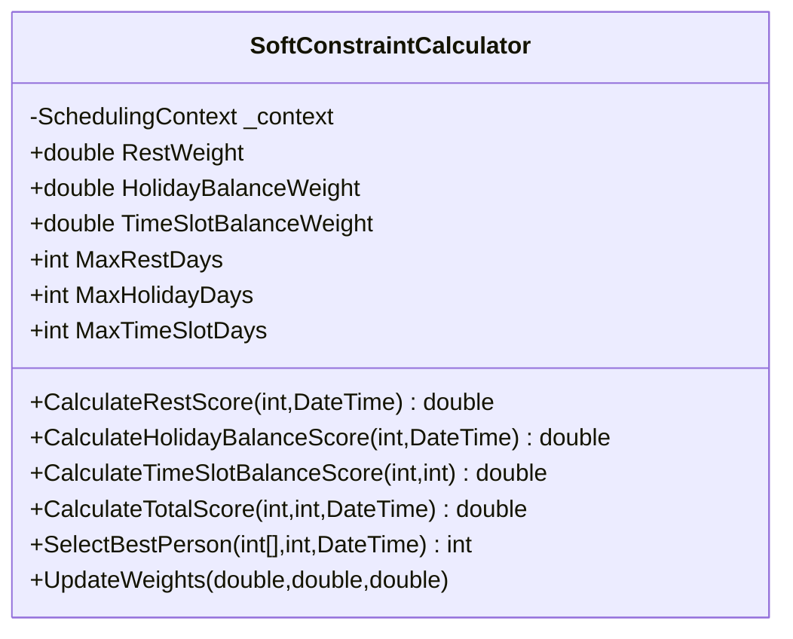
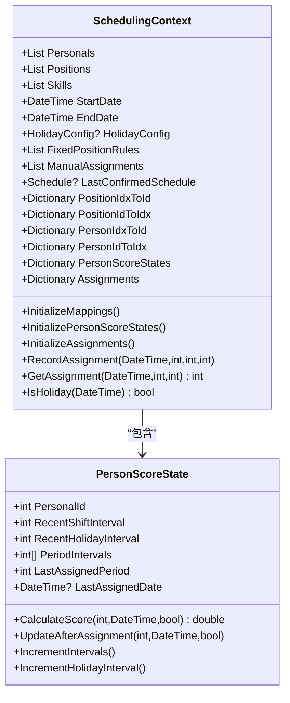
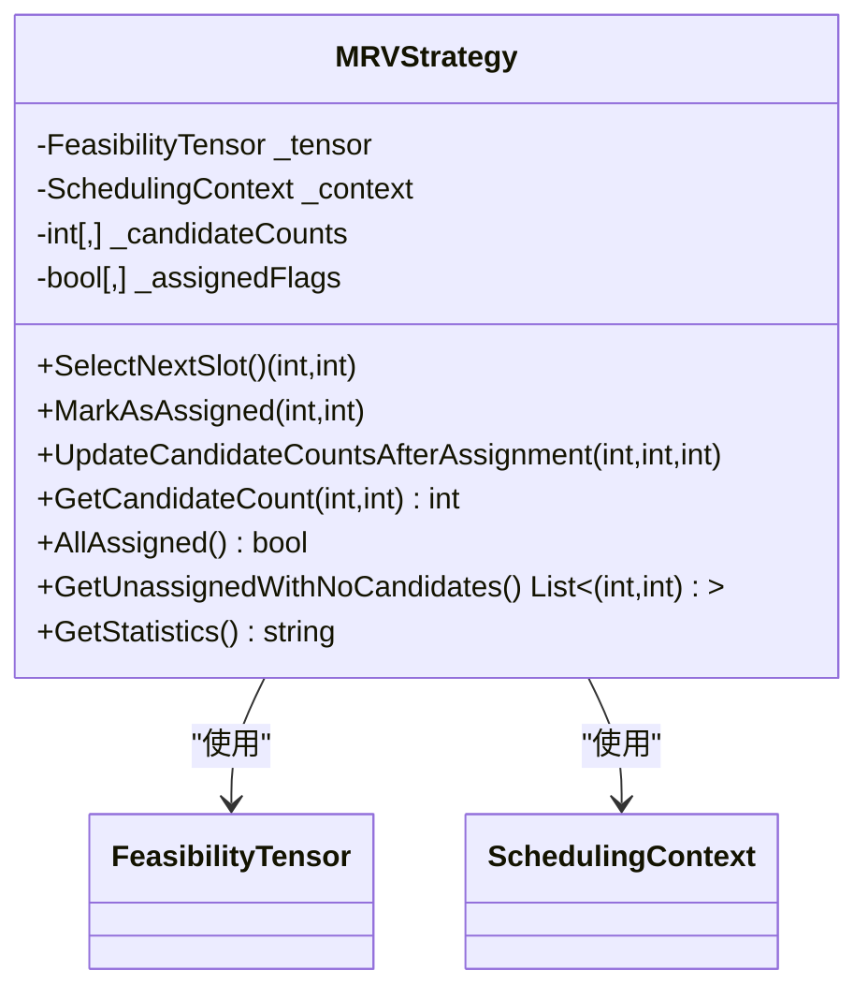
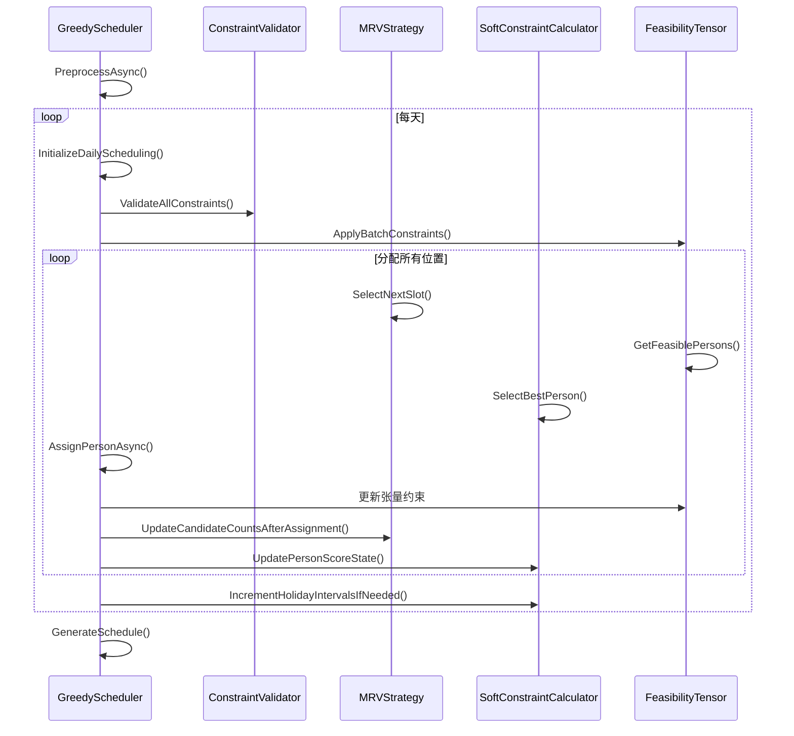
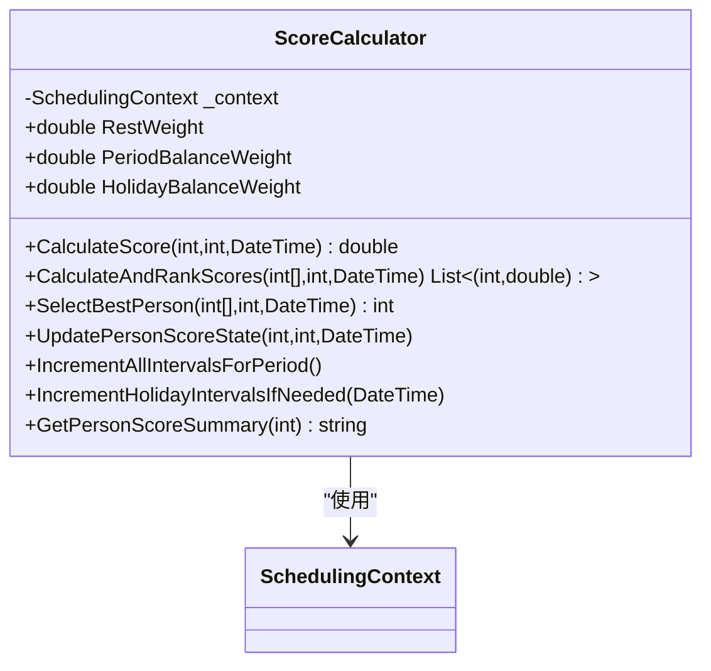
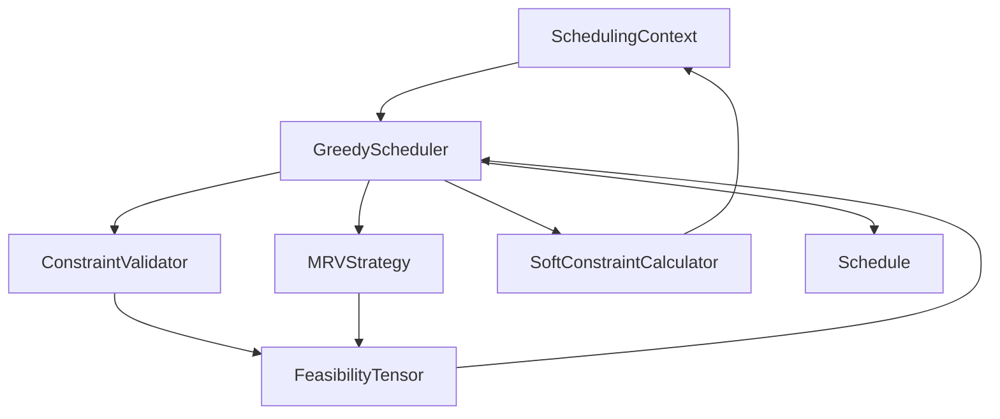

# 排班算法引擎

<cite>
**Referenced Files in This Document**   
- [FeasibilityTensor.cs](file://SchedulingEngine/Core/FeasibilityTensor.cs)
- [IHardConstraint.cs](file://SchedulingEngine/Core/IHardConstraint.cs)
- [ScoreCalculator.cs](file://SchedulingEngine/Core/ScoreCalculator.cs)
- [SchedulingContext.cs](file://SchedulingEngine/Core/SchedulingContext.cs)
- [MRVStrategy.cs](file://SchedulingEngine/Strategies/MRVStrategy.cs)
- [GreedyScheduler.cs](file://SchedulingEngine/GreedyScheduler.cs)
- [ConstraintValidator.cs](file://SchedulingEngine/Core/ConstraintValidator.cs)
- [SoftConstraintCalculator.cs](file://SchedulingEngine/Core/SoftConstraintCalculator.cs)
- [PersonScoreState.cs](file://Models/PersonScoreState.cs)
</cite>

## 目录
1. [引言](#引言)
2. [核心组件](#核心组件)
3. [可行性张量详解](#可行性张量详解)
4. [硬约束与软约束机制](#硬约束与软约束机制)
5. [调度上下文与状态管理](#调度上下文与状态管理)
6. [MRV策略与贪心调度器](#mrv策略与贪心调度器)
7. [评分计算与优化](#评分计算与优化)
8. [架构概览](#架构概览)

## 引言

本技术文档旨在深度解析排班算法引擎的内部工作原理，为算法研究人员提供足够的技术细节以理解、调试和改进核心算法。文档重点阐述了贪心调度器（GreedyScheduler）如何利用可行性张量（FeasibilityTensor）和MRV（Minimum Remaining Values）策略实现高效排班。同时，详细解释了硬约束（IHardConstraint）和软约束优化的实现机制，以及评分计算器（ScoreCalculator）如何评估排班质量。此外，文档还描述了SchedulingContext如何管理调度过程中的状态信息，确保整个排班过程的连贯性和一致性。

## 核心组件

排班算法引擎由多个核心组件构成，它们协同工作以实现高效、合规的排班。这些组件包括可行性张量（FeasibilityTensor）、调度上下文（SchedulingContext）、MRV策略（MRVStrategy）、贪心调度器（GreedyScheduler）、硬约束验证器（ConstraintValidator）、软约束计算器（SoftConstraintCalculator）和人员评分状态（PersonScoreState）。每个组件都有其特定的职责，共同构成了一个完整的排班系统。

**Section sources**
- [FeasibilityTensor.cs](file://SchedulingEngine/Core/FeasibilityTensor.cs)
- [SchedulingContext.cs](file://SchedulingEngine/Core/SchedulingContext.cs)
- [MRVStrategy.cs](file://SchedulingEngine/Strategies/MRVStrategy.cs)
- [GreedyScheduler.cs](file://SchedulingEngine/GreedyScheduler.cs)
- [ConstraintValidator.cs](file://SchedulingEngine/Core/ConstraintValidator.cs)
- [SoftConstraintCalculator.cs](file://SchedulingEngine/Core/SoftConstraintCalculator.cs)
- [PersonScoreState.cs](file://Models/PersonScoreState.cs)

## 可行性张量详解

可行性张量（FeasibilityTensor）是排班算法的核心数据结构，它是一个三维布尔张量，维度为[哨位, 时段, 人员]。该张量用于快速判断某个分配方案是否可行，通过二进制存储和逐位与运算来优化性能。张量的每个元素表示特定人员在特定哨位和时段的分配可行性，`true`表示可行，`false`表示不可行。

### 数据结构与优化

可行性张量不仅维护一个标准的三维布尔数组，还引入了二进制存储优化和MathNet.Numerics矩阵加速。二进制存储通过`ulong`数组来表示人员状态，每个`ulong`可以存储64个人员的状态，从而显著减少内存占用并提高位运算效率。MathNet.Numerics矩阵则用于批量处理约束，通过矩阵运算加速大规模约束的处理。

**Diagram sources**
- [FeasibilityTensor.cs](file://SchedulingEngine/Core/FeasibilityTensor.cs#L15-L570)

**Section sources**
- [FeasibilityTensor.cs](file://SchedulingEngine/Core/FeasibilityTensor.cs#L15-L570)

## 硬约束与软约束机制

排班算法引擎通过硬约束和软约束机制来确保排班方案的合规性和优化性。硬约束是必须满足的条件，任何违反硬约束的分配方案都是不可行的。软约束则是优化目标，用于在多个可行方案中选择最优的一个。

### 硬约束实现

硬约束通过`IHardConstraint`接口定义，所有硬约束必须实现此接口。硬约束的实现包括夜哨唯一性、时段不连续、人员可用性、定岗要求、技能匹配、单人上哨、人员时段唯一性和手动指定等。这些约束在`ConstraintValidator`类中进行综合验证，确保每次分配都符合所有硬约束。

**Diagram sources**
- [IHardConstraint.cs](file://SchedulingEngine/Core/IHardConstraint.cs#L15-L40)
- [ConstraintValidator.cs](file://SchedulingEngine/Core/ConstraintValidator.cs#L15-L338)

### 软约束优化

软约束通过`SoftConstraintCalculator`类实现，计算充分休息、休息日平衡和时段平衡得分。这些得分通过加权计算得到综合得分，用于选择最优的人员分配。软约束的权重可以通过配置进行调整，以适应不同的排班需求。

**Diagram sources**
- [SoftConstraintCalculator.cs](file://SchedulingEngine/Core/SoftConstraintCalculator.cs#L15-L283)

**Section sources**
- [IHardConstraint.cs](file://SchedulingEngine/Core/IHardConstraint.cs#L15-L40)
- [ConstraintValidator.cs](file://SchedulingEngine/Core/ConstraintValidator.cs#L15-L338)
- [SoftConstraintCalculator.cs](file://SchedulingEngine/Core/SoftConstraintCalculator.cs#L15-L283)

## 调度上下文与状态管理

调度上下文（SchedulingContext）是排班算法的全局状态管理器，它包含了排班所需的所有数据和映射关系。调度上下文负责初始化序号映射、人员评分状态和分配记录，并提供方法来记录和查询分配信息。

### 状态管理

调度上下文通过`PersonScoreStates`字典来管理每个人员的评分状态，这些状态在排班过程中不断更新。此外，调度上下文还通过`Assignments`字典来记录每天的分配情况，确保排班过程的连贯性和一致性。

**Diagram sources**
- [SchedulingContext.cs](file://SchedulingEngine/Core/SchedulingContext.cs#L15-L157)
- [PersonScoreState.cs](file://Models/PersonScoreState.cs#L15-L145)

**Section sources**
- [SchedulingContext.cs](file://SchedulingEngine/Core/SchedulingContext.cs#L15-L157)
- [PersonScoreState.cs](file://Models/PersonScoreState.cs#L15-L145)

## MRV策略与贪心调度器

MRV（Minimum Remaining Values）策略是排班算法的核心启发式策略，它优先选择候选人员最少的哨位-时段进行分配，以减少无解风险。贪心调度器（GreedyScheduler）基于MRV策略实现，通过逐步分配人员来构建排班方案。

### MRV策略

MRV策略通过`_candidateCounts`数组来缓存每个哨位-时段的候选人员数，并通过`_assignedFlags`数组来标记已分配的位置。在每次分配时，MRV策略选择候选人员最少的未分配位置，从而减少搜索空间和无解风险。

**Diagram sources**
- [MRVStrategy.cs](file://SchedulingEngine/Strategies/MRVStrategy.cs#L15-L270)

### 贪心调度器

贪心调度器通过`ExecuteAsync`方法执行排班算法，按照先哨位再时段的顺序进行人员分配。调度器在每次分配时，首先应用所有硬约束，然后使用MRV策略选择下一个分配位置，最后通过软约束评分选择最优的人员。

**Diagram sources**
- [GreedyScheduler.cs](file://SchedulingEngine/GreedyScheduler.cs#L15-L489)
- [MRVStrategy.cs](file://SchedulingEngine/Strategies/MRVStrategy.cs#L15-L270)

**Section sources**
- [MRVStrategy.cs](file://SchedulingEngine/Strategies/MRVStrategy.cs#L15-L270)
- [GreedyScheduler.cs](file://SchedulingEngine/GreedyScheduler.cs#L15-L489)

## 评分计算与优化

评分计算器（ScoreCalculator）负责计算人员在特定时段和日期的综合得分，通过软约束评分来选择最优的人员分配。评分计算器通过`CalculateScore`方法计算单个人员的得分，并通过`CalculateAndRankScores`方法对所有可行人员进行排序。

### 评分机制

评分计算器通过`CalculateRestScore`、`CalculateHolidayBalanceScore`和`CalculateTimeSlotBalanceScore`方法分别计算充分休息、休息日平衡和时段平衡得分。这些得分通过加权计算得到综合得分，用于选择最优的人员分配。

**Diagram sources**
- [ScoreCalculator.cs](file://SchedulingEngine/Core/ScoreCalculator.cs#L15-L163)

**Section sources**
- [ScoreCalculator.cs](file://SchedulingEngine/Core/ScoreCalculator.cs#L15-L163)

## 架构概览

排班算法引擎的整体架构由多个组件协同工作，形成一个高效、合规的排班系统。从调度上下文初始化到最终生成排班表，每个组件都扮演着重要的角色。

**Diagram sources**
- [GreedyScheduler.cs](file://SchedulingEngine/GreedyScheduler.cs#L15-L489)
- [SchedulingContext.cs](file://SchedulingEngine/Core/SchedulingContext.cs#L15-L157)
- [ConstraintValidator.cs](file://SchedulingEngine/Core/ConstraintValidator.cs#L15-L338)
- [MRVStrategy.cs](file://SchedulingEngine/Strategies/MRVStrategy.cs#L15-L270)
- [SoftConstraintCalculator.cs](file://SchedulingEngine/Core/SoftConstraintCalculator.cs#L15-L283)
- [FeasibilityTensor.cs](file://SchedulingEngine/Core/FeasibilityTensor.cs#L15-L570)
- [ScoreCalculator.cs](file://SchedulingEngine/Core/ScoreCalculator.cs#L15-L163)