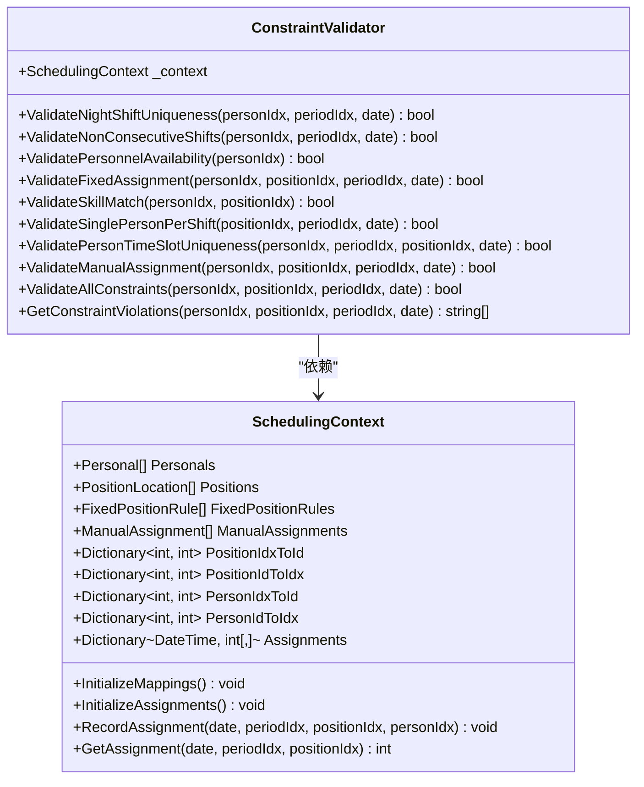
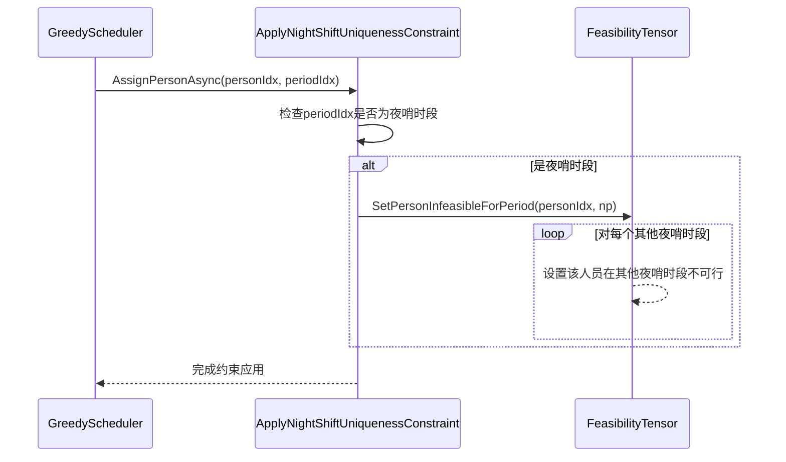
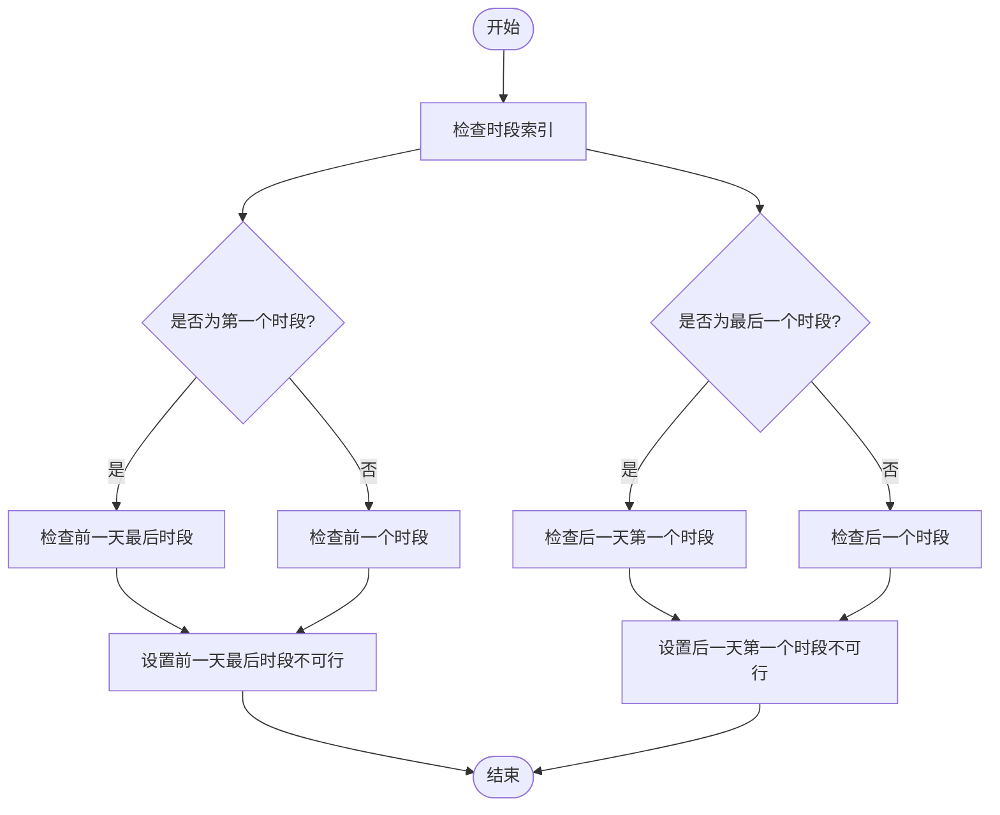
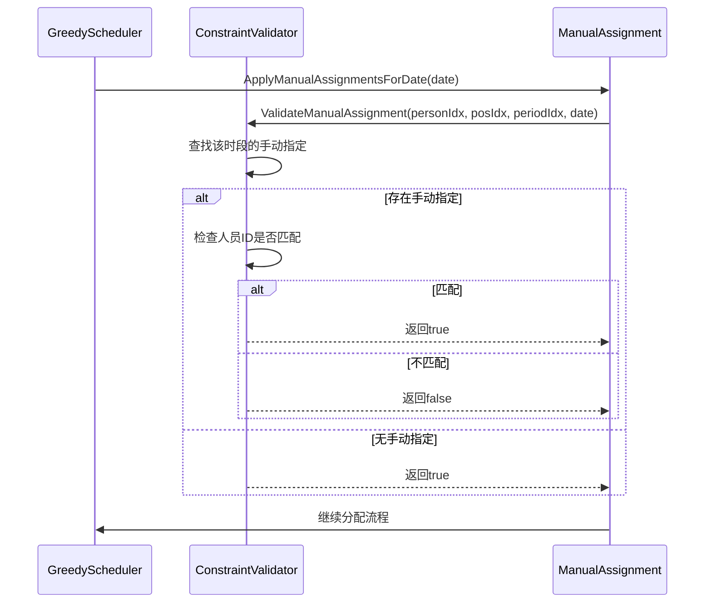
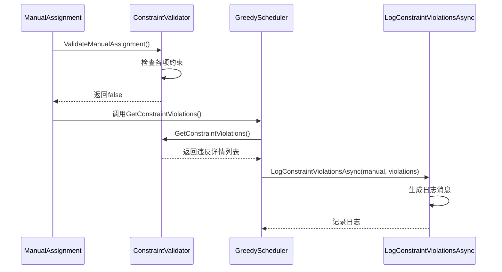
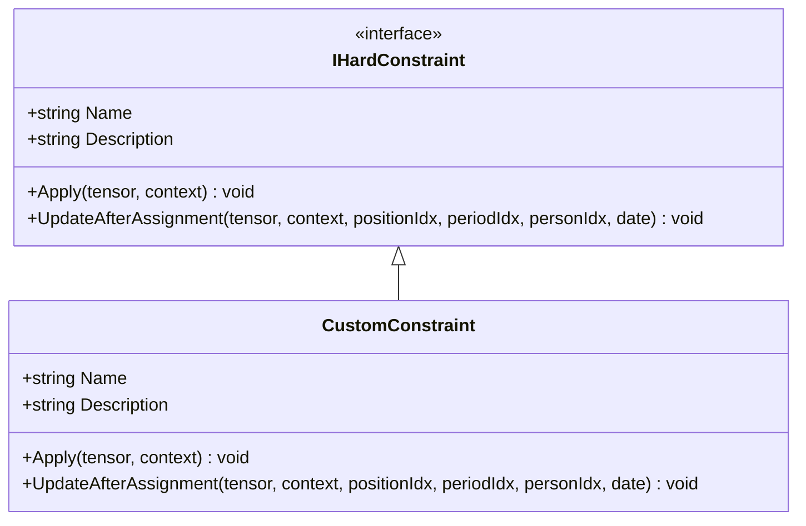

# 约束处理机制

<cite>
**本文档引用的文件**
- [IHardConstraint.cs](file://SchedulingEngine/Core/IHardConstraint.cs)
- [ConstraintValidator.cs](file://SchedulingEngine/Core/ConstraintValidator.cs)
- [GreedyScheduler.cs](file://SchedulingEngine/GreedyScheduler.cs)
- [ManualAssignment.cs](file://Models/Constraints/ManualAssignment.cs)
- [FixedPositionRule.cs](file://Models/Constraints/FixedPositionRule.cs)
- [ConstraintService.cs](file://Services/ConstraintService.cs)
</cite>

## 目录
1. [引言](#引言)
2. [硬约束与软约束处理框架](#硬约束与软约束处理框架)
3. [ConstraintValidator集成机制](#constraintvalidator集成机制)
4. [核心硬约束实现](#核心硬约束实现)
5. [手动分配冲突处理](#手动分配冲突处理)
6. [约束违反日志分析](#约束违反日志分析)
7. [自定义硬约束扩展指南](#自定义硬约束扩展指南)

## 引言
本系统采用基于约束的排班算法，通过硬约束（IHardConstraint）和软约束的协同工作确保排班方案的合法性与优化性。硬约束定义了排班必须满足的强制性条件，而软约束则用于优化排班质量。ConstraintValidator作为核心验证组件，集成了多种具体约束规则，包括FixedPositionRule、ManualAssignment等，确保人员分配的合法性。本文档将深入解析约束处理机制，为开发者提供全面的技术指导。

## 硬约束与软约束处理框架
系统采用分层约束处理架构，将硬约束和软约束分离处理。硬约束通过IHardConstraint接口定义，所有具体约束实现该接口以确保统一的调用方式。软约束则通过SoftConstraintCalculator进行评分计算，用于在满足硬约束的前提下优化排班方案。这种分离设计使得约束逻辑清晰，易于维护和扩展。

**Section sources**
- [IHardConstraint.cs](file://SchedulingEngine/Core/IHardConstraint.cs)
- [ConstraintValidator.cs](file://SchedulingEngine/Core/ConstraintValidator.cs)

## ConstraintValidator集成机制
ConstraintValidator是约束验证的核心组件，负责集成和协调各种具体约束规则。它通过SchedulingContext获取排班所需的所有数据和映射关系，包括人员、哨位、定岗规则和手动分配等。该组件提供了多种验证方法，如ValidateNightShiftUniqueness、ValidateNonConsecutiveShifts等，每个方法对应一个具体的硬约束。这些方法共同构成了完整的约束验证体系。

**Diagram sources**
- [ConstraintValidator.cs](file://SchedulingEngine/Core/ConstraintValidator.cs)
- [SchedulingContext.cs](file://SchedulingEngine/Core/SchedulingContext.cs)

**Section sources**
- [ConstraintValidator.cs](file://SchedulingEngine/Core/ConstraintValidator.cs)
- [SchedulingContext.cs](file://SchedulingEngine/Core/SchedulingContext.cs)

## 核心硬约束实现
### 夜哨唯一性约束
夜哨唯一性约束（ApplyNightShiftUniquenessConstraint）确保一个人在同一晚上只能上一个夜哨。夜哨时段定义为23:00-01:00、01:00-03:00、03:00-05:00和05:00-07:00（对应时段11、0、1、2）。当某人员被分配到一个夜哨时段时，系统会自动将其在其他夜哨时段设为不可行，防止重复分配。

**Diagram sources**
- [GreedyScheduler.cs](file://SchedulingEngine/GreedyScheduler.cs)
- [FeasibilityTensor.cs](file://SchedulingEngine/Core/FeasibilityTensor.cs)

**Section sources**
- [GreedyScheduler.cs](file://SchedulingEngine/GreedyScheduler.cs)

### 时段不连续约束
时段不连续约束（ApplyNonConsecutiveConstraint）防止一个人在相邻时段连续上哨。当某人员被分配到某个时段时，系统会自动将其在前一个和后一个时段设为不可行。对于跨日情况，系统还会检查前一天的最后时段和后一天的第一个时段，确保不会出现跨日连续上哨的情况。

**Diagram sources**
- [GreedyScheduler.cs](file://SchedulingEngine/GreedyScheduler.cs)

**Section sources**
- [GreedyScheduler.cs](file://SchedulingEngine/GreedyScheduler.cs)

## 手动分配冲突处理
手动分配（ManualAssignment）允许用户预先指定某些哨位-时段-人员的固定分配。系统通过ConstraintValidator的ValidateManualAssignment方法处理手动分配的冲突。当存在手动指定时，只有指定的人员才能被分配到该哨位时段。如果尝试分配其他人员，系统会检测到冲突并拒绝分配。此外，系统还会检查人员时段唯一性，确保同一人员不会在同一时段被分配到多个哨位。

**Diagram sources**
- [GreedyScheduler.cs](file://SchedulingEngine/GreedyScheduler.cs)
- [ConstraintValidator.cs](file://SchedulingEngine/Core/ConstraintValidator.cs)

**Section sources**
- [GreedyScheduler.cs](file://SchedulingEngine/GreedyScheduler.cs)
- [ConstraintValidator.cs](file://SchedulingEngine/Core/ConstraintValidator.cs)

## 约束违反日志分析
约束违反日志（LogConstraintViolationsAsync）为开发者提供了重要的调试价值。当手动分配违反约束时，系统会记录详细的违反信息，包括具体的违反项和相关参数。这些日志信息可以帮助开发者快速定位问题，理解约束验证的决策过程。例如，日志可能显示"手动指定违反约束: ManualAssignment[1] Pos=1 Period=0 Person=1 Date=2024-01-01 - 违反项: 该人员在此时段已有其他哨位分配"，明确指出冲突的具体原因。

**Diagram sources**
- [GreedyScheduler.cs](file://SchedulingEngine/GreedyScheduler.cs)
- [ConstraintValidator.cs](file://SchedulingEngine/Core/ConstraintValidator.cs)

**Section sources**
- [GreedyScheduler.cs](file://SchedulingEngine/GreedyScheduler.cs)
- [ConstraintValidator.cs](file://SchedulingEngine/Core/ConstraintValidator.cs)

## 自定义硬约束扩展指南
开发者可以通过实现IHardConstraint接口来创建自定义硬约束。首先，创建一个新的类实现IHardConstraint接口，定义约束的名称和描述。然后，实现Apply方法，在其中编写具体的约束逻辑。最后，在调度器中注册该约束，使其在排班过程中生效。这种扩展机制使得系统能够灵活适应不同的业务需求，而无需修改核心代码。

**Diagram sources**
- [IHardConstraint.cs](file://SchedulingEngine/Core/IHardConstraint.cs)

**Section sources**
- [IHardConstraint.cs](file://SchedulingEngine/Core/IHardConstraint.cs)