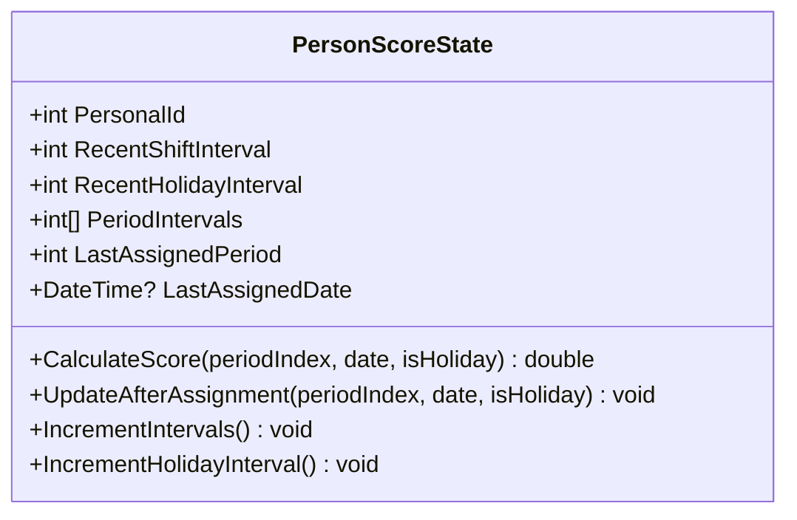
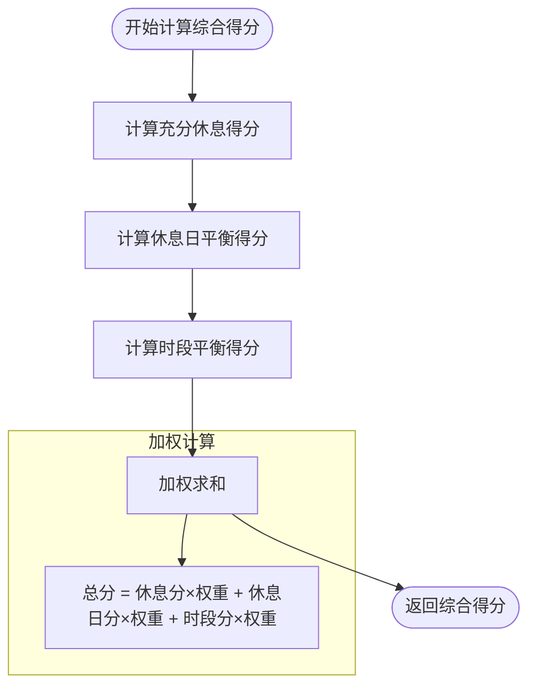
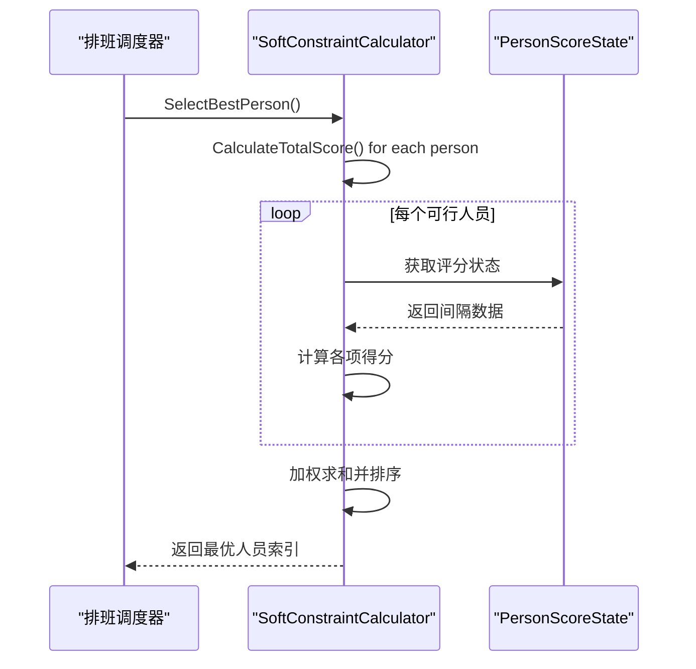

# 评分计算器

<cite>
**本文档引用的文件**   
- [ScoreCalculator.cs](file://SchedulingEngine/Core/ScoreCalculator.cs)
- [SoftConstraintCalculator.cs](file://SchedulingEngine/Core/SoftConstraintCalculator.cs)
- [PersonScoreState.cs](file://Models/PersonScoreState.cs)
- [SchedulingContext.cs](file://SchedulingEngine/Core/SchedulingContext.cs)
</cite>

## 目录
1. [引言](#引言)
2. [人员评分状态跟踪机制](#人员评分状态跟踪机制)
3. [软约束评分计算原理](#软约束评分计算原理)
4. [评分状态更新与最优人员选择](#评分状态更新与最优人员选择)
5. [权重配置分析与调优建议](#权重配置分析与调优建议)

## 引言
本系统通过ScoreCalculator和SoftConstraintCalculator组件实现智能排班决策。系统基于PersonScoreState维护人员的实时状态，通过量化休息间隔、节假日间隔和时段分配历史，结合可配置的权重参数，为每个排班任务计算最优人员分配方案。该机制有效实现了避免连续排班、均衡工作量等软约束目标。

**Section sources**
- [ScoreCalculator.cs](file://SchedulingEngine/Core/ScoreCalculator.cs#L1-L163)
- [SoftConstraintCalculator.cs](file://SchedulingEngine/Core/SoftConstraintCalculator.cs#L1-L284)

## 人员评分状态跟踪机制

系统通过PersonScoreState类跟踪每位人员的排班状态，维护多个维度的间隔计数器：

- **RecentShiftInterval**：记录距离上次班次的时段间隔数（以2小时为一个时段）
- **RecentHolidayInterval**：记录距离上次休息日班次的天数间隔
- **PeriodIntervals**：长度为12的数组，分别记录12个不同时段的间隔数
- **LastAssignedPeriod**：记录最后分配的时段序号
- **LastAssignedDate**：记录最后分配的日期

状态初始化时，系统从人员基础数据中获取初始间隔值，并整合最近一次已确认排班的历史信息，确保评分状态的连续性。

状态更新采用增量式推进机制：
- 在每个时段推进时，调用IncrementAllIntervalsForPeriod方法，将所有人员的充分休息间隔和各时段间隔加1
- 在休息日推进时，调用IncrementHolidayIntervalsIfNeeded方法，将所有人员的休息日间隔加1
- 在完成人员分配后，调用UpdatePersonScoreState方法，重置相关间隔计数器

**Diagram sources**
- [PersonScoreState.cs](file://Models/PersonScoreState.cs#L7-L143)

**Section sources**
- [PersonScoreState.cs](file://Models/PersonScoreState.cs#L7-L143)
- [SchedulingContext.cs](file://SchedulingEngine/Core/SchedulingContext.cs#L34-L76)

## 软约束评分计算原理

SoftConstraintCalculator组件基于评分状态、时段权重和节假日权重，为可行人员计算综合得分：

### 1. 充分休息得分计算
基于人员距离上次分配的时段间隔，通过以下公式计算：
- 将时段间隔转换为天数（除以12）
- 归一化到[0,1]区间，使用MaxRestDays作为最大间隔
- 若从未分配过，给予较高基础分（0.8）
- 综合考虑实际天数间隔，取较大值作为最终得分

### 2. 休息日平衡得分计算
仅在休息日排班时生效：
- 基于休息日间隔天数计算得分
- 归一化到[0,1]区间，使用MaxHolidayDays作为最大间隔
- 若从未在休息日分配过，给予较高基础分（0.8）

### 3. 时段平衡得分计算
基于12个时段的分配历史：
- 针对当前排班时段，获取对应的间隔数
- 转换为天数并归一化，使用MaxTimeSlotDays作为最大间隔

### 4. 综合得分计算
采用加权求和方式：
综合得分 = (充分休息得分 × RestWeight) + (休息日平衡得分 × HolidayBalanceWeight) + (时段平衡得分 × TimeSlotBalanceWeight)

**Diagram sources**
- [SoftConstraintCalculator.cs](file://SchedulingEngine/Core/SoftConstraintCalculator.cs#L11-L282)

**Section sources**
- [SoftConstraintCalculator.cs](file://SchedulingEngine/Core/SoftConstraintCalculator.cs#L11-L282)

## 评分状态更新与最优人员选择

### 评分状态更新流程
当完成人员分配后，系统执行以下更新操作：
1. 重置该人员的RecentShiftInterval为0
2. 重置该时段的PeriodIntervals对应元素为0
3. 若为休息日排班，重置RecentHolidayInterval为0
4. 更新LastAssignedPeriod和LastAssignedDate

此更新机制确保了"充分休息"等软约束的有效执行，避免人员被连续排班。

### 最优人员选择算法
系统提供两种选择策略：

**ScoreCalculator策略**：
- 采用简单遍历比较，选择得分最高的人员
- 时间复杂度O(n)，适用于小规模人员选择

**SoftConstraintCalculator策略**：
- 计算所有可行人员的综合得分
- 按得分降序排序，得分相同时按人员索引升序
- 选择排序后的第一名人员
- 提供批量得分详情功能，便于调试和分析

两种策略均在无可行人员时返回-1，确保系统的健壮性。

**Diagram sources**
- [ScoreCalculator.cs](file://SchedulingEngine/Core/ScoreCalculator.cs#L101-L131)
- [SoftConstraintCalculator.cs](file://SchedulingEngine/Core/SoftConstraintCalculator.cs#L159-L190)

**Section sources**
- [ScoreCalculator.cs](file://SchedulingEngine/Core/ScoreCalculator.cs#L101-L131)
- [SoftConstraintCalculator.cs](file://SchedulingEngine/Core/SoftConstraintCalculator.cs#L159-L190)

## 权重配置分析与调优建议

### 权重参数说明
系统提供以下可配置权重参数：
- **RestWeight**：充分休息得分权重，默认值1.0
- **HolidayBalanceWeight**：休息日平衡得分权重，默认值1.5
- **TimeSlotBalanceWeight**：时段平衡得分权重，默认值1.0

以及归一化参数：
- **MaxRestDays**：最大休息间隔天数，默认7天
- **MaxHolidayDays**：最大休息日间隔天数，默认30天
- **MaxTimeSlotDays**：最大时段间隔天数，默认14天

### 配置调优建议
1. **避免连续排班**：提高RestWeight权重（如2.0以上），使系统优先选择长时间未排班的人员

2. **均衡休息日工作**：提高HolidayBalanceWeight权重（如2.0），确保休息日工作分配更加均匀

3. **平衡时段分配**：调整TimeSlotBalanceWeight权重，避免某些时段过度集中在特定人员

4. **适应不同排班周期**：
   - 短周期排班：减小MaxRestDays（如3-5天）
   - 长周期排班：增大MaxHolidayDays（如60天）

5. **动态权重调整**：可根据排班阶段动态调整权重，如初期侧重充分休息，后期侧重时段平衡

6. **权重平衡原则**：建议总权重和控制在3-5之间，避免某一项得分主导选择结果

通过合理配置这些参数，可以灵活调整排班策略，满足不同场景下的业务需求。

**Section sources**
- [SoftConstraintCalculator.cs](file://SchedulingEngine/Core/SoftConstraintCalculator.cs#L240-L274)
- [ScoreCalculator.cs](file://SchedulingEngine/Core/ScoreCalculator.cs#L9-L31)