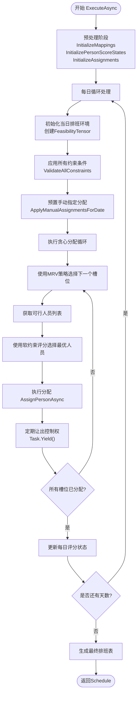

# 贪心调度器

<cite>
**本文档引用的文件**   
- [GreedyScheduler.cs](file://SchedulingEngine\GreedyScheduler.cs)
- [SchedulingContext.cs](file://SchedulingEngine\Core\SchedulingContext.cs)
- [FeasibilityTensor.cs](file://SchedulingEngine\Core\FeasibilityTensor.cs)
- [MRVStrategy.cs](file://SchedulingEngine\Strategies\MRVStrategy.cs)
- [ScoreCalculator.cs](file://SchedulingEngine\Core\ScoreCalculator.cs)
- [ConstraintValidator.cs](file://SchedulingEngine\Core\ConstraintValidator.cs)
- [SoftConstraintCalculator.cs](file://SchedulingEngine\Core\SoftConstraintCalculator.cs)
- [GreedySchedulerConfig.cs](file://SchedulingEngine\GreedyScheduler.cs)
</cite>

## 目录
1. [引言](#引言)
2. [核心组件协同机制](#核心组件协同机制)
3. [ExecuteAsync执行流程](#executeasync执行流程)
4. [AssignPersonAsync数据一致性维护](#assignpersonasync数据一致性维护)
5. [调用示例与最佳实践](#调用示例与最佳实践)
6. [算法复杂度与性能优化](#算法复杂度与性能优化)
7. [结论](#结论)

## 引言
贪心调度器（GreedyScheduler）是自动排班系统的核心算法组件，采用贪心策略结合MRV（最小剩余值）启发式方法，高效解决复杂的人员排班问题。该调度器通过协调SchedulingContext、FeasibilityTensor、MRVStrategy和ScoreCalculator等核心组件，实现了在满足多种硬约束的前提下，基于软约束评分优化人员分配。本文档详细解析其内部实现机制，为开发者提供深入的技术指导和最佳实践建议。

## 核心组件协同机制

贪心调度器通过协调多个核心组件完成排班任务，各组件职责明确，协同工作。SchedulingContext作为数据中枢，存储排班所需的所有上下文信息；FeasibilityTensor作为可行性判断引擎，高效维护分配可行性；MRVStrategy作为分配策略控制器，决定分配顺序；ScoreCalculator作为评分决策器，选择最优分配方案。


**图表来源**
- [GreedyScheduler.cs](file://SchedulingEngine\GreedyScheduler.cs#L16-L430)
- [SchedulingContext.cs](file://SchedulingEngine\Core\SchedulingContext.cs#L11-L155)
- [FeasibilityTensor.cs](file://SchedulingEngine\Core\FeasibilityTensor.cs#L11-L556)
- [MRVStrategy.cs](file://SchedulingEngine\Strategies\MRVStrategy.cs#L11-L268)
- [ScoreCalculator.cs](file://SchedulingEngine\Core\ScoreCalculator.cs#L9-L161)
- [ConstraintValidator.cs](file://SchedulingEngine\Core\ConstraintValidator.cs#L13-L337)
- [SoftConstraintCalculator.cs](file://SchedulingEngine\Core\SoftConstraintCalculator.cs#L11-L282)

**章节来源**
- [GreedyScheduler.cs](file://SchedulingEngine\GreedyScheduler.cs#L16-L430)
- [SchedulingContext.cs](file://SchedulingEngine\Core\SchedulingContext.cs#L11-L155)
- [FeasibilityTensor.cs](file://SchedulingEngine\Core\FeasibilityTensor.cs#L11-L556)
- [MRVStrategy.cs](file://SchedulingEngine\Strategies\MRVStrategy.cs#L11-L268)
- [ScoreCalculator.cs](file://SchedulingEngine\Core\ScoreCalculator.cs#L9-L161)

## ExecuteAsync执行流程

`ExecuteAsync`方法是贪心调度器的主执行入口，其执行流程严谨有序，确保了排班任务的高效完成。整个流程分为预处理、每日调度初始化、约束应用、手动分配处理和贪心分配循环五个主要阶段。



**图表来源**
- [GreedyScheduler.cs](file://SchedulingEngine\GreedyScheduler.cs#L58-L139)

**章节来源**
- [GreedyScheduler.cs](file://SchedulingEngine\GreedyScheduler.cs#L58-L139)

### 预处理阶段
预处理阶段在`PreprocessAsync`方法中完成，主要任务是初始化SchedulingContext中的各种映射关系和状态。这包括人员与哨位的ID到索引映射、人员评分状态的初始化以及分配记录的初始化。同时，该阶段还会创建ConstraintValidator和SoftConstraintCalculator实例，并根据配置设置软约束的权重。

### 每日调度初始化
每日调度初始化在`InitializeDailyScheduling`方法中执行。该方法为每一天创建一个新的FeasibilityTensor实例，这是一个三维布尔张量，用于表示[哨位, 时段, 人员]的分配可行性。张量的大小由哨位数量、12个时段和人员数量决定，并根据配置决定是否使用优化操作。

### 约束应用
约束应用在`ApplyAllConstraints`方法中完成。该方法遍历所有[哨位, 时段]组合，使用ConstraintValidator对每个可能的人员分配进行硬约束验证。验证不通过的人员将被标记为不可行，并通过`ApplyBatchConstraints`方法批量应用到FeasibilityTensor中，从而高效地排除所有违反硬约束的分配方案。

### 手动分配处理
手动分配处理在`ApplyManualAssignmentsForDate`方法中执行。该方法会查找当天所有启用的手动指定分配，并按时段顺序进行处理。对于每个手动指定，它会验证其有效性（如人员可用性、技能匹配等），并调用`AssignPersonAsync`方法执行实际的分配操作，确保手动指定的分配优先于自动分配。

### 贪心分配循环
贪心分配循环在`PerformGreedyAssignmentsAsync`方法中实现。该循环使用MRV策略选择候选人员最少的[哨位, 时段]组合，然后从可行人员列表中选择软约束得分最高的人员进行分配。这个过程会持续进行，直到所有槽位都被分配或无法找到可行分配为止。循环中会定期调用`Task.Yield()`让出控制权，避免长时间阻塞。

## AssignPersonAsync数据一致性维护

`AssignPersonAsync`方法是维护数据一致性的核心，它在执行人员分配的同时，会同步更新所有相关组件的状态，确保整个排班系统的数据一致性。


**图表来源**
- [GreedyScheduler.cs](file://SchedulingEngine\GreedyScheduler.cs#L341-L389)

**章节来源**
- [GreedyScheduler.cs](file://SchedulingEngine\GreedyScheduler.cs#L341-L389)

### 数据一致性维护流程
1.  **记录分配**：首先调用`SchedulingContext.RecordAssignment`方法，在分配记录中记录本次分配。
2.  **标记已分配**：调用`MRVStrategy.MarkAsAssigned`方法，将该[哨位, 时段]标记为已分配，防止重复分配。
3.  **更新可行性张量**：
    *   调用`FeasibilityTensor.SetOthersInfeasibleForSlot`，将该[哨位, 时段]的其他所有人员标记为不可行（单人上哨约束）。
    *   调用`FeasibilityTensor.SetOtherPositionsInfeasibleForPersonPeriod`，将该人员在当前时段的其他所有哨位标记为不可行（一人一哨约束）。
4.  **应用特定约束**：
    *   对于自动分配，调用`ApplyNonConsecutiveConstraint`，将该人员在相邻时段标记为不可行。
    *   调用`ApplyNightShiftUniquenessConstraint`，如果是夜哨时段，则将该人员在同一晚的其他夜哨时段标记为不可行。
5.  **更新MRV候选计数**：调用`MRVStrategy.UpdateCandidateCountsAfterAssignment`，根据上述约束更新所有相关[哨位, 时段]的候选人员数量。
6.  **更新评分状态**：调用`ScoreCalculator.UpdatePersonScoreState`，更新该人员的评分状态，为后续分配提供依据。
7.  **异步日志记录**：如果启用了日志记录，异步调用`LogAssignmentAsync`记录本次分配。

## 调用示例与最佳实践

### 调用示例
```csharp
// 创建调度上下文
var context = new SchedulingContext
{
    Personals = personnelList,
    Positions = positionList,
    StartDate = startDate,
    EndDate = endDate,
    LastConfirmedSchedule = lastSchedule,
    ManualAssignments = manualAssignments
};

// 配置贪心调度器
var config = new GreedySchedulerConfig
{
    RestWeight = 1.0,
    HolidayWeight = 1.5,
    TimeSlotWeight = 1.0,
    UseOptimizedTensor = true,
    EnableAssignmentLogging = true,
    YieldInterval = 10
};

// 创建并执行调度器
var scheduler = new GreedyScheduler(context, config);
var cancellationToken = new CancellationToken();
var schedule = await scheduler.ExecuteAsync(cancellationToken);
```

### 配置参数说明
| 配置参数 | 说明 | 默认值 |
| :--- | :--- | :--- |
| `RestWeight` | 充分休息得分权重 | 1.0 |
| `HolidayWeight` | 休息日平衡得分权重 | 1.5 |
| `TimeSlotWeight` | 时段平衡得分权重 | 1.0 |
| `UseOptimizedTensor` | 是否使用优化的张量操作 | true |
| `EnableAssignmentLogging` | 是否启用分配日志记录 | false |
| `LogConstraintViolations` | 是否记录约束违反日志 | true |
| `LogUnassignedSlots` | 是否记录未分配位置 | true |
| `YieldInterval` | 异步操作让出控制权的间隔 | 10 |
| `MaxRetryAttempts` | 最大重试次数 | 3 |
| `EnablePerformanceMonitoring` | 是否启用性能监控 | false |

### 日志记录与取消支持最佳实践
1.  **日志记录**：建议在开发和测试阶段启用`EnableAssignmentLogging`和`LogConstraintViolations`，以便于调试和分析排班过程。在生产环境中，可根据需要开启`LogUnassignedSlots`来监控排班结果。
2.  **取消支持**：`ExecuteAsync`方法支持`CancellationToken`，允许在长时间运行的排班任务中进行取消。建议在UI应用中使用`CancellationTokenSource`来实现用户取消操作。
3.  **性能监控**：当`EnablePerformanceMonitoring`启用时，系统会记录关键性能指标，可用于分析和优化排班算法的性能瓶颈。

**章节来源**
- [GreedyScheduler.cs](file://SchedulingEngine\GreedyScheduler.cs#L431-L489)
- [GreedyScheduler.cs](file://SchedulingEngine\GreedyScheduler.cs#L252-L278)
- [GreedyScheduler.cs](file://SchedulingEngine\GreedyScheduler.cs#L280-L300)

## 算法复杂度与性能优化

### 算法复杂度分析
贪心调度器的整体时间复杂度为O(D * P * T * N)，其中D是天数，P是哨位数量，T是时段数量（固定为12），N是人员数量。主要开销集中在`PerformGreedyAssignmentsAsync`循环中，该循环最多执行P*T次，每次选择最优人员需要O(N)的时间。

### 性能优化策略
1.  **FeasibilityTensor优化**：
    *   **二进制存储**：使用`ulong[,,] _binaryTensor`进行位操作，将布尔值的存储和运算效率提升64倍。
    *   **矩阵加速**：对于中等规模的问题，使用MathNet.Numerics的`Matrix<double>`进行批量约束应用，利用线性代数库的优化。
2.  **MRV策略优化**：`MRVStrategy`维护了一个候选人员数的缓存`_candidateCounts`，避免了每次选择时都重新计算，将选择下一个槽位的时间复杂度从O(P*T*N)降低到O(P*T)。
3.  **增量更新**：`UpdateCandidateCountsAfterAssignment`方法只更新受本次分配影响的候选计数，而不是重新计算整个缓存，大大减少了计算量。
4.  **Task.Yield使用时机**：在贪心分配循环中，每处理`YieldInterval`个槽位后调用`await Task.Yield()`，主动让出控制权，防止UI线程阻塞，保证应用响应性。这是一个关键的异步优化策略，尤其在处理大规模排班时至关重要。

**章节来源**
- [FeasibilityTensor.cs](file://SchedulingEngine\Core\FeasibilityTensor.cs#L48-L78)
- [MRVStrategy.cs](file://SchedulingEngine\Strategies\MRVStrategy.cs#L26-L35)
- [GreedyScheduler.cs](file://SchedulingEngine\GreedyScheduler.cs#L125-L139)

## 结论
贪心调度器通过精巧的设计和高效的算法，成功解决了复杂的人员排班问题。其核心在于通过SchedulingContext统一管理数据，利用FeasibilityTensor高效维护可行性，借助MRV策略减少搜索空间，并通过ScoreCalculator实现基于软约束的优化决策。`AssignPersonAsync`方法确保了数据的一致性，而`Task.Yield`的使用则保证了良好的用户体验。通过合理配置`GreedySchedulerConfig`，开发者可以灵活调整排班策略，满足不同的业务需求。该实现为构建高效、可靠的自动排班系统提供了坚实的基础。