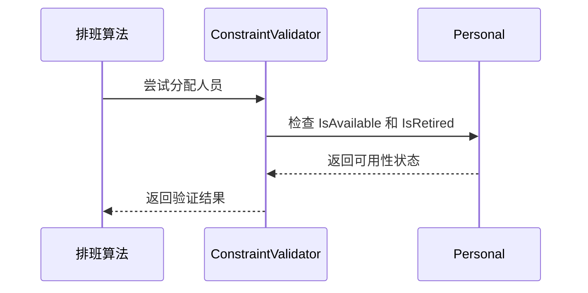
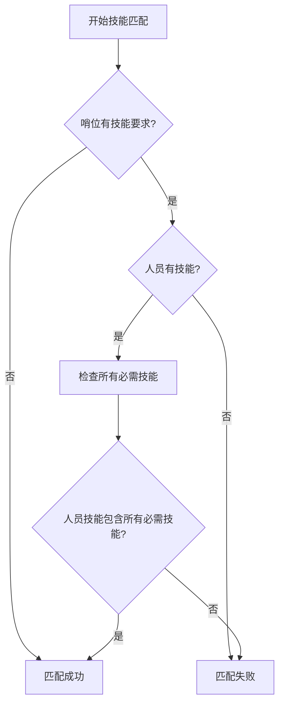
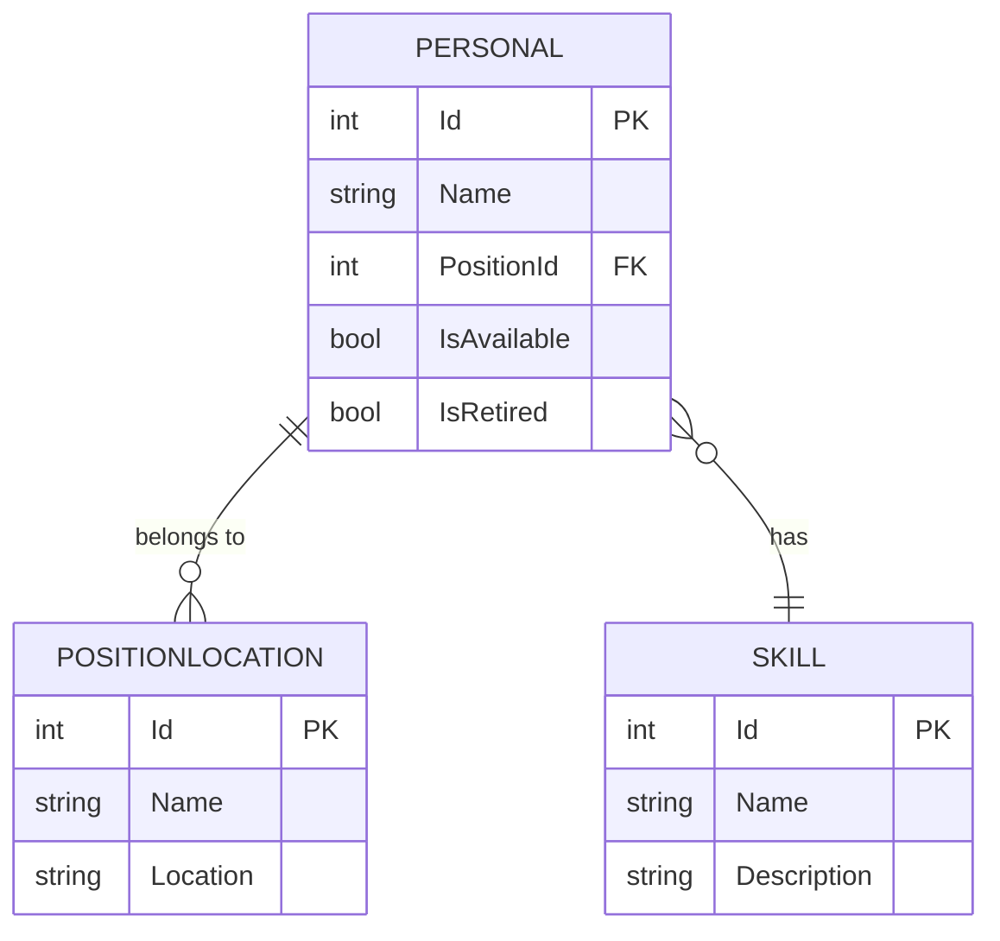

# 人员模型

<cite>
**Referenced Files in This Document**   
- [Personal.cs](file://Models/Personal.cs)
- [PersonnelService.cs](file://Services/PersonnelService.cs)
- [PersonnelMapper.cs](file://DTOs/Mappers/PersonnelMapper.cs)
- [PositionLocation.cs](file://Models/PositionLocation.cs)
- [Skill.cs](file://Models/Skill.cs)
- [SchedulingContext.cs](file://SchedulingEngine/Core/SchedulingContext.cs)
- [ConstraintValidator.cs](file://SchedulingEngine/Core/ConstraintValidator.cs)
</cite>

## 目录
1. [简介](#简介)
2. [核心属性与业务含义](#核心属性与业务含义)
3. [在排班算法中的作用](#在排班算法中的作用)
4. [关联模型关系](#关联模型关系)
5. [数据验证规则](#数据验证规则)
6. [时间戳管理机制](#时间戳管理机制)

## 简介
`Personal` 模型是自动排班系统中的核心数据实体，用于表示人员的基本信息。该模型不仅存储人员的静态属性（如姓名、职位），还包含动态的排班状态信息（如可用性、技能、历史排班间隔），是排班算法进行人员筛选、匹配和分配决策的基础。本文档将全面解析该模型的结构、业务逻辑及其在整个系统中的关键作用。

**Section sources**
- [Personal.cs](file://Models/Personal.cs#L1-L81)

## 核心属性与业务含义
`Personal` 模型定义了人员的完整信息，其核心属性具有明确的业务含义：

- **Id**: 数据库主键，唯一标识一个人员记录。
- **Name**: 人员姓名，是必填项，长度限制在1-100个字符之间。
- **PositionId**: 关联的职位ID，指向 `PositionLocation` 模型，用于确定人员的岗位归属。
- **SkillIds**: 人员拥有的技能ID集合，是一个 `List<int>`，用于与哨位的技能要求进行匹配。
- **IsAvailable**: 布尔值，表示人员当前是否可用于排班。
- **IsRetired**: 布尔值，表示人员是否已退役或离职，用于逻辑删除。
- **RecentShiftIntervalCount**: 整数，记录人员最近的班次间隔计数，用于排班算法中的公平性评分。
- **RecentHolidayShiftIntervalCount**: 整数，记录人员最近在节假日的班次间隔计数，用于节假日排班的公平性控制。
- **RecentPeriodShiftIntervals**: 一个长度为12的整数数组，对应一天中的12个时段（每2小时一个时段），用于记录人员在每个时段最近的排班间隔，是实现时段均衡排班的关键数据。

**Section sources**
- [Personal.cs](file://Models/Personal.cs#L11-L78)

## 在排班算法中的作用
`Personal` 模型是排班算法的核心输入，其属性在算法中扮演着至关重要的角色。

### 人员可用性管理
排班算法通过 `IsAvailable` 和 `IsRetired` 属性来筛选可用人员。在 `ConstraintValidator` 类中，`ValidatePersonnelAvailability` 方法会检查这两个属性，确保只有在职且可用的人员才会被考虑分配班次。

**Diagram sources**
- [ConstraintValidator.cs](file://SchedulingEngine/Core/ConstraintValidator.cs#L200-L210)
- [Personal.cs](file://Models/Personal.cs#L45-L50)

### 技能匹配
排班算法的核心功能之一是确保人员技能与哨位要求相匹配。`Personal` 模型的 `SkillIds` 属性与 `PositionLocation` 模型的 `RequiredSkillIds` 属性进行比对。`ConstraintValidator` 中的 `ValidateSkillMatch` 方法会遍历哨位所需的技能ID，检查人员是否拥有所有必需的技能。

**Diagram sources**
- [ConstraintValidator.cs](file://SchedulingEngine/Core/ConstraintValidator.cs#L230-L250)
- [Personal.cs](file://Models/Personal.cs#L35-L40)
- [PositionLocation.cs](file://Models/PositionLocation.cs#L50-L55)

### 间隔计数器的应用
`RecentShiftIntervalCount`、`RecentHolidayShiftIntervalCount` 和 `RecentPeriodShiftIntervals` 这些属性被 `SchedulingContext` 类用来初始化 `PersonScoreState` 对象。这些状态信息是软约束评分器（`SoftConstraintCalculator`）计算人员分配优先级的基础，确保排班结果在时间分布上更加公平和均衡。

**Section sources**
- [SchedulingContext.cs](file://SchedulingEngine/Core/SchedulingContext.cs#L100-L115)
- [ConstraintValidator.cs](file://SchedulingEngine/Core/ConstraintValidator.cs#L180-L270)

## 关联模型关系
`Personal` 模型与系统中的其他核心模型存在紧密的关联关系。

### 与 PositionLocation 模型的关系
`Personal.PositionId` 是一个外键，直接关联到 `PositionLocation.Id`。这种一对多的关系表示一个职位可以有多个人员，而一个人员只能属于一个职位。`PersonnelService` 在创建或更新人员时，会通过 `ValidatePositionIdAsync` 方法验证 `PositionId` 的有效性。

### 与 Skill 模型的关系
`Personal.SkillIds` 是一个集合，存储了该人员所拥有的所有技能的ID。这形成了一个多对多的关系：一个人员可以拥有多个技能，一个技能也可以被多个人员拥有。`PersonnelService` 在创建或更新人员时，会通过 `ValidateSkillIdsAsync` 方法验证这些技能ID在数据库中是否存在。

**Diagram sources**
- [Personal.cs](file://Models/Personal.cs)
- [PositionLocation.cs](file://Models/PositionLocation.cs)
- [Skill.cs](file://Models/Skill.cs)

**Section sources**
- [PersonnelService.cs](file://Services/PersonnelService.cs#L150-L175)

## 数据验证规则
`Personal` 模型在数据层和应用层都实施了严格的数据验证规则，以确保数据的完整性和一致性。

### 模型层验证
在 `Personal` 类的定义中，使用了数据注解（Data Annotations）来声明验证规则：
- `[Required]`: `Name` 属性为必填项。
- `[StringLength(100, MinimumLength = 1)]`: `Name` 属性长度必须在1到100个字符之间。
- `[Range(0, int.MaxValue)]`: `RecentShiftIntervalCount` 和 `RecentHolidayShiftIntervalCount` 必须为非负整数。

### 服务层验证
`PersonnelService` 类在业务逻辑层进行了更复杂的验证：
- **创建验证 (`ValidateCreateDto`)**: 检查姓名长度（不超过50字符）、技能列表非空、间隔数在0-999范围内。
- **更新验证 (`ValidateUpdateDto`)**: 与创建验证类似，但不验证 `IsRetired` 的默认值。
- **业务规则验证**: 通过 `ValidatePositionIdAsync` 和 `ValidateSkillIdsAsync` 方法，确保 `PositionId` 和 `SkillIds` 引用的实体在数据库中真实存在。

**Section sources**
- [Personal.cs](file://Models/Personal.cs#L20-L30)
- [PersonnelService.cs](file://Services/PersonnelService.cs#L100-L130)

## 时间戳管理机制
`Personal` 模型包含 `CreatedAt` 和 `UpdatedAt` 两个时间戳属性，用于记录数据的创建和最后修改时间。

### 自动管理
这两个时间戳的管理是自动化的：
- **创建时间 (`CreatedAt`)**: 在 `PersonnelMapper` 将 `CreatePersonnelDto` 转换为 `Personal` 模型时，会自动将 `CreatedAt` 设置为 `DateTime.UtcNow`。
- **更新时间 (`UpdatedAt`)**: 每次创建或更新人员时，`PersonnelMapper` 都会将 `UpdatedAt` 设置为当前的UTC时间。

这种机制确保了时间戳的准确性和一致性，无需在业务逻辑中手动维护。

**Section sources**
- [PersonnelMapper.cs](file://DTOs/Mappers/PersonnelMapper.cs#L100-L120)
- [Personal.cs](file://Models/Personal.cs#L70-L75)