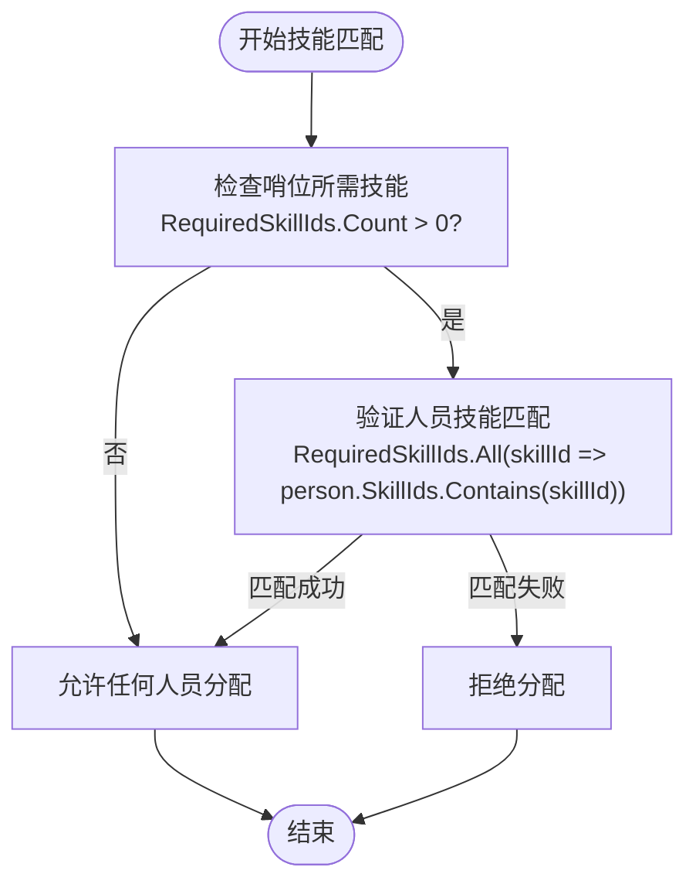
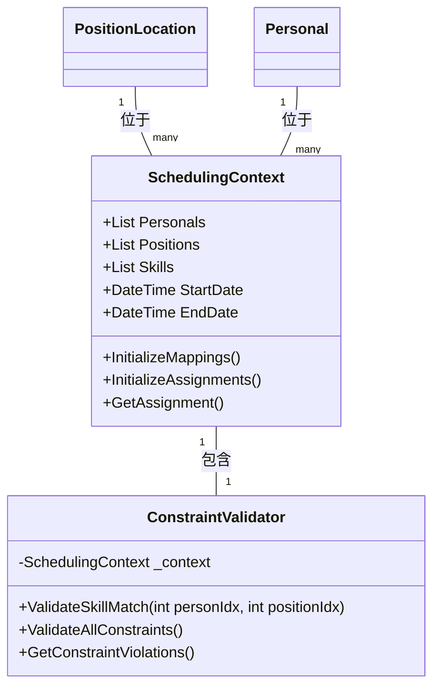
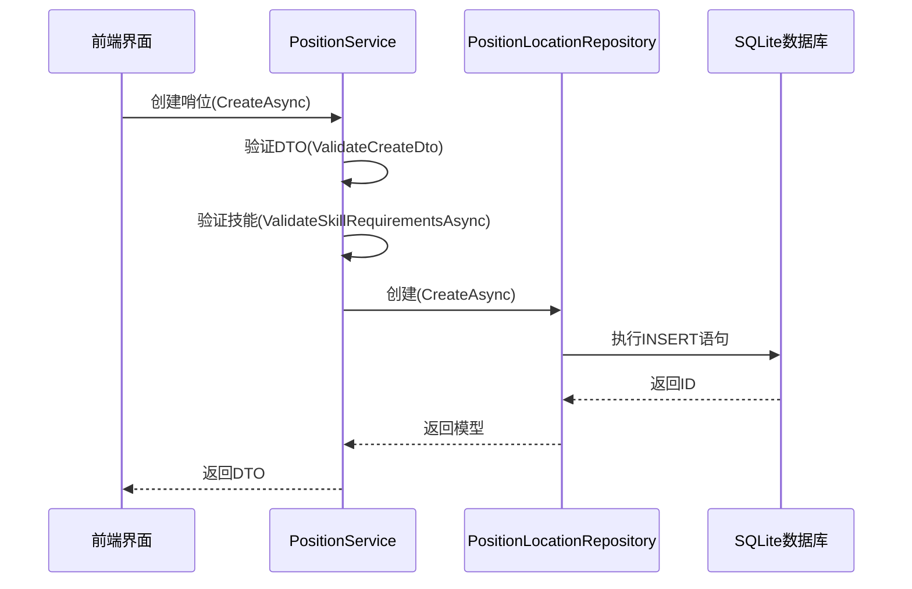

# 哨位模型

<cite>
**Referenced Files in This Document**  
- [PositionLocation.cs](file://Models/PositionLocation.cs)
- [ConstraintValidator.cs](file://SchedulingEngine/Core/ConstraintValidator.cs)
- [SchedulingContext.cs](file://SchedulingEngine/Core/SchedulingContext.cs)
- [PositionLocationRepository.cs](file://Data/PositionLocationRepository.cs)
- [PositionService.cs](file://Services/PositionService.cs)
</cite>

## Table of Contents
1. [哨位模型概述](#哨位模型概述)
2. [核心字段定义与业务意义](#核心字段定义与业务意义)
3. [技能匹配机制](#技能匹配机制)
4. [调度逻辑与状态控制](#调度逻辑与状态控制)
5. [数据持久化与验证](#数据持久化与验证)
6. [协同工作模型](#协同工作模型)

## 哨位模型概述

哨位模型（PositionLocation）是排班系统中的核心数据实体，用于定义和管理组织内各个岗位的基本信息与调度要求。该模型不仅包含岗位的静态属性（如名称、地点、描述），还通过技能要求和激活状态等动态属性，为自动化排班算法提供关键的决策依据。模型设计遵循数据完整性原则，通过字段长度限制和时间戳自动生成机制确保数据质量。

**Section sources**
- [PositionLocation.cs](file://Models/PositionLocation.cs#L11-L68)

## 核心字段定义与业务意义

哨位模型包含多个关键字段，每个字段都承载着特定的业务含义和技术约束：

- **Id**: 数据库主键，唯一标识每个哨位。
- **Name**: 哨位名称，最大长度限制为100字符，必填项，用于标识岗位。
- **Location**: 哨位地点，最大长度限制为200字符，用于描述岗位物理位置。
- **Description**: 哨位介绍，最大长度500字符，提供岗位的详细说明。
- **Requirements**: 哨位要求，最大长度1000字符，以文本形式描述岗位的特殊要求。
- **RequiredSkillIds**: 哨位所需技能ID集合，用于算法快速匹配，存储为JSON数组。
- **IsActive**: 布尔值，表示哨位是否启用，影响调度逻辑。
- **CreatedAt/UpdatedAt**: 时间戳，记录哨位的创建和最后更新时间，自动生成。

这些字段共同构成了哨位的完整画像，为排班系统提供必要的信息支持。

**Section sources**
- [PositionLocation.cs](file://Models/PositionLocation.cs#L11-L68)

## 技能匹配机制

### RequiredSkillIds字段的作用

`RequiredSkillIds`字段是排班匹配过程中的核心要素，它存储了该哨位所需的技能ID列表。在调度算法执行时，系统会检查候选人员的技能是否完全覆盖哨位的技能要求。

**Diagram sources**
- [ConstraintValidator.cs](file://SchedulingEngine/Core/ConstraintValidator.cs#L155-L188)

**Section sources**
- [ConstraintValidator.cs](file://SchedulingEngine/Core/ConstraintValidator.cs#L155-L188)

### 技能匹配验证流程

技能匹配验证由`ConstraintValidator`类的`ValidateSkillMatch`方法实现。该方法接收人员和哨位的索引，通过比对`RequiredSkillIds`和人员的`SkillIds`来判断是否满足匹配条件。如果哨位没有技能要求，则允许任何人员分配。

## 调度逻辑与状态控制

### IsActive状态的影响

`IsActive`字段直接影响哨位的调度逻辑。当`IsActive`为`false`时，该哨位将不会被纳入排班计算，相当于从调度池中移除。这一机制允许管理员临时停用某些岗位，而无需删除数据。

### 排班匹配流程

排班匹配是一个多约束验证过程，`ConstraintValidator`会综合检查包括技能匹配、人员可用性、时段冲突等多个硬约束。只有当所有约束都满足时，才会进行人员分配。

**Diagram sources**
- [SchedulingContext.cs](file://SchedulingEngine/Core/SchedulingContext.cs#L11-L155)
- [ConstraintValidator.cs](file://SchedulingEngine/Core/ConstraintValidator.cs#L13-L337)

**Section sources**
- [SchedulingContext.cs](file://SchedulingEngine/Core/SchedulingContext.cs#L11-L155)
- [ConstraintValidator.cs](file://SchedulingEngine/Core/ConstraintValidator.cs#L13-L337)

## 数据持久化与验证

### 数据库操作

哨位数据通过`PositionLocationRepository`进行持久化操作。该仓储实现了CRUD功能，并使用JSON序列化存储`RequiredSkillIds`列表。数据库表结构包含所有字段，并设置了适当的约束。

### 业务验证

`PositionService`在创建和更新哨位时执行严格的业务验证，包括：
- 字段长度检查（Name≤100, Location≤200）
- 必填项验证
- 技能ID存在性验证
- 技能ID重复性检查

**Diagram sources**
- [PositionService.cs](file://Services/PositionService.cs#L65-L120)
- [PositionLocationRepository.cs](file://Data/PositionLocationRepository.cs#L25-L55)

**Section sources**
- [PositionService.cs](file://Services/PositionService.cs#L65-L120)
- [PositionLocationRepository.cs](file://Data/PositionLocationRepository.cs#L25-L55)

## 协同工作模型

### 与Personal和Skill模型的协同

哨位模型与`Personal`和`Skill`模型共同构成了排班系统的核心三元组。`SchedulingContext`将这三个模型的数据整合在一起，为调度算法提供完整的上下文。

- **Personal模型**: 包含人员基本信息和`SkillIds`列表
- **Skill模型**: 定义技能的名称和描述
- **PositionLocation模型**: 定义岗位要求和`RequiredSkillIds`

在排班过程中，系统通过比对`PositionLocation.RequiredSkillIds`和`Personal.SkillIds`来实现技能匹配，确保人员具备岗位所需的所有技能。

**Section sources**
- [PositionLocation.cs](file://Models/PositionLocation.cs#L11-L68)
- [Personal.cs](file://Models/Personal.cs#L11-L78)
- [Skill.cs](file://Models/Skill.cs#L10-L50)